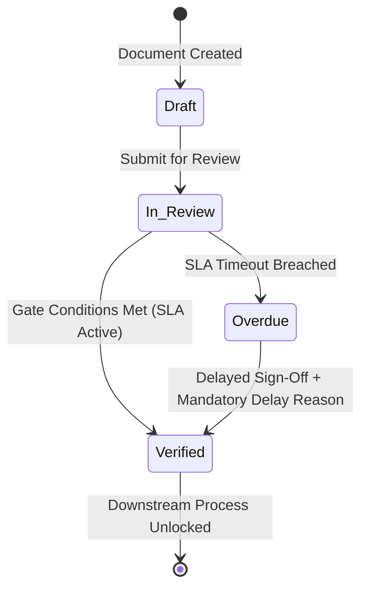

# 02_STEP_PLANNING_SPECIFICATION_BLUEPRINT.md

# Enterprise Specification Standard: The Canonical Step Planning Blueprint & Knowledge Handoff

## 1. Architectural Philosophy: The Step Planning Standard

In enterprise software engineering, complex business solutions cannot be developed reliably without exhaustive, deterministic planning. Monolithic plans fail because they obscure module boundaries, gloss over verification gates, and leave integration points undefined.

This document establishes the **authoritative, reusable Step Planning Specification Template**. Whenever an architect or engineering team plans any distinct lifecycle step or module—regardless of business domain—they must produce a dedicated specification document adhering strictly to the **Canonical 9-Section Blueprint** defined below.

---

## 2. The Canonical 9-Section Step Planning Blueprint

Every step planning document must contain these nine mandatory sections:

```
┌─────────────────────────────────────────────────────────────────────────────┐
│                   THE CANONICAL 9-SECTION STEP BLUEPRINT                    │
├─────────────────────────────────────────────────────────────────────────────┤
│ 1. Step Scope, Objectives & Context Traceability                            │
│ 2. Stakeholders, Enterprise Actors & HRMS Role Mapping                      │
│ 3. Relational Schema & 3NF Data Dictionary                                  │
│ 4. State Machine, Verification Gates & SLA Engine                           │
│ 5. Controller Logic, Domain Services & Whitelisted APIs                     │
│ 6. Frontend UI/UX Specification (Desk & Vue 3 / Frappe UI)                  │
│ 7. Cross-App Integration Touchpoints (ERPNext, CRM, HRMS, External APIs)    │
│ 8. Automated Testing & QA Criteria (Unit & IntegrationTestCase)             │
│ 9. Operational SOP, Error Resolution & Runbook                              │
└─────────────────────────────────────────────────────────────────────────────┘
```

---

### Section 1: Step Scope, Objectives & Context Traceability

- **Lifecycle Positioning:** Where does this step sit in the global process flow? What precedes it, and what follows it?
- **Business Objectives:** What tangible business metrics (KPIs) does this step optimize (e.g., cycle time reduction, cash-flow protection, margin error elimination)?
- **Context Traceability:** Explicit cross-referencing to external requirements, PRDs, BRDs, or functional specifications.
- **Failure Modes Addressed:** What operational risks, communication silos, or manual bottlenecks in the legacy process are eliminated by this step?

---

### Section 2: Stakeholders, Enterprise Actors & HRMS Role Mapping

Enterprise systems involve distinct personas. This section establishes the complete actor matrix:

- **Enterprise Roles:** Define each business role participating in this step.
- **Frappe System Roles:** Exact Frappe Role names (`Role Profile`, `User Permission`).
- **Frappe HRMS `Employee` Mapping:** How system users correlate to organizational designations and departments in Frappe HRMS (`tabEmployee`, `tabDesignation`, `tabDepartment`).
- **Permission Hierarchy:** Matrix of Read, Write, Create, Submit, Cancel, Amend, and Export permissions per role.

> [!IMPORTANT]
> **Enterprise Persona & Role Naming Standard (Zero "User" Suffix Rule):**  
> When defining enterprise roles, Frappe system roles, and operational personas for any lifecycle step or module (Lead, Sales, Survey, Design, Procurement, Stores, Accounts, Project Execution, O&M, etc.), **never use generic `User` suffixes** (such as `Lead User`, `Sales User`, `Survey User`, `Site User`, `Project User`, `Store User`).
>
> Always employ precise functional enterprise descriptors:
>
> - **`Representative`:** Frontline commercial or customer-facing personas (e.g., `Lead Representative`, `Sales Representative`, `Procurement Representative`).
> - **`Engineer`:** Technical, surveying, design, or field execution specialists (e.g., `Survey Engineer`, `Solar Design Engineer`, `Project Engineer`, `Commissioning Engineer`, `O&M Engineer`).
> - **`Assistant`:** Operational support and line execution personnel (e.g., `Survey Assistant`, `Store Assistant`, `Accounts Assistant`).
> - **`Manager` / `Officer` / `Auditor`:** Governance, compliance, and approval authorities (e.g., `Area Sales Manager`, `Commercial Manager`, `Liaisoning Officer`, `Site Survey Auditor`, `Store Manager`).

| Persona / Business Actor | Frappe System Role     | HRMS Designation | Access Level      | Primary Responsibility             |
| :----------------------- | :--------------------- | :--------------- | :---------------- | :--------------------------------- |
| `[Field Auditor]`        | `Survey Engineer`      | `Site Auditor`   | Read/Write Own    | On-site data capture & uploads     |
| `[Technical Lead]`       | `Engineering Approver` | `Lead Engineer`  | Read/Write/Submit | Validation, calculations, sign-off |
| `[Department Manager]`   | `Operations Manager`   | `Regional Head`  | Full Regional     | Reassignment, SLA override, audit  |

---

### Section 3: Relational Schema & 3NF Data Dictionary

Define all relational entities with zero ambiguity:

1. **Core DocType Extensions:** Explicit table of all `custom_*` fields added to standard ERPNext, CRM, or HRMS DocTypes via fixtures.
2. **Standalone Custom DocTypes:** New domain DocTypes created within the custom app.
3. **Child Tables:** Sub-tables for line items, document checklists, parametric logs, or audit entries.

For every DocType, specify:

- **Naming Strategy:** Autoname pattern (`naming_series:`, `field:`, `format:`, `hash`).
- **Submittable Semantics:** Is `is_submittable: 1` required (legal/transactional immutability), or is it a mutable workflow document?
- **Field-Level Data Dictionary:**

| Fieldname             | Label        | Fieldtype  | Options / Target           | Mandatory | Unique / Index | Description & Rules         |
| :-------------------- | :----------- | :--------- | :------------------------- | :-------: | :------------: | :-------------------------- |
| `custom_project_code` | Project Code | `Link`     | `Project`                  |    Yes    |    Index: 1    | Foreign key reference       |
| `stage_status`        | Status       | `Select`   | `Draft\nPending\nVerified` |    Yes    |    Index: 1    | Lifecycle state             |
| `net_amount`          | Net Amount   | `Currency` | `Company:currency`         |    Yes    |       -        | Precision-managed amount    |
| `verification_date`   | Verified On  | `Datetime` | -                          |    No     |       -        | Timestamp of gate clearance |

---

### Section 4: State Machine, Verification Gates & SLA Engine

- **State Machine Diagram:** Mermaid state diagram displaying every valid state, event trigger, and transition path.
- **Hard Verification Gates:** Conditions that MUST be satisfied before a document transitions to the next state or before downstream processes are unlocked.
- **SLA & Turnaround Time (TAT) Engine:**
  - Expected duration computation (e.g., `creation + 48h`).
  - Real-time countdown tracking.
  - Escalation policy when SLA expires (automatic status transition to `Overdue`, alert dispatch).
- **Exception & Delay Logging:** If a deadline is breached or a gate is overridden, enforce mandatory entry into an audit log table (e.g. `Remark Delay Log` capturing user, timestamp, delay reason category, and detailed remarks).



---

### Section 5: Controller Logic, Domain Services & Whitelisted APIs

Apply strict Single Responsibility and DRY principles:

1. **DocType Controller Lifecycle:**
   - `before_insert()`: Defaults, geocoding initialization, preliminary validation.
   - `validate()`: Defensive business invariant verification, gate constraints.
   - `on_submit()`: Immutable freeze, downstream trigger dispatch.
   - `on_cancel()`: Reversal logic, downstream cancellation check.
2. **Domain Service Layer:**
   - Isolate business calculations, SLA algorithms, and integration formatting into pure service classes (e.g. `StageCalculationService`, `StageSLAService`).
   - Controllers call services; services never access `frappe.form_dict` or request objects.
3. **Whitelisted API Endpoints:**
   - Strictly declare HTTP methods: `@frappe.whitelist(methods=["POST"])` for mutations.
   - Parameter type hints and DTO structures.
   - In-method authorization: Assert `doc.check_permission("read")` or `"write"` immediately after fetching.

```python
# API Endpoint Template
@frappe.whitelist(methods=["POST"])
def verify_stage_gate(doc_name: str, verification_payload: str) -> dict:
    if not doc_name:
        frappe.throw(_("Document name is required"), frappe.ValidationError)

    doc = frappe.get_doc("Custom DocType", doc_name)
    doc.check_permission("write")

    payload = json.loads(verification_payload)
    result = StageVerificationService.execute_verification(doc, payload)
    return {"status": "success", "data": result}
```

---

### Section 6: Frontend UI/UX Specification

Define both Desk and custom frontend experiences:

- **Frappe Desk Integration:**
  - Standard Form view configuration: Section breaks, column layouts, custom buttons (`frm.add_custom_button`).
  - List view indicators, color badges, and filter defaults.
  - Client scripts: Dynamic field filtering, real-time form event handlers (`frappe.ui.form.on`).
- **Custom Vue 3 + Frappe UI Single Page App (If Applicable):**
  - Route definitions (e.g. `/app/portal/stage/:id`).
  - Mobile responsive layouts (touch-friendly targets, mobile camera triggers, GPS capture).
  - Stepper component: Visual progress bar displaying stage timestamps, active badges, and document references.
  - State management via Pinia and typed data fetching via `createResource`.

---

### Section 7: Cross-App Integration Touchpoints

Map exact data synchronization across Frappe apps:

- **ERPNext Core:**
  - How this step links to `Customer`, `Supplier`, `Item`, `BOM`, `Sales Order`, `Purchase Order`, `Stock Entry`, or `Project`.
  - Accounting impact: Does this step generate GL entries or Payment Entries?
  - Stock impact: Does this step create Stock Ledger entries or allocate serial numbers?
- **Frappe CRM:**
  - Bidirectional sync mechanisms (e.g., synchronizing stage status between CRM Lead/Deal and ERPNext records).
  - Automated communication logging (capturing sent proposals, emails, or status messages in CRM activity logs).
- **Frappe HRMS:**
  - Attributing actions to `Employee` records.
  - Integrating with `Employee Checkin` for field staff location stamping and attendance validation.
- **External Services & Integrations:**
  - Third-party REST/Webhook interfaces (SMS gateways, WhatsApp Business API, mapping services, statutory portals).
  - Secure credential retrieval via `frappe.conf.get()`.

---

### Section 8: Automated Testing & QA Criteria

Every planned step must specify a deterministic test suite:

- **Test Class Pattern:** Subclass `frappe.tests.utils.FrappeTestCase` or modern `frappe.testing.IntegrationTestCase`.
- **Zero-Commit Rule:** Tests run inside managed transactions that roll back automatically upon test completion (`frappe.db.rollback()`). Never call `frappe.db.commit()` in unit tests.
- **Mandatory Test Cases:**
  1. _Happy Path:_ Complete end-to-end creation, gate validation, submission, and downstream trigger.
  2. _Gate Rejection:_ Attempting to transition or submit when verification conditions are incomplete (must raise `ValidationError`).
  3. _Permission & IDOR:_ Unauthorized user attempting to read or mutate the document (must raise `PermissionError`).
  4. _SLA Expiration & Delay Enforcement:_ Transitioning past SLA threshold with and without delay reasons.
  5. _Cross-App Sync:_ Asserting linked ERPNext/CRM/HRMS records are updated correctly upon lifecycle events.

---

### Section 9: Operational SOP, Error Resolution & Runbook

Two-tier handoff documentation ready for immediate operational deployment:

- **End-User Standard Operating Procedure (SOP):**
  - Numbered, step-by-step instructions for the business user.
  - Clear entry criteria and expected exit results.
- **Frequently Encountered Operational Errors:**

| Error Message Displayed              | Root Cause                      | Operator Resolution                               |
| :----------------------------------- | :------------------------------ | :------------------------------------------------ |
| `Verification Gate Incomplete`       | Required checklist rows missing | Upload all mandatory documents and re-verify      |
| `SLA Expired: Delay Reason Required` | SLA timer exceeded 48 hours     | Enter categorized delay explanation before saving |
| `Not Permitted`                      | Missing system role             | Request role assignment from Administrator        |

- **Technical Incident Runbook (For DevOps & L3 Engineers):**
  - Symptom presentation and triage steps.
  - Primary log inspection target (`tabError Log`, Redis queue inspect).
  - Safe remediation and unblocking commands.

---

## 3. Definition-of-Done Rollup Checklist

A lifecycle step plan or implementation is NOT complete until every item on this checklist is satisfied:

| Check                                                                                    | Governing File | Verification Method       |
| :--------------------------------------------------------------------------------------- | :------------: | :------------------------ |
| Core ERPNext/CRM/HRMS responsibilities respected; zero reinvention of standard modules   |      `01`      | Architecture Review       |
| Relational schema designed in 3NF with explicit fieldtypes, autoname, and search indexes |      `03`      | Schema Audit              |
| State transitions governed by server-side verification gates and SLA engines             |   `01`, `03`   | Controller Validation     |
| APIs declare strict HTTP methods (`methods=["POST"]`) and defensive permission checks    |      `04`      | Semgrep / Code Review     |
| Logic decoupled into pure domain service classes; zero fat controllers                   |      `05`      | SOLID Audit               |
| Bulk queries batch-loaded with projection; zero N+1 query loops                          |      `06`      | Query Profiling / EXPLAIN |
| Automated integration tests written and passing with 100% gate coverage                  |      `07`      | CI Pipeline Runner        |
| Complete 9-section step specification and user SOP finalized                             |      `02`      | Documentation Gate        |
