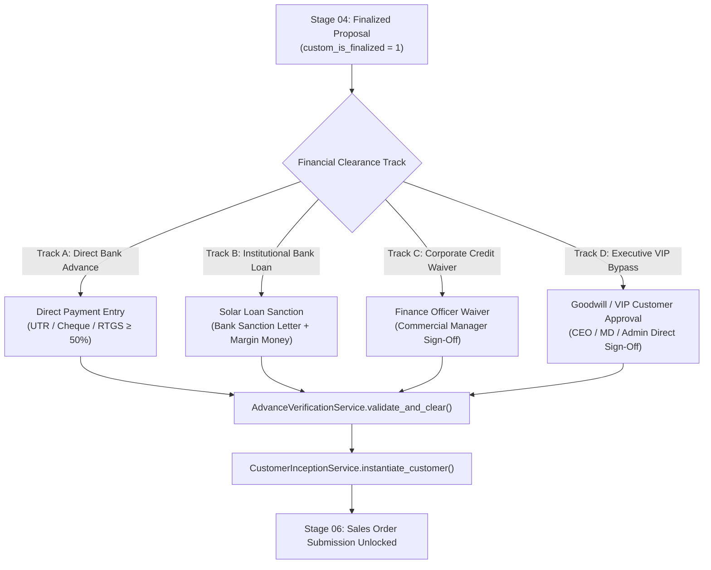

# ADR-005: Advance Payment Clearance & Customer Master Inception Gate Architecture

## Status

Accepted

## Date

2026-09-23

## Context

In the Sadbhav Solar EPC Enterprise ERP platform (`solar_module`), Stage 05 (**Advance Clearance & Customer Master Inception Gate**) serves as the supreme financial and legal bridge between commercial sales proposals (Stage 04: `Quotation` aliased as `Proposal`) and physical project execution / procurement (Stage 06: `Sales Order` and Stage 07: `Delivery Note`).

Under the legacy operating model and unstandardized ERP implementations, several severe architectural deficiencies and operational risks plagued this stage:

1. **Working Capital Exposure & Unfunded Commitments:** Sales orders were frequently confirmed and materials dispatched before securing client financial commitment. In solar EPC projects, equipment costs (PV modules, string inverters, galvanized mounting structures) constitute 65–75% of total contract value. Committing procurement or field teams without verifiable financial advance regularly resulted in stranded inventory, bad debts, and severe cash flow crunches.
2. **Premature Customer Master Pollution (Quarantine Violation):** In violation of clean ledger principles (established in ADR-001), prospective leads were frequently converted into ERPNext `Customer` masters prematurely during initial inquiry or proposal drafting. This bloated the core accounting ledger and customer directory with dead leads, non-converting contacts, and unverified GSTINs, corrupting receivables aging and marketing metrics.
3. **Arbitrary Advance Thresholds & Missing Admin Governance:** Advance requirements were determined ad-hoc by sales agents, often discounted to negligible token amounts ($< 10\%$) without executive visibility. The organization lacked an Admin-controlled central policy defining standard advance requirements (e.g. $\ge 50\%$) that automatically propagates into customer-facing proposals while maintaining a strict financial gate.
4. **Unstructured Financing & Bank Loan Realities:** A substantial proportion of residential rooftop solar projects under national schemes (such as PM Surya Ghar: Muft Bijli Yojana) and commercial installations are funded via institutional bank loans (e.g. SBI Surya Ghar loan, PNB, Canara Bank, IREDA, Bank of Baroda). In these transactions, cash advance is replaced by a formal Bank Loan Sanction Letter combined with a customer-paid margin money receipt. The legacy system had no structured schema or validation engine to process bank loan sanctions.
5. **Duplicate Financial References & Fraud Vulnerability:** Bank transaction references (NEFT/RTGS UTR numbers and cheque serials) were captured in free-text fields without database indexing or uniqueness validation. Sales or accounts personnel could inadvertently or maliciously reuse the same UTR number to clear multiple proposals or sales orders.
6. **Executive VIP & Strategic Goodwill Gridlock:** Strict automated financial gates frequently created friction when dealing with high-priority enterprise clients, government PSUs, or VIP accounts personally guaranteed by the Managing Director, CEO, or business owners. The system lacked an authorized, audit-logged executive bypass mechanism.
7. **Downstream Execution Leaks:** In the absence of an enforced server-side verification gate on `Sales Order` submission, project managers and dispatch coordinators regularly bypassed accounts clearance, booking materials and releasing dispatches without formal financial clearance.

---

## Decision

We have established the following authoritative architectural standards for Stage 05:

### 1. Admin-Governed Advance Policy ($\ge 50\%$ Default) with Automated Proposal Propagation

To guarantee working capital solvency while maintaining centralized executive governance:

- **Admin Central Governance (`Solar Advance Settings`):** The standard required advance percentage is configured centrally by the `Admin` role in `Solar Advance Settings` (or `Solar Proposal Settings`), defaulting to **50.0%**.
- **Automated Propagation into Proposals:** When a proposal is generated in Stage 04 (`Quotation`), the system reads the Admin setting and automatically populates `custom_required_advance_pct` (50%) and computes `custom_required_advance_amount` ($\text{Gross Net Total} \times 50\%$).
- **Enforced Clearance Criteria:** Stage 05 clearance mandates that verified financial receipts must satisfy `Total Advance Received` $\ge$ `Proposal Required Advance Amount` (minimum 50% default) before project execution can proceed.

### 2. Quad-Track Financial Clearance Architecture

To support diverse solar financing models without compromising financial rigor, Stage 05 implements four discrete, mutually exclusive clearance tracks:

- **Track A (Direct Advance Receipt):** The standard commercial track. Ingests payment via ERPNext `Payment Entry` (`Receive`). Requires verified receipt of $\ge 50\%$ (or proposal advance amount) via bank transfer, cheque, or payment gateway.
- **Track B (Institutional Bank Loan Sanction):** For projects financed under PM Surya Ghar or green energy banking schemes. Ingests bank loan sanction letter, bank loan account number, sanctioned amount, and proof of customer margin money payment via a dedicated submittable DocType: `Solar Loan Sanction`.
- **Track C (Finance Deferred Waiver):** For corporate, industrial, or institutional clients with established credit terms or formal purchase guarantees. Authorized exclusively by `Accounts Manager` with mandatory justification and collateral/PO attachment.
- **Track D (Executive Goodwill / VIP Customer Approval):** Direct executive authorization granted exclusively by the **Managing Director, CEO, or Project Supreme `Admin`**. Bypasses cash and bank loan advance requirements entirely, immediately unlocking downstream project mobilization while logging complete audit attribution.

### 3. ERPNext `Payment Entry` Extension & UTR Uniqueness Gate

To leverage standard ERPNext accounting ledgers without data re-entry:

- **Core Ledger Extension:** Extends ERPNext standard `Payment Entry` (`tabPayment Entry`) with custom solar tracking fields (`custom_is_solar_advance`, `custom_proposal_reference`, `custom_lead_reference`, `custom_utr_cheque_no`).
- **Server-Side UTR Uniqueness Gate:** All bank reference numbers (`custom_utr_cheque_no`) are indexed via B-Tree (`tabPayment Entry(custom_utr_cheque_no)`). Before booking or verifying an advance payment, `AdvanceVerificationService` checks across all submitted `Payment Entry` records. Any duplicate reference is rejected with a blocking `frappe.DuplicateEntryError`.
- **Automatic General Ledger (GL) Booking:** When the advance payment entry is submitted, ERPNext standard GL entries (`Debit: Bank Account`, `Credit: Customer Advance Account / Debtors`) are posted automatically, guaranteeing audit compliance.

### 4. Standalone Submittable DocType: `Solar Loan Sanction` (`tabSolar Loan Sanction`)

To handle bank-financed solar projects with statutory rigor:

- **Entity Model:** Standalone, submittable DocType (`is_submittable = 1`) maintaining foreign links to `Lead`, `Quotation`, and `Bank`.
- **Data Captured:** Lending bank name, bank branch, loan application number, sanction letter reference number, sanction date, total sanctioned loan amount, required customer margin money, and PDF attachment of the official bank sanction letter.
- **Two-Condition Verification:** Unlocking Stage 05 via Track B requires:
  1. `Solar Loan Sanction` document submitted with status `Approved`.
  2. Verified receipt of required customer margin money via linked `Payment Entry` (if applicable).

### 5. Atomic Programmatic Customer Inception (`CustomerInceptionService`)

In strict accordance with the **Strict Customer Quarantine Principle** (ADR-001):

- **Quarantine Break Point:** Stage 05 is the **single, exclusive lifecycle event** where the prospective lead is converted into a formal ERPNext `Customer` master.
- **Tiered Precedence Strategy (Data Resolution Hierarchy):** Initial Stage 01 (`tabLead`) data is often informal, incomplete, or unverified. In contrast, Stage 02 (`tabSite Survey`) captures on-site ground truth (DISCOM electricity bill, GPS coordinates, physical site address), and Stage 04 (`tabQuotation` / Proposal) establishes verified commercial and billing truth. `CustomerInceptionService` applies a strict tiered resolution strategy:
  1. **Legal Customer Name:** `Quotation.customer_name` $\rightarrow$ `Site Survey.consumer_name` $\rightarrow$ `Lead.lead_name` / `Lead.company_name`.
  2. **Primary Contact (Mobile & Email):** `Quotation.contact_mobile` / `email` $\rightarrow$ `Site Survey.contact_mobile` / `email` $\rightarrow$ `Lead.mobile_no` / `email_id`.
  3. **Site & Billing Address:** `Site Survey.site_address` & GPS coordinates (`latitude`, `longitude`, `pincode`, `city`, `state`) $\rightarrow$ `Quotation.shipping_address` $\rightarrow$ `Lead.custom_address`.
  4. **DISCOM Attributes:** `Site Survey.consumer_no`, `electricity_board`, `sanctioned_load` $\rightarrow$ `Lead.custom_consumer_no`.
- **Single ACID Database Transaction:** Upon financial clearance (Track A, B, C, or D), `CustomerInceptionService.instantiate_customer_master()` executes an atomic database operation:
  1. **Customer Master (`tabCustomer`):** Creates standard `Customer` with verified legal name, group, territory, GSTIN, PAN, and solar attributes (`custom_discom_consumer_no`, `custom_sanctioned_load_kw`, `custom_lead_reference`).
  2. **Primary Address (`tabAddress`):** Generates official Billing and Shipping address records populated from Stage 02 `Site Survey` (address, city, state, pincode, GPS latitude/longitude), bound via `tabDynamic Link`.
  3. **Primary Contact (`tabContact`):** Generates contact record with verified 10-digit mobile phone (`mobile_no`) and email, bound via `tabDynamic Link`.
  4. **Lead Conversion (`tabLead`):** Programmatically transitions `tabLead.status = 'Converted'` and sets `tabLead.customer = new_customer_id`.
  5. **Quotation & Payment Association (Retroactive Linkage):** Re-links `Quotation.custom_customer = new_customer_id` and updates submitted `Payment Entry` records (`party_type = 'Customer'`, `party = new_customer_id`).
- **Retroactive Linkage Flow Rationale:** Re-linking payment entries from `Lead` to `Customer` ensures ERPNext General Ledger (`tabGL Entry`) accurately records customer advances and balances under Accounts Receivable. Crucially, updating `Quotation.custom_customer` allows seamless downstream creation of `Sales Order`.
- **Unbroken Thread of Identity (`custom_lead_reference`):** Re-linking does **not** sever Lead traceability. Every downstream entity—`Customer`, `Payment Entry`, `Sales Order`, `Delivery Note` (Stage 07: Material Dispatch), `Project` (Stage 08: Installation), and `Liaisoning And Synchronization` (Stage 10: Grid Sync)—maintains an indexed `custom_lead_reference`. This enables the 11-Stage Interactive Progress Bar (`GET /api/method/solar_module.api.lead.get_lead_progress`) to dynamically query and visualize all 11 lifecycle stages, active badges, and historical timestamps directly within the Sales / CRM workbench.
- **Idempotency Guarantee:** If the inception service is triggered multiple times for the same proposal, it detects the existing `Customer` link and returns the existing master without creating duplicates.

### 6. Non-Bypassable Server-Side Gate on `Sales Order` Submission

To eliminate downstream execution leaks:

- **Server-Side Assertion (`SalesOrder.validate()` & `on_submit()`):** When submitting `Sales Order` in Stage 06, the controller asserts:
  $$\text{custom\_advance\_verified} == 1 \quad \lor \quad \text{custom\_loan\_sanction\_verified} == 1 \quad \lor \quad \text{custom\_goodwill\_approved} == 1$$
- If financial clearance is missing, the submission is aborted with a blocking `frappe.ValidationError` indicating: _"Cannot submit Sales Order: Project has not achieved Stage 05 Financial Advance Clearance or Executive Goodwill Approval."_

### 7. SLA / TAT Engine & Mandatory Delay Audit Logging

To maintain velocity across the commercial-to-finance handoff:

- **24-Hour Verification SLA:** When a proposal is marked finalized in Stage 04 (`custom_is_finalized = 1`), an SLA clock of **24 hours** activates for the `Accounts Assistant` / `Accounts Manager` to verify advance receipts.
- **Overdue Transition & Delay Logging:** If 24 hours elapse without financial verification, the stage status transitions to `Overdue`. Clearance cannot subsequently be recorded without selecting a mandatory delay reason category and entering detailed remarks into `tabRemark-Delay Log`.

---

## Alternatives Considered

### 1. Manual Customer Master Creation by Sales Representatives

- **Pros:** Frontline sales agents can create customer records at will.
- **Cons:** Violates ADR-001; bloats the general ledger with unqualified inquiries; creates rampant duplicates with varying spellings and missing tax IDs; breaks quarantine.
- **Rejected:** Customer master creation must be programmatic, atomic, and gated strictly by Stage 05 financial clearance.

### 2. Hardcoded 20% Advance Floor in Source Code

- **Pros:** Enforces a rigid minimal cash baseline.
- **Cons:** Inflexible for enterprise business governance; fails to match corporate strategy requiring a standard 50% advance for residential rooftop turnkey projects; prevents administrative tuning across market segments.
- **Rejected:** User explicitly directed that `Admin` must decide the advance policy (defaulting to 50%), automatically populating proposals while governing Stage 05 clearance.

### 3. Custom Standalone Advance Entity instead of ERPNext `Payment Entry`

- **Pros:** Completely isolated schema independent of core accounts modules.
- **Cons:** Duplicates ERPNext's General Ledger, bank reconciliation, payment modes, and multi-currency engine; requires writing custom accounting posting logic.
- **Rejected:** Extend ERPNext's native `Payment Entry` with custom solar metadata while preserving core accounting integrity.

---

## Consequences

### Positive

- **100% Working Capital Protection:** Eliminates unfunded material procurement and labor mobilization by enforcing a verified 50% advance (or formal loan/waiver) before Sales Order execution.
- **Immaculate Master Ledger Integrity:** Preserves the core ERPNext `Customer` directory from lead contamination; customer entities represent exclusively paying, legally committed clients.
- **Complete Financing Flexibility:** Standardizes institutional bank financing (PM Surya Ghar / SBI / IREDA) via structured `Solar Loan Sanction` tracking.
- **Zero UTR Duplicate Frauds:** Indexed B-Tree uniqueness on bank transaction numbers blocks accidental or deliberate double-booking of receipts.
- **Executive Goodwill Governance:** Enables CEO, MD, and Admin to fast-track VIP and strategic institutional clients with transparent digital audit trails.
- **Zero Downstream Leaks:** Server-side gate in `Sales Order` controller prevents bypassing accounts clearance.

### Negative / Trade-Offs

- **Inter-Departmental Dependency:** Frontline sales cannot unilaterally launch projects; requires action from Accounts or executive leadership, introducing a potential handoff bottleneck. Mitigated by the 24-hour enforced SLA clock and automated escalation alerts.
- **Schema Density on `tabPayment Entry`:** Requires adding custom fields to standard ERPNext payment records. Mitigated by clean section breaks and role-based field permissions.
