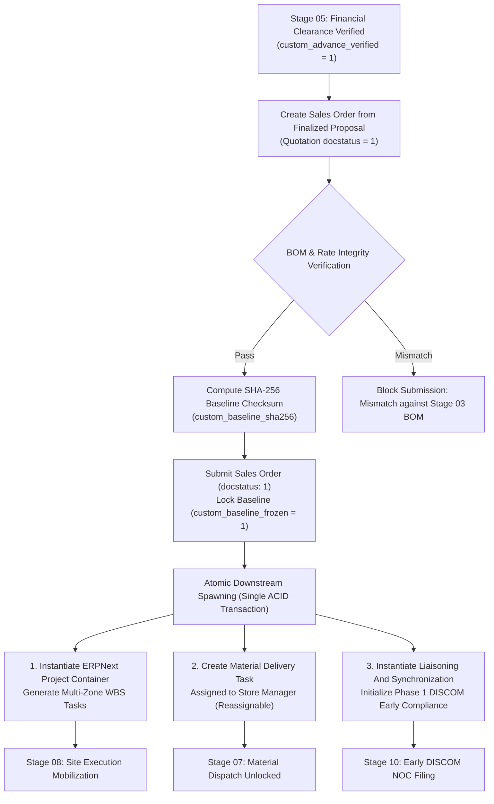

# ADR-006: Sales Order Commercial Baseline Freeze & Downstream Operational Spawning Architecture

## Status

Accepted

## Date

2026-09-23

## Context

In the Sadbhav Solar EPC Enterprise ERP platform (`solar_module`), Stage 06 (**Sales Order Master Baseline Anchor & Downstream Spawning**) represents the single most decisive operational pivot in the entire lifecycle. It forms the authoritative bridge between the commercial sales pipeline (Stage 04 Proposal and Stage 05 Advance Clearance) and physical project execution, procurement, logistics, and statutory compliance (Stage 07 Material Dispatch, Stage 08 Site Installation, and Stage 10 Statutory Liaisoning).

Under legacy practices and unstandardized ERP implementations, multiple critical operational risks and data disconnects compromised solar EPC execution:

1. **Uncontrolled Scope Creep & Commercial Drift:** After contract signing, informal customer requests, engineering redesigns, or pricing negotiations frequently altered item quantities, equipment ratings, or delivery scopes without formal change management. This eroded project gross margins (regularly causing 5–12% margin slippage) and created disputes during final billing.
2. **Disconnected Project Kickoff & Execution Silos:** Upon commercial sign-off, sales teams communicated order details via emails or spreadsheets to project managers, warehouse storekeepers, and liaisoning officers. This manual handoff led to significant kickoff delays (often 5–10 days), missing technical specifications, and unaligned project timelines.
3. **Store & Inventory Blindspots (Dispatch Delays):** Store and warehouse teams were unaware of pending material requirements until the project site urgently demanded panels, inverters, and structures. The lack of an immediate, formal material delivery task assigned to warehouse leadership upon order confirmation prevented advance staging, stock allocation, and timely procurement requisitions.
4. **Delayed Statutory Filings (DISCOM Grid Connectivity):** Solar grid-connected systems require early DISCOM feasibility approvals, NOCs, and load sanctions. Because liaisoning teams were notified only after physical site delivery, DISCOM paperwork lagged, delaying net-metering approvals and statutory grid synchronization (Stage 10) by months.
5. **Lack of Cryptographic Audit Integrity:** Legacy systems allowed post-submission modification of sales orders or relied on basic change logs that failed to prove whether the bill of materials (BOM) issued to the field was identical to the one finalized by the design engineer in Stage 03 and agreed by the customer in Stage 04.
6. **Premature Execution without Financial Solvency:** Sales orders were frequently submitted on verbal promises, bypassing accounts clearance and triggering material commitments before customer advance payments or bank loan sanctions were verified.

---

## Decision

We have established the following authoritative architectural standards for Stage 06:

### 1. Standard ERPNext `Sales Order` Extension as the Single Commercial Project Anchor

Rather than inventing a redundant custom DocType, Stage 06 extends ERPNext's standard `tabSales Order` (`is_submittable = 1`) as the immutable commercial anchor for solar projects:

- **Inherited Core Ledger Mechanics:** Leverages ERPNext's battle-tested accounts receivable, currency management, taxes and charges, and standard sales analytics.
- **Custom Solar EPC Namespace:** All domain-specific attributes are added via the clean `custom_*` prefix in `solar_module` (e.g., `custom_is_solar_order`, `custom_baseline_sha256`, `custom_system_capacity_kw`, `custom_project_reference`, `custom_liaisoning_reference`).
- **Parent-Child Integrity:** Items in `tabSales Order Item` map directly to the frozen engineering bill of materials (`custom_quot_bom`) established in Stage 03.

### 2. Cryptographic Commercial Baseline Freeze (SHA-256 Integrity Engine)

To eradicate unbudgeted scope creep and guarantee non-repudiation:

- **Immutable Baseline Checksum:** Upon pre-submission validation, `SalesOrderBaselineService` computes a deterministic SHA-256 hash (`custom_baseline_sha256`) over all core commercial and technical attributes:
  $$\text{SHA-256} = \text{Hash}\left( \text{Customer} + \text{Capacity kW} + \sum (\text{Item Code} \parallel \text{Qty} \parallel \text{Rate} \parallel \text{BOM Hash}) + \text{Payment Terms} \right)$$
- **Submission Lockout:** Upon `Sales Order` submission (`docstatus: 1`), `custom_baseline_frozen` is set to `1`, recording `custom_baseline_frozen_on` and `custom_baseline_frozen_by`.
- **Zero In-Place Mutation:** Once frozen, items, quantities, and rates cannot be altered. Any project scope change requires a formal, Admin-governed contract amendment procedure with full historical auditability.

### 3. Atomic Triple Downstream Operational Spawning

To eliminate execution silos and achieve sub-24-hour operational kickoff, submitting a `Sales Order` (`on_submit`) programmatically triggers an atomic database transaction that instantiates three downstream operational entities:

#### A. ERPNext `Project` Container & Multi-Zone WBS Generation (`ProjectSpawnerService`)

- Creates an operational `Project` record (`tabProject`) linked bidirectionally to `Sales Order`.
- Generates a templated Work Breakdown Structure (WBS) consisting of discrete `Task` records organized by physical installation zones (e.g. Roof Array A, Ground Mounting Zone 1) and sequential engineering disciplines:
  1. Civil Foundations & Inverter Pad Construction
  2. Module Mounting Structure (MMS) Erection & Torque Inspection
  3. Solar PV Module Clamping & String Configuration
  4. DC Cabling, Combiner Box & Inverter Termination
  5. AC Cabling, Distribution Board & Net-Meter Interconnection
  6. Earthing Grid, Earth Pits & Lightning Arrester Installation
  7. Pre-Commissioning Megger, VOC & Polarity Testing
- Tasks are assigned to the lead `Project Engineer` with calculated SLA target finish dates.

#### B. Store Manager Material Delivery & Allocation Task (`custom_store_delivery_task`)

- **Direct Store Leadership Handoff:** Instantiates a dedicated `Task` titled: `"Material Delivery & Dispatch Preparation — [Project Code]"` assigned directly to the **`Store Manager`**.
- **Role Delegation & Reassignment:** The `Store Manager` is granted explicit permission to reassign or delegate this task to an operational **`Store Assistant`** (`custom_assigned_role = 'Store Assistant'`).
- **Dispatch Enabler:** Unlocks Stage 07 (`Delivery Note`), linking the frozen BOM items directly to store picking lists and serialized inventory allocation.

#### C. Statutory Compliance Dossier (`LiaisoningInceptionService`)

- Instantiates `tabLiaisoning And Synchronization` initialized in **Phase 1 (Post-SO Early Compliance)**.
- Automatically maps consumer KYC, electricity bill details, DISCOM division, sanctioned load, and survey GPS coordinates from Stage 01/02/05.
- Dispatches automated notification to the **`Liaisoning Representative`** and **`Liaisoning Manager`** to initiate DISCOM portal application and grid connectivity feasibility NOC.

### 4. Non-Bypassable Financial Advance Verification Gate

To prevent unfunded procurement and enforce working capital protection:

- Server-side validation on `Sales Order.validate()` strictly blocks submission unless:
  `custom_advance_verified == 1` and `custom_financial_clearance_date` is populated.
- Verifies that the financial clearance was achieved through one of the four authorized Stage 05 tracks:
  - Track A: Direct Bank Advance ($\ge 50\%$ default)
  - Track B: Institutional Bank Loan Sanction Letter
  - Track C: Authorized Corporate Deferred Credit Waiver
  - Track D: Executive Goodwill / VIP Customer Bypass
- Any attempt to submit an unverified `Sales Order` raises a blocking `frappe.ValidationError`.

### 5. Milestone Payment Schedule Synchronization

To align commercial cash flows with project delivery milestones:

- Programmatically populates ERPNext standard `Payment Schedule` (`tabPayment Schedule`) based on the approved commercial proposal:
  - **Milestone 1 (Advance Commitment):** $\ge 50\%$ (reconciled against Stage 05 `Payment Entry`).
  - **Milestone 2 (Material Dispatch):** 20–30% (due upon Stage 07 `Delivery Note` release).
  - **Milestone 3 (Mechanical Installation):** 10–15% (due upon Stage 08 DPR structural completion).
  - **Milestone 4 (Statutory Grid Synchronization):** Final 5–10% (due upon Stage 10 COD / net-metering).
- Blocks subsequent dispatch if Milestone 2 invoice terms require payment prior to loading.

### 6. Strict Role Governance & Zero "User" Suffix Enforcement

In full accordance with [`step_plans/README.md`](../../step_plans/README.md#5-enterprise-persona--role-naming-standard-zero-user-suffix-rule) and [`ADR-000`](ADR-000-ENTERPRISE-ROLE-PERMISSION-ARCHITECTURE.md):

- **Enterprise Roles:**
  - `Sales Representative` / `Sales Manager`: Client commercial relationship and sales operations authority; validates baseline, terms, contract document.
  - `CRM Representative` / `CRM Manager`: Proposal handoff and subsidy documentation alignment.
  - `Site Supervisor` / `Project Engineer`: Operational site lead; manages WBS tasks and DPR logs.
  - `Project Manager`: Supervisory project management and project delivery oversight.
  - `Store Assistant` / `Store Manager`: Warehouse authority; receives material delivery task, oversees inventory allocation and picking/dispatch.
  - `Liaisoning Representative` / `Liaisoning Manager`: Compliance lead; executes Phase 1 DISCOM filings.
  - `Accounts Assistant` / `Accounts Manager`: Manages milestone billing and payment tracking.
  - `Admin` (Project Supreme Command): Configures `Solar Sales Order Settings`, approves baseline amendments.
  - `System Manager` (Framework Supreme / Developer): Manages technical schemas, queues, and code.

---

## Consequences

### Positive Consequences

1. **Total Elimination of Scope Creep:** Cryptographic SHA-256 baseline freeze prevents unauthorized line item additions, rate alterations, or capacity modifications.
2. **Zero-Delay Operational Kickoff:** Single ACID transaction instantly mobilizes project execution, store logistics, and statutory compliance upon commercial confirmation.
3. **Seamless Warehouse Integration:** Assigning the material delivery task directly to `Store Manager` with dynamic reassignment to `Store Assistant` guarantees that warehouse teams stage inventory days before site dispatch.
4. **Early DISCOM Feasibility NOCs:** Launching Phase 1 liaisoning at Stage 06 prevents utility approval bottlenecks during post-installation grid sync (Stage 10).
5. **Enforced Working Capital Solvency:** Non-bypassable Stage 05 gate guarantees zero materials are dispatched or purchased without verifiable financial advance.

### Negative Consequences & Mitigations

1. **Rigidity in Fast-Moving Site Conditions:** If site survey dimensions change slightly, the frozen baseline prevents editing the submitted `Sales Order`.
   - _Mitigation:_ A controlled, Admin-authorized baseline amendment workflow allows supervised changes with automated recalculation of the SHA-256 checksum and revision versioning (`custom_amendment_version`).
2. **Increased Transaction Complexity on Submission:** Generating `Project`, multiple WBS `Task` rows, and a `Liaisoning And Synchronization` record in a single transaction increases database write load.
   - _Mitigation:_ Heavy task generation is decoupled into an atomic Python service utilizing bulk query insertions (`frappe.db.bulk_insert`), maintaining sub-second submission response times.
