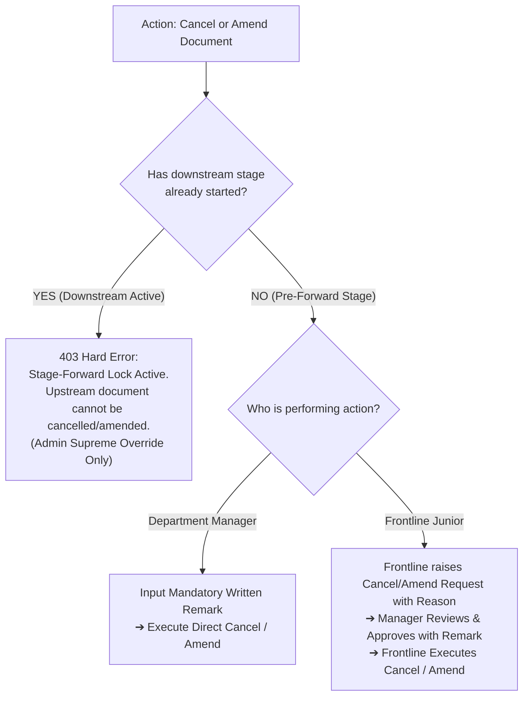

# ADR-020: Enterprise Symmetric Role Hierarchy, Permission Matrix, Stage-Forward Lock & Admin Safeguards Architecture

## Status

Accepted

## Date

2026-09-25

## Context

In the Sadbhav Solar EPC Enterprise ERP platform (`solar_module`), managing end-to-end solar EPC project lifecycles across Flow 1 (Core Project Execution, Stages 01–11) and Flow 2 (SCM, Store, Purchase & Vendor Procurement, Steps 12–19) involves a highly distributed workforce comprising field sales executives, site surveyors, PV design engineers, CRM estimators, project site engineers, warehouse keepers, liaisoning officers, procurement specialists, and financial accountants.

As the platform expanded across 19 discrete lifecycle stages, several architectural and operational vulnerabilities emerged:

1. **Role Nomenclature Inconsistencies & Redundancies:**
   - Redundant and conflicting roles existed across documents: `Lead Representative` (duplicating sales responsibilities), `Accounts Officer` (conflicting with `Accounts Assistant` and `Accounts Manager`), `Commercial Officer` (ambiguous boundary between Sales, CRM, and Project Execution), and `Quality Engineer` / `Vendor Rating Auditor` (duplicating warehouse and procurement quality checks).
   - In Stage 04 (Commercial Proposals), attributing proposal generation strictly to `Sales Representative` created critical workflow bottlenecks. In enterprise solar EPC operations, detailed dynamic BOM pricing, 70:30 solar GST structuring, and PM Surya Ghar subsidy calculations are frequently executed by specialized inside CRM / Costing personnel. If the role was restricted to Sales, non-sales CRM personnel were blocked from generating quotations.

2. **Absence of Managerial Authority Inheritance:**
   - In earlier configurations, managerial roles occasionally lacked explicit permissions for granular frontline actions (such as creating drafts or uploading site checklists), forcing managers to rely on junior credentials or causing permission errors during emergency sign-offs.

3. **Risk of Upstream Stage Corruption via Uncoordinated Cancellations & Amendments:**
   - Without an enforced **Stage-Forward Lock**, users or managers could cancel or amend an upstream document (such as a Site Survey, Engineering BOM, or Purchase Order) while downstream stages (such as Commercial Proposals, Sales Orders, or Purchase Receipts) were actively progressing, leading to broken data chains, phantom inventories, and financial ledger imbalances.
   - Frontline personnel lacked a governed, auditable channel to request cancellations or amendments without bypassing managerial oversight.

4. **Administrative Deletion Orphan Risks:**
   - While `Admin` must hold supreme operational authority to intervene and resolve operational gridlocks, unguided deletions of upstream records (e.g. deleting a Sales Order that already spawned a Project WBS or Delivery Note) produced orphan database records and severe referential integrity violations.
   - The platform lacked automated downstream dependency detection and a safe, atomic mechanism for cascading purges.

5. **Coarse Row-Level Security (RLS):**
   - Frontline personnel required visibility into upstream stage specifications (such as a Surveyor needing Lead data, or a Design Engineer needing Survey measurements) but permitting full write access risked unauthorized modifications. A strict rule governing read-only access to previous assigned stages was necessary.

---

## Decision

We establish an authoritative, comprehensive architectural standard for the **Enterprise Symmetric Role Hierarchy, Permission Matrix, Stage-Forward Lock & Admin Safeguards Architecture** (`ADR-020`).

### 1. The Symmetric Two-Tier Departmental Role Model

Every functional domain across Flow 1 and Flow 2 is structured into a symmetric two-tier model:

- **Frontline / Operational Role:** `Representative`, `Engineer`, `Assistant`, or `Supervisor` (field execution, data intake, physical verification).
- **Supervisory / Governance Role:** `Manager` (task assignment, technical audit, SLA monitoring, commercial/financial sign-off).
- **Project Site Supervision:** Formally incorporates **`Site Supervisor`** alongside `Project Engineer` and `Project Manager`.
- **Supreme Operational Command:** **`Admin`** (business supremacy, SLA customization, exception approvals, deletion audit).
- **Framework & DevOps Root:** **`System Manager`** (developer/infrastructure apex; technical plumbing, Python code, DocType schemas).

```
┌──────────────────────────────────────────────────────────────────────────────────────────────────┐
│                             ENTERPRISE ROLE & PERMISSION ARCHITECTURE                            │
├──────────────────────────────────────────────────────────────────────────────────────────────────┤
│ APEX GOVERNANCE: `Admin` (Project Supreme Command)  |  `System Manager` (Framework Dev/DevOps)   │
├───────────────────┬──────────────────────────────────┬───────────────────────────────────────────┤
│ Department        │ Frontline Operational Role       │ Managerial Governance Role                │
├───────────────────┼──────────────────────────────────┼───────────────────────────────────────────┤
│ 1. Sales          │ `Sales Representative`           │ `Sales Manager`                           │
│ 2. Survey         │ `Survey Engineer`                │ `Survey Manager`                          │
│ 3. Design         │ `Design Engineer`                │ `Design Manager`                          │
│ 4. CRM & Proposal │ `CRM Representative`             │ `CRM Manager`                             │
│ 5. Accounts       │ `Accounts Assistant`             │ `Accounts Manager`                        │
│ 6. Project & Site │ `Site Supervisor` / `Project Eng`│ `Project Manager`                         │
│ 7. Store          │ `Store Assistant`                │ `Store Manager`                           │
│ 8. Liaisoning     │ `Liaisoning Representative`      │ `Liaisoning Manager`                      │
│ 9. Purchase & SCM │ `Purchase Assistant`             │ `Purchase Manager`                        │
│ 10. O&M Service   │ `O&M Service Engineer`           │ `O&M Manager`                             │
└───────────────────┴──────────────────────────────────┴───────────────────────────────────────────┘
```

### 2. Departmental Deprecations & Clean Re-Allocations

1. **Elimination of `Lead Representative` (Stage 01):**  
   Lead ingestion, deduplication, and scheduling are unified under **`Sales Representative`** and **`Sales Manager`**.
2. **Decoupling of Proposals to `CRM Representative` & `CRM Manager` (Stage 04):**  
   Commercial proposal drafting, dynamic pricing, and PM Surya Ghar subsidy modeling are assigned to **`CRM Representative`** and **`CRM Manager`**. Sales personnel who draft proposals in smaller branches are simply assigned the `CRM Representative` role.
3. **Elimination of `Accounts Officer` (Stage 05, Step 15, Step 17, Step 18):**  
   Financial entry, advance ingestion, and 3-way match drafting belong to **`Accounts Assistant`**; verification, clearance gate approval, and payment disbursements belong to **`Accounts Manager`**.
4. **Elimination of `Commercial Officer` (Stage 06, Step 15):**  
   Sales Order baseline is governed by **`Sales Manager`** / **`CRM Manager`**; project execution handoff is held by **`Project Manager`**; commercial PO checks are handled by **`Accounts Manager`**.
5. **Standardization of `Liaisoning Representative` & `Liaisoning Manager` (Stage 10):**  
   Eliminates `Liaisoning Officer`. Upgraded to professional two-tier liaisoning governance.
6. **Elimination of `Quality Engineer` / `Vendor Rating Auditor` (Step 16, Step 19):**  
   Transit and warehouse inspection is handled by `Store Manager`; on-site technical inspection is held by `Project Engineer` / `Site Supervisor`; vendor rating scorecard evaluations are held by `Purchase Manager`.

### 3. Managerial Full-Authority Inheritance

**Invariance Standard:** The **`Manager`** of any department inherits 100% of the capabilities, permissions, and submit actions of their frontline subordinates. Any task a junior can perform (`read`, `write`, `create`, `submit`) can be executed directly by their department manager.

### 4. Stage-Forward Lock & Two-Phase Amend/Cancel Protocol



1. **Stage-Forward Lock:** Once downstream documents exist or the next lifecycle stage has been initiated, the upstream document is permanently locked against cancellation and amendment.
2. **Manager Direct Cancel/Amend (Pre-Forward):** Allowed only before downstream progression, requiring a mandatory justification remark.
3. **Junior Request-for-Approval Flow:** Frontline staff cannot unilaterally cancel or amend submitted records. They submit a formal cancellation/amendment request with a reason to their Manager. The Manager reviews and approves/rejects with a remark. If the process has already moved to the next stage, the system hard-blocks raising the request entirely.

### 5. Admin Supreme Governance, Dependency Warning & Deletion Safeguards

1. **Downstream Dependency Warning:** Before an `Admin` cancels, amends, or deletes any document, the system triggers `DependencyAuditService.check_dependencies()`. If active downstream records exist, an interactive Dependency Audit Warning Modal displays the exact list of dependent records.
2. **Hard Deletion Restriction:** Direct deletion of an upstream document is strictly blocked as long as active downstream records exist.
3. **Atomic Downstream Cascading Purge (`CascadePurgeService`):** For total project aborts or master rollbacks, an Admin-only cascading purge utility is provided under ultra-strict governance:
   - Requires Admin password re-authentication.
   - Requires a mandatory strict business justification of at least 40 characters.
   - Executes reverse-topological deletion in a single atomic transaction savepoint.
   - Snapshots every purged record's full JSON payload, timestamp, and Admin ID into `tabSolar Deletion Audit Log`.

### 6. Refined Purchase Order Authorization Matrix (Step 15)

```
┌──────────────────────────────────────────────────────────────────────────────────────────────────┐
│                             PURCHASE ORDER AUTHORIZATION THRESHOLDS                              │
├─────────┬──────────────────────────┬─────────────────────────────┬───────────────────────────────┤
│ Tier #  │ Order Value Range        │ Authorized Role             │ Approval Governance           │
├─────────┼──────────────────────────┼─────────────────────────────┼───────────────────────────────┤
│ Tier 1  │ < ₹50,000                │ Purchase Manager ONLY       │ Purchase Assistant drafts;    │
│         │                          │                             │ Purchase Manager authorizes.  │
├─────────┼──────────────────────────┼─────────────────────────────┼───────────────────────────────┤
│ Tier 2  │ ₹50,000 to ₹5,00,000     │ Configurable Single Role    │ Admin sets active approver    │
│         │                          │ (Purchase Mgr OR            │ in Solar SCM Settings:        │
│         │                          │  Accounts Mgr OR Admin)     │ Exactly one role active.      │
├─────────┼──────────────────────────┼─────────────────────────────┼───────────────────────────────┤
│ Tier 3  │ ₹5,00,000 to ₹25,00,000  │ Admin ONLY                  │ Exclusive authority of        │
│         │                          │                             │ Project Supreme Command.      │
├─────────┼──────────────────────────┼─────────────────────────────┼───────────────────────────────┤
│ Tier 4  │ > ₹25,00,000             │ Admin ONLY                  │ Exclusive authority of        │
│         │                          │                             │ Project Supreme Command.      │
└─────────┴──────────────────────────┴─────────────────────────────┴───────────────────────────────┘
```

### 7. Stage-Gated Row-Level Security (RLS)

1. **Frontline Juniors (`Representative`, `Engineer`, `Assistant`, `Supervisor`):**
   - _Current Stage:_ Read/Write/Create access strictly for records they created (`owner == session.user`) or are assigned to (`assigned_to == session.user`).
   - _Previous Stage:_ Granted **READ-ONLY** access strictly to previous stage records linked to their assigned current transaction.
   - _Other Stages:_ Access restricted.
2. **Department Managers (`Manager`):**
   - _Current Stage:_ Full Read/Write/Submit/Approve access to **ALL** records in their department.
   - _Previous Stage:_ Granted **READ-ONLY** access to **ALL** records of the immediately preceding stage.
3. **Admin & System Manager:**
   - Full global visibility across all stages and companies without restriction.

---

## Consequences

### Positive Consequences

- **Zero Ambiguity:** Eliminates duplicate, deprecated, and confusing roles (`Lead Representative`, `Accounts Officer`, `Commercial Officer`, `Quality Engineer`, `Vendor Rating Auditor`, `Liaisoning Officer`).
- **Unblocked Proposals:** Decoupling proposal generation to `CRM Representative` & `CRM Manager` allows dedicated costing teams to prepare quotes while enabling sales staff to hold CRM permissions when needed.
- **Data Integrity & Relational Safety:** The Stage-Forward Lock prevents upstream modifications from silently breaking downstream operations.
- **Guarded Administration:** Admin retains absolute emergency authority, but is protected from accidental corruption via dependency warnings, hard deletion blocks, and audited cascade purges.
- **Scalable Enterprise RBAC:** Standardized 2-tier pairs drastically simplify user onboarding, permission assignment, and HRMS role mapping.

### Negative Consequences / Operational Trade-offs

- Department Managers must actively review and sign off cancellation/amendment requests when juniors need to modify submitted pre-forward documents.
- Admin cascading purges require strict justification ($\ge 40$ chars) and password re-entry, preventing rapid casual deletions.

---

## Traceability Matrix

| Lifecycle Stage                     | Specification Document                                                                  | Authorized Frontline Role          | Authorized Managerial Role             | Governance & Override |
| :---------------------------------- | :-------------------------------------------------------------------------------------- | :--------------------------------- | :------------------------------------- | :-------------------- |
| **Stage 01: Lead Management**       | [`STEP_01`](../../step_plans/STEP_01_LEAD_MANAGEMENT_SPECIFICATION.md)                  | `Sales Representative`             | `Sales Manager`                        | `Admin`               |
| **Stage 02: Site Survey**           | [`STEP_02`](../../step_plans/STEP_02_SITE_SURVEY_SPECIFICATION.md)                      | `Survey Engineer`                  | `Survey Manager`                       | `Admin`               |
| **Stage 03: Engineering Design**    | [`STEP_03`](../../step_plans/STEP_03_SURVEY_ENGINEERING_DESIGN_BOM_SPECIFICATION.md)    | `Design Engineer`                  | `Design Manager`                       | `Admin`               |
| **Stage 04: Proposal & Subsidy**    | [`STEP_04`](../../step_plans/STEP_04_PROPOSAL_SUBSIDY_SPECIFICATION.md)                 | `CRM Representative`               | `CRM Manager`                          | `Admin`               |
| **Stage 05: Advance Payment**       | [`STEP_05`](../../step_plans/STEP_05_ADVANCE_PAYMENT_CUSTOMER_GATE_SPECIFICATION.md)    | `Accounts Assistant`               | `Accounts Manager`                     | `Admin`               |
| **Stage 06: Sales Order Baseline**  | [`STEP_06`](../../step_plans/STEP_06_SALES_ORDER_BASELINE_SPECIFICATION.md)             | `CRM Representative`               | `Sales Manager`, `CRM Manager`         | `Admin`               |
| **Stage 07: Dual Progress Bar**     | [`STEP_07`](../../step_plans/STEP_07_PLAN_DUAL_PROGRESS_BAR_LIFECYCLE_SLA_ENGINE.md)    | `Site Supervisor`, `Proj Eng`      | `Project Manager`                      | `Admin`               |
| **Stage 08: Material Dispatch**     | [`STEP_08`](../../step_plans/STEP_08_MATERIAL_DISPATCH_DELIVERY_NOTE_SPECIFICATION.md)  | `Store Assistant`                  | `Store Manager`                        | `Admin`               |
| **Stage 09: Zone DPR Execution**    | [`STEP_09`](../../step_plans/STEP_09_INSTALLATION_ZONE_DPR_SPECIFICATION.md)            | `Site Supervisor`, `Proj Eng`      | `Project Manager`                      | `Admin`               |
| **Stage 10: Liaisoning & Sync**     | [`STEP_10`](../../step_plans/STEP_10_LIAISONING_GRID_SYNC_SPECIFICATION.md)             | `Liaisoning Representative`        | `Liaisoning Manager`                   | `Admin`               |
| **Stage 11: Lifecycle O&M**         | [`STEP_11`](../../step_plans/STEP_11_ON_DEMAND_SOLAR_SERVICE_OM_SPECIFICATION.md)       | `O&M Service Engineer`             | `O&M Manager`                          | `Admin`               |
| **Step 12: Store Requisitions**     | [`STEP_12`](../../step_plans/STEP_12_STORE_MATERIAL_REQUEST_LOW_STOCK_SPECIFICATION.md) | `Store Assistant`                  | `Store Manager`                        | `Admin`               |
| **Step 13: Supplier RFQ**           | [`STEP_13`](../../step_plans/STEP_13_SUPPLIER_RFQ_SPECIFICATION.md)                     | `Purchase Assistant`               | `Purchase Manager`                     | `Admin`               |
| **Step 14: Quotation Matrix**       | [`STEP_14`](../../step_plans/STEP_14_QUOTATION_COMPARISON_MATRIX_SPECIFICATION.md)      | `Purchase Assistant`               | `Purchase Manager`, `Project Manager`  | `Admin`               |
| **Step 15: Purchase Order**         | [`STEP_15`](../../step_plans/STEP_15_PURCHASE_ORDER_AUTHORIZATION_SPECIFICATION.md)     | `Purchase Assistant`               | `Purchase Manager` (Tier 1)            | `Admin` (Tier 2/3/4)  |
| **Step 16: Multi-Location GRN**     | [`STEP_16`](../../step_plans/STEP_16_PURCHASE_RECEIPT_GRN_SPECIFICATION.md)             | `Store Assistant`, `Site Sup`      | `Store Manager`, `Project Manager`     | `Admin`               |
| **Step 17: Purchase Invoice 3-Way** | [`STEP_17`](../../step_plans/STEP_17_PURCHASE_INVOICE_3WAY_MATCH_SPECIFICATION.md)      | `Accounts Assistant`               | `Accounts Manager`                     | `Admin`               |
| **Step 18: Vendor Payment Desk**    | [`STEP_18`](../../step_plans/STEP_18_VENDOR_PAYMENT_WORKBENCH_SPECIFICATION.md)         | `Purchase Assistant`, `Accts Asst` | `Purchase Manager`, `Accounts Manager` | `Admin`               |
| **Step 19: Vendor Scorecard**       | [`STEP_19`](../../step_plans/STEP_19_VENDOR_RATING_SCORECARD_SPECIFICATION.md)          | `Purchase Assistant`               | `Purchase Manager`                     | `Admin`               |
