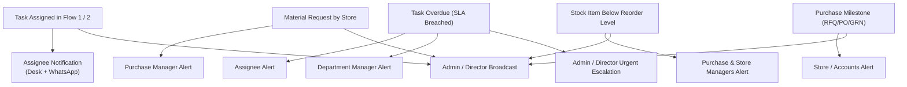
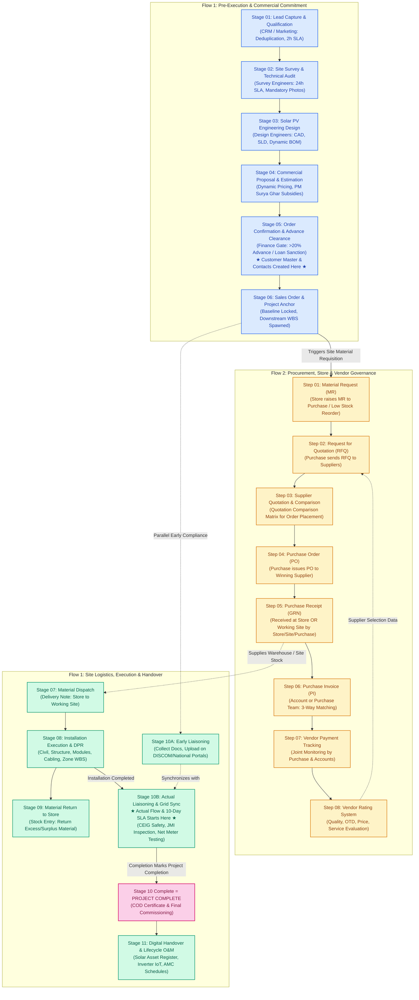

# Phase 1: Project Foundation Model (PFM)

**System Architecture, Dual-Flow Enterprise Lifecycles, SLA/TAT Engine & Capability Specification**  
_Source: Sadbhav Solar EPC Enterprise Architecture Suite_

---

## 1. Executive Summary & Enterprise Scope

The **Project Foundation Model (PFM)** establishes the authoritative operational structure for the Solar EPC Enterprise ERP platform (`solar_module`). It unifies operations across residential rooftop, Commercial & Industrial (C&I), ground-mounted utility scale, and floating solar installations.

The system is architected around two synchronized core business flows, an enforced task-level SLA/TAT engine, a centralized notification and escalation matrix, and strict master data governance:

1. **Flow 1: Core Solar EPC Project Execution Lifecycle (11 Stages):**  
   `Lead` $\rightarrow$ `Survey` $\rightarrow$ `Design` $\rightarrow$ `Proposal` $\rightarrow$ `Advance Payment` $\rightarrow$ `Sales Order` (Customer creation & Early Liaisoning doc collection) $\rightarrow$ `Material Dispatch (Delivery Note)` $\rightarrow$ `Installation` $\rightarrow$ `Material Return to Store (Surplus Reconciliation)` $\rightarrow$ `Liaisoning & Synchronization (Actual Flow Countdown & Project Completion)` $\rightarrow$ `Operation & Maintenance (O&M)`.

2. **Flow 2: SCM, Store, Purchase & Vendor Procurement Lifecycle (8 Steps):**  
   `Material Request by Store to Purchase` $\rightarrow$ `Request for Quotation (RFQ) by Purchase to Supplier` $\rightarrow$ `Supplier Quotation (Comparative Evaluation Sheet)` $\rightarrow$ `Purchase Order (PO)` $\rightarrow$ `Purchase Receipt (GRN at Store OR Working Site by Store/Site/Purchase)` $\rightarrow$ `Purchase Invoice (3-Way Match by Account/Purchase)` $\rightarrow$ `Payment to Vendor Tracking/Monitoring (Joint Purchase & Accounts)` $\rightarrow$ `Vendor Rating System`.

---

## 2. Core Business Capabilities (`BC-01` to `BC-16`)

| Capability ID | Capability Domain                                |  Lifecycle Mapping  | ERP Functional Mapping     | Primary Scope & Objective                                                                                                                                                                                                                                  |
| :------------ | :----------------------------------------------- | :-----------------: | :------------------------- | :--------------------------------------------------------------------------------------------------------------------------------------------------------------------------------------------------------------------------------------------------------- |
| **`BC-01`**   | **Lead Capture & Qualification**                 |  Flow 1: Stage 01   | CRM / Marketing            | Multi-channel lead ingestion (Portal, Social, Referrals, Walk-in) with server-side deduplication and regional assignment.                                                                                                                                  |
| **`BC-02`**   | **Site Survey & Technical Audit**                |  Flow 1: Stage 02   | Survey Engineers           | Mobile on-site technical audit capturing roof metrics, tilt/azimuth, shadow analysis, mandatory photo checklist, and GPS verification (Default 24h TAT SLA).                                                                                               |
| **`BC-03`**   | **Solar PV System Design & Dynamic BOM**         |  Flow 1: Stage 03   | Design Engineers / CAD     | Electrical design, module stringing, inverter sizing, CAD/SLD drawings, parametric cable math, and automated dynamic BOM generation (`custom_quot_bom`).                                                                                                   |
| **`BC-04`**   | **Commercial Proposal & Subsidy Engine**         |  Flow 1: Stage 04   | Engineering / CRM Team     | Dynamic solar proposal builder computing real-time component costs, structure types, government subsidies (PM Surya Ghar / PM KUSUM), and margin governance.                                                                                               |
| **`BC-05`**   | **Advance Verification & Customer Inception**    |  Flow 1: Stage 05   | Finance / Commercial       | Financial clearance verification gate enforcing verified customer advance ($> 20\%$) or bank loan sanction. **Instantiates formal Customer master and contacts upon confirmation.**                                                                        |
| **`BC-06`**   | **Sales Order & Project Baseline Anchor**        |  Flow 1: Stage 06   | CRM Team / Operations      | Master project turning point: permanently freezes engineering BOM, establishes commercial baseline, and triggers downstream WBS and early Liaisoning doc collection.                                                                                       |
| **`BC-07`**   | **Material Dispatch & Delivery Logistics**       |  Flow 1: Stage 07   | Store / Logistics          | Authorized material dispatch from central warehouse to project site via ERPNext `Delivery Note` with vehicle, e-way bill, and asset serial tracking.                                                                                                       |
| **`BC-08`**   | **Installation Execution & Zone DPR**            |  Flow 1: Stage 08   | Project Management / Field | Zone-based Work Breakdown Structure (WBS), mobile Daily Progress Reports (DPR) for civil, structural, modules, and cabling execution.                                                                                                                      |
| **`BC-09`**   | **Site Material Reconciliation & Return**        |  Flow 1: Stage 09   | Field Team / Store         | Mandatory post-installation audit reconciling issued vs consumed materials. Unused or excess items returned to store via `Stock Entry` (Material Return).                                                                                                  |
| **`BC-10`**   | **Dual-Timing Liaisoning & Project Completion**  |  Flow 1: Stage 10   | Liaisoning & Compliance    | **Phase 1 (Post-SO):** Early document collection & DISCOM portal uploads. **Phase 2 (Post-Install):** Actual milestone & countdown begins (10-day default SLA) for CEIG, JMI, Net Metering & Grid Sync. **Completion marks formal Project Completion.** |
| **`BC-11`**   | **Post-Commissioning O&M & Telemetry**           |  Flow 1: Stage 11   | After-Sales / Helpdesk     | Automated Solar Asset Register generated from GRN serials, IoT inverter telemetry integration, warranty tracking, and automated AMC preventative maintenance schedules.                                                                                    |
| **`BC-12`**   | **Store Requisitions & Low Stock Monitoring**    |   Flow 2: Step 01   | Stores / Inventory         | Material Requests raised by Store to Purchase; automatic low-stock alerts triggered when items hit or drop below safety/reorder points.                                                                                                                    |
| **`BC-13`**   | **RFQ, Supplier Quotation & Comparative Matrix** | Flow 2: Steps 02-03 | Purchase Department        | Automated RFQ dispatch to qualified suppliers; multi-quote comparative evaluation sheet analyzing rates, delivery lead time, and vendor ratings.                                                                                                           |
| **`BC-14`**   | **Purchase Order & Multi-Location GRN**          | Flow 2: Steps 04-05 | Purchase, Store, Site      | PO issuance; Goods Receipt (GRN) executed at **Store warehouse OR directly at the working site** by Store, Site, or Purchase personnel with barcode serial scanning.                                                                                       |
| **`BC-15`**   | **Purchase Invoicing & Vendor Payment Tracking** | Flow 2: Steps 06-07 | Accounts & Purchase        | 3-way matching of PO, GRN, and vendor invoice; collaborative payment tracking workbench monitored jointly by Purchase and Accounts against milestones and credit terms.                                                                                    |
| **`BC-16`**   | **Vendor Performance Rating Governance**         |   Flow 2: Step 08   | Purchase & Quality         | Multi-criteria vendor rating scorecard evaluating quality, on-time delivery (OTD), pricing compliance, and service responsiveness. Feeds into future RFQs.                                                                                                 |

---

## 3. Task-Level SLA / TAT & Granular Admin Configuration

Every operational task across Flow 1 is bound to an SLA / TAT countdown timer that activates immediately upon assignment to a team member or owner.

### 3.1 Admin & Director SLA Customization

All default turnaround times are fully configurable via the **`Solar SLA Settings`** DocType. Only users with the supreme command **`Admin`**, **`Director`**, or Frappe **`System Manager`** role have permission to customize SLA hours and days.

### 3.2 Default SLA / TAT Baselines

| Flow 1 Task / Stage                   | Responsible Role        | SLA Clock Activation Trigger     |    Default SLA / TAT    | Customization Authority |
| :------------------------------------ | :---------------------- | :------------------------------- | :---------------------: | :---------------------: |
| **Lead Qualification & Response**     | Sales Executive         | Lead assignment to executive     |       **2 Hours**       |    Admin / Director     |
| **Technical Site Survey**             | Survey Engineer         | Survey assignment to engineer    |      **24 Hours**       |    Admin / Director     |
| **Solar PV Design & BOM Freeze**      | Design Engineer         | Design task assignment           |    **24 - 48 Hours**    |    Admin / Director     |
| **Commercial Proposal Generation**    | Sales / Design          | Proposal task assignment         |      **24 Hours**       |    Admin / Director     |
| **Financial Advance Verification**    | Accounts Officer        | Customer confirmation logged     |      **24 Hours**       |    Admin / Director     |
| **Material Dispatch (Delivery Note)** | Store Manager           | Sales Order submission / release |    **48 - 72 Hours**    |    Admin / Director     |
| **Site Installation Execution**       | Site Supervisor         | Material arrival on site         | **3 - 30 Days** (By kW) |    Admin / Director     |
| **Material Return to Store**          | Site Supervisor / Store | Installation marked complete     |    **24 - 48 Hours**    |    Admin / Director     |
| **Liaisoning JMI & Grid Sync**        | Liaisoning Officer      | Installation marked complete     |       **10 Days**       |    Admin / Director     |

---

## 4. Multi-Stakeholder Notification & Alert Architecture

The platform embeds a real-time Notification & Escalation Engine (`Solar Notification Settings`) with complete administrative override.

### 4.1 Granular Admin Toggle Controls

Admin / Director has toggle settings (`Check` fields) to enable or disable notifications per flow, per process, per step, and per event type.

### 4.2 Core Notification Trigger Matrix (When Enabled)

| Event / Notification Type | Trigger Condition               | Primary Recipient | Secondary Recipient |    Admin / Director Alert    | Admin Toggle |
| :------------------------ | :------------------------------ | :---------------- | :------------------ | :--------------------------: | :----------: |
| **Task Assignment**       | Task assigned to user/team      | Assignee          | Department Manager  |      **Yes** (Instant)       | Configurable |
| **Task Creation**         | New record/task created         | Task Owner        | -                   |    **Yes** (Live Digest)     | Configurable |
| **Task Overdue**          | Task exceeds configured SLA/TAT | Assignee          | Department Manager  | **Yes** (Urgent Escalation)  | Configurable |
| **Material Request**      | Store raises MR to Purchase     | Purchase Manager  | Store Manager       |  **Yes** (Financial Notice)  | Configurable |
| **Item Stock Low**        | Stock $\le$ Reorder Point       | Purchase Manager  | Store Manager       | **Yes** (Supply Risk Alert)  | Configurable |
| **Purchase Milestones**   | PO issued / GRN booked          | Vendor / Store    | Accounts Team       | **Yes** (Procurement Notice) | Configurable |

---

## 5. Master Data Governance & Timings

1. **Customer Master (`tabCustomer`):**
   - Prospects remain as `Lead` or `CRM Lead` during pre-sales inquiry, survey, design, and initial proposal.
   - The formal ERPNext `Customer` master, billing/shipping addresses, contact persons, and DISCOM consumer number are **created when the client confirms for solar installation** (Order Confirmation / Advance Payment / Sales Order creation).
2. **Supplier Master (`tabSupplier`):**
   - Suppliers are categorized by equipment type (Tier 1 Modules, Inverters, MMS, AC/DC Cables, Balance of System).
   - Master maintains tax details (GSTIN/PAN), banking accounts, contact persons, and historical **Vendor Performance Ratings**.
3. **Item Master (`tabItem`):**
   - Structured across three specialized enterprise domains:
     - **Stock:** Valuation method, default warehouse, serialized/batch tracking, reorder point, safety stock.
     - **Store:** Bin/rack locations, handling units, storage conditions, physical verification cycles.
     - **Purchase:** Default purchase UOM, lead time in days, preferred suppliers, purchase taxes, and incoming inspection criteria.

---

## 6. Enterprise Roles Matrix (15 Distinct Roles)

> [!IMPORTANT]
> **Enterprise Role Nomenclature Standard (Zero "User" Suffix Rule):**  
> Across the entire platform architecture, system roles, and step specifications, generic `User` suffixes (such as `Lead User`, `Sales User`, `Survey User`, `Site User`, `Project User`, `Store User`) are strictly prohibited. All operational actors and Frappe system roles are designated with professional functional descriptors such as `Representative`, `Engineer`, `Assistant`, `Manager`, `Supervisor`, `Auditor`, and `Officer`.

1. **Admin / Managing Director (Project-Level Supreme Command):** Supreme operational authority across all business transactions across Flow 1 and Flow 2. Exclusive business authority to configure `Solar SLA Settings` and `Solar Notification Settings`, approve delay overrides, and inspect executive dashboards. Restricted from code, DocType schema customization, client/server scripts, or internal technical implementation. _(Note: Frappe Framework's native `System Manager` and `Administrator` sit above `Admin`, possessing all developer/code rights and inheriting whatever access `Admin` possesses)._
2. **Sales Executive / BD Manager:** Lead onboarding, initial qualification, customer engagement, proposal delivery.
3. **Field Survey Engineer:** Mobile on-site survey execution, photo/document uploads, GPS verification (24h SLA).
4. **Solar Design Engineer:** Solar PV sizing, CAD/SLD drawings, cable math, dynamic BOM explosion.
5. **Sales / Commercial Manager:** Proposal reviews, subsidy verifications, margin exception governance.
6. **Finance & Accounts Officer:** Advance verification, financial clearance gate, customer milestone billing, vendor invoice matching, and joint vendor payment scheduling.
7. **Procurement / Purchase Manager:** Material Request review, RFQ management, quotation comparison, PO placement, vendor rating governance.
8. **Store / Inventory Manager:** Material Request generation, stock level monitoring, low stock tracking, central warehouse GRN, delivery note dispatch, and material return receiving.
9. **Project Manager (Solar EPC):** End-to-end WBS project execution, budget variance, material delivery tracking, timeline governance.
10. **Site Supervisor / Field Engineer:** Daily Progress Reports (DPR), site GRN receiving, installation quality audits, material surplus reconciliation.
11. **Liaisoning & Compliance Officer:** Early document collection & portal uploads (post-SO), statutory CEIG inspection, and post-installation JMI/grid sync (10-day SLA).
12. **Quality & Commissioning Engineer:** Pre-commissioning punch lists, testing, Joint Meter Inspection (JMI), commissioning sign-off.
13. **O&M Service Engineer:** Solar Asset Register maintenance, IoT telemetry monitoring, preventative AMC visits, warranty claims.
14. **Customer / Client (Portal User):** Proposal review, advance payment submission, installation progress tracking, generation monitoring.
15. **Executive Leadership / CXO:** Real-time KPI dashboards (pipeline value, installed capacity, margin realization, SLA compliance, vendor ratings).

---

## 7. Dual-Lifecycle Process Groups Architecture

