# Phase 2: As-Is Business Process Document (BPD)

**Current-State Operational Reality, Dual-Flow Pain-Point Baseline & Failure Modes**  
_Source: Sadbhav Solar EPC Enterprise Architecture Suite_

---

## 1. Baseline Current-State Overview

Prior to deploying the unified Solar EPC Enterprise ERP platform (`solar_module`), operations suffer from severe fragmentation across tools (Excel spreadsheets, paper logs, WhatsApp groups, phone calls). Critical hand-offs between sales, survey engineers, PV design, stores, purchase, site execution, liaisoning, accounts, and after-sales O&M lack automated workflow governance and verifiable audit trails.

The organization operates with two distinct operational cycles—the **Customer Solar Project Lifecycle** and the **Procurement & Vendor Governance Lifecycle**—both plagued by operational blind spots, lack of task-level SLA accountability, and absent management visibility.

---

## 2. Key Operational Pain Points & Bottlenecks

### A. Flow 1 Pain Points (Project Execution & Site Logistics)

1. **Unstructured Pre-Sales & Lost Lead Data:** Inquiries captured on WhatsApp and personal notebooks without centralized deduplication; surveys assigned verbally without turnaround time (TAT) monitoring.
2. **CAD/BOM Disconnect:** Design engineers draft single-line diagrams (SLD) and module layouts in standalone CAD/PVsyst without linking to costing or commercial proposals, causing manual BOM transcription errors.
3. **Premature Project Mobilization:** Procurement and structural ordering begin before accounts verifies the customer's advance payment ($> 20\%$) or bank loan disbursement.
4. **Untracked Material Dispatch:** Goods leaving the central store lack formalized `Delivery Note` documentation with vehicle/e-way bill tracking and asset serial numbers, leading to disputes over what arrived on site.
5. **Post-Installation Surplus Abandonment & Site Scrap:** After physical installation finishes, leftover materials (modules, excess DC cable, MC4 connectors, fasteners, balance-of-system items) are left lying at client sites, resulting in theft, pilferage, weather damage, and untracked inventory shrinkage because no formal **Material Return to Store** reconciliation exists.
6. **Liaisoning Dual-Timing Disconnect:** While document collection starts informally post-Sales Order, there is no system tracking document submissions on DISCOM portals. Furthermore, once physical installation completes, the critical 10-day statutory countdown for CEIG inspection, Joint Meter Inspection (JMI), and net-meter synchronization is neglected, delaying project completion and causing subsidy forfeitures.
7. **No Project Completion Anchor:** Projects remain open indefinitely because completion of Liaisoning & Synchronization is not formally tied as the legal trigger for Project Completion.
8. **Reactive After-Sales & Missing Serials:** Warranty cards are lost paper slips; no digital Solar Asset Register exists, preventing proactive telemetry alerts and making OEM warranty recovery impossible.

### B. Flow 2 Pain Points (Store, Purchase & Vendor Procurement)

1. **Gut-Feel Store Requisitions:** Stores request stock verbally or via informal WhatsApp messages without referencing project BOM netting or inventory reorder points.
2. **Subjective RFQs Without Comparative Sheets:** Purchase requests quotes from 1-2 favored suppliers via phone/email; quotations are not recorded in a structured **Comparative Evaluation Sheet**, leading to suboptimal pricing, missed delivery lead times, and lack of procurement transparency.
3. **Goods Receipt Confusion (Store vs. Remote Site):** Heavy materials (structures, modules) often get delivered directly to remote installation sites rather than central warehouses. Without a flexible multi-location Goods Receipt (GRN) workflow accessible to site supervisors, items remain unrecorded for weeks, blocking vendor invoices and causing 3-way matching failures.
4. **Siloed Vendor Payment Tracking (Purchase vs. Accounts Conflict):** The purchase team commits to supplier payment milestones (advance, on-dispatch, against GRN, retention) while accounts pays based on cash availability without joint visibility. Suppliers stop dispatches due to payment delays, stalling active installation sites.
5. **Absence of Vendor Rating System:** Suppliers who deliver defective modules or breach promised delivery dates face no documented performance consequences, as there is no objective Vendor Rating System tracking on-time delivery (OTD), quality rejections, and commercial compliance.

### C. Cross-Cutting SLA, Notification & Master Data Deficits

1. **Absence of Task SLA/TAT Timers:** When tasks are assigned to surveyors, design engineers, storekeepers, or site supervisors, no countdown clock runs. Team members have no visibility into due dates, and management cannot identify bottlenecks.
2. **Notification Blindness for Admin/Management:** Executive leadership and department heads are blind to critical exceptions. Overdue tasks, material requests, and low stock warnings remain buried in individual inboxes until projects are already delayed.
3. **Disorganized Master Data Creation:** Customers are prematurely entered into accounting systems at the initial inquiry stage (creating dirty ledger clutter), suppliers lack standardized categorization, and Item Masters lack explicit parameters for Stock valuation, Store binning, and Purchase lead times.

---

## 3. As-Is Process Flow Breakdown

```mermaid
flowchart TD
    subgraph Flow1_AsIs["As-Is Flow 1: Solar Project Delivery"]
        A1["1. Lead<br/>(Personal phone diaries)"] --> A2["2. Survey<br/>(Paper notes, unstandardized photos)"]
        A2 --> A3["3. Design<br/>(Standalone CAD/PVsyst, manual BOM)"]
        A3 --> A4["4. Proposal<br/>(Static Excel sheets, outdated pricing)"]
        A4 --> A5["5. Advance Payment<br/>(WhatsApp payment slips, unverified)"]
        A5 --> A6["6. Sales Order<br/>(Informal email, no baseline freeze)"]
        A6 --> A7["7. Material Dispatch<br/>(Informal truck loading, no Delivery Note)"]
        A7 --> A8["8. Installation<br/>(Verbal DPRs, undocumented delays)"]
        A8 --> A9["9. Surplus at Site<br/>(Left at site, scrap, theft, no return)"]
        A8 --> A10["10. Liaisoning<br/>(Paper register, missed DISCOM deadlines)"]
        A10 --> A11["11. Handover / O&M<br/>(Lost warranty cards, reactive break-fix)"]
    end

    subgraph Flow2_AsIs["As-Is Flow 2: Procurement & Stores"]
        B1["1. Store Need<br/>(Urgent WhatsApp request)"] --> B2["2. Informal RFQ<br/>(Calls to 1-2 vendors)"]
        B2 --> B3["3. Vendor Quotes<br/>(No comparison sheet, biased selection)"]
        B3 --> B4["4. Purchase Order<br/>(Basic PO, ambiguous payment terms)"]
        B4 --> B5["5. Goods Receipt<br/>(Unchecked site delivery, untracked serials)"]
        B5 --> B6["6. Invoice & Payment<br/>(Purchase & Accounts blame game on dues)"]
        B6 --> B7["7. Vendor Issues<br/>(No rating, repeated supplier failures)"]
    end

    classDef asis fill:#fee2e2,stroke:#ef4444,stroke-width:1.5px,color:#991b1b;
    class A1,A2,A3,A4,A5,A6,A7,A8,A9,A10,A11,B1,B2,B3,B4,B5,B6,B7 asis;
```

---

## 4. Operational Gap Summary Across As-Is Stages

| Lifecycle Stage / Flow             | Current Practice                                  | Operational Risk / Failure Mode                        | Financial & Business Impact          |
| :--------------------------------- | :------------------------------------------------ | :----------------------------------------------------- | :----------------------------------- |
| **Flow 1: Stage 02 (Survey)**      | Phone notes, unverified photos.                   | Missing electrical/roof data; no 24h SLA.              | Re-surveys, design delays.           |
| **Flow 1: Stage 05 (Advance)**     | Verbal confirmation.                              | Procurement released without cleared funds.            | Working capital deficit.             |
| **Flow 1: Stage 07 (Dispatch)**    | Materials loaded on trucks without Delivery Note. | Missing panel serials, transit loss disputes.          | Untracked inventory shrinkage.       |
| **Flow 1: Stage 09 (Return)**      | Unused materials left on site.                    | Surplus cable/panels damaged, stolen, or scrapped.     | 3-5% margin erosion per site.        |
| **Flow 1: Stage 10 (Liaisoning)**  | Paper DISCOM logs; post-install delay.            | JMI inspection delayed beyond statutory window.        | Subsidy forfeiture; unhappy client.  |
| **Flow 2: Step 01 (Material Req)** | Verbal / WhatsApp messages to Purchase.           | Emergency rush orders, stock-outs.                     | Higher freight and rush fees.        |
| **Flow 2: Step 03 (Quotes)**       | Single-quote ordering without comparison.         | Overpaying for BOS items, long lead times.             | Higher procurement cost.             |
| **Flow 2: Step 05 (GRN)**          | Site deliveries unrecorded in system.             | Accounts cannot match invoices; vendor holds supplies. | Delayed project commissioning.       |
| **Flow 2: Step 07 (Payments)**     | Accounts and Purchase work in silos.              | Missed payment milestones, supplier stop-work.         | Execution bottlenecks.               |
| **Flow 2: Step 08 (Rating)**       | No supplier performance records.                  | Repeat procurement from low-performing vendors.        | Quality failures, warranty disputes. |
