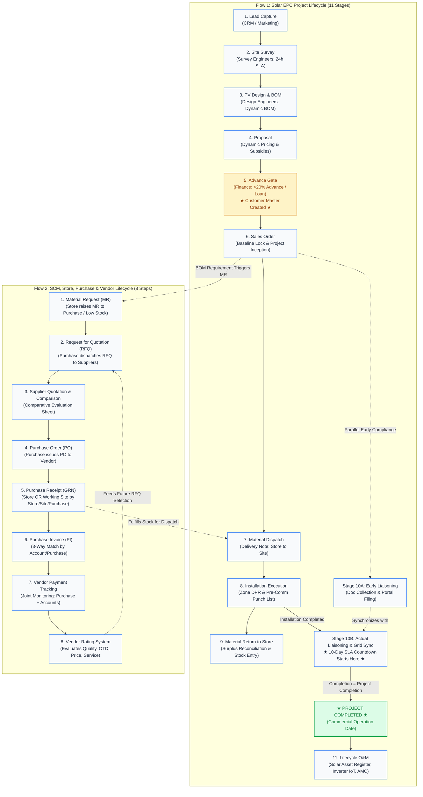

# Phase 3: To-Be Business Process Document (BPD)

**Target Operating Model, Dual-Flow Enterprise Pipeline & Enforced Verification Stage-Gates**  
_Source: Sadbhav Solar EPC Enterprise Architecture Suite_

---

## 1. Future-State Operating Model Overview

The **To-Be Business Process** delivers an end-to-end automated, role-based operating model that eliminates spreadsheet silos and WhatsApp chaos. The system formalizes operations across two synchronized lifecycles, backed by an enforced task-level SLA/TAT engine, a centralized multi-tier notification service, and strict master data controls.



---

## 2. Enforced System Verification Stage-Gates

The target operating model embeds 9 rigorous verification stage-gates directly into Frappe document controllers to prevent unauthorized transitions:

### Gate 1: Site Survey Verification Gate (Flow 1: Stage 02)

- **Trigger:** Marking `Site Survey` as **Completed**.
- **Responsible Role:** Survey Engineers.
- **Enforcement Rules:**
  1. Validates all mandatory technical fields (Solar Capacity, System Type, Site Classification, Sanctioned Load, Mounting Type, Roof Height, Storage Space, Geocoded Site Address, Utility Bill Name Match).
  2. Validates all 6 mandatory photo checklist rows (`Inverter/ACDB/DCDB`, `Earthing 1-3`, `LT Panel`, `Meter Board`).
  3. Enforces compliance against configured SLA/TAT (Default 24 Hours; customizable by Admin/Director).

### Gate 2: Engineering Design & Dynamic BOM Freeze Gate (Flow 1: Stage 03)

- **Trigger:** Design Engineer sign-off on `site_survey_design_file` and `custom_quot_bom`.
- **Responsible Role:** Solar Design Engineers.
- **Enforcement Rules:**
  1. Validates string configuration, module layout CAD, and DC/AC cable sizing via `cable_calculation_table`.
  2. Programmatically explodes multi-level BOM into `custom_quot_bom` and permanently freezes technical specifications.
  3. Disallows downstream changes without an approved Engineering Change Order (ECO).

### Gate 3: Commercial Proposal & Margin Governance Gate (Flow 1: Stage 04)

- **Trigger:** Submitting / Dispatching `Proposal` or `Quotation`.
- **Responsible Role:** Sales / Commercial Manager.
- **Enforcement Rules:**
  1. Validates base equipment pricing against live Item master rates.
  2. Computes central/state subsidy eligibility (PM Surya Ghar / PM KUSUM).
  3. Enforces gross margin floor: quotations falling below threshold require Commercial Manager approval.

### Gate 4: Financial Clearance & Customer Master Inception Gate (Flow 1: Stage 05)

- **Trigger:** Submitting / Authorizing `Sales Order`.
- **Responsible Role:** Finance & Accounts Officer.
- **Enforcement Rules:**
  1. Verifies bank receipt of verified advance payment ($> 20\%$) or bank loan sanction disbursement letter.
  2. **Automatically converts the prospect into an official ERPNext `Customer` master**, generating linked billing/shipping addresses, contact persons, and DISCOM consumer profile.
  3. Unlocks Sales Order submission and triggers downstream project mobilization.

### Gate 5: Material Dispatch Clearance Gate (Flow 1: Stage 07)

- **Trigger:** Submitting ERPNext `Delivery Note` for site dispatch.
- **Responsible Role:** Store / Inventory Manager.
- **Enforcement Rules:**
  1. Verifies items against frozen project BOM quantities and free warehouse stock.
  2. Enforces barcode serial scanning for all high-value equipment (PV modules, inverters).
  3. Records transporter name, vehicle registration number, and mandatory e-way bill number before dispatch authorization.

### Gate 6: Installation Execution & Pre-Commissioning Punch List Gate (Flow 1: Stage 08)

- **Trigger:** Submitting final installation milestone in `Project`.
- **Responsible Role:** Site Supervisor & Project Manager.
- **Enforcement Rules:**
  1. Validates Daily Progress Reports (DPR) across all active site zones.
  2. Verifies structural torque audit, DC string open-circuit voltage ($V_{oc}$), short-circuit current ($I_{sc}$), and insulation resistance (Megger) test logs.
  3. Clears mechanical and electrical punch lists before unlocking liaisoning inspection.

### Gate 7: Site Material Reconciliation & Return Gate (Flow 1: Stage 09)

- **Trigger:** Completing site installation before formal project closeout.
- **Responsible Role:** Site Supervisor & Store Manager.
- **Enforcement Rules:**
  1. Reconciles total materials dispatched via `Delivery Note` against materials installed per engineering BOM and DPR logs.
  2. If surplus, unused, or residual materials remain (panels, cable remnants, structural hardware), system mandates creation and submission of a `Stock Entry` (Purpose: **Material Return**) back to the central store warehouse.
  3. Blocks final project handover sign-off until site material reconciliation is 100% balanced.

### Gate 8: Statutory Liaisoning & Project Completion Gate (Flow 1: Stage 10)

- **Trigger:** Marking `Liaisoning And Synchronization` as **Completed**.
- **Responsible Role:** Liaisoning & Compliance Officer.
- **Enforcement Rules:**
  1. **Dual-Timing Validation:**
     - **Phase 1 (Post-SO):** Verifies customer KYC, property documents, DISCOM application number, and grid feasibility NOC.
     - **Phase 2 (Post-Installation):** Activates statutory countdown (Default 10 Days; customizable by Admin/Director) for CEIG electrical safety approval, Joint Meter Inspection (JMI) report, bi-directional net-meter testing, and grid energization certificate.
  2. **Project Completion Trigger:** Approval of this gate **formally transitions the `Project` status to "Completed"** and issues the official Commercial Operation Date (COD) certificate.
  3. Automatically instantiates the digital **Solar Asset Register** for Stage 11 O&M.

### Gate 9: Procurement Quotation Comparison & 3-Way Match Gate (Flow 2)

- **Trigger:** Submitting `Purchase Order` and booking `Purchase Invoice`.
- **Responsible Role:** Purchase Manager & Accounts Officer.
- **Enforcement Rules:**
  1. PO creation requires a completed **Quotation Comparison Sheet** evaluating at least 2-3 supplier quotations on price, delivery lead time, and vendor rating.
  2. Enforces strict 3-way matching between `Purchase Order`, `Purchase Receipt` (GRN at store or site), and `Purchase Invoice`.
  3. Requires joint sign-off on the **Vendor Payment Tracking Workbench** by Purchase and Accounts before disbursements are processed.
  4. Requires completion of the **Vendor Rating Scorecard** upon GRN closure.

---

## 3. End-to-End Document Transformation Pipeline

```
[Lead / CRM Lead]
  │  (Assigned with 2h response SLA; deduplicated on phone/email)
  ▼
[Site Survey]
  │  (Survey Engineers complete 10 fields, 6 photos, 24h SLA)
  ▼
[Solar PV Design & Dynamic BOM]
  │  (CAD/SLD uploaded, cable math run, exploded into custom_quot_bom)
  ▼
[Proposal / Quotation]
  │  (Dynamic pricing, PM Surya Ghar subsidy applied, branded PDF)
  ▼
[Advance Payment Entry & Verification]
  │  (Finance verifies >20% advance or bank sanction)
  ▼
[Customer Master & Contacts]  ◄── Created automatically upon confirmation!
  │
  ▼
[Sales Order (Project Anchor)]
  │  (Locks commercial terms & BOM baseline; triggers dual parallel streams)
  ├────────────────────────────────────────────────────────┐
  ▼                                                        ▼
[Flow 2: Procurement & SCM]                [Liaisoning Phase 1: Doc Prep (Post-SO)]
  │  - Material Request by Store             │  (KYC, electricity bills, DISCOM portal filing)
  │  - RFQ to Suppliers                      │
  │  - Supplier Quotation Comparison         │
  │  - Purchase Order (PO)                   │
  │  - GRN (At Store OR Site by Store/Site/Purchase)
  │  - Purchase Invoice (3-Way Match)        │
  │  - Joint Vendor Payment Tracking         │
  │  - Vendor Rating Scorecard               │
  ▼                                          │
[Material Dispatch: Delivery Note]           │
  │  (Dispatched from Store to Site with Serials) │
  ▼                                          │
[Installation Execution & Zone DPR]          │
  │  (WBS milestones, labor logs, Megger tests)│
  ▼                                          │
[Site Material Return to Store]              │
  │  (Surplus reconciled; Stock Entry Return)│
  ▼                                          │
  └────────────────────────┬─────────────────┘
                           ▼
[Liaisoning Phase 2: Grid Sync (Post-Install)]
  │  ★ Actual Flow & 10-Day SLA Countdown Starts Here! ★
  │  (CEIG safety audit, JMI inspection, Bi-directional meter installation)
  ▼
[★ PROJECT FORMALLY COMPLETED ★]
  │  (COD Certificate issued; Project status set to 'Completed')
  ▼
[Digital Solar Asset Register & Lifecycle O&M]
  │  (Serial-tracked warranty register, IoT inverter telemetry, AMC scheduler)
```

---

## 4. Administrative SLA & Notification Governance

1. **Customizable Turnaround Times (`Solar SLA Settings`):**
   - Admin and Director retain exclusive rights to modify SLA hours/days for any lifecycle step or task across Flow 1 and Flow 2.
2. **Granular Notification Toggles (`Solar Notification Settings`):**
   - Admin and Director can individually enable or disable notifications for any process, step, or event type.
   - High-priority escalations (Task Overdue, Low Stock, Material Request) automatically broadcast to Admin/Director when active.
