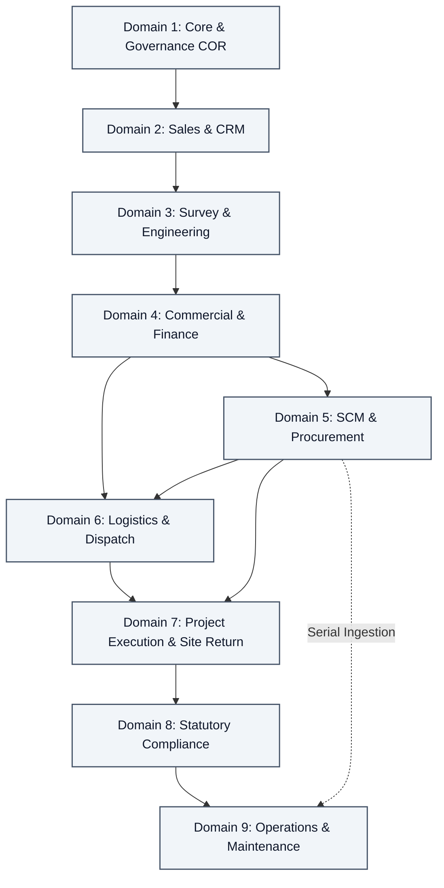

# Phase 8: Database Design Document (3NF Schema)

**Relational Entity Architecture Across 9 Enterprise Domains & Dual Lifecycles**  
_Source: Sadbhav Solar EPC Enterprise Architecture Suite_

---

## 1. Relational Schema Architecture (Third Normal Form)

The database schema is partitioned across 9 logical domains in strict Third Normal Form (3NF) to eliminate data redundancy, enforce referential integrity, and provide deterministic auditability.

---

## 2. Data Domain Entity Mapping

### Domain 1: Core System, SLA & Notification Governance (`COR`)

- `tabUser`: Enterprise user profiles mapped to the 15 enterprise roles.
- `tabSolar SLA Settings` (Single DocType): Configurable default SLA / TAT hours/days for each task across Flow 1 and Flow 2. Accessible to `Admin` (Project Supreme), `Director`, and `System Manager`.
- `tabSolar Notification Settings` (Single DocType): Granular toggle checkboxes to enable/disable notifications per process, flow, step, and event type. Accessible to `Admin` (Project Supreme), `Director`, and `System Manager`.
- `tabTask SLA Log`: Stores assignment timestamp, configured SLA hours, due datetime, actual completion datetime, and SLA status (`Within SLA`, `Overdue`).
- `tabNotification Log`: System-wide dispatch history of real-time alerts.
- `tabRemark Delay Log`: Audit log capturing user, timestamp, delay reason category, and justification remarks whenever an SLA is breached or an exception gate is approved.

### Domain 2: Sales & CRM (`CRM`) — Flow 1: Stage 01

- `tabLead`: Multi-channel prospect record with solar extensions (`custom_lead_organization_name`, `custom_lead_capacity`, `custom_lead_status`, `custom_territory`).
- `tabCRM Lead`: Bidirectional real-time sync with Frappe CRM.
- `tabCustomer`: Official enterprise customer master. **Instantiated only when the prospect confirms for solar installation (Flow 1: Stage 05).**
- `tabContact`: Customer contact persons and authorized signatories.
- `tabAddress`: Billing and shipping site addresses with geocoded coordinates.

### Domain 3: Survey & Engineering (`ENG`) — Flow 1: Stages 02, 03

- `tabSite Survey`: Technical audit header (Capacity, System Type, Sanctioned Load, Mounting Type, Roof Height, Geocoded Coordinates, Billing Name Match, Assignment Timestamp, 24h SLA Due Date).
- `tabSite Survey Doc Table`: Child table storing 6 mandatory photo checklist rows (`Inverter/ACDB/DCDB`, `Earthing 1-3`, `LT Panel`, `Meter Board`, `Roof Panorama`, `Obstacle/Shadow Area`).
- `tabSite Survey Design File`: Repository child table for AutoCAD DWG/DXF drawings, SLD single-line diagrams, and PVsyst simulation reports.
- `tabCable Calculation Table`: Parametric table calculating DC/AC cable cross-sections and allowable voltage drops.
- `tabCustom Quot BOM`: Dynamic engineering Bill of Materials specifying modules, inverters, structure tonnage, and BOS items, permanently frozen upon design sign-off.

### Domain 4: Commercial & Finance (`FIN`) — Flow 1: Stages 04, 05, 06

- `tabProposal`: Proposal header created from survey and frozen BOM with real-time pricing and margin checks.
- `tabProposal Item`: Child table of equipment, structural kits, and installation services.
- `tabQuotation`: Official commercial quotation issued to client with PM Surya Ghar subsidy calculations.
- `tabSales Order`: Master project anchor locking commercial terms, payment terms, and approved BOM. Contains financial advance clearance fields (`custom_advance_verified`, `custom_loan_sanction_verified`, `custom_financial_clearance_date`).
- `tabPayment Entry`: Bank transaction matching records (UTR/Cheque) verifying advance and milestone receipts.
- `tabSales Invoice`: Milestone billing invoices linked to delivery, installation, and commissioning.

### Domain 5: SCM, Store & Procurement (`SCM`) — Flow 2: Steps 01 to 08

- `tabMaterial Request`: Store-to-Purchase requisitions (`custom_project_reference`, `custom_required_date`, `material_request_type`).
- `tabRequest for Quotation`: Procurement RFQ dispatched to multiple approved vendors.
- `tabSupplier Quotation`: Supplier submitted quotations with unit prices, freight, warranty terms, and lead times.
- `tabQuotation Comparison`: Multi-quote comparative evaluation matrix scoring suppliers on price, lead time, and vendor rating before PO release.
- `tabPurchase Order`: Official supplier purchase contract with agreed commercial terms.
- `tabPurchase Receipt (GRN)`: Goods Receipt Note with multi-location flag (`custom_receipt_location`: `Central Store Warehouse` vs. `Working Site`).
- `tabPurchase Invoice`: 3-way matched supplier bill.
- `tabSupplier`: Vendor master maintaining tax details (GSTIN/PAN), banking accounts, product categories, and overall performance rating.
- `tabVendor Rating`: Evaluation scorecard rating suppliers upon GRN/invoice closure across OTD, Quality, Price Adherence, and Service Responsiveness.
- `tabItem`: Equipment master configured with dedicated tabs for **Stock** (valuation, serials, reorder levels), **Store** (bin location, handling), and **Purchase** (lead times, preferred suppliers, UOMs).

### Domain 6: Logistics & Material Dispatch (`LOG`) — Flow 1: Stage 07

- `tabDelivery Note`: Authorized dispatch from store warehouse to installation site.
- `tabDelivery Note Item`: Dispatched BOM items and quantities.
- `tabSerial and Batch Bundle`: Serial number tracking linking individual PV module and inverter barcodes to the Delivery Note and project site.

### Domain 7: Project Execution & Site Material Return (`PRJ`) — Flow 1: Stages 08, 09

- `tabProject`: Solar installation container with zone segmentation.
- `tabTask`: Templated WBS execution tasks with assignment timestamps and SLA countdowns.
- `tabDaily Progress Report (DPR)`: Daily site execution logs (weather disruptions, labor headcount, civil foundations, modules mounted, cabling running meters, Megger test logs).
- `tabStock Entry` (Purpose: **Material Return**): Reconciles materials issued in Delivery Note vs installed per BOM. Transfers unused surplus items from site back to central store warehouse.

### Domain 8: Statutory Compliance (`CMP`) — Flow 1: Stage 10

- `tabLiaisoning And Synchronization`:
  - **Phase 1 Fields (Post-SO):** `consumer_number`, `discom_application_no`, `sanction_letter`, `feasibility_approval_date`, `grid_connectivity_noc`.
  - **Phase 2 Fields (Post-Install):** `ceig_approval_doc`, `jmi_inspection_date`, `net_meter_serial_no`, `bidirectional_meter_testing_date`, `grid_synchronization_date`, `cod_certificate`.
  - **Project Completion Flag:** `custom_triggers_project_completion` (Boolean) setting linked `Project` status to `Completed` upon Phase 2 sign-off.

### Domain 9: Operations & Maintenance (`OM`) — Flow 1: Stage 11

- `tabSolar Asset Register`: Post-commissioning asset inventory containing installed panel serials, inverter serials, warranty expiration dates, and rated capacity.
- `tabMaintenance Visit`: Preventative AMC visit logs and corrective maintenance ticket records.
