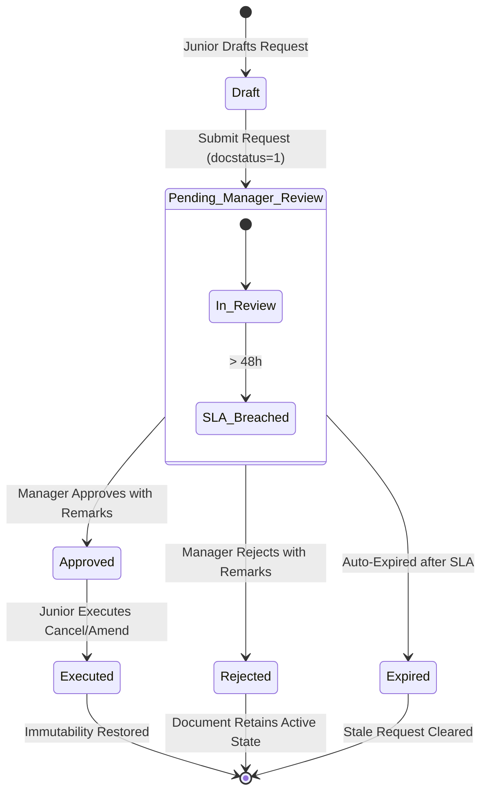

# STEP_00_ROLE_PERMISSION_SECURITY_FOUNDATION_SPECIFICATION.md

# Enterprise Lifecycle Step Specification: Role, Permission & Security Foundation Architecture

**Document ID:** `STEP-00-ROLE-SECURITY-CORE`  
**Lifecycle Flow:** Foundation Layer: Enterprise Role, Permission & Security Substrate (Preceding Flow 1 and Flow 2)  
**Governing Architecture:** [`docs/decisions/ADR-000-ENTERPRISE-ROLE-PERMISSION-ARCHITECTURE.md`](../docs/decisions/ADR-000-ENTERPRISE-ROLE-PERMISSION-ARCHITECTURE.md)  
**Blueprint Reference:** [`architect_docs/02_STEP_PLANNING_SPECIFICATION_BLUEPRINT.md`](../architect_docs/02_STEP_PLANNING_SPECIFICATION_BLUEPRINT.md)  
**PRD / FRS Traceability:** [`planning_ref_docs/01_PROJECT_FOUNDATION_MODEL.md`](../planning_ref_docs/01_PROJECT_FOUNDATION_MODEL.md), [`planning_ref_docs/06_FUNCTIONAL_REQUIREMENTS_SPECIFICATION.md`](../planning_ref_docs/06_FUNCTIONAL_REQUIREMENTS_SPECIFICATION.md) (`FR-000: Enterprise Security & RBAC`), [`planning_ref_docs/10_UI_UX_SPECIFICATION.md`](../planning_ref_docs/10_UI_UX_SPECIFICATION.md)  
**Target Module:** `solar_module` / `manoj`  
**Author:** Principal Enterprise Architect & System Engineer  
**Status:** Approved / Ready for Implementation

---

## 1. Step Scope, Objectives & Context Traceability

### 1.1 Lifecycle Positioning & Architectural Substrate

Step 00 (**Enterprise Role, Permission & Security Foundation**) sits at the absolute foundation of the Sadbhav Solar EPC enterprise platform. It establishes the security primitives, access control layers, audit trails, and data immutability engines that govern all 11 stages of Core Solar EPC Execution (Flow 1: Steps 01–11) and all 8 steps of SCM & Procurement Execution (Flow 2: Steps 12–19).

```
┌──────────────────────────────────────────────────────────────────────────────────────────────────┐
│              STEP 00: ENTERPRISE ROLE, PERMISSION & SECURITY FOUNDATION                          │
├──────────────────────────────────────────────────────────────────────────────────────────────────┤
│ - Canonical 22 Roles (10 Frontline + 10 Supervisory + 2 Apex) & 11 Department Role Profiles     │
│ - Managerial Authority Inheritance Engine (`RoleInheritanceService`)                             │
│ - Stage-Forward Immutability Lock (`StageForwardLockService`)                                    │
│ - Junior Cancel/Amend Request Workflow (`Solar Cancellation Request`)                            │
│ - Admin Deletion Guard & Strict Audit Logger (`AdminAuditService` -> `Solar Deletion Audit Log`) │
│ - Atomic Downstream Cascading Purge Engine (`CascadePurgeService`)                               │
│ - Stage-Gated Row-Level Security Engine (`StageGatedRLSService`)                                 │
│ - Base Controller Mixin: `StageSecuredDocument`                                                  │
└─────────────────────────────────┬────────────────────────────────┬───────────────────────────────┘
                                  │                                │
                                  ▼                                ▼
       ┌─────────────────────────────────────┐  ┌─────────────────────────────────────┐
       │   FLOW 1: CORE PROJECT EXECUTION    │  │   FLOW 2: SCM & VENDOR PROCUREMENT  │
       │   Stages 01 – 11                    │  │   Steps 12 – 19                     │
       │   (Lead -> Survey -> BOM -> ... )   │  │   (Indent -> RFQ -> PO -> GRN ...)  │
       └─────────────────────────────────────┘  └─────────────────────────────────────┘
```

- **Predecessors:** Core Frappe Framework installation, MariaDB schema initialization.
- **Successors:** All subsequent lifecycle steps (Stage 01 through Stage 19).

### 1.2 Core Business Objectives & Target KPIs

1. **Zero Permission Drift (100% RBAC Standardization):** Enforce strict separation of duties and clean two-tier hierarchies across 10 distinct operational departments without role fragmentation.
2. **Complete Downstream Immutability:** Guarantee that no upstream document can be modified or cancelled once downstream engineering, procurement, or execution milestones have commenced.
3. **100% Audited Administrative Interventions:** Ensure that every single record cancellation, amendment, or deletion executed across the platform is immutably logged with user identity, timestamp, IP address, and mandatory written justification ($\ge 20$ chars for deletion, $\ge 40$ chars for cascading purge).
4. **Zero Orphaned Child Records:** Eliminate database corruption caused by partial or manual deletion of parent transactions through reverse-topological cascading purge.
5. **Zero Development Rework:** Provide a standard 3-line document inheritance mixin (`StageSecuredDocument`) so that subsequent stages (01 to 19) inherit security, validation gates, and audit hooks automatically.

### 1.3 Failure Modes Eliminated

- **Privilege Escalation & Bypass:** Frontline staff cancelling or altering submitted project quotes or purchase orders without managerial sign-off.
- **Cascading Corruptions:** Upstream project cancellation breaking active down-funnel purchase receipts, delivery notes, or financial ledgers.
- **Untracked Data Loss:** Administrative direct deletion of business records without forensic logging or explanation.
- **Uncontrolled Data Visibility:** Frontline staff accessing unassigned leads, surveys, or quotes belonging to other territories.
- **Developer Retrofitting Friction:** Rewriting controllers and tests across 19 stages to add permission queries after business logic has already been implemented.

---

## 2. Stakeholders, Enterprise Actors & HRMS Role Mapping

### 2.1 The Canonical 22 Roles & Two-Tier Departmental Matrix

In strict compliance with **ADR-000** and the **Zero "User" Suffix Rule**, all business roles operate on a symmetric two-tier model:

- **Tier 1 (Frontline / Specialist):** Direct field and desk operations (creation, editing, drafting, physical execution).
- **Tier 2 (Supervisory / Managerial):** Quality audit, commercial allocation, exception review, and managerial authority inheritance.
- **Apex Tier:** Operational Command (`Admin`) vs Codebase & Technical Realm (`System Manager`).

| Operational Domain       | Frontline Role (Tier 1)               | Supervisory Role (Tier 2)      | HRMS Department        | HRMS Designation Baseline       | Primary Step Scope         |
| :----------------------- | :------------------------------------ | :----------------------------- | :--------------------- | :------------------------------ | :------------------------- |
| **Sales & Marketing**    | `Sales Representative`                | `Sales Manager`                | Sales & Marketing      | Sales Executive / Manager       | Stage 01                   |
| **Technical Survey**     | `Survey Engineer`                     | `Survey Manager`               | Engineering Operations | Survey Specialist / Manager     | Stage 02                   |
| **Engineering Design**   | `Design Engineer`                     | `Design Manager`               | Engineering Operations | Solar Design Engineer / Head    | Stage 03                   |
| **CRM & Proposals**      | `CRM Representative`                  | `CRM Manager`                  | CRM & Commercial       | Commercial Proposal Exec / Lead | Stage 04                   |
| **Finance & Accounts**   | `Accounts Assistant`                  | `Accounts Manager`             | Finance & Accounts     | Accounts Executive / Head       | Stage 05, Step 15, 17, 18  |
| **Site Operations**      | `Site Supervisor`, `Project Engineer` | `Project Manager`              | Project Execution      | Field Supervisor / Project Head | Stages 06–09, Step 16      |
| **Store & Inventory**    | `Store Assistant`                     | `Store Manager`                | Store & Warehouse      | Store Executive / Store Head    | Stage 08, Steps 12, 16, 17 |
| **Statutory Liaisoning** | `Liaisoning Representative`           | `Liaisoning Manager`           | Regulatory Affairs     | Liaisoning Executive / Manager  | Stage 10                   |
| **Procurement & SCM**    | `Purchase Assistant`                  | `Purchase Manager`             | Procurement & SCM      | Purchase Buyer / SCM Lead       | Steps 12–19                |
| **O&M Service**          | `O&M Service Engineer`                | `O&M Manager`                  | Customer Support & O&M | Service Field Engineer / Head   | Stage 11                   |
| **Supreme Apex**         | `Admin` (Project Supreme)             | `System Manager` (Dev Supreme) | Executive / IT         | Managing Director / CTO         | Cross-Platform Governance  |

### 2.2 Departmental Role Profiles (`tabRole Profile`)

To guarantee seamless HRMS employee onboarding, standard pre-packaged role profiles are provisioned via database fixtures:

| Role Profile Name         | Assigned System Roles                              | Intended Personnel                      |
| :------------------------ | :------------------------------------------------- | :-------------------------------------- |
| `Solar Sales Executive`   | `Sales Representative`, `Desk User`                | Frontline telecallers, field sales reps |
| `Solar Sales Head`        | `Sales Manager`, `Desk User`                       | Regional sales managers, VP Sales       |
| `Solar Survey Specialist` | `Survey Engineer`, `Desk User`                     | Mobile field surveyors, site auditors   |
| `Solar Survey Head`       | `Survey Manager`, `Desk User`                      | Chief Survey Officer, Survey Lead       |
| `Solar Design Engineer`   | `Design Engineer`, `Desk User`                     | CAD engineers, PVsyst specialists       |
| `Solar Design Head`       | `Design Manager`, `Desk User`                      | Head of Engineering Design              |
| `Solar CRM Proposal Exec` | `CRM Representative`, `Desk User`                  | Quotation analysts, pricing estimators  |
| `Solar CRM Head`          | `CRM Manager`, `Desk User`                         | Commercial Director, CRM Manager        |
| `Solar Accounts Exec`     | `Accounts Assistant`, `Desk User`                  | Accounts payables/receivables staff     |
| `Solar Accounts Head`     | `Accounts Manager`, `Desk User`                    | Chief Financial Officer, Controller     |
| `Solar Site Supervisor`   | `Site Supervisor`, `Project Engineer`, `Desk User` | On-site project field engineers         |
| `Solar Project Manager`   | `Project Manager`, `Desk User`                     | Senior project managers, EPC heads      |
| `Solar Store Assistant`   | `Store Assistant`, `Desk User`                     | Central warehouse dock operators        |
| `Solar Store Head`        | `Store Manager`, `Desk User`                       | Inventory controller, Logistics head    |
| `Solar Liaisoning Exec`   | `Liaisoning Representative`, `Desk User`           | DISCOM liaisoning agents                |
| `Solar Liaisoning Head`   | `Liaisoning Manager`, `Desk User`                  | Head of Regulatory Affairs              |
| `Solar Purchase Buyer`    | `Purchase Assistant`, `Desk User`                  | SCM procurement executives              |
| `Solar SCM Head`          | `Purchase Manager`, `Desk User`                    | Head of Procurement, SCM Director       |
| `Solar O&M Engineer`      | `O&M Service Engineer`, `Desk User`                | Solar field service technicians         |
| `Solar O&M Head`          | `O&M Manager`, `Desk User`                         | Service Operations Manager              |
| `Solar Executive Command` | `Admin`, `Desk User`                               | Managing Director, Executive Board      |

---

## 3. Relational Schema & 3NF Data Dictionary

Step 00 provisions three foundational database DocTypes to manage security configuration, junior requests, and immutable deletion auditing.

### 3.1 Core DocType 1: `tabSolar Security Settings` (Single DocType)

| Fieldname                           | Label                           | Fieldtype | Options / Target                            | Mandatory | Description & Validation Rules                                                            |
| :---------------------------------- | :------------------------------ | :-------- | :------------------------------------------ | :-------: | :---------------------------------------------------------------------------------------- |
| `enforce_strict_deletion_reasons`   | Enforce Strict Deletion Reasons | `Check`   | -                                           |    Yes    | If 1, all deletions across Solar DocTypes require logged justification.                   |
| `min_deletion_reason_length`        | Min Deletion Reason Length      | `Int`     | -                                           |    Yes    | Minimum character length for deletion reasons (Default: 20).                              |
| `min_cascade_purge_reason_length`   | Min Cascade Purge Reason Length | `Int`     | -                                           |    Yes    | Minimum character length for cascade purge justification (Default: 40).                   |
| `cancellation_request_expiry_hours` | Cancellation Request Expiry (h) | `Int`     | -                                           |    Yes    | Hours before unreviewed cancellation requests expire (Default: 48h).                      |
| `tier_2_po_approver_role`           | Tier 2 PO Approver Role         | `Select`  | `Purchase Manager\nAccounts Manager\nAdmin` |    Yes    | Active approver role for POs between ₹50,000 and ₹5,00,000 (Default: `Purchase Manager`). |
| `authorized_pi_entry_department`    | Authorized PI Entry Department  | `Select`  | `Accounts\nStore\nPurchase`                 |    Yes    | Admin-governed department authorized to create Purchase Invoices (Default: `Accounts`).   |
| `enable_mandatory_barcode_pr`       | Enforce Mandatory Barcode GRN   | `Check`   | -                                           |    Yes    | If 1, Step 16 GRN requires 100% 2D scan for modules and inverters.                        |

### 3.2 Core DocType 2: `tabSolar Cancellation Request` (Submittable)

| Fieldname             | Label                       | Fieldtype      | Options / Target                                                                  | Mandatory | Index | Description & Validation Rules                                |
| :-------------------- | :-------------------------- | :------------- | :-------------------------------------------------------------------------------- | :-------: | :---: | :------------------------------------------------------------ |
| `reference_doctype`   | Reference DocType           | `Link`         | `DocType`                                                                         |  **Yes**  | **1** | Target DocType requested for cancel/amend (e.g. `Quotation`). |
| `reference_name`      | Reference Document Name     | `Dynamic Link` | `reference_doctype`                                                               |  **Yes**  | **1** | Target record ID (e.g. `QTN-2026-00042`).                     |
| `requested_action`    | Requested Action            | `Select`       | `Cancel\nAmend`                                                                   |  **Yes**  |   -   | Operational action requested by frontline user.               |
| `request_reason`      | Detailed Justification      | `Small Text`   | -                                                                                 |  **Yes**  |   -   | Minimum 20 characters explaining the operational reason.      |
| `requested_by`        | Requested By (Junior)       | `Link`         | `User`                                                                            |  **Yes**  | **1** | Frontline applicant user ID.                                  |
| `department`          | Department                  | `Select`       | `Sales\nSurvey\nDesign\nCRM\nAccounts\nProject\nStore\nLiaisoning\nPurchase\nO&M` |  **Yes**  | **1** | Target operational department.                                |
| `assigned_manager`    | Assigned Department Manager | `Link`         | `User`                                                                            |  **Yes**  | **1** | Department Manager assigned to review request.                |
| `workflow_state`      | Review Status               | `Select`       | `Pending Manager Review\nApproved\nRejected\nExecuted\nExpired`                   |  **Yes**  | **1** | Lifecycle state of request.                                   |
| `manager_remarks`     | Manager Review Remarks      | `Small Text`   | -                                                                                 |    No     |   -   | Mandatory remark when manager approves or rejects request.    |
| `decision_timestamp`  | Decision Recorded At        | `Datetime`     | -                                                                                 |    No     |   -   | Timestamp when manager took review action.                    |
| `execution_timestamp` | Action Executed At          | `Datetime`     | -                                                                                 |    No     |   -   | Timestamp when junior executed the approved action.           |

### 3.3 Core DocType 3: `tabSolar Deletion Audit Log` (Immutable Append-Only Log)

| Fieldname              | Label                     | Fieldtype    | Options / Target | Mandatory | Index | Description & Validation Rules                                         |
| :--------------------- | :------------------------ | :----------- | :--------------- | :-------: | :---: | :--------------------------------------------------------------------- |
| `target_doctype`       | Target DocType            | `Link`       | `DocType`        |  **Yes**  | **1** | DocType of deleted record (e.g. `Purchase Order`).                     |
| `target_name`          | Target Record Name        | `Data`       | -                |  **Yes**  | **1** | Identifier of deleted record.                                          |
| `deleted_by`           | Deleted By (User)         | `Link`       | `User`           |  **Yes**  | **1** | User ID who executed the deletion.                                     |
| `deletion_reason`      | Deletion Justification    | `Small Text` | -                |  **Yes**  |   -   | Mandatory explanation ($\ge 20$ chars, or $\ge 40$ chars for cascade). |
| `snapshot_json`        | Document Snapshot (JSON)  | `Code`       | `JSON`           |  **Yes**  |   -   | Complete serialized JSON state of the document before deletion.        |
| `is_cascade_purge`     | Is Part of Cascade Purge? | `Check`      | -                |    No     | **1** | Set to 1 if purged by `CascadePurgeService`.                           |
| `cascade_root_doctype` | Cascade Root DocType      | `Data`       | -                |    No     |   -   | Originating root DocType that initiated cascade purge.                 |
| `cascade_root_name`    | Cascade Root Name         | `Data`       | -                |    No     |   -   | Originating root record ID that initiated cascade purge.               |
| `ip_address`           | IP Address                | `Data`       | -                |    No     |   -   | Network IP address of the client connection.                           |
| `creation`             | Deletion Timestamp        | `Datetime`   | -                |  **Yes**  | **1** | Standard Frappe creation timestamp.                                    |

---

## 4. State Machine, Verification Gates & Invariants

### 4.1 Junior Cancellation Request Lifecycle State Machine



### 4.2 Five Immutable Enterprise Security Invariants (ADR-000)

```
┌─────────────────────────────────────────────────────────────────────────────────────────────┐
│                            FIVE IMMUTABLE SECURITY GATES (ADR-000)                          │
├─────────────────────────────────────────────────────────────────────────────────────────────┤
│ 1. MANAGERIAL INHERITANCE: Manager role inherits 100% of Frontline operations               │
│ 2. STAGE-FORWARD LOCK: Upstream documents are locked once downstream progress exists         │
│ 3. JUNIOR CANCEL/AMEND: Juniors cannot cancel directly; must raise approval request         │
│ 4. ADMIN DELETION GUARD: Admin blocked from deleting records with active downstream children│
│ 5. ATOMIC CASCADE PURGE: Single-savepoint reverse-topological purge with strict audit logging│
└─────────────────────────────────────────────────────────────────────────────────────────────┘
```

#### Gate 1: Managerial Authority Inheritance Gate

- Every departmental `Manager` role possesses 100% of the capabilities, permissions, and document views of their frontline subordinates.
- Evaluated dynamically in `RoleInheritanceService`: If `frappe.has_permission(doctype, ptype)` checks for a frontline role (e.g. `Sales Representative`), any user possessing `Sales Manager` evaluates to `True`.

#### Gate 2: The Stage-Forward Immutability Lock Gate

- Evaluated on `before_cancel` and `before_amend` across all Solar DocTypes:
  ```
  Lead (Submitted)       --> LOCKED if linked Site Survey exists (docstatus < 2)
  Site Survey (Submitted)--> LOCKED if linked Design BOM exists (docstatus < 2)
  Proposal (Submitted)   --> LOCKED if linked Sales Order exists (docstatus < 2)
  Sales Order (Submitted)--> LOCKED if linked Delivery Note / Project exists (docstatus < 2)
  Purchase Order (Subm.) --> LOCKED if linked Purchase Receipt / Advance Payment exists
  ```
- If active downstream records exist, the operation is **strictly aborted** with `frappe.ValidationError`. Only `Admin` with an explicit executive override flag can intervene.

#### Gate 3: Junior Cancel/Amend Workflow Gate

- Frontline staff (`Assistant`, `Engineer`, `Representative`, `Supervisor`) are explicitly barred from directly executing `cancel` or `amend` on submitted documents (`docstatus = 1`).
- The user must submit a `Solar Cancellation Request`.
- If approved by the `Manager`, the system sets an ephemeral permission token (`custom_cancellation_authorized_until = now + 2 hours`), permitting the junior to execute the single approved action.

#### Gate 4: Admin Deletion Warning & Hard Block Gate

- When an `Admin` attempts to delete a document, `AdminAuditService` runs a deep dependency graph check:
  - If active child/downstream documents exist: **HARD BLOCK**. Deletion is aborted with `frappe.ValidationError`, returning the complete list of active child records that must be resolved first.
  - If no active downstream documents exist: Deletion is permitted, provided a `deletion_reason` ($\ge 20$ chars) is supplied. The document snapshot is written to `tabSolar Deletion Audit Log`.

#### Gate 5: Atomic Cascading Purge (`CascadePurgeService`)

- When an entire project or procurement transaction tree is aborted, Admin invokes the cascading purge engine:
  - Requires Admin password re-authentication and strict justification ($\ge 40$ chars).
  - Traverses the dependency graph in **reverse topological order**:
    `Payment Entry` $\rightarrow$ `Purchase Invoice` $\rightarrow$ `Purchase Receipt` $\rightarrow$ `Purchase Order`.
  - Executes inside a database savepoint:
    ```python
    frappe.db.savepoint("cascade_purge_boundary")
    try:
        # Reverse-topological delete and log each record
    except Exception:
        frappe.db.rollback(save_point="cascade_purge_boundary")
    ```

---

## 5. Controller Logic, Domain Services & Whitelisted APIs

### 5.1 Architecture of `solar_module/security/`

```
solar_module/security/
├── __init__.py
├── role_inheritance.py         # RoleInheritanceService
├── stage_forward_lock.py       # StageForwardLockService
├── stage_gated_rls.py          # StageGatedRLSService
├── admin_audit.py              # AdminAuditService
├── cascade_purge.py            # CascadePurgeService
├── cancellation_workflow.py    # SolarCancellationRequestService
└── api.py                      # Whitelisted API endpoints
```

### 5.2 Implementation: `RoleInheritanceService`

```python
# solar_module/security/role_inheritance.py

import frappe

DEPARTMENT_ROLE_MAP = {
    "Sales Manager": ["Sales Representative"],
    "Survey Manager": ["Survey Engineer"],
    "Design Manager": ["Design Engineer"],
    "CRM Manager": ["CRM Representative"],
    "Accounts Manager": ["Accounts Assistant"],
    "Project Manager": ["Project Engineer", "Site Supervisor"],
    "Store Manager": ["Store Assistant"],
    "Liaisoning Manager": ["Liaisoning Representative"],
    "Purchase Manager": ["Purchase Assistant"],
    "O&M Manager": ["O&M Service Engineer"],
}

class RoleInheritanceService:
    @staticmethod
    def get_effective_roles(user: str) -> set:
        """Returns user's roles plus all subordinate frontline roles inherited via manager roles."""
        user_roles = set(frappe.get_roles(user))
        if "Administrator" in user_roles or "System Manager" in user_roles or "Admin" in user_roles:
            return user_roles  # Apex roles hold universal authority

        effective = set(user_roles)
        for manager_role, subordinates in DEPARTMENT_ROLE_MAP.items():
            if manager_role in user_roles:
                effective.update(subordinates)
        return effective

    @staticmethod
    def user_has_role(user: str, required_role: str) -> bool:
        """Checks if user has required role directly or via managerial inheritance."""
        effective_roles = RoleInheritanceService.get_effective_roles(user)
        return required_role in effective_roles
```

### 5.3 Implementation: `StageForwardLockService`

```python
# solar_module/security/stage_forward_lock.py

import frappe
from frappe import _

DOWNSTREAM_DEPENDENCY_REGISTRY = {
    "Lead": [
        {"doctype": "Site Survey", "link_field": "custom_lead_ref"},
    ],
    "Site Survey": [
        {"doctype": "Quotation", "link_field": "custom_survey_ref"},
    ],
    "Quotation": [
        {"doctype": "Sales Order", "link_field": "custom_proposal_ref"},
    ],
    "Sales Order": [
        {"doctype": "Delivery Note", "link_field": "against_sales_order"},
        {"doctype": "Project", "link_field": "sales_order"},
    ],
    "Purchase Order": [
        {"doctype": "Purchase Receipt", "link_field": "purchase_order"},
        {"doctype": "Payment Entry", "link_field": "custom_po_milestone_ref"},
    ],
    "Purchase Receipt": [
        {"doctype": "Purchase Invoice", "link_field": "custom_grn_reference"},
    ],
}

class StageForwardLockService:
    @staticmethod
    def check_downstream_progress(doc) -> list:
        """Inspects registry for active non-cancelled downstream records."""
        dependencies = DOWNSTREAM_DEPENDENCY_REGISTRY.get(doc.doctype, [])
        active_children = []

        for dep in dependencies:
            child_doctype = dep["doctype"]
            link_field = dep["link_field"]

            # Query for non-cancelled child records
            records = frappe.db.get_all(
                child_doctype,
                filters={link_field: doc.name, "docstatus": ["!=", 2]},
                fields=["name", "docstatus"]
            )
            for r in records:
                active_children.append({
                    "doctype": child_doctype,
                    "name": r.name,
                    "docstatus": r.docstatus
                })

        return active_children

    @staticmethod
    def assert_can_cancel_or_amend(doc, action: str):
        """Hard-blocks cancel or amend if downstream records exist, unless Admin override."""
        user_roles = set(frappe.get_roles(frappe.session.user))
        is_admin = "Admin" in user_roles or "System Manager" in user_roles

        active_children = StageForwardLockService.check_downstream_progress(doc)
        if active_children:
            child_summary = ", ".join([f"{c['doctype']} ({c['name']})" for c in active_children])
            frappe.throw(
                _("Stage-Forward Lock: Cannot {0} {1} '{2}' because active downstream records exist: {3}. "
                  "Downstream documents must be cancelled or deleted first.").format(
                    action, doc.doctype, doc.name, child_summary
                ),
                frappe.ValidationError
            )
```

### 5.4 Implementation: `AdminAuditService` & `CascadePurgeService`

```python
# solar_module/security/admin_audit.py

import json
import frappe
from frappe import _

class AdminAuditService:
    @staticmethod
    def validate_and_log_deletion(doc, reason: str = None, is_cascade: bool = False, root_doc: str = None):
        """Intercepts on_trash: asserts reason length, blocks active downstream, logs snapshot."""
        settings = frappe.get_cached_doc("Solar Security Settings")
        min_len = settings.min_deletion_reason_length if not is_cascade else settings.min_cascade_purge_reason_length

        if settings.enforce_strict_deletion_reasons:
            if not reason or len(reason.strip()) < min_len:
                frappe.throw(
                    _("Strict Deletion Audit: A detailed justification of at least {0} characters is mandatory "
                      "to delete {1} '{2}'.").format(min_len, doc.doctype, doc.name),
                    frappe.ValidationError
                )

        # Check downstream dependencies if not part of a coordinated cascade purge
        if not is_cascade:
            from solar_module.security.stage_forward_lock import StageForwardLockService
            active_children = StageForwardLockService.check_downstream_progress(doc)
            if active_children:
                child_summary = ", ".join([f"{c['doctype']} ({c['name']})" for c in active_children])
                frappe.throw(
                    _("Deletion Blocked: Cannot delete {0} '{1}' because active downstream documents exist: {2}. "
                      "Resolve downstream documents or use Cascade Purge.").format(
                        doc.doctype, doc.name, child_summary
                    ),
                    frappe.ValidationError
                )

        # Snapshot document to audit log
        snapshot = doc.as_dict()
        frappe.get_doc({
            "doctype": "Solar Deletion Audit Log",
            "target_doctype": doc.doctype,
            "target_name": doc.name,
            "deleted_by": frappe.session.user,
            "deletion_reason": reason,
            "snapshot_json": json.dumps(snapshot, default=str),
            "is_cascade_purge": 1 if is_cascade else 0,
            "cascade_root_doctype": doc.doctype if not root_doc else root_doc.split("::")[0],
            "cascade_root_name": doc.name if not root_doc else root_doc.split("::")[1],
            "ip_address": frappe.local.request_ip if hasattr(frappe.local, "request_ip") else "127.0.0.1",
        }).insert(ignore_permissions=True)
```

```python
# solar_module/security/cascade_purge.py

import frappe
from frappe import _
from solar_module.security.stage_forward_lock import DOWNSTREAM_DEPENDENCY_REGISTRY
from solar_module.security.admin_audit import AdminAuditService

class CascadePurgeService:
    @staticmethod
    def execute_cascade_purge(root_doctype: str, root_name: str, reason: str, admin_password: str):
        """Executes atomic reverse-topological cascade deletion with rollback on error."""
        # 1. Assert Admin permissions and authenticate password
        user = frappe.session.user
        user_roles = set(frappe.get_roles(user))
        if not ("Admin" in user_roles or "System Manager" in user_roles):
            frappe.throw(_("Cascade Purge is restricted exclusively to Admin."), frappe.PermissionError)

        from frappe.auth import check_password
        check_password(user, admin_password)

        settings = frappe.get_cached_doc("Solar Security Settings")
        if not reason or len(reason.strip()) < settings.min_cascade_purge_reason_length:
            frappe.throw(
                _("Cascade Purge requires a strict commercial justification of at least {0} characters.").format(
                    settings.min_cascade_purge_reason_length
                ),
                frappe.ValidationError
            )

        # 2. Build reverse topological deletion list
        deletion_order = CascadePurgeService._build_deletion_tree(root_doctype, root_name)
        root_identifier = f"{root_doctype}::{root_name}"

        # 3. Execute atomic transaction inside savepoint
        frappe.db.savepoint("cascade_purge_tx")
        try:
            for item in deletion_order:
                child_doc = frappe.get_doc(item["doctype"], item["name"])
                # Log to audit trail and delete
                AdminAuditService.validate_and_log_deletion(
                    child_doc, reason=reason, is_cascade=True, root_doc=root_identifier
                )
                child_doc.delete(ignore_permissions=True)

            frappe.db.commit()
            return {"status": "success", "purged_count": len(deletion_order)}
        except Exception as e:
            frappe.db.rollback(save_point="cascade_purge_tx")
            frappe.log_error(f"Cascade Purge Failed for {root_identifier}: {str(e)}")
            frappe.throw(_("Cascade Purge aborted due to error: {0}. All changes rolled back.").format(str(e)))

    @staticmethod
    def _build_deletion_tree(doctype: str, name: str) -> list:
        """Recursively gathers child documents in bottom-up (reverse topological) order."""
        tree = []
        deps = DOWNSTREAM_DEPENDENCY_REGISTRY.get(doctype, [])

        for dep in deps:
            children = frappe.db.get_all(dep["doctype"], filters={dep["link_field"]: name}, fields=["name"])
            for child in children:
                # Recurse deeper into child dependencies first
                tree.extend(CascadePurgeService._build_deletion_tree(dep["doctype"], child.name))

        tree.append({"doctype": doctype, "name": name})
        return tree
```

### 5.5 Base Document Mixin: `StageSecuredDocument`

```python
# solar_module/mixins/stage_secured_document.py

from frappe.model.document import Document
from solar_module.security.stage_forward_lock import StageForwardLockService
from solar_module.security.admin_audit import AdminAuditService

class StageSecuredDocument(Document):
    """
    Base controller class for all Solar EPC DocTypes (Stages 01–19).
    Enforces Stage-Forward Lock, Junior Cancel/Amend Workflow, and Admin Deletion Audit.
    """

    def before_cancel(self):
        StageForwardLockService.assert_can_cancel_or_amend(self, action="Cancel")

    def before_amend(self):
        StageForwardLockService.assert_can_cancel_or_amend(self, action="Amend")

    def on_trash(self):
        reason = getattr(frappe.local, "solar_deletion_reason", None)
        AdminAuditService.validate_and_log_deletion(self, reason=reason)
```

---

## 6. Frontend UI/UX Specification

### 6.1 Admin Downstream Dependency Warning Modal

When an `Admin` clicks `[Delete]` or `[Cancel]` on any upstream solar document, the frontend checks for downstream dependencies before dispatching the request:

```
┌─────────────────────────────────────────────────────────────────────────────┐
│  ⚠️ CAUTION: Active Downstream Dependencies Detected                        │
├─────────────────────────────────────────────────────────────────────────────┤
│  You are attempting to delete: Purchase Order 'PUR-ORD-2026-00042'           │
│                                                                             │
│  The following downstream documents are actively linked to this record:     │
│  • Purchase Receipt: PR-2026-00018 (Status: Completed)                      │
│  • Payment Entry: PAY-2026-00009 (Status: Submitted)                        │
│                                                                             │
│  [X] Direct deletion is hard-blocked until downstream records are resolved. │
│                                                                             │
│  Options:                                                                   │
│  [ Cancel & Go Back ]    [ View Linked Records ]    [ Open Cascade Purge ]   │
└─────────────────────────────────────────────────────────────────────────────┘
```

### 6.2 Cascade Purge Administrative Dialog

```
┌─────────────────────────────────────────────────────────────────────────────┐
│  🚨 ADMINISTRATIVE CASCADE PURGE UTILITY                                    │
├─────────────────────────────────────────────────────────────────────────────┤
│  Target Root: Purchase Order 'PUR-ORD-2026-00042'                           │
│  Total Records to be Purged: 3 (Reverse Topological Order)                  │
│  1. Payment Entry: PAY-2026-00009                                           │
│  2. Purchase Receipt: PR-2026-00018                                         │
│  3. Purchase Order: PUR-ORD-2026-00042                                      │
│                                                                             │
│  Required Strict Commercial Justification (Min 40 characters):             │
│  ┌───────────────────────────────────────────────────────────────────────┐  │
│  │ Vendor contract terminated due to gross insolvency and fraud...       │  │
│  └───────────────────────────────────────────────────────────────────────┘  │
│                                                                             │
│  Re-enter Admin Password for Verification: [ •••••••••••• ]                 │
│                                                                             │
│  [ Cancel ]                                       [ Execute Atomic Purge ]  │
└─────────────────────────────────────────────────────────────────────────────┘
```

### 6.3 Junior Cancellation Request Modal

```
┌─────────────────────────────────────────────────────────────────────────────┐
│  Submit Cancellation / Amendment Request to Manager                         │
├─────────────────────────────────────────────────────────────────────────────┤
│  Document: Quotation QTN-2026-00012 (Status: Submitted)                     │
│  Action:   [●] Cancel    ( ) Amend                                          │
│                                                                             │
│  Assigned Department Manager: Priya Sharma (Sales Manager)                  │
│                                                                             │
│  Reason for Request (Min 20 characters):                                    │
│  ┌───────────────────────────────────────────────────────────────────────┐  │
│  │ Customer opted for 10 kW 3-phase system instead of 5 kW 1-phase...     │  │
│  └───────────────────────────────────────────────────────────────────────┘  │
│                                                                             │
│  [ Cancel ]                                            [ Submit Request ]   │
└─────────────────────────────────────────────────────────────────────────────┘
```

---

## 7. Cross-App Integration Touchpoints & Frappe Hooks

### 7.1 Global Event Hooks (`solar_module/hooks.py`)

```python
# solar_module/hooks.py

fixtures = [
    {"dt": "Role", "filters": [["name", "in", [
        "Sales Representative", "Sales Manager",
        "Survey Engineer", "Survey Manager",
        "Design Engineer", "Design Manager",
        "CRM Representative", "CRM Manager",
        "Accounts Assistant", "Accounts Manager",
        "Site Supervisor", "Project Engineer", "Project Manager",
        "Store Assistant", "Store Manager",
        "Liaisoning Representative", "Liaisoning Manager",
        "Purchase Assistant", "Purchase Manager",
        "O&M Service Engineer", "O&M Manager",
        "Admin"
    ]]]},
    {"dt": "Role Profile", "filters": [["name", "like", "Solar%"]]},
    {"dt": "Custom DocPerm", "filters": [["role", "like", "Solar%"]]}
]

# Global Document Interceptors
doc_events = {
    "*": {
        "before_cancel": "solar_module.security.stage_forward_lock.intercept_before_cancel",
        "before_amend": "solar_module.security.stage_forward_lock.intercept_before_amend",
        "on_trash": "solar_module.security.admin_audit.intercept_on_trash",
    }
}

# Permission Queries
permission_query_conditions = {
    "Lead": "solar_module.security.stage_gated_rls.get_lead_query_conditions",
    "Site Survey": "solar_module.security.stage_gated_rls.get_survey_query_conditions",
    "Quotation": "solar_module.security.stage_gated_rls.get_quotation_query_conditions",
    "Sales Order": "solar_module.security.stage_gated_rls.get_sales_order_query_conditions",
    "Purchase Order": "solar_module.security.stage_gated_rls.get_po_query_conditions",
}
```

---

## 8. Automated Testing & QA Criteria

### 8.1 Test Matrix: `tests/test_role_security_core.py`

| Test ID     | Test Method Name                               | Expected Result                                                                                                    |
| :---------- | :--------------------------------------------- | :----------------------------------------------------------------------------------------------------------------- |
| `TC-SEC-01` | `test_manager_inherits_frontline_permissions`  | `Sales Manager` evaluates to True on permissions designated for `Sales Representative`.                            |
| `TC-SEC-02` | `test_stage_forward_lock_blocks_cancel`        | Attempt to cancel `Quotation` with linked active `Sales Order` throws `frappe.ValidationError`.                    |
| `TC-SEC-03` | `test_junior_cancellation_request_workflow`    | Frontline user blocked from direct cancel; submits request; manager signs off; action succeeds.                    |
| `TC-SEC-04` | `test_admin_deletion_hard_block_on_downstream` | Admin deletion of `Purchase Order` with active `Purchase Receipt` throws `frappe.ValidationError`.                 |
| `TC-SEC-05` | `test_admin_deletion_logs_audit_snapshot`      | Permitted deletion of standalone record writes complete serialized JSON snapshot to `tabSolar Deletion Audit Log`. |
| `TC-SEC-06` | `test_cascade_purge_atomic_rollback_on_error`  | Cascade purge with simulated mid-tree DB error rolls back all deletions cleanly via savepoint.                     |
| `TC-SEC-07` | `test_stage_gated_rls_sql_generation`          | Frontline user sees only assigned records; Department Manager sees entire department.                              |

---

## 9. Operational SOP, Error Resolution & Runbook

### 9.1 End-User Standard Operating Procedures (SOP)

#### For Frontline Staff (`Representative`, `Engineer`, `Assistant`, `Supervisor`):

1. **Never attempt direct cancellation:** If a submitted document requires amendment or cancellation, verify whether downstream progress has started.
2. If downstream step has _not_ started, click **`[Request Cancel/Amend]`** on the top toolbar. Enter a clear explanation ($\ge 20$ chars) and submit.
3. Once your Manager approves the request, return to the document within 2 hours and click **`[Cancel]`** or **`[Amend]`**.

#### For Department Managers:

1. Review pending requests daily in `/solar/approvals` or Desk notifications.
2. Verify that downstream work has not begun.
3. Enter approval remarks and click **`[Approve Request]`** or enter rejection reasons and click **`[Reject Request]`**.

#### For System Admins:

1. Deletions must be accompanied by a minimum 20-character business rationale.
2. If child records exist, either cancel downstream records sequentially or use **`[Cascade Purge]`** with password re-authentication.

### 9.2 Operator Error Resolution Table

| Error Message Displayed                                                  | Root Cause                                                        | Operator Resolution                                                             |
| :----------------------------------------------------------------------- | :---------------------------------------------------------------- | :------------------------------------------------------------------------------ |
| `Stage-Forward Lock: Cannot Cancel... downstream records exist`          | Upstream record locked because next stage has already started.    | Cancel downstream records first or request Admin executive intervention.        |
| `Strict Deletion Audit: Justification of at least 20 chars is mandatory` | Deletion attempted without supplying sufficient reason text.      | Enter a complete written explanation of at least 20 characters before deleting. |
| `Deletion Blocked: Cannot delete... active downstream documents exist`   | Target record has active children and direct deletion is blocked. | Resolve child documents or execute authorized `Cascade Purge`.                  |
| `Cascade Purge requires justification of at least 40 characters`         | Purge justification too short.                                    | Provide detailed commercial reason for whole-tree purge ($\ge 40$ chars).       |
| `Invalid Admin Password`                                                 | Incorrect password entered during Cascade Purge.                  | Enter valid user login password for cryptographic re-authentication.            |

### 9.3 L3 DevOps Runbook & Bench CLI Diagnostics

```bash
# 1. Export Role and Role Profile fixtures
bench --site <site_name> export-fixtures --app solar_module

# 2. Inspect Deletion Audit Logs
bench --site <site_name> execute frappe.db.get_list --args "['Solar Deletion Audit Log', {}, ['name', 'target_doctype', 'target_name', 'deleted_by', 'creation'], 10]"

# 3. Check for stale cancellation requests (> 48h)
bench --site <site_name> execute frappe.db.sql --args "SELECT name, reference_name, requested_by, creation FROM \`tabSolar Cancellation Request\` WHERE workflow_state = 'Pending Manager Review' AND creation < NOW() - INTERVAL 48 HOUR"

# 4. Verify Role Inheritance in Python console
bench --site <site_name> console
>>> from solar_module.security.role_inheritance import RoleInheritanceService
>>> RoleInheritanceService.get_effective_roles("sales_manager@sadbhav.com")
```
