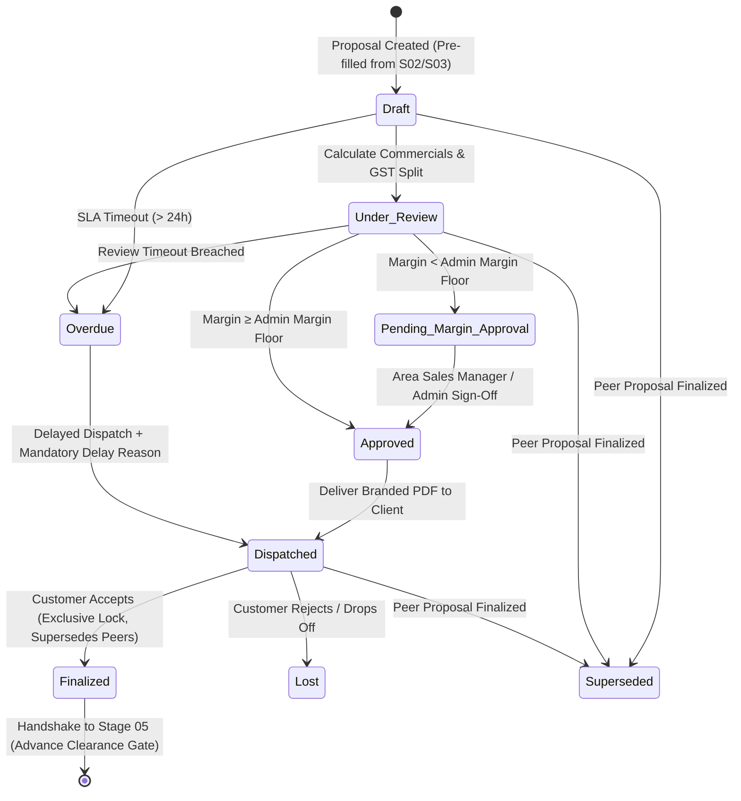

# STEP_04_PROPOSAL_SUBSIDY_SPECIFICATION.md

# Enterprise Lifecycle Step Specification: Proposal & Subsidy Engine

**Document ID:** `STEP-04-PROPOSAL`  
**Lifecycle Flow:** Flow 1: Core Solar EPC Project Execution (Stage 04 of 11)  
**Governing Architecture:** [`architect_docs/02_STEP_PLANNING_SPECIFICATION_BLUEPRINT.md`](../architect_docs/02_STEP_PLANNING_SPECIFICATION_BLUEPRINT.md)  
**Architecture Decision Record:** [`docs/decisions/ADR-004-PROPOSAL-SUBSIDY-ENGINE.md`](../docs/decisions/ADR-004-PROPOSAL-SUBSIDY-ENGINE.md)  
**PRD / FRS Traceability:** [`planning_ref_docs/01_PROJECT_FOUNDATION_MODEL.md`](../planning_ref_docs/01_PROJECT_FOUNDATION_MODEL.md) (`BC-04`, `Sec 3.4`), [`planning_ref_docs/05_BUSINESS_REQUIREMENTS_DOCUMENT.md`](../planning_ref_docs/05_BUSINESS_REQUIREMENTS_DOCUMENT.md) (`BR-004`), [`planning_ref_docs/06_FUNCTIONAL_REQUIREMENTS_SPECIFICATION.md`](../planning_ref_docs/06_FUNCTIONAL_REQUIREMENTS_SPECIFICATION.md) (`FR-004`), [`planning_ref_docs/08_DATABASE_DESIGN_DOCUMENT.md`](../planning_ref_docs/08_DATABASE_DESIGN_DOCUMENT.md) (`Domain 4: FIN`), [`planning_ref_docs/09_API_DESIGN_AND_INTEGRATIONS.md`](../planning_ref_docs/09_API_DESIGN_AND_INTEGRATIONS.md) (`API 4`), [`planning_ref_docs/10_UI_UX_SPECIFICATION.md`](../planning_ref_docs/10_UI_UX_SPECIFICATION.md) (`Screen 7`), [`planning_ref_docs/11_MODULE_FUNCTIONAL_DOCUMENTATION.md`](../planning_ref_docs/11_MODULE_FUNCTIONAL_DOCUMENTATION.md) (`MOD-04`)  
**Target Module:** `solar_module` / `manoj` (Extending ERPNext `Quotation` via Custom Fields & Property Setters, aliased universally as `Proposal`)  
**Author:** Principal Enterprise Architect  
**Status:** Ready for Implementation

---

## 1. Step Scope, Objectives & Context Traceability

### 1.1 Lifecycle Positioning & Commercial Context

Stage 04 (**Proposal & Subsidy Engine**) represents the pivotal commercial gateway in the Solar EPC Project Execution Lifecycle. Triggered upon successful completion and freezing of Stage 03 (**Survey Engineering Design & Dynamic BOM Freeze**), Stage 04 transforms technical sizing parameters, cable run schedules, and frozen material bills into legally compliant, financially viable, client-facing **Proposals**.

In standard ERP systems, commercial quotations are treated as simple, static line-item estimates. In contrast, Sadbhav Solar EPC operations require a dynamic commercial engine:

1. **Universal Business Terminology:** Across all sales operations, executive reviews, client portals, and contracts, the document is designated strictly as **`Proposal`** (architecturally extending ERPNext's standard `Quotation` with complete label aliasing).
2. **Repetitive Multi-Proposal Capabilities for the Same Project:** Prospective customers routinely request multiple commercial configurations for the same physical property (e.g. comparing 5 kW, 8 kW, and 10 kW systems, comparing Tier 1 Mono-Perc vs. TopCon Bifacial modules, or requesting revised commercial discount structures). The platform natively supports **generating multiple proposals for the same project/survey**, with an **exclusive finalization lock** ensuring that exactly one proposal is accepted and finalized, while peer proposals are automatically marked `Superseded` (or all marked `Lost`/`Rejected` if the customer drops off).
3. **Automated Two-Tier Data Pre-Fill Pipeline:** Commercial proposals automatically ingest field data from Stage 02 (`Site Survey`—such as customer contact info, site address, GPS coordinates, roof surface type, sanctioned connected load, DISCOM board, and consumer number) and engineering data from Stage 03 (`Survey Engineering Design`—designed kWp capacity, module/inverter models, cable lengths, and the exploded Bill of Quantities verified via `bom_hash`).
4. **Configurable Indian Solar EPC Composite GST (70:30 Rule):** To maintain full statutory compliance with Ministry of Finance / CBIC circulars for solar EPC turnkey contracts, the gross project value is bifurcated into **70% supply of Goods** (`Solar Power Plant` @ 12% or 5% concessional GST) and **30% supply of Services** (`Installation & Commissioning` @ 18% GST). The system allows custom ratio overrides if mandated by specific client contracts.
5. **Dual Subsidy Computation Engine:** Integrates both **pre-defined subsidy scheme selection** (e.g. PM Surya Ghar Residential, PM Surya Ghar GHS/RWA, PM KUSUM Component B) and **Admin-managed Central & State subsidy slabs** in `Solar Proposal Settings`, calculating net customer investment and energy payback period.
6. **Admin-Controlled Gross Margin Floor Governance:** Compares live BOM cost against selling price. Any proposal falling below the corporate margin floor threshold requires mandatory review and digital approval from the `Area Sales Manager` or `Admin`.
7. **Advance Verification & Executive Goodwill Gate:** Establishes clear criteria for commercial clearance: standard advance collection ($\ge 50\%$), formal finance officer waiver, or **Goodwill / VIP Customer Approval** granted directly by the Owner / CEO / Managing Director / Admin (requiring zero financial clearance).
8. **Prospect Quarantine:** Prospects remain strictly inside `tabLead` throughout Stage 04. No ERPNext `Customer` master is created until Stage 05 financial clearance.

```
┌──────────────────┐       ┌────────────────────────────────────────────────────────┐       ┌──────────────────┐
│    STAGE 03:     │       │                STAGE 04: PROPOSAL & SUBSIDY            │       │    STAGE 05:     │
│ Survey Eng Design│──────▶│ - Repetitive Multi-Proposals per Survey / Deal         │──────▶│ Advance Clearance│
│ & Dynamic BOM    │       │ - Auto Pre-Fill from Survey (S02) & Design (S03)       │       │ & Customer Gate  │
│ (Frozen bom_hash)│       │ - Configurable 70:30 Composite Solar GST Engine        │       │ (≥50% Advance OR │
│                  │       │ - Pre-Defined & Admin-Configured Subsidy Slabs         │       │ Goodwill VIP CEO)│
│                  │       │ - Admin-Controlled Gross Margin Floor Governance Gate  │       │                  │
│                  │       │ - Exclusive Finalization Lock (1 Accepted, Rest Supers)│       │                  │
│                  │       │ - 24-Hour SLA / TAT Engine with Delay Logging          │       │                  │
└──────────────────┘       └────────────────────────────────────────────────────────┘       └──────────────────┘
```

- **Predecessor:** Stage 03: Survey Engineering Design (`Survey Engineering Design` submitted with `stage_status == 'Frozen'`).
- **Successor:** Stage 05: Advance Payment & Customer Inception Gate (`custom_is_finalized == 1`, advance $\ge 50\%$ or Goodwill waiver $\rightarrow$ `Customer` master creation).

### 1.2 Core Business Objectives & Target KPIs

1. **Sub-15-Minute Proposal Generation (Turnaround Time):** Enable sales executives to generate and dispatch accurate, branded proposals in under 15 minutes by auto-populating survey parameters and engineering BOMs.
2. **100% Margin Floor Protection:** Prevent unauthorized margin erosion through automated gross margin calculations and non-bypassable manager approval gates.
3. **Flawless Statutory Tax Compliance:** Eliminate GST audit penalties through automated 70:30 goods/services splitting on proposal line items and tax schedules.
4. **Zero Multi-Proposal State Collisions:** Eliminate operational confusion by programmatically enforcing that only one proposal per survey/deal can be finalized, while preserving complete revision history.
5. **Pre-Defined Subsidy Precision:** Ensure zero subsidy clawbacks or customer disputes by calculating PM Surya Ghar and state top-up subsidies deterministically against Admin-managed slabs.
6. **Strict Customer Quarantine:** Protect the general ledger from lead pollution by guaranteeing that `Customer` master creation occurs strictly at Stage 05.

### 1.3 Failure Modes Eliminated

- **Ad-Hoc Discount Margin Erosion:** Sales representatives delivering steep unapproved discounts to close deals, leading to negative gross margins during procurement.
- **Turnkey Solar GST Audit Penalties:** Issuing single-line solar proposals taxed at an arbitrary tax rate without bifurcating goods (70%) and services (30%), exposing the company to tax penalties under Indian GST circulars.
- **Conflicting Dual Commitments:** Sending three different proposals for 5 kW, 8 kW, and 10 kW to a client, and having two different project managers mobilize materials for different capacities simultaneously.
- **Manual Data Re-Entry Errors:** Transposing incorrect module quantities, inverter ratings, or cable run lengths from design drawings into commercial quotes.
- **Miscalculated Subsidies:** Promising clients ineligible subsidy amounts under PM Surya Ghar due to unverified sanctioned loads or obsolete subsidy slab rates.

---

## 2. Stakeholders, Enterprise Actors & HRMS Role Mapping

### 2.1 Enterprise User Roles Matrix

### 2.1 Enterprise User Roles Matrix

In strict compliance with [`ADR-020`](../docs/decisions/ADR-020-ENTERPRISE-ROLE-PERMISSION-ARCHITECTURE.md) and the **Zero "User" Suffix Rule**, proposal generation is decoupled from field sales to inside CRM/Costing governance, with all actors designated using functional enterprise titles:

| Persona / Business Actor      | Frappe System Role   | HRMS Department           | HRMS Designation            | Operational Responsibilities                                                                                                   |
| :---------------------------- | :------------------- | :------------------------ | :-------------------------- | :----------------------------------------------------------------------------------------------------------------------------- |
| **CRM Proposal Specialist**   | `CRM Representative` | Commercial & CRM          | `CRM Costing Executive`     | Ingests survey & design, selects proposal templates, configures commercial options, drafts proposals, delivers to client.      |
| **CRM & Commercial Lead**     | `CRM Manager`        | Commercial & CRM          | `Commercial & CRM Manager`  | Audits commercial pricing, validates composite GST splits, reviews subsidies, approves gross margin floor overrides.           |
| **Sales Department Manager**  | `Sales Manager`      | Sales & Marketing         | `Sales Manager`             | Monitors customer proposal acceptance, aligns pipeline projections, coordinates customer negotiations.                         |
| **Finance & Accounts Lead**   | `Accounts Manager`   | Accounts & Finance        | `Accounts Manager`          | Reviews commercial milestone structures, manages formal advance payment clearance or finance advance waivers.                  |
| **Solar Design Specialist**   | `Design Engineer`    | Design & Engineering      | `Solar Design Engineer`     | Upstream contributor (Stage 03); provides frozen `Survey Engineering Design`, technical ratings, and dynamic BOM (`bom_hash`). |
| **Executive Supreme Command** | `Admin`              | Executive Leadership      | `Managing Director` / `CEO` | Supreme operational command; grants Goodwill / VIP advance waivers, manages `Solar Proposal Settings`, and reviews margins.    |
| **Technical DevOps Lead**     | `System Manager`     | Technology Infrastructure | `DevOps Architect`          | Framework apex; manages DocType schemas, custom fields, Property Setters, Redis worker queues, and bench CLI tooling.          |

> [!IMPORTANT]
> **Enterprise Authority Hierarchy & ADR-020 Operational Governance:**
>
> - **Proposal Decoupling Rationale:** In commercial practice, proposals and subsidy calculations are frequently modeled by dedicated CRM/Costing teams. Decoupling Stage 04 to `CRM Representative` and `CRM Manager` eliminates operational bottlenecks; sales staff who also generate quotes in smaller setups are simply assigned the `CRM Representative` role in Frappe.
> - **Managerial Authority Inheritance:** `CRM Manager` strictly inherits all operational capabilities of `CRM Representative`.
> - **Stage-Forward Lock:** Once `Payment Entry` (Stage 05 advance clearance) is submitted or `Sales Order` (Stage 06) is created, the `Quotation` (Proposal) is permanently locked against cancel and amend.
> - **Admin Deletion Safeguards:** Admin interventions are guarded by downstream dependency warnings, hard deletion blocks, and atomic cascade purges (`tabSolar Deletion Audit Log`).

### 2.2 Permission Hierarchy Matrix

| DocType / Action                           | CRM Representative |   CRM Manager   |  Sales Manager  | Accounts Manager |      Admin\*      |
| :----------------------------------------- | :----------------: | :-------------: | :-------------: | :--------------: | :---------------: |
| **Proposal / Quotation (Read)**            |   Assigned Only    | Full Department | Full Territory  |    Permitted     |    All Records    |
| **Proposal / Quotation (Create)**          |     Permitted      |    Permitted    |    Read Only    |        No        |        Yes        |
| **Proposal / Quotation (Write/Edit)**      |  Own (Draft Only)  | Full Department |    Read Only    |        No        |    All Records    |
| **Proposal / Quotation (Submit)**          |   Yes (Pre-S05)    |  Yes (Pre-S05)  |       No        |        No        |        Yes        |
| **Margin Floor Override Approval**         |     Restricted     |     **Yes**     |   Restricted    |    Restricted    | **Yes (Supreme)** |
| **Proposal Finalization (`is_finalized`)** |     Permitted      |       Yes       |    Permitted    |        No        |        Yes        |
| **Goodwill / VIP Advance Waiver**          |     Restricted     |   Restricted    |   Restricted    |    Restricted    | **Yes (CEO/MD)**  |
| **Solar Proposal Template (Manage)**       |     Read Only      |    Permitted    |    Read Only    |    Read Only     |        Yes        |
| **Solar Proposal Settings (Manage)**       |         No         |       No        |       No        |        No        | Yes (Admin Only)  |
| **Remark-Delay Log (Append)**              |     Own Record     | Full Department | Full Department |    Permitted     |    Full Access    |

_\*Note: Frappe `Administrator` and `System Manager` sit above `Admin` and inherit all permissions._

---

## 3. Relational Schema & 3NF Data Dictionary

### 3.1 Core Entity Modeling: Extending ERPNext `tabQuotation`

Stage 04 implements **Option B** by extending ERPNext's standard `tabQuotation` with clean, categorized `custom_*` fields, aliasing the document universally across UI forms, list views, and reports as **`Proposal`**:

| Fieldname                          | Label                          | Fieldtype    | Options / Target                                                                                  | Mandatory |    Index     | Description & Validation Rules                                                                  |
| :--------------------------------- | :----------------------------- | :----------- | :------------------------------------------------------------------------------------------------ | :-------: | :----------: | :---------------------------------------------------------------------------------------------- |
| `custom_proposal_id`               | Proposal Reference ID          | `Data`       | -                                                                                                 |    No     | **Index: 1** | Formatted commercial identifier (e.g. `PROP-2026-00124-A`).                                     |
| `custom_site_survey`               | Linked Site Survey             | `Link`       | `Site Survey`                                                                                     |  **Yes**  | **Index: 1** | Foreign key linking upstream Stage 02 survey.                                                   |
| `custom_survey_engineering_design` | Linked Engineering Design      | `Link`       | `Survey Engineering Design`                                                                       |    No     | **Index: 1** | Foreign key linking upstream Stage 03 design. Must have `stage_status == 'Frozen'`.             |
| `party_name`                       | Prospect Reference (Lead)      | `Link`       | `Lead`                                                                                            |  **Yes**  | **Index: 1** | Standard ERPNext quotation target. Enforces quarantine: `quotation_to == 'Lead'`.               |
| `custom_solar_capacity`            | Solar Capacity (kW)            | `Float`      | -                                                                                                 |  **Yes**  |      -       | Sized DC plant capacity. Pre-filled from SED or selected from template. Precision: 2.           |
| `custom_plant_category`            | Plant Category                 | `Select`     | `Residential\nCommercial\nIndustrial\nAgricultural (KUSUM)`                                       |  **Yes**  |      -       | Determines tariff logic, tax eligibility, and subsidy applicability.                            |
| `custom_system_type`               | System Type                    | `Select`     | `On-Grid\nHybrid\nOff-Grid`                                                                       |  **Yes**  |      -       | Ingested from survey/design; dictates inverter topology.                                        |
| `custom_mount_type`                | MMS Mounting Type              | `Select`     | `Normal\nElevated\nProfile Sheet\nBallast\nGround Screws\nOthers`                                 |  **Yes**  |      -       | Ingested from survey/design; dictates structural cost allowances.                               |
| `custom_proposal_template`         | Proposal Package Template      | `Link`       | `Solar Proposal Template`                                                                         |    No     |      -       | Optional master template providing standardized capacity equipment & pricing packages.          |
| `custom_goods_services_ratio`      | GST Supply Ratio Standard      | `Select`     | `70:30 Standard (CBIC)\n100:0 Supply Only\n0:100 Service Only\nCustom Ratio`                      |  **Yes**  |      -       | Controls statutory goods vs services tax split. Default: `70:30 Standard (CBIC)`.               |
| `custom_goods_ratio_pct`           | Goods Proportion (%)           | `Percent`    | -                                                                                                 |  **Yes**  |      -       | Percentage allocated to Goods (`Solar Power Plant`). Default: 70.0%. Editable on custom ratio.  |
| `custom_services_ratio_pct`        | Services Proportion (%)        | `Percent`    | -                                                                                                 |  **Yes**  |      -       | Percentage allocated to Services (`Installation & Commissioning`). Default: 30.0%.              |
| `custom_subsidy_scheme`            | Pre-Defined Subsidy Scheme     | `Link`       | `Solar Subsidy Scheme`                                                                            |    No     |      -       | Master link to pre-defined government subsidy program.                                          |
| `custom_central_subsidy_amount`    | Central Subsidy (CFA ₹)        | `Currency`   | `Company:currency`                                                                                |    No     |      -       | Computed PM Surya Ghar or PM KUSUM Central Financial Assistance.                                |
| `custom_state_subsidy_amount`      | State Top-Up Subsidy (₹)       | `Currency`   | `Company:currency`                                                                                |    No     |      -       | Computed state DISCOM top-up subsidy based on Admin-configured slabs.                           |
| `custom_total_subsidy_amount`      | Total Subsidy Amount (₹)       | `Currency`   | `Company:currency`                                                                                |    No     |      -       | Sum of `custom_central_subsidy_amount` and `custom_state_subsidy_amount`.                       |
| `custom_net_customer_payable`      | Net Customer Payable (₹)       | `Currency`   | `Company:currency`                                                                                |  **Yes**  |      -       | Computed: `grand_total - custom_total_subsidy_amount`. Net investment required by customer.     |
| `custom_annual_generation_kwh`     | Estimated Annual Yield (kWh)   | `Float`      | -                                                                                                 |    No     |      -       | Estimated energy output ($kWh/\text{year}$) based on specific yield factor (e.g. 1450 kWh/kWp). |
| `custom_annual_savings_amount`     | Estimated Annual Savings (₹)   | `Currency`   | `Company:currency`                                                                                |    No     |      -       | Computed: `annual_generation_kwh * grid_tariff_rate`.                                           |
| `custom_payback_years`             | Estimated Simple Payback (Yrs) | `Float`      | -                                                                                                 |    No     |      -       | Computed: `custom_net_customer_payable / custom_annual_savings_amount`. Precision: 1.           |
| `custom_estimated_bom_cost`        | Total Estimated BOM Cost (₹)   | `Currency`   | `Company:currency`                                                                                |  **Yes**  |      -       | Aggregated live material and procurement cost of BOM components from Stage 03.                  |
| `custom_gross_margin_pct`          | Calculated Gross Margin (%)    | `Percent`    | -                                                                                                 |  **Yes**  | **Index: 1** | Computed: `((net_total - custom_estimated_bom_cost) / net_total) * 100`. Precision: 2.          |
| `custom_margin_status`             | Gross Margin Evaluation        | `Select`     | `Within Margin\nMargin Floor Exception\nMargin Override Approved`                                 |  **Yes**  | **Index: 1** | System evaluated status against Admin-configured floor. Default: `Within Margin`.               |
| `custom_margin_approved_by`        | Margin Override Approver       | `Link`       | `User`                                                                                            |    No     |      -       | Digital signature of `Area Sales Manager` or `Admin` authorizing sub-floor margin.              |
| `custom_margin_override_remark`    | Margin Override Justification  | `Small Text` | -                                                                                                 |    No     |      -       | Mandatory justification text explaining approved commercial exception.                          |
| `custom_advance_requirement_pct`   | Required Advance (%)           | `Percent`    | -                                                                                                 |  **Yes**  |      -       | Commercial advance threshold required to mobilize. Default: 50.0%. Admin-configurable.          |
| `custom_advance_waiver_type`       | Advance Payment Clearance Gate | `Select`     | `Standard (≥50% Required)\nFinance Approved Waiver\nGoodwill / VIP Approved`                      |  **Yes**  |      -       | Governs Stage 05 financial gate. Default: `Standard (≥50% Required)`.                           |
| `custom_advance_waived_by`         | Advance Waived / Approved By   | `Link`       | `User`                                                                                            |    No     |      -       | Required if advance waiver is granted. Goodwill waiver restricted to CEO / MD / Admin.          |
| `custom_advance_waiver_remark`     | Advance Waiver Justification   | `Small Text` | -                                                                                                 |    No     |      -       | Mandatory justification for advance waiver or VIP customer classification.                      |
| `custom_is_finalized`              | Finalized Commercial Proposal  | `Check`      | -                                                                                                 |  **Yes**  | **Index: 1** | Exactly ONE proposal per site survey can be 1. Triggers peer proposal invalidation.             |
| `custom_superseded_by`             | Superseded by Proposal         | `Link`       | `Quotation`                                                                                       |    No     |      -       | Points to the winning finalized proposal if this proposal was superseded.                       |
| `custom_finalized_datetime`        | Finalization Timestamp         | `Datetime`   | -                                                                                                 |    No     |      -       | Timestamp when customer accepted and proposal was locked as finalized.                          |
| `custom_bom_hash`                  | Cryptographic BOM Checksum     | `Data`       | -                                                                                                 |    No     | **Index: 1** | Ingested SHA-256 hash from Stage 03 to verify material integrity.                               |
| `custom_extra_cable_calculation`   | Extra Cable Length Table       | `Table`      | `Cable Calculation Table`                                                                         |    No     |      -       | Child table capturing billable cable lengths exceeding standard allowances.                     |
| `custom_proposal_sent_date`        | Proposal Dispatched Date       | `Date`       | -                                                                                                 |    No     |      -       | Date proposal PDF was emailed / messaged to client.                                             |
| `custom_proposal_sent_days`        | Age Since Dispatch (Days)      | `Int`        | -                                                                                                 |    No     |      -       | Programmatically updated daily by background worker.                                            |
| `custom_next_followup_date`        | Next Commercial Followup       | `Date`       | -                                                                                                 |    No     |      -       | Scheduled date for sales followup call/meeting.                                                 |
| `stage_status`                     | Lifecycle Stage Status         | `Select`     | `Draft\nUnder Review\nPending Margin Approval\nApproved\nDispatched\nFinalized\nSuperseded\nLost` |  **Yes**  | **Index: 1** | Universal operational workflow state.                                                           |
| `for_proposal_assign_on`           | Assignment Datetime            | `Datetime`   | -                                                                                                 |  **Yes**  |      -       | Timestamp when Stage 04 began; initiates 24-hour proposal SLA clock.                            |
| `exp_complete_date`                | SLA Due Datetime               | `Datetime`   | -                                                                                                 |  **Yes**  | **Index: 1** | Computed deadline: `for_proposal_assign_on + SLA_Hours`.                                        |
| `completed_date`                   | Completion Datetime            | `Datetime`   | -                                                                                                 |    No     |      -       | Timestamp when proposal was dispatched or finalized.                                            |
| `complete_status`                  | SLA Compliance Status          | `Select`     | `On Time\nDelayed`                                                                                |    No     |      -       | Evaluated compliance outcome against configured SLA.                                            |
| `delay_log`                        | Delay Reason Summary           | `Small Text` | -                                                                                                 |    No     |      -       | Mandatory summary when `complete_status == 'Delayed'`.                                          |
| `remark_delay_log`                 | Granular Delay Audit Table     | `Table`      | `Remark-Delay Log`                                                                                |    No     |      -       | Immutable audit log capturing user, timestamp, delay category, and remarks.                     |

---

### 3.2 Extended Child DocType: `tabQuotation Item`

Standard ERPNext `tabQuotation Item` is extended to support composite 70:30 solar splits, category tags, and base rates:

| Fieldname            | Label                   | Fieldtype  | Options / Target                                                                          | Mandatory | In List View | Description & Business Rules                                                                 |
| :------------------- | :---------------------- | :--------- | :---------------------------------------------------------------------------------------- | :-------: | :----------: | :------------------------------------------------------------------------------------------- |
| `item_code`          | Item Code               | `Link`     | `Item`                                                                                    |  **Yes**  |      1       | ERPNext stock/service item (`Solar Power Plant`, `Installation & Commissioning`, or BOS).    |
| `custom_category`    | Supply Category         | `Select`   | `Solar Equipment (Goods)\nInstallation & Civil (Services)\nAdditional BOS\nExtra Cabling` |  **Yes**  |      1       | Distinguishes goods from services for GST classification.                                    |
| `solar_base_rate`    | Base Price Before Extra | `Currency` | `Company:currency`                                                                        |    No     |      1       | Base package rate prior to absorbing extra cable additions.                                  |
| `custom_capacity_wp` | Rated Capacity          | `Data`     | -                                                                                         |    No     |      1       | Technical rating (e.g. `550 Wp`, `10 kW`).                                                   |
| `item_tax_template`  | GST Tax Template        | `Link`     | `Item Tax Template`                                                                       |  **Yes**  |      1       | Mandates `GST 12% - Solar Goods` (or 5%) for Goods; `GST 18% - Solar Services` for Services. |

---

### 3.3 Configuration Master: `tabSolar Proposal Settings` (Single DocType)

Governed exclusively by **`Admin`** to manage commercial policies across the company:

| Fieldname                        | Label                          | Fieldtype  | Options / Target             | Mandatory | Description & Rules                                                                        |
| :------------------------------- | :----------------------------- | :--------- | :--------------------------- | :-------: | :----------------------------------------------------------------------------------------- |
| `default_gross_margin_floor_pct` | Default Gross Margin Floor (%) | `Percent`  | -                            |  **Yes**  | Corporate margin floor (default: 18.0%). Quotations below this require ASM/Admin approval. |
| `default_advance_pct`            | Default Advance Payment (%)    | `Percent`  | -                            |  **Yes**  | Standard advance percentage required before project mobilization (default: 50.0%).         |
| `default_proposal_sla_hours`     | Proposal Generation SLA (Hrs)  | `Int`      | -                            |  **Yes**  | SLA turnaround time in hours (default: 24).                                                |
| `default_goods_ratio_pct`        | Default Goods Ratio (%)        | `Percent`  | -                            |  **Yes**  | Default 70.0% for turnkey contracts.                                                       |
| `default_services_ratio_pct`     | Default Services Ratio (%)     | `Percent`  | -                            |  **Yes**  | Default 30.0% for turnkey contracts.                                                       |
| `specific_yield_kwh_per_kwp`     | Annual Specific Yield Factor   | `Float`    | -                            |  **Yes**  | Energy generation multiplier (default: 1450.0 kWh/kWp/year).                               |
| `default_grid_tariff_rate`       | Default Grid Tariff (₹/kWh)    | `Currency` | `Company:currency`           |  **Yes**  | Base electricity utility tariff used for client payback forecasting (e.g. ₹7.50 / kWh).    |
| `central_subsidy_slabs`          | Central Subsidy Slabs          | `Table`    | `Solar Central Subsidy Slab` |  **Yes**  | Child table defining PM Surya Ghar CFA brackets. Admin-editable.                           |
| `state_subsidy_slabs`            | State Subsidy Slabs            | `Table`    | `Solar State Subsidy Slab`   |    No     | Child table defining state DISCOM top-up subsidies. Admin-editable.                        |

#### Child Table: `tabSolar Central Subsidy Slab`

- `from_kw` (`Float`): Capacity lower bound (e.g. 0.0 kW)
- `to_kw` (`Float`): Capacity upper bound (e.g. 2.0 kW)
- `subsidy_per_kw` (`Currency`): Amount per kW (e.g. ₹30,000)
- `fixed_amount` (`Currency`): Fixed subsidy amount (if applicable)
- `max_subsidy_amount` (`Currency`): Ceiling limit (e.g. ₹78,000 for residential rooftop $\ge 3\text{ kW}$)

#### Child Table: `tabSolar State Subsidy Slab`

- `state` (`Data`): Target Indian State (e.g. `Gujarat`, `Maharashtra`, `Rajasthan`, `Uttar Pradesh`)
- `plant_category` (`Select`): `Residential`, `Agricultural (KUSUM)`, `RWA/GHS`
- `subsidy_per_kw` (`Currency`): State top-up per kW
- `max_subsidy_amount` (`Currency`): Maximum state subsidy cap

---

### 3.4 Master DocType: `tabSolar Subsidy Scheme`

A reusable master providing pre-defined government subsidy schemes selectable directly in proposals:

- **Naming:** `field:scheme_name`
- **Fields:**
  - `scheme_name` (`Data`, Unique): e.g. `PM Surya Ghar - Residential Individual`, `PM Surya Ghar - GHS/RWA`, `PM KUSUM - Component B (Pumps)`, `Surya Gujarat Top-Up`.
  - `is_active` (`Check`): Default: 1.
  - `applicable_category` (`Select`): `Residential`, `Agricultural`, `Commercial`, `All`.
  - `description` (`Small Text`): Scheme guidelines, eligibility notes, and portal reference links.

---

## 4. State Machine, Verification Gates & SLA Engine

### 4.1 State Machine Lifecycle Diagram

The proposal state machine supports repetitive proposals for the same project with an exclusive finalization lock:



### 4.2 Hard Verification Gates

Before transitioning states or delivering proposals to prospective customers, the system executes six mandatory server-side verification gates:

```
┌──────────────────────────────────────────────────────────────────────────────────────────────────┐
│                               STAGE 04 HARD VERIFICATION GATES                                   │
├──────────────────────────────────────────────────────────────────────────────────────────────────┤
│ Gate 1: Upstream Ingestion & Data Pre-Fill Gate                                                  │
│ - Mandatory reference to active `tabSite Survey` (`custom_site_survey`)                          │
│ - Prospect must be quarantined in `tabLead` (`quotation_to == 'Lead'`)                           │
│ - If linked to `Survey Engineering Design`, SED must be submittable and frozen (`is_frozen == 1`)│
├──────────────────────────────────────────────────────────────────────────────────────────────────┤
│ Gate 2: Sizing & Live BOM Cost Verification Gate (`bom_hash`)                                    │
│ - If created from Stage 03 SED, SHA-256 hash of BOM rows must match SED `bom_hash`               │
│ - `custom_estimated_bom_cost` must be > 0.0, computed from live price list rates                  │
│ - Prevents quoting against unpriced or tampered engineering bills of quantities                  │
├──────────────────────────────────────────────────────────────────────────────────────────────────┤
│ Gate 3: Configurable Composite Solar GST Gate (70:30 Rule)                                       │
│ - Line item 1 must be `Solar Power Plant` representing `custom_goods_ratio_pct` (default 70%)    │
│ - Line item 2 must be `Installation & Commissioning` representing `services_ratio` (default 30%) │
│ - Line item tax templates must correctly map to Goods GST and Services GST                       │
│ - Sum of goods and services ratios must equal exactly 100.0%                                     │
├──────────────────────────────────────────────────────────────────────────────────────────────────┤
│ Gate 4: Admin-Controlled Gross Margin Floor Governance Gate                                      │
│ - Calculated `custom_gross_margin_pct` evaluated against `default_gross_margin_floor_pct`         │
│ - If margin < floor, status transitions to `Pending Margin Approval`                             │
│ - Document dispatch and finalization are HARD-BLOCKED until `Area Sales Manager` or `Admin`      │
│   populates `custom_margin_approved_by` and `custom_margin_override_remark`                      │
├──────────────────────────────────────────────────────────────────────────────────────────────────┤
│ Gate 5: Exclusive Proposal Finalization Gate                                                     │
│ - Only ONE proposal per `custom_site_survey` can have `custom_is_finalized == 1`                 │
│ - Marking proposal as `Finalized` executes atomic database lock, updating all peer unfinalized   │
│   proposals for the same survey to `Superseded` and logging audit comments                       │
├──────────────────────────────────────────────────────────────────────────────────────────────────┤
│ Gate 6: Advance Clearance / Goodwill VIP Verification Gate                                       │
│ - Before advancing to Stage 05/06:                                                               │
│   - Condition A: Verified customer advance receipt ≥ 50.0% (`custom_advance_requirement_pct`)    │
│   - Condition B: OR `custom_advance_waiver_type == 'Finance Approved'` (with finance officer sign)│
│   - Condition C: OR `custom_advance_waiver_type == 'Goodwill / VIP Approved'` (authorized        │
│     strictly by Managing Director / CEO / Admin, bypassing all finance clearance)                │
└──────────────────────────────────────────────────────────────────────────────────────────────────┘
```

### 4.3 SLA, TAT Engine & Delay Logging

1. **SLA Configuration:** Configured in `tabSolar Proposal Settings` via `default_proposal_sla_hours` (default: 24 hours).
2. **Clock Initialization:** Triggered upon proposal creation (`for_proposal_assign_on = now_datetime()`). The system computes:
   $$\text{exp\_complete\_date} = \text{for\_proposal\_assign\_on} + \text{SLA\_Hours}$$
3. **Automated Escalation Daemon:** A background task running every 15 minutes checks active un-dispatched proposals against `exp_complete_date`. If `now_datetime() > exp_complete_date`:
   - Updates `stage_status = 'Overdue'`.
   - Sets `complete_status = 'Delayed'`.
   - Emits real-time Raven notification card to `Area Sales Manager` and `Admin`.
4. **Mandatory Delay Reason Gate:** Once marked `Overdue`, saving, submitting, or dispatching the proposal is hard-blocked unless a justified delay entry is recorded in `tabRemark-Delay Log` (`user`, `timestamp`, `delay_reason`, and descriptive remarks).

---

## 5. Controller Logic, Domain Services & Whitelisted APIs

### 5.1 Architecture: Decoupled Domain Service Layer

In strict accordance with SOLID architecture ([`architect_docs/05_DESIGN_PATTERNS_DOMAIN_SERVICES_SOLID.md`](../architect_docs/05_DESIGN_PATTERNS_DOMAIN_SERVICES_SOLID.md)), all mathematical modeling, pre-filling, subsidy evaluation, and finalization logic are decoupled into pure Python domain services:

```
┌────────────────────────────────────────────────────────────────────────────────────────┐
│                                 DOMAIN SERVICE LAYER                                   │
├───────────────────────────────┬────────────────────────────────────────────────────────┤
│ `ProposalPrefillService`      │ Pre-populates proposal from Site Survey & Design       │
│ `ProposalCalculationService`  │ Handles 70:30 GST splitting, BOM costing, extra cables │
│ `ProposalSubsidyService`      │ Calculates PM Surya Ghar CFA, state slabs, payback     │
│ `ProposalMarginGateService`   │ Enforces gross margin floor & routes approval          │
│ `ProposalFinalizationService` │ Manages multi-proposal atomic finalization lock        │
│ `ProposalSLAService`          │ Monitors 24h SLA clocks and validates delay logs       │
│ `ProposalPDFService`          │ Generates executive branded PDF proposal documents     │
└───────────────────────────────┴────────────────────────────────────────────────────────┘
```

### 5.2 Service Implementation Blueprints

#### 1. `ProposalPrefillService` (Survey & Design Ingestion)

```python
class ProposalPrefillService:
    @staticmethod
    def prefill_from_survey_and_design(quotation_doc, site_survey_name, sed_name=None):
        """
        Auto-populates quotation from upstream Stage 02 (Survey) and Stage 03 (Design).
        """
        survey = frappe.get_doc("Site Survey", site_survey_name)

        quotation_doc.custom_site_survey = survey.name
        quotation_doc.party_name = survey.lead
        quotation_doc.quotation_to = "Lead"
        quotation_doc.custom_system_type = survey.system_type or "On-Grid"
        quotation_doc.custom_mount_type = survey.mounting_type or "Normal"
        quotation_doc.custom_plant_category = (
            "Residential" if survey.site_type in ["RCC", "Shed (Profile Sheet)"] else "Commercial"
        )

        if sed_name:
            sed = frappe.get_doc("Survey Engineering Design", sed_name)
            if sed.docstatus != 1 or not sed.is_frozen:
                frappe.throw(
                    _("Survey Engineering Design {0} must be Submitted and Frozen before linking.")
                    .format(sed_name),
                    frappe.ValidationError
                )
            quotation_doc.custom_survey_engineering_design = sed.name
            quotation_doc.custom_solar_capacity = sed.actual_designed_capacity or sed.target_capacity
            quotation_doc.custom_bom_hash = sed.bom_hash

            # Aggregate live estimated BOM cost
            total_bom_cost = 0.0
            for row in sed.get("bom_items", []):
                rate = row.estimated_unit_rate or frappe.db.get_value("Item", row.item_code, "valuation_rate") or 0.0
                total_bom_cost += flt(row.quantity) * flt(rate)
            quotation_doc.custom_estimated_bom_cost = total_bom_cost
```

#### 2. `ProposalCalculationService` (Composite 70:30 GST & Extra Cables)

```python
class ProposalCalculationService:
    @staticmethod
    def calculate_commercial_split(quotation_doc):
        """
        Calculates Goods (70%) vs Services (30%) bifurcation and incorporates extra cables.
        """
        settings = frappe.get_cached_doc("Solar Proposal Settings")

        # Determine ratios
        goods_ratio = flt(quotation_doc.custom_goods_ratio_pct) or flt(settings.default_goods_ratio_pct, 70.0)
        services_ratio = flt(quotation_doc.custom_services_ratio_pct) or flt(settings.default_services_ratio_pct, 30.0)

        if round(goods_ratio + services_ratio, 2) != 100.0:
            frappe.throw(_("Goods and Services ratio must sum to exactly 100.0%."))

        # Calculate extra cable surcharge
        total_extra_cable_amt = 0.0
        for row in quotation_doc.get("custom_extra_cable_calculation", []):
            row.amt = flt(row.length) * flt(row.cable_rate)
            total_extra_cable_amt += row.amt

        # Allocate into standard Goods and Services items
        base_proposal_cost = flt(quotation_doc.custom_base_contract_value)
        goods_base = base_proposal_cost * (goods_ratio / 100.0)
        services_base = base_proposal_cost * (services_ratio / 100.0)

        # Allocate extra cables proportionally
        goods_total = goods_base + (total_extra_cable_amt * (goods_ratio / 100.0))
        services_total = services_base + (total_extra_cable_amt * (services_ratio / 100.0))

        # Re-build quotation items table
        quotation_doc.set("items", [])
        quotation_doc.append("items", {
            "item_code": "Solar Power Plant",
            "item_name": "Solar Power Plant Equipment (Supply of Goods)",
            "custom_category": "Solar Equipment (Goods)",
            "qty": 1,
            "rate": goods_total,
            "solar_base_rate": goods_base,
            "item_tax_template": "GST 12% - Solar Goods",
            "uom": "NOS"
        })
        quotation_doc.append("items", {
            "item_code": "Installation & Commissioning",
            "item_name": "Installation, Erection & Commissioning (Supply of Services)",
            "custom_category": "Installation & Civil (Services)",
            "qty": 1,
            "rate": services_total,
            "solar_base_rate": services_base,
            "item_tax_template": "GST 18% - Solar Services",
            "uom": "NOS"
        })
```

#### 3. `ProposalSubsidyService` (PM Surya Ghar & Payback Engine)

```python
class ProposalSubsidyService:
    @staticmethod
    def compute_subsidies_and_payback(quotation_doc):
        """
        Computes PM Surya Ghar Central CFA, State DISCOM Top-Up, Net Customer Investment, and Payback.
        """
        settings = frappe.get_cached_doc("Solar Proposal Settings")
        capacity = flt(quotation_doc.custom_solar_capacity)
        category = quotation_doc.custom_plant_category

        central_subsidy = 0.0
        state_subsidy = 0.0

        # 1. Central CFA Calculation (Admin-configured slabs)
        if category in ["Residential", "Agricultural (KUSUM)"]:
            for slab in settings.get("central_subsidy_slabs", []):
                from_kw = flt(slab.from_kw)
                to_kw = flt(slab.to_kw)
                if capacity > from_kw:
                    applicable_kw = min(capacity, to_kw) - from_kw
                    central_subsidy += applicable_kw * flt(slab.subsidy_per_kw)
                    if slab.max_subsidy_amount and central_subsidy > flt(slab.max_subsidy_amount):
                        central_subsidy = flt(slab.max_subsidy_amount)

        # 2. State Top-Up Subsidy Calculation
        survey_state = frappe.db.get_value("Site Survey", quotation_doc.custom_site_survey, "state")
        for state_slab in settings.get("state_subsidy_slabs", []):
            if state_slab.state == survey_state and state_slab.plant_category == category:
                calc_state = capacity * flt(state_slab.subsidy_per_kw)
                state_subsidy = min(calc_state, flt(state_slab.max_subsidy_amount or calc_state))
                break

        quotation_doc.custom_central_subsidy_amount = central_subsidy
        quotation_doc.custom_state_subsidy_amount = state_subsidy
        quotation_doc.custom_total_subsidy_amount = central_subsidy + state_subsidy

        # Net Investment
        quotation_doc.custom_net_customer_payable = max(0.0, flt(quotation_doc.grand_total) - quotation_doc.custom_total_subsidy_amount)

        # Energy Yield & Payback
        specific_yield = flt(settings.specific_yield_kwh_per_kwp, 1450.0)
        tariff = flt(settings.default_grid_tariff_rate, 7.50)

        annual_units = capacity * specific_yield
        annual_savings = annual_units * tariff

        quotation_doc.custom_annual_generation_kwh = annual_units
        quotation_doc.custom_annual_savings_amount = annual_savings
        quotation_doc.custom_payback_years = (
            round(quotation_doc.custom_net_customer_payable / annual_savings, 1) if annual_savings > 0 else 0.0
        )
```

#### 4. `ProposalMarginGateService` (Gross Margin Floor Governance)

```python
class ProposalMarginGateService:
    @staticmethod
    def evaluate_margin(quotation_doc):
        """
        Validates gross margin against Admin-configured floor and flags exceptions.
        """
        settings = frappe.get_cached_doc("Solar Proposal Settings")
        floor_pct = flt(settings.default_gross_margin_floor_pct, 18.0)

        net_revenue = flt(quotation_doc.net_total)
        bom_cost = flt(quotation_doc.custom_estimated_bom_cost)

        if net_revenue > 0:
            margin_pct = ((net_revenue - bom_cost) / net_revenue) * 100.0
        else:
            margin_pct = 0.0

        quotation_doc.custom_gross_margin_pct = round(margin_pct, 2)

        if margin_pct < floor_pct:
            if not quotation_doc.custom_margin_approved_by:
                quotation_doc.custom_margin_status = "Margin Floor Exception"
            else:
                quotation_doc.custom_margin_status = "Margin Override Approved"
        else:
            quotation_doc.custom_margin_status = "Within Margin"
```

#### 5. `ProposalFinalizationService` (Exclusive Finalization Lock)

```python
class ProposalFinalizationService:
    @staticmethod
    def finalize_proposal(quotation_name):
        """
        Atomically finalizes the target proposal and marks all active sibling proposals as Superseded.
        """
        doc = frappe.get_doc("Quotation", quotation_name)
        doc.check_permission("write")

        # Hard Gate: Margin Floor Clearance
        if doc.custom_margin_status == "Margin Floor Exception":
            frappe.throw(
                _("Proposal {0} cannot be finalized because Gross Margin ({1}%) is below the floor and requires Area Sales Manager approval.")
                .format(doc.name, doc.custom_gross_margin_pct),
                frappe.ValidationError
            )

        # Atomic Transaction
        with frappe.db.transaction():
            # Update target proposal
            doc.custom_is_finalized = 1
            doc.custom_finalized_datetime = frappe.utils.now_datetime()
            doc.stage_status = "Finalized"
            doc.save()

            # Supersede all active siblings for the same site survey
            siblings = frappe.get_all(
                "Quotation",
                filters={
                    "custom_site_survey": doc.custom_site_survey,
                    "name": ["!=", doc.name],
                    "docstatus": ["!=", 2],
                    "stage_status": ["not in", ["Finalized", "Lost", "Superseded"]]
                },
                pluck="name"
            )
            for sib_name in siblings:
                frappe.db.set_value(
                    "Quotation", sib_name,
                    {
                        "stage_status": "Superseded",
                        "custom_superseded_by": doc.name
                    }
                )
                frappe.get_doc("Quotation", sib_name).add_comment(
                    "Workflow", _("Superseded automatically by finalized proposal {0}.").format(doc.name)
                )

        return {"status": "success", "finalized_proposal": doc.name, "superseded_count": len(siblings)}
```

### 5.3 Whitelisted API Contracts (`solar_module.api.proposal`)

```python
# 1. API: Instantiate Proposal
@frappe.whitelist(methods=["POST"])
def create_proposal(site_survey: str, sed_name: str = None, template_name: str = None, capacity_kw: float = None) -> dict:
    """
    Creates a new proposal for a site survey, auto-prefilling data from survey and engineering design.
    """
    if not site_survey:
        frappe.throw(_("site_survey is required."), frappe.ValidationError)

    doc = frappe.new_doc("Quotation")
    ProposalPrefillService.prefill_from_survey_and_design(doc, site_survey, sed_name)

    if capacity_kw:
        doc.custom_solar_capacity = flt(capacity_kw)
    if template_name:
        doc.custom_proposal_template = template_name

    doc.insert()
    return {"status": "success", "proposal_name": doc.name}

# 2. API: Calculate Commercials & Subsidies
@frappe.whitelist(methods=["POST"])
def calculate_commercials(proposal_name: str, base_cost: float, goods_ratio: float = 70.0, services_ratio: float = 30.0) -> dict:
    """
    Computes 70:30 GST split, subsidies, margins, and payback periods.
    """
    doc = frappe.get_doc("Quotation", proposal_name)
    doc.check_permission("write")

    doc.custom_base_contract_value = flt(base_cost)
    doc.custom_goods_ratio_pct = flt(goods_ratio)
    doc.custom_services_ratio_pct = flt(services_ratio)

    ProposalCalculationService.calculate_commercial_split(doc)
    doc.run_method("calculate_taxes_and_totals")
    ProposalSubsidyService.compute_subsidies_and_payback(doc)
    ProposalMarginGateService.evaluate_margin(doc)

    doc.save()
    return {
        "grand_total": doc.grand_total,
        "subsidy": doc.custom_total_subsidy_amount,
        "net_payable": doc.custom_net_customer_payable,
        "gross_margin_pct": doc.custom_gross_margin_pct,
        "margin_status": doc.custom_margin_status,
        "payback_years": doc.custom_payback_years
    }

# 3. API: Authorize Margin Floor Override
@frappe.whitelist(methods=["POST"])
def authorize_margin_override(proposal_name: str, justification: str) -> dict:
    """
    Allows Area Sales Manager or Admin to authorize proposals failing the margin floor.
    """
    user_roles = frappe.get_roles()
    if not ("Area Sales Manager" in user_roles or "Admin" in user_roles or "System Manager" in user_roles):
        frappe.throw(_("Not permitted. Only Area Sales Manager or Admin can authorize margin overrides."), frappe.PermissionError)

    doc = frappe.get_doc("Quotation", proposal_name)
    doc.check_permission("write")

    doc.custom_margin_approved_by = frappe.session.user
    doc.custom_margin_override_remark = justification
    doc.custom_margin_status = "Margin Override Approved"
    doc.stage_status = "Approved"
    doc.save()

    return {"status": "success", "message": _("Margin override approved successfully.")}

# 4. API: Finalize Proposal (Exclusive Lock)
@frappe.whitelist(methods=["POST"])
def finalize_proposal(proposal_name: str) -> dict:
    """
    Locks the proposal as finalized and supersedes all other active proposals for the same survey.
    """
    return ProposalFinalizationService.finalize_proposal(proposal_name)

# 5. API: Grant Advance Payment / Goodwill Waiver
@frappe.whitelist(methods=["POST"])
def grant_advance_waiver(proposal_name: str, waiver_type: str, justification: str) -> dict:
    """
    Grants a Finance or Goodwill / VIP Customer advance clearance waiver.
    """
    user_roles = frappe.get_roles()
    if waiver_type == "Goodwill / VIP Approved":
        if not ("Admin" in user_roles or "Director" in user_roles or "System Manager" in user_roles):
            frappe.throw(_("Goodwill / VIP waivers can only be granted by Managing Director, CEO, or Admin."), frappe.PermissionError)
    elif waiver_type == "Finance Approved Waiver":
        if not ("Accounts Manager" in user_roles or "Admin" in user_roles or "System Manager" in user_roles):
            frappe.throw(_("Finance waivers require Accounts Manager or Admin authorization."), frappe.PermissionError)

    doc = frappe.get_doc("Quotation", proposal_name)
    doc.custom_advance_waiver_type = waiver_type
    doc.custom_advance_waived_by = frappe.session.user
    doc.custom_advance_waiver_remark = justification
    doc.save()

    return {"status": "success", "waiver_type": waiver_type, "waived_by": frappe.session.user}
```

---

## 6. Frontend UI/UX Specification

### 6.1 Custom Vue 3 / Frappe UI Single Page Application (`/solar`)

The platform implements dedicated responsive proposal management screens within the `/solar` SPA:

#### 1. Multi-Proposal Comparative Workbench (`/solar/proposals?survey=:id`)

- **Survey Header Banner:** Displays client name, site address, sanctioned connected load, roof type, and Stage 03 designed capacity.
- **Card-Based Proposal Variations:** Displays all proposals created for this survey side-by-side:
  - _Option A:_ 5 kW Residential DCR Package (PM Surya Ghar Eligible).
  - _Option B:_ 8 kW Hybrid Storage Package.
  - _Option C:_ 10 kW High-Yield TopCon Package.
- **Visual KPI Comparison:** Compares Gross Price, Subsidies, Net Payable, Payback (Years), and Gross Margin (%).
- **Interactive "Finalize This Proposal" Button:** Prompts a confirmation modal explaining that finalizing this proposal will automatically mark other options as `Superseded`.

#### 2. Dynamic Proposal & Subsidy Builder (`/solar/proposals/:id`)

- **Interactive Capacity & Sizing Controls:** Capacity slider with instant dynamic price and yield recalculation.
- **GST Supply Split Controller:** Default toggle `70:30 Standard (CBIC)`, with expandable sliders for `Goods %` and `Services %` enabling live tax adjustments as per client contract mandates.
- **Subsidy Selection Widget:** Dropdown linking pre-defined schemes (`tabSolar Subsidy Scheme`) or automatic computation from Admin-configured central/state slabs. Displays clear breakdown of Central CFA vs. State Top-Up.
- **Gross Margin Live Gauge:** Dynamic color-coded speedometer gauge:
  - Green: Margin $\ge 18.0\%$ (`Within Margin`).
  - Red / Warning: Margin $< 18.0\%$ (`Margin Floor Exception`). Displays an "Authorize Margin Override" button visible exclusively to `Area Sales Manager` and `Admin`.
- **Advance & Goodwill Clearance Drawer:**
  - Displays standard 50% advance collection status.
  - "Goodwill VIP Approval" toggle for CEO/Admin with reason capture.
- **One-Click PDF Generator & Omnichannel Share:** Instant branded PDF rendering and 1-click WhatsApp / email dispatch to the prospective client.

### 6.2 Standard Frappe Desk Form View

- Form title and sidebar dynamically aliased to **`Proposal`** via Property Setters.
- Clean section breaks:
  1. _Proposal Sizing & Survey References_ (`custom_site_survey`, `custom_survey_engineering_design`, `custom_solar_capacity`, `custom_system_type`).
  2. _Composite GST & Commercial Bifurcation_ (70:30 Goods vs Services breakdown).
  3. _Government Subsidies & Customer Payback_ (Central CFA, State Subsidy, Net Payable, Payback Years).
  4. _Gross Margin & Executive Governance_ (BOM Cost, Margin %, Approver, Override Remarks).
  5. _Advance Clearance & Goodwill VIP Status_ (Waiver Type, Approver, Remarks).
  6. _SLA Clocks & Delay Audit Log_ (Countdown timer, SLA outcome, `tabRemark-Delay Log`).

---

## 7. Cross-App Integration Touchpoints

```
┌──────────────────────────────────────────────────────────────────────────────────────────────────┐
│                               CROSS-APP INTEGRATION TOUCHPOINTS                                  │
├──────────────────────────────────────────────────────────────────────────────────────────────────┤
│ Upstream Ingestion (Stage 02 & Stage 03):                                                        │
│ - Ingests site geography, load, and DISCOM info from `Site Survey`                               │
│ - Ingests sizing, cable math, and exploded BOM from `Survey Engineering Design`                  │
│ - Validates cryptographic integrity of BOM via SHA-256 `bom_hash`                               │
├──────────────────────────────────────────────────────────────────────────────────────────────────┤
│ Lead Quarantine Enforcement (Stage 01 to Stage 04):                                              │
│ - Proposal is issued strictly against `Lead` (`party_name = lead.name`, `quotation_to = 'Lead'`)│
│ - Zero ERPNext `Customer` master creation throughout Stage 04                                    │
│ - Preserves clean financial and stock ledgers from non-converting prospect pollution             │
├──────────────────────────────────────────────────────────────────────────────────────────────────┤
│ Downstream Handoff (Stage 05 & Stage 06):                                                        │
│ - Finalized proposal (`custom_is_finalized = 1`) unlocks Stage 05 (Advance Payment Gate)         │
│ - Satisfying advance payment (≥ 50% receipt OR Finance Waiver OR Goodwill VIP Approval)          │
│   programmatically instantiates ERPNext `Customer`, linked addresses, and contact records        │
│ - Converted directly into Stage 06 `Sales Order` anchoring project execution                     │
├──────────────────────────────────────────────────────────────────────────────────────────────────┤
│ Omnichannel Communication & Notifications:                                                       │
│ - Dispatches branded proposal PDF directly to prospect via WhatsApp Business API (WABA)         │
│ - Dispatches internal task assignments and overdue delay alerts to Raven chat and executive feed │
└──────────────────────────────────────────────────────────────────────────────────────────────────┘
```

---

## 8. Automated Testing & QA Criteria

### 8.1 Testing Philosophy: Strict Zero-Commit Rule

All automated integration test suites subclass `frappe.testing.IntegrationTestCase`. Every test executes within a managed transactional frame that automatically executes `frappe.db.rollback()` at teardown. **Never call `frappe.db.commit()` in test methods.**

### 8.2 Mandatory Test Cases Matrix

```python
class TestSolarProposalEngine(IntegrationTestCase):
    def setUp(self):
        super().setUp()
        self.lead = create_test_lead()
        self.survey = create_test_survey(self.lead.name)
        self.sed = create_test_sed(self.survey.name)

    def test_01_prefill_from_survey_and_design(self):
        """Verify proposal auto-populates site parameters and live BOM cost from SED."""
        proposal = create_test_proposal(self.survey.name, self.sed.name)
        self.assertEqual(proposal.party_name, self.lead.name)
        self.assertEqual(proposal.custom_solar_capacity, self.sed.actual_designed_capacity)
        self.assertEqual(proposal.custom_bom_hash, self.sed.bom_hash)
        self.assertGreater(proposal.custom_estimated_bom_cost, 0.0)

    def test_02_composite_70_30_gst_split(self):
        """Verify statutory 70:30 goods/services tax split and item generation."""
        proposal = create_test_proposal(self.survey.name, self.sed.name)
        proposal.custom_base_contract_value = 100000.0
        ProposalCalculationService.calculate_commercial_split(proposal)

        self.assertEqual(len(proposal.items), 2)
        goods_row = [i for i in proposal.items if i.item_code == "Solar Power Plant"][0]
        services_row = [i for i in proposal.items if i.item_code == "Installation & Commissioning"][0]

        self.assertEqual(goods_row.rate, 70000.0)
        self.assertEqual(services_row.rate, 30000.0)

    def test_03_custom_ratio_override(self):
        """Verify client-driven custom ratio adjustment (e.g. 60:40 or 100:0)."""
        proposal = create_test_proposal(self.survey.name, self.sed.name)
        proposal.custom_base_contract_value = 100000.0
        proposal.custom_goods_ratio_pct = 60.0
        proposal.custom_services_ratio_pct = 40.0
        ProposalCalculationService.calculate_commercial_split(proposal)

        goods_row = [i for i in proposal.items if i.item_code == "Solar Power Plant"][0]
        self.assertEqual(goods_row.rate, 60000.0)

    def test_04_pm_surya_ghar_subsidy_calculation(self):
        """Verify PM Surya Ghar Central CFA brackets (₹30k/kW up to 2kW, ₹78k max)."""
        proposal = create_test_proposal(self.survey.name, self.sed.name)
        proposal.custom_solar_capacity = 3.0
        proposal.custom_plant_category = "Residential"
        proposal.grand_total = 180000.0

        ProposalSubsidyService.compute_subsidies_and_payback(proposal)
        self.assertEqual(proposal.custom_central_subsidy_amount, 78000.0)
        self.assertEqual(proposal.custom_net_customer_payable, 102000.0)
        self.assertGreater(proposal.custom_annual_generation_kwh, 0.0)
        self.assertGreater(proposal.custom_payback_years, 0.0)

    def test_05_margin_floor_violation_blocks_dispatch(self):
        """Verify proposal falling below margin floor triggers Margin Floor Exception."""
        proposal = create_test_proposal(self.survey.name, self.sed.name)
        proposal.net_total = 100000.0
        proposal.custom_estimated_bom_cost = 90000.0 # Margin is 10% (< 18% floor)

        ProposalMarginGateService.evaluate_margin(proposal)
        self.assertEqual(proposal.custom_margin_status, "Margin Floor Exception")

        # Finalization must fail
        self.assertRaises(frappe.ValidationError, ProposalFinalizationService.finalize_proposal, proposal.name)

    def test_06_margin_override_authorization(self):
        """Verify Area Sales Manager can authorize sub-floor margin override."""
        proposal = create_test_proposal(self.survey.name, self.sed.name)
        proposal.custom_margin_status = "Margin Floor Exception"
        proposal.save()

        frappe.set_user("asm@sadbhav.com")
        authorize_margin_override(proposal.name, "Approved strategic volume discount.")

        proposal.reload()
        self.assertEqual(proposal.custom_margin_status, "Margin Override Approved")

    def test_07_multi_proposal_exclusive_finalization(self):
        """Verify creating multiple proposals for same survey and exclusive finalization lock."""
        p1 = create_test_proposal(self.survey.name, self.sed.name)
        p2 = create_test_proposal(self.survey.name, self.sed.name)

        # Finalize p1
        p1.custom_margin_status = "Within Margin"
        p1.save()
        finalize_proposal(p1.name)

        p1.reload()
        p2.reload()

        self.assertEqual(p1.custom_is_finalized, 1)
        self.assertEqual(p1.stage_status, "Finalized")
        self.assertEqual(p2.stage_status, "Superseded")
        self.assertEqual(p2.custom_superseded_by, p1.name)

    def test_08_goodwill_vip_advance_waiver(self):
        """Verify CEO/Admin can grant Goodwill VIP waiver bypassing financial clearance."""
        proposal = create_test_proposal(self.survey.name, self.sed.name)

        frappe.set_user("admin@sadbhav.com")
        grant_advance_waiver(proposal.name, "Goodwill / VIP Approved", "Strategic VIP industrial account.")

        proposal.reload()
        self.assertEqual(proposal.custom_advance_waiver_type, "Goodwill / VIP Approved")
        self.assertEqual(proposal.custom_advance_waived_by, "admin@sadbhav.com")

    def test_09_sla_timeout_and_delay_log_enforcement(self):
        """Verify SLA timeout transitions status to Overdue and enforces delay log entry."""
        proposal = create_test_proposal(self.survey.name, self.sed.name)
        proposal.for_proposal_assign_on = frappe.utils.add_to_date(frappe.utils.now_datetime(), hours=-30)
        proposal.exp_complete_date = frappe.utils.add_to_date(proposal.for_proposal_assign_on, hours=24)

        ProposalSLAService.recompute_sla(proposal)
        self.assertEqual(proposal.stage_status, "Overdue")
        self.assertEqual(proposal.complete_status, "Delayed")

    def test_10_lead_quarantine_assertion(self):
        """Assert prospect remains in tabLead and no Customer record is created at Stage 04."""
        proposal = create_test_proposal(self.survey.name, self.sed.name)
        proposal.submit()

        customer_exists = frappe.db.exists("Customer", {"lead_name": self.lead.name})
        self.assertFalse(customer_exists)
```

---

## 9. Operational SOP, Error Resolution & Runbook

### 9.1 End-User Standard Operating Procedure (SOP)

#### Persona: `Sales Representative`

1. **Initiate Proposal:**
   - Navigate to `/solar/leads` or `/solar/proposals`.
   - Click **`Create Proposal`** and select the audited `Site Survey`.
   - If an approved `Survey Engineering Design` exists, select it to auto-populate capacity, equipment, and frozen BOM specifications.
2. **Configure Commercials & Packages:**
   - Select the target `Solar Proposal Template` or enter custom contract pricing.
   - Confirm the GST ratio (defaults to 70:30). If client requires supply-only or custom terms, adjust the goods/services percentage.
   - Select the applicable government subsidy scheme from the pre-defined dropdown (e.g. `PM Surya Ghar - Residential Individual`). The system instantly computes eligible CFA and net payable amount.
3. **Verify Profitability Margin:**
   - Inspect the Gross Margin meter. If margin is $\ge 18.0\%$ (Green), proceed to submission.
   - If margin is $< 18.0\%$ (Red), add justification and submit for **Area Sales Manager Review**.
4. **Multi-Proposal Options (If Customer Requested):**
   - Repeat the workflow to generate Option B (e.g. higher capacity or premium TopCon package) linked to the same survey.
5. **Dispatch to Client:**
   - Click **`Generate Branded PDF`** to review layout schematics, BOM summary, financial cash-flow table, and payback charts.
   - Dispatch via integrated WhatsApp or Email.
6. **Customer Acceptance & Finalization:**
   - When the customer confirms selection of a specific proposal option, open that proposal and click **`Finalize Proposal`**.
   - The system locks the proposal and marks all alternative options as `Superseded`.

---

### 9.2 Frequently Encountered Operational Errors

| Error Message Displayed                     | Root Cause                                               | Operator Resolution                                                                                             |
| :------------------------------------------ | :------------------------------------------------------- | :-------------------------------------------------------------------------------------------------------------- |
| `SED must be Submitted and Frozen`          | Linked Engineering Design is still in Draft or Revision  | Contact `Design Engineer` or `Design Manager` to approve and submit Stage 03 SED.                               |
| `Margin Floor Exception: Approval Required` | Quoted selling price yields gross margin below 18.0%     | Submit proposal to `Area Sales Manager` with justification to authorize a margin override.                      |
| `Goods and Services ratio must sum to 100%` | Goods % and Services % do not total 100.0%               | Adjust custom ratio percentages so that Goods + Services = 100.0%.                                              |
| `SLA Expired: Delay Reason Required`        | 24-hour proposal generation window exceeded              | Append a categorized delay explanation in `tabRemark-Delay Log` before saving.                                  |
| `Another Proposal is Already Finalized`     | A sibling proposal for this survey was already finalized | Reopen the existing finalized proposal or consult `Area Sales Manager` to revert finalization before switching. |
| `Goodwill VIP Waiver Permission Denied`     | Non-executive role attempted to grant Goodwill waiver    | Goodwill waivers are legally reserved for the Managing Director, CEO, or Project Admin.                         |

---

### 9.3 Technical Incident Runbook (For L3 Engineers & DevOps)

#### Incident 1: Proposal PDF Generation Worker Crash

- **Symptom:** User clicks `Render Proposal PDF`, and the request times out with `504 Gateway Timeout` or RQ worker error.
- **Triage:**
  1. Inspect worker queue logs: `bench --site <site> doctor`.
  2. Inspect Redis default worker: `tail -n 100 ~/frappe-bench/logs/worker.error.log`.
  3. Verify `wkhtmltopdf` / `weasyprint` binary execution:
     ```bash
     which wkhtmltopdf
     bench execute solar_module.pdf_engine.core.test_render
     ```
- **Remediation:** Restart background worker daemons:
  ```bash
  bench restart --web
  bench restart --worker
  ```

#### Incident 2: Cryptographic BOM Hash Mismatch Alert

- **Symptom:** System throws `ValidationError: BOM checksum mismatch against Survey Engineering Design`.
- **Triage:**
  1. Query database records:
     ```sql
     SELECT name, bom_hash, is_frozen FROM `tabSurvey Engineering Design` WHERE name = 'SED-2026-00012';
     SELECT name, custom_bom_hash FROM `tabQuotation` WHERE name = 'PROP-2026-00045';
     ```
  2. Cause: BOM rows in SED were modified out-of-band directly via database scripts or SQL without recalculating hash.
- **Remediation:** Run `SolarBOMExplosionService.recompute_bom_hash(sed_doc)` and synchronize `custom_bom_hash` in `tabQuotation`.
