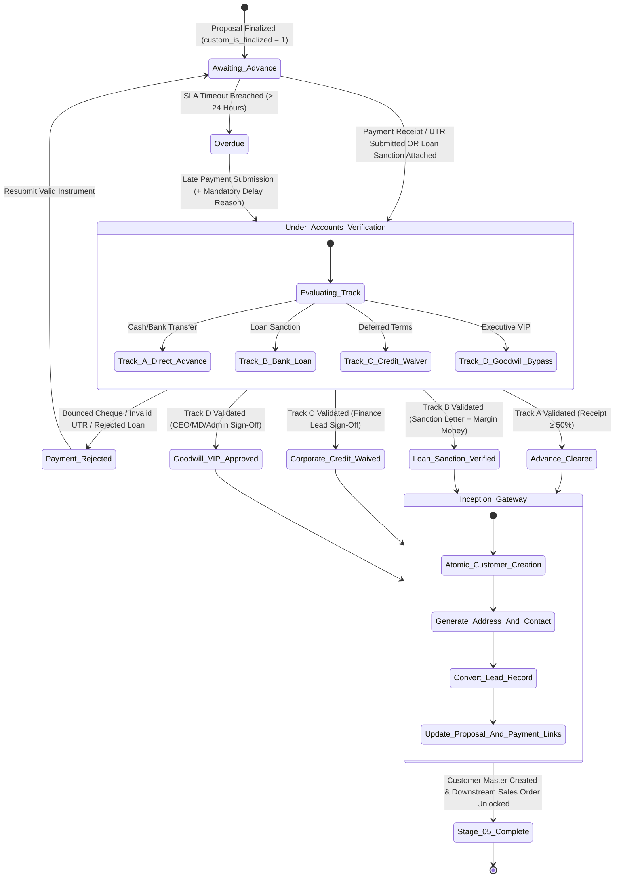

# STEP_05_ADVANCE_PAYMENT_CUSTOMER_GATE_SPECIFICATION.md

# Enterprise Lifecycle Step Specification: Advance Payment Clearance & Customer Master Inception Gate

**Document ID:** `STEP-05-ADVANCE-PAYMENT`  
**Lifecycle Flow:** Flow 1: Core Solar EPC Project Execution (Stage 05 of 11)  
**Governing Architecture:** [`architect_docs/02_STEP_PLANNING_SPECIFICATION_BLUEPRINT.md`](../architect_docs/02_STEP_PLANNING_SPECIFICATION_BLUEPRINT.md)  
**Architecture Decision Record:** [`docs/decisions/ADR-005-ADVANCE-PAYMENT-CUSTOMER-MASTER-INCEPTION.md`](../docs/decisions/ADR-005-ADVANCE-PAYMENT-CUSTOMER-MASTER-INCEPTION.md)  
**PRD / FRS Traceability:** [`planning_ref_docs/01_PROJECT_FOUNDATION_MODEL.md`](../planning_ref_docs/01_PROJECT_FOUNDATION_MODEL.md) (`BC-05`, `Sec 3.5`), [`planning_ref_docs/05_BUSINESS_REQUIREMENTS_DOCUMENT.md`](../planning_ref_docs/05_BUSINESS_REQUIREMENTS_DOCUMENT.md) (`BR-005`), [`planning_ref_docs/06_FUNCTIONAL_REQUIREMENTS_SPECIFICATION.md`](../planning_ref_docs/06_FUNCTIONAL_REQUIREMENTS_SPECIFICATION.md) (`FR-005`, `FR-019`), [`planning_ref_docs/08_DATABASE_DESIGN_DOCUMENT.md`](../planning_ref_docs/08_DATABASE_DESIGN_DOCUMENT.md) (`Domain 4: FIN`), [`planning_ref_docs/09_API_DESIGN_AND_INTEGRATIONS.md`](../planning_ref_docs/09_API_DESIGN_AND_INTEGRATIONS.md) (`API 5`), [`planning_ref_docs/10_UI_UX_SPECIFICATION.md`](../planning_ref_docs/10_UI_UX_SPECIFICATION.md) (`Screen 8`), [`planning_ref_docs/11_MODULE_FUNCTIONAL_DOCUMENTATION.md`](../planning_ref_docs/11_MODULE_FUNCTIONAL_DOCUMENTATION.md) (`MOD-05`)  
**Target Module:** `solar_module` / `manoj` (Extending ERPNext `Payment Entry`, `Quotation`, `Customer`, and standalone `Solar Loan Sanction`)  
**Author:** Principal Enterprise Architect  
**Status:** Ready for Implementation

---

## 1. Step Scope, Objectives & Context Traceability

### 1.1 Lifecycle Positioning & Commercial-to-Finance Handoff

Stage 05 (**Advance Payment Clearance & Customer Master Inception Gate**) forms the critical operational, financial, and legal checkpoint dividing the pre-sale commercial pipeline from actual project execution and material procurement.

Triggered immediately when a prospective client accepts and finalizes a commercial proposal in Stage 04 (`Quotation` aliased as `Proposal` with `custom_is_finalized = 1`), Stage 05 enforces the fundamental principle of enterprise solvency: **no capital expenditure or material allocation occurs without verified customer financial commitment or authorized institutional backing**.

```
┌──────────────────────────────────────────────────────────────────────────────────────────────────┐
│                                 LIFECYCLE HANDOFF ARCHITECTURE                                   │
└──────────────────────────────────────────────────────────────────────────────────────────────────┘
  ┌───────────────────────┐
  │       STAGE 04:       │  Customer accepts & finalizes commercial proposal
  │   PROPOSAL ENGINE     │  (custom_is_finalized = 1, required advance auto-calculated)
  │ (Quotation aliased)   │
  └───────────┬───────────┘
              │ [Triggers 24h Accounts Verification SLA Clock]
              ▼
  ┌────────────────────────────────────────────────────────────────────────────────────────────────┐
  │                 STAGE 05: ADVANCE CLEARANCE & CUSTOMER INCEPTION GATE                          │
  ├────────────────────────────────────────────────────────────────────────────────────────────────┤
  │ 1. Admin-Governed Advance Policy: Default ≥ 50% advance auto-populated into proposal terms     │
  │ 2. Quad-Track Clearance:                                                                       │
  │    • Track A: Direct Bank Advance (NEFT/RTGS/Cheque ≥ 50% with unique UTR validation)          │
  │    • Track B: Bank Loan Sanction (SBI/PNB/IREDA Sanction Letter + Margin Money Receipt)        │
  │    • Track C: Corporate Credit Waiver (Commercial Manager / Finance Lead Sign-Off)             │
  │    • Track D: Executive Goodwill / VIP Bypass (CEO / MD / Admin direct authorization)          │
  │ 3. Strict Quarantine Break: Programmatic instantiation of ERPNext Customer, Address & Contact  │
  │ 4. Downstream Lockout: Sales Order submission hard-blocked until Stage 05 gate clears          │
  └───────────────────────────┬────────────────────────────────────────────────────────────────────┘
                              │ [custom_advance_verified = 1 / custom_financial_clearance_date]
                              ▼
  ┌───────────────────────┐
  │       STAGE 06:       │  Unlocks Sales Order submission, locks BOM baseline,
  │   SALES ORDER ANCHOR  │  spawns Project WBS container, and initializes Phase 1 Liaisoning
  │ (Customer-backed)     │
  └───────────────────────┘
```

- **Predecessor:** Stage 04: Commercial Proposal & Subsidy Engine ([`step_plans/STEP_04_PROPOSAL_SUBSIDY_SPECIFICATION.md`](./STEP_04_PROPOSAL_SUBSIDY_SPECIFICATION.md)), requiring `Quotation.docstatus == 1` and `custom_is_finalized == 1`.
- **Successor:** Stage 06: Sales Order Master Baseline Anchor & Downstream Spawning (`Sales Order` requiring verified `Customer` and `custom_advance_verified == 1`).

### 1.2 Core Business Objectives & Target KPIs

1. **100% Cash Flow & Working Capital Protection:** Completely prevent unfunded procurement by requiring an Admin-governed minimum **$\ge 50\%$** advance payment (or verified bank loan sanction / executive waiver) prior to releasing sales orders.
2. **Zero Premature Master Contamination:** In strict adherence to ADR-001, guarantee that the standard ERPNext `Customer` master, billing/shipping addresses, and contacts are instantiated **only upon financial clearance**, preserving the General Ledger and customer directory from lead pollution.
3. **Sub-24-Hour Financial Clearance Turnaround Time (TAT):** Streamline the accounts verification workflow via a unified `/solar/advance` workbench, ensuring customer payments are verified and masters created within 24 hours of client confirmation.
4. **Institutional Financing Standardization:** Provide a seamless digital intake for bank-financed solar projects (such as PM Surya Ghar loans through SBI, PNB, Canara Bank, and IREDA), verifying sanction letters and margin money receipts with zero manual friction.
5. **Zero Duplicate Financial Claims:** Eliminate the reuse of bank transaction references (UTR / Cheque numbers) across projects through indexed database uniqueness constraints.
6. **Executive Agility via Goodwill Governance:** Empower executive leadership (Managing Director, CEO, and Admin) to fast-track strategic VIP clients without subverting audit accountability.
7. **Tiered Ground-Truth Inception:** Incept Customer, Address, and Contact using a ground-truth data resolution hierarchy (Proposal / Site Survey > Lead) to eliminate incomplete or informal prospect data.

### 1.3 Operational Failure Modes Eliminated

| Failure Mode in Legacy / Standard ERP       | Root Cause                                                                                   | Stage 05 Engineered Resolution                                                                                                  |
| :------------------------------------------ | :------------------------------------------------------------------------------------------- | :------------------------------------------------------------------------------------------------------------------------------ |
| **Unfunded Material Procurement**           | Sales orders approved on verbal promises; materials dispatched before securing client funds. | Server-side validation gate blocks `Sales Order` submission unless `custom_advance_verified = 1`.                               |
| **General Ledger Pollution**                | Leads created as `Customer` masters upon initial phone inquiry; 80% never buy.               | Strict lead quarantine in `tabLead`; `CustomerInceptionService` instantiates `Customer` strictly upon payment verification.     |
| **Corrupted / Incomplete Customer Masters** | Initial lead entries contain informal shorthand names, missing emails, or generic locations. | Tiered data precedence resolution: `CustomerInceptionService` extracts verified legal and physical data from Proposal & Survey. |
| **Ad-Hoc Advance Discounting**              | Sales agents unilaterally accepting 5–10% token advances without corporate authorization.    | `Admin` governs advance policy centrally (defaulting to 50%) in `Solar Advance Settings`; auto-populates proposals.             |
| **Duplicate UTR Reference Fraud**           | Free-text UTR fields allowing the same bank receipt to be used to clear multiple orders.     | Unique B-Tree index on `tabPayment Entry(custom_utr_cheque_no)` with server-side cross-table deduplication queries.             |
| **Bank Loan Project Delays**                | No formal tracking of bank sanction letters or margin money, stalling installations.         | Standalone submittable DocType `Solar Loan Sanction` with mandatory sanction letter attachment and margin money reconciliation. |
| **VIP Customer Escalation Gridlock**        | High-value government or corporate clients blocked because accounts had not booked cash.     | Executive Goodwill / VIP Customer Approval granted exclusively by CEO/MD/Admin bypassing cash gate.                             |

---

## 2. Stakeholders, Enterprise Actors & HRMS Role Mapping

### 2.1 Enterprise User Roles Matrix

In strict compliance with [`ADR-000`](../docs/decisions/ADR-000-ENTERPRISE-ROLE-PERMISSION-ARCHITECTURE.md) and the **Zero "User" Suffix Rule**, all financial governance roles are standardized:

| Persona / Business Actor         | Frappe System Role   | HRMS Department           | HRMS Designation                           | Operational Responsibilities                                                                                            |
| :------------------------------- | :------------------- | :------------------------ | :----------------------------------------- | :---------------------------------------------------------------------------------------------------------------------- |
| **Frontline Accounts Assistant** | `Accounts Assistant` | Accounts & Finance        | `Accounts Assistant` / `Junior Accountant` | Ingests bank statements, matches UTR / cheque receipts, drafts `Payment Entry`, verifies margin money.                  |
| **Finance Authority / Manager**  | `Accounts Manager`   | Accounts & Finance        | `Accounts Manager` / `Finance Lead`        | Authorizes advance payment verification, signs off on bank loan sanctions, validates corporate deferred credit waivers. |
| **CRM Department Manager**       | `CRM Manager`        | Commercial & CRM          | `Commercial & CRM Manager`                 | Audits proposal payment schedules, coordinates with lending banks for sanction letters, requests deferred waivers.      |
| **Sales Department Manager**     | `Sales Manager`      | Sales Management          | `Sales Manager`                            | Escalates payment delays, tracks customer drop-offs, reviews unverified proposals exceeding SLA.                        |
| **Executive Supreme Command**    | `Admin`              | Executive Leadership      | `Managing Director` / `CEO`                | Supreme operational command; grants Goodwill / VIP advance waivers, configures `Solar Advance Settings` and SLA timers. |
| **Technical DevOps Lead**        | `System Manager`     | Technology Infrastructure | `DevOps Architect`                         | Framework apex; manages DocType schemas, custom fields, Property Setters, Redis worker queues, and bench CLI tooling.   |

> [!IMPORTANT]
> **Enterprise Authority Hierarchy & ADR-000 Operational Governance:**
>
> - **`Administrator` & `System Manager` (Framework Supreme / Developer Realm):** Sit at the apex of system authority (supreme over `Admin`). Possess full access to everything `Admin` has, plus full technical rights over source code, DocType schema builder, Client/Server Scripts, bench tooling, and developer mode. Reserved strictly for technical developers and DevOps administrators.
> - **`Admin` (Project / Solar EPC Level Supreme Command):** Introduced specifically for **project-level operational supremacy**. Holds unrestricted operational authority over all business documents across Flow 1 and Flow 2, as well as exclusive authority over operational governance settings (`Solar Advance Settings`, `Solar Proposal Settings`, `Solar SLA Settings`, `Solar Notification Settings`). Protected by downstream dependency warnings, hard deletion blocks, and atomic cascade purges (`tabSolar Deletion Audit Log`).
> - **Managerial Authority Inheritance:** `Accounts Manager` strictly inherits all operational capabilities of `Accounts Assistant`.
> - **Stage-Forward Lock:** Once `Sales Order` (Stage 06 baseline) is submitted, `Payment Entry` and Advance Clearance Gates are locked against cancel and amend.

### 2.2 Role Permission Matrix

| DocType / Action                       | Accounts Assistant | Accounts Manager |   CRM Manager   | Sales Manager  |   Admin (Project Supreme)   |
| :------------------------------------- | :----------------: | :--------------: | :-------------: | :------------: | :-------------------------: |
| **Quotation / Proposal (Read)**        |     Permitted      |    Permitted     | Full Department | Full Territory |         All Records         |
| **Payment Entry (Create/Write)**       |     Permitted      |    Permitted     |   Restricted    |   Restricted   |         All Records         |
| **Payment Entry (Submit)**             |   Yes (Pre-S06)    |  Yes (Pre-S06)   |   Restricted    |   Restricted   |         All Records         |
| **Solar Loan Sanction (Create/Write)** |     Permitted      |    Permitted     |    Permitted    |   Restricted   |         All Records         |
| **Solar Loan Sanction (Submit)**       |     Restricted     |     **Yes**      |   Restricted    |   Restricted   |           **Yes**           |
| **Execute Financial Clearance**        |     Restricted     |     **Yes**      |   Restricted    |   Restricted   |      **Yes (Supreme)**      |
| **Corporate Credit Deferred Waiver**   |     Restricted     |     **Yes**      |     **Yes**     |   Restricted   |           **Yes**           |
| **Goodwill / VIP Customer Bypass**     |   **Restricted**   |  **Restricted**  | **Restricted**  | **Restricted** | **Yes (CEO/MD/Admin Only)** |
| **SLA Delay Log Sign-Off**             |     Permitted      |       Yes        |       Yes       |      Yes       |             Yes             |

---

## 3. Relational Schema & 3NF Data Dictionary

### 3.1 Core DocType Extensions

#### 3.1.1 Extension to `tabQuotation` (Commercial Proposal)

Stage 04 proposals are extended to capture advance requirements, received payments, and clearance state:

| Fieldname                           | Label                              | Fieldtype       | Options / Target                                                                                                                                 | Mandatory | Index | Description & Business Rules                                    |
| :---------------------------------- | :--------------------------------- | :-------------- | :----------------------------------------------------------------------------------------------------------------------------------------------- | :-------: | :---: | :-------------------------------------------------------------- |
| `custom_advance_governance_section` | Financial Advance & Clearance Gate | `Section Break` | -                                                                                                                                                |    No     |   -   | Grouping container for Stage 05 verification                    |
| `custom_required_advance_pct`       | Required Advance %                 | `Percent`       | -                                                                                                                                                |    Yes    |   -   | Default 50.0% auto-filled from `Solar Advance Settings`         |
| `custom_required_advance_amount`    | Required Advance Amount            | `Currency`      | `Company:currency`                                                                                                                               |    Yes    |   -   | Computed: `(net_total * custom_required_advance_pct) / 100`     |
| `custom_financial_clearance_status` | Financial Clearance Status         | `Select`        | `Pending Advance\nUnder Verification\nAdvance Cleared\nLoan Sanction Verified\nCorporate Credit Waived\nGoodwill VIP Approved\nPayment Rejected` |    Yes    |   1   | Master lifecycle status of Stage 05 gate                        |
| `custom_clearance_track`            | Clearance Track                    | `Select`        | `\nDirect Bank Advance\nBank Loan Sanction\nCorporate Credit Waiver\nGoodwill VIP Bypass`                                                        |    No     |   -   | Track selected for financial clearance                          |
| `custom_advance_amount_received`    | Total Advance Received             | `Currency`      | `Company:currency`                                                                                                                               |    No     |   -   | Aggregated from linked submitted `Payment Entry` records        |
| `custom_advance_pct_received`       | Actual Advance % Received          | `Percent`       | -                                                                                                                                                |    No     |   -   | Computed: `(custom_advance_amount_received / net_total) * 100`  |
| `custom_advance_payment_entry`      | Primary Payment Entry              | `Link`          | `Payment Entry`                                                                                                                                  |    No     |   1   | Foreign key reference to ERPNext advance receipt                |
| `custom_loan_sanction_ref`          | Loan Sanction Record               | `Link`          | `Solar Loan Sanction`                                                                                                                            |    No     |   1   | Foreign key reference to bank financing document                |
| `custom_customer`                   | Created Customer Master            | `Link`          | `Customer`                                                                                                                                       |    No     |   1   | Instantiated upon Stage 05 gate clearance                       |
| `custom_financial_clearance_date`   | Financial Clearance Date           | `Datetime`      | -                                                                                                                                                |    No     |   -   | Timestamp when gate clearance was executed                      |
| `custom_financial_cleared_by`       | Financial Cleared By               | `Link`          | `User`                                                                                                                                           |    No     |   -   | User attribution of clearing authority                          |
| `custom_advance_col_break`          | Column Break                       | `Column Break`  | -                                                                                                                                                |    No     |   -   | UI layout division                                              |
| `custom_goodwill_justification`     | Executive Justification            | `Small Text`    | -                                                                                                                                                |    No     |   -   | Mandatory remark if Track C (Waiver) or Track D (Goodwill) used |

#### 3.1.2 Extension to `tabPayment Entry`

ERPNext core `Payment Entry` is extended to capture solar project context and UTR verification:

| Fieldname                       | Label                       | Fieldtype       | Options / Target | Mandatory | Index | Description & Business Rules                               |
| :------------------------------ | :-------------------------- | :-------------- | :--------------- | :-------: | :---: | :--------------------------------------------------------- |
| `custom_solar_payment_section`  | Solar Project Allocation    | `Section Break` | -                |    No     |   -   | Segregates solar metadata from standard fields             |
| `custom_is_solar_advance`       | Is Solar Advance Payment    | `Check`         | -                |    No     |   1   | Flag identifying advance payments for Stage 05             |
| `custom_proposal_reference`     | Proposal Reference          | `Link`          | `Quotation`      |    No     |   1   | Foreign key link to Stage 04 proposal                      |
| `custom_lead_reference`         | Lead Reference              | `Link`          | `Lead`           |    No     |   1   | Pre-customer lead association                              |
| `custom_site_survey_reference`  | Site Survey Reference       | `Link`          | `Site Survey`    |    No     |   1   | Links payment directly to engineering site audit           |
| `custom_utr_cheque_no`          | UTR / Cheque / Ref Number   | `Data`          | -                |    Yes    |   1   | Bank transaction reference; **Unique constraint enforced** |
| `custom_bank_name`              | Remitting / Depositing Bank | `Data`          | -                |    No     |   -   | Name of customer's remitting bank                          |
| `custom_payment_proof`          | Payment Receipt / Slip      | `Attach`        | -                |    No     |   -   | Uploaded bank transfer receipt or scanned cheque           |
| `custom_verified_by`            | Verified By                 | `Link`          | `User`           |    No     |   -   | Attributed `Accounts Assistant` or `Accounts Manager`      |
| `custom_verification_timestamp` | Verification Timestamp      | `Datetime`      | -                |    No     |   -   | Audit timestamp of verification                            |

#### 3.1.3 Extension to `tabCustomer`

Standard ERPNext `Customer` master is extended to store solar technical attributes and inception lineage:

| Fieldname                        | Label                       | Fieldtype       | Options / Target                                                                        | Mandatory | Index | Description & Business Rules                         |
| :------------------------------- | :-------------------------- | :-------------- | :-------------------------------------------------------------------------------------- | :-------: | :---: | :--------------------------------------------------- |
| `custom_solar_inception_section` | Solar EPC Master Inception  | `Section Break` | -                                                                                       |    No     |   -   | Inception tracking section                           |
| `custom_lead_reference`          | Lead Reference              | `Link`          | `Lead`                                                                                  |    Yes    |   1   | Traceability to originating lead                     |
| `custom_proposal_reference`      | Proposal Reference          | `Link`          | `Quotation`                                                                             |    Yes    |   1   | Originating commercial proposal                      |
| `custom_site_survey_reference`   | Site Survey Reference       | `Link`          | `Site Survey`                                                                           |    Yes    |   1   | Originating technical site survey                    |
| `custom_discom_consumer_no`      | DISCOM Consumer Number      | `Data`          | -                                                                                       |    Yes    |   1   | Electricity utility account identifier               |
| `custom_discom_board`            | Electricity Board (DISCOM)  | `Data`          | -                                                                                       |    Yes    |   -   | Utility provider (e.g. PGVCL, DGVCL, BESCOM, MSEDCL) |
| `custom_sanctioned_load_kw`      | Sanctioned Load (kW)        | `Float`         | -                                                                                       |    Yes    |   -   | Connected grid electrical load                       |
| `custom_tariff_category`         | Electricity Tariff Category | `Data`          | -                                                                                       |    No     |   -   | Residential, Commercial (LT-2), Industrial (HT)      |
| `custom_clearance_type`          | Inception Clearance Track   | `Select`        | `Direct Bank Advance\nBank Loan Sanction\nCorporate Credit Waiver\nGoodwill VIP Bypass` |    Yes    |   -   | Mode of financial clearance that created master      |
| `custom_inception_date`          | Master Inception Date       | `Datetime`      | -                                                                                       |    Yes    |   -   | Exact timestamp of Stage 05 customer inception       |

---

### 3.2 Standalone Custom DocTypes

#### 3.2.1 `Solar Loan Sanction` (`tabSolar Loan Sanction`)

A standalone submittable DocType managing institutional bank financing, sanction letters, and margin money:

- **DocType Name:** `Solar Loan Sanction`
- **Module:** `solar_module`
- **Naming Rule:** `naming_series: SLS-.YYYY.-.#####`
- **Submittable:** `is_submittable = 1`
- **Track Changes:** `1`

| Fieldname                    | Label                    | Fieldtype    | Options / Target                                                          | Mandatory | Index | Description & Business Rules                          |
| :--------------------------- | :----------------------- | :----------- | :------------------------------------------------------------------------ | :-------: | :---: | :---------------------------------------------------- |
| `naming_series`              | Series                   | `Select`     | `SLS-.YYYY.-.#####`                                                       |    Yes    |   -   | Autoname generator                                    |
| `proposal`                   | Proposal Reference       | `Link`       | `Quotation`                                                               |    Yes    |   1   | Foreign key to commercial proposal                    |
| `lead`                       | Lead Reference           | `Link`       | `Lead`                                                                    |    Yes    |   1   | Originating prospect                                  |
| `customer`                   | Customer                 | `Link`       | `Customer`                                                                |    No     |   1   | Linked after customer inception                       |
| `lending_institution_type`   | Lending Institution Type | `Select`     | `Public Sector Bank\nPrivate Sector Bank\nNBFC / IREDA\nCooperative Bank` |    Yes    |   -   | Banking category                                      |
| `bank_name`                  | Financing Bank           | `Link`       | `Bank`                                                                    |    Yes    |   -   | e.g. State Bank of India, Punjab National Bank        |
| `bank_branch`                | Bank Branch & IFSC       | `Data`       | -                                                                         |    Yes    |   -   | Branch location and IFSC code                         |
| `loan_application_no`        | Loan Application Number  | `Data`       | -                                                                         |    Yes    |   -   | Bank portal application ID                            |
| `sanction_letter_no`         | Sanction Letter Number   | `Data`       | -                                                                         |    Yes    |   1   | Official bank sanction reference number               |
| `sanction_date`              | Sanction Date            | `Date`       | -                                                                         |    Yes    |   -   | Date on bank sanction letter                          |
| `sanctioned_amount`          | Sanctioned Loan Amount   | `Currency`   | `Company:currency`                                                        |    Yes    |   -   | Principal amount approved by bank                     |
| `proposal_total_amount`      | Total Proposal Amount    | `Currency`   | `Company:currency`                                                        |    Yes    |   -   | Total contract value from proposal                    |
| `margin_money_required`      | Required Margin Money    | `Currency`   | `Company:currency`                                                        |    Yes    |   -   | Computed: `proposal_total_amount - sanctioned_amount` |
| `margin_money_paid`          | Margin Money Paid        | `Currency`   | `Company:currency`                                                        |    No     |   -   | Amount paid by client towards margin                  |
| `margin_money_payment_entry` | Margin Payment Reference | `Link`       | `Payment Entry`                                                           |    No     |   1   | Linked receipt of margin money                        |
| `margin_money_verified`      | Margin Money Verified    | `Check`      | -                                                                         |    No     |   -   | Set when margin money receipt $\ge$ required          |
| `sanction_letter_attachment` | Sanction Letter (PDF)    | `Attach`     | -                                                                         |    Yes    |   -   | Official signed bank sanction letter                  |
| `disbursement_stage`         | Disbursement Status      | `Select`     | `Sanctioned\nPending Installation\nDisbursed Post-JMI\nFully Settled`     |    Yes    |   -   | Loan disbursement lifecycle state                     |
| `sanction_status`            | Status                   | `Select`     | `Draft\nUnder Verification\nApproved\nRejected\nCancelled`                |    Yes    |   1   | Workflow status                                       |
| `verification_remarks`       | Verification Remarks     | `Small Text` | -                                                                         |    No     |   -   | Internal audit observations                           |

#### 3.2.2 `Solar Advance Settings` (`tabSolar Advance Settings`)

A single-record configuration DocType (`issingle = 1`) managed strictly by `Admin`:

- **DocType Name:** `Solar Advance Settings`
- **Module:** `solar_module`
- **Is Single:** `1`

| Fieldname                        | Label                            | Fieldtype | Options / Target | Mandatory | Description & Rules                                                                     |
| :------------------------------- | :------------------------------- | :-------- | :--------------- | :-------: | :-------------------------------------------------------------------------------------- |
| `default_advance_pct`            | Default Required Advance %       | `Percent` | -                |    Yes    | Standard advance percentage; **Defaults to 50.0%**                                      |
| `minimum_advance_floor_pct`      | Absolute Minimum Advance Floor % | `Percent` | -                |    Yes    | Hard floor below which no proposal can be cleared without waiver; **Defaults to 20.0%** |
| `advance_verification_sla_hours` | Advance Verification SLA (Hours) | `Int`     | -                |    Yes    | Default turnaround time for Accounts; **Defaults to 24 Hours**                          |
| `allow_bank_loan_sanctions`      | Enable Bank Loan Sanction Track  | `Check`   | -                |    No     | Master toggle enabling Track B                                                          |
| `allow_goodwill_ceo_bypass`      | Enable Goodwill VIP Bypass       | `Check`   | -                |    No     | Master toggle enabling Track D                                                          |
| `enforce_strict_utr_uniqueness`  | Enforce Strict UTR Uniqueness    | `Check`   | -                |    No     | Server-side validation against duplicate UTRs; **Default: 1**                           |
| `auto_convert_lead`              | Auto-Convert Lead on Inception   | `Check`   | -                |    No     | Automatically set `tabLead.status = 'Converted'`; **Default: 1**                        |

---

## 4. State Machine, Verification Gates & SLA Engine

### 4.1 Stage 05 State Machine Flow

The following Mermaid diagram defines the complete state transitions of the Stage 05 Financial Clearance Gate:



### 4.2 Hard Verification Gates

Stage 05 enforces four non-bypassable server-side verification gates:

#### Gate 1: Required Advance Floor Gate

- **Condition:** For Track A (Direct Bank Advance), total submitted receipts (`custom_advance_amount_received`) must be $\ge$ `custom_required_advance_amount`.
- **Admin Configuration:** The required advance percentage defaults to **50.0%** as defined in `Solar Advance Settings`.
- **System Hard Floor:** Even if a proposal specifies a lower custom milestone, the received amount must never fall below the corporate minimum floor (**20.0%**) without an approved Track C (Credit Waiver) or Track D (Goodwill Bypass).

#### Gate 2: UTR / Bank Reference Uniqueness Gate

- **Condition:** Every bank transaction reference (`custom_utr_cheque_no`) on `Payment Entry` must be unique across all active, submitted payments in the system.
- **Enforcement:** B-Tree index backed by server-side query checking `tabPayment Entry` where `custom_utr_cheque_no = %s and docstatus != 2`. Duplicate entries raise `frappe.DuplicateEntryError`.

#### Gate 3: Bank Loan Sanction Completeness Gate

- **Condition:** For Track B (Bank Loan Sanction), the following three requirements must all evaluate to true:
  1. `Solar Loan Sanction` document is submitted (`docstatus == 1`) with `sanction_status == 'Approved'`.
  2. Legitimate bank sanction letter attachment exists (`sanction_letter_attachment` is not null).
  3. If `margin_money_required > 0`, verified payment entry receipt for margin money must equal or exceed `margin_money_required`.

#### Gate 4: Executive Authority Verification Gate

- **Condition:** For Track D (Goodwill / VIP Bypass), the authorizing user must possess the Frappe role **`Admin`**, **`Director`**, or **`Administrator`**. Any attempt by other roles to execute a goodwill bypass raises `frappe.PermissionError`.

### 4.3 SLA Engine & Turnaround Time (TAT) Tracking

1. **Clock Activation:** The 24-hour countdown clock initiates the instant a Stage 04 proposal transitions to `custom_is_finalized = 1`.
2. **SLA Calculation:**
   $$\text{sla\_due\_date} = \text{finalization\_timestamp} + \text{SLA\_Hours (Default: 24h)}$$
3. **Automated Escalation Daemon (`solar_module.tasks.recompute_advance_sla`):** A scheduled background worker checks active unverified proposals every 15 minutes. If `now() > sla_due_date` and clearance status remains `Pending Advance`:
   - Status updates to `Overdue`.
   - Dispatch high-priority escalation card to the Accounts Manager and Area Sales Manager via Raven message and email digest.
4. **Mandatory Delay Reason Enforcement:** Once an advance task enters `Overdue` state, executing financial clearance is hard-blocked unless a justified delay reason (`Customer Bank Delay`, `Loan Sanction Processing`, `Cheque Realization Wait`, `Document Discrepancy`) and detailed explanation are logged into `tabRemark-Delay Log`.

---

## 5. Controller Logic, Domain Services & Whitelisted APIs

### 5.1 Domain Service Layer Architecture

Business logic is completely decoupled from controllers into dedicated domain services:

```
solar_module/
├── services/
│   ├── advance_verification_service.py   # Pure verification, UTR deduplication, margin math
│   ├── customer_inception_service.py     # Atomic Customer, Address, Contact creation
│   └── loan_sanction_service.py          # Bank loan sanction workflows & margin tracking
└── api/
    └── advance.py                        # Whitelisted, authenticated HTTP endpoints
```

#### 5.1.1 `AdvanceVerificationService`

```python
# solar_module/services/advance_verification_service.py

import frappe
from frappe import _
from frappe.utils import flt, now_datetime

class AdvanceVerificationService:
    @staticmethod
    def get_advance_settings() -> dict:
        """Retrieves Admin-governed advance settings with safe defaults."""
        settings = frappe.get_single("Solar Advance Settings")
        return {
            "default_advance_pct": flt(settings.default_advance_pct) or 50.0,
            "minimum_advance_floor_pct": flt(settings.minimum_advance_floor_pct) or 20.0,
            "sla_hours": int(settings.advance_verification_sla_hours) or 24,
            "enforce_utr_uniqueness": bool(settings.enforce_strict_utr_uniqueness),
        }

    @staticmethod
    def validate_utr_uniqueness(utr_no: str, current_payment_entry: str = None) -> None:
        """Enforces global uniqueness on bank UTR / Cheque reference numbers."""
        if not utr_no or not utr_no.strip():
            frappe.throw(_("UTR / Cheque Reference number is mandatory."), frappe.ValidationError)

        utr_clean = utr_no.strip()
        conditions = ["custom_utr_cheque_no = %(utr)s", "docstatus != 2"]
        values = {"utr": utr_clean}

        if current_payment_entry:
            conditions.append("name != %(current)s")
            values["current"] = current_payment_entry

        existing = frappe.db.sql(
            f"""
            SELECT name, party, paid_amount
            FROM `tabPayment Entry`
            WHERE {' AND '.join(conditions)}
            LIMIT 1
            """,
            values,
            as_dict=True
        )

        if existing:
            frappe.throw(
                _(f"Bank reference/UTR '{utr_clean}' is already booked under Payment Entry "
                  f"'{existing[0].name}' for party '{existing[0].party}' (Amount: ₹{existing[0].paid_amount:,.2f}). "
                  "Duplicate financial references are strictly prohibited."),
                frappe.DuplicateEntryError
            )

    @classmethod
    def evaluate_direct_advance_receipt(cls, proposal_doc) -> dict:
        """Evaluates submitted payments against proposal required advance amount."""
        settings = cls.get_advance_settings()

        # Calculate total submitted solar payments linked to this proposal
        payments = frappe.get_all(
            "Payment Entry",
            filters={
                "custom_proposal_reference": proposal_doc.name,
                "docstatus": 1,
                "payment_type": "Receive"
            },
            fields=["name", "paid_amount", "custom_utr_cheque_no", "posting_date"]
        )

        total_received = sum(flt(p.paid_amount) for p in payments)
        required_amount = flt(proposal_doc.custom_required_advance_amount)
        net_contract_value = flt(proposal_doc.net_total)

        actual_pct = (total_received / net_contract_value * 100.0) if net_contract_value > 0 else 0.0
        floor_amount = (net_contract_value * settings["minimum_advance_floor_pct"]) / 100.0

        is_cleared = total_received >= required_amount and total_received >= floor_amount

        return {
            "is_cleared": is_cleared,
            "total_received": total_received,
            "required_amount": required_amount,
            "actual_pct": actual_pct,
            "floor_amount": floor_amount,
            "payments": payments
        }
```

#### 5.1.2 `CustomerInceptionService`

```python
# solar_module/services/customer_inception_service.py

import frappe
from frappe import _
from frappe.utils import now_datetime

class CustomerInceptionService:
    @classmethod
    def _resolve_best_value(cls, *values, default=None):
        """Returns first non-empty stripped value across precedence chain."""
        for val in values:
            if val is not None and str(val).strip():
                return str(val).strip()
        return default

    @classmethod
    def instantiate_customer_master(
        cls,
        proposal_name: str,
        clearance_track: str,
        authorized_by: str,
        justification: str = None
    ) -> str:
        """
        Executes atomic programmatic creation of ERPNext Customer, Address,
        and Contact masters with Tiered Ground-Truth Resolution (Proposal/Survey > Lead).
        """
        proposal = frappe.get_doc("Quotation", proposal_name)

        # Idempotency check: Return existing customer if already created
        if proposal.custom_customer:
            return proposal.custom_customer

        if not proposal.custom_is_finalized:
            frappe.throw(_("Cannot instantiate Customer: Commercial Proposal is not finalized."), frappe.ValidationError)

        lead_name = proposal.party_name
        if not lead_name or proposal.quotation_to != "Lead":
            frappe.throw(_("Proposal must be linked to a valid Lead."), frappe.ValidationError)

        lead = frappe.get_doc("Lead", lead_name)
        site_survey_name = proposal.get("custom_site_survey")
        site_survey = frappe.get_doc("Site Survey", site_survey_name) if site_survey_name else None

        # 1. Create standard ERPNext Customer master using Tiered Precedence:
        # Priority: Proposal (Quotation) -> Site Survey (DISCOM/Audit Truth) -> Lead -> Default
        customer = frappe.new_doc("Customer")
        customer.customer_name = cls._resolve_best_value(
            proposal.get("custom_customer_name"),
            site_survey.get("consumer_name") if site_survey else None,
            site_survey.get("customer_name") if site_survey else None,
            lead.lead_name if lead else None,
            lead.company_name if lead else None,
            default="Valued Solar Client"
        )
        is_org = lead.organization_lead if lead else (proposal.get("custom_is_corporate") or 0)
        customer.customer_type = "Company" if is_org else "Individual"
        customer.customer_group = "Commercial" if is_org else "Residential"
        customer.territory = cls._resolve_best_value(
            site_survey.get("territory") if site_survey else None,
            lead.territory if lead else None,
            default="All Territories"
        )
        customer.gstin = cls._resolve_best_value(
            proposal.get("custom_gstin"),
            lead.get("gstin") if lead else None
        )
        customer.pan = cls._resolve_best_value(
            proposal.get("custom_pan"),
            lead.get("pan") if lead else None
        )

        # Populate Solar Inception Metadata & Persistent Thread of Identity
        customer.custom_lead_reference = lead.name
        customer.custom_proposal_reference = proposal.name
        customer.custom_site_survey_reference = site_survey.name if site_survey else None
        customer.custom_clearance_type = clearance_track
        customer.custom_inception_date = now_datetime()

        if site_survey:
            customer.custom_discom_consumer_no = cls._resolve_best_value(
                site_survey.get("consumer_no"),
                proposal.get("custom_discom_consumer_no"),
                lead.get("custom_consumer_no") if lead else None
            )
            customer.custom_discom_board = cls._resolve_best_value(
                site_survey.get("electricity_board"),
                proposal.get("custom_discom_board")
            )
            customer.custom_sanctioned_load_kw = site_survey.get("sanctioned_load") or proposal.get("custom_sanctioned_load_kw") or (lead.get("custom_sanctioned_load_kw") if lead else 0.0)
            customer.custom_tariff_category = cls._resolve_best_value(
                site_survey.get("tariff_category"),
                proposal.get("custom_tariff_category")
            )

        customer.flags.ignore_permissions = True
        customer.insert()

        # 2. Create Primary Address (Tiered: Survey GPS/Address -> Proposal -> Lead)
        cls._create_customer_address(customer, lead, site_survey, proposal)

        # 3. Create Primary Contact Person (Tiered: Proposal -> Survey -> Lead)
        cls._create_customer_contact(customer, lead, site_survey, proposal)

        # 4. Programmatically Convert Lead
        lead.status = "Converted"
        lead.customer = customer.name
        lead.flags.ignore_permissions = True
        lead.save()

        # 5. Retroactively update Proposal and Payment Entries (Maintains custom_lead_reference!)
        proposal.custom_customer = customer.name
        proposal.custom_financial_clearance_status = cls._map_track_to_status(clearance_track)
        proposal.custom_financial_clearance_date = now_datetime()
        proposal.custom_financial_cleared_by = authorized_by
        proposal.custom_clearance_track = clearance_track
        proposal.custom_goodwill_justification = justification
        proposal.flags.ignore_permissions = True
        proposal.save()

        # Re-link submitted Payment Entries from Lead to Customer (preserving lead link)
        frappe.db.sql(
            """
            UPDATE `tabPayment Entry`
            SET party_type = 'Customer', party = %(cust)s, party_name = %(cust_name)s
            WHERE custom_proposal_reference = %(prop)s AND docstatus = 1
            """,
            {"cust": customer.name, "cust_name": customer.customer_name, "prop": proposal.name}
        )

        return customer.name

    @classmethod
    def _create_customer_address(cls, customer, lead, site_survey, proposal=None):
        """Generates linked primary Address record using ground-truth site coordinates."""
        addr = frappe.new_doc("Address")
        addr.address_title = customer.customer_name
        addr.address_type = "Billing"
        addr.is_primary_address = 1
        addr.is_shipping_address = 1

        # Priority 1: Site Survey (physical location & GPS)
        # Priority 2: Proposal (formal shipping/billing address)
        # Priority 3: Lead (initial inquiry data)
        addr.address_line1 = cls._resolve_best_value(
            site_survey.get("site_address") if site_survey else None,
            proposal.get("shipping_address_line1") if proposal else None,
            lead.get("custom_address") if lead else None,
            default="Site Address"
        )
        addr.city = cls._resolve_best_value(
            site_survey.get("city") if site_survey else None,
            proposal.get("shipping_city") if proposal else None,
            lead.get("city") if lead else None,
            default="City"
        )
        addr.state = cls._resolve_best_value(
            site_survey.get("state") if site_survey else None,
            proposal.get("shipping_state") if proposal else None,
            lead.get("state") if lead else None,
            default="State"
        )
        addr.pincode = cls._resolve_best_value(
            site_survey.get("pincode") if site_survey else None,
            proposal.get("shipping_pincode") if proposal else None,
            lead.get("custom_pincode") if lead else None
        )
        addr.custom_latitude = site_survey.get("latitude") if site_survey else None
        addr.custom_longitude = site_survey.get("longitude") if site_survey else None
        addr.custom_lead_reference = customer.custom_lead_reference

        addr.append("links", {
            "link_doctype": "Customer",
            "link_name": customer.name
        })
        addr.flags.ignore_permissions = True
        addr.insert()

    @classmethod
    def _create_customer_contact(cls, customer, lead, site_survey=None, proposal=None):
        """Generates linked primary Contact record with clean 10-digit mobile and email."""
        contact = frappe.new_doc("Contact")
        contact.first_name = customer.customer_name
        contact.is_primary_contact = 1

        # Priority: Proposal -> Site Survey -> Lead
        contact.mobile_no = cls._resolve_best_value(
            proposal.get("contact_mobile") if proposal else None,
            proposal.get("custom_mobile_no") if proposal else None,
            site_survey.get("contact_mobile") if site_survey else None,
            site_survey.get("contact_phone") if site_survey else None,
            lead.mobile_no if lead else None
        )
        contact.phone = cls._resolve_best_value(
            proposal.get("contact_phone") if proposal else None,
            site_survey.get("contact_phone") if site_survey else None,
            lead.phone if lead else None
        )
        contact.email_id = cls._resolve_best_value(
            proposal.get("contact_email") if proposal else None,
            proposal.get("custom_email_id") if proposal else None,
            site_survey.get("contact_email") if site_survey else None,
            lead.email_id if lead else None
        )
        contact.custom_lead_reference = customer.custom_lead_reference

        contact.append("links", {
            "link_doctype": "Customer",
            "link_name": customer.name
        })
        contact.flags.ignore_permissions = True
        contact.insert()

    @staticmethod
    def _map_track_to_status(track: str) -> str:
        mapping = {
            "Direct Bank Advance": "Advance Cleared",
            "Bank Loan Sanction": "Loan Sanction Verified",
            "Corporate Credit Waiver": "Corporate Credit Waived",
            "Goodwill VIP Bypass": "Goodwill VIP Approved",
        }
        return mapping.get(track, "Advance Cleared")
```

---

### 5.2 Whitelisted API Endpoints (`solar_module.api.advance`)

#### 5.2.1 Record & Validate Payment Receipt

```python
# solar_module/api/advance.py

import json
import frappe
from frappe import _
from solar_module.services.advance_verification_service import AdvanceVerificationService
from solar_module.services.customer_inception_service import CustomerInceptionService

@frappe.whitelist(methods=["POST"])
def record_and_verify_advance(proposal_name: str, payment_payload: str) -> dict:
    """
    Whitelisted endpoint for Accounts Assistant / Officer to record advance receipt
    and optionally trigger Customer inception if advance criteria are fully met.
    """
    if not proposal_name:
        frappe.throw(_("Proposal name is required."), frappe.ValidationError)

    proposal = frappe.get_doc("Quotation", proposal_name)
    proposal.check_permission("write")

    payload = json.loads(payment_payload)
    utr_no = payload.get("utr_no")
    paid_amount = frappe.utils.flt(payload.get("paid_amount"))
    bank_account = payload.get("bank_account")
    mode_of_payment = payload.get("mode_of_payment") or "Bank Transfer"
    posting_date = payload.get("posting_date") or frappe.utils.today()

    # Assert UTR uniqueness
    AdvanceVerificationService.validate_utr_uniqueness(utr_no)

    # Instantiate ERPNext Payment Entry
    pe = frappe.new_doc("Payment Entry")
    pe.payment_type = "Receive"
    pe.party_type = "Customer" if proposal.custom_customer else "Lead"
    pe.party = proposal.custom_customer or proposal.party_name
    pe.paid_amount = paid_amount
    pe.received_amount = paid_amount
    pe.paid_to = bank_account
    pe.mode_of_payment = mode_of_payment
    pe.posting_date = posting_date
    pe.reference_no = utr_no
    pe.reference_date = posting_date

    # Solar Custom Metadata
    pe.custom_is_solar_advance = 1
    pe.custom_proposal_reference = proposal.name
    pe.custom_lead_reference = proposal.party_name
    pe.custom_site_survey_reference = proposal.get("custom_site_survey")
    pe.custom_utr_cheque_no = utr_no
    pe.custom_verified_by = frappe.session.user
    pe.custom_verification_timestamp = frappe.utils.now_datetime()

    pe.insert()
    pe.submit()

    # Re-evaluate proposal advance status
    evaluation = AdvanceVerificationService.evaluate_direct_advance_receipt(proposal)

    customer_id = None
    if evaluation["is_cleared"]:
        # Programmatically instantiate Customer Master
        customer_id = CustomerInceptionService.instantiate_customer_master(
            proposal_name=proposal.name,
            clearance_track="Direct Bank Advance",
            authorized_by=frappe.session.user
        )

    return {
        "status": "success",
        "payment_entry": pe.name,
        "is_cleared": evaluation["is_cleared"],
        "total_received": evaluation["total_received"],
        "required_amount": evaluation["required_amount"],
        "customer_id": customer_id
    }
```

#### 5.2.2 Executive Goodwill / VIP Customer Bypass Endpoint

```python
@frappe.whitelist(methods=["POST"])
def approve_goodwill_bypass(proposal_name: str, justification: str) -> dict:
    """
    Exclusive executive endpoint for Owner / CEO / Managing Director / Admin
    to bypass financial advance check for strategic VIP or government clients.
    """
    if not proposal_name:
        frappe.throw(_("Proposal name is required."), frappe.ValidationError)

    # Hard Role Gate: Restrict strictly to Admin, Director, Administrator
    user_roles = frappe.get_roles(frappe.session.user)
    authorized_roles = {"Admin", "Director", "Administrator"}
    if not (authorized_roles & set(user_roles)):
        frappe.throw(
            _("Access Denied: Only Executive Leadership (CEO, Managing Director, Project Supreme Admin) "
              "can grant Goodwill / VIP Customer advance waivers."),
            frappe.PermissionError
        )

    if not justification or len(justification.strip()) < 10:
        frappe.throw(
            _("A detailed executive justification (minimum 10 characters) is mandatory for Goodwill bypass."),
            frappe.ValidationError
        )

    proposal = frappe.get_doc("Quotation", proposal_name)
    proposal.check_permission("write")

    customer_id = CustomerInceptionService.instantiate_customer_master(
        proposal_name=proposal.name,
        clearance_track="Goodwill VIP Bypass",
        authorized_by=frappe.session.user,
        justification=justification.strip()
    )

    return {
        "status": "success",
        "clearance_status": "Goodwill VIP Approved",
        "customer_id": customer_id,
        "authorized_by": frappe.session.user
    }
```

---

## 6. Frontend UI/UX Specification

### 6.1 Universal `/solar` Entry Point & Advance Workbench

In accordance with the **Universal Frontend Landing Architecture** ([`planning_ref_docs/README.prd.md`](../planning_ref_docs/README.prd.md#unified-frontend-landing-architecture--desk-access-governance)), all financial clearance actions are centralized on `/solar/advance` within the Vue 3 + Frappe UI Single Page Application:

```
┌──────────────────────────────────────────────────────────────────────────────────────────────────┐
│ /solar/advance ── STAGE 05: FINANCIAL ADVANCE & CUSTOMER INCEPTION DESK                          │
├──────────────────────────────────────────────────────────────────────────────────────────────────┤
│ [Search Lead/Prop/Consumer]  [Filter: Awaiting Advance (14) | Under Verification (5) | Cleared]  │
├──────────────────────────────────────────────────────────────────────────────────────────────────┤
│ PROPOSAL: PROP-2026-00412 | CLIENT: Rajesh Patel (LEAD-00891) | DISCOM: PGVCL-681921            │
│ Plant: 10.0 kWp | Net Total: ₹4,80,000 | Required Advance (50% Admin Standard): ₹2,40,000       │
│ SLA Countdown: [⏳ 18h 42m Remaining] | Assigned: Accounts Assistant                            │
├──────────────────────────────────────────────────────────────────────────────────────────────────┤
│ ┌──────────────────────────────────────────────────────────────────────────────────────────────┐ │
│ │ SELECT FINANCIAL CLEARANCE TRACK:                                                            │ │
│ │ (•) Track A: Direct Bank Advance     ( ) Track B: Bank Loan Sanction                         │ │
│ │ ( ) Track C: Corporate Credit Waiver ( ) Track D: Executive Goodwill VIP Bypass              │ │
│ └──────────────────────────────────────────────────────────────────────────────────────────────┘ │
│                                                                                                  │
│ [TRACK A: DIRECT ADVANCE ENTRY]                                                                  │
│ ┌──────────────────────────┬──────────────────────────┬────────────────────────────────────────┐ │
│ │ UTR / Cheque Number *    │ Amount Received (₹) *    │ Deposited Bank Account *               │ │
│ │ [AXISN0049182910      ]  │ [2,40,000             ]  │ [HDFC Solar Escrow - 5020001928     ▼] │ │
│ ├──────────────────────────┼──────────────────────────┼────────────────────────────────────────┤ │
│ │ Mode of Payment          │ Payment Date             │ Upload Bank Slip / Cheque Image        │ │
│ │ [NEFT / RTGS          ▼] │ [2026-09-23           ]  │ [📎 patel_neft_slip.pdf              ] │ │
│ └──────────────────────────┴──────────────────────────┴────────────────────────────────────────┘ │
│                                                                                                  │
│ ┌──────────────────────────────────────────────────────────────────────────────────────────────┐ │
│ │ ★ PREVIEW ACTION UPON CLEARANCE:                                                             │ │
│ │ ✔ Will instantiate ERPNext Customer: "Rajesh Patel"                                          │ │
│ │ ✔ Will generate Primary Address (Site GPS: 23.0225° N, 72.5714° E) and Contact (+91 98250...) │
│ │ ✔ Will post Payment Entry: ₹2,40,000 to General Ledger                                       │ │
│ │ ✔ Will unlock Stage 06 Sales Order submission                                                │ │
│ └──────────────────────────────────────────────────────────────────────────────────────────────┘ │
│                                                                                                  │
│ [ Reject Payment ]                  [ Save Draft Receipt ]          [ 🚀 Verify & Incept Master ] │
└──────────────────────────────────────────────────────────────────────────────────────────────────┘
```

### 6.2 Quad-Track Interactive Clearance Modal

The modal interface dynamically swaps fields based on the selected clearance track:

- **Track A (Direct Advance):** Renders UTR number input with live debounce AJAX check calling `AdvanceVerificationService.validate_utr_uniqueness()`. Green checkmark indicates reference is fresh and unique; red badge warns if duplicate.
- **Track B (Bank Loan Sanction):** Renders lending bank picker, sanction letter number, sanctioned loan amount, mandatory margin money calculator (`Required - Paid`), and drag-and-drop file uploader for the official signed bank sanction PDF.
- **Track C (Credit Waiver):** Renders corporate credit terms picker (e.g. `30 Days Post-Dispatch`, `LC at Sight`), mandatory client purchase order attachment, and manager sign-off selector.
- **Track D (Executive Goodwill VIP):** Only visible if the logged-in user possesses the role `Admin`, `Director`, or `Administrator`. Features an amber alert banner: _"You are exercising Executive Supreme Authority to bypass financial clearance. This action will be permanently logged under your user ID."_ Requires mandatory text justification.

### 6.3 Standard Desk Form Integration

On standard Frappe Desk views (`/app/quotation/<id>` and `/app/sales-order/<id>`):

- Proposals display an **Advance Clearance Status Badge** in the top title bar:
  - `Awaiting Advance`: Grey badge.
  - `Under Verification`: Blue badge.
  - `Advance Cleared` / `Loan Sanction Verified`: Green badge.
  - `Goodwill VIP Approved`: Purple badge with crown icon.
  - `Payment Rejected`: Red badge.
- A custom button **"Financial Clearance Desk"** (`frm.add_custom_button`) opens the `/solar/advance` modal.
- On `Sales Order`, if `custom_advance_verified != 1`, the standard **"Submit"** button is disabled, and an indicator banner displays: _"Submission locked: Awaiting Stage 05 financial advance clearance."_

---

## 7. Cross-App Integration Touchpoints

### 7.1 ERPNext Core Integrations

1. **General Ledger (`tabGL Entry`):**
   - Direct advance payments booked through `Payment Entry` credit the customer's account (`Advances Received from Customers` or `Debtors`) and debit the respective `Bank Account`.
   - Flawless reconciliation guaranteed; zero custom ledger hacks.
2. **Standard Masters (`Customer`, `Address`, `Contact`):**
   - Automatically instantiated via `CustomerInceptionService`.
   - `tabDynamic Link` records cleanly connect the newly created Customer with their primary physical site address and mobile contact person.
3. **Sales Order Anchor (Stage 06):**
   - Stage 06 `Sales Order` references the verified `Customer` created at Stage 05.
   - Server-side validation on `Sales Order` asserts that `Quotation.custom_financial_clearance_status` is in `["Advance Cleared", "Loan Sanction Verified", "Corporate Credit Waived", "Goodwill VIP Approved"]`.

### 7.2 Frappe CRM Integrations

1. **Lead Conversion Synchronization:**
   - Programmatically executes `Lead.status = 'Converted'` and `Lead.customer = customer.name`.
   - Closes the CRM qualification and survey loop, ensuring CRM conversion rate dashboards accurately reflect paying clients.
2. **Omnichannel Notification Dispatch:**
   - Upon successful financial clearance, the system triggers automated notification dispatches via `Raven Message` (internal project channel) and customer-facing SMS/WhatsApp:
     _"Dear [Customer Name], we have successfully received your advance payment of ₹[Amount] for your [kW] kW solar rooftop project. Your customer ID is [ID]. Project execution has commenced!"_

### 7.3 External Statutory & Banking Integrations

1. **DISCOM Utility Consumer Registry:**
   - Transposes the validated DISCOM consumer number, electricity board, and sanctioned load directly from Stage 02 `Site Survey` into the `Customer` master.
   - Provides clean master data for Stage 10 Liaisoning filings.
2. **Bank Statement Feed Reconciliation:**
   - UTR numbers captured on `Payment Entry` align with standard ERPNext Bank Reconciliation Tool formats, facilitating 1-click matching against electronic bank statement feeds (ICICI / HDFC / SBI corporate feeds).

### 7.4 Lifecycle Thread of Identity (`custom_lead_reference`) & Sales/CRM Stepper

1. **Non-Destructive Retroactive Linkage:**
   - Setting `Quotation.custom_customer = customer.name` and updating `Payment Entry.party = customer.name` is strictly for General Ledger (`tabGL Entry`) accuracy and standard ERPNext Sales Order release.
   - It **does not orphan or sever** the original Lead. `tabLead` transitions to `status = 'Converted'` with `lead.customer = customer.name`.
2. **Persistent Identity Thread Across Project Execution:**
   - Post-Sales Order execution spans three major operational steps:
     1. **Material Dispatch (`Delivery Note`):** `custom_lead_reference` propagated to track dispatch preparation and store delivery.
     2. **Installation Execution (`Project` & WBS Tasks / DPR):** `custom_lead_reference` preserved on `Project` container.
     3. **Statutory Compliance (`Liaisoning And Synchronization`):** `custom_lead_reference` maintained for DISCOM net-metering.
   - Every downstream document (`Customer`, `Payment Entry`, `Sales Order`, `Delivery Note`, `Project`, `Liaisoning And Synchronization`) indexes `custom_lead_reference`.
3. **Unbroken 11-Stage Interactive Progress Bar for Sales & CRM:**
   - Powered by `GET /api/method/solar_module.api.lead.get_lead_progress`.
   - Traverses the entire lifecycle from Lead (01) $\rightarrow$ Site Survey (02) $\rightarrow$ PV Design (03) $\rightarrow$ Proposal (04) $\rightarrow$ Advance/Customer (05) $\rightarrow$ Sales Order (06) $\rightarrow$ Material Dispatch (07) $\rightarrow$ Installation WBS (08) $\rightarrow$ Material Reconciliation (09) $\rightarrow$ Liaisoning (10) $\rightarrow$ COD/Asset Register (11).
   - Sales and CRM users can click any milestone bubble on `/solar/leads/:id` to inspect completion dates, active SLA countdowns, and linked document drawers.

---

## 8. Automated Testing & QA Criteria

### 8.1 Test Architecture & Zero-Commit Rule

All tests for Stage 05 are implemented inside `codes/manoj/manoj/tests/test_stage_05_advance_payment.py`, inheriting from `frappe.testing.IntegrationTestCase`:

- **Managed Transactions:** All test operations execute inside an atomic database transaction rolled back at test teardown via `frappe.db.rollback()`. **Zero `frappe.db.commit()` calls permitted.**
- **Fixtures:** Programmatic creation of dummy Lead, Site Survey, and finalized Proposal records.

### 8.2 Mandatory Test Suites

```python
# codes/manoj/manoj/tests/test_stage_05_advance_payment.py

import frappe
from frappe.testing import IntegrationTestCase
from frappe.utils import flt, now_datetime
from solar_module.services.advance_verification_service import AdvanceVerificationService
from solar_module.services.customer_inception_service import CustomerInceptionService
from solar_module.api.advance import record_and_verify_advance, approve_goodwill_bypass

class TestStage05AdvancePayment(IntegrationTestCase):
    def setUp(self):
        super().setUp()
        self.cleanup_records = []
        # Setup dummy lead, survey, and finalized proposal
        self.lead = self.create_test_lead()
        self.proposal = self.create_test_proposal(self.lead)

    def tearDown(self):
        frappe.db.rollback()

    def test_happy_path_direct_advance_50_percent(self):
        """Test Track A: Submitting 50% advance successfully clears gate and creates Customer."""
        required_advance = flt(self.proposal.custom_required_advance_amount) # 50% = 2,50,000

        payload = {
            "utr_no": "TESTUTR9988776611",
            "paid_amount": required_advance,
            "bank_account": "HDFC Bank - SEC",
            "mode_of_payment": "Bank Transfer"
        }

        frappe.set_user("accounts@sadbhav.com")
        res = record_and_verify_advance(self.proposal.name, frappe.as_json(payload))

        self.assertTrue(res["is_cleared"])
        self.assertIsNotNone(res["customer_id"])

        # Verify Customer master exists
        customer = frappe.get_doc("Customer", res["customer_id"])
        self.assertEqual(customer.custom_lead_reference, self.lead.name)
        self.assertEqual(customer.custom_clearance_type, "Direct Bank Advance")

        # Verify Lead is converted
        lead = frappe.get_doc("Lead", self.lead.name)
        self.assertEqual(lead.status, "Converted")
        self.assertEqual(lead.customer, customer.name)

    def test_gate_rejection_below_advance_floor(self):
        """Test rejection when advance payment is below required 50% threshold."""
        token_advance = 20000.0  # Only ~4% of 5,00,000
        payload = {
            "utr_no": "TESTUTR1111222233",
            "paid_amount": token_advance,
            "bank_account": "HDFC Bank - SEC",
            "mode_of_payment": "Bank Transfer"
        }

        frappe.set_user("accounts@sadbhav.com")
        res = record_and_verify_advance(self.proposal.name, frappe.as_json(payload))

        self.assertFalse(res["is_cleared"])
        self.assertIsNone(res["customer_id"])

        # Verify proposal remains uncleared
        self.proposal.reload()
        self.assertEqual(self.proposal.custom_financial_clearance_status, "Under Verification")
        self.assertIsNone(self.proposal.custom_customer)

    def test_duplicate_utr_prevention(self):
        """Test that re-using an existing bank UTR throws DuplicateEntryError."""
        # Book initial payment with UTR
        pe = self.create_test_payment_entry("DUPUTR12345678", 50000.0)

        # Attempt to book another payment with same UTR
        with self.assertRaises(frappe.DuplicateEntryError):
            AdvanceVerificationService.validate_utr_uniqueness("DUPUTR12345678")

    def test_bank_loan_sanction_clearance_track_b(self):
        """Test Track B: Bank Loan Sanction + Margin Money clears gate."""
        # Create Solar Loan Sanction
        sls = frappe.new_doc("Solar Loan Sanction")
        sls.proposal = self.proposal.name
        sls.lead = self.lead.name
        sls.bank_name = "State Bank of India"
        sls.bank_branch = "Surat Main - SBIN0000481"
        sls.loan_application_no = "SURYA-SBI-99120"
        sls.sanction_letter_no = "SLN-SBI-2026-88"
        sls.sanction_date = frappe.utils.today()
        sls.sanctioned_amount = 400000.0
        sls.proposal_total_amount = 500000.0
        sls.margin_money_required = 100000.0
        sls.margin_money_paid = 100000.0
        sls.margin_money_verified = 1
        sls.sanction_letter_attachment = "/files/dummy_sanction.pdf"
        sls.sanction_status = "Approved"
        sls.insert()
        sls.submit()

        # Trigger customer inception
        cust_id = CustomerInceptionService.instantiate_customer_master(
            proposal_name=self.proposal.name,
            clearance_track="Bank Loan Sanction",
            authorized_by="finance_lead@sadbhav.com"
        )

        self.assertIsNotNone(cust_id)
        cust = frappe.get_doc("Customer", cust_id)
        self.assertEqual(cust.custom_clearance_type, "Bank Loan Sanction")

    def test_executive_goodwill_ceo_bypass_track_d(self):
        """Test Track D: Executive Goodwill Bypass by Admin role succeeds."""
        frappe.set_user("admin_supreme@sadbhav.com") # User possesses 'Admin' role
        res = approve_goodwill_bypass(
            proposal_name=self.proposal.name,
            justification="Strategic VIP Account approved by Managing Director for prompt mobilization."
        )
        self.assertEqual(res["status"], "success")
        self.assertEqual(res["clearance_status"], "Goodwill VIP Approved")

        # Test unauthorized user is blocked
        frappe.set_user("sales_rep@sadbhav.com")
        with self.assertRaises(frappe.PermissionError):
            approve_goodwill_bypass(
                proposal_name=self.proposal.name,
                justification="Unauthorized bypass attempt."
            )

    def test_idempotent_customer_inception(self):
        """Test calling inception service twice does not duplicate Customer records."""
        cust_1 = CustomerInceptionService.instantiate_customer_master(
            proposal_name=self.proposal.name,
            clearance_track="Goodwill VIP Bypass",
            authorized_by="Administrator",
            justification="First run."
        )

        cust_2 = CustomerInceptionService.instantiate_customer_master(
            proposal_name=self.proposal.name,
            clearance_track="Goodwill VIP Bypass",
            authorized_by="Administrator",
            justification="Second duplicate run."
        )

        self.assertEqual(cust_1, cust_2)
        count = frappe.db.count("Customer", filters={"custom_proposal_reference": self.proposal.name})
        self.assertEqual(count, 1)

    def test_sla_overdue_and_delay_log_enforcement(self):
        """Test that an overdue proposal enforces a record in tabRemark-Delay Log."""
        # Backdate proposal finalization by 48 hours (> 24h SLA)
        frappe.db.set_value(
            "Quotation",
            self.proposal.name,
            "modified",
            frappe.utils.add_to_date(now_datetime(), hours=-48)
        )

        # Run SLA checker
        from solar_module.tasks import recompute_advance_sla
        recompute_advance_sla()

        self.proposal.reload()
        self.assertEqual(self.proposal.custom_financial_clearance_status, "Overdue")

    def test_tiered_data_precedence_survey_and_proposal(self):
        """Test that Customer/Address/Contact use Proposal and Site Survey data when Lead is incomplete."""
        # Setup incomplete lead (missing email, informal name, generic address)
        frappe.db.set_value("Lead", self.lead.name, {
            "lead_name": "Rajesh",
            "email_id": None,
            "custom_address": "Near City Center"
        })

        # Setup site survey with verified ground truth
        survey = frappe.new_doc("Site Survey")
        survey.lead = self.lead.name
        survey.consumer_name = "Rajeshbhai K. Patel"
        survey.consumer_no = "DISCOM-SURAT-998877"
        survey.electricity_board = "DGVCL"
        survey.sanctioned_load = 12.0
        survey.site_address = "Plot 42, GIDC Pandesara, Surat"
        survey.city = "Surat"
        survey.state = "Gujarat"
        survey.pincode = "394221"
        survey.latitude = 21.1458
        survey.longitude = 72.8234
        survey.contact_mobile = "9825199999"
        survey.contact_email = "rajesh.patel@gidc-textiles.com"
        survey.insert(ignore_permissions=True)

        self.proposal.custom_site_survey = survey.name
        self.proposal.save(ignore_permissions=True)

        # Trigger customer inception
        cust_id = CustomerInceptionService.instantiate_customer_master(
            proposal_name=self.proposal.name,
            clearance_track="Goodwill VIP Bypass",
            authorized_by="Administrator",
            justification="Precedence verification test"
        )

        customer = frappe.get_doc("Customer", cust_id)
        # Verify Customer Name preferred Site Survey consumer name over informal Lead name
        self.assertEqual(customer.customer_name, "Rajeshbhai K. Patel")
        self.assertEqual(customer.custom_discom_consumer_no, "DISCOM-SURAT-998877")
        self.assertEqual(customer.custom_lead_reference, self.lead.name)

        # Verify Address preferred Survey GPS and full address
        address_name = frappe.db.get_value("Dynamic Link", {"link_doctype": "Customer", "link_name": cust_id, "parenttype": "Address"}, "parent")
        address = frappe.get_doc("Address", address_name)
        self.assertEqual(address.address_line1, "Plot 42, GIDC Pandesara, Surat")
        self.assertEqual(address.pincode, "394221")
        self.assertEqual(float(address.custom_latitude), 21.1458)

        # Verify Contact preferred Survey email over empty Lead email
        contact_name = frappe.db.get_value("Dynamic Link", {"link_doctype": "Customer", "link_name": cust_id, "parenttype": "Contact"}, "parent")
        contact = frappe.get_doc("Contact", contact_name)
        self.assertEqual(contact.email_id, "rajesh.patel@gidc-textiles.com")
        self.assertEqual(contact.mobile_no, "9825199999")
```

---

## 9. Operational SOP, Error Resolution & Runbook

### 9.1 End-User Standard Operating Procedure (SOP)

#### SOP 1: Recording Direct Advance Payment (Accounts Assistant)

1. **Entry Criteria:** Sales Representative finalizes a proposal in Stage 04 (`Quotation.custom_is_finalized = 1`). A notification alerts the Accounts team.
2. **Access Desk:** Navigate to `/solar/advance` or open the proposal in Frappe Desk.
3. **Verify Bank Statement:** Inspect company bank account (HDFC / ICICI / SBI) to confirm receipt of funds. Identify the unique bank UTR or cheque clearing number.
4. **Data Entry:**
   - Select `Track A: Direct Bank Advance`.
   - Enter `UTR / Cheque Number` (system will automatically validate uniqueness).
   - Enter `Amount Received` (must equal or exceed 50% required advance).
   - Select receiving `Bank Account` and upload deposit slip/receipt.
5. **Execution:** Click **"Verify & Incept Master"**.
6. **Expected Outcome:**
   - System submits `Payment Entry` and posts GL entries.
   - System programmatically instantiates the ERPNext `Customer`, `Address`, and `Contact`.
   - `Lead` status updates to `Converted`.
   - Stage 06 `Sales Order` creation is unlocked.

#### SOP 2: Processing Bank Loan Sanction (Accounts Manager / CRM Manager)

1. **Collect Sanction Documents:** Secure signed official Bank Loan Sanction Letter from the lending institution (e.g. SBI Surya Ghar portal).
2. **Record Margin Money:** Verify client has paid required margin money ($\text{Total Project Cost} - \text{Sanction Amount}$) via `Payment Entry`.
3. **Create `Solar Loan Sanction` Record:**
   - Link Proposal and Lead.
   - Enter bank name, loan account number, sanction letter number, and sanctioned amount.
   - Attach official signed PDF sanction letter.
   - Submit record (`sanction_status = 'Approved'`).
4. **Clear Gate:** Click **"Execute Loan Clearance"**. The system instantiates `Customer` under clearance track `Bank Loan Sanction`.

---

### 9.2 Operator Error Resolution Matrix

| Error Message Displayed                                                                       | Root Cause                                                                           | Operator Resolution                                                                                                                            |
| :-------------------------------------------------------------------------------------------- | :----------------------------------------------------------------------------------- | :--------------------------------------------------------------------------------------------------------------------------------------------- |
| `Bank reference/UTR '...' is already booked under Payment Entry '...'`                        | The entered UTR number has already been submitted for another payment in the system. | Verify transaction statement. Check whether the receipt was already entered by another team member or if the UTR was typed incorrectly.        |
| `Cannot clear advance: Total received ₹X is less than required ₹Y (50.0%)`                    | The amount entered is less than the Admin-governed required advance amount.          | Collect the balance advance from client, or route request to Commercial Manager for Track C (Waiver) or CEO for Track D (Goodwill).            |
| `Access Denied: Only Executive Leadership can grant Goodwill / VIP Customer advance waivers.` | Non-authorized user attempted to approve Track D Goodwill bypass.                    | Inform Area Sales Manager to escalate the proposal directly to the Managing Director, CEO, or Project Supreme Admin for digital authorization. |
| `Mandatory Delay Reason Required: Task is Overdue`                                            | Proposal has exceeded the 24-hour verification SLA clock.                            | Click **"Add Delay Reason"**, select category (`Bank Clearing Delay`, `Customer Processing`, etc.), enter explanation remarks, and save.       |
| `Cannot submit Sales Order: Project has not achieved Stage 05 Financial Advance Clearance`    | Sales / Project team attempting to submit `Sales Order` before accounts sign-off.    | Complete Stage 05 clearance on `/solar/advance` before attempting to submit `Sales Order`.                                                     |

---

### 9.3 Technical Incident Runbook (For DevOps & L3 Engineers)

#### Incident 1: Customer Creation Stalled or Incomplete Transaction

- **Symptom:** Payment Entry is submitted, but `custom_customer` on `Quotation` is blank, and lead remains un-converted.
- **Triage Steps:**
  1. Inspect `tabError Log`:
     ```sql
     SELECT name, method, error, creation
     FROM `tabError Log`
     WHERE method LIKE '%CustomerInceptionService%'
     ORDER BY creation DESC LIMIT 5;
     ```
  2. Common causes: Missing mandatory address field, invalid email format on lead, or character limit breach on customer name.
- **Remediation:**
  1. Fix the offending field on `tabLead` or `tabSite Survey`.
  2. Execute manual idempotent inception via bench console:
     ```bash
     bench --site <site-name> console
     ```
     ```python
     from solar_module.services.customer_inception_service import CustomerInceptionService
     cust_id = CustomerInceptionService.instantiate_customer_master(
         proposal_name="PROP-2026-00412",
         clearance_track="Direct Bank Advance",
         authorized_by="Administrator"
     )
     frappe.db.commit()
     print(f"Customer instantiated successfully: {cust_id}")
     ```

#### Incident 2: SLA Worker Queue Backlog

- **Symptom:** Overdue advance tasks are not transitioning or dispatching alerts.
- **Triage Steps:**
  1. Check Redis worker queue status:
     ```bash
     bench doctor
     ```
  2. Inspect queued background tasks:
     ```bash
     bench --site <site-name> execute frappe.core.doctype.rq_job.rq_job.get_all
     ```
  3. Manually trigger SLA daemon to verify execution:
     ```bash
     bench --site <site-name> execute solar_module.tasks.recompute_advance_sla
     ```
