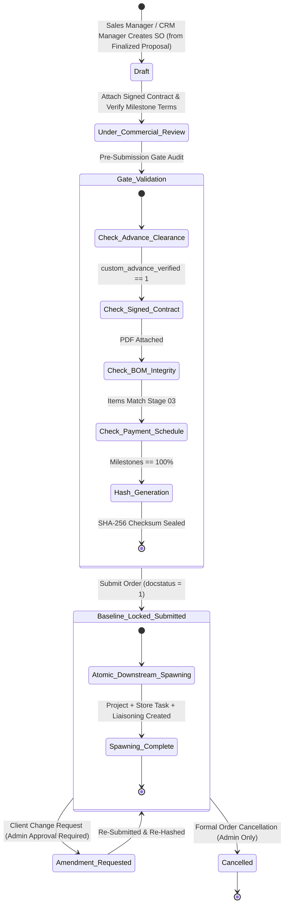
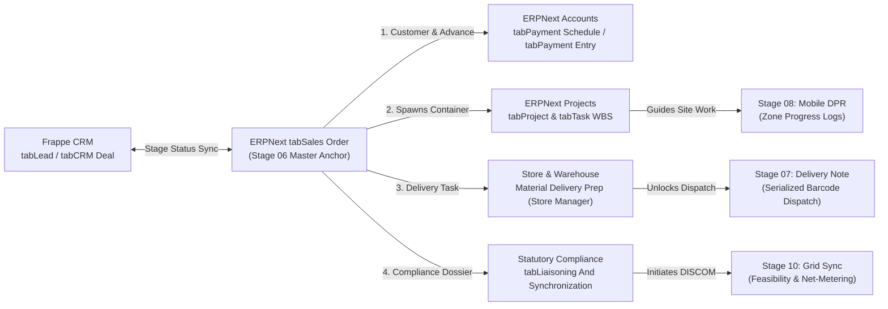

# STEP_06_SALES_ORDER_BASELINE_SPECIFICATION.md

# Enterprise Lifecycle Step Specification: Sales Order Master Baseline Anchor & Downstream Spawning

**Document ID:** `STEP-06-SALES-ORDER`  
**Lifecycle Flow:** Flow 1: Core Solar EPC Project Execution (Stage 06 of 11)  
**Governing Architecture:** [`architect_docs/02_STEP_PLANNING_SPECIFICATION_BLUEPRINT.md`](../architect_docs/02_STEP_PLANNING_SPECIFICATION_BLUEPRINT.md)  
**Architecture Decision Record:** [`docs/decisions/ADR-006-SALES-ORDER-BASELINE-DOWNSTREAM-SPAWNING.md`](../docs/decisions/ADR-006-SALES-ORDER-BASELINE-DOWNSTREAM-SPAWNING.md)  
**PRD / FRS Traceability:** [`planning_ref_docs/01_PROJECT_FOUNDATION_MODEL.md`](../planning_ref_docs/01_PROJECT_FOUNDATION_MODEL.md) (`BC-06`, `Sec 3.6`), [`planning_ref_docs/05_BUSINESS_REQUIREMENTS_DOCUMENT.md`](../planning_ref_docs/05_BUSINESS_REQUIREMENTS_DOCUMENT.md) (`BR-006`), [`planning_ref_docs/06_FUNCTIONAL_REQUIREMENTS_SPECIFICATION.md`](../planning_ref_docs/06_FUNCTIONAL_REQUIREMENTS_SPECIFICATION.md) (`FR-006`), [`planning_ref_docs/08_DATABASE_DESIGN_DOCUMENT.md`](../planning_ref_docs/08_DATABASE_DESIGN_DOCUMENT.md) (`Domain 4: FIN`, `Domain 7: PRJ`, `Domain 8: CMP`), [`planning_ref_docs/09_API_DESIGN_AND_INTEGRATIONS.md`](../planning_ref_docs/09_API_DESIGN_AND_INTEGRATIONS.md) (`API 5`), [`planning_ref_docs/10_UI_UX_SPECIFICATION.md`](../planning_ref_docs/10_UI_UX_SPECIFICATION.md) (`Screen 9`), [`planning_ref_docs/11_MODULE_FUNCTIONAL_DOCUMENTATION.md`](../planning_ref_docs/11_MODULE_FUNCTIONAL_DOCUMENTATION.md) (`MOD-06`)  
**Target Module:** `solar_module` / `manoj` (Extending standard ERPNext `Sales Order`, `Sales Order Item`, `Project`, `Task`, and standalone `Liaisoning And Synchronization`)  
**Author:** Principal Enterprise Architect  
**Status:** Ready for Execution

---

## 1. Step Scope, Objectives & Context Traceability

### 1.1 Lifecycle Positioning & The Commercial-to-Execution Fulcrum

Stage 06 (**Sales Order Master Baseline Anchor & Downstream Spawning**) constitutes the primary operational, legal, and engineering anchor of the entire Solar EPC project lifecycle. It marks the non-negotiable transition point where the pre-sale commercial pipeline permanently hands over project responsibility to operational execution teams, warehouse supply chain management, and statutory liaisoning authorities.

Triggered immediately once Stage 05 achieves formal financial advance clearance (`custom_advance_verified = 1`), Stage 06 ingests the approved commercial proposal (`Quotation`), binds the verified legal customer (`Customer`), freezes the engineering bill of materials (`custom_quot_bom`), and executes an atomic multi-departmental kickoff.

```
┌──────────────────────────────────────────────────────────────────────────────────────────────────┐
│                                 LIFECYCLE HANDOFF ARCHITECTURE                                   │
└──────────────────────────────────────────────────────────────────────────────────────────────────┘
  ┌───────────────────────┐
  │       STAGE 04:       │  Customer accepts & finalizes commercial proposal
  │   PROPOSAL ENGINE     │  (custom_is_finalized = 1, required advance auto-calculated)
  │ (Quotation aliased)   │
  └───────────┬───────────┘
              │ [Generates required advance terms: default ≥ 50%]
              ▼
  ┌───────────────────────┐
  │       STAGE 05:       │  Advance payment verified (Track A/B/C/D);
  │   ADVANCE CLEARANCE   │  Customer, Billing/Shipping Address & Contact incepted
  │   & CUSTOMER GATE     │  (custom_advance_verified = 1 / financial clearance date logged)
  └───────────┬───────────┘
              │ [Unlocks Sales Order creation & submission]
              ▼
  ┌────────────────────────────────────────────────────────────────────────────────────────────────┐
  │                 STAGE 06: SALES ORDER MASTER BASELINE ANCHOR & SPAWNING                        │
  ├────────────────────────────────────────────────────────────────────────────────────────────────┤
  │ 1. Non-Bypassable Financial Gate: Asserts custom_advance_verified == 1 from Stage 05           │
  │ 2. Signed Contract Integrity: Mandates attached signed agreement & formal contract date        │
  │ 3. Cryptographic Baseline Freeze: Computes deterministic SHA-256 hash across BOM & terms       │
  │ 4. Milestone Payment Alignment: Generates 4-tier milestone schedule matching EPC milestones     │
  │ 5. Atomic Triple Downstream Spawning (Single ACID Transaction on Submission):                  │
  │    • Spawns ERPNext Project container with templated multi-zone WBS Tasks                      │
  │    • Spawns Material Delivery Task assigned to Store Manager (reassignable to Store Assistant) │
  │    • Spawns Liaisoning And Synchronization record (Phase 1 DISCOM Early Compliance)            │
  └───────────┬───────────────────────────────┬───────────────────────────────┬────────────────────┘
              │                               │                               │
              ▼                               ▼                               ▼
  ┌───────────────────────┐       ┌───────────────────────┐       ┌───────────────────────┐
  │       STAGE 07:       │       │       STAGE 08:       │       │       STAGE 10:       │
  │   MATERIAL DISPATCH   │       │   INSTALLATION WBS    │       │   STATUTORY LIAISON   │
  │  (Store Manager /     │       │   (Project Engineer / │       │   (Liaisoning Rep /   │
  │   Store Assistant)    │       │    Site Supervisor)   │       │    Phase 1 NOC Filing)│
  └───────────────────────┘       └───────────────────────┘       └───────────────────────┘
```

- **Predecessor:** Stage 05: Advance Payment Clearance & Customer Master Inception Gate ([`step_plans/STEP_05_ADVANCE_PAYMENT_CUSTOMER_GATE_SPECIFICATION.md`](./STEP_05_ADVANCE_PAYMENT_CUSTOMER_GATE_SPECIFICATION.md)), requiring `custom_advance_verified == 1` and verified `Customer` master.
- **Successors:**
  - Stage 07: Material Dispatch Logistics via Delivery Note (`Delivery Note` requires submitted, baseline-locked `Sales Order`).
  - Stage 08: Zone-Based Installation Execution & Mobile DPR (`Project` and WBS `Task` entities spawned).
  - Stage 10: Statutory Liaisoning & Synchronization (`Liaisoning And Synchronization` record initialized in Phase 1).

### 1.2 Core Business Objectives & Target KPIs

1. **Zero Unbudgeted Scope Creep (100% Margin Protection):** Permanently eliminate post-sale specification modifications, unapproved equipment swaps, and arbitrary discounts by locking technical and commercial parameters behind a cryptographic SHA-256 checksum.
2. **Sub-24-Hour Operational Kickoff TAT:** Eradicate inter-departmental kickoff delays (legacy average 5–10 days) by automatically provisioning project execution, warehouse logistics, and statutory compliance containers within seconds of order submission.
3. **100% Warehouse Material Visibility & Early Staging:** Guarantee that the **`Store Manager`** receives an immediate, formal **Material Delivery & Logistics Preparation Task** the moment the sales order is submitted, enabling proactive stock allocation, picking verification, and smooth delegation to **`Store Assistant`**.
4. **Early Statutory Grid Feasibility (Eliminate Net-Metering Gridlock):** Trigger Phase 1 DISCOM filings (KYC submission, load feasibility NOC, and division portal registration) at Stage 06 rather than waiting for physical installation completion, preventing commissioning hold-ups at Stage 10.
5. **Deterministic Cash Flow & Milestone Governance:** Programmatically synchronize ERPNext's standard `Payment Schedule` with actual EPC delivery milestones (Advance $\ge 50\%$, Dispatch 20–30%, Installation 10–15%, Net-Metering 5–10%), ensuring billing triggers reflect contractual physical reality.
6. **Complete Audit Non-Repudiation:** Guarantee complete legal and operational traceability by requiring an attached signed client contract, timestamped baseline freeze, and full actor attribution.

### 1.3 Operational Failure Modes Eliminated

| Failure Mode in Legacy / Standard ERP       | Root Cause                                                                                                                      | Stage 06 Engineered Resolution                                                                                                                                                 |
| :------------------------------------------ | :------------------------------------------------------------------------------------------------------------------------------ | :----------------------------------------------------------------------------------------------------------------------------------------------------------------------------- |
| **Unbudgeted Scope Creep & Margin Erosion** | Site changes or customer calls verbally modify panel types, quantities, or cable runs without cost re-estimation.               | `SalesOrderBaselineService` computes SHA-256 checksum over items and rates; locks baseline (`custom_baseline_frozen = 1`) on submission.                                       |
| **Store & Logistics Blindspots**            | Storekeeper has no visibility into upcoming projects until site calls demanding urgent delivery, causing stock shortages.       | Atomic spawning generates a **Material Delivery Task** assigned directly to **`Store Manager`** with delegation to **`Store Assistant`**.                                      |
| **Delayed Net-Metering DISCOM Approvals**   | Statutory applications initiated only after physical installation completes, stalling grid energization by 60–90 days.          | Sales order submission automatically instantiates `Liaisoning And Synchronization` record in Phase 1, dispatching tasks to `Liaisoning Representative` / `Liaisoning Manager`. |
| **Unfunded Project Procurement**            | Project managers create tasks and issue materials based on draft sales orders before customer advance payments are collected.   | Server-side gate asserts `custom_advance_verified == 1`; blocks submission of `Sales Order` if Stage 05 financial gate is incomplete.                                          |
| **Manual WBS Setup Inconsistencies**        | Project engineers manually create project tasks with erratic naming, missing safety checklists, and incomplete zone divisions.  | `ProjectSpawnerService` programmatically instantiates standardized multi-zone WBS `Task` tree with predefined dependencies and SLAs.                                           |
| **Mismatched Invoicing Milestones**         | Finance issues arbitrary billing schedules unrelated to contract milestones, causing customer disputes and payment withholding. | Programmatic generation of ERPNext standard `Payment Schedule` linked directly to contract advance, dispatch, structural, and grid milestones.                                 |

---

## 2. Stakeholders, Enterprise Actors & HRMS Role Mapping

### 2.1 Enterprise User Roles Matrix

In strict compliance with [`ADR-000`](../docs/decisions/ADR-000-ENTERPRISE-ROLE-PERMISSION-ARCHITECTURE.md) and the **Zero "User" Suffix Rule**, all actors are designated using functional enterprise titles:

| Persona / Business Actor       | Frappe System Role          | HRMS Department           | HRMS Designation                                     | Operational Responsibilities                                                                                                              |
| :----------------------------- | :-------------------------- | :------------------------ | :--------------------------------------------------- | :---------------------------------------------------------------------------------------------------------------------------------------- |
| **Sales Department Manager**   | `Sales Manager`             | Sales & Marketing         | `Sales Operations Manager`                           | Verifies customer contract alignment, confirms commercial pricing, authorizes `Sales Order` submission and baseline freeze.               |
| **CRM Department Lead**        | `CRM Manager`               | Commercial & CRM          | `Commercial & CRM Manager`                           | Prepares final contract baseline from approved Stage 04 proposal, verifies Stage 05 advance clearance, validates margin floors.           |
| **Project Operations Lead**    | `Project Manager`           | Project Engineering       | `Project Manager` / `Site Operations Lead`           | Receives spawned `Project` container, reviews zone segmentation, assigns WBS execution tasks, schedules site mobilization.                |
| **Project Site Engineer**      | `Project Engineer`          | Project Engineering       | `Site Project Engineer`                              | Receives technical WBS tasks, accepts site execution responsibilities, coordinates with site supervisor.                                  |
| **Warehouse & Inventory Head** | `Store Manager`             | Warehouse & Logistics     | `Store Manager` / `Warehouse Incharge`               | Receives spawned **Material Delivery Task**, evaluates inventory availability against frozen BOM, delegates picking to `Store Assistant`. |
| **Warehouse Operations Staff** | `Store Assistant`           | Warehouse & Logistics     | `Store Assistant` / `Logistics Coordinator`          | Receives delegated picking/packing tasks, prepares serialized dispatch bundles, coordinates with transport carriers.                      |
| **Statutory Compliance Rep**   | `Liaisoning Representative` | Legal & Liaisoning        | `Liaisoning Representative` / `Compliance Executive` | Receives spawned Phase 1 statutory dossier, gathers DISCOM application docs, files online grid connectivity NOC request.                  |
| **Finance Authority**          | `Accounts Manager`          | Accounts & Finance        | `Accounts Manager` / `Finance Lead`                  | Reconciles advance payment entry, verifies milestone payment terms, approves commercial invoice schedules.                                |
| **Executive Supreme Command**  | `Admin`                     | Executive Leadership      | `Managing Director` / `CEO`                          | Project supreme operational command; authorizes baseline amendments, configures `Solar Sales Order Settings`, overrides SLAs.             |
| **Technical DevOps Lead**      | `System Manager`            | Technology Infrastructure | `DevOps Architect`                                   | Framework apex; manages DocType schemas, custom fields, Property Setters, Redis worker queues, and bench CLI tooling.                     |

> [!IMPORTANT]
> **Enterprise Authority Hierarchy & ADR-000 Operational Governance:**
>
> - **`Administrator` & `System Manager` (Framework Supreme / Developer Realm):** Sit at the apex of system authority (supreme over `Admin`). Possess full access to everything `Admin` has, plus full technical rights over source code, DocType schema builder, Client/Server Scripts, bench tooling, and developer mode. Reserved strictly for technical developers and DevOps administrators.
> - **`Admin` (Project / Solar EPC Level Supreme Command):** Introduced specifically for **project-level operational supremacy**. Holds unrestricted operational authority over all business documents across Flow 1 and Flow 2, as well as exclusive authority over operational governance settings (`Solar Sales Order Settings`, `Solar Advance Settings`, `Solar SLA Settings`, `Solar Notification Settings`). Holds exclusive authority to authorize **Sales Order Baseline Amendments**. Protected by downstream dependency warnings, hard deletion blocks, and atomic cascade purges (`tabSolar Deletion Audit Log`).
> - **Stage-Forward Lock:** Once `Delivery Note` (Stage 08) or `Project Tasks` (Stage 09) have commenced, the `Sales Order` is permanently locked against cancel and amend.

### 2.2 Role Permission Matrix

| DocType / Action                         | Sales / CRM Manager | Project Manager | Store Manager  | Store Assistant | Liaisoning Rep | Admin (Project Supreme) |
| :--------------------------------------- | :-----------------: | :-------------: | :------------: | :-------------: | :------------: | :---------------------: |
| **Sales Order (Read)**                   |     Full Access     |   Full Access   |  Full Access   |    Read Own     |    Read Own    |       All Records       |
| **Sales Order (Create/Edit)**            |    **Permitted**    |   Restricted    |   Restricted   |   Restricted    |   Restricted   |      **Permitted**      |
| **Sales Order (Submit / Lock Baseline)** |    **Permitted**    |   Restricted    |   Restricted   |   Restricted    |   Restricted   |       **Supreme**       |
| **Sales Order (Amend / Cancel)**         | Req (Pre-Dispatch)  |   Restricted    |   Restricted   |   Restricted    |   Restricted   |  **Yes (Admin Only)**   |
| **Project (Read)**                       |      Permitted      |   Full Access   |   Read Only    |    Read Only    |   Read Only    |       All Records       |
| **WBS Execution Tasks (Read/Update)**    |     Restricted      |  **Full Team**  |   Restricted   |   Restricted    |   Restricted   |       Full Access       |
| **Material Delivery Task (Read/Update)** |      Read Only      |    Read Only    |  **Assigned**  |  **Assigned**   |   Restricted   |       Full Access       |
| **Task Reassignment (Store Task)**       |     Restricted      |   Restricted    | **Authorized** |   Restricted    |   Restricted   |       **Supreme**       |
| **Liaisoning Dossier (Read/Update)**     |      Read Only      |    Read Only    |   Restricted   |   Restricted    |  **Assigned**  |       Full Access       |
| **SLA Delay Log Sign-Off**               |      Permitted      |    Permitted    |   Permitted    |   Restricted    |   Permitted    |       **Supreme**       |

---

## 3. Relational Schema & 3NF Data Dictionary

### 3.1 Core DocType Extensions: `tabSales Order`

Stage 06 extends ERPNext's standard `tabSales Order` (`is_submittable = 1`) with solar project attributes, cryptographic baseline fields, and downstream links:

| Fieldname                          | Label                     | Fieldtype    | Options / Target                                                                   | Mandatory | Unique / Index | Description & Validation Rules                                                  |
| :--------------------------------- | :------------------------ | :----------- | :--------------------------------------------------------------------------------- | :-------: | :------------: | :------------------------------------------------------------------------------ |
| `custom_is_solar_order`            | Is Solar EPC Order        | `Check`      | -                                                                                  |    Yes    |    Index: 1    | Flag identifying Solar EPC orders; toggles domain validations. Default: 1.      |
| `custom_lead_reference`            | Lead Reference            | `Link`       | `Lead`                                                                             |    Yes    |    Index: 1    | Originating prospect link from Stage 01. Read-only once set.                    |
| `custom_quotation_reference`       | Proposal Reference        | `Link`       | `Quotation`                                                                        |    Yes    |    Index: 1    | Finalized proposal from Stage 04 (`custom_is_finalized = 1`).                   |
| `custom_survey_design_reference`   | Engineering Design Ref    | `Link`       | `Survey Engineering Design`                                                        |    Yes    |    Index: 1    | Approved engineering design and dynamic BOM from Stage 03.                      |
| `custom_advance_verified`          | Advance Payment Verified  | `Check`      | -                                                                                  |    Yes    |    Index: 1    | Populated strictly from Stage 05 financial clearance. Read-only.                |
| `custom_financial_clearance_date`  | Financial Clearance Date  | `Datetime`   | -                                                                                  |    No     |       -        | Timestamp when Stage 05 accounts clearance was granted.                         |
| `custom_financial_clearance_track` | Clearance Track           | `Select`     | `Direct Advance\nBank Loan Sanction\nCorporate Credit Waiver\nGoodwill VIP Bypass` |    No     |       -        | Track utilized to clear financial gate in Stage 05.                             |
| `custom_system_capacity_kw`        | System Capacity (kWp)     | `Float`      | -                                                                                  |    Yes    |       -        | Total solar DC capacity in kWp. Precision: 2 decimals.                          |
| `custom_total_modules_count`       | Total PV Modules          | `Int`        | -                                                                                  |    Yes    |       -        | Total quantity of solar modules calculated from BOM.                            |
| `custom_total_inverters_count`     | Total Inverters           | `Int`        | -                                                                                  |    Yes    |       -        | Total quantity of solar inverters calculated from BOM.                          |
| `custom_site_zones_count`          | Number of Site Zones      | `Int`        | -                                                                                  |    Yes    |       -        | Physical roof/ground zones (Default: 1; max: 20).                               |
| `custom_signed_contract_doc`       | Signed Client Contract    | `Attach`     | -                                                                                  |    Yes    |       -        | Scanned PDF of bilateral EPC contract signed by customer. Mandatory for submit. |
| `custom_contract_date`             | Contract Agreement Date   | `Date`       | -                                                                                  |    Yes    |       -        | Date on the executed client contract agreement.                                 |
| `custom_baseline_sha256`           | Baseline SHA-256 Checksum | `Data`       | -                                                                                  |    Yes    |    Index: 1    | 64-char hexadecimal hash of items, quantities, rates, and BOM specifications.   |
| `custom_baseline_frozen`           | Baseline Frozen           | `Check`      | -                                                                                  |    Yes    |    Index: 1    | Set to 1 upon submission. Locks form from alterations.                          |
| `custom_baseline_frozen_on`        | Baseline Frozen On        | `Datetime`   | -                                                                                  |    No     |       -        | Audit timestamp when baseline was cryptographically sealed.                     |
| `custom_baseline_frozen_by`        | Baseline Frozen By        | `Link`       | `User`                                                                             |    No     |       -        | User ID of the Sales Manager or CRM Manager who submitted the order.            |
| `custom_project_reference`         | Spawned Project Ref       | `Link`       | `Project`                                                                          |    No     |    Index: 1    | Downstream ERPNext `Project` container instantiated upon submit.                |
| `custom_store_delivery_task`       | Store Delivery Task       | `Link`       | `Task`                                                                             |    No     |    Index: 1    | Downstream task assigned to `Store Manager` for logistics prep.                 |
| `custom_liaisoning_reference`      | Liaisoning Dossier Ref    | `Link`       | `Liaisoning And Synchronization`                                                   |    No     |    Index: 1    | Downstream statutory compliance dossier instantiated upon submit.               |
| `custom_so_sla_status`             | Kickoff SLA Status        | `Select`     | `Within SLA\nOverdue\nDelay Approved`                                              |    Yes    |    Index: 1    | Real-time SLA tracking status. Default: `Within SLA`.                           |
| `custom_so_sla_deadline`           | Kickoff SLA Deadline      | `Datetime`   | -                                                                                  |    Yes    |       -        | Computed target timestamp (`creation + 24h` or Admin setting).                  |
| `custom_delay_reason_category`     | Delay Reason Category     | `Select`     | `Customer Delay\nContract Clarification\nPrice Discrepancy\nAdministrative Hold`   |    No     |       -        | Mandatory if submission occurs after SLA deadline.                              |
| `custom_delay_remarks`             | Delay Explanation Remarks | `Small Text` | -                                                                                  |    No     |       -        | Explanatory remarks required when SLA deadline is breached.                     |

### 3.2 Core DocType Extensions: `tabSales Order Item`

| Fieldname                    | Label                    | Fieldtype    | Options / Target                                                                                                                | Mandatory | Unique / Index | Description & Validation Rules                                      |
| :--------------------------- | :----------------------- | :----------- | :------------------------------------------------------------------------------------------------------------------------------ | :-------: | :------------: | :------------------------------------------------------------------ |
| `custom_equipment_category`  | Solar Equipment Category | `Select`     | `PV Module\nSolar Inverter\nMounting Structure\nDC Cable\nAC Cable\nBOS / Electricals\nFasteners & Civil\nMonitoring & Sensors` |    Yes    |    Index: 1    | Functional categorization for warehouse picking and WBS allocation. |
| `custom_bom_item_reference`  | Dynamic BOM Item Ref     | `Link`       | `Custom Quot BOM`                                                                                                               |    No     |       -        | Foreign key link to Stage 03 engineering BOM line item.             |
| `custom_is_serialized`       | Serial Number Required   | `Check`      | -                                                                                                                               |    Yes    |       -        | Flag indicating barcode tracking needed during Stage 07 dispatch.   |
| `custom_allocated_warehouse` | Staging Warehouse        | `Link`       | `Warehouse`                                                                                                                     |    Yes    |       -        | Warehouse location where material must be staged prior to dispatch. |
| `custom_technical_spec`      | Technical Specification  | `Small Text` | -                                                                                                                               |    No     |       -        | Brand, model number, wattage, or voltage rating snapshot.           |

### 3.3 Core DocType Extensions: `tabProject`

| Fieldname                        | Label                  | Fieldtype | Options / Target                 | Mandatory | Unique / Index | Description & Validation Rules                                 |
| :------------------------------- | :--------------------- | :-------- | :------------------------------- | :-------: | :------------: | :------------------------------------------------------------- |
| `custom_sales_order_reference`   | Linked Sales Order     | `Link`    | `Sales Order`                    |    Yes    |    Index: 1    | Reverse link to the originating Stage 06 commercial contract.  |
| `custom_survey_design_reference` | Engineering Design Ref | `Link`    | `Survey Engineering Design`      |    Yes    |       -        | Technical drawing and layout reference from Stage 03.          |
| `custom_lead_reference`          | Originating Lead       | `Link`    | `Lead`                           |    Yes    |       -        | Lead link for CRM activity synchronization.                    |
| `custom_system_capacity_kw`      | Capacity (kWp)         | `Float`   | -                                |    Yes    |       -        | Replicated capacity for project dashboard reporting.           |
| `custom_discom_consumer_no`      | DISCOM Consumer Number | `Data`    | -                                |    Yes    |    Index: 1    | Utility connection identifier for net-metering.                |
| `custom_site_address_gps`        | Site GPS Coordinates   | `Data`    | -                                |    Yes    |       -        | Latitude, Longitude lock captured from Stage 02 survey.        |
| `custom_project_engineer`        | Assigned Project Lead  | `Link`    | `User`                           |    Yes    |    Index: 1    | Primary `Project Engineer` responsible for site WBS execution. |
| `custom_store_manager`           | Assigned Store Lead    | `Link`    | `User`                           |    Yes    |    Index: 1    | Assigned `Store Manager` overseeing material logistics.        |
| `custom_liaisoning_reference`    | Statutory Dossier Ref  | `Link`    | `Liaisoning And Synchronization` |    No     |       -        | Bidirectional link to Stage 10 statutory compliance record.    |

### 3.4 Core DocType Extensions: `tabTask` (WBS Elements)

| Fieldname                  | Label                  | Fieldtype  | Options / Target                                                                                                                        | Mandatory | Unique / Index | Description & Validation Rules                                           |
| :------------------------- | :--------------------- | :--------- | :-------------------------------------------------------------------------------------------------------------------------------------- | :-------: | :------------: | :----------------------------------------------------------------------- |
| `custom_wbs_stage`         | Solar WBS Discipline   | `Select`   | `Material Logistics\nCivil & Foundations\nMMS Erection\nModule Mounting\nDC/AC Cabling\nEarthing & Safety\nTesting & Pre-Commissioning` |    Yes    |    Index: 1    | WBS categorization for Gantt visualization and progress calculation.     |
| `custom_zone_identifier`   | Installation Zone Name | `Data`     | -                                                                                                                                       |    No     |       -        | Physical roof or field partition (e.g. `Roof Zone 1`, `Ground Array A`). |
| `custom_assigned_role`     | Target Enterprise Role | `Select`   | `Store Manager\nStore Assistant\nProject Engineer\nSite Supervisor\nLiaisoning Representative`                                          |    Yes    |    Index: 1    | Functional role responsible for task completion.                         |
| `custom_can_reassign`      | Delegation Allowed     | `Check`    | -                                                                                                                                       |    Yes    |       -        | If 1, assigned lead (e.g. Store Manager) can delegate task. Default: 0.  |
| `custom_reassigned_by`     | Reassigned By          | `Link`     | `User`                                                                                                                                  |    No     |       -        | Audit trail of authority who delegated the task.                         |
| `custom_reassigned_on`     | Reassigned On          | `Datetime` | -                                                                                                                                       |    No     |       -        | Timestamp when task was reassigned to subordinate.                       |
| `custom_original_assignee` | Original Assignee      | `Link`     | `User`                                                                                                                                  |    No     |       -        | Preserves initial assignment for operational accountability.             |

### 3.5 Standalone Submittable DocType: `tabLiaisoning And Synchronization`

Encapsulates statutory utility net-metering compliance across its dual lifecycle timings (Domain 8: `CMP`):

- **Module:** `solar_module`
- **Autoname:** `LIA-.YYYY.-.#####` (e.g. `LIA-2026-00042`)
- **Submittable:** `is_submittable = 1`

| Fieldname                            | Label                     | Fieldtype | Options / Target                                                                              | Mandatory | Unique / Index | Description & Validation Rules                                    |
| :----------------------------------- | :------------------------ | :-------- | :-------------------------------------------------------------------------------------------- | :-------: | :------------: | :---------------------------------------------------------------- |
| `naming_series`                      | Naming Series             | `Select`  | `LIA-.YYYY.-.#####`                                                                           |    Yes    |       -        | Document sequence prefix.                                         |
| `project`                            | Linked Project            | `Link`    | `Project`                                                                                     |    Yes    |    Index: 1    | Operational solar project container.                              |
| `sales_order`                        | Sales Order Reference     | `Link`    | `Sales Order`                                                                                 |    Yes    |    Index: 1    | Originating commercial contract.                                  |
| `custom_lead_reference`              | Originating Lead          | `Link`    | `Lead`                                                                                        |    Yes    |    Index: 1    | Preserves lifecycle thread of identity for CRM progress tracking. |
| `customer`                           | Customer                  | `Link`    | `Customer`                                                                                    |    Yes    |    Index: 1    | Registered consumer master.                                       |
| `consumer_number`                    | DISCOM Consumer No        | `Data`    | -                                                                                             |    Yes    |    Index: 1    | Electricity bill connection number.                               |
| `discom_name`                        | DISCOM Name               | `Data`    | -                                                                                             |    Yes    |       -        | Utility company (e.g. DGVCL, MGVCL, TPREL, BESCOM).               |
| `discom_division`                    | Division / Sub-Division   | `Data`    | -                                                                                             |    Yes    |       -        | Local utility administrative office.                              |
| `sanctioned_load_kw`                 | Current Sanctioned Load   | `Float`   | -                                                                                             |    Yes    |       -        | Existing sanctioned contract load in kW.                          |
| `solar_capacity_kw`                  | Proposed Solar Capacity   | `Float`   | -                                                                                             |    Yes    |       -        | Applied solar generator capacity in kWp.                          |
| `phase_1_status`                     | Phase 1 Early Status      | `Select`  | `Pending Filing\nDocuments Uploaded\nApplication Submitted\nFeasibility Approved\nNOC Issued` |    Yes    |    Index: 1    | Status of post-SO early compliance. Default: `Pending Filing`.    |
| `discom_application_no`              | DISCOM Application No     | `Data`    | -                                                                                             |    No     |    Index: 1    | Online portal reference number once filed.                        |
| `grid_feasibility_approval_date`     | Feasibility Approval Date | `Date`    | -                                                                                             |    No     |       -        | Date when utility approves grid capacity connectivity.            |
| `grid_connectivity_noc`              | Feasibility NOC Letter    | `Attach`  | -                                                                                             |    No     |       -        | Scanned PDF of utility grid connectivity clearance.               |
| `phase_2_status`                     | Phase 2 Sync Status       | `Select`  | `Not Started\nInspection Scheduled\nJMI Completed\nMeter Installed\nGrid Synchronized`        |    Yes    |    Index: 1    | Post-installation synchronization status (Stage 10).              |
| `custom_triggers_project_completion` | Triggers Project End      | `Check`   | -                                                                                             |    Yes    |       -        | Default: 1. Marking Phase 2 complete triggers Project closure.    |

### 3.6 Core DocType Extensions: `tabDelivery Note` (Stage 07: Material Dispatch)

| Fieldname                  | Label                   | Fieldtype | Options / Target | Mandatory | Unique / Index | Description & Validation Rules                                     |
| :------------------------- | :---------------------- | :-------- | :--------------- | :-------: | :------------: | :----------------------------------------------------------------- |
| `custom_lead_reference`    | Originating Lead        | `Link`    | `Lead`           |    Yes    |    Index: 1    | Preserves lead identity thread during warehouse material dispatch. |
| `custom_project_reference` | Solar Project Reference | `Link`    | `Project`        |    Yes    |    Index: 1    | Binds delivery directly to active project container.               |
| `custom_store_task_ref`    | Store Dispatch Task     | `Link`    | `Task`           |    No     |    Index: 1    | Reverse link to Store Manager material delivery task.              |
| `custom_is_solar_dispatch` | Is Solar EPC Dispatch   | `Check`   | -                |    Yes    |    Index: 1    | Distinguishes solar dispatches; triggers serial validation.        |

### 3.7 Standalone Single DocType: `tabSolar Sales Order Settings`

Admin-governed configuration single DocType:

| Fieldname                         | Label                              | Fieldtype                   | Default                      | Description                                                                 |
| :-------------------------------- | :--------------------------------- | :-------------------------- | :--------------------------- | :-------------------------------------------------------------------------- |
| `so_kickoff_sla_hours`            | Target Kickoff SLA Hours           | `Int`                       | `24`                         | Expected duration (hours) from Stage 05 clearance to Stage 06 submission.   |
| `enforce_signed_contract`         | Mandate Signed Contract PDF        | `Check`                     | `1`                          | If 1, `custom_signed_contract_doc` is strictly mandatory before submission. |
| `default_wbs_template`            | Default Solar WBS Template         | `Link` (`Project Template`) | `Solar Rooftop Standard WBS` | Template used by `ProjectSpawnerService` to construct tasks.                |
| `allow_amendment_without_cancel`  | Allow Controlled In-Place Revision | `Check`                     | `0`                          | If 0, requires Admin-authorized cancellation and amendment.                 |
| `notify_store_manager_on_so`      | Auto-Alert Store Manager           | `Check`                     | `1`                          | Broadcasts real-time alert to Store Manager upon order submission.          |
| `notify_liaisoning_officer_on_so` | Auto-Alert Liaisoning Rep          | `Check`                     | `1`                          | Broadcasts real-time alert to Liaisoning Representative upon order submit.  |

---

## 4. State Machine, Verification Gates & SLA Engine

### 4.1 Sales Order Lifecycle State Machine



### 4.2 The Five Hard Verification Gates

Before `Sales Order.on_submit()` can complete, the controller strictly validates five verification gates:

```
┌──────────────────────────────────────────────────────────────────────────────────────────────────┐
│                             STAGE 06 VERIFICATION GATE SUITE                                    │
├──────────────────────────────────────────────────────────────────────────────────────────────────┤
│ Gate 1: Financial Advance Clearance Gate (custom_advance_verified == 1 from Stage 05)            │
│ Gate 2: Executed Client Contract Gate (Valid PDF attachment + signed agreement date)             │
│ Gate 3: Customer & Statutory Completeness Gate (Valid GSTIN/PAN + DISCOM Consumer No)           │
│ Gate 4: Dynamic Engineering BOM Integrity Gate (Line items strictly match Stage 03 BOM)          │
│ Gate 5: Milestone Payment Schedule Gate (Payment milestones correctly configured to 100%)       │
└──────────────────────────────────────────────────────────────────────────────────────────────────┘
```

#### Gate 1: Financial Advance Clearance Gate

- **Validation Rule:** Asserts `custom_advance_verified == 1` and `custom_financial_clearance_date` is not null.
- **Enforcement:** If `custom_advance_verified != 1`, the system raises a blocking `frappe.ValidationError`:
  > _"Cannot submit Sales Order: Project has not achieved Stage 05 Financial Advance Clearance. Complete advance payment verification on `/solar/advance` before releasing sales orders."_

#### Gate 2: Executed Client Contract Gate

- **Validation Rule:** `custom_signed_contract_doc` must contain a valid file attachment and `custom_contract_date` must not be null.
- **Enforcement:** Prevents verbal order approvals by requiring physical or digital customer signature on record.

#### Gate 3: Customer & Statutory Completeness Gate

- **Validation Rule:** The linked `Customer` master must have a non-empty `custom_discom_consumer_no` and verified site billing/shipping address generated during Stage 05.

#### Gate 4: Dynamic Engineering BOM Integrity Gate

- **Validation Rule:** `SalesOrderBaselineService` compares the items, quantities, and equipment specifications against the frozen `custom_quot_bom` of the linked `Survey Engineering Design`.
- **Enforcement:** Any unapproved substitution of panels or inverters is blocked with `frappe.ValidationError`.

#### Gate 5: Milestone Payment Schedule Gate

- **Validation Rule:** The child table `tabPayment Schedule` must have payment lines totaling exactly $100\%$ of `grand_total`, with Milestone 1 (Advance) matching the collected Stage 05 advance percentage ($\ge 50\%$).

### 4.3 Turnaround Time (TAT) SLA Engine & Delay Logging

- **Target SLA Clock:** **24 Hours** from the timestamp of Stage 05 financial clearance (`custom_financial_clearance_date`).
- **Deadline Computation:**
  $$\text{custom\_so\_sla\_deadline} = \text{custom\_financial\_clearance\_date} + 24 \text{ hours}$$
- **State Escalation:**
  - If $\text{Current Datetime} \le \text{custom\_so\_sla\_deadline}$: Status remains `Within SLA` (Green badge).
  - If $\text{Current Datetime} > \text{custom\_so\_sla\_deadline}$ and order is not submitted: System updates `custom_so_sla_status = 'Overdue'` (Red badge).
- **Mandatory Delay Reason Enforcement:** If a user attempts to submit an overdue `Sales Order`, the system blocks submission until `custom_delay_reason_category` and `custom_delay_remarks` (minimum 20 characters) are populated.

---

## 5. Controller Logic, Domain Services & Whitelisted APIs

### 5.1 Decoupled Architecture & Domain Service Suite

In accordance with SOLID design principles ([`architect_docs/05_DESIGN_PATTERNS_DOMAIN_SERVICES_SOLID.md`](../architect_docs/05_DESIGN_PATTERNS_DOMAIN_SERVICES_SOLID.md)), all business calculations, baseline cryptographic hashing, and downstream task generation are isolated into dedicated, testable domain service classes:

```
solar_module/
└── services/
    ├── sales_order_baseline_service.py   # Computes SHA-256 baseline and audits BOM
    ├── project_spawner_service.py        # Instantiates Project container & WBS Task hierarchy
    ├── store_logistics_service.py        # Spawns Store Manager task & manages reassignment
    ├── liaisoning_inception_service.py   # Instantiates Phase 1 Liaisoning dossier
    └── sales_order_sla_service.py        # Computes 24h SLA countdown & delay validation
```

### 5.2 Implementation: `SalesOrderBaselineService`

```python
# solar_module/services/sales_order_baseline_service.py

import hashlib
import json
import frappe
from frappe import _


class SalesOrderBaselineService:
    """Computes cryptographic baseline checksums and validates commercial BOM integrity."""

    @staticmethod
    def calculate_baseline_sha256(so_doc) -> str:
        """Computes a deterministic SHA-256 hash representing the immutable contract baseline."""
        payload = {
            "customer": so_doc.customer,
            "system_capacity_kw": float(so_doc.custom_system_capacity_kw or 0.0),
            "grand_total": float(so_doc.grand_total or 0.0),
            "currency": so_doc.currency,
            "items": [],
            "payment_schedule": []
        }

        # Deterministic line item sort by item_code
        sorted_items = sorted(so_doc.items, key=lambda x: x.item_code)
        for item in sorted_items:
            payload["items"].append({
                "item_code": item.item_code,
                "qty": float(item.qty),
                "rate": float(item.rate),
                "amount": float(item.amount),
                "bom_ref": item.custom_bom_item_reference or "",
                "category": item.custom_equipment_category or ""
            })

        if hasattr(so_doc, "payment_schedule"):
            for ps in so_doc.payment_schedule:
                payload["payment_schedule"].append({
                    "description": ps.description or "",
                    "payment_amount": float(ps.payment_amount),
                    "due_date": str(ps.due_date)
                })

        payload_bytes = json.dumps(payload, sort_keys=True).encode("utf-8")
        return hashlib.sha256(payload_bytes).hexdigest()

    @staticmethod
    def validate_bom_alignment(so_doc):
        """Asserts that Sales Order items strictly align with Stage 03 Engineering BOM."""
        if not so_doc.custom_survey_design_reference:
            return

        design_doc = frappe.get_doc("Survey Engineering Design", so_doc.custom_survey_design_reference)
        design_bom_map = {row.item_code: row.qty for row in design_doc.custom_quot_bom}

        for item in so_doc.items:
            if item.item_code in design_bom_map:
                approved_qty = design_bom_map[item.item_code]
                if float(item.qty) != float(approved_qty):
                    frappe.throw(
                        _("Item {0} quantity ({1}) deviates from approved Stage 03 Engineering BOM ({2}). "
                          "Any quantity modification requires an updated Survey Engineering Design.").format(
                            item.item_code, item.qty, approved_qty
                        ),
                        frappe.ValidationError
                    )
```

### 5.3 Implementation: `ProjectSpawnerService` & `StoreLogisticsService`

```python
# solar_module/services/project_spawner_service.py

import frappe
from frappe import _
from frappe.utils import add_days, now_datetime


class ProjectSpawnerService:
    """Programmatically spawns ERPNext Project container and multi-zone WBS Tasks."""

    @staticmethod
    def spawn_project_container(so_doc) -> str:
        """Instantiates the operational Project record."""
        project_name = f"PRJ-{so_doc.customer_name}-{int(so_doc.custom_system_capacity_kw)}KW"

        project = frappe.get_doc({
            "doctype": "Project",
            "project_name": project_name,
            "project_type": "Internal",
            "customer": so_doc.customer,
            "sales_order": so_doc.name,
            "custom_sales_order_reference": so_doc.name,
            "custom_survey_design_reference": so_doc.custom_survey_design_reference,
            "custom_lead_reference": so_doc.custom_lead_reference,
            "custom_system_capacity_kw": so_doc.custom_system_capacity_kw,
            "custom_discom_consumer_no": frappe.db.get_value("Customer", so_doc.customer, "custom_discom_consumer_no"),
            "expected_start_date": now_datetime().date(),
            "expected_end_date": add_days(now_datetime().date(), 30),
            "status": "Open"
        })
        project.insert(ignore_permissions=True)
        return project.name

    @staticmethod
    def generate_wbs_tasks(project_id: str, so_doc):
        """Generates structured zone-based execution tasks assigned to Project Engineer."""
        zones_count = max(int(so_doc.custom_site_zones_count or 1), 1)

        task_templates = [
            ("Civil & Foundations", "Site Clearing, Civil Footings & Inverter Pad Construction", 3),
            ("MMS Erection", "Module Mounting Structure Erection & Torque Inspection", 5),
            ("Module Mounting", "PV Module Installation & Array Clamping", 7),
            ("DC/AC Cabling", "String Cabling, Inverter Termination & LT Interconnection", 10),
            ("Earthing & Safety", "Earthing Pit Installation & Lightning Arrester Termination", 12),
            ("Testing & Pre-Commissioning", "Pre-Commissioning Megger, VOC & Polarity Verification", 14),
        ]

        # Determine default Project Engineer (e.g. territory assigned engineer or creator)
        project_engineer = frappe.db.get_value("Sales Order", so_doc.name, "owner")

        for zone_idx in range(1, zones_count + 1):
            zone_name = f"Zone {zone_idx}" if zones_count > 1 else "Main Site"
            for discipline, title, offset_days in task_templates:
                task = frappe.get_doc({
                    "doctype": "Task",
                    "subject": f"[{zone_name}] {title}",
                    "project": project_id,
                    "custom_wbs_stage": discipline,
                    "custom_zone_identifier": zone_name,
                    "custom_assigned_role": "Project Engineer",
                    "exp_start_date": now_datetime().date(),
                    "exp_end_date": add_days(now_datetime().date(), offset_days),
                    "status": "Open",
                    "priority": "Medium"
                })
                task.insert(ignore_permissions=True)


class StoreLogisticsService:
    """Manages Store Manager material delivery task generation and delegation."""

    @staticmethod
    def spawn_store_delivery_task(project_id: str, so_doc) -> str:
        """Instantiates Material Delivery Task assigned directly to the Store Manager."""
        # Query Store Manager user
        store_manager_user = frappe.db.get_value(
            "Has Role",
            {"role": "Store Manager", "parenttype": "User"},
            "parent"
        ) or "administrator"

        task = frappe.get_doc({
            "doctype": "Task",
            "subject": f"Material Delivery & Dispatch Preparation — {project_id}",
            "project": project_id,
            "custom_wbs_stage": "Material Logistics",
            "custom_assigned_role": "Store Manager",
            "custom_can_reassign": 1,
            "custom_original_assignee": store_manager_user,
            "exp_start_date": now_datetime().date(),
            "exp_end_date": add_days(now_datetime().date(), 3),
            "status": "Open",
            "priority": "High",
            "description": (
                f"Sales Order {so_doc.name} submitted. Allocate inventory from central warehouse "
                f"for {so_doc.custom_system_capacity_kw} kW system. Prepare serial bundles for "
                f"{so_doc.custom_total_modules_count} PV modules and {so_doc.custom_total_inverters_count} inverters."
            )
        })
        task.insert(ignore_permissions=True)
        return task.name

    @staticmethod
    def reassign_delivery_task(task_name: str, new_assignee: str, reassigned_by: str):
        """Allows Store Manager to delegate material preparation to Store Assistant."""
        task = frappe.get_doc("Task", task_name)
        if not task.custom_can_reassign:
            frappe.throw(_("This task is not authorized for operational reassignment."), frappe.PermissionError)

        # Verify new assignee has Store Assistant or Store Manager role
        user_roles = frappe.get_roles(new_assignee)
        if "Store Assistant" not in user_roles and "Store Manager" not in user_roles:
            frappe.throw(_("Task can only be delegated to a Store Assistant or Store Manager."), frappe.ValidationError)

        task.custom_assigned_role = "Store Assistant"
        task.custom_reassigned_by = reassigned_by
        task.custom_reassigned_on = now_datetime()
        task.save(ignore_permissions=True)

        # Notify new assignee
        frappe.msgprint(_("Material delivery task successfully reassigned to {0}.").format(new_assignee))
```

### 5.4 Implementation: `LiaisoningInceptionService`

```python
# solar_module/services/liaisoning_inception_service.py

import frappe
from frappe import _


class LiaisoningInceptionService:
    """Programmatically instantiates Phase 1 Statutory Liaisoning dossier."""

    @staticmethod
    def spawn_liaisoning_record(project_id: str, so_doc) -> str:
        """Creates Liaisoning And Synchronization record initialized in Phase 1."""
        customer = frappe.get_doc("Customer", so_doc.customer)

        liaison_doc = frappe.get_doc({
            "doctype": "Liaisoning And Synchronization",
            "project": project_id,
            "sales_order": so_doc.name,
            "custom_lead_reference": so_doc.custom_lead_reference,
            "customer": so_doc.customer,
            "consumer_number": customer.custom_discom_consumer_no or "PENDING",
            "discom_name": customer.custom_discom_name or "DISCOM Central",
            "discom_division": customer.territory or "Division 1",
            "sanctioned_load_kw": customer.custom_sanctioned_load_kw or 5.0,
            "solar_capacity_kw": so_doc.custom_system_capacity_kw,
            "phase_1_status": "Pending Filing",
            "phase_2_status": "Not Started",
            "custom_triggers_project_completion": 1
        })
        liaison_doc.insert(ignore_permissions=True)
        return liaison_doc.name
```

### 5.5 DocType Controller Hooks: `SalesOrder`

```python
# solar_module/overrides/sales_order.py

import frappe
from frappe import _
from frappe.utils import now_datetime
from erpnext.selling.doctype.sales_order.sales_order import SalesOrder
from solar_module.services.sales_order_baseline_service import SalesOrderBaselineService
from solar_module.services.project_spawner_service import ProjectSpawnerService, StoreLogisticsService
from solar_module.services.liaisoning_inception_service import LiaisoningInceptionService


class SolarSalesOrder(SalesOrder):
    """Solar EPC controller extension for standard ERPNext Sales Order."""

    def before_insert(self):
        super().before_insert()
        if self.custom_is_solar_order:
            self._set_solar_defaults()

    def validate(self):
        super().validate()
        if self.custom_is_solar_order:
            self._enforce_financial_advance_gate()
            self._enforce_contract_attachment_gate()
            self._enforce_bom_and_baseline_integrity()

    def on_submit(self):
        super().on_submit()
        if self.custom_is_solar_order:
            self._freeze_commercial_baseline()
            self._execute_downstream_spawning()

    def on_cancel(self):
        if self.custom_is_solar_order:
            self._validate_cancellation_constraints()
        super().on_cancel()

    def _set_solar_defaults(self):
        """Populates technical capacity and SLA deadlines."""
        if self.custom_quotation_reference and not self.custom_advance_verified:
            adv_verified = frappe.db.get_value("Quotation", self.custom_quotation_reference, "custom_advance_verified")
            self.custom_advance_verified = 1 if adv_verified else 0

        sla_hours = frappe.db.get_single_value("Solar Sales Order Settings", "so_kickoff_sla_hours") or 24
        self.custom_so_target_sla_hours = sla_hours

    def _enforce_financial_advance_gate(self):
        """Gate 1: Verifies Stage 05 financial advance clearance."""
        if not self.custom_advance_verified:
            frappe.throw(
                _("Cannot submit Sales Order: Project has not achieved Stage 05 Financial Advance Clearance. "
                  "Advance payment must be verified on `/solar/advance` before releasing commercial orders."),
                frappe.ValidationError
            )

    def _enforce_contract_attachment_gate(self):
        """Gate 2: Verifies signed customer contract attachment."""
        enforce_contract = frappe.db.get_single_value("Solar Sales Order Settings", "enforce_signed_contract")
        if enforce_contract and not self.custom_signed_contract_doc:
            frappe.throw(
                _("Cannot submit Sales Order: Bilateral signed EPC contract document is mandatory. "
                  "Upload the executed client contract in 'Signed Client Contract'."),
                frappe.ValidationError
            )

    def _enforce_bom_and_baseline_integrity(self):
        """Gate 4: Validates item alignment with Stage 03 Engineering BOM."""
        SalesOrderBaselineService.validate_bom_alignment(self)

    def _freeze_commercial_baseline(self):
        """Computes SHA-256 baseline checksum and marks baseline frozen."""
        sha256_hash = SalesOrderBaselineService.calculate_baseline_sha256(self)
        self.db_set("custom_baseline_sha256", sha256_hash)
        self.db_set("custom_baseline_frozen", 1)
        self.db_set("custom_baseline_frozen_on", now_datetime())
        self.db_set("custom_baseline_frozen_by", frappe.session.user)

    def _execute_downstream_spawning(self):
        """Atomic transaction spawning Project, Store Task, and Liaisoning records."""
        # 1. Spawn Project container & WBS Tasks
        project_id = ProjectSpawnerService.spawn_project_container(self)
        ProjectSpawnerService.generate_wbs_tasks(project_id, self)
        self.db_set("custom_project_reference", project_id)

        # 2. Spawn Material Delivery Task for Store Manager
        store_task_id = StoreLogisticsService.spawn_store_delivery_task(project_id, self)
        self.db_set("custom_store_delivery_task", store_task_id)

        # 3. Spawn Statutory Liaisoning Dossier (Phase 1)
        liaison_id = LiaisoningInceptionService.spawn_liaisoning_record(project_id, self)
        self.db_set("custom_liaisoning_reference", liaison_id)

        frappe.msgprint(
            _("Sales Order baseline locked successfully. Programmatically spawned Project {0}, "
              "Material Delivery Task {1}, and Liaisoning Dossier {2}.").format(
                project_id, store_task_id, liaison_id
            ),
            alert=True
        )

    def _validate_cancellation_constraints(self):
        """Blocks order cancellation if material dispatch or WBS tasks have commenced."""
        if self.custom_project_reference:
            # Check if any Delivery Note exists
            dn_count = frappe.db.count("Delivery Note Item", {"against_sales_order": self.name, "docstatus": 1})
            if dn_count > 0:
                frappe.throw(
                    _("Cannot cancel Sales Order {0}: {1} submitted Delivery Notes exist. "
                      "Cancel all downstream material dispatches before cancelling the Sales Order.").format(
                        self.name, dn_count
                    ),
                    frappe.ValidationError
                )
```

### 5.6 Whitelisted API Endpoints

```python
# solar_module/api/sales_order.py

import json
import frappe
from frappe import _
from solar_module.services.store_logistics_service import StoreLogisticsService


@frappe.whitelist(methods=["POST"])
def reassign_store_delivery_task(task_name: str, new_assignee: str) -> dict:
    """Allows Store Manager to reassign the Material Delivery task to a Store Assistant."""
    if not task_name or not new_assignee:
        frappe.throw(_("Task name and new assignee are required."), frappe.ValidationError)

    task = frappe.get_doc("Task", task_name)
    task.check_permission("write")

    StoreLogisticsService.reassign_delivery_task(task_name, new_assignee, frappe.session.user)
    return {
        "status": "success",
        "message": f"Task {task_name} successfully reassigned to {new_assignee}"
    }


@frappe.whitelist(methods=["POST"])
def validate_sales_order_baseline(sales_order_name: str) -> dict:
    """Performs pre-submission gate validation and returns baseline readiness report."""
    if not sales_order_name:
        frappe.throw(_("Sales Order name is required."), frappe.ValidationError)

    so = frappe.get_doc("Sales Order", sales_order_name)
    so.check_permission("read")

    gates_passed = True
    errors = []

    # Check Stage 05 Advance
    if not so.custom_advance_verified:
        gates_passed = False
        errors.append("Stage 05 Financial Advance Clearance is pending.")

    # Check Signed Contract
    if not so.custom_signed_contract_doc:
        gates_passed = False
        errors.append("Signed client contract PDF attachment is missing.")

    # Check Customer Consumer Number
    consumer_no = frappe.db.get_value("Customer", so.customer, "custom_discom_consumer_no")
    if not consumer_no:
        gates_passed = False
        errors.append("Customer master is missing DISCOM Consumer Number.")

    return {
        "status": "success" if gates_passed else "blocked",
        "gates_passed": gates_passed,
        "errors": errors
    }
```

---

## 6. Frontend UI/UX Specification

### 6.1 Frappe Desk Form Customization

The standard Frappe Desk form for `Sales Order` is extended with custom section breaks, indicator badges, and one-click action buttons:

1. **Baseline Freeze Header Banner:**
   - When `custom_baseline_frozen == 1`, displays an immutable teal alert box:  
     _🔒 "Commercial & Technical Baseline Sealed: SHA-256 Checksum `a4f8...9b12` on 2026-09-23 11:30 by Commercial Manager."_
2. **Action Button Ribbon (`frm.add_custom_button`):**
   - **"🚀 View Project WBS"** $\rightarrow$ Deep-links directly to `/app/project/<custom_project_reference>`.
   - **"📦 Store Logistics Desk"** $\rightarrow$ Deep-links to `/app/task/<custom_store_delivery_task>`.
   - **"⚡ Statutory Dossier"** $\rightarrow$ Deep-links to `/app/liaisoning-and-synchronization/<custom_liaisoning_reference>`.
   - **"📄 Baseline Audit Certificate"** $\rightarrow$ Renders printable cryptographic audit summary.
3. **List View Status Badges:**
   - `Within SLA`: Green badge.
   - `Overdue`: Red flashing badge.
   - `Baseline Locked`: Dark Blue badge with lock icon.

### 6.2 Custom Vue 3 / Frappe UI SPA Hub (`/solar/orders/:id`)

Integrated into the universal SPA wrapper at `/solar`:

```
┌──────────────────────────────────────────────────────────────────────────────────────────────────┐
│  /solar/orders/SO-2026-00108               [ 🔒 Baseline Sealed ]   [ ⚡ SLA: 18h Remaining ]    │
├──────────────────────────────────────────────────────────────────────────────────────────────────┤
│  Client: Patel Textiles Ltd.     | Capacity: 75.0 kWp     | Contract Value: ₹36,50,000           │
│  Stage 05 Clearance: Track A (50% Advance Cleared)        | Signed Contract: contract_patel.pdf  │
├──────────────────────────────────────────────────────────────────────────────────────────────────┤
│                                                                                                  │
│  ┌─────────────────────────┐  ┌─────────────────────────┐  ┌──────────────────────────────────┐  │
│  │ 🏗️ OPERATIONAL PROJECT  │  │ 📦 MATERIAL LOGISTICS   │  │ 🏛️ STATUTORY LIAISONING          │  │
│  ├─────────────────────────┤  ├─────────────────────────┤  ├──────────────────────────────────┤  │
│  │ PRJ-Patel-75KW          │  │ Task: Logistics Prep    │  │ Dossier: LIA-2026-00042          │  │
│  │ Status: Open (6 Zones)  │  │ Assigned: Store Manager │  │ DISCOM: DGVCL (HT Division)      │  │
│  │ Lead: R. Sharma (Engr)  │  │ Status: Inventory Ready │  │ Phase 1: Application Prepared    │  │
│  │ [ Open Gantt WBS → ]    │  │ [ Delegate to Asst ▾ ]  │  │ [ Open Statutory Kanban → ]      │  │
│  └─────────────────────────┘  └─────────────────────────┘  └──────────────────────────────────┘  │
│                                                                                                  │
│  ┌────────────────────────────────────────────────────────────────────────────────────────────┐  │
│  │ 📋 FROZEN BILL OF MATERIALS (SHA-256: 8f7e2a...c041)                                       │  │
│  ├──────────────────────────────────┬──────────┬───────────┬──────────────┬───────────────────┤  │
│  │ Equipment / Item Description     │ Category │ Quantity  │ Unit Rate    │ Staging Warehouse │  │
│  ├──────────────────────────────────┼──────────┼───────────┼──────────────┼───────────────────┤  │
│  │ Mono PERC 545W Bifacial Panel    │ PV Module│ 138 Nos   │ ₹14,200      │ Central Store     │  │
│  │ 60kW 3-Phase String Inverter     │ Inverter │ 1 No      │ ₹2,10,000    │ Central Store     │  │
│  │ Galvanized MMS Structure (4x4)   │ Structure│ 12 Sets   │ ₹18,500      │ Central Store     │  │
│  │ 1Cx4 sq.mm Copper Solar DC Cable │ DC Cable │ 450 Mtr   │ ₹48          │ Central Store     │  │
│  └──────────────────────────────────┴──────────┴───────────┴──────────────┴───────────────────┘  │
│                                                                                                  │
│  [ Download Baseline Spec PDF ]                     [ Print Contract ]     [ Request Revision ]  │
└──────────────────────────────────────────────────────────────────────────────────────────────────┘
```

---

## 7. Cross-App Integration Touchpoints



### 7.1 ERPNext Core Touchpoints

1. **`Customer` Master:** Reconciles shipping and billing address IDs generated in Stage 05.
2. **`Project` & `Task`:** Instantiates container and tasks using pure ORM methods in an isolated database transaction.
3. **`Payment Schedule`:** Standard ERPNext payment schedules are updated to trigger downstream sales invoicing at Stages 07, 08, and 10.
4. **`Delivery Note` (Stage 07 Enabler):** Downstream creation of `Delivery Note` enforces a validation hook requiring the parent `Sales Order` to have `docstatus == 1` and `custom_baseline_frozen == 1`.

### 7.2 Frappe CRM Touchpoints

- Automatically synchronizes with `tabLead` or `tabCRM Deal`, advancing commercial status to **"Won / Closed - In Execution"**.
- Posts a formatted kickoff summary message to the CRM communication timeline.

### 7.3 Frappe HRMS Touchpoints

- Resolves system users (`tabUser`) to active employees (`tabEmployee`) to populate designated `Project Engineer`, `Store Manager`, and `Liaisoning Representative` fields.

### 7.4 Three Project Execution Steps & 11-Stage Lead Progress Tracking

1. **Project Execution Tripartite Architecture:**
   Submission of the baseline-locked `Sales Order` kicks off three interconnected execution phases governed under the `Project` container:
   - **Step 1: Material Dispatch (`Delivery Note`, Stage 07):** Store Manager / Store Assistant verifies inventory allocation, scans equipment serial numbers, attaches e-way bill, and generates `Delivery Note`.
   - **Step 2: Installation Execution (`Project` & WBS Tasks / DPR, Stage 08):** Field teams execute zone-based tasks (Civil, MMS, Mounting, Cabling, Earthing) with daily mobile DPRs logging labor, weather, and test logs.
   - **Step 3: Statutory Liaisoning & Synchronization (`Liaisoning And Synchronization`, Stage 10):** Compliance team advances DISCOM filings from Phase 1 early compliance (portal registration, grid feasibility) through Phase 2 grid energization and net-metering.
2. **Persistent Lead Thread (`custom_lead_reference`) Across All Three Steps:**
   - `custom_lead_reference` is strictly propagated across `Sales Order`, `Delivery Note`, `Project`, and `Liaisoning And Synchronization`.
   - Re-linking Commercial and Payment docs to `Customer` in Stage 05 never breaks lead tracking.
3. **Real-Time Sales / CRM Progress Visibility:**
   - The interactive progress bar (`GET /api/method/solar_module.api.lead.get_lead_progress`) tracks real-time progress through these three execution steps:
     - Stage 06: Sales Order Baseline Locked (Commercial handoff timestamp)
     - Stage 07: Material Dispatch Complete (`Delivery Note` submitted timestamp)
     - Stage 08: Installation Complete (Final DPR Megger/VOC testing sign-off)
     - Stage 10: Grid Synchronization Complete (Net meter installed & COD certificate logged)
   - Sales Representatives and Area Sales Managers can open `/solar/leads/:id` at any time to check exactly which execution step the project is at, view active SLA countdown badges, and click to view linked document drawers.

---

## 8. Automated Testing & QA Criteria

### 8.1 Test Architecture & Deterministic Strategy

- **Class Pattern:** Subclasses `frappe.tests.utils.FrappeTestCase` or `frappe.testing.IntegrationTestCase`.
- **Zero-Commit Rule:** In strict accordance with the Zero-Commit Rule ([`architect_docs/07_AUTOMATED_TESTING_QA_CI_CD.md`](../architect_docs/07_AUTOMATED_TESTING_QA_CI_CD.md)), tests run inside managed database transactions that roll back automatically upon teardown (`frappe.db.rollback()`). Zero calls to `frappe.db.commit()`.

### 8.2 Test Suite Implementation: `TestSolarSalesOrder`

```python
# solar_module/tests/test_sales_order_baseline.py

import frappe
from frappe.tests.utils import FrappeTestCase
from frappe.utils import nowdate, now_datetime
from solar_module.services.sales_order_baseline_service import SalesOrderBaselineService
from solar_module.services.store_logistics_service import StoreLogisticsService


class TestSolarSalesOrder(FrappeTestCase):
    """Integration test suite for Stage 06 Sales Order baseline and downstream spawning."""

    def setUp(self):
        super().setUp()
        frappe.set_user("Administrator")
        self._setup_mock_fixtures()

    def _setup_mock_fixtures(self):
        """Creates clean testing fixtures inside rolled-back transaction."""
        # Create Customer
        self.customer = frappe.get_doc({
            "doctype": "Customer",
            "customer_name": "Test Solar Client",
            "customer_group": "Commercial",
            "territory": "All Territories",
            "custom_discom_consumer_no": "DISCOM-123456"
        }).insert(ignore_permissions=True)

        # Create Engineering Design
        self.design = frappe.get_doc({
            "doctype": "Survey Engineering Design",
            "customer": self.customer.name,
            "custom_capacity_kw": 25.0,
            "docstatus": 1
        })
        self.design.append("custom_quot_bom", {
            "item_code": "PANEL-545W",
            "qty": 46,
            "rate": 14000.0,
            "amount": 644000.0
        })
        self.design.insert(ignore_permissions=True)

    def test_01_happy_path_so_submission_and_atomic_spawning(self):
        """Validates successful submission, SHA-256 baseline freeze, and downstream entity creation."""
        so = frappe.get_doc({
            "doctype": "Sales Order",
            "customer": self.customer.name,
            "custom_is_solar_order": 1,
            "custom_survey_design_reference": self.design.name,
            "custom_advance_verified": 1,
            "custom_financial_clearance_date": now_datetime(),
            "custom_system_capacity_kw": 25.0,
            "custom_total_modules_count": 46,
            "custom_total_inverters_count": 1,
            "custom_site_zones_count": 2,
            "custom_signed_contract_doc": "/files/test_contract.pdf",
            "custom_contract_date": nowdate(),
            "transaction_date": nowdate(),
            "delivery_date": nowdate(),
            "items": [{
                "item_code": "PANEL-545W",
                "qty": 46,
                "rate": 14000.0,
                "amount": 644000.0,
                "delivery_date": nowdate()
            }]
        }).insert(ignore_permissions=True)

        so.submit()

        # Assert Baseline Sealed
        self.assertEqual(so.custom_baseline_frozen, 1)
        self.assertTrue(len(so.custom_baseline_sha256) == 64)

        # Assert Project Container Spawned
        self.assertTrue(bool(so.custom_project_reference))
        project = frappe.get_doc("Project", so.custom_project_reference)
        self.assertEqual(project.customer, self.customer.name)
        self.assertEqual(project.custom_system_capacity_kw, 25.0)

        # Assert WBS Tasks Generated (6 tasks per zone * 2 zones = 12 tasks)
        task_count = frappe.db.count("Task", {"project": project.name, "custom_assigned_role": "Project Engineer"})
        self.assertEqual(task_count, 12)

        # Assert Store Manager Material Delivery Task Spawned
        self.assertTrue(bool(so.custom_store_delivery_task))
        store_task = frappe.get_doc("Task", so.custom_store_delivery_task)
        self.assertEqual(store_task.custom_assigned_role, "Store Manager")
        self.assertEqual(store_task.custom_can_reassign, 1)

        # Assert Statutory Liaisoning Dossier Spawned
        self.assertTrue(bool(so.custom_liaisoning_reference))
        liaison = frappe.get_doc("Liaisoning And Synchronization", so.custom_liaisoning_reference)
        self.assertEqual(liaison.consumer_number, "DISCOM-123456")
        self.assertEqual(liaison.phase_1_status, "Pending Filing")

    def test_02_rejection_when_advance_payment_not_verified(self):
        """Gate 1: Assert submission fails if custom_advance_verified != 1."""
        so = frappe.get_doc({
            "doctype": "Sales Order",
            "customer": self.customer.name,
            "custom_is_solar_order": 1,
            "custom_advance_verified": 0,  # Unverified advance
            "custom_signed_contract_doc": "/files/test_contract.pdf",
            "custom_contract_date": nowdate(),
            "transaction_date": nowdate(),
            "delivery_date": nowdate(),
            "items": [{
                "item_code": "PANEL-545W",
                "qty": 46,
                "rate": 14000.0,
                "amount": 644000.0,
                "delivery_date": nowdate()
            }]
        }).insert(ignore_permissions=True)

        with self.assertRaises(frappe.ValidationError):
            so.submit()

    def test_03_rejection_when_signed_contract_missing(self):
        """Gate 2: Assert submission fails if contract PDF attachment is missing."""
        so = frappe.get_doc({
            "doctype": "Sales Order",
            "customer": self.customer.name,
            "custom_is_solar_order": 1,
            "custom_advance_verified": 1,
            "custom_financial_clearance_date": now_datetime(),
            "custom_signed_contract_doc": None,  # Missing contract
            "transaction_date": nowdate(),
            "delivery_date": nowdate(),
            "items": [{
                "item_code": "PANEL-545W",
                "qty": 46,
                "rate": 14000.0,
                "amount": 644000.0,
                "delivery_date": nowdate()
            }]
        }).insert(ignore_permissions=True)

        with self.assertRaises(frappe.ValidationError):
            so.submit()

    def test_04_rejection_on_bom_mismatch(self):
        """Gate 4: Assert submission fails if line item quantity differs from Stage 03 BOM."""
        so = frappe.get_doc({
            "doctype": "Sales Order",
            "customer": self.customer.name,
            "custom_is_solar_order": 1,
            "custom_survey_design_reference": self.design.name,
            "custom_advance_verified": 1,
            "custom_financial_clearance_date": now_datetime(),
            "custom_signed_contract_doc": "/files/test_contract.pdf",
            "custom_contract_date": nowdate(),
            "transaction_date": nowdate(),
            "delivery_date": nowdate(),
            "items": [{
                "item_code": "PANEL-545W",
                "qty": 50,  # Deviates from approved BOM qty of 46
                "rate": 14000.0,
                "amount": 700000.0,
                "delivery_date": nowdate()
            }]
        }).insert(ignore_permissions=True)

        with self.assertRaises(frappe.ValidationError):
            so.submit()

    def test_05_store_manager_task_reassignment_to_assistant(self):
        """Asserts that Store Manager can successfully delegate delivery task to Store Assistant."""
        # Create test Store Assistant user
        asst_user = "test_store_asst@example.com"
        if not frappe.db.exists("User", asst_user):
            user = frappe.get_doc({"doctype": "User", "email": asst_user, "first_name": "Store", "last_name": "Asst"})
            user.insert(ignore_permissions=True)
            user.add_roles("Store Assistant")

        # Create dummy delivery task
        task = frappe.get_doc({
            "doctype": "Task",
            "subject": "Test Logistics Prep",
            "custom_wbs_stage": "Material Logistics",
            "custom_assigned_role": "Store Manager",
            "custom_can_reassign": 1
        }).insert(ignore_permissions=True)

        StoreLogisticsService.reassign_delivery_task(task.name, asst_user, "store_manager@example.com")

        updated_task = frappe.get_doc("Task", task.name)
        self.assertEqual(updated_task.custom_assigned_role, "Store Assistant")
        self.assertEqual(updated_task.custom_reassigned_by, "store_manager@example.com")
```

---

## 9. Operational SOP, Error Resolution & Runbook

### 9.1 Standard Operating Procedures (SOP)

#### SOP 1: Sales / CRM Manager — Sales Order Baseline Creation & Submission

1. **Entry Trigger:** Proposal accepted in Stage 04 and Advance Payment Cleared in Stage 05 (`custom_advance_verified == 1`).
2. **Action Steps:**
   - Navigate to `/solar/orders` and click **"Create Sales Order from Proposal"**.
   - Select finalized `Quotation`. The system auto-populates items, quantities, customer master, billing address, and system capacity.
   - Verify line items against approved customer quote.
   - Upload scanned PDF of executed bilateral contract under **"Signed Client Contract"**.
   - Input **"Contract Agreement Date"**.
   - Verify payment schedule terms match contract advance, dispatch, and commissioning milestones.
   - Click **"Validate Baseline & Submit"**.
3. **Exit Result:** Order submitted (`docstatus = 1`), cryptographic SHA-256 hash sealed, `Project` container, `Material Delivery Task`, and `Liaisoning Dossier` programmatically created.

#### SOP 2: Store Manager — Material Delivery Task Receipt & Delegation

1. **Entry Trigger:** Sales Order submitted; automated alert received for task `"Material Delivery & Dispatch Preparation — [Project Code]"`.
2. **Action Steps:**
   - Open `/solar/orders/:id` or navigate to `/app/task/<store_delivery_task>`.
   - Review frozen BOM specifications (module count, inverter rating, cable runs).
   - Check warehouse stock availability for all serialized and bulk items.
   - If allocating picking/staging duties to warehouse staff:
     - Click **"Delegate Task"** in the action ribbon.
     - Select qualified **`Store Assistant`** from dropdown.
     - Click **"Confirm Reassignment"**.
3. **Exit Result:** Task reassigned to `Store Assistant`; warehouse staff begins serialized barcode staging for Stage 07 dispatch.

### 9.2 Frequently Encountered Operational Errors

| Error Message Displayed                                                                    | Root Cause                                                                        | Operator Resolution                                                                                                    |
| :----------------------------------------------------------------------------------------- | :-------------------------------------------------------------------------------- | :--------------------------------------------------------------------------------------------------------------------- |
| `Cannot submit Sales Order: Project has not achieved Stage 05 Financial Advance Clearance` | Sales / Project team attempting to submit `Sales Order` before accounts sign-off. | Complete Stage 05 advance clearance on `/solar/advance` before attempting to submit `Sales Order`.                     |
| `Cannot submit Sales Order: Bilateral signed EPC contract document is mandatory`           | Scanned PDF agreement was not attached in `custom_signed_contract_doc`.           | Upload the signed customer contract PDF and ensure `custom_contract_date` is filled.                                   |
| `Item X quantity (Y) deviates from approved Stage 03 Engineering BOM (Z)`                  | Line item quantity manually altered during sales order drafting.                  | Reset line item quantity to match Stage 03 BOM, or route back to Design Engineer for BOM revision.                     |
| `This task is not authorized for operational reassignment`                                 | Attempting to delegate a general project task where `custom_can_reassign != 1`.   | Only Material Delivery tasks assigned to `Store Manager` have delegation enabled. Manage regular WBS via Project Lead. |
| `Task can only be delegated to a Store Assistant or Store Manager`                         | Selected user does not possess the `Store Assistant` system role.                 | Ensure the selected employee has the `Store Assistant` role assigned in Frappe User permissions.                       |
| `Mandatory Delay Reason Required: Task is Overdue`                                         | 24h kickoff SLA deadline has expired without order submission.                    | Select **"Delay Reason Category"** and input detailed remarks explaining reason for delay before submitting.           |

### 9.3 Technical Incident Runbook (For DevOps & L3 Engineers)

#### Incident 1: Atomic Downstream Spawning Partial Failure (Deadlock / Rollback)

- **Symptom:** `Sales Order` submitted, but `custom_project_reference` or `custom_store_delivery_task` is null.
- **Triage & Diagnosis:**
  1. Inspect `tabError Log` via Frappe Desk or terminal:
     ```bash
     bench --site sadbhav.local console
     frappe.db.get_list("Error Log", filters={"method": ["like", "%spawn%"]}, fields=["name", "error", "creation"])
     ```
  2. Verify if a missing foreign key or locked row prevented `Project` or `Task` creation.
- **Remediation Script:**

  ```python
  so = frappe.get_doc("Sales Order", "SO-2026-00108")
  from solar_module.services.project_spawner_service import ProjectSpawnerService, StoreLogisticsService
  from solar_module.services.liaisoning_inception_service import LiaisoningInceptionService

  if not so.custom_project_reference:
      project_id = ProjectSpawnerService.spawn_project_container(so)
      ProjectSpawnerService.generate_wbs_tasks(project_id, so)
      so.db_set("custom_project_reference", project_id)

  if not so.custom_store_delivery_task:
      store_task = StoreLogisticsService.spawn_store_delivery_task(so.custom_project_reference, so)
      so.db_set("custom_store_delivery_task", store_task)

  if not so.custom_liaisoning_reference:
      liaison_id = LiaisoningInceptionService.spawn_liaisoning_record(so.custom_project_reference, so)
      so.db_set("custom_liaisoning_reference", liaison_id)

  frappe.db.commit()
  ```

#### Incident 2: Cryptographic Baseline Hash Tamper Alert

- **Symptom:** System audit reports SHA-256 baseline discrepancy on submitted order.
- **Triage:**
  ```python
  so = frappe.get_doc("Sales Order", "SO-2026-00108")
  from solar_module.services.sales_order_baseline_service import SalesOrderBaselineService
  current_hash = SalesOrderBaselineService.calculate_baseline_sha256(so)
  if current_hash != so.custom_baseline_sha256:
      print(f"Tamper detected! Stored: {so.custom_baseline_sha256} | Computed: {current_hash}")
  ```
- **Remediation:** Inspect `tabVersion` history to identify unauthorized direct SQL or script mutations. Revert altered fields to historical baseline values.
