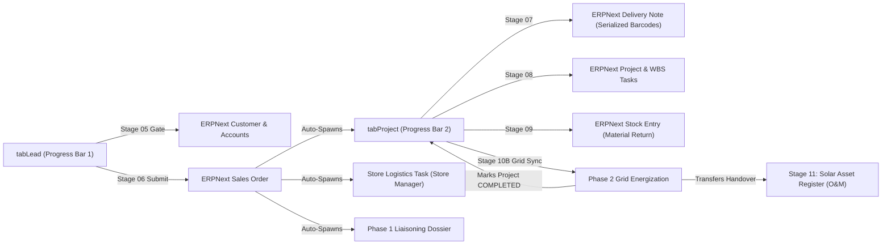

# Solar EPC Enterprise ERP — Master Dual Progress Bar Lifecycle & SLA Engine Specification

**Document Reference:** `step_plans/STEP_PLAN_DUAL_PROGRESS_BAR_LIFECYCLE_SLA_ENGINE.md`  
**Governing Architecture:** [`architect_docs/02_STEP_PLANNING_SPECIFICATION_BLUEPRINT.md`](../architect_docs/02_STEP_PLANNING_SPECIFICATION_BLUEPRINT.md) | [`docs/decisions/ADR-007-DUAL-PROGRESS-BAR-LIFECYCLE-SLA-ENGINE.md`](../docs/decisions/ADR-007-DUAL-PROGRESS-BAR-LIFECYCLE-SLA-ENGINE.md)  
**Enterprise Reference:** [`planning_ref_docs/README.prd.md`](../planning_ref_docs/README.prd.md) | [`planning_ref_docs/10_UI_UX_SPECIFICATION.md`](../planning_ref_docs/10_UI_UX_SPECIFICATION.md)  
**Author:** Principal Enterprise Architect  
**Status:** Approved for Implementation

---

## 1. Step Scope, Objectives & Context Traceability

### 1.1 Enterprise Lifecycle Positioning & The Dual-Progress-Bar Paradigm

In the Sadbhav Solar EPC Enterprise ERP platform (`solar_module`), project execution is divided into two distinct yet synchronized operational domains:

1. **Commercial & Pre-Execution Lifecycle (Governed in `tabLead`):**  
   From initial inquiry capture through survey, PV engineering, proposal, subsidy deduction, advance payment clearance, Sales Order contract freeze, to Phase 1 early DISCOM statutory filings. Upon completing Phase 1 liaisoning handoff, the individual `Lead` transitions to its terminal milestone and is marked **`Completed`**.

2. **Physical Execution, Procurement & Grid Synchronization Lifecycle (Governed in `tabProject`):**  
   Spawns automatically upon the submission and baseline freeze of the ERPNext `Sales Order`. This lifecycle anchors to the Stage 05 financial clearance gate, then tracks serialized material dispatch (`Delivery Note`), multi-zone civil/electrical site installation and Daily Progress Reports (DPR), surplus site material reconciliation and return to central store (`Stock Entry`), and concludes with Phase 2 statutory inspections, CEIG safety approval, bi-directional net-meter energization, and grid synchronization. Upon completing grid synchronization, the `Project` is formally marked **`Completed`** (issuing the COD certificate and transitioning to Stage 11 O&M).

```
┌──────────────────────────────────────────────────────────────────────────────────────────────────┐
│                             THE DUAL PROGRESS BAR LIFECYCLE ENGINE                               │
├──────────────────────────────────────────────────────────────────────────────────────────────────┤
│                                                                                                  │
│  [PROGRESS BAR 1: LEAD LIFECYCLE STEPPER]                                                        │
│  Scope: tabLead (Lead Ingestion ──▶ Early Liaisoning Phase 1 Handoff)                            │
│                                                                                                  │
│   [01. Lead] ──▶ [02. Survey] ──▶ [03. Design] ──▶ [04. Proposal] ──▶ [05. Advance] ──▶          │
│                                                           │                                      │
│                                                           ▼                                      │
│                                              [06. Sales Order] ──▶ [10A. Early Liaisoning]       │
│                                                                            │                     │
│                                                                            ▼                     │
│                                                                 ★ MARK LEAD COMPLETED ★          │
│                                                                                                  │
├──────────────────────────────────────────────────────────────────────────────────────────────────┤
│                                                                                                  │
│  [PROGRESS BAR 2: PROJECT LIFECYCLE STEPPER]                                                     │
│  Scope: tabProject (Spawned by Sales Order Submit ──▶ Grid Sync & COD Handover)                  │
│                                                                                                  │
│   [05G. Advance Gate] ──▶ [06. SO Baseline] ──▶ [07. Dispatch] ──▶ [08. Installation & DPR] ──▶  │
│                                                           │                                      │
│                                                           ▼                                      │
│                                    [09. Material Return] ──▶ [10B. Grid Sync & Net Meter]        │
│                                                                            │                     │
│                                                                            ▼                     │
│                                                                ★ MARK PROJECT COMPLETED ★        │
│                                                                            │                     │
│                                                                            ▼                     │
│                                                                 [11. O&M Asset Register]         │
└──────────────────────────────────────────────────────────────────────────────────────────────────┘
```

### 1.2 Business Objectives & Measurable KPIs

- **Cycle Time Compression:** Eliminate handoff latency between sales, engineering, finance, store logistics, site execution, and DISCOM liaisoning, reducing overall EPC delivery lead times by 35%.
- **Zero Ambiguity in Stage Progress:** Deliver instant visual clarity across 5 standardized state dimensions (`Idle`, `Ongoing`, `Overdue`, `Completed on Time`, `Completed with Delay`).
- **Strict SLA Enforcement:** Eliminate hidden project delays through real-time Turnaround Time (TAT) tracking against SLA baselines configured in `Solar SLA Settings`.
- **Role-Gated Interactivity:** Empower frontline users with one-click operational drawers and deep links while strictly preventing unauthorized milestone bypassing.

### 1.3 Context Traceability Matrix

- **PFM / Architecture:** `01_PROJECT_FOUNDATION_MODEL.md` (Dual-flow lifecycles, Task SLA engine, Notification matrix).
- **FRS / BRD:** `05_BUSINESS_REQUIREMENTS_DOCUMENT.md` (`BR-001`, `BR-005`, `BR-006`, `BR-010`, `BR-017`), `06_FUNCTIONAL_REQUIREMENTS_SPECIFICATION.md` (`FR-001` through `FR-010`, `FR-017`, `FR-018`).
- **UI/UX Standard:** `10_UI_UX_SPECIFICATION.md` (Screen 3: Lead Detail Stepper, Screen 11: Project Execution Stepper, Screen 14: Dual-Timing Liaisoning).
- **Architectural ADR:** `ADR-007-DUAL-PROGRESS-BAR-LIFECYCLE-SLA-ENGINE.md`.

---

## 2. Stakeholders, Enterprise Actors & HRMS Role Mapping

In strict accordance with the **Zero "User" Suffix Rule** and the **Supreme Authority Hierarchy Standard**:

```
┌──────────────────────────────────────────────────────────────────────────────────────────────────┐
│                             ENTERPRISE AUTHORITY HIERARCHY ARCHITECTURE                          │
├──────────────────────────────────────────────────┬───────────────────────────────────────────────┤
│    `System Manager` (Framework Supreme / Dev)    │       `Admin` (Project / Solar Supreme)       │
│           [Technical & Root Realm]               │       [Business & Operational Realm]          │
├──────────────────────────────────────────────────┼───────────────────────────────────────────────┤
│ ✔ Supreme over `Admin` (Frappe native hierarchy) │ ✔ Supreme command over all Project operations │
│ ✔ Possesses WHATEVER access `Admin` has          │ ✔ Access to all business documents/workflows  │
│ ✔ Access to Python source code & git repos       │ ✔ Manage `Solar SLA Settings` (hours/days)    │
│ ✔ Manage DocType schemas & Custom Fields         │ ✔ Manage `Solar Notification Settings`        │
│ ✔ Access to Server Scripts & Client Scripts      │ ✔ Authorize stage overrides & delay waivers   │
│ ✔ Frappe Developer Mode & System Console         │ ✔ Executive command dashboards & audits       │
│ ✔ Bench CLI, migrations & Redis worker queues    │ ✖ RESTRICTED from source code & server scripts│
│ ✔ Root superuser / developer administration      │ ✖ RESTRICTED from DocType schema modifications│
└──────────────────────────────────────────────────┴───────────────────────────────────────────────┘
```

### 2.1 Operational Actor Matrix

| Persona / Business Actor            | Approved Enterprise Role Standard       | Frappe HRMS Designation                   | Operational Domain & Stepper Responsibility                      | Permission Level & Stepper Interactivity                            |
| :---------------------------------- | :-------------------------------------- | :---------------------------------------- | :--------------------------------------------------------------- | :------------------------------------------------------------------ |
| **Solar EPC Director**              | `Director`                              | `Managing Director`                       | Executive governance; cross-flow oversight.                      | Full read/override; SLA analytics drilldown; delay approvals.       |
| **Project Supreme Administrator**   | **`Admin`**                             | `Operations Vice President`               | Project-level supreme operational command; governance owner.     | Universal operational control; delay waiver sign-off; SLA settings. |
| **Inside Sales Representative**     | **`Sales Representative`**              | `Inside / Field Sales Executive`          | Stage 01 Lead ingestion, qualification, survey booking.          | Read/Write assigned Lead; trigger survey schedule drawer.           |
| **Sales Department Lead**           | **`Sales Manager`**                     | `Area Sales Manager`                      | Stage 01 pipeline oversight; inherits all Sales Rep authority.   | Universal Read/Write Sales; assignment control; SLA escalation.     |
| **Site Survey Specialist**          | **`Survey Engineer`**                   | `Field Survey Auditor`                    | Stage 02 technical site survey, GPS audit, 6 photos.             | Read/Write assigned Survey; mobile audit launch; offline sync.      |
| **Survey Department Lead**          | **`Survey Manager`**                    | `Lead Survey Auditor`                     | Stage 02 technical sign-off; inherits all Survey Eng authority.  | Universal Read/Write Survey; technical validation & SLA tracking.   |
| **PV CAD & Electrical Designer**    | **`Design Engineer`**                   | `Solar Design Engineer`                   | Stage 03 PV system layout, SLD, dynamic BOM explosion.           | Read/Write assigned Design; CAD/SLD upload drawer; BOM freeze.      |
| **Design Department Lead**          | **`Design Manager`**                    | `Chief Technical Designer`                | Stage 03 engineering sign-off; inherits all Design Eng powers.   | Universal Read/Write Design; BOM baseline sign-off; SLA escalation. |
| **CRM & Proposal Specialist**       | **`CRM Representative`**                | `Proposal & CRM Specialist`               | Stage 04 quotation proposal, tariff analysis, subsidy.           | Read/Write assigned Quotation; proposal generator; contract send.   |
| **CRM Department Lead**             | **`CRM Manager`**                       | `CRM Operations Manager`                  | Stage 04 pricing sign-off; Stage 06 order creation; full CRM.    | Universal Read/Write CRM; proposal approval & baseline creation.    |
| **Finance & Accounts Assistant**    | **`Accounts Assistant`**                | `Accounts Executive`                      | Stage 05 customer advance verification, bank UTR check.          | Read/Write Payment Entry; advance clearance gate verification.      |
| **Finance Department Lead**         | **`Accounts Manager`**                  | `Chief Financial Officer / Head Finance`  | Stage 05 financial gate approval; inherits all Accounts Assist.  | Universal Read/Write Accounts; advance clearance gate sign-off.     |
| **Commercial Operations Lead**      | **`Sales Manager`** / **`CRM Manager`** | `Sales Operations Executive`              | Stage 06 Sales Order baseline verification & submission.         | Read/Write/Submit Sales Order; baseline hash freeze.                |
| **Warehouse Fulfillment Assistant** | **`Store Assistant`**                   | `Store Assistant` / `Inventory Executive` | Stage 07 serialized picking, barcode scanning; Stage 09 returns. | Read/Write assigned Delivery Note, Stock Entry (Return).            |
| **Warehouse Store Lead**            | **`Store Manager`**                     | `Warehouse Supervisor`                    | Stage 07 dispatch staging, stock reservation, delegation.        | Universal Read/Write/Submit Delivery Note; reassign store task.     |
| **Field Execution Engineer**        | **`Project Engineer`**                  | `Site Execution Engineer`                 | Stage 08 multi-zone installation, daily progress reports (DPR).  | Read/Write assigned Project & WBS Tasks; submit DPR drawer.         |
| **On-Site Construction Lead**       | **`Site Supervisor`**                   | `Field Installation Supervisor`           | Stage 08 real-time daily site progress logging, crew check-in.   | Read/Write assigned DPR & WBS task checklists on mobile.            |
| **Project Execution Lead**          | **`Project Manager`**                   | `Project Delivery Lead`                   | Stage 08 execution governance; inherits all Site/Engineer auth.  | Universal Read/Write Project; milestone sign-off; site GRN custody. |
| **Statutory Compliance Rep**        | **`Liaisoning Representative`**         | `Statutory Compliance Executive`          | Stage 10A early DISCOM filing; Stage 10B grid synchronization.   | Read/Write assigned Liaisoning Dossier; document upload.            |
| **Statutory Department Lead**       | **`Liaisoning Manager`**                | `Head Statutory Compliance`               | Stage 10 compliance oversight; inherits all Liaisoning Rep auth. | Universal Read/Write/Submit Liaisoning Dossier; confirm grid sync.  |
| **Technical Framework Admin**       | **`System Manager`**                    | `Chief Technology Officer`                | Technical plumbing, DocType schemas, developer console.          | Apex technical authority (possesses all access `Admin` has).        |

---

## 3. Relational Schema & 3NF Data Dictionary

### 3.1 Core DocType Extensions: `tabLead` (Progress Bar 1 Host)

| Fieldname                     | Label                       | Fieldtype  | Options / Target                                                                                      | Mandatory | Index | Description & Validation Rules                                                      |
| :---------------------------- | :-------------------------- | :--------- | :---------------------------------------------------------------------------------------------------- | :-------: | :---: | :---------------------------------------------------------------------------------- |
| `custom_lead_progress_status` | Stepper Progress Status     | `Select`   | `Open\nSite Survey\nPV Design\nProposal\nAdvance Clearance\nSales Order\nEarly Liaisoning\nCompleted` |    Yes    |   1   | Macro stage pointer for Lead Stepper. Updated by state machine.                     |
| `custom_current_stage_code`   | Active Stage Code           | `Data`     | -                                                                                                     |    Yes    |   1   | Canonical stage code: `S01_LEAD`, `S02_SURVEY`, `S03_DESIGN`, etc.                  |
| `custom_stage_state`          | Active Stage State          | `Select`   | `IDLE\nONGOING_HEALTHY\nONGOING_OVERDUE\nCOMPLETED_ON_TIME\nCOMPLETED_DELAYED`                        |    Yes    |   1   | Real-time 5-state visual state indicator for active stage.                          |
| `custom_stage_started_on`     | Current Stage Started On    | `Datetime` | -                                                                                                     |    No     |   -   | Timestamp when active stage transitioned from IDLE to ONGOING.                      |
| `custom_stage_sla_due`        | Current Stage SLA Deadline  | `Datetime` | -                                                                                                     |    No     |   1   | Timestamp when active stage reaches deadline ($T_{\text{start}} + T_{\text{SLA}}$). |
| `custom_stage_elapsed_hours`  | Current Stage Elapsed Hours | `Float`    | -                                                                                                     |    No     |   -   | Real-time computed hours elapsed in current stage.                                  |
| `custom_lead_completed_on`    | Lead Formal Completed On    | `Datetime` | -                                                                                                     |    No     |   -   | Timestamp when Stage 10A handoff marked lead completed.                             |
| `custom_stage_delay_log`      | Stage Delay Audit Log       | `Table`    | `Solar Stage Delay Log`                                                                               |    No     |   -   | Child table storing historical delay reasons and Admin waivers.                     |

### 3.2 Core DocType Extensions: `tabProject` (Progress Bar 2 Host)

| Fieldname                        | Label                       | Fieldtype  | Options / Target                                                                                                 | Mandatory | Index | Description & Validation Rules                                                        |
| :------------------------------- | :-------------------------- | :--------- | :--------------------------------------------------------------------------------------------------------------- | :-------: | :---: | :------------------------------------------------------------------------------------ |
| `custom_project_progress_status` | Stepper Progress Status     | `Select`   | `Advance Verified\nSales Order Baseline\nMaterial Dispatch\nInstallation\nMaterial Return\nGrid Sync\nCompleted` |    Yes    |   1   | Macro stage pointer for Project Stepper.                                              |
| `custom_current_stage_code`      | Active Stage Code           | `Data`     | -                                                                                                                |    Yes    |   1   | Canonical stage code: `S05G_ADVANCE`, `S06_SO`, `S07_DISPATCH`, etc.                  |
| `custom_stage_state`             | Active Stage State          | `Select`   | `IDLE\nONGOING_HEALTHY\nONGOING_OVERDUE\nCOMPLETED_ON_TIME\nCOMPLETED_DELAYED`                                   |    Yes    |   1   | Real-time 5-state visual indicator for active stage.                                  |
| `custom_stage_started_on`        | Current Stage Started On    | `Datetime` | -                                                                                                                |    No     |   -   | Timestamp when active stage commenced.                                                |
| `custom_stage_sla_due`           | Current Stage SLA Deadline  | `Datetime` | -                                                                                                                |    No     |   1   | Target completion timestamp derived from `Solar SLA Settings`.                        |
| `custom_stage_elapsed_hours`     | Current Stage Elapsed Hours | `Float`    | -                                                                                                                |    No     |   -   | Real-time computed hours elapsed in current stage.                                    |
| `custom_is_completed_flag`       | Project Formally Completed  | `Check`    | -                                                                                                                |    Yes    |   1   | Default: 0. Set to 1 strictly upon Stage 10B Grid Sync sign-off.                      |
| `custom_completion_certified_by` | Completed Certified By      | `Link`     | `User`                                                                                                           |    No     |   -   | `Liaisoning Representative`, `Liaisoning Manager`, or `Admin` who verified grid sync. |
| `custom_completion_certified_on` | Completed Certified On      | `Datetime` | -                                                                                                                |    No     |   -   | Timestamp of commercial operation commissioning date (COD).                           |
| `custom_stage_delay_log`         | Stage Delay Audit Log       | `Table`    | `Solar Stage Delay Log`                                                                                          |    No     |   -   | Child table storing historical delay reasons and Admin waivers.                       |

### 3.3 Standalone Child DocType: `tabSolar Stage Delay Log`

- **Module:** `solar_module`
- **DocType Type:** Child Table (`istable = 1`)

| Fieldname               | Label                         | Fieldtype    | Options / Target                                                                                                                                                   | Mandatory | Index | Description & Validation Rules                                    |
| :---------------------- | :---------------------------- | :----------- | :----------------------------------------------------------------------------------------------------------------------------------------------------------------- | :-------: | :---: | :---------------------------------------------------------------- |
| `stage_code`            | Stage Code                    | `Data`       | -                                                                                                                                                                  |    Yes    |   1   | Canonical stage identifier (e.g. `S02_SURVEY`, `S07_DISPATCH`).   |
| `stage_name`            | Stage Name                    | `Data`       | -                                                                                                                                                                  |    Yes    |   -   | Human-readable stage name.                                        |
| `sla_target_hours`      | Target SLA (Hours)            | `Float`      | -                                                                                                                                                                  |    Yes    |   -   | Baseline SLA configured at inception.                             |
| `actual_tat_hours`      | Actual TAT (Hours)            | `Float`      | -                                                                                                                                                                  |    Yes    |   -   | Total duration spent in stage.                                    |
| `delay_hours`           | Delay Duration (Hours)        | `Float`      | -                                                                                                                                                                  |    Yes    |   -   | Positive variance ($\Delta T = T_{\text{TAT}} - T_{\text{SLA}}$). |
| `delay_category`        | Delay Reason Category         | `Select`     | `Customer Delay\nStatutory / DISCOM Delay\nMaterial Procurement Delay\nSite Civil / Access Obstacle\nWeather Emergency\nEngineering Redesign\nAdministrative Hold` |    Yes    |   1   | Standardized classification for operational bottleneck analysis.  |
| `delay_remarks`         | Operational Delay Explanation | `Small Text` | -                                                                                                                                                                  |    Yes    |   -   | Mandatory detailed explanation of delay cause.                    |
| `logged_by`             | Logged By Operator            | `Link`       | `User`                                                                                                                                                             |    Yes    |   -   | Assignee responsible for logging delay.                           |
| `logged_on`             | Logged On Timestamp           | `Datetime`   | -                                                                                                                                                                  |    Yes    |   -   | Audit timestamp when log was recorded.                            |
| `admin_waiver_approved` | Admin Waiver Approved         | `Check`      | -                                                                                                                                                                  |    Yes    |   1   | Default: 0. Set to 1 if `Admin` waives penalty/overdue flag.      |
| `admin_waiver_by`       | Waiver Authorized By          | `Link`       | `User`                                                                                                                                                             |    No     |   -   | Restricted strictly to `Admin` or `Director`.                     |
| `admin_waiver_remarks`  | Waiver Authorization Remarks  | `Small Text` | -                                                                                                                                                                  |    No     |   -   | Justification for granting administrative SLA waiver.             |

### 3.4 Standalone Single DocType: `tabSolar SLA Settings`

- **Module:** `solar_module`
- **DocType Type:** Single (`issingle = 1`)
- **Permission Access:** Read for all operational roles; Write restricted strictly to **`Admin`**, **`Director`**, and **`System Manager`**.

| Fieldname                      | Label                                  | Fieldtype | Default | Description                                           |
| :----------------------------- | :------------------------------------- | :-------- | :------ | :---------------------------------------------------- |
| `sla_s01_lead_hours`           | S01 Lead Response SLA (Hours)          | `Int`     | `2`     | Response SLA for inbound lead qualification.          |
| `sla_s02_survey_hours`         | S02 Technical Survey SLA (Hours)       | `Int`     | `24`    | Expected duration to audit site & upload 6 photos.    |
| `sla_s03_design_res_hours`     | S03 PV Design Residential SLA (Hours)  | `Int`     | `24`    | CAD, SLD & dynamic BOM for systems $\le 10$ kWp.      |
| `sla_s03_design_ci_hours`      | S03 PV Design C&I SLA (Hours)          | `Int`     | `48`    | CAD, SLD & dynamic BOM for systems $> 10$ kWp.        |
| `sla_s04_proposal_hours`       | S04 Commercial Proposal SLA (Hours)    | `Int`     | `24`    | Multi-scenario pricing & subsidy calculation.         |
| `sla_s05_advance_hours`        | S05 Advance Payment Gate SLA (Hours)   | `Int`     | `48`    | Financial clearance & Customer creation turnaround.   |
| `sla_s06_so_baseline_hours`    | S06 Sales Order Baseline SLA (Hours)   | `Int`     | `24`    | Contract agreement signing & cryptographic freeze.    |
| `sla_s07_dispatch_hours`       | S07 Material Dispatch SLA (Hours)      | `Int`     | `48`    | Warehouse allocation, serial scan & vehicle dispatch. |
| `sla_s08_install_per_kw_days`  | S08 Installation Speed (Days / 10 kWp) | `Float`   | `3.0`   | Algorithmic WBS execution speed baseline.             |
| `sla_s09_return_hours`         | S09 Material Return SLA (Hours)        | `Int`     | `48`    | Site reconciliation & surplus stock return to store.  |
| `sla_s10a_early_liaison_hours` | S10A Early DISCOM Filing SLA (Hours)   | `Int`     | `72`    | Post-SO consumer KYC & grid connectivity filing.      |
| `sla_s10b_grid_sync_days`      | S10B Statutory Grid Sync SLA (Days)    | `Int`     | `10`    | Strict statutory countdown post-installation.         |
| `sla_refresh_interval_sec`     | Frontend Stepper Refresh Poll (Sec)    | `Int`     | `60`    | Client-side reactive polling / WebSocket interval.    |

---

## 4. State Machine, Verification Gates & SLA Engine

### 4.1 Progress Bar 1 State Machine (`LeadProgressBar`)

```mermaid
stateDiagram-v2
    [*] --> S01_LEAD: Inbound Lead Ingestion

    state S01_LEAD {
        [*] --> S01_Ongoing: Initialized (SLA 2h)
        S01_Ongoing --> S01_Overdue: Elapsed > 2h
        S01_Overdue --> S01_Done: Mobile Verified & Surveyor Assigned (With Delay Log)
        S01_Ongoing --> S01_Done: Mobile Verified & Surveyor Assigned (Within SLA)
    }

    S01_LEAD --> S02_SURVEY: Gate: 10-Digit Mobile Sanitized & Surveyor Appointed

    state S02_SURVEY {
        [*] --> S02_Ongoing: Surveyor Dispatched (SLA 24h)
        S02_Ongoing --> S02_Overdue: Elapsed > 24h
        S02_Overdue --> S02_Done: GPS Locked & 6 Photos Validated (With Delay Log)
        S02_Ongoing --> S02_Done: GPS Locked & 6 Photos Validated (Within SLA)
    }

    S02_SURVEY --> S03_DESIGN: Gate: Site Survey Audit Submitted

    state S03_DESIGN {
        [*] --> S03_Ongoing: Sizing Initialized (SLA 24h-48h)
        S03_Ongoing --> S03_Overdue: Elapsed > Target SLA
        S03_Overdue --> S03_Done: CAD/SLD Attached & Dynamic BOM Frozen (With Delay Log)
        S03_Ongoing --> S03_Done: CAD/SLD Attached & Dynamic BOM Frozen (Within SLA)
    }

    S03_DESIGN --> S04_PROPOSAL: Gate: Engineering Design Submittable Freeze

    state S04_PROPOSAL {
        [*] --> S04_Ongoing: Quotation Drafted (SLA 24h)
        S04_Ongoing --> S04_Overdue: Elapsed > 24h
        S04_Overdue --> S04_Done: Subsidy Computed & Customer Accepted (With Delay Log)
        S04_Ongoing --> S04_Done: Subsidy Computed & Customer Accepted (Within SLA)
    }

    S04_PROPOSAL --> S05_ADVANCE: Gate: Proposal Finalized & Margin Floor Satisfied

    state S05_ADVANCE {
        [*] --> S05_Ongoing: Inception Gate Awaiting Payment (SLA 48h)
        S05_Ongoing --> S05_Overdue: Elapsed > 48h
        S05_Overdue --> S05_Done: Advance Verified & Customer Master Created (With Delay Log)
        S05_Ongoing --> S05_Done: Advance Verified & Customer Master Created (Within SLA)
    }

    S05_ADVANCE --> S06_SALES_ORDER: Gate: Verified Advance Receipt (UTR/Cheque)

    state S06_SALES_ORDER {
        [*] --> S06_Ongoing: Contract Drafting (SLA 24h)
        S06_Ongoing --> S06_Overdue: Elapsed > 24h
        S06_Overdue --> S06_Done: Signed Contract Attached & Baseline Sealed (With Delay Log)
        S06_Ongoing --> S06_Done: Signed Contract Attached & Baseline Sealed (Within SLA)
    }

    S06_SALES_ORDER --> S10A_LIAISONING: Gate: Sales Order docstatus=1 (Spawns Project & Phase 1 Liaisoning)

    state S10A_LIAISONING {
        [*] --> S10A_Ongoing: KYC & Bill Collected (SLA 72h)
        S10A_Ongoing --> S10A_Overdue: Elapsed > 72h
        S10A_Overdue --> S10A_Done: DISCOM Application Number Logged (With Delay Log)
        S10A_Ongoing --> S10A_Done: DISCOM Application Number Logged (Within SLA)
    }

    S10A_LIAISONING --> LEAD_COMPLETED: Gate: Phase 1 Dossier Successfully Uploaded
    LEAD_COMPLETED --> [*]: Individual Lead Formally Marked COMPLETED
```



### 4.2 Progress Bar 2 State Machine (`ProjectProgressBar`)

```mermaid
stateDiagram-v2
    [*] --> S05G_ADVANCE_GATE: Sales Order Submitted (docstatus=1)

    state S05G_ADVANCE_GATE {
        [*] --> S05G_Verified: Financial Clearance Checksum Verified (Gate 0 Completed)
    }

    S05G_ADVANCE_GATE --> S06_SO_BASELINE: Inherits Stage 05 Clearance

    state S06_SO_BASELINE {
        [*] --> S06_Active: WBS Instantiation & Store Task Generation (SLA 24h)
        S06_Active --> S06_Done: WBS Assigned to Project Engineer & Store Manager
    }

    S06_SO_BASELINE --> S07_DISPATCH: Gate: Sales Order Baseline Frozen & Staging Unlocked

    state S07_DISPATCH {
        [*] --> S07_Ongoing: Store Picking & Serial Scan (SLA 48h)
        S07_Ongoing --> S07_Overdue: Elapsed > 48h
        S07_Overdue --> S07_Done: Delivery Note Submitted with E-Way Bill (With Delay Log)
        S07_Ongoing --> S07_Done: Delivery Note Submitted with E-Way Bill (Within SLA)
    }

    S07_DISPATCH --> S08_INSTALLATION: Gate: Delivery Note docstatus=1 (Material at Working Site)

    state S08_INSTALLATION {
        [*] --> S08_Ongoing: Multi-Zone Civil, Structure, Electrical Execution (SLA Configured)
        S08_Ongoing --> S08_Overdue: Elapsed > Target Project Days
        S08_Overdue --> S08_Done: 100% WBS Tasks Closed & DPR Signed Off (With Delay Log)
        S08_Ongoing --> S08_Done: 100% WBS Tasks Closed & DPR Signed Off (Within SLA)
    }

    S08_INSTALLATION --> S09_MATERIAL_RETURN: Gate: Site Installation Work 100% Finished

    state S09_MATERIAL_RETURN {
        [*] --> S09_Ongoing: Dispatched vs Installed Reconciliation (SLA 48h)
        S09_Ongoing --> S09_Overdue: Elapsed > 48h
        S09_Overdue --> S09_Done: Stock Entry (Material Return) Submitted / Zero Surplus Audit (With Delay Log)
        S09_Ongoing --> S09_Done: Stock Entry (Material Return) Submitted / Zero Surplus Audit (Within SLA)
    }

    S09_MATERIAL_RETURN --> S10B_GRID_SYNC: Gate: Material Reconciliation Cleared

    state S10B_GRID_SYNC {
        [*] --> S10B_Ongoing: Statutory 10-Day Countdown Clock Starts (SLA 10 Days)
        S10B_Ongoing --> S10B_Overdue: Elapsed > 10 Days
        S10B_Overdue --> S10B_Done: CEIG Passed, Bi-Directional Meter Installed & Grid Energized (With Delay Log)
        S10B_Ongoing --> S10B_Done: CEIG Passed, Bi-Directional Meter Installed & Grid Energized (Within SLA)
    }

    S10B_GRID_SYNC --> PROJECT_COMPLETED: Gate: Phase 2 Grid Sync Certified
    PROJECT_COMPLETED --> [*]: tabProject Formally Marked COMPLETED (Transfers to Stage 11 O&M)
```



### 4.3 Five-State Visual & Semantic Ontology

Every single stage in both steppers resolves to exactly one of the five canonical states:

```
┌──────────────────────────────────────────────────────────────────────────────────────────────────┐
│                               5-STAGE VISUAL ONTOLOGY MATRIX                                     │
├────────────────────┬──────────────────┬──────────────────────┬───────────────────────────────────┤
│ State Code         │ Palette & Visual │ Iconography          │ Operational Behavior              │
├────────────────────┼──────────────────┼──────────────────────┼───────────────────────────────────┤
│ IDLE               │ Muted Cool Slate │ Circle Outline       │ Prerequisites pending. Click opens│
│                    │                  │                      │ prerequisite checklist drawer.    │
├────────────────────┼──────────────────┼──────────────────────┼───────────────────────────────────┤
│ ONGOING_HEALTHY    │ Electric Blue    │ Pulsing Spinner      │ Active work in progress. Elapsed  │
│                    │                  │                      │ time <= SLA. Action button active.│
├────────────────────┼──────────────────┼──────────────────────┼───────────────────────────────────┤
│ ONGOING_OVERDUE    │ Crimson Red      │ Pulsing Warning Tri. │ SLA expired. Escalation triggered.│
│                    │                  │                      │ Mandatory delay reason prompt.    │
├────────────────────┼──────────────────┼──────────────────────┼───────────────────────────────────┤
│ COMPLETED_ON_TIME  │ Emerald Green    │ Solid Checkmark      │ Finished within SLA. Click opens  │
│                    │                  │                      │ deliverables and recorded TAT.    │
├────────────────────┼──────────────────┼──────────────────────┼───────────────────────────────────┤
│ COMPLETED_DELAYED  │ Warm Amber       │ Checkmark + Alert    │ Finished after SLA breach. Delay  │
│                    │                  │                      │ log permanently attached.         │
└────────────────────┴──────────────────┴──────────────────────┴───────────────────────────────────┘
```

---

## 5. Controller Logic, Domain Services & Whitelisted APIs

### 5.1 Architecture of the Stepper Domain Service Layer

All mathematical calculations, SLA evaluations, stage progression rules, and role permission checks are encapsulated within the decoupled service layer:

```
solar_module/
└── services/
    └── stepper/
        ├── __init__.py
        ├── base_stepper.py            # Abstract Base Stepper Class
        ├── lead_stepper.py            # Lead Stepper Engine (Stages 01 - 10A)
        ├── project_stepper.py         # Project Stepper Engine (Stages 05G - 10B)
        ├── sla_calculator.py          # Real-time TAT & SLA Computation Engine
        └── stage_gate_validator.py    # Hard Server-Side Verification Gates
```

### 5.2 Core SLA Calculator Service (`sla_calculator.py`)

```python
import frappe
from frappe.utils import now_datetime, get_datetime, time_diff_in_hours, add_to_date
from typing import Dict, Any, Optional

class SolarSLACalculator:
    @staticmethod
    def get_stage_sla_hours(stage_code: str, capacity_kw: float = 0.0) -> float:
        """Fetch configured SLA duration in hours from tabSolar SLA Settings with capacity tiers."""
        settings = frappe.get_cached_doc("Solar SLA Settings")

        sla_mapping = {
            "S01_LEAD": float(settings.sla_s01_lead_hours or 2),
            "S02_SURVEY": float(settings.sla_s02_survey_hours or 24),
            "S03_DESIGN": float(settings.sla_s03_design_res_hours or 24) if capacity_kw <= 10.0 else float(settings.sla_s03_design_ci_hours or 48),
            "S04_PROPOSAL": float(settings.sla_s04_proposal_hours or 24),
            "S05_ADVANCE": float(settings.sla_s05_advance_hours or 48),
            "S06_SO_BASELINE": float(settings.sla_s06_so_baseline_hours or 24),
            "S07_DISPATCH": float(settings.sla_s07_dispatch_hours or 48),
            "S08_INSTALLATION": float((settings.sla_s08_install_per_kw_days or 3.0) * (capacity_kw / 10.0) * 24.0) if capacity_kw > 0 else 72.0,
            "S09_MATERIAL_RETURN": float(settings.sla_s09_return_hours or 48),
            "S10A_EARLY_LIAISON": float(settings.sla_s10a_early_liaison_hours or 72),
            "S10B_GRID_SYNC": float((settings.sla_s10b_grid_sync_days or 10) * 24.0),
        }
        return sla_mapping.get(stage_code, 24.0)

    @classmethod
    def evaluate_stage_metric(
        cls,
        stage_code: str,
        started_on: Optional[str],
        completed_on: Optional[str],
        capacity_kw: float = 0.0,
        has_admin_waiver: bool = False
    ) -> Dict[str, Any]:
        """Compute exact turnaround time, SLA deadline, variance, and 5-state visual code."""
        sla_hours = cls.get_stage_sla_hours(stage_code, capacity_kw)

        if not started_on:
            return {
                "state": "IDLE",
                "target_sla_hours": sla_hours,
                "elapsed_hours": 0.0,
                "variance_hours": 0.0,
                "progress_percent": 0.0,
                "is_overdue": False,
                "badge_label": f"SLA: {int(sla_hours)}h",
                "badge_class": "bg-slate-100 text-slate-600 border-slate-300"
            }

        start_dt = get_datetime(started_on)
        now_dt = now_datetime()

        if completed_on:
            end_dt = get_datetime(completed_on)
            tat_hours = round(time_diff_in_hours(end_dt, start_dt), 2)
            variance = round(tat_hours - sla_hours, 2)
            is_delayed = (variance > 0) and not has_admin_waiver

            return {
                "state": "COMPLETED_DELAYED" if is_delayed else "COMPLETED_ON_TIME",
                "target_sla_hours": sla_hours,
                "elapsed_hours": tat_hours,
                "variance_hours": variance,
                "progress_percent": 100.0,
                "is_overdue": False,
                "badge_label": f"TAT: {tat_hours}h / {int(sla_hours)}h" if not is_delayed else f"Delayed (+{variance}h)",
                "badge_class": "bg-amber-100 text-amber-800 border-amber-500" if is_delayed else "bg-emerald-100 text-emerald-800 border-emerald-500"
            }

        # Currently ongoing
        elapsed_hours = round(time_diff_in_hours(now_dt, start_dt), 2)
        variance = round(elapsed_hours - sla_hours, 2)
        is_overdue = (variance > 0) and not has_admin_waiver
        progress_pct = min(round((elapsed_hours / sla_hours) * 100, 1), 100.0)

        return {
            "state": "ONGOING_OVERDUE" if is_overdue else "ONGOING_HEALTHY",
            "target_sla_hours": sla_hours,
            "elapsed_hours": elapsed_hours,
            "variance_hours": variance,
            "progress_percent": progress_pct,
            "is_overdue": is_overdue,
            "badge_label": f"Elapsed: {elapsed_hours}h / {int(sla_hours)}h" if not is_overdue else f"OVERDUE (+{variance}h)",
            "badge_class": "bg-red-100 text-red-800 border-red-500 animate-pulse" if is_overdue else "bg-blue-100 text-blue-800 border-blue-500"
        }
```

### 5.3 Whitelisted Stepper RPC API Contract (`solar_module/api/stepper.py`)

All API interactions strictly mandate typed validation and in-method role permission assertions:

```python
import frappe
from frappe import _
from frappe.utils import now_datetime
from typing import Dict, Any
from solar_module.services.stepper.lead_stepper import LeadStepperEngine
from solar_module.services.stepper.project_stepper import ProjectStepperEngine

@frappe.whitelist(methods=["POST"])
def get_lifecycle_stepper_state(stepper_type: str, doc_name: str) -> Dict[str, Any]:
    """Return complete schema, active state, SLA analytics, and role actions for frontend render."""
    if not stepper_type or not doc_name:
        frappe.throw(_("Missing required parameters: stepper_type and doc_name"), frappe.ValidationError)

    if stepper_type == "lead":
        doc = frappe.get_doc("Lead", doc_name)
        doc.check_permission("read")
        return LeadStepperEngine.build_stepper_payload(doc, frappe.session.user)

    elif stepper_type == "project":
        doc = frappe.get_doc("Project", doc_name)
        doc.check_permission("read")
        return ProjectStepperEngine.build_stepper_payload(doc, frappe.session.user)

    else:
        frappe.throw(_("Invalid stepper_type. Expected 'lead' or 'project'"), frappe.ValidationError)

@frappe.whitelist(methods=["POST"])
def log_stage_delay_reason(
    stepper_type: str,
    doc_name: str,
    stage_code: str,
    delay_category: str,
    delay_remarks: str
) -> Dict[str, Any]:
    """Append structured delay justification to parent document audit log."""
    doctype = "Lead" if stepper_type == "lead" else "Project"
    doc = frappe.get_doc(doctype, doc_name)
    doc.check_permission("write")

    if not delay_category or not delay_remarks:
        frappe.throw(_("Delay Category and Operational Remarks are strictly mandatory."), frappe.ValidationError)

    doc.append("custom_stage_delay_log", {
        "stage_code": stage_code,
        "stage_name": stage_code.replace("_", " ").title(),
        "delay_category": delay_category,
        "delay_remarks": delay_remarks,
        "logged_by": frappe.session.user,
        "logged_on": now_datetime()
    })
    doc.save()

    return {"status": "success", "message": _("Delay justification recorded successfully.")}

@frappe.whitelist(methods=["POST"])
def approve_admin_stage_waiver(
    stepper_type: str,
    doc_name: str,
    delay_log_idx: int,
    waiver_remarks: str
) -> Dict[str, Any]:
    """Allow Admin or Director to grant formal waiver for overdue stage penalty."""
    current_roles = frappe.get_roles(frappe.session.user)
    if "Admin" not in current_roles and "Director" not in current_roles and "System Manager" not in current_roles:
        frappe.throw(_("Only Admin, Director, or System Manager can authorize SLA waivers."), frappe.PermissionError)

    doctype = "Lead" if stepper_type == "lead" else "Project"
    doc = frappe.get_doc(doctype, doc_name)

    try:
        row = doc.custom_stage_delay_log[int(delay_log_idx) - 1]
    except IndexError:
        frappe.throw(_("Invalid delay log row reference."), frappe.ValidationError)

    row.admin_waiver_approved = 1
    row.admin_waiver_by = frappe.session.user
    row.admin_waiver_remarks = waiver_remarks
    doc.save()

    return {"status": "success", "message": _("Administrative SLA waiver granted.")}
```

---

## 6. Frontend UI/UX Specification (Vue 3 / Frappe UI SPA & Desk View)

### 6.1 Visual Component Architecture: `<ProgressBarStepper.vue>`

The frontend component implements a high-density, accessible, responsive visual stepper supporting both horizontal desktop layouts and responsive vertical mobile drawer stacks:

```
┌──────────────────────────────────────────────────────────────────────────────────────────────────┐
│  PROGRESS BAR 1: LEAD LIFECYCLE STEPPER (COMMERCIAL TO EARLY LIAISONING)                         │
├──────────────────────────────────────────────────────────────────────────────────────────────────┤
│                                                                                                  │
│   [ ✓ S01 ] ═══════ [ ✓ S02 ] ═══════ [ ⏳ S03 ] ─────── [ ○ S04 ] ─────── [ ○ S05 ] ─────── ...  │
│   Lead Qual.        Site Survey       PV Design         Proposal          Advance Clear          │
│   TAT: 1.5h/2h      TAT: 22h/24h      Elapsed: 28h/24h  SLA: 24h          SLA: 48h               │
│   [On Time]         [On Time]         [+4h OVERDUE]     [Idle]            [Idle]                 │
│   Emerald           Emerald           Crimson Pulse     Cool Slate        Cool Slate             │
│                                                                                                  │
├──────────────────────────────────────────────────────────────────────────────────────────────────┤
│  ACTIVE NODE INSPECTOR (SLIDE-OVER DRAWER): S03 PV Design & Dynamic BOM                         │
│  - Assigned Engineer: Priya Desai (Design Engineer)                                              │
│  - Deliverables: Dynamic BOM (custom_quot_bom: 28 items), CAD Layout (REV_02.dwg)                 │
│  - Primary Action Button: [ Freeze Engineering BOM & Sign Off ]                                  │
│  - Deep Link Shortcut: [ Open Engineering Design Form ↗ ]                                        │
│  - Mandatory Delay Notice: SLA Breached by 4.2 hours. Log delay category before sign-off.        │
└──────────────────────────────────────────────────────────────────────────────────────────────────┘
```

### 6.2 Visual Styling Tokens & Tailwind Configuration

```css
/* Stepper Node Visual Tokens */
.stepper-node-idle {
  @apply bg-slate-100 text-slate-500 border border-slate-300 dark:bg-slate-800 dark:text-slate-400 dark:border-slate-700;
}
.stepper-node-ongoing {
  @apply bg-blue-50 text-blue-700 border-2 border-blue-500 shadow-md ring-2 ring-blue-300/60 dark:bg-blue-950/60 dark:text-blue-300 dark:border-blue-400;
}
.stepper-node-overdue {
  @apply bg-red-50 text-red-700 border-2 border-red-500 shadow-lg ring-4 ring-red-400/50 animate-pulse dark:bg-red-950/70 dark:text-red-300 dark:border-red-500;
}
.stepper-node-completed {
  @apply bg-emerald-50 text-emerald-700 border-2 border-emerald-500 shadow-sm dark:bg-emerald-950/60 dark:text-emerald-300 dark:border-emerald-500;
}
.stepper-node-delayed {
  @apply bg-amber-50 text-amber-800 border-2 border-amber-600 shadow-sm dark:bg-amber-950/60 dark:text-amber-300 dark:border-amber-600;
}

/* Connecting Line Paths */
.connector-completed {
  @apply h-1 bg-emerald-500 transition-all duration-500;
}
.connector-ongoing {
  @apply h-1 bg-gradient-to-r from-emerald-500 to-blue-500 transition-all duration-500;
}
.connector-idle {
  @apply h-1 bg-slate-200 border-t border-dashed border-slate-400 dark:bg-slate-700 dark:border-slate-600;
}
```

### 6.3 Interactive Flyout Drawer Specification (`<StageInspectorDrawer.vue>`)

When a user clicks any stage bubble, an accessible slide-over drawer animates from the right viewport edge:

1. **Header:** Stage title, sequence number, SLA clock, status pill badge.
2. **Actor Badge:** Displays assigned user name, avatar, Frappe HRMS designation (`Sales Representative`, `Survey Engineer`, `Design Engineer`, etc.), and contact phone.
3. **Artifacts & Deliverables Tray:**
   - S01: Mobile verification status, initial bill amount, pincode.
   - S02: 6 mandatory audit photo thumbnails with zoom viewer, site GPS map preview.
   - S03: CAD/SLD preview link, frozen BOM line items count, cable voltage drop %.
   - S04: Quoted pricing, PM Surya Ghar subsidy deduction breakdown, PDF proposal viewer.
   - S05: Verified bank UTR number, payment receipt attachment, created Customer link.
   - S06: Signed contract PDF preview, frozen SHA-256 baseline checksum.
   - S07: Delivery Note reference, serialized panel/inverter scan count, e-way bill number.
   - S08: Multi-zone WBS progress bar (% complete), latest daily progress report (DPR).
   - S09: Surplus material return checklist, reconciled stock balance.
   - S10: DISCOM application reference, CEIG inspection certificate, net-meter serial number.
4. **Role Action Bar:**
   - Contextual button rendered **strictly if the logged-in user possesses the required role**:
     - Example: If `Survey Engineer`, button is `"Launch Mobile Survey"`. If not, button is disabled with tooltip: `"Restricted to Survey Engineer"`.
   - **Deep Link Button:** `"Open in Frappe Desk ↗"` opening `/app/<doctype>/<name>` in new tab (strictly enforcing Frappe document permissions).
   - **Admin Override Trigger:** Visible only to `Admin` and `Director`: `"Grant SLA Waiver"`, `"Reassign Stage"`.

### 6.4 Frappe Desk Integration (`lead.js` & `project.js`)

In Frappe Desk form views, the progress bar is injected dynamically into the document dashboard header:

```javascript
// codes/client_script/lead.js
frappe.ui.form.on("Lead", {
  refresh(frm) {
    if (!frm.is_new()) {
      frm.dashboard.clear_headline();
      render_lifecycle_stepper(frm, "lead");
    }
  },
});

function render_lifecycle_stepper(frm, type) {
  frappe.call({
    method: "solar_module.api.stepper.get_lifecycle_stepper_state",
    args: { stepper_type: type, doc_name: frm.doc.name },
    callback(r) {
      if (r.message) {
        const wrapper = frm.dashboard.add_section(
          frappe.render_template("solar_stepper_wrapper", { data: r.message }),
          __("Lifecycle Progress & SLA Tracker"),
        );
        mount_interactive_stepper_events(wrapper, frm, r.message);
      }
    },
  });
}
```

---

## 7. Cross-App Integration Touchpoints



### 7.1 Lifecycle Synchronous Handoff Contract

1. **Lead Terminal State (`custom_lead_progress_status = 'Completed'`):**
   - Occurs strictly when Stage 10A (Phase 1 Liaisoning) confirms document submission to the DISCOM portal (`discom_application_no` populated).
   - Locks `tabLead` from further editing by sales representatives; archives lead into `Converted / Handed Over` state.
2. **Project Inception & Baseline Anchor:**
   - Instantiated with `custom_lead_reference = lead.name`, preserving the complete thread of identity from initial lead capture.
   - Progress Bar 2 mounts with Stage 05G (`Advance Gate`) pre-flagged as `COMPLETED_ON_TIME`.
3. **Project Terminal State (`custom_is_completed_flag = 1`, `status = 'Completed'`):**
   - Triggered strictly by `Liaisoning Representative` or `Liaisoning Manager` upon completing Stage 10B (`phase_2_status = 'Grid Synchronized'`).
   - Automatically computes final project gross margin variance against Stage 06 baseline and instantiates `Solar Asset Register` for Stage 11 O&M.

---

## 8. Automated Testing & QA Criteria

### 8.1 Zero-Commit Transactional Rule

All tests inherit from `frappe.testing.IntegrationTestCase` and execute strictly within isolated database transactions. Zero `frappe.db.commit()` calls are permitted.

### 8.2 Comprehensive Stepper Test Suite (`test_lifecycle_steppers.py`)

```python
import frappe
from frappe.testing import IntegrationTestCase
from frappe.utils import now_datetime, add_to_date, today
from solar_module.services.stepper.sla_calculator import SolarSLACalculator
from solar_module.services.stepper.lead_stepper import LeadStepperEngine
from solar_module.services.stepper.project_stepper import ProjectStepperEngine

class TestLifecycleProgressSteppers(IntegrationTestCase):
    def setUp(self):
        super().setUp()
        self.test_lead_name = "TEST-LEAD-STEPPER-001"
        frappe.db.delete("Lead", {"name": self.test_lead_name})
        frappe.db.delete("Solar Stage Delay Log", {"parent": self.test_lead_name})

    def test_01_idle_state_evaluation(self):
        """Assert unstarted stage resolves to IDLE with slate visual tokens."""
        metric = SolarSLACalculator.evaluate_stage_metric(
            stage_code="S02_SURVEY",
            started_on=None,
            completed_on=None,
            capacity_kw=5.0
        )
        self.assertEqual(metric["state"], "IDLE")
        self.assertEqual(metric["progress_percent"], 0.0)
        self.assertFalse(metric["is_overdue"])
        self.assertIn("slate", metric["badge_class"])

    def test_02_ongoing_healthy_sla_evaluation(self):
        """Assert active stage within SLA resolves to ONGOING_HEALTHY with blue tokens."""
        started_2h_ago = add_to_date(now_datetime(), hours=-2)
        metric = SolarSLACalculator.evaluate_stage_metric(
            stage_code="S02_SURVEY",  # SLA is 24h
            started_on=str(started_2h_ago),
            completed_on=None,
            capacity_kw=5.0
        )
        self.assertEqual(metric["state"], "ONGOING_HEALTHY")
        self.assertFalse(metric["is_overdue"])
        self.assertIn("blue", metric["badge_class"])

    def test_03_ongoing_overdue_sla_evaluation(self):
        """Assert active stage exceeding SLA resolves to ONGOING_OVERDUE with red pulse."""
        started_30h_ago = add_to_date(now_datetime(), hours=-30)
        metric = SolarSLACalculator.evaluate_stage_metric(
            stage_code="S02_SURVEY",  # SLA is 24h
            started_on=str(started_30h_ago),
            completed_on=None,
            capacity_kw=5.0
        )
        self.assertEqual(metric["state"], "ONGOING_OVERDUE")
        self.assertTrue(metric["is_overdue"])
        self.assertGreater(metric["variance_hours"], 0)
        self.assertIn("red", metric["badge_class"])

    def test_04_completed_on_time_evaluation(self):
        """Assert finished stage within SLA resolves to COMPLETED_ON_TIME with emerald tokens."""
        started = add_to_date(now_datetime(), hours=-20)
        completed = add_to_date(now_datetime(), hours=-2)  # Duration 18h <= 24h
        metric = SolarSLACalculator.evaluate_stage_metric(
            stage_code="S02_SURVEY",
            started_on=str(started),
            completed_on=str(completed),
            capacity_kw=5.0
        )
        self.assertEqual(metric["state"], "COMPLETED_ON_TIME")
        self.assertIn("emerald", metric["badge_class"])

    def test_05_completed_delayed_evaluation(self):
        """Assert finished stage exceeding SLA resolves to COMPLETED_DELAYED with amber tokens."""
        started = add_to_date(now_datetime(), hours=-40)
        completed = add_to_date(now_datetime(), hours=-2)  # Duration 38h > 24h
        metric = SolarSLACalculator.evaluate_stage_metric(
            stage_code="S02_SURVEY",
            started_on=str(started),
            completed_on=str(completed),
            capacity_kw=5.0
        )
        self.assertEqual(metric["state"], "COMPLETED_DELAYED")
        self.assertIn("amber", metric["badge_class"])

    def test_06_admin_waiver_converts_delayed_to_on_time(self):
        """Assert administrative waiver overrides delayed penalty on completed stage."""
        started = add_to_date(now_datetime(), hours=-40)
        completed = add_to_date(now_datetime(), hours=-2)
        metric = SolarSLACalculator.evaluate_stage_metric(
            stage_code="S02_SURVEY",
            started_on=str(started),
            completed_on=str(completed),
            capacity_kw=5.0,
            has_admin_waiver=True
        )
        self.assertEqual(metric["state"], "COMPLETED_ON_TIME")
```

---

## 9. Operational SOP, Error Resolution & Runbook

### 9.1 Frontline Operational SOP: Interacting with Steppers

1. **Accessing Stepper:** Log into `/solar`. Navigate to `/solar/leads/:id` or `/solar/projects/:id`.
2. **Reviewing Node Status:**
   - **Slate Node (`IDLE`):** Preceding stages are pending. Review prerequisites in inspector drawer.
   - **Blue Node (`ONGOING_HEALTHY`):** Active stage. Note elapsed hours vs SLA timer. Complete your deliverable before deadline.
   - **Red Node (`ONGOING_OVERDUE`):** Critical SLA breach. Immediate action required.
3. **Actioning Stage:** Click stage bubble to open Slide-Over Inspector. Click primary action button (`Launch Survey`, `Upload CAD`, `Verify Advance`, etc.).
4. **Mandatory Delay Logging:** If submitting an overdue stage, select a pre-classified delay category and enter operational explanation.

### 9.2 Administrative & Governance SOP (`Admin` / `Director`)

1. **SLA Configuration:** Open `/app/solar-sla-settings`. Adjust target hours/days per stage and save. Changes take effect on next stage transition.
2. **Authorizing Delay Waivers:** Open overdue document. Expand `Solar Stage Delay Log` child table. Check `Admin Waiver Approved` and enter executive waiver justification. The node immediately transitions from `COMPLETED_DELAYED` to `COMPLETED_ON_TIME`.

### 9.3 L3 DevOps Troubleshooting & Error Resolution

| Error / Failure Symptom                         | Root Cause                                               | Resolution Runbook                                                                                         |
| :---------------------------------------------- | :------------------------------------------------------- | :--------------------------------------------------------------------------------------------------------- |
| Stepper renders blank white area                | Missing Redis settings cache or JSON serialization error | Run `bench --site <site> clear-cache`. Check Redis worker `rq worker default`.                             |
| Action button disabled for authorized user      | User lacks explicit role profile in Frappe               | Check `User` document. Ensure user possesses exact role (e.g. `Survey Engineer`, not generic `User`).      |
| Stage timer not updating in real time           | WebSocket connection dropped                             | Stepper automatically falls back to 60s reactive poll; check browser console for socket errors.            |
| Stage transition blocked with `ValidationError` | Unfulfilled stage gate requirement                       | Open Slide-Over Drawer; verify all mandatory deliverables (photos, CAD file, signed contract) are present. |
