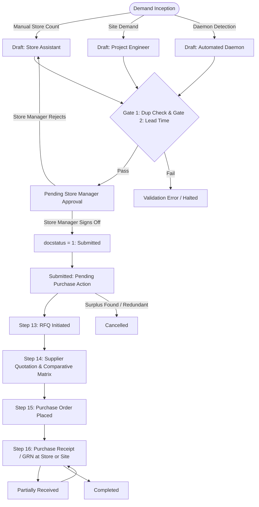

# STEP_12_STORE_MATERIAL_REQUEST_LOW_STOCK_SPECIFICATION.md

# Enterprise Lifecycle Step Specification: Store Material Request & Automated Low-Stock Monitoring

**Document ID:** `STEP-12-STORE-MATERIAL-REQUEST-LOW-STOCK`  
**Lifecycle Flow:** Flow 2: SCM, Store, Purchase & Vendor Procurement Lifecycle (Step 01 of 08 / Global Step 12)  
**Governing Architecture:** [`architect_docs/02_STEP_PLANNING_SPECIFICATION_BLUEPRINT.md`](../architect_docs/02_STEP_PLANNING_SPECIFICATION_BLUEPRINT.md)  
**Architecture Decision Record:** [`docs/decisions/ADR-012-STORE-MATERIAL-REQUEST-LOW-STOCK-MONITORING.md`](../docs/decisions/ADR-012-STORE-MATERIAL-REQUEST-LOW-STOCK-MONITORING.md)  
**PRD / FRS Traceability:** [`planning_ref_docs/01_PROJECT_FOUNDATION_MODEL.md`](../planning_ref_docs/01_PROJECT_FOUNDATION_MODEL.md) (`BC-12`), [`planning_ref_docs/05_BUSINESS_REQUIREMENTS_DOCUMENT.md`](../planning_ref_docs/05_BUSINESS_REQUIREMENTS_DOCUMENT.md) (`BR-012`, `BR-017`, `BR-018`), [`planning_ref_docs/06_FUNCTIONAL_REQUIREMENTS_SPECIFICATION.md`](../planning_ref_docs/06_FUNCTIONAL_REQUIREMENTS_SPECIFICATION.md) (`FR-012`, `FR-017`, `FR-018`), [`planning_ref_docs/08_DATABASE_DESIGN_DOCUMENT.md`](../planning_ref_docs/08_DATABASE_DESIGN_DOCUMENT.md) (`Domain 5: LOG`, `Domain 7: SCM`), [`planning_ref_docs/09_API_DESIGN_AND_INTEGRATIONS.md`](../planning_ref_docs/09_API_DESIGN_AND_INTEGRATIONS.md) (`API 10`), [`planning_ref_docs/10_UI_UX_SPECIFICATION.md`](../planning_ref_docs/10_UI_UX_SPECIFICATION.md) (`Screen 16`), [`planning_ref_docs/11_MODULE_FUNCTIONAL_DOCUMENTATION.md`](../planning_ref_docs/11_MODULE_FUNCTIONAL_DOCUMENTATION.md) (`MOD-12`)  
**Target Module:** `solar_module` / `manoj` (Extends ERPNext `tabMaterial Request`, `tabMaterial Request Item`, `tabItem`, `tabItem Reorder`, `tabBin`, and introduces `tabSolar Low Stock Incident Log`, `tabSolar Reorder Policy`)  
**Author:** Principal Enterprise Architect  
**Status:** Ready for Implementation

---

## 1. Step Scope, Objectives & Context Traceability

### 1.1 Lifecycle Positioning & Context

Step 12 (**Store Material Request & Automated Low-Stock Monitoring**) is the primary operational gateway and demand-generation engine for the **Solar EPC Procurement & Vendor Governance Lifecycle (Flow 2)**. It bridges engineering design demand originated in Flow 1 (Step 03: Survey Engineering Design Dynamic BOM) and warehouse inventory health with external sourcing in Step 13 (Supplier Request for Quotation — RFQ), Step 14 (Supplier Quotation Comparative Evaluation Matrix & Landed Cost), and Step 15 (Purchase Order Authorization).

```
┌──────────────────────────────────────────────────────────────────────────────────────────────────┐
│                                FLOW 2: SCM PROCUREMENT PIPELINE                                  │
├──────────────────────────────────────────────────────────────────────────────────────────────────┤
│                                                                                                  │
│   [Flow 1: Step 03 Survey Design BOM]        [Central & Regional Warehouse Bins (tabBin)]        │
│   (Frozen Project Line-Item Demands)         (Continuous Physical Consumption & Stock Depletion) │
│                 │                                                    │                           │
│                 └──────────────────────────┬─────────────────────────┘                           │
│                                            ▼                                                     │
│   ┌──────────────────────────────────────────────────────────────────────────────────────────┐   │
│   │            STEP 12: STORE MATERIAL REQUEST & LOW-STOCK MONITORING (FLOW 2: STEP 01)      │   │
│   ├──────────────────────────────────────────────────────────────────────────────────────────┤   │
│   │ 1. Dual Demand Triggers: Project BOM Indents (Channel A) vs Low-Stock Daemon (Channel B) │   │
│   │ 2. Pipeline Solvency: Projected Stock = Actual + Ordered + Indented - Reserved           │   │
│   │ 3. Economic Replenishment Sizing: Factor lead times, daily burn rate & pallet packaging  │   │
│   │ 4. Verification Gates: Duplicate check, Lead-time feasibility, BOM headroom netting      │   │
│   │ 5. SLA & Escalation: Tiered turnaround clocks (4h Emergency / 24h Project / 48h Routine) │   │
│   │ 6. Multi-Channel Alerts: WhatsApp & Email dispatches to Store & Purchase teams           │   │
│   └──────────────────────────────────────────────────────────────────────────────────────────┘   │
│                                            │                                                     │
│                                            ▼                                                     │
│   [Step 13: Supplier Request for Quotation (RFQ)] ──▶ Multi-vendor competitive dispatch          │
│                                            │                                                     │
│                                            ▼                                                     │
│   [Step 14: Supplier Quotation & Comparative Matrix] ──▶ Landed cost, terms & scoring evaluation │
│                                            │                                                     │
│                                            ▼                                                     │
│   [Step 15: Purchase Order Placement]             ──▶ Formal commercial award & release          │
│                                                                                                  │
└──────────────────────────────────────────────────────────────────────────────────────────────────┘
```

- **Predecessors:**
  - Flow 1: Step 03 Survey Engineering Design Dynamic BOM freeze ([`STEP_03`](./STEP_03_SURVEY_ENGINEERING_DESIGN_BOM_SPECIFICATION.md)).
  - Flow 1: Step 06 Sales Order Commercial Baseline release ([`STEP_06`](./STEP_06_SALES_ORDER_BASELINE_SPECIFICATION.md)).
  - Physical inventory drawdowns recorded via Stock Entries and Delivery Notes.
- **Successors:**
  - Step 13 Supplier Request for Quotation ([`STEP_13`](./STEP_13_SUPPLIER_RFQ_SPECIFICATION.md)).
  - Step 14 Supplier Quotation Comparative Evaluation Matrix ([`STEP_14`](./STEP_14_QUOTATION_COMPARISON_MATRIX_SPECIFICATION.md)).
  - Step 15 Purchase Order Authorization ([`STEP_15`](./STEP_15_PURCHASE_ORDER_AUTHORIZATION_SPECIFICATION.md)).

### 1.2 Core Business Objectives & Target KPIs

1. **0% Project Stalls Due to Stockouts:** Ensure critical solar installation items (cables, structure clamps, MC4 connectors, inverters) never hit zero balance during active site execution.
2. **Sub-24-Hour Requisition Turnaround:** Maintain an average turnaround time from Material Request submission to RFQ release under 24 hours (and under 4 hours for site emergency requisitions).
3. **100% Elimination of Unbudgeted Emergency Freight:** Eliminate expedited air-freight premiums and local retail surcharges through lead-time compliant replenishment schedules.
4. **Zero Duplicate Procurement:** Prevent overlapping purchase requisitions across identical SKUs and regional warehouses.
5. **Mathematically Grounded Replenishment:** Replace subjective manual guesses with true pipeline solvency calculations factoring in open POs, open MRs, project reservations, and supplier delivery lead times.

### 1.3 Context Traceability Matrix

| Requirement Ref | Source Document | Requirement Summary                                | Implementation in Step 12                                                                                                           |
| :-------------- | :-------------- | :------------------------------------------------- | :---------------------------------------------------------------------------------------------------------------------------------- |
| **`BR-012`**    | `05_BRD.md`     | Store Requisition & Low-Stock Alerts               | Extended `tabMaterial Request` with project links, urgency tiers, and automated multi-warehouse low-stock incident logging.         |
| **`BR-017`**    | `05_BRD.md`     | Task SLA / TAT Engine & Settings                   | Tiered countdown timers (4h Emergency, 24h Project, 48h Routine) with mandatory delay logging in `tabSolar Stage Delay Log`.        |
| **`BR-018`**    | `05_BRD.md`     | Multi-Tier Notification Engine                     | Automated multi-channel alerts (WhatsApp, Email, Desk) dispatched via `StoreNotificationBroker` targeting Store and Purchase teams. |
| **`FR-012`**    | `06_FRS.md`     | Store Requisition & Automated Low-Stock Monitoring | Screen controls, dual-trigger ingestion, project BOM headroom netting, and automated low-stock workbench.                           |
| **`FR-017`**    | `06_FRS.md`     | SLA Engine & Overdue Tracking                      | Automated Redis cron monitoring SLA deadlines, marking breaches as `Overdue`, and enforcing justification capture.                  |
| **`FR-018`**    | `06_FRS.md`     | Notification Matrix & Alert Toggles                | Dynamic recipient routing based on item urgency and Class-A asset classifications, governed by `tabSolar Notification Settings`.    |
| **`BC-12`**     | `01_PFM.md`     | SCM Store Demand Generation Capability             | Foundation business capability modeling store-to-purchase handshakes and inventory solvency tracking.                               |
| **`MOD-12`**    | `11_MOD.md`     | Module Functional SOP for Stores & SCM             | Step-by-step standard operating procedures for warehouse storekeepers, purchase assistants, and inventory managers.                 |

### 1.4 Failure Modes Eliminated

- **Informal "WhatsApp Requisitions":** Unrecorded, ad-hoc requisitions via phone or chat leading to unverified purchasing, untracked budgets, and lost financial accountability.
- **Naive Stock Count Errors:** Re-ordering materials that are already in transit via open Purchase Orders, or failing to re-order because on-hand stock is blindly counted without deducting active project reservations.
- **Class-A Asset Freight Chaos:** Requisitioning solar modules and string inverters without standard pallet packaging unit rounding (e.g. ordering 38 modules instead of full pallets of 36), resulting in transit breakage and freight penalties.
- **Unfeasible Emergency Requisitions:** Requesting custom mounting structures with 2-day delivery when supplier fabrication lead time is 14 days, creating vendor disputes and project blame shifts.
- **Requisition Silos & Queue Stagnation:** Material Requests sitting indefinitely in unassigned procurement inboxes without automated escalation or management visibility.

---

## 2. Stakeholders, Enterprise Actors & HRMS Role Mapping

### 2.1 Enterprise User Roles Matrix

In strict compliance with the **Zero "User" Suffix Rule** ([`step_plans/README.md#5-enterprise-persona--role-naming-standard-zero-user-suffix-rule`](./README.md#5-enterprise-persona--role-naming-standard-zero-user-suffix-rule)), all operational personas are designated by descriptive functional enterprise titles:

| Persona / Business Actor          | Frappe System Role                     | HRMS Department        | HRMS Designation              | Operational Responsibilities                                                                                                                        |
| :-------------------------------- | :------------------------------------- | :--------------------- | :---------------------------- | :-------------------------------------------------------------------------------------------------------------------------------------------------- |
| **Warehouse Storekeeper**         | `Store Assistant`                      | Store & Logistics      | `Store Assistant`             | Performs bin stock counts, drafts manual project-linked Material Requests, verifies physically received stock, monitors bin safety levels.          |
| **Inventory & Logistics Head**    | `Store Manager`                        | Store & Logistics      | `Warehouse Manager`           | Reviews and approves drafted Material Requests, authorizes warehouse-to-warehouse transfers, manages reorder policies, monitors incident logs.      |
| **Procurement Line Executive**    | `Purchase Assistant`                   | Purchase & SCM         | `Purchase Executive`          | Ingests approved Material Requests, drafts Supplier RFQs (Step 13), collects supplier quotes, prepares comparative sheets (Step 14).                |
| **Head of Procurement**           | `Purchase Manager`                     | Purchase & SCM         | `Purchase Manager`            | Authorizes procurement requisitions, releases RFQs, approves single-source exceptions, signs off on high-value emergency purchases.                 |
| **Site Technical Requisitioner**  | `Project Engineer` / `Site Supervisor` | Engineering Operations | `Field Engineer / Supervisor` | Initiates site-specific material demands against approved Survey Engineering Design BOMs during active installation.                                |
| **Solar EPC Director / Admin**    | `Admin`                                | Executive Management   | `Managing Director`           | Project supreme operational command; configures `Solar SLA Settings`, `Solar Notification Settings`, approves SLA overrides and emergency policies. |
| **Framework Supreme / Developer** | `System Manager`                       | Information Technology | `DevOps Engineer / Architect` | Technical framework administration, DocType schemas, Python source code, bench migrations, Redis worker sizing. Supreme over `Admin`.               |

### 2.2 Permission Hierarchy Matrix

| DocType / Action                  | Store Assistant | Store Manager  | Purchase Assistant | Purchase Manager | Project Engineer |    Admin\*    | System Manager |
| :-------------------------------- | :-------------: | :------------: | :----------------: | :--------------: | :--------------: | :-----------: | :------------: |
| **Material Request (Read)**       |   Own / Store   | All Warehouses |     All Active     |    All Active    |   Own Project    |  All Records  |  All Records   |
| **Material Request (Create)**     |   Yes (Draft)   |      Yes       |         No         | Yes (Emergency)  |   Yes (Draft)    |      Yes      |      Yes       |
| **Material Request (Write/Edit)** |   Own (Draft)   |   All Drafts   |         No         |    All Drafts    |   Own (Draft)    |  All Records  |  All Records   |
| **Material Request (Submit)**     |       No        |      Yes       |         No         |       Yes        |        No        |      Yes      |      Yes       |
| **Material Request (Cancel)**     |       No        |      Yes       |         No         |       Yes        |        No        |      Yes      |      Yes       |
| **Solar Low Stock Incident Log**  |    Read Only    |  Read / Clear  |     Read Only      |  Read / Action   |    No Access     |  Full Access  |  Full Access   |
| **Solar Reorder Policy**          |    Read Only    | Read / Propose |     Read Only      |  Read / Update   |    Read Only     | Manage Policy |  Full Access   |
| **Solar Stage Delay Log**         |    Write Own    |   Write Own    |     Write Own      |   Full Access    |    Write Own     |  Full Access  |  Full Access   |
| **Solar SLA Settings**            |       No        |       No       |         No         |        No        |        No        |  Manage Only  |  Full Access   |

_\*Note: Frappe `Administrator` and `System Manager` sit at the apex of system hierarchy and inherit all operational permissions plus technical code/schema access._

---

## 3. Relational Schema & 3NF Data Dictionary

### 3.1 Core DocType Extensions: `tabMaterial Request`

The standard ERPNext `Material Request` DocType is extended via fixtures with custom fields isolated under the `custom_*` prefix, fully indexed, and normalized to 3NF:

| Fieldname                  | Label                         | Fieldtype    | Options / Target                                                                                                                                                             | Mandatory |    Index     | Description & Validation Rules                                                                 |
| :------------------------- | :---------------------------- | :----------- | :--------------------------------------------------------------------------------------------------------------------------------------------------------------------------- | :-------: | :----------: | :--------------------------------------------------------------------------------------------- |
| `custom_project_reference` | Solar Project Reference       | `Link`       | `Project`                                                                                                                                                                    |    No     | **Index: 1** | Foreign key linking the specific Solar EPC installation project.                               |
| `custom_sales_order`       | Sales Order Reference         | `Link`       | `Sales Order`                                                                                                                                                                |    No     | **Index: 1** | Commercial baseline anchor for project-linked procurement.                                     |
| `custom_urgency_level`     | Requisition Urgency           | `Select`     | `Routine\nUrgent\nCritical Breakdown`                                                                                                                                        |  **Yes**  | **Index: 1** | Governs SLA countdown duration (Routine: 48h, Urgent: 24h, Breakdown: 4h). Default: `Routine`. |
| `custom_trigger_source`    | Requisition Trigger Source    | `Select`     | `Manual Store Indent\nAutomated Low-Stock Daemon\nSite Engineer Demand`                                                                                                      |  **Yes**  | **Index: 1** | Inception provenance of the requisition.                                                       |
| `custom_workflow_status`   | Solar Workflow Status         | `Select`     | `Draft\nPending Store Manager Approval\nSubmitted (Pending Purchase Action)\nRFQ Initiated\nQuote Comparative Approved\nPO Placed\nPartially Received\nCompleted\nCancelled` |  **Yes**  | **Index: 1** | Granular lifecycle state machine tracking.                                                     |
| `custom_sla_deadline`      | SLA Resolution Deadline       | `Datetime`   | -                                                                                                                                                                            |    No     | **Index: 1** | Computed timestamp when purchase action must be initiated.                                     |
| `custom_sla_status`        | SLA Compliance Status         | `Select`     | `Within SLA\nGrace Period\nOverdue`                                                                                                                                          |  **Yes**  | **Index: 1** | Updated dynamically by background monitoring daemon.                                           |
| `custom_delay_reason`      | SLA Delay Reason              | `Small Text` | -                                                                                                                                                                            |    No     |      -       | Mandatory explanation if document status transitions while `Overdue`.                          |
| `custom_delay_approved_by` | Delay Approved By             | `Link`       | `User`                                                                                                                                                                       |    No     |      -       | Managerial sign-off (`Purchase Manager` or `Admin`) for overdue requisitions.                  |
| `custom_is_class_a_solar`  | Contains Class-A Solar Assets | `Check`      | -                                                                                                                                                                            |    No     |      -       | Automatically set to `1` if any line item is a PV Module, Inverter, or HT Cable.               |

### 3.2 Core DocType Extensions: `tabMaterial Request Item`

| Fieldname                    | Label                        | Fieldtype | Options / Target | Mandatory | Description & Validation Rules                                          |
| :--------------------------- | :--------------------------- | :-------- | :--------------- | :-------: | :---------------------------------------------------------------------- |
| `custom_lead_time_days`      | Supplier Lead Time (Days)    | `Int`     | -                |  **Yes**  | Pulled from Item master or default supplier; validates `schedule_date`. |
| `custom_current_stock_qty`   | Current Warehouse Stock      | `Float`   | -                |    No     | Snapshotted ledger balance (`actual_qty`) at requisition creation.      |
| `custom_projected_stock_qty` | Projected Warehouse Stock    | `Float`   | -                |    No     | Calculated pipeline solvency at requisition creation.                   |
| `custom_safety_stock_level`  | Safety Stock Threshold       | `Float`   | -                |    No     | Static minimum threshold defined in `tabItem Reorder`.                  |
| `custom_reorder_level`       | Reorder Trigger Point        | `Float`   | -                |    No     | Dynamic reorder point triggering automated daemon generation.           |
| `custom_allocated_project`   | Specific Project Allocation  | `Link`    | `Project`        |    No     | Line-item project attribution for multi-project consolidated indents.   |
| `custom_bom_remaining_qty`   | Unissued Project BOM Balance | `Float`   | -                |    No     | Remaining headroom in Survey Engineering Design BOM (`STEP_03`).        |

### 3.3 Standalone Custom DocType: `tabSolar Low Stock Incident Log`

- **DocType Name:** `Solar Low Stock Incident Log`
- **Module:** `solar_module`
- **Naming Series:** `SLS-INC-.YYYY.-.#####`
- **Is Submittable:** `0` (Mutable audit log with status updates)
- **Engine:** InnoDB, UTF-8mb4

| Fieldname                    | Label                     | Fieldtype  | Options / Target                                            | Mandatory |    Index     | Description                                                   |
| :--------------------------- | :------------------------ | :--------- | :---------------------------------------------------------- | :-------: | :----------: | :------------------------------------------------------------ |
| `naming_series`              | Series                    | `Select`   | `SLS-INC-.YYYY.-.#####`                                     |  **Yes**  |      -       | Primary naming series.                                        |
| `item_code`                  | Item Code                 | `Link`     | `Item`                                                      |  **Yes**  | **Index: 1** | Solar SKU breaching inventory threshold.                      |
| `item_name`                  | Item Name                 | `Data`     | -                                                           |    No     |      -       | Denormalized item title for fast search.                      |
| `item_group`                 | Item Group                | `Link`     | `Item Group`                                                |  **Yes**  | **Index: 1** | e.g. Solar Modules, Inverters, DC Cables, Mounting Structure. |
| `warehouse`                  | Warehouse                 | `Link`     | `Warehouse`                                                 |  **Yes**  | **Index: 1** | Warehouse location where breach occurred.                     |
| `incident_datetime`          | Breach Timestamp          | `Datetime` | -                                                           |  **Yes**  | **Index: 1** | Exact system timestamp of low-stock detection.                |
| `actual_qty`                 | Actual Ledger Stock       | `Float`    | -                                                           |  **Yes**  |      -       | On-hand quantity at breach moment.                            |
| `projected_qty`              | Projected Pipeline Stock  | `Float`    | -                                                           |  **Yes**  |      -       | True pipeline availability at breach moment.                  |
| `reorder_level`              | Configured Reorder Level  | `Float`    | -                                                           |  **Yes**  |      -       | Reorder threshold configured in `tabItem Reorder`.            |
| `recommended_reorder_qty`    | Recommended Replenishment | `Float`    | -                                                           |  **Yes**  |      -       | Computed economic replenishment quantity.                     |
| `generated_material_request` | Generated Requisition     | `Link`     | `Material Request`                                          |    No     | **Index: 1** | Programmatically spawned draft MR reference.                  |
| `incident_status`            | Status                    | `Select`   | `Logged\nMR Generated\nIgnored / Buffer Adjusted\nResolved` |  **Yes**  | **Index: 1** | Audit lifecycle status. Default: `Logged`.                    |
| `actioned_by`                | Actioned By               | `Link`     | `User`                                                      |    No     |      -       | Store Manager or Purchase Assistant resolving incident.       |
| `actioned_on`                | Actioned On               | `Datetime` | -                                                           |    No     |      -       | Timestamp of resolution.                                      |

### 3.4 Standalone Custom DocType: `tabSolar Reorder Policy`

- **DocType Name:** `Solar Reorder Policy`
- **Module:** `solar_module`
- **Naming Series:** `SRP-.YYYY.-.#####`
- **Is Submittable:** `0`

| Fieldname                 | Label                      | Fieldtype  | Options / Target | Mandatory |    Index     | Description                                                    |
| :------------------------ | :------------------------- | :--------- | :--------------- | :-------: | :----------: | :------------------------------------------------------------- |
| `policy_name`             | Policy Name                | `Data`     | -                |  **Yes**  | **Index: 1** | Descriptive title (e.g. "Central Warehouse PV Module Policy"). |
| `warehouse`               | Target Warehouse           | `Link`     | `Warehouse`      |  **Yes**  | **Index: 1** | Warehouse scope.                                               |
| `item_group`              | Target Item Group          | `Link`     | `Item Group`     |  **Yes**  | **Index: 1** | Category scope.                                                |
| `lead_time_buffer_days`   | Safety Lead Time Buffer    | `Int`      | -                |  **Yes**  |      -       | Additional buffer days added to supplier lead time.            |
| `pallet_packing_multiple` | Pallet Packaging Multiple  | `Int`      | -                |    No     |      -       | Packaging multiple (e.g. 36 for solar panels). Default: 1.     |
| `min_order_value_inr`     | Minimum Order Value (₹)    | `Currency` | -                |    No     |      -       | Minimum vendor economic order value.                           |
| `auto_generate_draft_mr`  | Auto-Generate Draft MR?    | `Check`    | -                |    No     |      -       | If checked, background daemon generates Draft MR directly.     |
| `escalate_to_admin`       | Escalate Class-A to Admin? | `Check`    | -                |    No     |      -       | If checked, alerts Admin upon low-stock detection.             |

---

## 4. State Machine, Verification Gates & SLA Engine

### 4.1 Requisition Lifecycle State Machine



### 4.2 Enforced Verification Stage-Gates

#### Gate 1: Duplicate Open Requisition Prevention Gate

- **Execution Hook:** `MaterialRequest.validate()`
- **Condition:** For every item in `doc.items`, query `tabMaterial Request Item` joined with `tabMaterial Request` where:
  - `item_code = row.item_code`
  - `warehouse = row.warehouse`
  - `docstatus = 1` (Submitted)
  - `custom_workflow_status NOT IN ('Completed', 'Cancelled')`
  - `name != doc.name`
- **Rule:** If an active unfulfilled requisition exists, submission is hard-blocked:
  $$\text{Raise } \texttt{DuplicateRequisitionError} \text{ with existing MR reference, item, and target warehouse.}$$
- **Override:** Allowed only if `custom_urgency_level = 'Critical Breakdown'` with mandatory explanation recorded in `custom_delay_reason`.

#### Gate 2: Lead-Time Feasibility & Schedule Date Gate

- **Execution Hook:** `MaterialRequest.validate()`
- **Condition:** For every line item, verify that:
  $$\text{row.schedule\_date} \ge \text{today()} + \text{row.custom\_lead\_time\_days}$$
- **Rule:** Requisitions requesting delivery faster than the supplier's verified physical manufacturing/transport lead time are rejected to prevent unfeasible commitments.
- **Override:** Expedited delivery dates are accepted only when authorized by `Purchase Manager` or `Admin`, automatically tagging the requisition as `Urgent` or `Critical Breakdown`.

#### Gate 3: Project BOM Headroom Netting Gate

- **Execution Hook:** `MaterialRequest.validate()`
- **Condition:** When `custom_project_reference` is set:
  1. Retrieve the approved Survey Engineering Design BOM (`STEP_03`) for the project.
  2. Compute total authorized BOM quantity for the SKU ($\text{BOM\_Qty}$).
  3. Query total quantity already issued to site via Delivery Notes ($\text{Issued\_Qty}$) plus total quantity on existing open submitted Material Requests ($\text{Open\_MR\_Qty}$).
  4. Assert:
     $$\text{row.qty} \le \text{BOM\_Qty} - \text{Issued\_Qty} - \text{Open\_MR\_Qty}$$
- **Rule:** Prevents site supervisors or storekeepers from requisitioning materials exceeding engineering design allocations without an approved Engineering Change Order (ECO).

#### Gate 4: Closed-Loop Downstream Procurement Traceability Gate

- **Execution Hook:** Step 13, 14, and 15 linkages.
- **Rule:** An approved `Material Request` cannot be bypassed. Downstream `Request for Quotation` (Step 13) and `Purchase Order` (Step 15) must carry the foreign key link `custom_material_request_ref`. Requisition line fulfillment percentages update automatically upon Purchase Receipt (Step 16) completion.

### 4.3 Tiered Turnaround SLA & Escalation Engine

SLA countdown durations are customized dynamically by `Admin` in `tabSolar SLA Settings` and enforced via scheduled Redis background workers running every 15 minutes (`solar_module.tasks.recompute_enterprise_slas`):

| Requisition Urgency Level        | Target SLA Duration | Primary Assigned Role | Escalation Role (T-Breach)   | Breach Consequence                                                      |
| :------------------------------- | :-----------------: | :-------------------- | :--------------------------- | :---------------------------------------------------------------------- |
| **Critical Breakdown**           |     **4 Hours**     | `Purchase Assistant`  | `Purchase Manager` & `Admin` | Urgent WhatsApp to Director; auto-sets `custom_sla_status = 'Overdue'`. |
| **Urgent (Project Milestone)**   |    **24 Hours**     | `Purchase Assistant`  | `Purchase Manager`           | Alert to Purchase Manager; requires delay log entry.                    |
| **Routine Buffer Replenishment** |    **48 Hours**     | `Purchase Assistant`  | `Store Manager`              | Queue highlight; daily digest report flag.                              |

- **Mandatory Delay Audit Protocol:** When `custom_sla_status = 'Overdue'`, any document edit or subsequent workflow state transition is hard-blocked until a valid explanation is appended to `tabSolar Stage Delay Log` (`tabRemark-Delay Log`) with authorized sign-off.

---

## 5. Controller Logic, Domain Services & Whitelisted APIs

### 5.1 Decoupled Domain Service Architecture

```
solar_module/
├── services/
│   └── store/
│       ├── __init__.py
│       ├── requisition_service.py      # StoreRequisitionService (Validations, Gates 1-3)
│       ├── reorder_service.py          # ReorderCalculationService (Math & Sizing)
│       └── notification_broker.py      # StoreNotificationBroker (WhatsApp & Email)
├── tasks/
│   └── low_stock_daemon.py             # LowStockMonitoringDaemon (Cron runner)
└── api/
    └── store.py                        # Whitelisted REST/RPC Endpoints
```

### 5.2 Domain Services Implementation

#### `ReorderCalculationService` (`solar_module/services/store/reorder_service.py`)

```python
# Copyright (c) 2026, Sadbhav Solar and contributors
# For license information, please see license.txt

import math
import frappe
from frappe.utils import flt, cint

class ReorderCalculationService:
	"""
	Domain service calculating true pipeline solvency, projected stock,
	and dynamic replenishment quantities for warehouse items.
	"""

	@staticmethod
	def calculate_projected_stock(item_code: str, warehouse: str) -> dict:
		"""
		Calculates true pipeline solvency:
		Projected Stock = Actual + Ordered + Indented - Reserved
		"""
		bin_data = frappe.db.get_value(
			"Bin",
			{"item_code": item_code, "warehouse": warehouse},
			["actual_qty", "ordered_qty", "indented_qty", "reserved_qty"],
			as_dict=True,
		) or {
			"actual_qty": 0.0,
			"ordered_qty": 0.0,
			"indented_qty": 0.0,
			"reserved_qty": 0.0,
		}

		actual = flt(bin_data.get("actual_qty", 0.0))
		ordered = flt(bin_data.get("ordered_qty", 0.0))
		indented = flt(bin_data.get("indented_qty", 0.0))
		reserved = flt(bin_data.get("reserved_qty", 0.0))

		projected = actual + ordered + indented - reserved

		return {
			"actual_qty": actual,
			"ordered_qty": ordered,
			"indented_qty": indented,
			"reserved_qty": reserved,
			"projected_stock": projected,
		}

	@staticmethod
	def compute_replenishment_quantity(
		item_code: str,
		warehouse: str,
		projected_stock: float,
		reorder_level: float,
		reorder_qty: float,
		pallet_multiple: int = 1,
	) -> float:
		"""
		Computes recommended replenishment quantity factoring in safety deficit,
		average lead time burn rate, and pallet packaging units.
		"""
		if projected_stock > reorder_level:
			return 0.0

		deficit = reorder_level - projected_stock
		target_qty = max(flt(reorder_qty), deficit)

		if pallet_multiple and pallet_multiple > 1:
			# Round up to nearest full pallet packaging multiple
			target_qty = math.ceil(target_qty / pallet_multiple) * pallet_multiple

		return flt(target_qty)
```

#### `StoreRequisitionService` (`solar_module/services/store/requisition_service.py`)

```python
# Copyright (c) 2026, Sadbhav Solar and contributors
# For license information, please see license.txt

import frappe
from frappe import _
from frappe.utils import getdate, add_days, now_datetime
from solar_module.exceptions import DuplicateRequisitionError, LeadTimeFeasibilityError, BOMHeadroomExceededError

class StoreRequisitionService:
	"""
	Domain service executing validation gates, duplicate checks,
	and project BOM headroom netting on Material Requests.
	"""

	def __init__(self, doc):
		self.doc = doc

	def validate_all_gates(self):
		"""Executes validation gates before saving or submitting."""
		self.validate_duplicate_open_indents()
		self.validate_lead_time_feasibility()
		if self.doc.custom_project_reference:
			self.validate_project_bom_headroom()
		self.evaluate_class_a_solar_assets()
		self.calculate_sla_deadline()

	def validate_duplicate_open_indents(self):
		"""Gate 1: Prevents duplicate open MRs for identical item/warehouse."""
		if self.doc.custom_urgency_level == "Critical Breakdown":
			return  # Emergency breakdown bypass permitted

		for item in self.doc.items:
			duplicate = frappe.db.sql(
				"""
				SELECT mr.name, mr.custom_workflow_status
				FROM `tabMaterial Request Item` mri
				JOIN `tabMaterial Request` mr ON mr.name = mri.parent
				WHERE mri.item_code = %s
				  AND mri.warehouse = %s
				  AND mr.docstatus = 1
				  AND mr.name != %s
				  AND mr.custom_workflow_status NOT IN ('Completed', 'Cancelled')
				LIMIT 1
				""",
				(item.item_code, item.warehouse, self.doc.name or "New"),
				as_dict=True,
			)
			if duplicate:
				frappe.throw(
					_(
						"An active unfulfilled Material Request {0} already exists for Item {1} at Warehouse {2}. "
						"Duplicate requisition rejected."
					).format(duplicate[0].name, item.item_code, item.warehouse),
					DuplicateRequisitionError,
				)

	def validate_lead_time_feasibility(self):
		"""Gate 2: Enforces schedule_date >= today + lead_time_days."""
		today = getdate()
		for item in self.doc.items:
			lead_time = cint(item.custom_lead_time_days or frappe.db.get_value("Item", item.item_code, "lead_time_days") or 0)
			min_feasible_date = add_days(today, lead_time)

			if getdate(item.schedule_date) < min_feasible_date and self.doc.custom_urgency_level != "Critical Breakdown":
				frappe.throw(
					_(
						"Item {0} requires {1} lead time days. The earliest feasible delivery date is {2}. "
						"Requested date {3} is rejected unless marked Critical Breakdown with managerial approval."
					).format(item.item_code, lead_time, min_feasible_date, item.schedule_date),
					LeadTimeFeasibilityError,
				)

	def validate_project_bom_headroom(self):
		"""Gate 3: Asserts requested quantity <= remaining unissued project BOM balance."""
		project = self.doc.custom_project_reference
		for item in self.doc.items:
			bom_qty = flt(
				frappe.db.sql(
					"""
					SELECT sum(qty) FROM `tabSurvey Engineering Design BOM Item`
					WHERE parent = (
						SELECT name FROM `tabSurvey Engineering Design`
						WHERE project = %s AND docstatus = 1 LIMIT 1
					) AND item_code = %s
					""",
					(project, item.item_code),
				)[0][0] or 0.0
			)

			if bom_qty == 0.0:
				continue  # Not explicitly in engineering BOM (e.g. general consumable)

			issued_qty = flt(
				frappe.db.sql(
					"""
					SELECT sum(dni.qty) FROM `tabDelivery Note Item` dni
					JOIN `tabDelivery Note` dn ON dn.name = dni.parent
					WHERE dn.project = %s AND dni.item_code = %s AND dn.docstatus = 1
					""",
					(project, item.item_code),
				)[0][0] or 0.0
			)

			open_mr_qty = flt(
				frappe.db.sql(
					"""
					SELECT sum(mri.qty) FROM `tabMaterial Request Item` mri
					JOIN `tabMaterial Request` mr ON mr.name = mri.parent
					WHERE mr.custom_project_reference = %s
					  AND mri.item_code = %s
					  AND mr.docstatus = 1
					  AND mr.name != %s
					  AND mr.custom_workflow_status NOT IN ('Completed', 'Cancelled')
					""",
					(project, item.item_code, self.doc.name or "New"),
				)[0][0] or 0.0
			)

			remaining_headroom = bom_qty - issued_qty - open_mr_qty
			item.custom_bom_remaining_qty = remaining_headroom

			if flt(item.qty) > remaining_headroom:
				frappe.throw(
					_(
						"Requested quantity {0} for Item {1} exceeds remaining project BOM headroom of {2} "
						"(Authorized BOM: {3}, Already Issued: {4}, Open Requisitions: {5})."
					).format(item.qty, item.item_code, remaining_headroom, bom_qty, issued_qty, open_mr_qty),
					BOMHeadroomExceededError,
				)

	def evaluate_class_a_solar_assets(self):
		"""Flags Class-A solar equipment (PV Modules, Inverters, HT Cables)."""
		class_a_groups = ["Solar PV Module", "Solar Inverter", "HT Cable"]
		is_class_a = False
		for item in self.doc.items:
			group = frappe.db.get_value("Item", item.item_code, "item_group")
			if group in class_a_groups:
				is_class_a = True
				break
		self.doc.custom_is_class_a_solar = 1 if is_class_a else 0

	def calculate_sla_deadline(self):
		"""Computes countdown deadline based on urgency level."""
		hours_map = {
			"Critical Breakdown": 4,
			"Urgent": 24,
			"Routine": 48,
		}
		duration_hours = hours_map.get(self.doc.custom_urgency_level, 48)
		# Allow override from Solar SLA Settings if configured
		admin_sla = frappe.db.get_value("Solar SLA Settings", None, f"mr_sla_{self.doc.custom_urgency_level.lower()}_hours")
		if admin_sla:
			duration_hours = cint(admin_sla)

		if not self.doc.custom_sla_deadline or self.doc.is_new():
			self.doc.custom_sla_deadline = frappe.utils.add_to_date(now_datetime(), hours=duration_hours)
			self.doc.custom_sla_status = "Within SLA"
```

#### `LowStockMonitoringDaemon` (`solar_module/tasks/low_stock_daemon.py`)

```python
# Copyright (c) 2026, Sadbhav Solar and contributors
# For license information, please see license.txt

import frappe
from frappe.utils import now_datetime
from solar_module.services.store.reorder_service import ReorderCalculationService
from solar_module.services.store.notification_broker import StoreNotificationBroker

def monitor_low_stock_scheduled_task():
	"""
	Cron task executed via RQ default background queue.
	Scans all warehouse bins configured with reorder rules,
	evaluates true pipeline solvency, logs incidents, and auto-generates draft MRs.
	"""
	daemon = LowStockMonitoringDaemon()
	daemon.execute_scan()

class LowStockMonitoringDaemon:

	def execute_scan(self):
		"""Scans tabItem Reorder against live tabBin pipeline solvency."""
		reorder_rules = frappe.db.sql(
			"""
			SELECT ir.parent as item_code, ir.warehouse, ir.warehouse_reorder_level,
			       ir.warehouse_reorder_qty, i.item_name, i.item_group
			FROM `tabItem Reorder` ir
			JOIN `tabItem` i ON i.name = ir.parent
			WHERE i.disabled = 0
			""",
			as_dict=True,
		)

		for rule in reorder_rules:
			solvency = ReorderCalculationService.calculate_projected_stock(rule.item_code, rule.warehouse)
			projected = solvency["projected_stock"]
			reorder_lvl = rule.warehouse_reorder_level

			if projected <= reorder_lvl:
				self.handle_low_stock_incident(rule, solvency)

	def handle_low_stock_incident(self, rule, solvency):
		"""Processes threshold breach, avoids duplicate incidents, spawns MR and alerts."""
		# Check if an unresolved incident already exists within past 24 hours
		recent_incident = frappe.db.exists(
			"Solar Low Stock Incident Log",
			{
				"item_code": rule.item_code,
				"warehouse": rule.warehouse,
				"incident_status": ["in", ["Logged", "MR Generated"]],
			},
		)
		if recent_incident:
			return  # Avoid flooding incidents for same active condition

		# Check policy for pallet multiples and auto MR generation
		policy = frappe.db.get_value(
			"Solar Reorder Policy",
			{"warehouse": rule.warehouse, "item_group": rule.item_group},
			["pallet_packing_multiple", "auto_generate_draft_mr", "escalate_to_admin"],
			as_dict=True,
		) or {"pallet_packing_multiple": 1, "auto_generate_draft_mr": 1, "escalate_to_admin": 0}

		recommended_qty = ReorderCalculationService.compute_replenishment_quantity(
			rule.item_code,
			rule.warehouse,
			solvency["projected_stock"],
			rule.warehouse_reorder_level,
			rule.warehouse_reorder_qty,
			policy.get("pallet_packing_multiple", 1),
		)

		# Log the incident
		incident = frappe.get_doc({
			"doctype": "Solar Low Stock Incident Log",
			"item_code": rule.item_code,
			"item_name": rule.item_name,
			"item_group": rule.item_group,
			"warehouse": rule.warehouse,
			"incident_datetime": now_datetime(),
			"actual_qty": solvency["actual_qty"],
			"projected_qty": solvency["projected_stock"],
			"reorder_level": rule.warehouse_reorder_level,
			"recommended_reorder_qty": recommended_qty,
			"incident_status": "Logged",
		})
		incident.insert(ignore_permissions=True)

		# Auto-generate draft Material Request if policy permits
		mr_name = None
		if policy.get("auto_generate_draft_mr"):
			mr_doc = self.create_draft_material_request(rule, recommended_qty)
			mr_name = mr_doc.name
			incident.generated_material_request = mr_name
			incident.incident_status = "MR Generated"
			incident.save(ignore_permissions=True)

		# Dispatch notifications
		StoreNotificationBroker.dispatch_low_stock_alert(
			item_code=rule.item_code,
			item_name=rule.item_name,
			warehouse=rule.warehouse,
			actual_qty=solvency["actual_qty"],
			projected_qty=solvency["projected_stock"],
			reorder_level=rule.warehouse_reorder_level,
			mr_name=mr_name,
			escalate_to_admin=bool(policy.get("escalate_to_admin")),
		)

	def create_draft_material_request(self, rule, qty):
		"""Creates a draft Material Request in Purchase mode."""
		lead_time = frappe.db.get_value("Item", rule.item_code, "lead_time_days") or 7
		schedule_date = frappe.utils.add_days(frappe.utils.nowdate(), lead_time)

		mr = frappe.get_doc({
			"doctype": "Material Request",
			"material_request_type": "Purchase",
			"custom_trigger_source": "Automated Low-Stock Daemon",
			"custom_urgency_level": "Routine",
			"custom_workflow_status": "Draft",
			"items": [
				{
					"item_code": rule.item_code,
					"warehouse": rule.warehouse,
					"qty": qty,
					"schedule_date": schedule_date,
					"custom_lead_time_days": lead_time,
				}
			],
		})
		mr.insert(ignore_permissions=True)
		return mr
```

### 5.3 Whitelisted REST APIs (`solar_module/api/store.py`)

```python
# Copyright (c) 2026, Sadbhav Solar and contributors
# For license information, please see license.txt

import frappe
from frappe import _
from solar_module.services.store.reorder_service import ReorderCalculationService

@frappe.whitelist(methods=["POST"])
def create_material_request(payload: dict) -> dict:
	"""
	Whitelisted API to create and optionally submit a Store Material Request.
	Enforces role-based permissions and IDOR validation.
	"""
	if not frappe.has_permission("Material Request", "create"):
		frappe.throw(_("Not permitted to create Material Requests"), frappe.PermissionError)

	doc = frappe.get_doc({
		"doctype": "Material Request",
		"material_request_type": payload.get("material_request_type", "Purchase"),
		"custom_project_reference": payload.get("project"),
		"custom_sales_order": payload.get("sales_order"),
		"custom_urgency_level": payload.get("urgency_level", "Routine"),
		"custom_trigger_source": payload.get("trigger_source", "Manual Store Indent"),
		"items": payload.get("items", []),
	})
	doc.insert()

	if payload.get("submit_immediately"):
		if not frappe.has_permission("Material Request", "submit"):
			frappe.throw(_("Not permitted to submit Material Requests"), frappe.PermissionError)
		doc.submit()

	return {
		"status": "success",
		"name": doc.name,
		"docstatus": doc.docstatus,
		"custom_workflow_status": doc.custom_workflow_status,
		"sla_deadline": doc.custom_sla_deadline,
	}

@frappe.whitelist(methods=["GET"])
def get_low_stock_workbench_data(warehouse: str = None, item_group: str = None) -> list:
	"""
	Fast batch-query endpoint powering the Vue 3 / Frappe UI Low-Stock Workbench.
	Returns SKUs approaching or below safety stock.
	"""
	if not (frappe.has_role("Store Assistant") or frappe.has_role("Store Manager") or frappe.has_role("Purchase Assistant") or frappe.has_role("Admin")):
		frappe.throw(_("Unauthorized view"), frappe.PermissionError)

	conditions = ["i.disabled = 0"]
	values = {}

	if warehouse:
		conditions.append("ir.warehouse = %(warehouse)s")
		values["warehouse"] = warehouse
	if item_group:
		conditions.append("i.item_group = %(item_group)s")
		values["item_group"] = item_group

	where_clause = " AND ".join(conditions)

	items = frappe.db.sql(
		f"""
		SELECT ir.parent as item_code, i.item_name, i.item_group, ir.warehouse,
		       ir.warehouse_reorder_level, ir.warehouse_reorder_qty,
		       COALESCE(b.actual_qty, 0) as actual_qty,
		       COALESCE(b.ordered_qty, 0) as ordered_qty,
		       COALESCE(b.indented_qty, 0) as indented_qty,
		       COALESCE(b.reserved_qty, 0) as reserved_qty
		FROM `tabItem Reorder` ir
		JOIN `tabItem` i ON i.name = ir.parent
		LEFT JOIN `tabBin` b ON b.item_code = ir.parent AND b.warehouse = ir.warehouse
		WHERE {where_clause}
		""",
		values,
		as_dict=True,
	)

	result = []
	for itm in items:
		projected = itm.actual_qty + itm.ordered_qty + itm.indented_qty - itm.reserved_qty
		if projected <= itm.warehouse_reorder_level:
			itm["projected_stock"] = projected
			itm["status"] = "Critical Stockout" if projected <= 0 else "Below Reorder Level"
			result.append(itm)

	return result

@frappe.whitelist(methods=["POST"])
def batch_generate_reorder_mrs(item_warehouse_pairs: list) -> dict:
	"""
	Batch generates draft Material Requests from selected workbench items.
	"""
	if not (frappe.has_role("Store Manager") or frappe.has_role("Purchase Manager") or frappe.has_role("Admin")):
		frappe.throw(_("Unauthorized batch generation"), frappe.PermissionError)

	created_mrs = []
	for pair in item_warehouse_pairs:
		item_code = pair.get("item_code")
		warehouse = pair.get("warehouse")
		qty = pair.get("qty")

		mr = frappe.get_doc({
			"doctype": "Material Request",
			"material_request_type": "Purchase",
			"custom_trigger_source": "Manual Store Indent",
			"custom_urgency_level": "Routine",
			"items": [
				{
					"item_code": item_code,
					"warehouse": warehouse,
					"qty": qty,
					"schedule_date": frappe.utils.add_days(frappe.utils.nowdate(), 7),
				}
			],
		})
		mr.insert()
		created_mrs.append(mr.name)

	return {"status": "success", "created_material_requests": created_mrs}
```

---

## 6. Frontend UI/UX Specification

### 6.1 Single Page Application (SPA) Screens (`/solar/store/*`)

In accordance with the **Unified Frontend Landing Architecture** ([`planning_ref_docs/README.prd.md`](../planning_ref_docs/README.prd.md#unified-frontend-landing-architecture--desk-access-governance)), Store and Procurement users land by default on the `/solar` Vue 3 + Frappe UI SPA. Direct navigation to `/desk` or `/app` is redirected to `/solar`, while deep linking to specific document desk forms is strictly gated by role permissions.

#### Screen 1: Store Material Requests Dashboard (`/solar/store/material-requests`)

- **Header KPI Tiles:**
  - `Active Open Requisitions` (Count of open MRs pending purchase).
  - `Within SLA` (Green badge count).
  - `Overdue Requisitions` (Red flashing badge count).
  - `Class-A Solar Assets Indented` (Count of PV modules/inverters pending PO release).
- **Interactive Workbench Filter:**
  - Filter by Target Warehouse, Requisition Urgency, Trigger Source, and Project Link.
  - One-click action: "+ Raise Project Indent" (modal opening fast BOM netting selector).
- **Data Table:**
  - Columns: MR ID (deep-link to desk form), Trigger Source, Urgency Badge, Target Warehouse, Projected Items Count, SLA Countdown Bar, Assigned Purchase Assistant, Workflow Status.
  - Inline Action: "View Downstream SCM Pipeline" drawer (displays linked RFQ, Quote Comparison, PO, and GRN).

#### Screen 2: Automated Low-Stock Replenishment Workbench (`/solar/store/low-stock`)

- **Visual Alert Banners:**
  - Red: Stockout Risk ($\text{Projected} \le 0$).
  - Amber: Approaching Reorder Point ($\text{Projected} \le \text{Reorder Level}$).
- **Batch Action Toolbar:**
  - Multi-select checkboxes for low-stock SKUs.
  - "Batch Raise Requisitions" button with modal displaying suggested replenishment quantities rounded to pallet packing units.

### 6.2 Frappe Desk View Customizations (`material_request.js`)

When authorized users open a desk deep link (`/app/material-request/:id`), client scripts enrich the view:

1. **Dynamic Custom Buttons:**
   - `Check Multi-Warehouse Stock`: Opens modal displaying live `Bin` quantities (`actual_qty`, `ordered_qty`, `reserved_qty`, `projected_stock`) across all company stores.
   - `View Linked Downstream Documents`: Pops up linked Step 13 RFQs, Step 14 Comparison Matrices, and Step 15 POs.
   - `Log Incident History`: Opens timeline showing threshold breach logs for contained items.
2. **Visual SLA Badge:** Renders a color-coded countdown timer widget at top of form (`Within SLA`, `Grace Period`, `Overdue`).
3. **Mandatory Delay Reason Field:** If `custom_sla_status == 'Overdue'`, dynamically enforces `custom_delay_reason` as mandatory before allowing form submission or status transitions.

---

## 7. Cross-App Integration Touchpoints

### 7.1 ERPNext Core Modules Integration

```
┌──────────────────────────────────────────────────────────────────────────────────────────────────┐
│                             CROSS-APP INTEGRATION TOUCHPOINTS                                    │
├──────────────────────────────────────────────────────────────────────────────────────────────────┤
│                                                                                                  │
│   [ERPNext Stock Module]                                                                         │
│   • tabBin: Ingests actual_qty, ordered_qty, indented_qty, reserved_qty for solvency math        │
│   • tabItem Reorder: Maps warehouse-specific reorder levels and reorder batch quantities         │
│   • tabStock Ledger Entry (SLE): Monitors real-time consumption events to trigger scans          │
│                                                                                                  │
│   [ERPNext Buying / SCM Module]                                                                  │
│   • Step 13: tabRequest for Quotation (Autofills items from submitted Material Requests)         │
│   • Step 14: tabSupplier Quotation & tabQuotation Comparison Matrix (Evaluates landed costs)     │
│   • Step 15: tabPurchase Order (Inherits project references and delivery schedules)              │
│   • Step 16: tabPurchase Receipt (Updates fulfilled quantities on originating Material Requests) │
│                                                                                                  │
│   [ERPNext Projects Module]                                                                      │
│   • tabProject: Links solar EPC site containers and validates BOM unissued headroom              │
│   • tabTask: Links procurement milestones to WBS installation schedules                          │
│                                                                                                  │
│   [Communication & WhatsApp Broker]                                                              │
│   • WhatsApp Business Cloud API: Instant template alerts for Class-A and Overdue indents         │
│   • Transactional Email: Scheduled daily low-stock digests to Purchase & Store Managers          │
│                                                                                                  │
└──────────────────────────────────────────────────────────────────────────────────────────────────┘
```

---

## 8. Automated Testing & QA Criteria

### 8.1 Testing Architecture & Zero-Commit Rule

All automated tests strictly inherit from `frappe.tests.utils.FrappeTestCase` or `IntegrationTestCase`. Tests run within transactional isolation, asserting business rules and rolling back state upon teardown. **Zero `frappe.db.commit()` is permitted.**

### 8.2 Automated Test Suite (`solar_module/tests/test_step_12_material_request.py`)

```python
# Copyright (c) 2026, Sadbhav Solar and contributors
# For license information, please see license.txt

import frappe
from frappe.tests.utils import FrappeTestCase
from frappe.utils import add_days, nowdate
from solar_module.services.store.reorder_service import ReorderCalculationService
from solar_module.services.store.requisition_service import StoreRequisitionService
from solar_module.exceptions import DuplicateRequisitionError, LeadTimeFeasibilityError, BOMHeadroomExceededError

class TestStep12StoreMaterialRequest(FrappeTestCase):

	def setUp(self):
		super().setUp()
		self.warehouse = "_Test Warehouse - _TC"
		self.item_code = "_Test Solar Module 540W"
		self.project = "_Test Solar EPC Project"

		if not frappe.db.exists("Item", self.item_code):
			item = frappe.get_doc({
				"doctype": "Item",
				"item_code": self.item_code,
				"item_name": "540W Mono PERC Solar Module",
				"item_group": "Solar PV Module",
				"stock_uom": "Nos",
				"lead_time_days": 10,
				"is_stock_item": 1,
			}).insert()

	def test_projected_stock_calculation(self):
		"""Asserts true pipeline solvency math: Projected = Actual + Ordered + Indented - Reserved."""
		solvency = ReorderCalculationService.calculate_projected_stock(self.item_code, self.warehouse)
		expected = (
			solvency["actual_qty"]
			+ solvency["ordered_qty"]
			+ solvency["indented_qty"]
			- solvency["reserved_qty"]
		)
		self.assertEqual(solvency["projected_stock"], expected)

	def test_duplicate_open_requisition_gate(self):
		"""Gate 1: Assert DuplicateRequisitionError when raising overlapping unfulfilled MR."""
		mr1 = frappe.get_doc({
			"doctype": "Material Request",
			"material_request_type": "Purchase",
			"custom_urgency_level": "Routine",
			"items": [
				{
					"item_code": self.item_code,
					"warehouse": self.warehouse,
					"qty": 50,
					"schedule_date": add_days(nowdate(), 15),
				}
			],
		})
		mr1.insert()
		mr1.submit()

		# Attempt duplicate
		mr2 = frappe.get_doc({
			"doctype": "Material Request",
			"material_request_type": "Purchase",
			"custom_urgency_level": "Routine",
			"items": [
				{
					"item_code": self.item_code,
					"warehouse": self.warehouse,
					"qty": 20,
					"schedule_date": add_days(nowdate(), 15),
				}
			],
		})
		service = StoreRequisitionService(mr2)
		with self.assertRaises(DuplicateRequisitionError):
			service.validate_duplicate_open_indents()

	def test_lead_time_feasibility_gate(self):
		"""Gate 2: Assert LeadTimeFeasibilityError when requested date violates supplier lead time."""
		mr = frappe.get_doc({
			"doctype": "Material Request",
			"material_request_type": "Purchase",
			"custom_urgency_level": "Routine",
			"items": [
				{
					"item_code": self.item_code,
					"warehouse": self.warehouse,
					"qty": 30,
					"schedule_date": add_days(nowdate(), 2),  # Lead time is 10 days!
					"custom_lead_time_days": 10,
				}
			],
		})
		service = StoreRequisitionService(mr)
		with self.assertRaises(LeadTimeFeasibilityError):
			service.validate_lead_time_feasibility()

	def test_pallet_multiple_packaging_rounding(self):
		"""Asserts that replenishment quantity rounds up to packaging unit multiples."""
		# Need 50 units, pallet multiple is 36 -> should round to 72
		qty = ReorderCalculationService.compute_replenishment_quantity(
			item_code=self.item_code,
			warehouse=self.warehouse,
			projected_stock=10,
			reorder_level=60,
			reorder_qty=50,
			pallet_multiple=36,
		)
		self.assertEqual(qty, 72.0)
```

---

## 9. Operational SOP, Error Resolution & Runbook

### 9.1 Standard Operating Procedure (SOP)

#### For `Store Assistant` (Warehouse Storekeeper):

1. **Daily Morning Stock Review:** Access `/solar/store/low-stock`. Review items flagged Amber (Approaching Reorder Point) and Red (Critical Stockout).
2. **Project Indent Creation:** When site crews request materials, open `/solar/store/material-requests`, select "+ Raise Project Indent", link the Solar EPC `Project`, select required SKUs, and verify that requested quantities do not exceed remaining design BOM headroom.
3. **Lead Time Check:** Ensure `schedule_date` is configured beyond supplier lead time. If the site faces an emergency work stoppage, set `custom_urgency_level = 'Critical Breakdown'` and notify the Store Manager immediately.
4. **Draft Submission:** Save document as `Draft` and notify Store Manager for approval.

#### For `Store Manager` (Warehouse Head):

1. **Requisition Review:** Review pending store requisitions in the approval queue. Validate warehouse allocation and verify whether inter-warehouse stock transfer is viable before approving a purchase indent.
2. **Document Sign-Off:** Submit document (`docstatus = 1`). Submission triggers automated notification dispatch to the Purchase team and initiates the Turnaround SLA clock.

#### For `Purchase Assistant` (Procurement Line Executive):

1. **MR Ingestion:** Review newly submitted Material Requests under `/solar/procurement/material-requests`.
2. **Initiate RFQ (Step 13):** Group approved indents by item category and click "Create RFQ" to release competitive inquiries to at least 3 approved suppliers.
3. **Supplier Quotation & Comparison (Step 14):** Collect submitted vendor quotations, enter them into `tabSupplier Quotation`, and generate the side-by-side Comparative Matrix evaluating landed cost, delivery schedule, payment terms, and vendor scorecards.
4. **PO Award (Step 15):** Submit winning quote for Purchase Manager authorization and formal PO placement.

### 9.2 Operational Error Resolution Matrix

| Error Message / Code                                         | Root Cause                                                                                                  | Operator Resolution Action                                                                                                                                                 |
| :----------------------------------------------------------- | :---------------------------------------------------------------------------------------------------------- | :------------------------------------------------------------------------------------------------------------------------------------------------------------------------- |
| `DuplicateRequisitionError`                                  | An active, submitted, and unfulfilled Material Request already exists for the identical item and warehouse. | Locate existing MR via search filter. If additional quantity is required, amend the existing MR or mark requisition as `Critical Breakdown` with managerial justification. |
| `LeadTimeFeasibilityError`                                   | The requested `schedule_date` falls inside the supplier's mandatory manufacturing/transit lead time window. | Adjust `schedule_date` to exceed lead time, or escalate to `Purchase Manager` to authorize emergency expedited freight.                                                    |
| `BOMHeadroomExceededError`                                   | Requested quantity exceeds authorized Survey Engineering Design BOM unissued headroom.                      | Cross-check project BOM in Step 03. If site requires extra material due to field alterations, request `Design Engineer` to issue an Engineering Change Order (ECO).        |
| `PermissionError: Not permitted to submit Material Requests` | Line Store Assistant attempted to submit a formal purchase requisition.                                     | Store Assistants possess Draft-only rights. Request `Store Manager` or `Purchase Manager` to review and submit.                                                            |
| `OverdueSLAValidationError`                                  | Document status update attempted while document is in `Overdue` state.                                      | Open the "Delay Audit" section on the form, select root cause category, input explanatory text ($\ge 30$ chars), and secure `Purchase Manager` sign-off.                   |

### 9.3 L3 DevOps Runbook

#### 1. Background Daemon Verification & Redis Queue Health:

```bash
# Verify Redis queue backlog for default and short workers
bench --site erp.sadbhavsolar.com doctor

# Manually trigger low-stock monitoring daemon in console
bench --site erp.sadbhavsolar.com execute solar_module.tasks.low_stock_daemon.monitor_low_stock_scheduled_task
```

#### 2. Database Index Health Check:

Ensure composite index on `tabBin` and `tabMaterial Request Item` exists for high-performance solvency batching:

```sql
SHOW INDEX FROM `tabBin` WHERE Key_name = 'item_warehouse_composite';
-- If missing, apply migration:
ALTER TABLE `tabBin` ADD INDEX `item_warehouse_composite` (`item_code`, `warehouse`, `actual_qty`);
```
