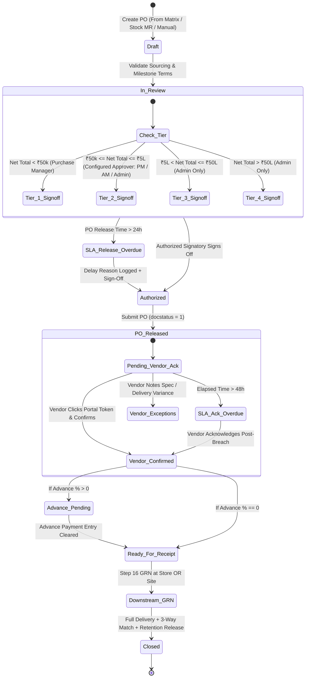

# STEP_15_PURCHASE_ORDER_AUTHORIZATION_SPECIFICATION.md

# Enterprise Lifecycle Step Specification: Purchase Order Authorization, Solar Milestone Terms & Multi-Location Delivery Routing

**Document ID:** `STEP-15-PURCHASE-ORDER-AUTHORIZATION`  
**Lifecycle Flow:** Flow 2: SCM, Store, Purchase & Vendor Procurement Lifecycle (Step 04 of 08 / Global Step 15)  
**Governing Architecture:** [`architect_docs/02_STEP_PLANNING_SPECIFICATION_BLUEPRINT.md`](../architect_docs/02_STEP_PLANNING_SPECIFICATION_BLUEPRINT.md)  
**Architecture Decision Record:** [`docs/decisions/ADR-015-PURCHASE-ORDER-AUTHORIZATION-MILESTONE-TERMS.md`](../docs/decisions/ADR-015-PURCHASE-ORDER-AUTHORIZATION-MILESTONE-TERMS.md)  
**PRD / FRS Traceability:** [`planning_ref_docs/01_PROJECT_FOUNDATION_MODEL.md`](../planning_ref_docs/01_PROJECT_FOUNDATION_MODEL.md) (`BC-13`, `BC-14`), [`planning_ref_docs/03_TO_BE_BUSINESS_PROCESS.md`](../planning_ref_docs/03_TO_BE_BUSINESS_PROCESS.md) (`Gate 9`), [`planning_ref_docs/04_GAP_ANALYSIS_FIT_GAP.md`](../planning_ref_docs/04_GAP_ANALYSIS_FIT_GAP.md) (`Gap #06`, `Gap #07`), [`planning_ref_docs/05_BUSINESS_REQUIREMENTS_DOCUMENT.md`](../planning_ref_docs/05_BUSINESS_REQUIREMENTS_DOCUMENT.md) (`BR-013`, `BR-014`, `BR-017`, `BR-018`), [`planning_ref_docs/06_FUNCTIONAL_REQUIREMENTS_SPECIFICATION.md`](../planning_ref_docs/06_FUNCTIONAL_REQUIREMENTS_SPECIFICATION.md) (`FR-014`), [`planning_ref_docs/08_DATABASE_DESIGN_DOCUMENT.md`](../planning_ref_docs/08_DATABASE_DESIGN_DOCUMENT.md) (`Domain 7: SCM`), [`planning_ref_docs/09_API_DESIGN_AND_INTEGRATIONS.md`](../planning_ref_docs/09_API_DESIGN_AND_INTEGRATIONS.md) (`API 11`), [`planning_ref_docs/10_UI_UX_SPECIFICATION.md`](../planning_ref_docs/10_UI_UX_SPECIFICATION.md) (`Screen 18`), [`planning_ref_docs/11_MODULE_FUNCTIONAL_DOCUMENTATION.md`](../planning_ref_docs/11_MODULE_FUNCTIONAL_DOCUMENTATION.md) (`MOD-14`), [`planning_ref_docs/12_GETMYERP_SOLAR_EPC_WHITEPAPER.md`](../planning_ref_docs/12_GETMYERP_SOLAR_EPC_WHITEPAPER.md) (Sec 2, 4.1)  
**Target Module:** `solar_module` / `manoj` (Extends ERPNext `tabPurchase Order`, child table `tabPurchase Order Item`, integrates `tabPayment Schedule`, `tabPayment Terms Template`, introduces `Solar SCM Settings`, and reuses `tabRemark-Delay Log`)  
**Author:** Principal Enterprise Architect  
**Status:** Ready for Implementation

---

## 1. Step Scope, Objectives & Context Traceability

### 1.1 Lifecycle Positioning & Context

Step 15 (**Purchase Order Authorization, Solar Milestone Terms & Multi-Location Delivery Routing**) represents the formal commercial contract execution and procurement commitment gateway within the **Solar EPC Procurement & Vendor Governance Lifecycle (Flow 2)**.

Operating immediately downstream of Step 14 ([`STEP_14_QUOTATION_COMPARISON_MATRIX_SPECIFICATION.md`](./STEP_14_QUOTATION_COMPARISON_MATRIX_SPECIFICATION.md)), this step ingests the winning vendor award and normalized landed rates, converts them into a legally binding ERPNext `tabPurchase Order`, enforces a 4-tier executive financial delegation hierarchy, mandates structured solar milestone payment terms and retention schedules, pre-sets delivery logistics routing (Central Store Warehouse vs Direct Working Site), and preconditions the high-volume serialized barcode scanning engine executed in Step 16 ([`STEP_16_PURCHASE_RECEIPT_GRN_SPECIFICATION.md`](./STEP_16_PURCHASE_RECEIPT_GRN_SPECIFICATION.md)).

```
┌──────────────────────────────────────────────────────────────────────────────────────────────────┐
│                                FLOW 2: SCM PROCUREMENT PIPELINE                                  │
├──────────────────────────────────────────────────────────────────────────────────────────────────┤
│                                                                                                  │
│   [Step 12: Store Material Request] ──▶ Requisitions from Site Indents / Low-Stock Buffer        │
│                 │                                                                                │
│                 ▼                                                                                │
│   [Step 13: Supplier RFQ Dispatch]  ──▶ Multi-vendor solicitation (≥ 3 Suppliers or Justified)   │
│                 │                                                                                │
│                 ▼                                                                                │
│   [Step 14: Quotation Comparison]   ──▶ Landed cost normalization, 100-pt scoring, Non-L1 gate   │
│                 │                                                                                │
│                 ▼                                                                                │
│   ┌──────────────────────────────────────────────────────────────────────────────────────────┐   │
│   │            STEP 15: PURCHASE ORDER AUTHORIZATION & SOLAR MILESTONE TERMS                 │   │
│   ├──────────────────────────────────────────────────────────────────────────────────────────┤   │
│   │ 1. Upstream Sourcing Link: Ingests awarded Comparison Matrix (or authorized stock indent)│   │
│   │ 2. Rate & Spec Lock: Prevents unit rate inflation and component specification tampering  │   │
│   │ 3. Multi-Tier Financial Authority: Enforces 4-tier delegation (Assistant ➔ Manager ➔ MD) │   │
│   │ 4. Solar Milestone Terms: Structures Advance, In-Transit/LR, Post-GRN, and Retention/PBG │   │
│   │ 5. Project Budget Flexibility: Configurable/Optional check; bypasses central replenishment│  │
│   │ 6. Multi-Location Routing: Central Store (Stores-SEPC) vs Direct Site (Site-<Project>)   │   │
│   │ 7. Serial Tracking Precondition: Flags critical solar assets (modules, inverters)        │   │
│   │ 8. 24h PO Release & 48h Vendor Acknowledgment SLA: Passwordless confirmation via token   │   │
│   └──────────────────────────────────────────────────────────────────────────────────────────┘   │
│                 │                                                                                │
│                 ▼                                                                                │
│   [Step 16: Multi-Location Barcode GRN] ──▶ 100% 2D barcode scan at Store OR Working Site        │
│                                                                                                  │
└──────────────────────────────────────────────────────────────────────────────────────────────────┘
```

- **Predecessors:**
  - Step 14: Supplier Quotation & Comparative Evaluation Matrix (`tabQuotation Comparison Matrix`, `tabSupplier Quotation`).
  - Step 12: Store Material Request & Low Stock Monitoring (`tabMaterial Request` for non-project central inventory replenishments).
- **Successors:**
  - Step 16: Multi-Location Barcode GRN (`tabPurchase Receipt` at Central Store or Working Site).
  - Step 17: Purchase Invoice 3-Way Match Validation (`tabPurchase Invoice`).
  - Step 18: Joint Vendor Payment Tracking Workbench (`tabPayment Entry` against milestone schedule).

### 1.2 Multi-Mode Operational Architecture

Real-world solar EPC operations demand that the Purchase Order engine support four distinct procurement modes without imposing rigid, artificial bottlenecks:

1. **Project-Specific Procurement:** High-value capital components (e.g. 545W bifacial solar modules, 50 kW string inverters, engineered steel mounting structures) ordered specifically for an active solar project (`custom_project_ref`).
2. **Consolidated Multi-Project Bulk Buying:** Bulk equipment contracts negotiated at volume discounts across multiple prospective or ongoing solar installations. Project references may be omitted at PO placement and allocated downstream upon goods receipt.
3. **Central Inventory Replenishment:** Periodic warehouse replenishment of standard safety stock items (e.g. DC cables, MC4 connectors, lightning arrestors, earthing rods, ACDB/DCDB enclosures) initiated by `Store Assistant` or automated low-stock runners (`STEP_12`).
4. **General Operational Consumables & Services:** Plant fabrication tools, site safety gear (PPE), crane hiring, and subcontracting erection labor.

### 1.3 Core Business Objectives & Target KPIs

1. **Zero Unauthorized Capital Commitments:** Enforce an immutable 4-tier financial approval matrix, completely eliminating maverick purchasing where junior buyers issue multi-million rupee orders without executive sign-off.
2. **100% Cash Flow & Milestone Protection:** Eliminate front-loaded vendor payment risks by mandating structured milestone payment schedules (Advance, Dispatch/LR, Post-GRN, Retention/PBG) for all capital equipment.
3. **Zero Post-Award Rate Inflation:** Programmatically lock PO item rates to the evaluated landed rates from Step 14, preventing unauthorized commercial leakage.
4. **Optimized Freight Logistics (Direct-to-Site Delivery):** Enable direct delivery to project sites (`Site - <Project Code> - SEPC`), eliminating intermediate warehouse double-handling, crating damage, and secondary freight expenses (saving ₹40,000–₹80,000 per project).
5. **Sub-24-Hour PO Release & 48-Hour Vendor Confirmation:** Enforce automated turnaround SLAs from quotation award approval to formal PO release and digital vendor confirmation, preventing procurement stalls that threaten statutory DISCOM synchronization deadlines (Stage 10).

### 1.4 Context Traceability Matrix

| Reference Document                 | Section / ID                                     | Requirement Traceability in Step 15                                                                                    |
| :--------------------------------- | :----------------------------------------------- | :--------------------------------------------------------------------------------------------------------------------- |
| **Project Foundation Model**       | `BC-13`, `BC-14` (PO & GRN Governance)           | Formal PO placement locking commercial terms, delivery schedules, and multi-location receipt routing.                  |
| **Business Requirements Document** | `BR-013`, `BR-014` (PO Release & Store/Site GRN) | Contract release with delivery terms, flexible store/site destinations, and milestone payment schedules.               |
| **Functional Requirements Spec**   | `FR-014` (Purchase Order & Multi-Location GRN)   | Screen controls, financial authorization matrix, milestone payment terms, and delivery warehouse designation.          |
| **Gap Analysis & Fit-Gap**         | `Gap #06`, `Gap #07` (PO Authorization & GRN)    | Replaces ambiguous purchase orders with structured financial approval gates, milestone terms, and delivery routing.    |
| **Database Design Document**       | `Domain 7: SCM` (`tabPurchase Order`)            | Relational schema for PO attributes, payment milestone schedules, delivery warehouse keys, and SLA delay containers.   |
| **API Design & Integrations**      | `API 11` (`solar_module.api.procurement.*`)      | Whitelisted endpoints for PO creation, authorization sign-off, milestone scheduling, and vendor portal acknowledgment. |
| **UI/UX Specification**            | `Screen 18` (Purchase Order Authorization Hub)   | Desk form layout, authorization tier banners, milestone schedule breakdown, and vendor acknowledgment status.          |
| **Module SOP Suite**               | `MOD-14` (Purchase Order Placement & SCM Terms)  | Operational standard operating procedure for contract drafting, approval routing, and vendor dispatch.                 |
| **Executive Governance**           | `BR-017`, `BR-018` (SLA Engine & Notifications)  | 24h release SLA, 48h vendor acknowledgment countdown, Redis daemons, and WhatsApp/Raven alert broadcasts.              |

---

## 2. Stakeholders, Enterprise Actors & HRMS Role Mapping

### 2.1 Enterprise User Roles Matrix

In strict compliance with the **Zero "User" Suffix Rule** ([`step_plans/README.md#5-enterprise-persona--role-naming-standard-zero-user-suffix-rule`](./README.md#5-enterprise-persona--role-naming-standard-zero-user-suffix-rule)) and [`ADR-020`](../decisions/ADR-020-ENTERPRISE-ROLE-PERMISSION-ARCHITECTURE.md), all operational personas are designated by descriptive functional titles:

| Persona / Business Actor           | Frappe System Role                     | HRMS Department        | HRMS Designation              | Operational Responsibilities                                                                                                        |
| :--------------------------------- | :------------------------------------- | :--------------------- | :---------------------------- | :---------------------------------------------------------------------------------------------------------------------------------- |
| **Procurement Line Executive**     | `Purchase Assistant`                   | Purchase & SCM         | `Purchase Executive`          | Converts awarded comparison matrix into PO draft, verifies item quantities, attaches delivery terms. Frontline drafting only.       |
| **Head of Procurement**            | `Purchase Manager`                     | Purchase & SCM         | `Purchase Manager`            | Exclusive authority for Tier 1 orders (< ₹50k); eligible for Tier 2 approval if configured in settings; inherits junior authority.  |
| **Finance Department Lead**        | `Accounts Manager`                     | Finance & Accounts     | `Finance Head / Controller`   | Verifies milestone payment schedules; eligible for Tier 2 approval if configured in `Solar SCM Settings`; signs cash disbursements. |
| **Finance Line Assistant**         | `Accounts Assistant`                   | Finance & Accounts     | `Accounts Assistant`          | Verifies milestone payment entries and bank payment advice against PO payment schedule milestones.                                  |
| **Site Technical Requisitioner**   | `Project Engineer` / `Site Supervisor` | Engineering Operations | `Field Engineer / Supervisor` | Verifies delivery schedules against on-site civil readiness; confirms target site warehouse for direct deliveries.                  |
| **Warehouse Logistics Head**       | `Store Manager`                        | Store & Inventory      | `Warehouse Manager`           | Confirms central warehouse staging capacity or approves direct-to-site delivery routing.                                            |
| **External Vendor Representative** | `Supplier`                             | External Entity        | `Vendor Sales Representative` | Acknowledges PO delivery dates, technical specs, and milestone terms via passwordless vendor portal (`/solar/po-portal/:token`).    |
| **Solar EPC Director / Admin**     | `Admin`                                | Executive Management   | `Managing Director`           | Project supreme command; exclusive authority for Tier 3 & Tier 4 orders (> ₹5L); configures `Solar SCM Settings`, delay audits.     |
| **Framework Supreme / Developer**  | `System Manager`                       | Information Technology | `DevOps Engineer / Architect` | Bench CLI administration, custom field fixtures, background Redis queue sizing, and Developer Mode plumbing. Supreme over `Admin`.  |

### 2.2 Permission Hierarchy Matrix

| DocType / Action                   | Purchase Assistant |  Purchase Manager  |  Accounts Manager  | Store Manager |      Admin\*       | External Supplier |
| :--------------------------------- | :----------------: | :----------------: | :----------------: | :-----------: | :----------------: | :---------------: |
| **Purchase Order (Read)**          |     All Active     |     All Active     |     All Active     |  All Active   |    All Records     |  Own Orders Only  |
| **Purchase Order (Create/Edit)**   |    Yes (Draft)     |        Yes         |         No         |      No       |    All Records     |     No Access     |
| **Purchase Order (Tier 1 Submit)** |         No         |  **Yes (< ₹50k)**  |         No         |      No       |      **Yes**       |        No         |
| **Purchase Order (Tier 2 Submit)** |         No         | **Configurable\*** | **Configurable\*** |      No       | **Configurable\*** |        No         |
| **Purchase Order (Tier 3 Submit)** |         No         |         No         |         No         |      No       |  **Yes (> ₹5L)**   |        No         |
| **Purchase Order (Tier 4 Submit)** |         No         |         No         |         No         |      No       |  **Yes (> ₹50L)**  |        No         |
| **Payment Schedule (Edit)**        |     Yes (Pre)      |        Yes         |        Yes         |      No       |        Yes         |     No Access     |
| **Vendor Digital Ack (Portal)**    |         No         |         No         |         No         |      No       |         No         | **Portal Token**  |
| **Remark-Delay Log (Write)**       |        Own         |        Own         |        Own         |      Own      |    Full Access     |     No Access     |
| **Solar SCM Settings (Write)**     |         No         |         No         |         No         |      No       |   **Yes (Only)**   |     No Access     |

_\*Note: Tier 2 (₹50k–₹5L) authorization is granted to exactly ONE active role configured in `Solar SCM Settings` (`Purchase Manager`, `Accounts Manager`, or `Admin`)._

_\*Note: Frappe `Administrator` and `System Manager` sit at the apex of system hierarchy and possess all operational permissions plus technical code and schema configuration access._

---

## 3. Relational Schema & 3NF Data Dictionary

### 3.1 Core DocType Extensions: `tabPurchase Order`

Standard ERPNext `Purchase Order` is extended with enterprise solar SCM attributes isolated under the `custom_*` prefix:

| Fieldname                             | Label                        | Fieldtype    | Options / Target                                                                                                                       | Mandatory |    Index     | Description & Validation Rules                                                                   |
| :------------------------------------ | :--------------------------- | :----------- | :------------------------------------------------------------------------------------------------------------------------------------- | :-------: | :----------: | :----------------------------------------------------------------------------------------------- |
| `custom_comparison_matrix_ref`        | Quotation Comparison Matrix  | `Link`       | `Quotation Comparison Matrix`                                                                                                          |    No     | **Index: 1** | Links originating award matrix from Step 14. Mandatory if not central stock or single source.    |
| `custom_awarded_quotation_ref`        | Awarded Supplier Quotation   | `Link`       | `Supplier Quotation`                                                                                                                   |    No     | **Index: 1** | Links winning supplier quotation document.                                                       |
| `custom_material_request_ref`         | Material Request Reference   | `Link`       | `Material Request`                                                                                                                     |    No     | **Index: 1** | Links originating store/site material request indent.                                            |
| `custom_is_single_source`             | Is Single Source?            | `Check`      | -                                                                                                                                      |    No     |      -       | Inherited from RFQ/Matrix; if 1, skips 3-vendor check with attached justification.               |
| `custom_po_classification`            | PO Classification            | `Select`     | `Project-Specific Solar Equipment\nMulti-Project Consolidated Bulk\nCentral Inventory Replenishment\nConsumables & Hardware\nServices` |  **Yes**  | **Index: 1** | Classifies procurement nature; dictates whether project budget check applies. Defaults to first. |
| `custom_project_ref`                  | Solar Project Reference      | `Link`       | `Project`                                                                                                                              |    No     | **Index: 1** | Foreign key linking solar EPC project container. Mandatory if project-specific.                  |
| `custom_sales_order_ref`              | Sales Order Reference        | `Link`       | `Sales Order`                                                                                                                          |    No     | **Index: 1** | Commercial baseline anchor linking customer order.                                               |
| `custom_delivery_location_type`       | Delivery Destination Type    | `Select`     | `Central Store Warehouse\nDirect Site Warehouse`                                                                                       |  **Yes**  |      -       | Determines physical delivery destination for logistics and Step 16 GRN.                          |
| `custom_target_site_warehouse`        | Target Site Warehouse        | `Link`       | `Warehouse`                                                                                                                            |    No     |      -       | Specific project warehouse (`Site - <Code> - SEPC`) if delivery is Direct-to-Site.               |
| `custom_authorization_tier`           | Financial Authorization Tier | `Select`     | `Tier 1: Up to ₹50,000\nTier 2: Up to ₹5,00,000\nTier 3: Up to ₹50,00,000\nTier 4: Above ₹50,00,000`                                   |  **Yes**  |      -       | Computed dynamically from Net Total; dictates required submission signatory role.                |
| `custom_authorized_by`                | Sign-off Approver            | `Link`       | `User`                                                                                                                                 |    No     |      -       | Approver user ID who authorized PO submission.                                                   |
| `custom_authorized_on`                | Sign-off Timestamp           | `Datetime`   | -                                                                                                                                      |    No     |      -       | Timestamp when managerial authorization was recorded.                                            |
| `custom_authorization_remarks`        | Authorization Remarks        | `Small Text` | -                                                                                                                                      |    No     |      -       | Approver sign-off commentary and notes.                                                          |
| `custom_advance_pct`                  | Advance Payment (%)          | `Percent`    | -                                                                                                                                      |    No     |      -       | Contracted advance percentage (e.g. 15.00%).                                                     |
| `custom_advance_amount`               | Advance Amount Payable       | `Currency`   | `Company:currency`                                                                                                                     |    No     |      -       | Computed: $\text{Grand Total} \times (\text{custom\_advance\_pct} / 100)$.                       |
| `custom_advance_cleared`              | Advance Payment Cleared?     | `Check`      | -                                                                                                                                      |    No     |      -       | Set to 1 upon submission of linked Advance `Payment Entry`.                                      |
| `custom_advance_payment_ref`          | Advance Payment Entry        | `Link`       | `Payment Entry`                                                                                                                        |    No     |      -       | Reference to the accounting disbursement document.                                               |
| `custom_retention_pct`                | Retention / Warranty (%)     | `Percent`    | -                                                                                                                                      |    No     |      -       | Percentage held back as security (e.g. 5.00% or 10.00%).                                         |
| `custom_retention_due_event`          | Retention Release Trigger    | `Select`     | `On Grid Synchronization (COD)\nOn Final Acceptance Test (FAT)\nAgainst Performance Bank Guarantee (PBG)`                              |    No     |      -       | Milestone event unlocking retention disbursement.                                                |
| `custom_liquidated_damages_clause`    | Enforce Liquidated Damages?  | `Check`      | -                                                                                                                                      |    No     |      -       | If 1, binds supplier to 0.5% penalty per week of delivery delay (up to 5% max). Defaults to 1.   |
| `custom_portal_token`                 | Vendor Acknowledgment Token  | `Data`       | -                                                                                                                                      |    No     | **Index: 1** | Cryptographically random 256-bit UUID token for passwordless vendor confirmation.                |
| `custom_vendor_acknowledgment_status` | Vendor Confirmation Status   | `Select`     | `Pending Acknowledgment\nAcknowledged & Confirmed\nExceptions Raised`                                                                  |  **Yes**  | **Index: 1** | Tracks external supplier confirmation. Defaults to `Pending Acknowledgment`.                     |
| `custom_vendor_ack_date`              | Acknowledged On              | `Datetime`   | -                                                                                                                                      |    No     |      -       | Timestamp when vendor accepted terms via portal.                                                 |
| `custom_sla_deadline`                 | PO Release / Vendor Ack SLA  | `Datetime`   | -                                                                                                                                      |  **Yes**  | **Index: 1** | Target completion datetime (`creation + 24h` for release; `submit + 48h` for vendor ack).        |
| `custom_sla_status`                   | SLA Performance Status       | `Select`     | `\nOn Time\nOverdue`                                                                                                                   |    No     |      -       | Managed by background SLA daemon.                                                                |
| `custom_delay_reason_table`           | Delay Audit Log              | `Table`      | `Remark-Delay Log`                                                                                                                     |    No     |      -       | Required if submitting or acknowledging while `custom_sla_status == 'Overdue'`.                  |

### 3.2 Child DocType Extensions: `tabPurchase Order Item`

Standard `Purchase Order Item` is extended to freeze technical and logistical parameters:

| Fieldname                         | Label                          | Fieldtype  | Options / Target            | Mandatory | Description & Integrity Rules                                                          |
| :-------------------------------- | :----------------------------- | :--------- | :-------------------------- | :-------: | :------------------------------------------------------------------------------------- |
| `custom_comparison_item_ref`      | Comparison Item Reference      | `Link`     | `Quotation Comparison Item` |    No     | Links specific evaluated item row from Step 14 matrix.                                 |
| `custom_technical_specs_frozen`   | Frozen Technical Specification | `Text`     | -                           |    No     | Freezes equipment specs (wattage, cell technology, efficiency, dimensions) at award.   |
| `custom_landed_rate_awarded`      | Awarded Landed Unit Rate       | `Currency` | `Company:currency`          |    No     | Landed unit rate approved in Step 14. Controller asserts: `rate <= custom_landed_rate` |
| `custom_promised_delivery_date`   | Promised Delivery Date         | `Date`     | -                           |  **Yes**  | Quoted delivery milestone date guaranteed by supplier.                                 |
| `custom_requires_barcode_serials` | Requires 2D Barcode Serials?   | `Check`    | -                           |    No     | Evaluated as 1 for solar modules, inverters, and meters to mandate SABB in Step 16.    |
| `custom_target_warehouse`         | Target Delivery Warehouse      | `Link`     | `Warehouse`                 |  **Yes**  | Inherited from parent routing (`Stores - SEPC` or `Site - <Project> - SEPC`).          |

### 3.3 Governance Single DocType: `tabSolar SCM Settings`

A dedicated configuration single DocType providing declarative governance for `Admin` without touching code:

- **DocType Name:** `Solar SCM Settings`
- **Module:** `solar_module`
- **Single DocType:** `issingle = 1`

| Fieldname                         | Label                              | Fieldtype  |      Default       | Description & Operational Impact                                                               |
| :-------------------------------- | :--------------------------------- | :--------- | :----------------: | :--------------------------------------------------------------------------------------------- |
| `tier_1_limit`                    | Tier 1 Financial Limit (INR)       | `Currency` |       50000        | Threshold for `Purchase Manager` sign-off (< ₹50k). Frontline cannot submit.                   |
| `tier_2_limit`                    | Tier 2 Financial Limit (INR)       | `Currency` |       500000       | Upper threshold for Tier 2 orders (₹50k to ₹5L).                                               |
| `tier_2_approver_role`            | Tier 2 Authorized Approver Role    | `Select`   | `Purchase Manager` | Exactly one active role configured by Admin (`Purchase Manager`, `Accounts Manager`, `Admin`). |
| `tier_3_limit`                    | Tier 3 Financial Limit (INR)       | `Currency` |      5000000       | Upper threshold for Tier 3 orders (> ₹5L to ₹50L). Requires `Admin` sign-off.                  |
| `enforce_project_bom_ceiling`     | Enforce Project BOM Ceiling Gate   | `Check`    |         0          | **Developer / Admin Configurable Option:** If 1, hard-blocks POs exceeding Proposal BOM.       |
| `bom_overage_tolerance_pct`       | Allowed BOM Overage Buffer (%)     | `Percent`  |        5.00        | Contingency tolerance margin (e.g. 5%) permitted above Proposal BOM when ceiling is active.    |
| `po_release_sla_hours`            | PO Release SLA Window (Hours)      | `Int`      |         24         | Turnaround SLA from Comparison Matrix submission to PO release.                                |
| `vendor_acknowledgment_sla_hours` | Vendor Acknowledgment Window (Hrs) | `Int`      |         48         | Turnaround SLA from PO release to vendor digital sign-off.                                     |
| `enable_whatsapp_vendor_dispatch` | Auto-Dispatch PO Link via WhatsApp | `Check`    |         1          | Sends PDF and passwordless confirmation token to vendor sales mobile on submit.                |

---

## 4. State Machine, Verification Gates & SLA Engine

### 4.1 State Machine Lifecycle



### 4.2 Enforced Server-Side Verification Gates

#### Gate 1: Upstream Sourcing Link & Landed Rate Integrity Gate

- **Assertion:** If `custom_po_classification` is `Project-Specific Solar Equipment` or `Multi-Project Consolidated Bulk`:
  - `custom_comparison_matrix_ref` must be present and linked to a submitted `Quotation Comparison Matrix` (`docstatus = 1`, `evaluation_status = 'Award Approved'`).
  - _Exception:_ If `custom_is_single_source = 1`, linkage to comparison matrix is relaxed, but a valid justification ($\ge 30$ chars) and manager authorization are mandatory.
  - _Rate Integrity Check:_ For every line item, the basic unit rate cannot exceed the landed rate awarded in Step 14:
    $$\text{Item Rate} \le \text{custom\_landed\_rate\_awarded}$$
    Violations raise `frappe.ValidationError(_("Item {0} rate {1} exceeds approved landed rate {2}").format(item.item_code, item.rate, item.custom_landed_rate_awarded))`.

#### Gate 2: Multi-Tier Financial Authority Delegation Gate

- **Assertion:** Upon `docstatus = 1` submission, the system evaluates the grand net total and verifies the executing user's roles against the active thresholds in `Solar SCM Settings`:
  - **Tier 1 (< ₹50,000):** Exclusively executable by `Purchase Manager` (or `Admin`). Frontline `Purchase Assistant` cannot submit.
  - **Tier 2 (₹50,000 to ₹5,00,000):** Exclusively requires the single active approver role configured in `Solar SCM Settings.tier_2_approver_role` (`Purchase Manager`, `Accounts Manager`, or `Admin`). Only that active role (plus `Admin`) can approve.
  - **Tier 3 (> ₹5,00,000 to ₹50,00,000):** Exclusively restricted to **`Admin`** (Project Supreme Command).
  - **Tier 4 (> ₹50,00,000):** Exclusively restricted to **`Admin`** (Project Supreme Command) or `Managing Director`.
- Attempting to submit without holding the authorized role raises `frappe.PermissionError`.

#### Gate 3: Solar Milestone Payment Schedule & Retention Gate

- **Assertion:** If any line item belongs to an equipment group marked as capital solar assets (PV Modules, Inverters, HT Transformers, Mounting Structures):
  - Generic payment terms (e.g. 100% immediate or net 30 without tranches) are **strictly prohibited**.
  - `tabPayment Schedule` must contain at least 2 distinct milestone rows.
  - If `custom_advance_pct > 0`, the first payment schedule row must represent the advance tranche matching `custom_advance_amount`.
  - If `custom_retention_pct > 0`, the final payment schedule row must represent the retention tranche tied to grid synchronization or PBG release.

#### Gate 4: Configurable Project Budget & Commercial BOM Check (Optional / Developer Switchable)

- **Scope & Context:** Addressing the real-world operational need to support central warehouse stock indents and bulk multi-project purchasing:
  1. _Automatic Bypass:_ If `custom_project_ref` is blank, or `custom_po_classification` is set to `Central Inventory Replenishment` or `Multi-Project Consolidated Bulk`, this gate is **completely bypassed**.
  2. _Configurable Enforcement:_ When `custom_project_ref` is populated, enforcement is governed by the `enforce_project_bom_ceiling` checkbox in `Solar SCM Settings`:
     - **If Enabled (1):** Compares the cumulative ordered quantity of the item (across all submitted POs for the project) plus the current PO quantity against the Commercial Proposal BOM (`tabQuotation` / `tabSales Order` BOM) plus the configured tolerance percentage (`bom_overage_tolerance_pct`, default 5%):
       $$\sum \text{Ordered Qty} + \text{Current Qty} \le \text{Proposal BOM Qty} \times (1 + \text{Tolerance})$$
       Exceeding this ceiling blocks submission unless an override remark is provided.
     - **If Disabled (0, Default):** The system displays an informative visual warning banner on the form view, logging the variance without interrupting purchasing operations.

#### Gate 5: Multi-Location Delivery Routing & Barcode Serialization Precondition

- **Assertion:**
  - `custom_delivery_location_type` must be selected.
  - If `Direct Site Warehouse` is selected, `custom_target_site_warehouse` must be populated with a valid site warehouse linked to the project (`Site - <Project Code> - SEPC`).
  - For critical serialized items (Item master `has_serial_no = 1` or Category in Modules/Inverters), the system automatically asserts `custom_requires_barcode_serials = 1`. This flags the order for mandatory Frappe v15 Serial and Batch Bundle (SABB) capture during Step 16 GRN.

#### Gate 6: Vendor Digital Confirmation & Acknowledgment Gate

- **Assertion:**
  - Upon submission (`docstatus = 1`), the system generates a secure 256-bit UUID token (`custom_portal_token`) and dispatches a vendor confirmation package (via email and WhatsApp).
  - The supplier confirms promised delivery dates and milestone terms at `/solar/po-portal/:token`.
  - If exceptions are noted by the vendor (e.g. delivery date pushed out by 10 days), the PO transitions to `Exceptions Raised`, auto-alerting the `Purchase Manager`.

### 4.3 SLA Engine & Delay Audit Architecture

```
┌─────────────────────────────────────────────────────────────────────────────┐
│                          STEP 15 SLA TIMELINE ENGINE                        │
├─────────────────────────────────────────────────────────────────────────────┤
│                                                                             │
│  [Comparison Matrix Submitted]                                              │
│               │                                                             │
│               ▼                                                             │
│  ├──▶ PO Release SLA Clock (24 Hours)                                       │
│  │    • Status: "Draft" / "In Review" ➔ "Authorized"                        │
│  │    • If Elapsed > 24h: SLA Status transitions to "Overdue"               │
│  │    • Requires justification in tabRemark-Delay Log to submit             │
│  │                                                                          │
│  [Purchase Order Submitted (docstatus = 1)]                                 │
│               │                                                             │
│               ▼                                                             │
│  └──▶ Vendor Acknowledgment SLA Clock (48 Hours)                            │
│       • Status: "Pending Acknowledgment" ➔ "Acknowledged & Confirmed"       │
│       • Dispatches automated reminders at T-24h and T-12h                   │
│       • If Elapsed > 48h: Flagged as "Overdue", alerting Purchase Manager   │
│                                                                             │
└─────────────────────────────────────────────────────────────────────────────┘
```

1. **PO Release SLA (Default 24 Hours):** Measured from the moment the `Quotation Comparison Matrix` is approved. Evaluated every 15 minutes by Redis daemon `solar_module.tasks.monitor_po_release_sla`.
2. **Vendor Confirmation SLA (Default 48 Hours):** Measured from PO submission timestamp. Monitored by `solar_module.tasks.monitor_vendor_acknowledgment_sla`.
3. **Mandatory Delay Log Invariant:** Whenever an SLA timer expires, `custom_sla_status` transitions to `Overdue`. Saving or submitting any document in `Overdue` state requires inserting an entry into `tabRemark-Delay Log` containing:
   - `reason_category`: E.g. `Price Renegotiation`, `Supplier Credit Dispute`, `Executive Approver Unavailable`, `Engineering BOM Amendment`.
   - `detailed_remarks`: Minimum 25 characters explaining the delay cause.

---

## 5. Controller Logic, Domain Services & Whitelisted APIs

### 5.1 Decoupled SOLID Architecture

In accordance with [`architect_docs/05_DESIGN_PATTERNS_DOMAIN_SERVICES_SOLID.md`](../architect_docs/05_DESIGN_PATTERNS_DOMAIN_SERVICES_SOLID.md), all business math, verification gates, and integration formatting are extracted into dedicated service classes.

```
┌─────────────────────────────────────────────────────────────────────────────┐
│                       DECOUPLED DOMAIN SERVICE LAYER                        │
├─────────────────────────────────────────────────────────────────────────────┤
│                                                                             │
│  PurchaseOrderController (hooks.py override: solar_module.overrides.po)     │
│        │                                                                    │
│        ├──▶ PurchaseOrderValidationService                                  │
│        │    ├── validate_upstream_sourcing_link()                           │
│        │    ├── validate_rate_integrity_against_matrix()                    │
│        │    └── validate_project_bom_headroom() [Optional / Configurable]   │
│        │                                                                    │
│        ├──▶ POAuthorizationMatrixService                                    │
│        │    ├── calculate_authorization_tier()                              │
│        │    └── assert_user_authorization_tier()                            │
│        │                                                                    │
│        ├──▶ POMilestoneTermsService                                         │
│        │    ├── validate_solar_milestone_schedule()                         │
│        │    └── compute_advance_and_retention_totals()                      │
│        │                                                                    │
│        ├──▶ POSLAService                                                    │
│        │    ├── compute_release_and_acknowledgment_deadlines()              │
│        │    └── assert_delay_logging_compliance()                           │
│        │                                                                    │
│        └──▶ PODispatchBridgeService                                         │
│             ├── generate_vendor_portal_token()                              │
│             ├── dispatch_po_notification_package()                          │
│             └── pre_condition_step_16_grn_parameters()                      │
│                                                                             │
└─────────────────────────────────────────────────────────────────────────────┘
```

### 5.2 Implementation: `PurchaseOrderValidationService`

```python
# solar_module/services/po_validation_service.py

import frappe
from frappe import _
from frappe.utils import flt, cint

class PurchaseOrderValidationService:
    @staticmethod
    def validate_upstream_sourcing(doc):
        """Enforces linkage to Quotation Comparison Matrix or Single Source justification."""
        if doc.custom_po_classification in [
            "Project-Specific Solar Equipment",
            "Multi-Project Consolidated Bulk",
        ]:
            if not doc.custom_comparison_matrix_ref and not doc.custom_is_single_source:
                frappe.throw(
                    _("A submitted Quotation Comparison Matrix is required for capital solar procurement. "
                      "If this is a justified single-source purchase, mark 'Is Single Source'."),
                    frappe.ValidationError,
                )

            if doc.custom_is_single_source:
                if not doc.custom_authorization_remarks or len(doc.custom_authorization_remarks.strip()) < 30:
                    frappe.throw(
                        _("Single-source procurement requires detailed justification remarks (minimum 30 characters)."),
                        frappe.ValidationError,
                    )
            elif doc.custom_comparison_matrix_ref:
                matrix_status, docstatus = frappe.db.get_value(
                    "Quotation Comparison Matrix",
                    doc.custom_comparison_matrix_ref,
                    ["evaluation_status", "docstatus"],
                )
                if docstatus != 1 or matrix_status != "Award Approved":
                    frappe.throw(
                        _("Linked Quotation Comparison Matrix {0} must be submitted and 'Award Approved'.").format(
                            doc.custom_comparison_matrix_ref
                        ),
                        frappe.ValidationError,
                    )

    @staticmethod
    def validate_rate_integrity(doc):
        """Asserts PO item rates do not exceed awarded landed rates from Step 14."""
        for item in doc.items:
            if item.custom_landed_rate_awarded and flt(item.custom_landed_rate_awarded) > 0:
                if flt(item.rate) > flt(item.custom_landed_rate_awarded):
                    frappe.throw(
                        _("Row #{0}: Item {1} unit rate ({2}) exceeds the approved landed rate ({3}) "
                          "from Quotation Comparison Matrix. Rate inflation is prohibited.").format(
                            item.idx, item.item_code, item.rate, item.custom_landed_rate_awarded
                        ),
                        frappe.ValidationError,
                    )

    @staticmethod
    def validate_project_bom_headroom(doc):
        """
        Optional / Configurable Gate: Checks proposal/project BOM ceiling headroom.
        Automatically bypassed for non-project / central inventory replenishments.
        """
        if not doc.custom_project_ref or doc.custom_po_classification in [
            "Central Inventory Replenishment",
            "Multi-Project Consolidated Bulk",
            "Consumables & Hardware",
        ]:
            return  # Bypassed by design for inventory & consolidated procurement

        settings = frappe.get_cached_doc("Solar SCM Settings")
        if not cint(settings.enforce_project_bom_ceiling):
            return  # Optional check disabled by Admin/Developer configuration

        tolerance_pct = flt(settings.bom_overage_tolerance_pct, 5.0)

        # Retrieve approved BOM quantities from commercial proposal / sales order
        for item in doc.items:
            proposal_bom_qty = frappe.db.get_value(
                "Quotation Item",
                {"parent": doc.custom_sales_order_ref or "", "item_code": item.item_code},
                "qty",
            )
            if not proposal_bom_qty:
                continue

            # Query cumulative ordered quantity across all active submitted POs for this project
            existing_ordered = frappe.db.sql(
                """
                SELECT SUM(poi.qty)
                FROM `tabPurchase Order Item` poi
                JOIN `tabPurchase Order` po ON poi.parent = po.name
                WHERE po.custom_project_ref = %s
                  AND poi.item_code = %s
                  AND po.docstatus = 1
                  AND po.name != %s
                """,
                (doc.custom_project_ref, item.item_code, doc.name or ""),
            )[0][0] or 0.0

            max_allowed = flt(proposal_bom_qty) * (1.0 + (tolerance_pct / 100.0))
            if (flt(existing_ordered) + flt(item.qty)) > max_allowed:
                frappe.throw(
                    _("Row #{0}: Total cumulative ordered quantity ({1}) for Item {2} exceeds "
                      "the approved Commercial Proposal BOM ceiling ({3}) plus {4}% tolerance. "
                      "Adjust quantity or update Solar SCM Settings.").format(
                        item.idx,
                        existing_ordered + item.qty,
                        item.item_code,
                        proposal_bom_qty,
                        tolerance_pct,
                    ),
                    frappe.ValidationError,
                )
```

### 5.3 Implementation: `POAuthorizationMatrixService`

```python
# solar_module/services/po_authorization_service.py

import frappe
from frappe import _
from frappe.utils import flt

class POAuthorizationMatrixService:
    @staticmethod
    def calculate_tier(net_total):
        """Computes the financial authorization tier based on Net Total."""
        settings = frappe.get_cached_doc("Solar SCM Settings")
        t1 = flt(settings.tier_1_limit, 50000.0)
        t2 = flt(settings.tier_2_limit, 500000.0)
        t3 = flt(settings.tier_3_limit, 5000000.0)

        amount = flt(net_total)
        if amount <= t1:
            return "Tier 1: Up to ₹50,000"
        elif amount <= t2:
            return "Tier 2: Up to ₹5,00,000"
        elif amount <= t3:
            return "Tier 3: Up to ₹50,00,000"
        else:
            return "Tier 4: Above ₹50,00,000"

    @staticmethod
    def assert_authorization_permissions(doc):
        """Enforces that the submitting user holds required tier credentials."""
        user_roles = frappe.get_roles(frappe.session.user)
        tier = doc.custom_authorization_tier or POAuthorizationMatrixService.calculate_tier(doc.net_total)

        if "System Manager" in user_roles or "Administrator" in user_roles:
            return  # Technical apex override

        settings = frappe.get_cached_doc("Solar SCM Settings")

        if tier == "Tier 1: Up to ₹50,000":
            required = ["Purchase Manager", "Admin"]
        elif tier == "Tier 2: Up to ₹5,00,000":
            tier_2_role = settings.tier_2_approver_role or "Purchase Manager"
            required = [tier_2_role, "Admin"]
        elif tier == "Tier 3: Up to ₹50,00,000":
            required = ["Admin"]
        else:  # Tier 4 (> ₹50L)
            required = ["Admin"]

        if not any(role in user_roles for role in required):
            frappe.throw(
                _("You are not authorized to release this Purchase Order. Required role for {0}: {1}.").format(
                    tier, ", ".join(sorted(list(set(required))))
                ),
                frappe.PermissionError,
            )
```

### 5.4 Whitelisted API Contracts

```python
# solar_module/api/procurement.py

import json
import uuid
import frappe
from frappe import _
from frappe.utils import now_datetime, add_to_date
from solar_module.services.po_validation_service import PurchaseOrderValidationService
from solar_module.services.po_authorization_service import POAuthorizationMatrixService

@frappe.whitelist(methods=["POST"])
def create_purchase_order_from_award(comparison_matrix_name: str) -> dict:
    """
    Programmatically instantiates an ERPNext Purchase Order from an awarded Comparison Matrix.
    """
    if not comparison_matrix_name:
        frappe.throw(_("Comparison Matrix name is required."), frappe.ValidationError)

    matrix = frappe.get_doc("Quotation Comparison Matrix", comparison_matrix_name)
    matrix.check_permission("read")

    if matrix.docstatus != 1 or matrix.evaluation_status != "Award Approved":
        frappe.throw(_("Matrix must be submitted and 'Award Approved'."), frappe.ValidationError)

    if matrix.purchase_order_ref:
        frappe.throw(_("Purchase Order {0} has already been created.").format(matrix.purchase_order_ref))

    po = frappe.new_doc("Purchase Order")
    po.supplier = matrix.awarded_supplier
    po.custom_comparison_matrix_ref = matrix.name
    po.custom_awarded_quotation_ref = matrix.awarded_quotation
    po.custom_project_ref = matrix.project_reference
    po.custom_material_request_ref = matrix.material_request_ref
    po.custom_po_classification = "Project-Specific Solar Equipment" if matrix.project_reference else "Central Inventory Replenishment"
    po.custom_delivery_location_type = "Direct Site Warehouse" if matrix.project_reference else "Central Store Warehouse"
    po.schedule_date = matrix.target_delivery_date

    # Populate line items from winning quote comparison rows
    for item in matrix.comparison_items:
        if item.supplier == matrix.awarded_supplier:
            po.append("items", {
                "item_code": item.item_code,
                "item_name": item.item_name,
                "qty": item.qty,
                "uom": item.uom,
                "rate": item.basic_rate,
                "schedule_date": add_to_date(now_datetime(), days=item.promised_lead_days),
                "custom_comparison_item_ref": item.name,
                "custom_landed_rate_awarded": item.landed_rate_unit,
                "custom_promised_delivery_date": add_to_date(now_datetime(), days=item.promised_lead_days),
                "custom_requires_barcode_serials": 1 if frappe.db.get_value("Item", item.item_code, "has_serial_no") else 0,
            })

    # Set initial SLA deadline (24 hours)
    po.custom_sla_deadline = add_to_date(now_datetime(), hours=24)
    po.custom_sla_status = "On Time"
    po.insert()

    # Link back to matrix
    matrix.db_set("purchase_order_ref", po.name)
    matrix.db_set("evaluation_status", "PO Created")

    return {
        "status": "success",
        "purchase_order": po.name,
        "message": _("Purchase Order {0} drafted successfully.").format(po.name),
    }

@frappe.whitelist(methods=["POST"])
def acknowledge_vendor_purchase_order(token: str, acknowledgment_status: str, notes: str = None) -> dict:
    """
    Passwordless external endpoint for vendor confirmation (/solar/po-portal/:token).
    """
    if not token:
        frappe.throw(_("Security token is required."), frappe.ValidationError)

    po_name = frappe.db.get_value("Purchase Order", {"custom_portal_token": token}, "name")
    if not po_name:
        frappe.throw(_("Invalid or expired authorization token."), frappe.PermissionError)

    po = frappe.get_doc("Purchase Order", po_name)
    if po.docstatus != 1:
        frappe.throw(_("Purchase Order is not in a submitted state."), frappe.ValidationError)

    po.custom_vendor_acknowledgment_status = acknowledgment_status
    po.custom_vendor_ack_date = now_datetime()
    if notes:
        po.add_comment("Comment", _("Vendor Acknowledgment Note: {0}").format(notes))
    po.save(ignore_permissions=True)

    return {
        "status": "success",
        "po_name": po.name,
        "acknowledgment_status": po.custom_vendor_acknowledgment_status,
        "message": _("Thank you. Purchase Order acknowledgment recorded successfully."),
    }
```

---

## 6. Frontend UI/UX Specification

### 6.1 Frappe Desk Integration (`Purchase Order` Form View)

```
┌──────────────────────────────────────────────────────────────────────────────────────────────────┐
│ PURCHASE ORDER: PUR-ORD-2026-00084                                        [Tier 2: <= ₹10,00,000]│
├──────────────────────────────────────────────────────────────────────────────────────────────────┤
│ Status: SUBMITTED | SLA: ON TIME (Ack Due: 36h) | Vendor Ack: ACKNOWLEDGED & CONFIRMED           │
├──────────────────────────────────────────────────────────────────────────────────────────────────┤
│ [Quick Actions]: [Print Solar PO PDF]  [Generate Advance Payment]  [Create Multi-Location GRN]   │
├──────────────────────────────────────────────────────────────────────────────────────────────────┤
│ ▼ SECTION 1: SOURCING & PROJECT CLASSIFICATION                                                   │
│   PO Classification: Project-Specific Solar Equipment   Project: PROJ-SOL-2026-0042 (100 kW Rooftop)│
│   Originating Matrix: QCM-2026-00042 (Awarded)         Sales Order: SO-2026-00019                │
│   Awarded Quote: SQ-2026-00015                         Is Single Source: [ ]                     │
├──────────────────────────────────────────────────────────────────────────────────────────────────┤
│ ▼ SECTION 2: DELIVERY LOGISTICS & SITE ROUTING (Step 16 Precondition)                           │
│   Delivery Destination Type: Direct Site Warehouse                                               │
│   Target Site Warehouse: Site - PROJ-0042 - SEPC       Required By Date: 2026-10-15              │
├──────────────────────────────────────────────────────────────────────────────────────────────────┤
│ ▼ SECTION 3: LINE ITEMS & FROZEN TECHNICAL SPECS                                                 │
│   [#] Item Code       Qty   UOM   Rate (INR)   Landed Limit   Promised Date   Requires Serials   │
│   1   PV-MOD-545W     184   Nos     18.50         18.50        2026-10-12         [✔]           │
│   2   INV-SOL-50KW      2   Nos   145,000.00    145,000.00     2026-10-10         [✔]           │
├──────────────────────────────────────────────────────────────────────────────────────────────────┤
│ ▼ SECTION 4: SOLAR MILESTONE PAYMENT SCHEDULE & RETENTION                                        │
│   Advance Pct: 15.00% (INR 94,500.00)                Advance Cleared: [✔] (PE-2026-0012)        │
│   Retention Pct: 5.00% (INR 31,500.00)               Release Event: On Grid Synchronization     │
│   Milestone Table:                                                                               │
│   • Tranche 1: 15% Advance (Payable within 3 days of PO release)                                 │
│   • Tranche 2: 70% Against Transporter LR & Factory Inspection Certificate                       │
│   • Tranche 3: 10% Post-GRN 100% 2D Barcode Scan & Site Inspection                               │
│   • Tranche 4: 5% Retention held until COD / Net-Metering Certificate                            │
├──────────────────────────────────────────────────────────────────────────────────────────────────┤
│ ▼ SECTION 5: FINANCIAL AUTHORIZATION SIGN-OFF                                                    │
│   Authorization Tier: Tier 2: Up to ₹10,00,000       Authorized By: manoj.manager@sadbhav.com   │
│   Sign-Off Date: 2026-09-24 14:30:00                 Remarks: Approved against L1 matrix award.  │
└──────────────────────────────────────────────────────────────────────────────────────────────────┘
```

### 6.2 Mobile Responsive Vendor Confirmation Portal (`/solar/po-portal/:token`)

1. **Vendor Welcome Card:** Displays Sadbhav Solar EPC letterhead, PO reference, issue date, and commercial total.
2. **Milestone Commitment Card:** Displays agreed payment terms (Advance, Dispatch/LR, Post-GRN, Retention) and target delivery dates.
3. **One-Touch Acknowledgment:**
   - Big Green Button: `[Confirm & Accept Delivery Schedule]`.
   - Amber Button: `[Raise Delivery Date / Spec Exceptions]`.
4. **Token Security:** One-time write; once acknowledged, the portal displays a read-only confirmed timestamp and PDF download link.

---

## 7. Cross-App Integration Touchpoints

```
┌─────────────────────────────────────────────────────────────────────────────┐
│                     CROSS-APP INTEGRATION TOUCHPOINTS                       │
├─────────────────────────────────────────────────────────────────────────────┤
│                                                                             │
│  [Step 14: Comparison Matrix] ──▶ Instantiates PO with locked landed rates  │
│                                                                             │
│  [ERPNext Accounts]           ──▶ Reads Milestone Schedule:                 │
│                                   • Triggers Advance Payment Entry          │
│                                   • Holds Retention until Stage 10 COD      │
│                                                                             │
│  [ERPNext Stock & Projects]   ──▶ Sets Warehouse Destination:               │
│                                   • Stores-SEPC vs Site-Project-SEPC        │
│                                                                             │
│  [Step 16: Multi-Location GRN]──▶ Consumes PO for Barcode Receiving:       │
│                                   • Forces SABB scanning if Serials=1       │
│                                   • Binds physical intake to store/site     │
│                                                                             │
│  [Step 18: Payment Desk]      ──▶ Syncs milestone commitments to joint      │
│                                   Purchase & Accounts workbench             │
│                                                                             │
└─────────────────────────────────────────────────────────────────────────────┘
```

1. **ERPNext Buying & Accounts:**
   - `tabPurchase Order` creates financial commitments in Accounts.
   - When `custom_advance_pct > 0`, the form exposes a primary action button `[Create Advance Payment]`, generating a draft `tabPayment Entry` linked to the PO.
2. **ERPNext Stock & Logistics:**
   - Preconditions delivery destinations. If `custom_delivery_location_type == 'Direct Site Warehouse'`, the downstream `tabPurchase Receipt` automatically defaults its accepted warehouse to `custom_target_site_warehouse`, bypassing central store inventory entirely.
3. **Step 16 Goods Receipt (GRN) Bridge:**
   - Transfers `custom_requires_barcode_serials` flags to `Purchase Receipt Item`.
   - Hard-blocks GRN submission in Step 16 if serialized solar modules lack 2D barcode scan verification.

---

## 8. Automated Testing & QA Criteria

### 8.1 Zero-Commit Integration Test Suite

All unit and integration test routines inherit from `frappe.tests.utils.FrappeTestCase` or modern `frappe.testing.IntegrationTestCase`. In accordance with [`architect_docs/07_AUTOMATED_TESTING_QA_CI_CD.md`](../architect_docs/07_AUTOMATED_TESTING_QA_CI_CD.md), **zero test routines call `frappe.db.commit()`**, ensuring test isolation and automatic rollbacks.

```python
# solar_module/tests/test_step_15_purchase_order.py

import frappe
from frappe.tests.utils import FrappeTestCase
from frappe.utils import now_datetime, add_to_date, flt
from solar_module.services.po_validation_service import PurchaseOrderValidationService
from solar_module.services.po_authorization_service import POAuthorizationMatrixService

class TestStep15PurchaseOrder(FrappeTestCase):
    def setUp(self):
        super().setUp()
        self.supplier = "_Test Solar Supplier"
        self.item_code = "_Test Solar Module 545W"
        self._ensure_test_prerequisites()

    def test_gate_1_upstream_comparison_matrix_enforced(self):
        """Test Gate 1: Assert capital solar PO requires submitted Comparison Matrix."""
        po = frappe.new_doc("Purchase Order")
        po.supplier = self.supplier
        po.custom_po_classification = "Project-Specific Solar Equipment"
        po.schedule_date = add_to_date(now_datetime(), days=7)
        po.append("items", {"item_code": self.item_code, "qty": 100, "rate": 18.50})

        # Must fail because no matrix is attached and is_single_source is 0
        self.assertRaises(frappe.ValidationError, po.insert)

    def test_gate_1_rate_inflation_prevention(self):
        """Test Gate 1: Assert PO rate cannot exceed awarded landed rate."""
        po = frappe.new_doc("Purchase Order")
        po.supplier = self.supplier
        po.custom_po_classification = "Central Inventory Replenishment"
        po.schedule_date = add_to_date(now_datetime(), days=7)
        po.append("items", {
            "item_code": self.item_code,
            "qty": 50,
            "rate": 22.00,  # Exceeds landed limit
            "custom_landed_rate_awarded": 19.50,
        })
        self.assertRaises(frappe.ValidationError, po.insert)

    def test_gate_2_financial_authority_tier_enforcement(self):
        """Test Gate 2: Assert Tier 4 orders (> ₹50L) cannot be submitted by Purchase Assistant."""
        po = frappe.new_doc("Purchase Order")
        po.supplier = self.supplier
        po.custom_po_classification = "Central Inventory Replenishment"
        po.schedule_date = add_to_date(now_datetime(), days=7)
        # Total: ₹60,00,000 (Tier 4)
        po.append("items", {"item_code": self.item_code, "qty": 3000, "rate": 2000.00})
        po.insert()

        frappe.set_user("purchase_assistant@example.com")
        self.assertRaises(frappe.PermissionError, po.submit)
        frappe.set_user("Administrator")

    def test_gate_3_milestone_terms_enforced_for_solar_equipment(self):
        """Test Gate 3: Assert generic payment terms are blocked for capital solar purchases."""
        po = frappe.new_doc("Purchase Order")
        po.supplier = self.supplier
        po.custom_po_classification = "Project-Specific Solar Equipment"
        po.custom_is_single_source = 1
        po.custom_authorization_remarks = "Emergency single source module replacement for breakdown."
        po.schedule_date = add_to_date(now_datetime(), days=7)
        po.append("items", {"item_code": self.item_code, "qty": 100, "rate": 18.50})
        # Empty payment schedule should fail validation
        self.assertRaises(frappe.ValidationError, po.insert)

    def test_gate_4_central_replenishment_bypasses_project_bom_check(self):
        """Test Gate 4: Assert central inventory replenishment completely bypasses project BOM check."""
        po = frappe.new_doc("Purchase Order")
        po.supplier = self.supplier
        po.custom_po_classification = "Central Inventory Replenishment"
        po.schedule_date = add_to_date(now_datetime(), days=7)
        po.append("items", {"item_code": self.item_code, "qty": 10000, "rate": 18.50})
        # Should not raise BOM ceiling error because project is blank and class is replenishment
        try:
            PurchaseOrderValidationService.validate_project_bom_headroom(po)
        except frappe.ValidationError:
            self.fail("validate_project_bom_headroom raised ValidationError for Central Inventory Replenishment!")

    def test_gate_5_direct_site_warehouse_routing(self):
        """Test Gate 5: Assert Direct Site routing requires valid target site warehouse."""
        po = frappe.new_doc("Purchase Order")
        po.supplier = self.supplier
        po.custom_po_classification = "Central Inventory Replenishment"
        po.custom_delivery_location_type = "Direct Site Warehouse"
        po.custom_target_site_warehouse = None  # Missing site warehouse
        po.schedule_date = add_to_date(now_datetime(), days=7)
        po.append("items", {"item_code": self.item_code, "qty": 10, "rate": 18.50})
        self.assertRaises(frappe.ValidationError, po.insert)

    def test_vendor_token_acknowledgment_endpoint(self):
        """Test API: External passwordless portal confirmation via UUID token."""
        po = self._create_test_submitted_po()
        token = po.custom_portal_token
        self.assertTrue(bool(token))

        from solar_module.api.procurement import acknowledge_vendor_purchase_order
        res = acknowledge_vendor_purchase_order(token, "Acknowledged & Confirmed", "Confirmed dispatch on Oct 12")
        self.assertEqual(res["status"], "success")

        po.reload()
        self.assertEqual(po.custom_vendor_acknowledgment_status, "Acknowledged & Confirmed")

    def _ensure_test_prerequisites(self):
        # Creates mock test items and suppliers if not present in test runner
        pass

    def _create_test_submitted_po(self):
        # Utility helper creating a mock submitted PO inside the test transaction
        pass
```

---

## 9. Operational SOP, Error Resolution & Runbook

### 9.1 End-User Standard Operating Procedure (SOP)

#### For Purchase Assistant:

1. **Initiate from Approved Award:** Navigate to `/solar/procurement/quotation-comparison` or Desk `Quotation Comparison Matrix`. Open the approved matrix and click **`[Generate Purchase Order]`**.
2. **Review Extracted Data:** Verify that the winning supplier, item codes, quantities, and awarded landed rates have transferred accurately.
3. **Select Delivery Routing:**
   - Choose **Central Store Warehouse** if goods are to be staged at headquarters (`Stores - SEPC`).
   - Choose **Direct Site Warehouse** if goods are to be shipped straight to the solar plant (`Site - <Project Code> - SEPC`).
4. **Configure Solar Milestone Payment Schedule:** Select the standard solar payment terms template (`Advance 15% / LR 70% / GRN 10% / Retention 5%`). Verify that tranche amounts match the commercial total.
5. **Route for Financial Authorization:** Check the calculated `Financial Authorization Tier`. Assign document to the authorized role: `Purchase Manager` (Tier 1 < ₹50k), Configured Approver (`Purchase Manager` / `Accounts Manager` / `Admin` for Tier 2 ₹50k–₹5L), or `Admin` (Tier 3 & Tier 4 > ₹5L).

#### For Purchase Manager / Accounts Manager / Admin:

1. **Review Pending Authorization:** Open the PO via desk notification or executive dashboard.
2. **Inspect Upstream Commercial Basis:** Review the linked `Quotation Comparison Matrix`. Confirm whether the award was L1 or an authorized Non-L1 exception.
3. **Verify Milestone Exposure:** Ensure advance payment commitments do not exceed company risk limits (maximum 20% advance without bank guarantee).
4. **Digital Authorization Sign-Off:** Enter sign-off remarks and click **`[Authorize & Submit PO]`**.

---

### 9.2 Operator Error Resolution Table

| Error Message Displayed                                                                | Root Cause                                                                                                                 | Operator Resolution                                                                                                           |
| :------------------------------------------------------------------------------------- | :------------------------------------------------------------------------------------------------------------------------- | :---------------------------------------------------------------------------------------------------------------------------- |
| `A submitted Quotation Comparison Matrix is required...`                               | PO was drafted manually for capital solar equipment without linking an approved comparison sheet from Step 14.             | Link the approved `Quotation Comparison Matrix` or check `Is Single Source` with attached justification ($\ge 30$ chars).     |
| `Unit rate exceeds approved landed rate from Quotation Comparison Matrix...`           | Buyer attempted to enter a basic price higher than the landed rate agreed in the evaluation matrix.                        | Adjust unit rate to match or remain below the approved landed rate. Renegotiate via matrix amendment if price changed.        |
| `You are not authorized to release this Purchase Order. Required role for Tier X: ...` | Current user lacks the necessary financial delegation role (e.g. `Purchase Assistant` attempting submit, or Tier 3 order). | Forward document to `Purchase Manager` (Tier 1), Configured Approver (Tier 2), or `Admin` (Tier 3/4).                         |
| `Generic payment terms are prohibited for capital solar purchases...`                  | Payment terms are set to immediate payment without milestone tranches.                                                     | Select a structured payment terms template containing Advance, LR/Dispatch, Post-GRN, and Retention rows.                     |
| `Cumulative ordered quantity exceeds approved Proposal BOM ceiling...`                 | Project-linked PO exceeds the engineered proposal quantity plus tolerance, and BOM ceiling gate is active.                 | Verify project capacity requirements; reduce ordered quantity or request `Admin` to adjust tolerance in `Solar SCM Settings`. |
| `Direct Site Warehouse routing requires a valid site warehouse...`                     | Delivery destination is set to direct site, but no project site warehouse is selected.                                     | Select the appropriate active site warehouse (`Site - <Project Code> - SEPC`).                                                |
| `SLA Status is Overdue. Delay justification required...`                               | The 24h PO release window or 48h vendor acknowledgment window was breached.                                                | Add an entry to the `Delay Audit Log` specifying the delay category and detailed justification before saving.                 |

---

### 9.3 L3 DevOps & Technical Incident Runbook

#### Symptom 1: Vendor did not receive the passwordless acknowledgment link

1. **Triage:** Inspect background notification logs:
   ```bash
   bench --site <site_name> execute frappe.db.get_value --args "['Email Queue', {'reference_name': 'PUR-ORD-2026-00084'}, ['name', 'status', 'error']]"
   ```
2. **Check Token Presence:**
   ```bash
   bench --site <site_name> execute frappe.db.get_value --args "['Purchase Order', 'PUR-ORD-2026-00084', 'custom_portal_token']"
   ```
3. **Manual Re-dispatch:**
   ```python
   # Via bench console
   from solar_module.services.po_dispatch_service import PODispatchBridgeService
   doc = frappe.get_doc("Purchase Order", "PUR-ORD-2026-00084")
   PODispatchBridgeService.dispatch_po_notification_package(doc)
   ```

#### Symptom 2: Background SLA runner failing to evaluate open POs

1. **Triage:** Check Redis queue status and error logs:
   ```bash
   bench doctor
   bench --site <site_name> execute frappe.db.get_list --args "['Error Log', {'method': 'solar_module.tasks.monitor_po_release_sla'}, ['name', 'error', 'creation']]"
   ```
2. **Manual SLA Recomputation:**
   ```bash
   bench --site <site_name> execute solar_module.tasks.monitor_po_release_sla
   ```

#### Symptom 3: Redis / Database lock during high-volume batch PO generation

1. **Remediation:** Inspect active MariaDB transactions:
   ```sql
   SHOW FULL PROCESSLIST;
   SELECT * FROM information_schema.innodb_trx;
   ```
2. Ensure batch PO creation loops use `frappe.db.commit()` between distinct orders and do not hold locks inside open HTTP requests.
