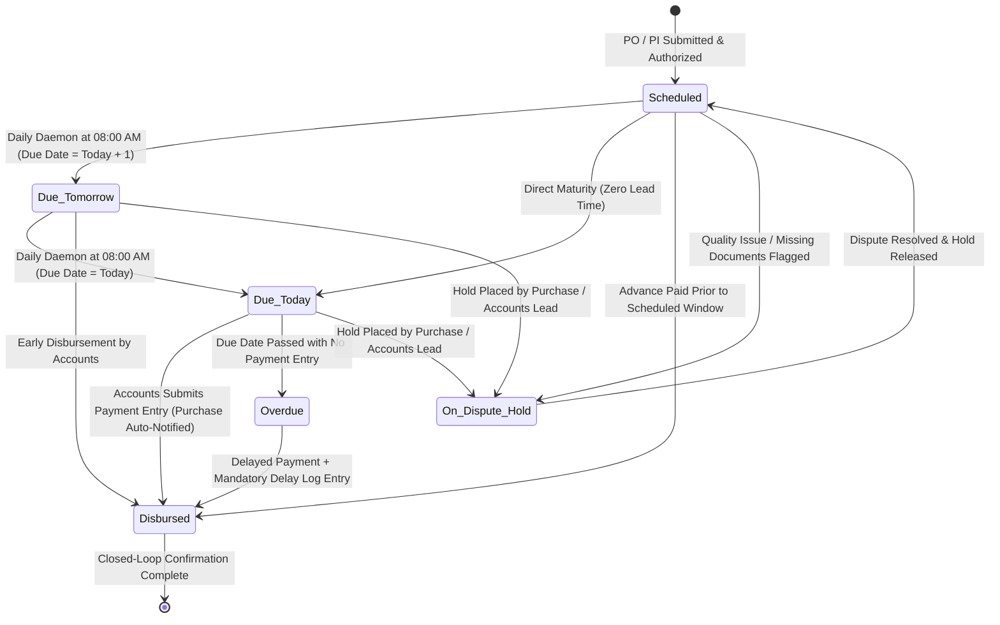

# Enterprise Lifecycle Step Specification: Joint Vendor Payment Monitoring Workbench, Dual-Cadence Notification Engine (T-1 & T-0) & Closed-Loop Procurement Settlement Architecture

**Document ID:** `STEP-18-VENDOR-PAYMENT-WORKBENCH`  
**Lifecycle Flow:** Flow 2: SCM, Store, Purchase & Vendor Procurement Lifecycle (Step 07 of 08 / Global Step 18)  
**Governing Architecture:** [`architect_docs/02_STEP_PLANNING_SPECIFICATION_BLUEPRINT.md`](../architect_docs/02_STEP_PLANNING_SPECIFICATION_BLUEPRINT.md)  
**Architecture Decision Record:** [`docs/decisions/ADR-018-JOINT-VENDOR-PAYMENT-MONITORING-WORKBENCH.md`](../docs/decisions/ADR-018-JOINT-VENDOR-PAYMENT-MONITORING-WORKBENCH.md)  
**PRD / FRS Traceability:** [`planning_ref_docs/01_PROJECT_FOUNDATION_MODEL.md`](../planning_ref_docs/01_PROJECT_FOUNDATION_MODEL.md) (`BC-13`, `BC-14`), [`planning_ref_docs/03_TO_BE_BUSINESS_PROCESS.md`](../planning_ref_docs/03_TO_BE_BUSINESS_PROCESS.md) (`Step 07`), [`planning_ref_docs/04_GAP_ANALYSIS_FIT_GAP.md`](../planning_ref_docs/04_GAP_ANALYSIS_FIT_GAP.md) (`Gap #07`, `Gap #08`), [`planning_ref_docs/05_BUSINESS_REQUIREMENTS_DOCUMENT.md`](../planning_ref_docs/05_BUSINESS_REQUIREMENTS_DOCUMENT.md) (`BR-015`, `BR-017`, `BR-018`), [`planning_ref_docs/06_FUNCTIONAL_REQUIREMENTS_SPECIFICATION.md`](../planning_ref_docs/06_FUNCTIONAL_REQUIREMENTS_SPECIFICATION.md) (`FR-015`, `FR-017`, `FR-018`), [`planning_ref_docs/08_DATABASE_DESIGN_DOCUMENT.md`](../planning_ref_docs/08_DATABASE_DESIGN_DOCUMENT.md) (`Domain 4: FIN`, `Domain 7: SCM`), [`planning_ref_docs/09_API_DESIGN_AND_INTEGRATIONS.md`](../planning_ref_docs/09_API_DESIGN_AND_INTEGRATIONS.md) (`API 13`, `monitor_vendor_payments`), [`planning_ref_docs/10_UI_UX_SPECIFICATION.md`](../planning_ref_docs/10_UI_UX_SPECIFICATION.md) (`Screen 20`, `Vendor Payment Tracking Workbench`), [`planning_ref_docs/11_MODULE_FUNCTIONAL_DOCUMENTATION.md`](../planning_ref_docs/11_MODULE_FUNCTIONAL_DOCUMENTATION.md) (`MOD-17`), [`planning_ref_docs/12_GETMYERP_SOLAR_EPC_WHITEPAPER.md`](../planning_ref_docs/12_GETMYERP_SOLAR_EPC_WHITEPAPER.md) (Sec 2, 4.3)  
**Target Module:** `solar_module` / `manoj` (Extends ERPNext `tabPayment Schedule`, `tabPayment Entry`, `tabPurchase Order`, `tabPurchase Invoice`, `tabSolar Notification Settings`, `tabSolar SCM Settings`, and integrates `tabRemark-Delay Log`)  
**Author:** Principal Enterprise Architect  
**Status:** Ready for Implementation

---

## 1. Step Scope, Objectives & Context Traceability

### 1.1 Lifecycle Positioning & Context

Step 18 (**Joint Vendor Payment Monitoring Workbench, Dual-Cadence Notification Engine & Closed-Loop Procurement Settlement Architecture**) represents the definitive financial execution, multi-stakeholder operational collaboration, and cash liquidity coordination gateway within the **Solar EPC Procurement & Vendor Governance Lifecycle (Flow 2)**.

Positioned downstream of Step 15 ([`STEP_15_PURCHASE_ORDER_AUTHORIZATION_SPECIFICATION.md`](./STEP_15_PURCHASE_ORDER_AUTHORIZATION_SPECIFICATION.md), locking commercial terms and milestone tranches in `tabPurchase Order`), Step 16 ([`STEP_16_PURCHASE_RECEIPT_GRN_SPECIFICATION.md`](./STEP_16_PURCHASE_RECEIPT_GRN_SPECIFICATION.md), verifying physical cargo receipt in `tabPurchase Receipt`), and Step 17 ([`STEP_17_PURCHASE_INVOICE_3WAY_MATCH_SPECIFICATION.md`](./STEP_17_PURCHASE_INVOICE_3WAY_MATCH_SPECIFICATION.md), validating 3-way matching and recognizing General Ledger liabilities in `tabPurchase Invoice`), this step executes and monitors the actual disbursement of corporate funds against vendor obligations.

In turn, this step directly preconditions Step 19 (**Vendor Performance Rating Governance**, `tabVendor Rating`), where payment timeliness and commercial adherence metrics feed the final supplier evaluation engine.

```
┌──────────────────────────────────────────────────────────────────────────────────────────────────┐
│                                FLOW 2: SCM PROCUREMENT PIPELINE                                  │
├──────────────────────────────────────────────────────────────────────────────────────────────────┤
│                                                                                                  │
│   [Step 12: Store Material Request] ──▶ Requisitions from Site Indents / Low-Stock Buffer        │
│                 │                                                                                │
│                 ▼                                                                                │
│   [Step 13: Supplier RFQ Dispatch]  ──▶ Multi-vendor solicitation (≥ 3 Suppliers or Justified)   │
│                 │                                                                                │
│                 ▼                                                                                │
│   [Step 14: Quotation Comparison]   ──▶ Landed cost normalization, 100-pt scoring, Non-L1 gate   │
│                 │                                                                                │
│                 ▼                                                                                │
│   [Step 15: Purchase Order Placement] ─▶ 4-Tier authorization, milestone terms, delivery routing │
│                 │                                                                                │
│                 ▼                                                                                │
│   [Step 16: Multi-Location GRN]     ──▶ Store / Site / Purchase receipt, barcode SABB ingestion  │
│                 │                                                                                │
│                 ▼                                                                                │
│   [Step 17: Purchase Invoice 3-Way] ──▶ Admin-governed entry, 3-way match, liability recognized  │
│                 │                                                                                │
│                 ▼                                                                                │
│   ┌──────────────────────────────────────────────────────────────────────────────────────────┐   │
│   │             STEP 18: JOINT VENDOR PAYMENT MONITORING & NOTIFICATION WORKBENCH            │   │
│   ├──────────────────────────────────────────────────────────────────────────────────────────┤   │
│   │ 1. Unified Payment Obligation Normalization: PO Milestones + PI Credit Due Dates        │   │
│   │ 2. Dual-Cadence Proactive Alerts: Daily Celery/RQ daemon dispatches T-1 & T-0 reminders │   │
│   │ 3. Synchronized Dual Stakeholder Alerts: Notifies BOTH Purchase & Accounts teams        │   │
│   │ 4. Closed-Loop Settlement Broadcast: Payment Entry `on_submit` instantly alerts Purchase │   │
│   │ 5. Dedicated Upcoming Payment Sections: Rendered on Purchase Desk and Accounts Desk      │   │
│   │ 6. Milestone Prerequisite Verification Gates: Advance, LR, GRN, and Retention gates      │   │
│   │ 7. Statutory Compliance: Section 194Q TDS / 206C(1H) TCS deduction validation lock      │   │
│   │ 8. Executive Liquidity Management: Working capital projections by time horizon buckets   │   │
│   └──────────────────────────────────────────────────────────────────────────────────────────┘   │
│                 │                                                                                │
│                 ▼                                                                                │
│   [Step 19: Vendor Rating Scorecard] ──▶ Commercial adherence & payment reliability metrics      │
│                                                                                                  │
└──────────────────────────────────────────────────────────────────────────────────────────────────┘
```

### 1.2 Enterprise Objectives & Target KPIs

Step 18 resolves critical operational bottlenecks and delivers measurable business outcomes across the organization:

1. **Elimination of Supply Chain Holds (Target: 100% On-Time Tranche Release):**  
   Solar equipment manufacturers (Tier-1 PV module suppliers, inverter OEMs, transformer fabricators) enforce rigid dispatch locks until milestone funds clear their accounts. Proactive **T-1 (one day prior)** and **T-0 (day of payment)** alerts ensure payment vouchers are queued and released punctually, eliminating shipment delays.

2. **Total Elimination of Inter-Departmental Follow-Up Overhead (Target: 0 Phone Calls / Emails):**  
   Under legacy operations, the Procurement team constantly calls Accounts to confirm payment releases. Automated instant notification to the Purchase team upon `Payment Entry` submission provides immediate confirmation, complete with bank UTR numbers, amounts, and remaining balances.

3. **Prevention of Cash Leakage & Unverified Disbursements (Target: 0% Premature Payments):**  
   Enforces automated milestone prerequisite validation gates. Funds tied to equipment transit cannot be disbursed without a verified Transporter Lorry Receipt (LR) and inspection certificate; post-delivery tranches cannot be disbursed without a verified GRN and clean 3-way invoice match.

4. **Optimized Working Capital & Statutory Compliance (Target: 100% Tax Adherence):**  
   Provides Accounts with forward visibility into cash flow commitments broken down into daily, weekly, and 30-day liquidity buckets, while ensuring full adherence to Section 194Q TDS deductions (0.1% for cumulative purchases $> ₹50\text{L}$) and MSME 45-day statutory payment windows under Section 43B(h).

### 1.3 Upstream & Downstream Integration Traceability

- **Upstream Preconditions:**
  - Step 15 ([`STEP_15_PURCHASE_ORDER_AUTHORIZATION_SPECIFICATION.md`](./STEP_15_PURCHASE_ORDER_AUTHORIZATION_SPECIFICATION.md)): Populates `tabPayment Schedule` in `tabPurchase Order` with milestone categories (`Advance`, `Against LR`, `On Delivery/GRN`, `Retention`).
  - Step 16 ([`STEP_16_PURCHASE_RECEIPT_GRN_SPECIFICATION.md`](./STEP_16_PURCHASE_RECEIPT_GRN_SPECIFICATION.md)): Records physical dock receipt, sets `custom_grn_status = 'Completed'`, and provides proof of physical delivery.
  - Step 17 ([`STEP_17_PURCHASE_INVOICE_3WAY_MATCH_SPECIFICATION.md`](./STEP_17_PURCHASE_INVOICE_3WAY_MATCH_SPECIFICATION.md)): Completes line-level 3-way matching (`custom_3way_match_status = 'Match Passed'`), establishes General Ledger accounts payable liabilities, and populates `Purchase Invoice.payment_schedule`.
- **Downstream Successors:**
  - Step 19 (`STEP_19_VENDOR_RATING_SCORECARD_SPECIFICATION.md`): Consumes payment disbursement records and credit term adherence to compute the commercial score component (15% weighting) of the supplier's performance scorecard.
  - ERPNext Core General Ledger: Automatically debits `Creditors - SEPC` and credits corporate bank/cash accounts upon `Payment Entry` submission.

---

## 2. Stakeholders, Enterprise Actors & HRMS Role Mapping

In strict compliance with the **Zero "User" Suffix Rule** and the **Supreme Command (`Admin`) vs. Developer (`System Manager`) Role Separation Standard** ([`architect_docs/02_STEP_PLANNING_SPECIFICATION_BLUEPRINT.md`](../architect_docs/02_STEP_PLANNING_SPECIFICATION_BLUEPRINT.md)), all personas, Frappe system roles, and operational responsibilities are formally defined below.

### 2.1 Persona & Role Definition Matrix

| Business Persona / Operational Actor | Frappe System Role                     | HRMS Department               | HRMS Designation Standard     | Primary Responsibility & Step Scope                                                                                                               |
| :----------------------------------- | :------------------------------------- | :---------------------------- | :---------------------------- | :------------------------------------------------------------------------------------------------------------------------------------------------ |
| **Frontline Procurement Executive**  | `Purchase Assistant`                   | Procurement & SCM             | `Purchase Assistant`          | Monitors milestone due dates on POs; uploads and verifies milestone prerequisite documents (Transporter LR, FAT reports); nudges Accounts.        |
| **Procurement & SCM Lead**           | `Purchase Manager`                     | Procurement & SCM             | `Purchase Manager`            | Authorizes milestone release clearances; resolves vendor payment disputes; receives instant UTR payment confirmations.                            |
| **Accounts Payables Executive**      | `Accounts Assistant`                   | Finance & Accounts            | `Accounts Assistant`          | Reviews upcoming payment queues; verifies bank balances and TDS deductions; drafts and prepares `Payment Entry` vouchers.                         |
| **Finance Department Lead**          | `Accounts Manager`                     | Finance & Accounts            | `Finance Head / Controller`   | Reviews and submits `Payment Entry` vouchers; executes bank transfers; manages liquidity and cash flows; inherits junior authority.               |
| **Solar Project Field Engineer**     | `Project Engineer` / `Site Supervisor` | Engineering & Site Operations | `Field Engineer / Supervisor` | Confirms on-site civil/installation readiness; verifies equipment arrival for delivery milestone clearance.                                       |
| **Warehouse / Store Head**           | `Store Manager`                        | Store & Inventory             | `Warehouse Manager`           | Confirms dock receipt and GRN clearance; confirms unquarantined material status for post-delivery disbursements.                                  |
| **Solar EPC Director / Admin**       | `Admin`                                | Executive Management          | `Managing Director`           | Project supreme operational command; authorizes high-value payments ($> ₹50\text{L}$); manages `Solar Notification Settings` and delay approvals. |
| **Framework Supreme / Developer**    | `System Manager`                       | Information Technology        | `DevOps Engineer / Architect` | Frappe Developer Mode, Bench CLI, background RQ/Redis queue maintenance, schema fixtures, and IT plumbing. Supreme over `Admin`.                  |

### 2.2 Enterprise Permission Hierarchy (CRUD & Submit Governance)

| Operational Entity / Action                  |  `Purchase Assistant`   | `Purchase Manager`  |  `Accounts Assistant`   | `Accounts Manager`  | `Admin` (Project Supreme) | `System Manager` (Dev Supreme) |
| :------------------------------------------- | :---------------------: | :-----------------: | :---------------------: | :-----------------: | :-----------------------: | :----------------------------: |
| **Payment Schedule (View)**                  |       Full Access       |     Full Access     |       Full Access       |     Full Access     |        Full Access        |          Full Access           |
| **Payment Schedule (Prerequisite Sign-Off)** |   Yes (Upload LR/Doc)   |  Yes (Clear Gate)   |        View Only        |      View Only      |       Full Override       |          Full Access           |
| **Payment Entry (Create / Edit Draft)**      |        No Access        |      No Access      |         **Yes**         |       **Yes**       |        Full Access        |          Full Access           |
| **Payment Entry (Submit / Cancel)**          |        No Access        |      No Access      |        No Access        |  **Yes (<= ₹50L)**  |   **Yes (All Levels)**    |          Full Access           |
| **Vendor Payment Workbench (View)**          | **Yes (Purchase View)** | **Yes (Full View)** | **Yes (Accounts View)** | **Yes (Full View)** |      **Full Access**      |          Full Access           |
| **Nudge Accounts Team (API Trigger)**        |         **Yes**         |       **Yes**       |        No Access        |      No Access      |            Yes            |          Full Access           |
| **Place Milestone on Hold / Dispute**        |      Request Only       |       **Yes**       |      Request Only       |       **Yes**       |    **Yes (Override)**     |          Full Access           |
| **Solar Notification Settings (Edit)**       |        No Access        |      No Access      |        No Access        |      No Access      |      **Yes (Only)**       |          Full Access           |
| **Solar SCM Settings (Edit)**                |        No Access        |      No Access      |        No Access        |      No Access      |      **Yes (Only)**       |          Full Access           |
| **Remark-Delay Log (Write)**                 |       Own Records       |     Own Records     |       Own Records       |     Own Records     |        Full Access        |          Full Access           |

---

## 3. Relational Schema & 3NF Data Dictionary

Step 18 extends ERPNext standard core transactional models (`tabPayment Schedule`, `tabPayment Entry`, `tabPurchase Order`, `tabPurchase Invoice`) and introduces governance configurations within `tabSolar Notification Settings` and `tabSolar SCM Settings`. All entities strictly adhere to Third Normal Form (3NF) relational constraints with explicit B-Tree indexing.

### 3.1 Custom Field Extensions on `tabPayment Schedule`

The native ERPNext `tabPayment Schedule` child table (child of `Purchase Order` and `Purchase Invoice`) is extended to track solar milestone prerequisites, automated notification statuses, and settlement links:

| Fieldname                       | Label                      | Fieldtype      | Options / Target                                                                                                                       | Mandatory | Index | Description & Operational Rules                                                   |
| :------------------------------ | :------------------------- | :------------- | :------------------------------------------------------------------------------------------------------------------------------------- | :-------: | :---: | :-------------------------------------------------------------------------------- |
| `custom_milestone_type`         | Milestone Type             | `Select`       | `Advance (Pre-Dispatch)\nAgainst LR / Inspection\nOn Delivery (GRN)\nInvoice Credit Period\nRetention / PBG Release\nOther Commercial` |    Yes    |   1   | Standardized milestone classification for solar procurement contracts.            |
| `custom_prerequisite_required`  | Prerequisite Required      | `Select`       | `None\nSigned PO\nTransporter LR & FAT Report\nSubmitted GRN\nPassed 3-Way Match\nGrid Synchronization COD`                            |    Yes    |   0   | Specifies the mandatory operational event required before funds can be disbursed. |
| `custom_prerequisite_satisfied` | Prerequisite Satisfied     | `Check`        | -                                                                                                                                      |    No     |   1   | Boolean flag set programmatically when prerequisite condition is verified.        |
| `custom_prerequisite_doc_ref`   | Prerequisite Doc Reference | `Dynamic Link` | `custom_prerequisite_doc_type`                                                                                                         |    No     |   0   | Reference to verified document (e.g. `PR-2026-00042`, `LNS-2026-00012`).          |
| `custom_prerequisite_doc_type`  | Prerequisite DocType       | `Link`         | `DocType`                                                                                                                              |    No     |   0   | Target DocType for dynamic reference (`Purchase Receipt`, etc.).                  |
| `custom_notification_t1_sent`   | T-1 Reminder Sent          | `Check`        | -                                                                                                                                      |    No     |   1   | Set to 1 by the background notification daemon once T-1 alert is sent.            |
| `custom_notification_t1_time`   | T-1 Sent Timestamp         | `Datetime`     | -                                                                                                                                      |    No     |   0   | Audit timestamp of T-1 reminder dispatch.                                         |
| `custom_notification_t0_sent`   | T-0 Reminder Sent          | `Check`        | -                                                                                                                                      |    No     |   1   | Set to 1 by the background notification daemon once T-0 alert is sent.            |
| `custom_notification_t0_time`   | T-0 Sent Timestamp         | `Datetime`     | -                                                                                                                                      |    No     |   0   | Audit timestamp of T-0 reminder dispatch.                                         |
| `custom_settlement_status`      | Settlement Status          | `Select`       | `Scheduled\nDue Tomorrow\nDue Today\nOverdue\nDisbursed\nOn Dispute Hold`                                                              |    Yes    |   1   | Dynamic operational state managed by daemon and settlement observer.              |
| `custom_linked_payment_entry`   | Linked Payment Entry       | `Link`         | `Payment Entry`                                                                                                                        |    No     |   1   | Foreign key linking the disbursed payment entry to the milestone schedule row.    |
| `custom_hold_reason`            | Hold Reason                | `Small Text`   | -                                                                                                                                      |    No     |   0   | Explanatory note if milestone is flagged as `On Dispute Hold`.                    |

### 3.2 Custom Field Extensions on `tabPayment Entry`

ERPNext's native `tabPayment Entry` is extended to capture solar procurement references and closed-loop notification metadata:

| Fieldname                       | Label                     | Fieldtype    | Options / Target | Mandatory | Index | Description & Operational Rules                                          |
| :------------------------------ | :------------------------ | :----------- | :--------------- | :-------: | :---: | :----------------------------------------------------------------------- |
| `custom_po_milestone_ref`       | PO Milestone Schedule Row | `Data`       | -                |    No     |   1   | Row ID (`name`) of linked `tabPayment Schedule` row in source PO.        |
| `custom_solar_project_ref`      | Solar Project Code        | `Link`       | `Project`        |    No     |   1   | Linked solar EPC project code for project cash flow tracking.            |
| `custom_purchase_team_notified` | Purchase Team Notified    | `Check`      | -                |    No     |   1   | Set to 1 when the automated post-payment settlement alert is dispatched. |
| `custom_purchase_notified_at`   | Purchase Notified At      | `Datetime`   | -                |    No     |   0   | Timestamp when notification was delivered to the Purchase team.          |
| `custom_bank_utr_no`            | Bank UTR / Ref No         | `Data`       | -                |    No     |   1   | Bank transaction reference / UTR number entered by Accounts.             |
| `custom_disbursement_remarks`   | Disbursement Remarks      | `Small Text` | -                |    No     |   0   | Operational notes shared directly with the Purchase team.                |

### 3.3 Custom Field Extensions on `tabSolar Notification Settings`

To give `Admin` (Project Supreme Command) full operational authority over automated alert behaviors without editing code:

| Fieldname                               | Label                                     | Fieldtype |     Default      | Description & Governance Rules                                                |
| :-------------------------------------- | :---------------------------------------- | :-------- | :--------------: | :---------------------------------------------------------------------------- |
| `notify_vendor_payment_t_minus_1`       | Enable T-1 Payment Reminder (Day Before)  | `Check`   |        1         | Toggles morning alert to Purchase & Accounts 24h prior to milestone due date. |
| `notify_vendor_payment_t_zero`          | Enable T-0 Payment Reminder (Payment Day) | `Check`   |        1         | Toggles morning urgent alert to Purchase & Accounts on payment due date.      |
| `notify_purchase_on_payment_settlement` | Enable Instant Purchase Settlement Alert  | `Check`   |        1         | Toggles real-time alert to Purchase team upon `Payment Entry` submission.     |
| `vendor_payment_notification_hour`      | Daily Daemon Execution Hour (24h)         | `Int`     |        8         | Scheduled hour of day (default 08:00 AM) when daily cron runs.                |
| `vendor_payment_alert_channels`         | Active Alert Channels                     | `Select`  | `System & Email` | Options: `System In-App Only`, `System & Email`, `System, Email & WhatsApp`.  |

### 3.4 Relational Composite Indexes (Database Performance)

To guarantee sub-millisecond query performance during high-frequency daemon scans and workbench loading:

```sql
-- Composite index for T-1 / T-0 daily daemon scan on Payment Schedule
CREATE INDEX IF NOT EXISTS idx_payment_schedule_due_status
ON `tabPayment Schedule` (parenttype, due_date, custom_settlement_status);

-- Composite index for fast supplier payment workbench lookups
CREATE INDEX IF NOT EXISTS idx_payment_entry_supplier_party
ON `tabPayment Entry` (party_type, party, docstatus, posting_date);

-- Composite index for milestone tracking by project
CREATE INDEX IF NOT EXISTS idx_payment_entry_project_milestone
ON `tabPayment Entry` (custom_solar_project_ref, custom_po_milestone_ref);
```

---

## 4. State Machine, Verification Gates & Dual-Timer Notification Engine

### 4.1 Payment Obligation Lifecycle State Machine

Each payment obligation (originating from a PO milestone or PI credit schedule) transitions through an enforced, audited state lifecycle:



### 4.2 Hard Verification Gates

Before an obligation can be processed into a submitted `Payment Entry`, the system validates three non-negotiable verification gates:

#### Gate 1: Milestone Prerequisite Verification Gate

- **Assertion:** A payment entry cannot be submitted for a milestone if its operational prerequisite is unfulfilled.
- **Rules by Milestone Type:**
  - `Advance (Pre-Dispatch)`: Requires linked `Purchase Order` to be in `Submitted` status (`docstatus = 1`).
  - `Against LR / Inspection`: Requires `custom_prerequisite_satisfied = 1` with a valid, uploaded Transporter Lorry Receipt (LR) document attachment and passed Factory Acceptance Test (FAT) inspection sign-off.
  - `On Delivery (GRN)`: Requires linked `tabPurchase Receipt` to be in `Submitted` status and `custom_3way_match_status = 'Match Passed'` from Step 17.
  - `Retention / PBG Release`: Requires either linked `tabLiaisoning And Synchronization` to have achieved `Stage 10 Grid Synchronization COD` or a verified Performance Bank Guarantee document attached.
- **Enforcement:** `PaymentEntryValidationService.validate_prerequisites(doc)` raises `frappe.ValidationError` if any required operational condition is unmet.

#### Gate 2: Statutory Tax Compliance Gate (TDS u/s 194Q)

- **Assertion:** Verifies compliance with Indian Finance Act Section 194Q.
- **Rule:** If the aggregate procurement value from the target supplier exceeds ₹50,00,000 in the current fiscal year, the system asserts that a TDS deduction item (0.1% or applicable surcharge rate) is present in the `Payment Entry` deductions table, or that a valid Lower Deduction Certificate under Section 197 is attached to the `Supplier Master`.

#### Gate 3: Verified Supplier Bank Details Gate

- **Assertion:** Funds must not be wired to unverified or newly altered bank accounts.
- **Rule:** The destination bank account and IFSC code specified in `Payment Entry` must match an active, verified `Bank Account` record linked to the `Supplier` with `custom_is_verified = 1`. Any alteration within 48 hours requires dual authorization by `Admin` and `Accounts Manager`.

---

## 5. Controller Logic, Domain Services & Whitelisted APIs

In strict adherence to SOLID architecture and the pure domain service pattern ([`architect_docs/05_DESIGN_PATTERNS_DOMAIN_SERVICES_SOLID.md`](../architect_docs/05_DESIGN_PATTERNS_DOMAIN_SERVICES_SOLID.md)), all business calculations, notifications, and workflow logic are decoupled into standalone domain service classes.

### 5.1 Domain Service Layer Architecture

```
solar_module/
└── sitemanagement/
    └── domain/
        ├── vendor_payment_schedule_service.py     # Obligation extraction & normalization
        ├── vendor_payment_notification_daemon.py  # Daily T-1 and T-0 notification daemon
        ├── vendor_payment_settlement_service.py   # Closed-loop Payment Entry observer hook
        └── vendor_payment_workbench_service.py    # Dual-workspace aggregation & metrics
```

#### 1. `VendorPaymentNotificationDaemon` (Proactive Daily Alerts)

```python
# solar_module/sitemanagement/domain/vendor_payment_notification_daemon.py

import frappe
from frappe import _
from frappe.utils import nowdate, add_days, getdate, format_date

class VendorPaymentNotificationDaemon:
    """
    Scheduled daemon executing daily (default 08:00 AM) to evaluate all open
    vendor payment obligations and dispatch synchronized T-1 and T-0 alerts
    to both Purchase and Accounts teams.
    """

    @classmethod
    def execute_daily_evaluations(cls):
        settings = frappe.get_cached_doc("Solar Notification Settings")
        today = getdate(nowdate())
        tomorrow = add_days(today, 1)

        # 1. Evaluate T-1 Day Reminders (Due Tomorrow)
        if settings.notify_vendor_payment_t_minus_1:
            cls._process_reminders_for_date(
                target_date=tomorrow,
                reminder_type="T-1",
                flag_field="custom_notification_t1_sent",
                timestamp_field="custom_notification_t1_time"
            )

        # 2. Evaluate T-0 Day Reminders (Due Today)
        if settings.notify_vendor_payment_t_zero:
            cls._process_reminders_for_date(
                target_date=today,
                reminder_type="T-0",
                flag_field="custom_notification_t0_sent",
                timestamp_field="custom_notification_t0_time"
            )

        # 3. Update Overdue States
        cls._mark_overdue_obligations(today)

    @classmethod
    def _process_reminders_for_date(cls, target_date, reminder_type: str, flag_field: str, timestamp_field: str):
        # Query open payment schedule rows across Purchase Orders and Purchase Invoices
        query = """
            SELECT
                ps.name AS schedule_row_id,
                ps.parent AS parent_doc,
                ps.parenttype AS parent_type,
                ps.due_date,
                ps.payment_amount,
                ps.custom_milestone_type,
                ps.custom_prerequisite_satisfied,
                parent_tab.supplier,
                parent_tab.company,
                parent_tab.custom_project_ref
            FROM `tabPayment Schedule` ps
            INNER JOIN `tab{parent_type}` parent_tab ON parent_tab.name = ps.parent
            WHERE ps.parenttype IN ('Purchase Order', 'Purchase Invoice')
              AND ps.due_date = %(target_date)s
              AND ps.{flag_field} = 0
              AND ps.custom_settlement_status NOT IN ('Disbursed', 'On Dispute Hold')
              AND parent_tab.docstatus = 1
        """

        for p_type in ["Purchase Order", "Purchase Invoice"]:
            formatted_query = query.replace("{parent_type}", p_type)
            records = frappe.db.sql(formatted_query, {"target_date": target_date}, as_dict=True)

            for row in records:
                cls._dispatch_dual_notifications(row, reminder_type)
                frappe.db.set_value("Payment Schedule", row.schedule_row_id, {
                    flag_field: 1,
                    timestamp_field: frappe.utils.now_datetime(),
                    "custom_settlement_status": "Due Tomorrow" if reminder_type == "T-1" else "Due Today"
                }, update_modified=False)

    @classmethod
    def _dispatch_dual_notifications(cls, row: dict, reminder_type: str):
        urgency = "URGENT: " if reminder_type == "T-0" else "UPCOMING: "
        subject = _("{0} Supplier Payment Due {1}: {2} (INR {3:,.2f})").format(
            urgency,
            "TODAY" if reminder_type == "T-0" else "TOMORROW",
            row.supplier,
            row.payment_amount
        )

        message = _(
            "<b>Vendor Payment Reminder ({0})</b><br>"
            "<b>Supplier:</b> {1}<br>"
            "<b>Milestone:</b> {2}<br>"
            "<b>Amount:</b> INR {3:,.2f}<br>"
            "<b>Due Date:</b> {4}<br>"
            "<b>Document:</b> {5} ({6})<br>"
            "<b>Project:</b> {7}<br>"
            "<b>Prerequisite Satisfied:</b> {8}"
        ).format(
            reminder_type,
            row.supplier,
            row.custom_milestone_type or "General Due Date",
            row.payment_amount,
            format_date(row.due_date),
            row.parent_doc,
            row.parent_type,
            row.custom_project_ref or "Central Inventory",
            "YES" if row.custom_prerequisite_satisfied else "NO (Action Required)"
        )

        # Retrieve recipients for BOTH Purchase and Accounts teams
        recipients = cls._get_stakeholder_recipients(row)
        for user_id in recipients:
            frappe.get_doc({
                "doctype": "Notification Log",
                "subject": subject,
                "email_content": message,
                "for_user": user_id,
                "type": "Alert",
                "document_type": row.parent_type,
                "document_name": row.parent_doc
            }).insert(ignore_permissions=True)

    @classmethod
    def _get_stakeholder_recipients(cls, row: dict) -> set:
        """Collects email/user IDs for designated Purchase and Accounts personnel."""
        users = set()
        # 1. Accounts Team
        accounts_users = frappe.get_all("Has Role", filters={"role": ["in", ["Accounts Manager", "Accounts Assistant"]]}, fields=["parent"])
        users.update([u.parent for u in accounts_users])

        # 2. Purchase Team
        purchase_users = frappe.get_all("Has Role", filters={"role": ["in", ["Purchase Manager", "Purchase Assistant"]]}, fields=["parent"])
        users.update([u.parent for u in purchase_users])

        # 3. Include Project Engineer if project-specific
        if row.get("custom_project_ref"):
            proj_user = frappe.db.get_value("Project", row["custom_project_ref"], "custom_project_engineer")
            if proj_user:
                users.add(proj_user)

        return users

    @classmethod
    def _mark_overdue_obligations(cls, today):
        frappe.db.sql("""
            UPDATE `tabPayment Schedule`
            SET custom_settlement_status = 'Overdue'
            WHERE due_date < %(today)s
              AND custom_settlement_status NOT IN ('Disbursed', 'On Dispute Hold', 'Overdue')
        """, {"today": today})
```

#### 2. `VendorPaymentSettlementService` (Closed-Loop Settlement Observer)

```python
# solar_module/sitemanagement/domain/vendor_payment_settlement_service.py

import frappe
from frappe import _
from frappe.utils import format_date

class VendorPaymentSettlementService:
    """
    Event-driven observer bound to `Payment Entry.on_submit`.
    Automatically reconciles payment milestones and dispatches instant
    closed-loop settlement notifications to the Purchase Team.
    """

    @classmethod
    def on_payment_submitted(cls, doc):
        # Only execute for outgoing supplier payments
        if doc.payment_type != "Pay" or doc.party_type != "Supplier":
            return

        supplier = doc.party
        paid_amount = doc.paid_amount
        reference_no = doc.reference_no or doc.name
        posting_date = doc.posting_date

        for ref in doc.references:
            if ref.reference_doctype == "Purchase Order":
                cls._handle_po_disbursement(doc, ref)
            elif ref.reference_doctype == "Purchase Invoice":
                cls._handle_pi_disbursement(doc, ref)

    @classmethod
    def _handle_po_disbursement(cls, doc, ref):
        po_doc = frappe.get_doc("Purchase Order", ref.reference_name)

        # Link payment entry to matching payment schedule row
        schedule_updated = False
        for row in po_doc.payment_schedule:
            if row.custom_settlement_status != "Disbursed" and not schedule_updated:
                row.custom_settlement_status = "Disbursed"
                row.custom_linked_payment_entry = doc.name
                schedule_updated = True

        po_doc.flags.ignore_validate_update_after_submit = True
        po_doc.save(ignore_permissions=True)

        # Notify Purchase Team immediately
        cls._broadcast_settlement_to_purchase(
            doc=doc,
            parent_type="Purchase Order",
            parent_name=ref.reference_name,
            supplier=doc.party,
            allocated_amount=ref.allocated_amount,
            remaining_balance=ref.outstanding_amount,
            project_code=po_doc.get("custom_project_ref")
        )

    @classmethod
    def _handle_pi_disbursement(cls, doc, ref):
        pi_doc = frappe.get_doc("Purchase Invoice", ref.reference_name)

        schedule_updated = False
        for row in pi_doc.payment_schedule:
            if row.custom_settlement_status != "Disbursed" and not schedule_updated:
                row.custom_settlement_status = "Disbursed"
                row.custom_linked_payment_entry = doc.name
                schedule_updated = True

        pi_doc.flags.ignore_validate_update_after_submit = True
        pi_doc.save(ignore_permissions=True)

        cls._broadcast_settlement_to_purchase(
            doc=doc,
            parent_type="Purchase Invoice",
            parent_name=ref.reference_name,
            supplier=doc.party,
            allocated_amount=ref.allocated_amount,
            remaining_balance=ref.outstanding_amount,
            project_code=pi_doc.get("custom_project_ref")
        )

    @classmethod
    def _broadcast_settlement_to_purchase(cls, doc, parent_type: str, parent_name: str, supplier: str, allocated_amount: float, remaining_balance: float, project_code: str):
        settings = frappe.get_cached_doc("Solar Notification Settings")
        if not settings.notify_purchase_on_payment_settlement:
            return

        subject = _("✔ Payment Completed: {0} for {1} (INR {2:,.2f})").format(
            parent_name, supplier, allocated_amount
        )

        message = _(
            "<b>Vendor Payment Completed by Accounts</b><br>"
            "<b>Supplier:</b> {0}<br>"
            "<b>Reference Document:</b> {1} ({2})<br>"
            "<b>Disbursed Amount:</b> INR {3:,.2f}<br>"
            "<b>Bank UTR / Ref No:</b> {4}<br>"
            "<b>Payment Mode:</b> {5}<br>"
            "<b>Instrument Date:</b> {6}<br>"
            "<b>Remaining Balance:</b> INR {7:,.2f}<br>"
            "<b>Payment Voucher:</b> {8}<br>"
            "<i>Procurement team may proceed with supplier dispatch clearance.</i>"
        ).format(
            supplier,
            parent_name,
            parent_type,
            allocated_amount,
            doc.reference_no or "Direct Bank Transfer",
            doc.mode_of_payment,
            format_date(doc.posting_date),
            remaining_balance,
            doc.name
        )

        # Target specifically the Purchase Team and Project Engineer
        purchase_users = frappe.get_all("Has Role", filters={"role": ["in", ["Purchase Manager", "Purchase Assistant"]]}, fields=["parent"])
        recipients = {u.parent for u in purchase_users}

        if project_code:
            eng = frappe.db.get_value("Project", project_code, "custom_project_engineer")
            if eng:
                recipients.add(eng)

        for user_id in recipients:
            frappe.get_doc({
                "doctype": "Notification Log",
                "subject": subject,
                "email_content": message,
                "for_user": user_id,
                "type": "Alert",
                "document_type": "Payment Entry",
                "document_name": doc.name
            }).insert(ignore_permissions=True)

        doc.db_set("custom_purchase_team_notified", 1)
        doc.db_set("custom_purchase_notified_at", frappe.utils.now_datetime())
```

### 5.2 Whitelisted API Endpoints

All client-facing mutations and dashboard queries are exposed via strictly whitelisted RPC endpoints with HTTP method enforcement and defensive permission validation:

```python
# solar_module/api/payment_monitoring.py

import json
import frappe
from frappe import _
from frappe.utils import nowdate, add_days

@frappe.whitelist(methods=["POST"])
def get_upcoming_vendor_payments(department: str = "Purchase", time_horizon_days: int = 30) -> dict:
    """
    Retrieves normalized upcoming payment obligations for display in
    the Purchase Desk or Accounts Desk sections.
    """
    frappe.has_permission("Purchase Order", "read", throw=True)
    today = nowdate()
    future_date = add_days(today, int(time_horizon_days))

    query = """
        SELECT
            ps.name AS milestone_id,
            ps.parent AS parent_doc,
            ps.parenttype AS parent_type,
            ps.due_date,
            ps.payment_amount,
            ps.custom_milestone_type,
            ps.custom_prerequisite_required,
            ps.custom_prerequisite_satisfied,
            ps.custom_settlement_status,
            p.supplier,
            p.custom_project_ref AS project,
            sup.supplier_name
        FROM `tabPayment Schedule` ps
        INNER JOIN `tabPurchase Order` p ON p.name = ps.parent AND ps.parenttype = 'Purchase Order'
        INNER JOIN `tabSupplier` sup ON sup.name = p.supplier
        WHERE ps.due_date BETWEEN %(today)s AND %(future_date)s
          AND ps.custom_settlement_status != 'Disbursed'
          AND p.docstatus = 1
        ORDER BY ps.due_date ASC
    """

    obligations = frappe.db.sql(query, {"today": today, "future_date": future_date}, as_dict=True)

    summary = {
        "due_today_count": sum(1 for o in obligations if str(o.due_date) == str(today)),
        "due_today_amount": sum(o.payment_amount for o in obligations if str(o.due_date) == str(today)),
        "due_tomorrow_count": sum(1 for o in obligations if str(o.due_date) == str(add_days(today, 1))),
        "due_tomorrow_amount": sum(o.payment_amount for o in obligations if str(o.due_date) == str(add_days(today, 1))),
        "total_upcoming_amount": sum(o.payment_amount for o in obligations),
        "obligations": obligations
    }
    return summary

@frappe.whitelist(methods=["POST"])
def nudge_accounts_team(milestone_id: str, urgency_note: str) -> dict:
    """
    Allows a Purchase Assistant or Manager to send an expedited disbursement
    nudge to the Accounts team for a milestone blocking supplier dispatch.
    """
    doc = frappe.get_doc("Payment Schedule", milestone_id)
    parent_doc = frappe.get_doc(doc.parenttype, doc.parent)
    parent_doc.check_permission("read")

    sender = frappe.session.user
    accounts_users = frappe.get_all("Has Role", filters={"role": "Accounts Manager"}, fields=["parent"])

    subject = _("⚡ Procurement Priority Nudge: Payment Needed for {0}").format(parent_doc.supplier)
    message = _(
        "<b>Procurement Nudge from {0}</b><br>"
        "<b>Supplier:</b> {1}<br>"
        "<b>Milestone:</b> {2} (INR {3:,.2f})<br>"
        "<b>Reference:</b> {4}<br>"
        "<b>Note from Purchase:</b> {5}<br>"
        "<i>Supplier is holding dispatch pending payment clearance.</i>"
    ).format(sender, parent_doc.supplier, doc.custom_milestone_type, doc.payment_amount, parent_doc.name, urgency_note)

    for acc_user in accounts_users:
        frappe.get_doc({
            "doctype": "Notification Log",
            "subject": subject,
            "email_content": message,
            "for_user": acc_user.parent,
            "type": "Alert",
            "document_type": doc.parenttype,
            "document_name": doc.parent
        }).insert(ignore_permissions=True)

    return {"status": "success", "message": _("Accounts team notified successfully")}
```

---

## 6. Frontend UI/UX Specification (Purchase Desk, Accounts Desk & Joint Workbench)

### 6.1 Purchase Workspace Upcoming Payments Section (`/solar/procurement`)

In the Vue 3 + Frappe UI SPA (`/solar`), the Procurement dashboard provides a dedicated card section engineered around **logistics readiness and dispatch blockers**:

```
┌──────────────────────────────────────────────────────────────────────────────────────────────────┐
│ ▼ UPCOMING SUPPLIER MILESTONE PAYMENTS (PURCHASE DESK)                 [Filter: Next 14 Days ▼] │
├──────────────────────────────────────────────────────────────────────────────────────────────────┤
│ Summary: 3 Due Today (₹18.4L) | 2 Due Tomorrow (₹6.5L) | 1 Dispatched Today (₹42.0L)            │
├──────────────────────────────────────────────────────────────────────────────────────────────────┤
│ Supplier Name       Milestone Type      Amount (INR)   Due Date    Prerequisites     Action      │
│ ─────────────────   ─────────────────   ────────────   ──────────  ───────────────   ──────────  │
│ Waaree Energies     Advance (15%)       ₹14,25,000.00  TODAY       [✔ PO Signed]     [Nudge]     │
│ Sungrow Inverters   Against LR (70%)    ₹18,50,000.00  TOMORROW    [✔ LR Uploaded]   [Details]   │
│ Tata Power Solar    Post-GRN (10%)       ₹4,20,000.00  2026-09-28  [✔ 3-Way Match]   [Details]   │
│ Rayzon Solar        Retention (5%)       ₹2,10,000.00  2026-10-15  [⏳ Pending COD]   [Hold]     │
└──────────────────────────────────────────────────────────────────────────────────────────────────┘
```

- **Traffic Light Indicators:** Green badge when prerequisite documents (PO, LR, GRN, 3-Way Match) are satisfied; amber when awaiting inspection report or delivery note.
- **`[Nudge Accounts]` Action Button:** Opens a modal allowing Purchase to attach dispatch urgency notes, triggering an instant priority push notification to `Accounts Manager`.

### 6.2 Accounts Workspace Upcoming Payments Section (`/solar/accounts`)

The Accounts dashboard presents a dedicated card section engineered around **liquidity management, due-date maturity, and payment voucher generation**:

```
┌──────────────────────────────────────────────────────────────────────────────────────────────────┐
│ ▼ UPCOMING VENDOR DISBURSEMENTS (FINANCE & ACCOUNTS)                  [View: Liquidity Horizon ▼]│
├──────────────────────────────────────────────────────────────────────────────────────────────────┤
│ Cash Forecast: Today: ₹18.40L | Tomorrow: ₹6.50L | This Week: ₹54.20L | 30-Day Total: ₹1.82 Cr   │
├──────────────────────────────────────────────────────────────────────────────────────────────────┤
│ Supplier Name       Document Ref   TDS (194Q)    Net Payable     Due Status       Action         │
│ ─────────────────   ────────────   ──────────    ───────────     ───────────      ────────────── │
│ Waaree Energies     PO-2026-0012   ₹1,425.00     ₹14,23,575.00   [DUE TODAY]      [Pay Now]      │
│ Sungrow Inverters   PO-2026-0015   ₹1,850.00     ₹18,48,150.00   [DUE TOMORROW]   [Prepare Entry]│
│ Polycab India Ltd   PI-2026-0089     ₹450.00      ₹4,49,550.00   [Due in 4 Days]  [Schedule]     │
└──────────────────────────────────────────────────────────────────────────────────────────────────┘
```

- **`[Pay Now]` Action Button:** Launches a pre-filled `Payment Entry` creation dialog with Supplier, Bank Account, Party Type, Net Amount, and TDS deduction pre-calculated.
- **Settlement Execution:** Once submitted, the system automatically marks the milestone as `Disbursed` and triggers the instant notification to the Purchase team.

### 6.3 Joint Collaborative Vendor Payment Workbench (`/solar/procurement/payment-workbench`)

- **Full-Screen Interactive Grid:** Supports advanced filtering by Project Code, Equipment Category (Modules, Inverters, Structures, BoS), Milestone Category, and Settlement Status.
- **Audit Trail & Internal Notes:** Split side-drawer enabling real-time dialogue between Purchase and Accounts regarding specific payment milestones (e.g., explaining why a tranche is temporarily held or requesting bank UTR details).

---

## 7. Cross-App Integration Touchpoints

Step 18 establishes tightly coordinated data and process bridges across standard ERPNext and Frappe Framework modules:

```
┌──────────────────────────────────────────────────────────────────────────────────────────────────┐
│                             CROSS-APP INTEGRATION ARCHITECTURE                                   │
├──────────────────────────────────────────────────────────────────────────────────────────────────┤
│                                                                                                  │
│   [ERPNext Buying]              [ERPNext Accounts]            [Frappe Framework]                 │
│   • tabPurchase Order           • tabPayment Entry            • tabNotification Log              │
│   • tabPurchase Receipt         • tabPayment Schedule         • Redis / RQ Queues                │
│   • tabSupplier Master          • General Ledger (tabGL Entry)• Email & WhatsApp Broker          │
│          │                             │                             │                           │
│          └─────────────────────────────┼─────────────────────────────┘                           │
│                                        ▼                                                         │
│                   [Step 18: Joint Vendor Payment Workbench]                                      │
│                                        │                                                         │
│                                        ▼                                                         │
│                   [Step 19: Vendor Rating Scorecard (15% Weight)]                                │
│                   Feeds commercial payment and credit adherence metrics                          │
│                                                                                                  │
└──────────────────────────────────────────────────────────────────────────────────────────────────┘
```

1. **ERPNext Core Accounts (`tabPayment Entry` & `tabPayment Schedule`):**
   - Automatically synchronizes payment allocation amounts against child schedule rows.
   - Posts balanced credit/debit movements to the General Ledger (`Bank Account` credit, `Creditors` debit).
2. **Frappe Notification Engine (`tabNotification Log`):**
   - Generates in-app popups, unread badge counters, and mobile notification tray items for all assigned roles.
   - Formats transactional HTML email alerts dished through system background queues.
3. **Frappe HRMS (`tabEmployee` & `tabDepartment`):**
   - Resolves role assignments to specific employees within the `Procurement & SCM` and `Finance & Accounts` departments.

---

## 8. Automated Testing & QA Criteria

In strict accordance with [`architect_docs/07_AUTOMATED_TESTING_QA_CI_CD.md`](../architect_docs/07_AUTOMATED_TESTING_QA_CI_CD.md), the entire test suite inherits from `frappe.tests.utils.FrappeTestCase` or modern `frappe.testing.IntegrationTestCase`.

### 8.1 The Zero-Commit Rule

- **Mandatory Assertion:** Zero test routines execute `frappe.db.commit()`.
- Every test runs in an isolated transaction wrapped by the test runner, guaranteeing automatic rollback (`frappe.db.rollback()`) and complete database cleanliness.

### 8.2 Automated Test Suite Implementation

```python
# solar_module/tests/test_step_18_vendor_payment_workbench.py

import frappe
from frappe.tests.utils import FrappeTestCase
from frappe.utils import nowdate, add_days
from solar_module.sitemanagement.domain.vendor_payment_notification_daemon import VendorPaymentNotificationDaemon
from solar_module.sitemanagement.domain.vendor_payment_settlement_service import VendorPaymentSettlementService

class TestStep18VendorPaymentWorkbench(FrappeTestCase):

    def setUp(self):
        super().setUp()
        self._setup_test_prerequisites()

    def _setup_test_prerequisites(self):
        # Create test supplier
        if not frappe.db.exists("Supplier", "_Test Solar PV Supplier"):
            self.supplier = frappe.get_doc({
                "doctype": "Supplier",
                "supplier_name": "_Test Solar PV Supplier",
                "supplier_group": "Solar Hardware"
            }).insert(ignore_permissions=True)
        else:
            self.supplier = frappe.get_doc("Supplier", "_Test Solar PV Supplier")

    def test_01_daemon_dispatches_t1_notification(self):
        """Assert daemon dispatches T-1 alert one day before due date to both teams."""
        tomorrow = add_days(nowdate(), 1)

        # Create PO with payment milestone due tomorrow
        po = frappe.get_doc({
            "doctype": "Purchase Order",
            "supplier": self.supplier.name,
            "company": "_Test Company",
            "schedule_date": add_days(nowdate(), 10),
            "items": [{"item_code": "_Test Item", "qty": 10, "rate": 1000}],
            "payment_schedule": [{
                "due_date": tomorrow,
                "payment_amount": 10000,
                "custom_milestone_type": "Advance (Pre-Dispatch)",
                "custom_prerequisite_satisfied": 1
            }]
        }).insert(ignore_permissions=True)
        po.submit()

        # Run daemon
        VendorPaymentNotificationDaemon.execute_daily_evaluations()

        # Check flag updated on child row
        schedule_row = frappe.db.get_value(
            "Payment Schedule",
            {"parent": po.name, "due_date": tomorrow},
            ["custom_notification_t1_sent", "custom_settlement_status"],
            as_dict=True
        )
        self.assertEqual(schedule_row.custom_notification_t1_sent, 1)
        self.assertEqual(schedule_row.custom_settlement_status, "Due Tomorrow")

    def test_02_daemon_dispatches_t0_notification(self):
        """Assert daemon dispatches urgent T-0 alert on payment due date to both teams."""
        today = nowdate()

        po = frappe.get_doc({
            "doctype": "Purchase Order",
            "supplier": self.supplier.name,
            "company": "_Test Company",
            "schedule_date": add_days(nowdate(), 5),
            "items": [{"item_code": "_Test Item", "qty": 5, "rate": 2000}],
            "payment_schedule": [{
                "due_date": today,
                "payment_amount": 10000,
                "custom_milestone_type": "Against LR / Inspection",
                "custom_prerequisite_satisfied": 1
            }]
        }).insert(ignore_permissions=True)
        po.submit()

        VendorPaymentNotificationDaemon.execute_daily_evaluations()

        schedule_row = frappe.db.get_value(
            "Payment Schedule",
            {"parent": po.name, "due_date": today},
            ["custom_notification_t0_sent", "custom_settlement_status"],
            as_dict=True
        )
        self.assertEqual(schedule_row.custom_notification_t0_sent, 1)
        self.assertEqual(schedule_row.custom_settlement_status, "Due Today")

    def test_03_payment_entry_submission_alerts_purchase_team(self):
        """Assert submitting Payment Entry triggers instant settlement alert to Purchase."""
        po = frappe.get_doc({
            "doctype": "Purchase Order",
            "supplier": self.supplier.name,
            "company": "_Test Company",
            "schedule_date": add_days(nowdate(), 7),
            "items": [{"item_code": "_Test Item", "qty": 10, "rate": 5000}],
            "payment_schedule": [{
                "due_date": nowdate(),
                "payment_amount": 50000,
                "custom_milestone_type": "Advance (Pre-Dispatch)"
            }]
        }).insert(ignore_permissions=True)
        po.submit()

        # Accounts creates and submits Payment Entry
        pe = frappe.get_doc({
            "doctype": "Payment Entry",
            "payment_type": "Pay",
            "party_type": "Supplier",
            "party": self.supplier.name,
            "company": "_Test Company",
            "paid_amount": 50000,
            "received_amount": 50000,
            "paid_from": "_Test Bank - _TC",
            "paid_to": "Creditors - _TC",
            "reference_no": "UTR-TEST-998877",
            "references": [{
                "reference_doctype": "Purchase Order",
                "reference_name": po.name,
                "total_amount": 50000,
                "allocated_amount": 50000
            }]
        }).insert(ignore_permissions=True)
        pe.submit()

        # Assert post-payment settlement service updated notification flag
        pe_reloaded = frappe.get_doc("Payment Entry", pe.name)
        self.assertEqual(pe_reloaded.custom_purchase_team_notified, 1)

        # Assert PO payment schedule row updated to Disbursed
        po_schedule = frappe.db.get_value(
            "Payment Schedule",
            {"parent": po.name},
            ["custom_settlement_status", "custom_linked_payment_entry"],
            as_dict=True
        )
        self.assertEqual(po_schedule.custom_settlement_status, "Disbursed")
        self.assertEqual(po_schedule.custom_linked_payment_entry, pe.name)
```

---

## 9. Operational SOP, Error Resolution & Runbook

### 9.1 End-User Standard Operating Procedures (SOP)

#### For Purchase Assistant / Purchase Manager:

1. **Review Impending Obligations:** Open `/solar` and inspect the **Upcoming Supplier Milestone Payments** section.
2. **Verify Milestone Prerequisites:**
   - For _Advance Payments_, verify that the commercial PO is formally signed and authorized.
   - For _Dispatch Tranches_, verify that the vendor has uploaded the Transporter Lorry Receipt (LR) and Factory Inspection Certificate. Click `[Verify Prerequisite]`.
3. **Expedite Critical Shipments:** If a vendor holds factory loading pending advance clearance, click `[Nudge Accounts]`, input the dispatch urgency explanation, and submit.
4. **Receive Settlement Confirmation:** Upon Accounts executing payment, view the automated real-time popup containing the Bank UTR number. Issue the formal factory dispatch clearance to the supplier immediately.

#### For Accounts Assistant / Accounts Manager:

1. **Daily Liquidity Review:** At 08:00 AM, review automated T-1 and T-0 notification alerts and the **Upcoming Vendor Disbursements** section in the Accounts workspace.
2. **Prepare Payment Vouchers:** Click `[Pay Now]` directly on mature obligations. Verify bank balance, payee account details, and pre-calculated TDS deductions.
3. **Execute Bank Transfer:** Submit the `Payment Entry`, record the bank transaction reference/UTR number, and submit. The system will automatically notify the Purchase team and close the milestone.

### 9.2 Operational Error Resolution Matrix

| Error Condition / Message                                 | Root Cause                                                                                                                 | Operator Resolution Path                                                                                                         |
| :-------------------------------------------------------- | :------------------------------------------------------------------------------------------------------------------------- | :------------------------------------------------------------------------------------------------------------------------------- |
| `ValidationError: Prerequisite Unsatisfied for Milestone` | The milestone requires an operational document (e.g. Transporter LR or 3-Way Match) that has not been uploaded or cleared. | Purchase Assistant must upload the required prerequisite document or complete GRN inspection before Accounts can disburse funds. |
| `PermissionError: Not Authorized to Submit Payment Entry` | User lacks `Accounts Manager` or `Admin` role required to finalize disbursements.                                          | Submit payment voucher as Draft for approval by authorized `Accounts Manager`.                                                   |
| `Missing Bank Verification: Target Account Unverified`    | Supplier bank account details were altered within 48 hours or lack verification flag.                                      | `Admin` and `Accounts Manager` must verify bank proof (cancelled cheque) and enable `custom_is_verified = 1`.                    |
| `TDS Deduction Missing: Supplier Exceeds ₹50L Threshold`  | Section 194Q requires 0.1% TDS on cumulative purchases $> ₹50\text{L}$.                                                    | Add TDS deduction line to `Payment Entry` deductions table or attach Section 197 lower deduction certificate.                    |

### 9.3 L3 DevOps Runbook & Daemon Maintenance

1. **Verify Celery / Redis Background Worker Health:**

   ```bash
   # Check active background worker processes
   bench --site <site_name> doctor

   # Inspect Redis queue length for scheduled daemon tasks
   bench --site <site_name> show-pending-jobs
   ```

2. **Manual Execution of Payment Notification Daemon (Emergency Catch-Up):**
   ```bash
   # Execute daily evaluation daemon manually via bench console
   bench --site <site_name> execute solar_module.sitemanagement.domain.vendor_payment_notification_daemon.VendorPaymentNotificationDaemon.execute_daily_evaluations
   ```
3. **Audit Notification Dispatch Logs:**
   ```bash
   # Query database for notification logs generated today
   bench --site <site_name> mariadb -e "SELECT name, for_user, subject, creation FROM \`tabNotification Log\` WHERE creation >= CURDATE() AND subject LIKE '%Supplier Payment Due%' ORDER BY creation DESC LIMIT 10;"
   ```
