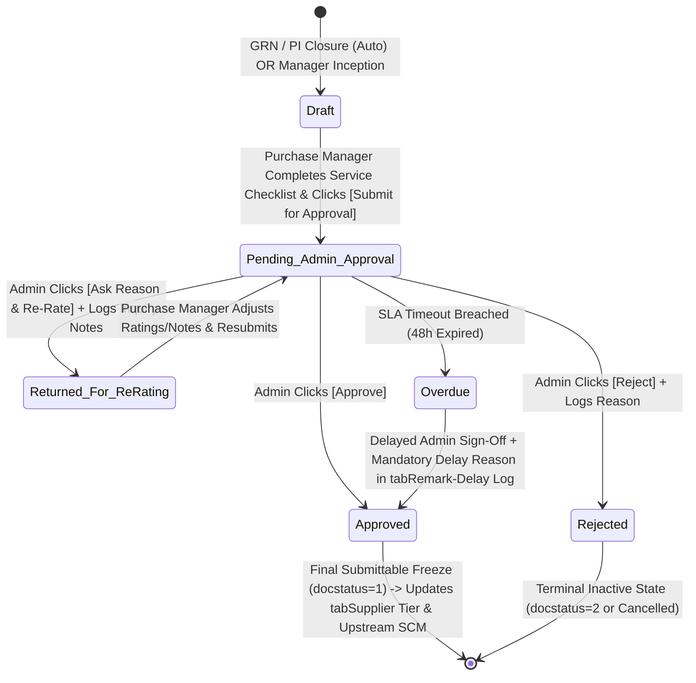

# STEP_19_VENDOR_RATING_SCORECARD_SPECIFICATION.md

# Enterprise Lifecycle Step Specification: Vendor Performance Rating Scorecard, 4-Factor Balanced Evaluation Engine & Two-Tier Admin Supreme Approval Architecture

**Document ID:** `STEP-19-VENDOR-RATING-SCORECARD`  
**Lifecycle Flow:** Flow 2: SCM, Store, Purchase & Vendor Procurement Lifecycle (Step 08 of 08 / Global Step 19)  
**Governing Architecture:** [`architect_docs/02_STEP_PLANNING_SPECIFICATION_BLUEPRINT.md`](../architect_docs/02_STEP_PLANNING_SPECIFICATION_BLUEPRINT.md)  
**Architecture Decision Record:** [`docs/decisions/ADR-019-VENDOR-PERFORMANCE-RATING-SCORECARD.md`](../docs/decisions/ADR-019-VENDOR-PERFORMANCE-RATING-SCORECARD.md)  
**PRD / FRS Traceability:** [`planning_ref_docs/01_PROJECT_FOUNDATION_MODEL.md`](../planning_ref_docs/01_PROJECT_FOUNDATION_MODEL.md) (`BC-15`), [`planning_ref_docs/03_TO_BE_BUSINESS_PROCESS.md`](../planning_ref_docs/03_TO_BE_BUSINESS_PROCESS.md) (`Step 08`), [`planning_ref_docs/04_GAP_ANALYSIS_FIT_GAP.md`](../planning_ref_docs/04_GAP_ANALYSIS_FIT_GAP.md) (`Gap #09`), [`planning_ref_docs/05_BUSINESS_REQUIREMENTS_DOCUMENT.md`](../planning_ref_docs/05_BUSINESS_REQUIREMENTS_DOCUMENT.md) (`BR-016`, `BR-017`, `BR-018`), [`planning_ref_docs/06_FUNCTIONAL_REQUIREMENTS_SPECIFICATION.md`](../planning_ref_docs/06_FUNCTIONAL_REQUIREMENTS_SPECIFICATION.md) (`FR-016`), [`planning_ref_docs/08_DATABASE_DESIGN_DOCUMENT.md`](../planning_ref_docs/08_DATABASE_DESIGN_DOCUMENT.md) (`Domain 5: SCM`), [`planning_ref_docs/09_API_DESIGN_AND_INTEGRATIONS.md`](../planning_ref_docs/09_API_DESIGN_AND_INTEGRATIONS.md) (`API 13`), [`planning_ref_docs/10_UI_UX_SPECIFICATION.md`](../planning_ref_docs/10_UI_UX_SPECIFICATION.md) (`Screen 20`), [`planning_ref_docs/11_MODULE_FUNCTIONAL_DOCUMENTATION.md`](../planning_ref_docs/11_MODULE_FUNCTIONAL_DOCUMENTATION.md) (`MOD-16`), [`planning_ref_docs/12_GETMYERP_SOLAR_EPC_WHITEPAPER.md`](../planning_ref_docs/12_GETMYERP_SOLAR_EPC_WHITEPAPER.md) (Sec 4.4)  
**Target Module:** `solar_module` / `manoj` (Introduces standalone submittable DocType `tabVendor Performance Rating`, child table `tabVendor Rating Item Breakdown`, child table `tabVendor Rating Service Checklist`, extends `tabSupplier`, extends `tabSolar SCM Settings`, integrates `tabRemark-Delay Log`)  
**Author:** Principal Enterprise Architect  
**Status:** Ready for Implementation

---

## 1. Step Scope, Objectives & Context Traceability

### 1.1 Lifecycle Positioning & Context

Step 19 constitutes the **culminating governance, supplier evaluation, and closed-loop feedback engine** of the SCM Procurement Pipeline (Flow 2). It transforms operational execution records across procurement, goods receipt, invoicing, and treasury into an empirical supplier scorecard under a **Two-Tier Collaborative Governance Model**:

1. **Tier 1 (Filling & Technical Review by Purchase Manager):** The `Purchase Manager` reviews automated transactional metrics (OTD, rejections, billing deviations), evaluates qualitative service responsiveness, and submits the scorecard for executive sign-off.
2. **Tier 2 (Admin Supreme Approval Cockpit & Notification):** Upon submission by the Purchase Manager, the system dispatches an instant real-time notification to the **`Admin`** (Project Supreme Command).
3. **The Admin Tri-Action Decision Gateway:** The Admin reviews the scorecard and executes one of three definitive actions:
   - **`Approve`**: Formally submits (`docstatus = 1`), permanently freezing the scorecard and updating the supplier's tier and rolling score on `tabSupplier`.
   - **`Reject`**: Marks the scorecard `Rejected` with mandatory rejection justification, leaving supplier status unchanged.
   - **`Ask for Reason & Re-Rate`**: Opens an inquiry dialog, records Admin feedback notes, transitions state to `Returned for Re-Rating`, increments revision counter, and sends an urgent notification back to the Purchase Manager to adjust and resubmit.

```
┌──────────────────────────────────────────────────────────────────────────────────────────────────┐
│                                FLOW 2: SCM PROCUREMENT PIPELINE                                  │
├──────────────────────────────────────────────────────────────────────────────────────────────────┤
│                                                                                                  │
│   [Step 12: Store Material Request] ──▶ Requisitions from Site Indents / Low-Stock Buffer        │
│                 │                                                                                │
│                 ▼                                                                                │
│   [Step 13: Supplier RFQ Dispatch]  ◀── Closed-Loop Feedback: Auto-Shortlists Tier 1 / Blocks     │
│                 │                       Blacklisted Suppliers                                    │
│                 ▼                                                                                │
│   [Step 14: Quotation Comparison]   ◀── Closed-Loop Feedback: Ingests Vendor Rating Score        │
│                 │                       as a 15% Weighted Landed Cost Parameter                  │
│                 ▼                                                                                │
│   [Step 15: Purchase Order Release] ──▶ Contractual Schedule Date, Rates & Milestone Terms       │
│                 │                                                                                │
│                 ▼                                                                                │
│   [Step 16: Multi-Location GRN]     ──▶ Actual Delivery Timestamp, Accepted/Rejected Qty, MTCs   │
│                 │                                                                                │
│                 ▼                                                                                │
│   [Step 17: Purchase Invoice Match] ──▶ Billed Rates, Unit Rate Variances, Statutory Tax Check   │
│                 │                                                                                │
│                 ▼                                                                                │
│   [Step 18: Payment Workbench]      ──▶ Settlement Timeliness, Credit Compliance, Dispute Status │
│                 │                                                                                │
│                 ▼                                                                                │
│   ┌──────────────────────────────────────────────────────────────────────────────────────────┐   │
│   │        STEP 19: TWO-TIER VENDOR RATING & ADMIN SUPREME APPROVAL ARCHITECTURE             │   │
│   ├──────────────────────────────────────────────────────────────────────────────────────────┤   │
│   │ 1. Phase 1 (PM Desk): Purchase Manager reviews OTD, Quality, Price + scores Service      │   │
│   │ 2. PM Action: Clicks [Submit for Admin Approval] (Status: Pending Admin Approval)        │   │
│   │ 3. Automated Notification: System dispatches real-time Desk, Email & WhatsApp to Admin   │   │
│   │ 4. Phase 2 (Admin Gateway): Admin reviews scorecard & executes one of 3 actions:         │   │
│   │    - Action 1: [Approve] -> Freezes scorecard (docstatus=1), updates tabSupplier tier   │   │
│   │    - Action 2: [Reject] -> Rejects evaluation with mandatory reason (Zero SCM change)    │   │
│   │    - Action 3: [Ask Reason & Re-Rate] -> Enters inquiry notes, returns to PM for revision│   │
│   │ 5. Verification Gate 1: Complete Transactional Linkage & Immutability                    │   │
│   │ 6. Verification Gate 2: Mandatory Purchase Manager Service Review (All 4 criteria)       │   │
│   │ 7. Verification Gate 3: Admin Supreme Decision Enforcement (Non-Admins hard-blocked)     │   │
│   │ 8. Dynamic Tier Reclassification: Tier 1 (≥85%), Tier 2 (70-84%), Tier 3 (50-69%), Black │   │
│   │ 9. 48-Hour TAT SLA Engine: Overdue locks require justification in tabRemark-Delay Log    │   │
│   └──────────────────────────────────────────────────────────────────────────────────────────┘   │
│                 │                                                                                │
│                 ├────────────────────────────────┬───────────────────────────────┐               │
│                 ▼                                ▼                               ▼               │
│   [tabSupplier Master Update]      [Closed-Loop SCM Routing]       [Supplier Scorecard PDF]      │
│   Updates rolling average score    Directly governs Step 13 RFQs   Dispatches performance        │
│   and enterprise tier status       and Step 14 Comparison Matrix   audit report to vendor        │
│                                                                                                  │
└──────────────────────────────────────────────────────────────────────────────────────────────────┘
```

- **Predecessors:**
  - Step 15: Purchase Order Authorization, Solar Milestone Terms & Delivery Routing (`tabPurchase Order`).
  - Step 16: Multi-Location Barcode Purchase Receipt (`tabPurchase Receipt`).
  - Step 17: Purchase Invoicing & 3-Way Match Verification (`tabPurchase Invoice`).
  - Step 18: Joint Vendor Payment Monitoring Workbench (`tabPayment Entry` / `tabVendor Payment Workbench`).
- **Successors:**
  - Step 13: Supplier Request for Quotation (RFQ) — Dynamic supplier filtering based on active tier status.
  - Step 14: Supplier Quotation Comparative Evaluation Matrix — Injecting Vendor Rating score as a weighted evaluation parameter.
  - Supplier Master (`tabSupplier`) — Updating enterprise vendor tiers and historical scorecard registers.

---

### 1.2 Core Business Objectives & Target KPIs

1. **Two-Tier Executive Oversight:** Prevent rogue or biased evaluations by ensuring every vendor scorecard is vetted and signed off by the **`Admin`** before affecting supplier tier status.
2. **Collaborative Re-Rating Loop:** Enable constructive dialogue via the _“Ask for Reason & Re-Rate”_ mechanism, preventing abrupt or erroneous vendor demotions while preserving a complete audit trail.
3. **100% Data-Driven Supplier Selection:** Eradicate buyer subjectivity, unverified supplier claims, and commercial favoritism by grounding all future RFQ invitations in verified operational history.
4. **Sub-0.2% Site Rejection Rate:** Eliminate transit damage and factory manufacturing defects through punitive quality scoring ($P_{critical} = 25$ points for solar module/inverter failures).
5. **> 95% On-Time Delivery (OTD) Adherence:** Penalize unnotified manufacturing lead-time creep via a progressive delay curve.
6. **Zero PO Allocation to Delinquent / Blacklisted Vendors:** Enforce hard server-side database validation gates in Step 13 and Step 15, blocking users from issuing RFQs or Purchase Orders to suppliers with `custom_vendor_tier = 'Disqualified / Blacklisted'`.

---

### 1.3 Context Traceability Matrix

| Source Document                                   | Item / Reference             | Requirement Description & Architectural Treatment in Step 19                                                                          |
| :------------------------------------------------ | :--------------------------- | :------------------------------------------------------------------------------------------------------------------------------------ |
| **`01_PROJECT_FOUNDATION_MODEL.md`**              | `BC-15: Vendor Rating`       | Mandates objective vendor scorecard evaluating On-Time Delivery, Quality, Price Adherence, and Service to govern supplier lifecycles. |
| **`02_AS_IS_BUSINESS_PROCESS.md`**                | Section 3.2: Procurement     | Highlights recurring vendor disputes, untracked delivery delays, and repetitive PO awards to delinquent suppliers.                    |
| **`03_TO_BE_BUSINESS_PROCESS.md`**                | Flow 2: Step 08              | Defines the 4-factor supplier scorecard and dynamic tiering classification updating `tabSupplier`.                                    |
| **`04_GAP_ANALYSIS_FIT_GAP.md`**                  | `Gap #09: Vendor Governance` | Standard ERPNext lacks solar-specific multi-factor weighted scoring and closed-loop feedback into RFQ/Comparison sheets.              |
| **`05_BUSINESS_REQUIREMENTS_DOCUMENT.md`**        | `BR-016: Vendor Rating`      | Enforces automated evaluation upon GRN/invoice closure across OTD (35%), Quality (35%), Price (15%), and Service (15%).               |
| **`06_FUNCTIONAL_REQUIREMENTS_SPECIFICATION.md`** | `FR-016: Scorecard Controls` | Specifies screen controls, role permissions, score ranges, and tier classification (`Tier 1`, `Approved`, `Probationary`).            |
| **`08_DATABASE_DESIGN_DOCUMENT.md`**              | Domain 5: SCM                | Outlines schema for `tabVendor Rating` and custom fields on `tabSupplier`.                                                            |
| **`09_API_DESIGN_AND_INTEGRATIONS.md`**           | API 13                       | Defines whitelisted endpoints for scorecard generation, qualitative scoring, and blacklist sign-off.                                  |
| **`10_UI_UX_SPECIFICATION.md`**                   | Screen 20                    | Designs Supplier Scorecard Dashboard with performance radar charts, quarterly trends, and evaluation drawers.                         |
| **`11_MODULE_FUNCTIONAL_DOCUMENTATION.md`**       | `MOD-16`                     | Standard operating procedure for Purchase Manager evaluation, threshold rules, and dispute management.                                |

---

## 2. Stakeholders, Enterprise Actors & HRMS Role Mapping

In strict accordance with the **Zero "User" Suffix Rule** and the **Supreme Authority Separation Standard**, the following personas and access hierarchies are enforced:

### 2.1 Enterprise User Roles Matrix

| Persona / Business Actor    | Approved Enterprise Role Standard | Frappe System Role   | HRMS Designation                   | Access Level                      | Primary Responsibility in Step 19                                                                                                                             |
| :-------------------------- | :-------------------------------- | :------------------- | :--------------------------------- | :-------------------------------- | :------------------------------------------------------------------------------------------------------------------------------------------------------------ |
| **Purchase Manager**        | **`Purchase Manager`**            | `Purchase Manager`   | `Head of Procurement` / `SCM Lead` | Read / Write / Amend              | Fills scorecard, reviews automated metrics, evaluates service dimensions, and submits for Admin approval. Re-evaluates if returned.                           |
| **Quality Auditor**         | **`Quality Engineer`**            | `Quality Engineer`   | `QA/QC Solar Specialist`           | Read / Write                      | Audits physical GRN inspection records, enters technical test logs (flash tests, EL, MTCs), and verifies defect classifications.                              |
| **Procurement Line**        | **`Procurement Representative`**  | `Purchase Assistant` | `Purchase Executive`               | Read Only                         | Monitors vendor scores, attaches communication histories, and drafts initial scorecard records.                                                               |
| **Store Leadership**        | **`Store Manager`**               | `Store Manager`      | `Central Warehouse Head`           | Read Only                         | Provides underlying GRN inspection data, transit breakage logs, and serial barcode verification records.                                                      |
| **Finance Officer**         | **`Accounts Officer`**            | `Accounts Officer`   | `Senior Accountant`                | Read Only                         | Provides underlying 3-way match variance records, debit notes, and payment settlement turnaround logs.                                                        |
| **Project Supreme Command** | **`Admin`**                       | `Admin`              | `Director of Operations`           | Full Master & Operational Command | Supreme approval authority. Receives submission notifications. Executes `Approve`, `Reject`, or `Ask for Reason & Re-Rate`. Governs weights and blacklisting. |
| **Developer Supreme**       | **`System Manager`**              | `System Manager`     | `DevOps Lead` / `CTO`              | Framework Apex & Codebase Realm   | Maintains Python domain services, DocType schema JSONs, database migrations, and Redis background queues. Restricted from business approvals.                 |

---

### 2.2 Permission Hierarchy Matrix

| DocType / Entity                 | Role                 | Read |        Write         | Create |        Submit        | Cancel | Amend | Export |
| :------------------------------- | :------------------- | :--: | :------------------: | :----: | :------------------: | :----: | :---: | :----: |
| `tabVendor Performance Rating`   | `Purchase Manager`   |  ✔   |          ✔           |   ✔    |  ✖ (Sends to Admin)  |   ✖    |   ✔   |   ✔    |
| `tabVendor Performance Rating`   | `Quality Engineer`   |  ✔   | ✔ (Service/Quality)  |   ✖    |          ✖           |   ✖    |   ✖   |   ✔    |
| `tabVendor Performance Rating`   | `Purchase Assistant` |  ✔   |          ✖           |   ✖    |          ✖           |   ✖    |   ✖   |   ✖    |
| `tabVendor Performance Rating`   | `Admin`              |  ✔   |          ✔           |   ✔    | ✔ (Supreme Sign-off) |   ✔    |   ✔   |   ✔    |
| `tabVendor Performance Rating`   | `System Manager`     |  ✔   |          ✔           |   ✔    |          ✔           |   ✔    |   ✔   |   ✔    |
| `tabSupplier` (Rating Fields)    | `Purchase Manager`   |  ✔   |  ✖ (Read-only view)  |   ✖    |          ✖           |   ✖    |   ✖   |   ✔    |
| `tabSupplier` (Tier & Blacklist) | `Admin`              |  ✔   | ✔ (Supreme Sign-off) |   ✖    |          ✖           |   ✖    |   ✖   |   ✔    |
| `tabSolar SCM Settings`          | `Admin`              |  ✔   |          ✔           |   ✔    |          ✖           |   ✖    |   ✖   |   ✔    |

---

## 3. Relational Schema & 3NF Data Dictionary

### 3.1 Standalone Custom DocType: `tabVendor Performance Rating`

- **DocType Name:** `Vendor Performance Rating`
- **Module:** `solar_module`
- **Submittable:** `is_submittable = 1` (Legal and audit immutability upon Admin sign-off)
- **Autoname Strategy:** `format:VPR-.YYYY.-.#####.`
- **Database Table:** `tabVendor Performance Rating`

| Fieldname                  | Label                          | Fieldtype    | Options / Target                                                                                             | Mandatory | Index | Description & Architectural Rules                                    |
| :------------------------- | :----------------------------- | :----------- | :----------------------------------------------------------------------------------------------------------- | :-------: | :---: | :------------------------------------------------------------------- |
| `naming_series`            | Naming Series                  | `Select`     | `VPR-.YYYY.-.#####.`                                                                                         |    Yes    |   -   | Standard sequential autoname series.                                 |
| `supplier`                 | Supplier                       | `Link`       | `Supplier`                                                                                                   |    Yes    |   1   | Foreign key reference to evaluated vendor.                           |
| `supplier_name`            | Supplier Name                  | `Data`       | `supplier.supplier_name`                                                                                     |    No     |   -   | Read-only fetched supplier display name.                             |
| `evaluation_scope`         | Evaluation Scope               | `Select`     | `Transaction-Level\nPeriodic Consolidated`                                                                   |    Yes    |   1   | Differentiates per-GRN ratings from quarterly aggregations.          |
| `evaluation_period`        | Evaluation Period              | `Select`     | `Q1 (Apr-Jun)\nQ2 (Jul-Sep)\nQ3 (Oct-Dec)\nQ4 (Jan-Mar)\nAnnual\nAd-Hoc`                                     |    No     |   -   | Active if `evaluation_scope == 'Periodic Consolidated'`.             |
| `fiscal_year`              | Fiscal Year                    | `Link`       | `Fiscal Year`                                                                                                |    Yes    |   1   | Applicable Indian financial accounting year.                         |
| `purchase_order`           | Purchase Order                 | `Link`       | `Purchase Order`                                                                                             |    No     |   1   | Predecessor PO reference (Mandatory for Transaction-Level).          |
| `purchase_receipt`         | Purchase Receipt               | `Link`       | `Purchase Receipt`                                                                                           |    No     |   1   | Predecessor GRN reference.                                           |
| `purchase_invoice`         | Purchase Invoice               | `Link`       | `Purchase Invoice`                                                                                           |    No     |   1   | Predecessor PI reference (Step 17 3-way match source).               |
| `item_category`            | Item Category                  | `Link`       | `Item Group`                                                                                                 |    Yes    |   1   | Primary equipment category (Modules, Inverters, Structures, Cables). |
| `otd_score`                | On-Time Delivery Score         | `Percent`    | -                                                                                                            |    Yes    |   -   | Calculated or normalized OTD score (0.0% – 100.0%).                  |
| `quality_score`            | Quality & Rejection Score      | `Percent`    | -                                                                                                            |    Yes    |   -   | Calculated quality score factoring in defect penalties.              |
| `price_score`              | Price Adherence Score          | `Percent`    | -                                                                                                            |    Yes    |   -   | Calculated price consistency and invoice variance score.             |
| `service_score`            | Service Responsiveness Score   | `Percent`    | -                                                                                                            |    Yes    |   -   | Aggregated score from Purchase Manager qualitative checklist.        |
| `total_weighted_score`     | Overall Weighted Score         | `Percent`    | -                                                                                                            |    Yes    |   1   | Final balanced scorecard rating ($0.0\% - 100.0\%$).                 |
| `vendor_tier`              | Evaluated Vendor Tier          | `Select`     | `Tier 1 Preferred\nTier 2 Approved\nTier 3 Probationary\nDisqualified / Blacklisted`                         |    Yes    |   1   | Dynamic tier output determined by `total_weighted_score`.            |
| `previous_vendor_tier`     | Previous Vendor Tier           | `Select`     | `Tier 1 Preferred\nTier 2 Approved\nTier 3 Probationary\nDisqualified / Blacklisted`                         |    No     |   -   | Supplier's tier prior to this evaluation.                            |
| `tier_movement`            | Tier Movement                  | `Select`     | `Upgraded\nMaintained\nDowngraded\nBlacklisted`                                                              |    Yes    |   -   | Programmatic classification of supplier trajectory.                  |
| `evaluator_employee`       | Evaluator (Purchase Manager)   | `Link`       | `Employee`                                                                                                   |    Yes    |   1   | Attributed HRMS Employee record of evaluating manager.               |
| `quality_auditor_employee` | Quality Auditor                | `Link`       | `Employee`                                                                                                   |    No     |   -   | Attributed Quality Engineer who inspected goods.                     |
| `evaluation_date`          | Evaluation Date                | `Date`       | -                                                                                                            |    Yes    |   -   | Date of scorecard execution.                                         |
| `sla_due_date`             | SLA Sign-Off Deadline          | `Datetime`   | -                                                                                                            |    Yes    |   1   | 48-hour deadline from creation for manager sign-off.                 |
| `stage_status`             | Lifecycle State                | `Select`     | `Draft\nPending Quality Review\nPending Admin Approval\nReturned for Re-Rating\nApproved\nRejected\nOverdue` |    Yes    |   1   | Active state in verification engine.                                 |
| `manager_remarks`          | Purchase Manager Commentary    | `Small Text` | -                                                                                                            |    Yes    |   -   | Mandatory qualitative justification ($\ge 20$ chars).                |
| `admin_decision`           | Admin Decision                 | `Select`     | `Pending\nApproved\nRejected\nReturned for Re-Rating`                                                        |    Yes    |   1   | Outcome of Admin executive review.                                   |
| `admin_decision_by`        | Admin Decision By              | `Link`       | `User`                                                                                                       |    No     |   -   | Cryptographic user link to Admin who decided.                        |
| `admin_decision_date`      | Admin Decision Timestamp       | `Datetime`   | -                                                                                                            |    No     |   -   | Exact timestamp of Admin action.                                     |
| `admin_feedback_notes`     | Admin Feedback & Inquiry Notes | `Small Text` | -                                                                                                            |    No     |   -   | Mandatory inquiry notes when rejecting or returning for re-rate.     |
| `re_rating_count`          | Re-Rating Iteration Count      | `Int`        | -                                                                                                            |    No     |   -   | Counter tracking revision cycles (default 0).                        |
| `critical_defect_flag`     | Critical Defect Reported       | `Check`      | -                                                                                                            |    No     |   -   | Indicates flash test, EL crack, or catastrophic failure.             |
| `blacklist_recommended`    | Recommend Blacklisting         | `Check`      | -                                                                                                            |    No     |   1   | Checked if Purchase Manager recommends complete ban.                 |
| `items_breakdown`          | Item Breakdown                 | `Table`      | `Vendor Rating Item Breakdown`                                                                               |    No     |   -   | Child table of line-item delivery and defect metrics.                |
| `service_checklist`        | Service Checklist              | `Table`      | `Vendor Rating Service Checklist`                                                                            |    Yes    |   -   | Child table of qualitative service evaluation criteria.              |
| `amended_from`             | Amended From                   | `Link`       | `Vendor Performance Rating`                                                                                  |    No     |   -   | Standard Frappe cancellation/amendment tracking.                     |

---

### 3.2 Child Table: `tabVendor Rating Item Breakdown`

- **DocType Name:** `Vendor Rating Item Breakdown`
- **Parent DocType:** `Vendor Performance Rating` (`parentfield = 'items_breakdown'`)

| Fieldname               | Label                 | Fieldtype  | Target                                                                                                                        | Mandatory | Description & Architectural Rules                     |
| :---------------------- | :-------------------- | :--------- | :---------------------------------------------------------------------------------------------------------------------------- | :-------: | :---------------------------------------------------- |
| `item_code`             | Item Code             | `Link`     | `Item`                                                                                                                        |    Yes    | Solar equipment item identifier.                      |
| `item_name`             | Item Name             | `Data`     | -                                                                                                                             |    No     | Display description of equipment.                     |
| `po_schedule_date`      | PO Promised Date      | `Date`     | -                                                                                                                             |    Yes    | Contractual delivery date from Step 15 PO.            |
| `grn_posting_date`      | Actual Receipt Date   | `Date`     | -                                                                                                                             |    Yes    | Actual gate-in / inspection date from Step 16 GRN.    |
| `delay_days`            | Delivery Delay (Days) | `Int`      | -                                                                                                                             |    Yes    | $\max(0, \text{GRN Date} - \text{PO Date})$.          |
| `received_qty`          | Received Quantity     | `Float`    | -                                                                                                                             |    Yes    | Total physical units received at store/site.          |
| `accepted_qty`          | Accepted Quantity     | `Float`    | -                                                                                                                             |    Yes    | Total units clearing physical & technical inspection. |
| `rejected_qty`          | Rejected Quantity     | `Float`    | -                                                                                                                             |    Yes    | Defective, broken, or out-of-spec units.              |
| `po_rate`               | PO Agreed Unit Rate   | `Currency` | -                                                                                                                             |    Yes    | Contractual rate agreed in Step 15.                   |
| `billed_rate`           | Invoiced Unit Rate    | `Currency` | -                                                                                                                             |    Yes    | Actual rate billed in Step 17 Purchase Invoice.       |
| `rate_variance_percent` | Rate Variance (%)     | `Percent`  | -                                                                                                                             |    Yes    | $\frac{Billed - PO}{PO} \times 100$.                  |
| `rejection_category`    | Defect Classification | `Select`   | `None\nTransit Damage\nFlash Test Underperformance\nEL Micro-Crack\nGalvanizing Defect\nDimensional Out-of-Spec\nMissing MTC` |    No     | Technical categorization of defect.                   |

---

### 3.3 Child Table: `tabVendor Rating Service Checklist`

- **DocType Name:** `Vendor Rating Service Checklist`
- **Parent DocType:** `Vendor Performance Rating` (`parentfield = 'service_checklist'`)

| Fieldname         | Label                   | Fieldtype    | Mandatory | Description & Architectural Rules                                                      |
| :---------------- | :---------------------- | :----------- | :-------: | :------------------------------------------------------------------------------------- |
| `criterion_name`  | Criterion Name          | `Data`       |    Yes    | Standardized dimension: RFQ Speed, MTC Compliance, RMA Turnaround, Account Management. |
| `max_score`       | Maximum Score           | `Float`      |    Yes    | Standard maximum points (default 25.0 points each).                                    |
| `awarded_score`   | Awarded Score           | `Float`      |    Yes    | Points awarded by Purchase Manager ($0.0 \le Awarded \le Max$).                        |
| `evaluator_notes` | Evaluator Justification | `Small Text` |    Yes    | Mandatory explanation justifying awarded points.                                       |

---

### 3.4 Core DocType Extensions: `tabSupplier`

Extended fields on standard `tabSupplier`:

| Fieldname                     | Label                      | Fieldtype    | Options                                                                              | Index | Description & Architectural Rules                     |
| :---------------------------- | :------------------------- | :----------- | :----------------------------------------------------------------------------------- | :---: | :---------------------------------------------------- |
| `custom_vendor_rating_score`  | Performance Rating Score   | `Percent`    | -                                                                                    |   1   | Rolling volume-weighted score ($0.0\% - 100.0\%$).    |
| `custom_vendor_tier`          | Enterprise Supplier Tier   | `Select`     | `Tier 1 Preferred\nTier 2 Approved\nTier 3 Probationary\nDisqualified / Blacklisted` |   1   | Authoritative procurement tier. Governs Step 13 & 14. |
| `custom_rating_status`        | Rating Governance Status   | `Select`     | `Active\nUnder Review\nSuspended\nBlacklisted`                                       |   1   | Administrative lock status.                           |
| `custom_total_evaluations`    | Total Scorecards Evaluated | `Int`        | -                                                                                    |   -   | Cumulative count of submitted rating records.         |
| `custom_last_evaluation_date` | Last Evaluation Date       | `Date`       | -                                                                                    |   -   | Timestamp of most recent submitted scorecard.         |
| `custom_blacklisted_reason`   | Blacklisting Reason        | `Small Text` | -                                                                                    |   -   | Mandatory justification if supplier is banned.        |
| `custom_blacklisted_by`       | Blacklisted Authorized By  | `Link`       | `User`                                                                               |   -   | Cryptographic link to `Admin` who authorized ban.     |
| `custom_blacklist_date`       | Blacklist Timestamp        | `Datetime`   | -                                                                                    |   -   | System timestamp of ban enforcement.                  |

---

### 3.5 Global Settings Extension: `tabSolar SCM Settings`

Single DocType `Solar SCM Settings` updates:

| Fieldname                | Label                              | Fieldtype |  Default  | Description & Governance                               |
| :----------------------- | :--------------------------------- | :-------- | :-------: | :----------------------------------------------------- |
| `rating_weight_otd`      | Weight: On-Time Delivery (%)       | `Percent` |   35.0%   | Percentage weight of OTD in balanced scorecard.        |
| `rating_weight_quality`  | Weight: Quality & Rejections (%)   | `Percent` |   35.0%   | Percentage weight of Quality in balanced scorecard.    |
| `rating_weight_price`    | Weight: Price Adherence (%)        | `Percent` |   15.0%   | Percentage weight of Price Adherence.                  |
| `rating_weight_service`  | Weight: Service Responsiveness (%) | `Percent` |   15.0%   | Percentage weight of Manager Service Checklist.        |
| `tier1_min_score`        | Tier 1 Score Threshold (%)         | `Percent` |   85.0%   | Minimum overall score required for Preferred status.   |
| `tier2_min_score`        | Tier 2 Score Threshold (%)         | `Percent` |   70.0%   | Minimum overall score required for Approved status.    |
| `probationary_min_score` | Tier 3 Score Threshold (%)         | `Percent` |   50.0%   | Minimum score below which vendor is Disqualified.      |
| `auto_generate_on_grn`   | Auto-Generate on GRN Submit        | `Check`   | 1 (True)  | Spawns transactional scorecard draft upon GRN closure. |
| `auto_generate_on_pi`    | Auto-Generate on PI Submit         | `Check`   | 0 (False) | Spawns transactional scorecard draft upon PI closure.  |
| `scorecard_sla_hours`    | Evaluation SLA (Hours)             | `Int`     |    48     | Turnaround time for evaluation and approval.           |

---

## 4. State Machine, Verification Gates & SLA Engine

### 4.1 Lifecycle State Machine



---

### 4.2 Three Immutable Server-Side Verification Gates

#### Gate 1: Transaction Linkage & Immutability Gate

- **Execution Hook:** `before_insert()` and `validate()`
- **Rule:** If `evaluation_scope == 'Transaction-Level'`, document must link to at least one valid, submitted, non-cancelled `Purchase Order`, `Purchase Receipt`, or `Purchase Invoice`.
- **System Action:** If any referenced transaction is in `Draft` or `Cancelled` state, raise `frappe.ValidationError`. Deduplicates per receipt.

#### Gate 2: Mandatory Purchase Manager Evaluation Completeness Gate

- **Execution Hook:** `validate()` and when executing `submit_for_admin_approval()`
- **Rule:** The scorecard cannot transition to `Pending Admin Approval` unless:
  1. All 4 rows in `tabVendor Rating Service Checklist` have `awarded_score` populated ($0.0 \le \text{Score} \le \text{Max}$).
  2. Each service row contains substantive `evaluator_notes` ($\ge 10$ characters).
  3. `manager_remarks` on the header contains at least 20 characters of qualitative operational commentary.
- **System Action:** Prevents incomplete submissions. Raises `frappe.ValidationError`:
  `"Purchase Manager qualitative evaluation incomplete. All 4 service criteria and executive commentary must be provided."`

#### Gate 3: Admin Supreme Decision & Approval Authority Gate

- **Execution Hook:** When executing `admin_approve_vendor_rating`, `admin_reject_vendor_rating`, or `admin_return_for_rerating`.
- **Rule:** Only users holding the **`Admin`** role (Project Supreme Command) or Frappe's **`System Manager`** are permitted to finalize or alter the admin decision. Standard `Purchase Manager` cannot directly submit (`docstatus = 1`) or reject scorecards.
- **System Action:** If a non-Admin attempts direct submission or approval, raises `frappe.PermissionError`:
  `"Vendor Rating approval is restricted to the Admin (Project Supreme Command). Scorecard must be reviewed by Admin."`

---

### 4.3 Turnaround SLA Engine (48-Hour Evaluation TAT)

1. **SLA Clock Inception:** When a `Vendor Performance Rating` record is generated, the SLA clock initializes:
   $$\text{sla\_due\_date} = \text{creation\_timestamp} + 48\text{ Hours}$$
2. **Real-Time Countdown:** The desk and SPA interface display a live countdown badge.
3. **Overdue Transition Daemon:** A background Redis task (`VendorRatingSLADaemon`, executing every 30 minutes) scans open records:
   - If `now() > sla_due_date` and `stage_status` is not `Approved` or `Rejected`, transitions `stage_status` to `Overdue`.
   - Dispatches high-priority notification to the `Purchase Manager`, `SCM Lead`, and `Admin`.
4. **Mandatory Delay Logging:** When a scorecard is in `Overdue` state, submission hard-blocks unless an audit record is logged in `tabRemark-Delay Log`.

---

## 5. Controller Logic, Domain Services & Whitelisted APIs

### 5.1 Decoupled Domain Service Architecture

```python
# solar_module/services/vendor_rating_service.py

import frappe
from frappe import _
from frappe.utils import flt, getdate, date_diff, now_datetime

class VendorRatingCalculationService:
    """
    Pure calculation engine for 4-Factor Balanced Supplier Scorecard.
    Adheres strictly to ADR-019 mathematical modeling.
    """

    @staticmethod
    def calculate_otd_score(po_schedule_date: str, grn_posting_date: str) -> float:
        if not po_schedule_date or not grn_posting_date:
            return 100.0

        delay_days = date_diff(getdate(grn_posting_date), getdate(po_schedule_date))
        if delay_days <= 0:
            return 100.0
        elif 1 <= delay_days <= 3:
            return 85.0
        elif 4 <= delay_days <= 7:
            return 65.0
        elif 8 <= delay_days <= 14:
            return 40.0
        else:
            return 0.0

    @staticmethod
    def calculate_quality_score(received_qty: float, accepted_qty: float, has_critical_defect: bool = False) -> float:
        received = flt(received_qty)
        accepted = flt(accepted_qty)
        if received <= 0.0:
            return 100.0

        base_quality = (accepted / received) * 100.0
        if has_critical_defect:
            base_quality = max(0.0, base_quality - 25.0)

        return min(100.0, max(0.0, base_quality))

    @staticmethod
    def calculate_price_adherence_score(po_rate: float, billed_rate: float, debit_notes_count: int = 0) -> float:
        po_u_rate = flt(po_rate)
        pi_u_rate = flt(billed_rate)
        if po_u_rate <= 0.0:
            return 100.0

        if pi_u_rate <= po_u_rate:
            base_score = 100.0
        else:
            variance_pct = ((pi_u_rate - po_u_rate) / po_u_rate) * 100.0
            base_score = max(0.0, 100.0 - (variance_pct * 5.0))

        base_score = max(0.0, base_score - (flt(debit_notes_count) * 10.0))
        return base_score

    @staticmethod
    def compute_overall_score(otd_score: float, quality_score: float, price_score: float, service_score: float) -> dict:
        settings = frappe.get_cached_doc("Solar SCM Settings")
        w_otd = flt(settings.rating_weight_otd) or 35.0
        w_qual = flt(settings.rating_weight_quality) or 35.0
        w_price = flt(settings.rating_weight_price) or 15.0
        w_serv = flt(settings.rating_weight_service) or 15.0

        total_w = w_otd + w_qual + w_price + w_serv
        if total_w <= 0:
            total_w = 100.0

        total_score = (
            (flt(otd_score) * w_otd) +
            (flt(quality_score) * w_qual) +
            (flt(price_score) * w_price) +
            (flt(service_score) * w_serv)
        ) / total_w

        t1_thresh = flt(settings.tier1_min_score) or 85.0
        t2_thresh = flt(settings.tier2_min_score) or 70.0
        prob_thresh = flt(settings.probationary_min_score) or 50.0

        if total_score >= t1_thresh:
            tier = "Tier 1 Preferred"
        elif total_score >= t2_thresh:
            tier = "Tier 2 Approved"
        elif total_score >= prob_thresh:
            tier = "Tier 3 Probationary"
        else:
            tier = "Disqualified / Blacklisted"

        return {
            "total_weighted_score": flt(total_score, 2),
            "vendor_tier": tier
        }
```

```python
# solar_module/services/vendor_tier_governance_service.py

import frappe
from frappe import _
from frappe.utils import flt, now_datetime

class VendorTierGovernanceService:
    """
    Manages supplier tier promotions, demotions, rolling average updates,
    and upstream synchronization to Step 13 RFQ and Step 14 Comparison Matrix.
    """

    @staticmethod
    def update_supplier_rolling_performance(supplier_name: str):
        if not supplier_name:
            return

        ratings = frappe.get_all(
            "Vendor Performance Rating",
            filters={"supplier": supplier_name, "docstatus": 1},
            fields=["total_weighted_score", "evaluation_date", "vendor_tier", "name"]
        )

        if not ratings:
            return

        total_score_sum = sum(flt(r.total_weighted_score) for r in ratings)
        count = len(ratings)
        rolling_avg = flt(total_score_sum / count, 2)

        settings = frappe.get_cached_doc("Solar SCM Settings")
        t1_thresh = flt(settings.tier1_min_score) or 85.0
        t2_thresh = flt(settings.tier2_min_score) or 70.0
        prob_thresh = flt(settings.probationary_min_score) or 50.0

        if rolling_avg >= t1_thresh:
            tier = "Tier 1 Preferred"
        elif rolling_avg >= t2_thresh:
            tier = "Tier 2 Approved"
        elif rolling_avg >= prob_thresh:
            tier = "Tier 3 Probationary"
        else:
            tier = "Disqualified / Blacklisted"

        frappe.db.set_value(
            "Supplier",
            supplier_name,
            {
                "custom_vendor_rating_score": rolling_avg,
                "custom_vendor_tier": tier,
                "custom_total_evaluations": count,
                "custom_last_evaluation_date": frappe.utils.today()
            },
            update_modified=True
        )

        frappe.cache().hdel("solar_supplier_tier", supplier_name)
```

```python
# solar_module/services/vendor_rating_notification_service.py

import frappe
from frappe import _

class VendorRatingNotificationService:
    """
    Manages multi-channel notification dispatch for Step 19 approval lifecycle.
    """

    @staticmethod
    def notify_admin_for_approval(doc):
        """Notifies Admin that Purchase Manager submitted a scorecard for review."""
        admins = frappe.get_all("Has Role", filters={"role": "Admin"}, fields=["parent"])
        admin_emails = [a.parent for a in admins if a.parent != "Administrator"]

        subject = _("Action Required: Vendor Performance Rating for {0} submitted for Approval").format(doc.supplier)
        message = _("""
            <p><strong>Vendor Performance Rating {0}</strong> has been submitted by Purchase Manager for <strong>{1}</strong>.</p>
            <p><strong>Calculated Score:</strong> {2}% ({3})</p>
            <p><strong>Purchase Manager Commentary:</strong> {4}</p>
            <p>Please review and execute decision: Approve, Reject, or Ask for Reason & Re-Rate.</p>
        """).format(doc.name, doc.supplier, doc.total_weighted_score, doc.vendor_tier, doc.manager_remarks)

        for email in admin_emails:
            frappe.sendmail(recipients=email, subject=subject, message=message, reference_doctype="Vendor Performance Rating", reference_name=doc.name)
            frappe.publish_realtime("solar_notification", {"title": subject, "doc_name": doc.name}, user=email)

    @staticmethod
    def notify_purchase_manager_decision(doc, action: str):
        """Notifies evaluating Purchase Manager of Admin's decision."""
        evaluator = frappe.db.get_value("Employee", doc.evaluator_employee, "user_id") or doc.owner
        if not evaluator:
            return

        if action == "Approved":
            subject = _("Scorecard Approved: Vendor Rating for {0}").format(doc.supplier)
            body = _("Admin approved the scorecard. Final score: {0}%, Tier: {1}.").format(doc.total_weighted_score, doc.vendor_tier)
        elif action == "Rejected":
            subject = _("Scorecard Rejected: Vendor Rating for {0}").format(doc.supplier)
            body = _("Admin rejected the scorecard. Reason: {0}").format(doc.admin_feedback_notes)
        else: # Returned for Re-Rating
            subject = _("Action Required: Vendor Rating for {0} Returned for Re-Rating").format(doc.supplier)
            body = _("Admin requested revision and re-rating. Admin notes: {0}").format(doc.admin_feedback_notes)

        frappe.sendmail(recipients=evaluator, subject=subject, message=body, reference_doctype="Vendor Performance Rating", reference_name=doc.name)
        frappe.publish_realtime("solar_notification", {"title": subject, "doc_name": doc.name}, user=evaluator)
```

---

### 5.2 Whitelisted RPC & REST APIs

```python
# solar_module/api/vendor_rating.py

import json
import frappe
from frappe import _
from frappe.utils import flt, now_datetime
from solar_module.services.vendor_rating_service import (
    VendorRatingCalculationService,
    VendorTierGovernanceService
)
from solar_module.services.vendor_rating_notification_service import VendorRatingNotificationService

@frappe.whitelist(methods=["POST"])
def generate_transaction_scorecard(receipt_name: str) -> dict:
    """Instantiates a draft Vendor Performance Rating record from a submitted Purchase Receipt."""
    if not receipt_name:
        frappe.throw(_("Purchase Receipt name is required."), frappe.ValidationError)

    grn = frappe.get_doc("Purchase Receipt", receipt_name)
    grn.check_permission("read")

    if grn.docstatus != 1:
        frappe.throw(_("Cannot evaluate an unsubmitted Purchase Receipt."), frappe.ValidationError)

    existing = frappe.db.get_value(
        "Vendor Performance Rating",
        {"purchase_receipt": receipt_name, "docstatus": ["!=", 2]},
        "name"
    )
    if existing:
        return {"status": "exists", "scorecard_name": existing}

    rating_doc = frappe.new_doc("Vendor Performance Rating")
    rating_doc.supplier = grn.supplier
    rating_doc.evaluation_scope = "Transaction-Level"
    rating_doc.purchase_receipt = receipt_name
    rating_doc.purchase_order = grn.items[0].purchase_order if grn.items else None
    rating_doc.evaluation_date = frappe.utils.today()
    rating_doc.stage_status = "Draft"
    rating_doc.fiscal_year = grn.fiscal_year or frappe.defaults.get_user_default("fiscal_year")

    total_received = 0.0
    total_accepted = 0.0
    weighted_otd_sum = 0.0
    total_amount = 0.0
    has_critical = False

    for item in grn.items:
        po_date = frappe.db.get_value("Purchase Order Item", item.purchase_order_item, "schedule_date") or grn.posting_date
        item_otd = VendorRatingCalculationService.calculate_otd_score(po_date, grn.posting_date)
        delay_days = max(0, frappe.utils.date_diff(grn.posting_date, po_date))

        amount = flt(item.amount) or (flt(item.received_qty) * flt(item.rate))
        weighted_otd_sum += (item_otd * amount)
        total_amount += amount
        total_received += flt(item.received_qty)
        total_accepted += flt(item.qty)

        rating_doc.append("items_breakdown", {
            "item_code": item.item_code,
            "item_name": item.item_name,
            "po_schedule_date": po_date,
            "grn_posting_date": grn.posting_date,
            "delay_days": delay_days,
            "received_qty": flt(item.received_qty),
            "accepted_qty": flt(item.qty),
            "rejected_qty": flt(item.rejected_qty),
            "po_rate": flt(item.rate),
            "billed_rate": flt(item.rate),
            "rate_variance_percent": 0.0
        })

    rating_doc.otd_score = flt(weighted_otd_sum / total_amount, 2) if total_amount > 0 else 100.0
    rating_doc.quality_score = VendorRatingCalculationService.calculate_quality_score(total_received, total_accepted, has_critical)
    rating_doc.price_score = 100.0
    rating_doc.service_score = 75.0

    standard_criteria = [
        {"name": "RFQ Responsiveness & Commercial Flexibility", "max": 25.0},
        {"name": "Technical & Statutory Documentation Speed (MTC/SLD)", "max": 25.0},
        {"name": "RMA & Warranty Turnaround Speed", "max": 25.0},
        {"name": "Account Management & Communication Transparency", "max": 25.0}
    ]
    for sc in standard_criteria:
        rating_doc.append("service_checklist", {
            "criterion_name": sc["name"],
            "max_score": sc["max"],
            "awarded_score": 20.0,
            "evaluator_notes": "Standard initial rating pending Purchase Manager review."
        })

    res = VendorRatingCalculationService.compute_overall_score(
        rating_doc.otd_score, rating_doc.quality_score, rating_doc.price_score, rating_doc.service_score
    )
    rating_doc.total_weighted_score = res["total_weighted_score"]
    rating_doc.vendor_tier = res["vendor_tier"]
    rating_doc.previous_vendor_tier = frappe.db.get_value("Supplier", grn.supplier, "custom_vendor_tier") or "Tier 2 Approved"

    rating_doc.insert(ignore_permissions=False)
    return {"status": "success", "scorecard_name": rating_doc.name}


@frappe.whitelist(methods=["POST"])
def submit_for_admin_approval(scorecard_name: str, service_payload: str, manager_remarks: str) -> dict:
    """Purchase Manager finalizes qualitative review and submits scorecard for Admin Approval."""
    if not scorecard_name:
        frappe.throw(_("Scorecard identifier is required."), frappe.ValidationError)

    doc = frappe.get_doc("Vendor Performance Rating", scorecard_name)
    doc.check_permission("write")

    if doc.docstatus != 0:
        frappe.throw(_("Only Draft or Returned scorecards can be submitted for approval."), frappe.ValidationError)

    if not manager_remarks or len(manager_remarks.strip()) < 20:
        frappe.throw(_("Purchase Manager qualitative commentary must be at least 20 characters."), frappe.ValidationError)

    doc.manager_remarks = manager_remarks.strip()

    if service_payload:
        service_data = json.loads(service_payload)
        total_service = 0.0
        for row in doc.service_checklist:
            if row.criterion_name in service_data:
                award = flt(service_data[row.criterion_name].get("awarded_score"))
                notes = service_data[row.criterion_name].get("notes", "")
                if award < 0.0 or award > flt(row.max_score):
                    frappe.throw(_("Score for {0} must be between 0 and {1}.").format(row.criterion_name, row.max_score))
                row.awarded_score = award
                row.evaluator_notes = notes
                total_service += award
        doc.service_score = min(100.0, total_service)

    eval_res = VendorRatingCalculationService.compute_overall_score(
        doc.otd_score, doc.quality_score, doc.price_score, doc.service_score
    )
    doc.total_weighted_score = eval_res["total_weighted_score"]
    doc.vendor_tier = eval_res["vendor_tier"]

    doc.stage_status = "Pending Admin Approval"
    doc.admin_decision = "Pending"
    doc.save()

    # Dispatch notification to Admin
    VendorRatingNotificationService.notify_admin_for_approval(doc)

    return {
        "status": "success",
        "scorecard_name": doc.name,
        "message": _("Scorecard submitted for Admin Approval."),
        "calculated_score": doc.total_weighted_score,
        "vendor_tier": doc.vendor_tier
    }


@frappe.whitelist(methods=["POST"])
def admin_approve_vendor_rating(scorecard_name: str, admin_remarks: str = "") -> dict:
    """Admin Supreme Action 1: Approves and submits the scorecard, updating supplier tier."""
    if "Admin" not in frappe.get_roles() and "System Manager" not in frappe.get_roles():
        frappe.throw(_("Only users with Admin role can approve Vendor Performance Ratings."), frappe.PermissionError)

    doc = frappe.get_doc("Vendor Performance Rating", scorecard_name)
    if doc.stage_status != "Pending Admin Approval" and doc.docstatus != 0:
        frappe.throw(_("Only scorecards pending Admin approval can be approved."), frappe.ValidationError)

    doc.admin_decision = "Approved"
    doc.admin_decision_by = frappe.session.user
    doc.admin_decision_date = now_datetime()
    doc.stage_status = "Approved"
    if admin_remarks:
        doc.admin_feedback_notes = admin_remarks.strip()

    doc.submit()

    # Synchronize supplier master
    VendorTierGovernanceService.update_supplier_rolling_performance(doc.supplier)
    VendorRatingNotificationService.notify_purchase_manager_decision(doc, "Approved")

    return {
        "status": "success",
        "scorecard_name": doc.name,
        "message": _("Scorecard approved and supplier tier updated to {0}.").format(doc.vendor_tier)
    }


@frappe.whitelist(methods=["POST"])
def admin_reject_vendor_rating(scorecard_name: str, rejection_reason: str) -> dict:
    """Admin Supreme Action 2: Rejects the scorecard with mandatory reason."""
    if "Admin" not in frappe.get_roles() and "System Manager" not in frappe.get_roles():
        frappe.throw(_("Only users with Admin role can reject Vendor Performance Ratings."), frappe.PermissionError)

    if not rejection_reason or len(rejection_reason.strip()) < 15:
        frappe.throw(_("A valid rejection reason of at least 15 characters is mandatory."), frappe.ValidationError)

    doc = frappe.get_doc("Vendor Performance Rating", scorecard_name)
    doc.admin_decision = "Rejected"
    doc.admin_decision_by = frappe.session.user
    doc.admin_decision_date = now_datetime()
    doc.admin_feedback_notes = rejection_reason.strip()
    doc.stage_status = "Rejected"
    doc.save()

    VendorRatingNotificationService.notify_purchase_manager_decision(doc, "Rejected")

    return {"status": "success", "message": _("Scorecard rejected. Supplier tier remains unchanged.")}


@frappe.whitelist(methods=["POST"])
def admin_return_for_rerating(scorecard_name: str, revision_reason: str) -> dict:
    """Admin Supreme Action 3: Returns scorecard to Purchase Manager for revision & re-rating."""
    if "Admin" not in frappe.get_roles() and "System Manager" not in frappe.get_roles():
        frappe.throw(_("Only users with Admin role can return scorecards for re-rating."), frappe.PermissionError)

    if not revision_reason or len(revision_reason.strip()) < 15:
        frappe.throw(_("Inquiry notes of at least 15 characters are mandatory when requesting re-rating."), frappe.ValidationError)

    doc = frappe.get_doc("Vendor Performance Rating", scorecard_name)
    doc.admin_decision = "Returned for Re-Rating"
    doc.admin_decision_by = frappe.session.user
    doc.admin_decision_date = now_datetime()
    doc.admin_feedback_notes = revision_reason.strip()
    doc.stage_status = "Returned for Re-Rating"
    doc.re_rating_count = (doc.re_rating_count or 0) + 1
    doc.save()

    VendorRatingNotificationService.notify_purchase_manager_decision(doc, "Returned for Re-Rating")

    return {
        "status": "success",
        "message": _("Scorecard returned to Purchase Manager for re-rating. Iteration #{0}.").format(doc.re_rating_count)
    }
```

---

## 6. Frontend UI/UX Specification

### 6.1 Layout Architecture: Vue 3 / Frappe UI SPA (`/solar` - Screen 20)

Cockpit at `/solar/procurement/vendor-rating`:

- **Admin Approval Drawer:** Renders active scorecards in `Pending Admin Approval` with quick-decision buttons (`Approve`, `Reject`, `Ask Reason & Re-Rate`).
- **Performance Radar Chart:** 4 axes (OTD, Quality, Price, Service).
- **Re-Rating Alert Banner:** If scorecard is `Returned for Re-Rating`, shows amber card displaying Admin's inquiry notes and revision iteration count.

---

### 6.2 Controlled Desk Action Button Governance (`vendor_performance_rating.js`)

```javascript
// solar_module/public/js/vendor_performance_rating.js

frappe.ui.form.on("Vendor Performance Rating", {
  refresh: function (frm) {
    // Status indicator
    frm.page.set_indicator(
      frm.doc.stage_status,
      frm.doc.stage_status === "Approved"
        ? "green"
        : frm.doc.stage_status === "Pending Admin Approval"
          ? "blue"
          : frm.doc.stage_status === "Returned for Re-Rating"
            ? "orange"
            : frm.doc.stage_status === "Rejected"
              ? "red"
              : "gray",
    );

    // Display Admin inquiry feedback banner if returned for re-rating
    if (
      frm.doc.stage_status === "Returned for Re-Rating" &&
      frm.doc.admin_feedback_notes
    ) {
      frm.dashboard.clear_headline();
      frm.dashboard.set_headline_alert(
        `<div class="alert alert-warning">
                    <strong>Admin Inquiry & Revision Request (Iteration #${frm.doc.re_rating_count}):</strong>
                    <p style="margin: 4px 0 0 0;">${frappe.utils.escape_html(frm.doc.admin_feedback_notes)}</p>
                    <small>Requested by ${frm.doc.admin_decision_by} on ${frappe.datetime.str_to_user(frm.doc.admin_decision_date)}</small>
                </div>`,
      );
    }

    // TIER 1: PURCHASE MANAGER ACTIONS (Draft or Returned for Re-Rating)
    if (
      frm.doc.docstatus === 0 &&
      (frm.doc.stage_status === "Draft" ||
        frm.doc.stage_status === "Returned for Re-Rating")
    ) {
      if (
        frappe.user.has_role("Purchase Manager") ||
        frappe.user.has_role("Admin")
      ) {
        frm
          .add_custom_button(__("Submit for Admin Approval"), function () {
            frm.events.open_service_evaluation_dialog(frm);
          })
          .addClass("btn-primary");
      }
    }

    // TIER 2: ADMIN SUPREME APPROVAL GATEWAY (Pending Admin Approval)
    if (
      frm.doc.docstatus === 0 &&
      frm.doc.stage_status === "Pending Admin Approval"
    ) {
      if (
        frappe.user.has_role("Admin") ||
        frappe.user.has_role("System Manager")
      ) {
        // Action 1: Approve
        frm
          .add_custom_button(__("Approve Scorecard"), function () {
            frappe.confirm(
              __("Approve vendor rating and update supplier tier to {0}?", [
                frm.doc.vendor_tier,
              ]),
              function () {
                frappe.call({
                  method:
                    "solar_module.api.vendor_rating.admin_approve_vendor_rating",
                  args: { scorecard_name: frm.doc.name },
                  freeze: true,
                  callback: function (r) {
                    if (r.message && r.message.status === "success") {
                      frappe.msgprint(r.message.message);
                      frm.reload_doc();
                    }
                  },
                });
              },
            );
          })
          .addClass("btn-success");

        // Action 2: Ask for Reason & Re-Rate
        frm
          .add_custom_button(__("Ask for Reason & Re-Rate"), function () {
            frappe.prompt(
              {
                fieldname: "reason",
                label: __("Inquiry Notes for Purchase Manager"),
                fieldtype: "Small Text",
                reqd: 1,
              },
              function (values) {
                frappe.call({
                  method:
                    "solar_module.api.vendor_rating.admin_return_for_rerating",
                  args: {
                    scorecard_name: frm.doc.name,
                    revision_reason: values.reason,
                  },
                  freeze: true,
                  callback: function (r) {
                    if (r.message && r.message.status === "success") {
                      frappe.msgprint(r.message.message);
                      frm.reload_doc();
                    }
                  },
                });
              },
              __("Request Re-Rating Revision"),
              __("Send Back to PM"),
            );
          })
          .addClass("btn-warning");

        // Action 3: Reject
        frm
          .add_custom_button(__("Reject Scorecard"), function () {
            frappe.prompt(
              {
                fieldname: "rejection_reason",
                label: __("Mandatory Rejection Justification"),
                fieldtype: "Small Text",
                reqd: 1,
              },
              function (values) {
                frappe.call({
                  method:
                    "solar_module.api.vendor_rating.admin_reject_vendor_rating",
                  args: {
                    scorecard_name: frm.doc.name,
                    rejection_reason: values.rejection_reason,
                  },
                  freeze: true,
                  callback: function (r) {
                    if (r.message && r.message.status === "success") {
                      frappe.msgprint(r.message.message);
                      frm.reload_doc();
                    }
                  },
                });
              },
              __("Reject Vendor Scorecard"),
              __("Reject"),
            );
          })
          .addClass("btn-danger");
      }
    }

    // Deep links
    if (frm.doc.purchase_receipt) {
      frm.add_custom_button(
        __("View Linked GRN"),
        function () {
          frappe.set_route(
            "Form",
            "Purchase Receipt",
            frm.doc.purchase_receipt,
          );
        },
        __("References"),
      );
    }
    if (frm.doc.purchase_order) {
      frm.add_custom_button(
        __("View Linked PO"),
        function () {
          frappe.set_route("Form", "Purchase Order", frm.doc.purchase_order);
        },
        __("References"),
      );
    }
  },

  open_service_evaluation_dialog: function (frm) {
    let fields = [];
    (frm.doc.service_checklist || []).forEach((row) => {
      fields.push({
        fieldname: `score_${row.name}`,
        label: `${row.criterion_name} (Max ${row.max_score})`,
        fieldtype: "Float",
        default: row.awarded_score,
        reqd: 1,
      });
      fields.push({
        fieldname: `notes_${row.name}`,
        label: `${row.criterion_name} Justification`,
        fieldtype: "Small Text",
        default: row.evaluator_notes,
        reqd: 1,
      });
    });
    fields.push({
      fieldname: "manager_remarks",
      label: __("Overall Purchase Manager Remarks"),
      fieldtype: "Small Text",
      default: frm.doc.manager_remarks || "",
      reqd: 1,
    });

    let d = new frappe.ui.Dialog({
      title: __("Purchase Manager Qualitative Service Review"),
      fields: fields,
      primary_action_label: __("Submit for Admin Approval"),
      primary_action: function (values) {
        let payload = {};
        (frm.doc.service_checklist || []).forEach((row) => {
          payload[row.criterion_name] = {
            awarded_score: values[`score_${row.name}`],
            notes: values[`notes_${row.name}`],
          };
        });

        frappe.call({
          method: "solar_module.api.vendor_rating.submit_for_admin_approval",
          args: {
            scorecard_name: frm.doc.name,
            service_payload: JSON.stringify(payload),
            manager_remarks: values.manager_remarks,
          },
          freeze: true,
          callback: function (r) {
            d.hide();
            if (r.message && r.message.status === "success") {
              frappe.msgprint(r.message.message);
              frm.reload_doc();
            }
          },
        });
      },
    });
    d.show();
  },
});
```

---

## 7. Cross-App Integration Touchpoints

- **ERPNext Core Buying & Stock:** `Purchase Receipt` `on_submit` generates scorecard draft. `Purchase Invoice` `on_submit` updates price adherence.
- **Step 13 (Supplier RFQ):** Auto-suggests `Tier 1 Preferred` vendors. Hard-blocks `Disqualified / Blacklisted` vendors via server-side validation.
- **Step 14 (Quotation Comparison Matrix):** Ingests `tabSupplier.custom_vendor_rating_score` as 15% weight in multi-vendor landed cost evaluation.
- **Step 18 (Joint Payment Workbench):** Prioritizes Tier 1 suppliers in payment batches; flags Tier 3 or quality disputes with warning banners.
- **Supplier Portal:** Dispatches formal PDF audit report to supplier upon Admin approval.

---

## 8. Automated Testing & QA Criteria

### 8.1 Automated Test Suite (`TestVendorPerformanceRating`)

- **Class:** `solar_module.tests.test_step_19_vendor_rating_scorecard.TestVendorPerformanceRating`
- **Base Class:** `frappe.tests.utils.FrappeTestCase`
- **Zero-Commit Rule:** In strict adherence to [`architect_docs/07_AUTOMATED_TESTING_QA_CI_CD.md`](../architect_docs/07_AUTOMATED_TESTING_QA_CI_CD.md), zero test routines execute `frappe.db.commit()`.

```python
# solar_module/tests/test_step_19_vendor_rating_scorecard.py

import json
import frappe
from frappe.tests.utils import FrappeTestCase
from frappe.utils import add_days, today, now_datetime
from solar_module.services.vendor_rating_service import (
    VendorRatingCalculationService,
    VendorTierGovernanceService
)
from solar_module.api.vendor_rating import (
    generate_transaction_scorecard,
    submit_for_admin_approval,
    admin_approve_vendor_rating,
    admin_reject_vendor_rating,
    admin_return_for_rerating
)

class TestVendorPerformanceRating(FrappeTestCase):

    def setUp(self):
        super().setUp()
        frappe.set_user("Administrator")
        self.create_test_dependencies()

    def create_test_dependencies(self):
        if not frappe.db.exists("Supplier", "_Test Solar Manufacturer"):
            supplier = frappe.new_doc("Supplier")
            supplier.supplier_name = "_Test Solar Manufacturer"
            supplier.supplier_group = "All Supplier Groups"
            supplier.insert(ignore_permissions=True)
        self.supplier = "_Test Solar Manufacturer"

        if not frappe.db.exists("Item", "_Test Solar Module 550W"):
            item = frappe.new_doc("Item")
            item.item_code = "_Test Solar Module 550W"
            item.item_group = "Solar Modules"
            item.is_stock_item = 1
            item.insert(ignore_permissions=True)
        self.item_code = "_Test Solar Module 550W"

    def test_purchase_manager_submit_for_approval(self):
        """Test Purchase Manager fills service checklist and submits for Admin approval."""
        doc = frappe.new_doc("Vendor Performance Rating")
        doc.supplier = self.supplier
        doc.evaluation_scope = "Periodic Consolidated"
        doc.fiscal_year = frappe.defaults.get_user_default("fiscal_year") or "2026-2027"
        doc.otd_score = 90.0
        doc.quality_score = 95.0
        doc.price_score = 100.0
        doc.service_score = 80.0
        doc.evaluation_date = today()
        doc.sla_due_date = now_datetime()
        doc.stage_status = "Draft"
        doc.manager_remarks = "Initial vendor performance review for Q2."
        doc.insert(ignore_permissions=True)

        res = submit_for_admin_approval(doc.name, None, "Verified factory inspection passed with zero issues.")
        self.assertEqual(res["status"], "success")

        updated = frappe.get_doc("Vendor Performance Rating", doc.name)
        self.assertEqual(updated.stage_status, "Pending Admin Approval")
        self.assertEqual(updated.admin_decision, "Pending")

    def test_admin_return_for_rerating(self):
        """Test Admin asks for reason and returns scorecard to Purchase Manager."""
        doc = frappe.new_doc("Vendor Performance Rating")
        doc.supplier = self.supplier
        doc.evaluation_scope = "Periodic Consolidated"
        doc.fiscal_year = frappe.defaults.get_user_default("fiscal_year") or "2026-2027"
        doc.stage_status = "Pending Admin Approval"
        doc.manager_remarks = "Initial review remarks for solar supplier."
        doc.insert(ignore_permissions=True)

        res = admin_return_for_rerating(doc.name, "Please re-verify delivery delay with site crane supervisor.")
        self.assertEqual(res["status"], "success")

        updated = frappe.get_doc("Vendor Performance Rating", doc.name)
        self.assertEqual(updated.stage_status, "Returned for Re-Rating")
        self.assertEqual(updated.admin_decision, "Returned for Re-Rating")
        self.assertEqual(updated.re_rating_count, 1)

    def test_admin_approval_and_tier_update(self):
        """Test Admin approves scorecard, submits document, and updates supplier tier."""
        doc = frappe.new_doc("Vendor Performance Rating")
        doc.supplier = self.supplier
        doc.evaluation_scope = "Periodic Consolidated"
        doc.fiscal_year = frappe.defaults.get_user_default("fiscal_year") or "2026-2027"
        doc.otd_score = 95.0
        doc.quality_score = 95.0
        doc.price_score = 100.0
        doc.service_score = 90.0
        doc.total_weighted_score = 94.5
        doc.vendor_tier = "Tier 1 Preferred"
        doc.stage_status = "Pending Admin Approval"
        doc.manager_remarks = "Outstanding delivery adherence and high flash test consistency."
        doc.insert(ignore_permissions=True)

        res = admin_approve_vendor_rating(doc.name, "Approved for Tier 1 Rate Contract.")
        self.assertEqual(res["status"], "success")

        updated = frappe.get_doc("Vendor Performance Rating", doc.name)
        self.assertEqual(updated.docstatus, 1)
        self.assertEqual(updated.stage_status, "Approved")
        self.assertEqual(updated.admin_decision, "Approved")

        supplier_tier = frappe.db.get_value("Supplier", self.supplier, "custom_vendor_tier")
        self.assertEqual(supplier_tier, "Tier 1 Preferred")

    def test_non_admin_blocked_from_approval(self):
        """Assert user without Admin role cannot approve scorecard."""
        if not frappe.db.exists("User", "test_pm2@sadbhav.com"):
            user = frappe.new_doc("User")
            user.email = "test_pm2@sadbhav.com"
            user.first_name = "Test PM 2"
            user.add_roles("Purchase Manager")
            user.insert(ignore_permissions=True)

        doc = frappe.new_doc("Vendor Performance Rating")
        doc.supplier = self.supplier
        doc.evaluation_scope = "Periodic Consolidated"
        doc.fiscal_year = frappe.defaults.get_user_default("fiscal_year") or "2026-2027"
        doc.stage_status = "Pending Admin Approval"
        doc.manager_remarks = "Pending approval."
        doc.insert(ignore_permissions=True)

        frappe.set_user("test_pm2@sadbhav.com")
        with self.assertRaises(frappe.PermissionError):
            admin_approve_vendor_rating(doc.name, "Unauthorized approval attempt")

        frappe.set_user("Administrator")

    def tearDown(self):
        frappe.db.rollback()
        super().tearDown()
```

---

## 9. Operational SOP, Error Resolution & Runbook

### 9.1 Standard Operating Procedure (SOP) by Department

#### Purchase Manager SOP: Evaluation & Responding to Re-Rating

1. Open `/solar/procurement/vendor-rating`.
2. Inspect draft scorecard: review OTD, Quality, and Price variance.
3. Click `[Submit for Admin Approval]` -> Score the 4 service dimensions (0 to 25 pts each) -> Enter substantive notes -> Enter overall commentary ($\ge 20$ chars).
4. If Admin returns scorecard (`Returned for Re-Rating`):
   - Review Admin's inquiry notes displayed in the amber dashboard alert.
   - Coordinate with site engineers or suppliers to investigate points raised.
   - Adjust scores and update notes.
   - Click `[Submit for Admin Approval]` to resubmit to Admin.

#### Admin SOP: Approval, Rejection & Inquiry Management

1. Receive real-time notification: _"Vendor Performance Rating for {Supplier} submitted for Approval"_.
2. Open document in Desk or `/solar/procurement/vendor-rating`.
3. Review ratings, radar chart, and Purchase Manager commentary.
4. Execute one of three actions:
   - **`[Approve Scorecard]`**: Click to finalize. Document submits and updates `tabSupplier.custom_vendor_tier`.
   - **`[Ask for Reason & Re-Rate]`**: Click to prompt dialog. Enter inquiry notes for Purchase Manager. Scorecard returns to PM for revision.
   - **`[Reject Scorecard]`**: Click to prompt dialog. Enter mandatory rejection justification ($\ge 15$ chars). Document is closed without altering supplier tier.

---

### 9.2 L3 DevOps Error Resolution Runbook

| Incident Symptom                              | Root Cause                                                           | Triage Steps                                                              | Remediation Command                       |
| :-------------------------------------------- | :------------------------------------------------------------------- | :------------------------------------------------------------------------ | :---------------------------------------- |
| `Purchase Manager Cannot Submit for Approval` | Remarks $< 20$ chars or service row incomplete.                      | Check Gate 2 validation output. Ensure all 4 service criteria have notes. | Complete qualitative notes in dialog.     |
| `Admin Decision Buttons Missing on Form`      | User lacks `Admin` role or document not in `Pending Admin Approval`. | Check `frappe.get_roles()` and `frm.doc.stage_status`.                    | Assign `Admin` role to Director/SCM Lead. |
| `Notification Not Received by Admin`          | Email queue backlog or Redis worker paused.                          | Inspect `tabEmail Queue` and `tabNotification Log`.                       | `bench --site solar.local doctor`         |
