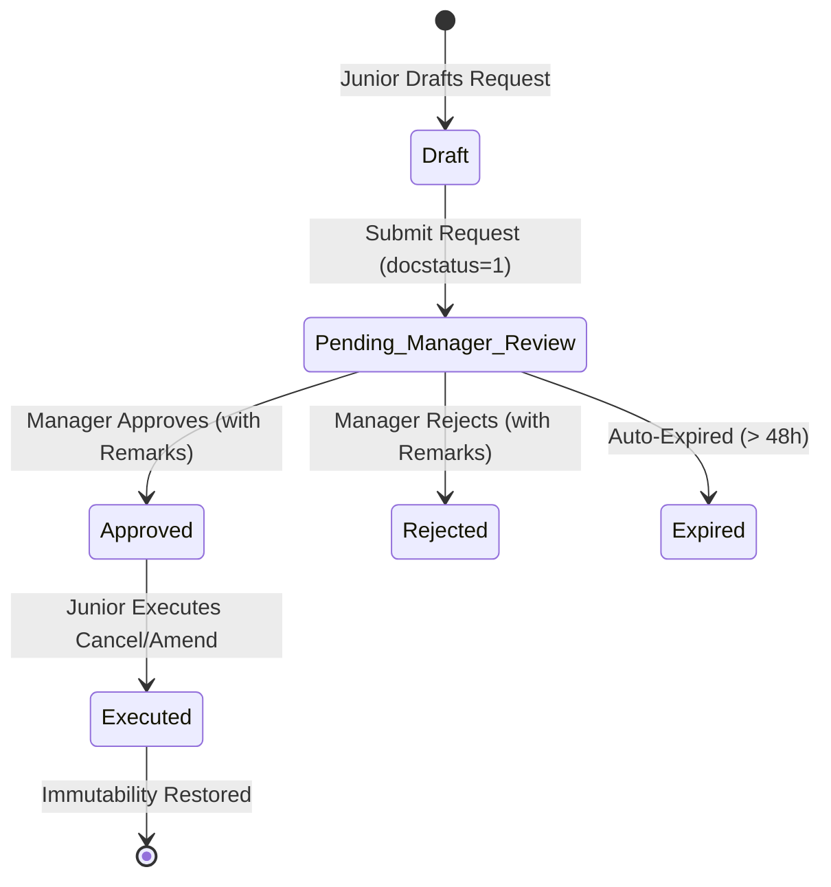

# STEP_00_ROLE_PERMISSION_SECURITY_FOUNDATION_SPECIFICATION.caveman.md

# Enterprise Lifecycle Step Specification: Role, Permission & Security Foundation Architecture

**Document ID:** `STEP-00-ROLE-SECURITY-CORE`  
**Lifecycle Flow:** Foundation Layer: Enterprise Role, Permission & Security Substrate (Preceding Flow 1 and Flow 2)  
**Governing Architecture:** [`docs/decisions/ADR-020-ENTERPRISE-ROLE-PERMISSION-ARCHITECTURE.md`](../docs/decisions/ADR-020-ENTERPRISE-ROLE-PERMISSION-ARCHITECTURE.md)  
**Target Module:** `solar_module` / `manoj`  
**Status:** Approved / Ready for Implementation

---

## 1. Step Scope, Objectives & Context Traceability

### 1.1 Lifecycle Positioning & Architectural Substrate

Step 00 is foundational security substrate. Establishes RBAC primitives, access control layers, audit trails, and data immutability engines governing Flow 1 (Stages 01–11) and Flow 2 (Steps 12–19).

```
┌──────────────────────────────────────────────────────────────────────────────────────────────────┐
│              STEP 00: ENTERPRISE ROLE, PERMISSION & SECURITY FOUNDATION                          │
├──────────────────────────────────────────────────────────────────────────────────────────────────┤
│ - Canonical 22 Roles (10 Frontline + 10 Supervisory + 2 Apex) & 11 Department Role Profiles     │
│ - Managerial Authority Inheritance Engine (`RoleInheritanceService`)                             │
│ - Stage-Forward Immutability Lock (`StageForwardLockService`)                                    │
│ - Junior Cancel/Amend Request Workflow (`Solar Cancellation Request`)                            │
│ - Admin Deletion Guard & Strict Audit Logger (`AdminAuditService` -> `Solar Deletion Audit Log`) │
│ - Atomic Downstream Cascading Purge Engine (`CascadePurgeService`)                               │
│ - Stage-Gated Row-Level Security Engine (`StageGatedRLSService`)                                 │
│ - Base Controller Mixin: `StageSecuredDocument`                                                  │
└─────────────────────────────────┬────────────────────────────────┬───────────────────────────────┘
                                  │                                │
                                  ▼                                ▼
       ┌─────────────────────────────────────┐  ┌─────────────────────────────────────┐
       │   FLOW 1: CORE PROJECT EXECUTION    │  │   FLOW 2: SCM & VENDOR PROCUREMENT  │
       │   Stages 01 – 11                    │  │   Steps 12 – 19                     │
       └─────────────────────────────────────┘  └─────────────────────────────────────┘
```

- **Predecessors:** Core Frappe Framework, MariaDB initialization.
- **Successors:** All subsequent lifecycle steps (Stages 01–19).

### 1.2 Core Business Objectives & Target KPIs

1. **100% RBAC Standardization:** Strict two-tier hierarchy across 10 operational departments without role fragmentation.
2. **Complete Downstream Immutability:** Upstream documents immutable once downstream engineering, procurement, or execution milestones start.
3. **100% Audited Interventions:** Record deletions require mandatory justification ($\ge 20$ chars deletion, $\ge 40$ chars cascade purge). Log snapshot JSON, user ID, timestamp, IP.
4. **Zero Orphaned Child Records:** Reverse-topological cascading purge cleans dependent records inside atomic database savepoint.
5. **Zero Development Rework:** Base class mixin (`StageSecuredDocument`) enables Stages 01–19 to inherit security hooks automatically.

---

## 2. Stakeholders, Enterprise Actors & HRMS Role Mapping

### 2.1 Canonical 22 Roles & Two-Tier Departmental Matrix

Zero "User" Suffix Rule strictly enforced:

| Operational Domain       | Frontline Role (Tier 1)               | Supervisory Role (Tier 2)      | HRMS Department        | HRMS Designation Baseline       | Primary Step Scope         |
| :----------------------- | :------------------------------------ | :----------------------------- | :--------------------- | :------------------------------ | :------------------------- |
| **Sales & Marketing**    | `Sales Representative`                | `Sales Manager`                | Sales & Marketing      | Sales Executive / Manager       | Stage 01                   |
| **Technical Survey**     | `Survey Engineer`                     | `Survey Manager`               | Engineering Operations | Survey Specialist / Manager     | Stage 02                   |
| **Engineering Design**   | `Design Engineer`                     | `Design Manager`               | Engineering Operations | Solar Design Engineer / Head    | Stage 03                   |
| **CRM & Proposals**      | `CRM Representative`                  | `CRM Manager`                  | CRM & Commercial       | Commercial Proposal Exec / Lead | Stage 04                   |
| **Finance & Accounts**   | `Accounts Assistant`                  | `Accounts Manager`             | Finance & Accounts     | Accounts Executive / Head       | Stage 05, Step 15, 17, 18  |
| **Site Operations**      | `Site Supervisor`, `Project Engineer` | `Project Manager`              | Project Execution      | Field Supervisor / Project Head | Stages 06–09, Step 16      |
| **Store & Inventory**    | `Store Assistant`                     | `Store Manager`                | Store & Warehouse      | Store Executive / Store Head    | Stage 08, Steps 12, 16, 17 |
| **Statutory Liaisoning** | `Liaisoning Representative`           | `Liaisoning Manager`           | Regulatory Affairs     | Liaisoning Executive / Manager  | Stage 10                   |
| **Procurement & SCM**    | `Purchase Assistant`                  | `Purchase Manager`             | Procurement & SCM      | Purchase Buyer / SCM Lead       | Steps 12–19                |
| **O&M Service**          | `O&M Service Engineer`                | `O&M Manager`                  | Customer Support & O&M | Service Field Engineer / Head   | Stage 11                   |
| **Supreme Apex**         | `Admin` (Project Supreme)             | `System Manager` (Dev Supreme) | Executive / IT         | Managing Director / CTO         | Cross-Platform Governance  |

### 2.2 Departmental Role Profiles (`tabRole Profile`)

| Role Profile Name         | Assigned System Roles                              | Intended Personnel                      |
| :------------------------ | :------------------------------------------------- | :-------------------------------------- |
| `Solar Sales Executive`   | `Sales Representative`, `Desk User`                | Frontline telecallers, field sales reps |
| `Solar Sales Head`        | `Sales Manager`, `Desk User`                       | Regional sales managers, VP Sales       |
| `Solar Survey Specialist` | `Survey Engineer`, `Desk User`                     | Mobile field surveyors, site auditors   |
| `Solar Survey Head`       | `Survey Manager`, `Desk User`                      | Chief Survey Officer, Survey Lead       |
| `Solar Design Engineer`   | `Design Engineer`, `Desk User`                     | CAD engineers, PVsyst specialists       |
| `Solar Design Head`       | `Design Manager`, `Desk User`                      | Head of Engineering Design              |
| `Solar CRM Proposal Exec` | `CRM Representative`, `Desk User`                  | Quotation analysts, pricing estimators  |
| `Solar CRM Head`          | `CRM Manager`, `Desk User`                         | Commercial Director, CRM Manager        |
| `Solar Accounts Exec`     | `Accounts Assistant`, `Desk User`                  | Accounts payables/receivables staff     |
| `Solar Accounts Head`     | `Accounts Manager`, `Desk User`                    | Chief Financial Officer, Controller     |
| `Solar Site Supervisor`   | `Site Supervisor`, `Project Engineer`, `Desk User` | On-site project field engineers         |
| `Solar Project Manager`   | `Project Manager`, `Desk User`                     | Senior project managers, EPC heads      |
| `Solar Store Assistant`   | `Store Assistant`, `Desk User`                     | Central warehouse dock operators        |
| `Solar Store Head`        | `Store Manager`, `Desk User`                       | Inventory controller, Logistics head    |
| `Solar Liaisoning Exec`   | `Liaisoning Representative`, `Desk User`           | DISCOM liaisoning agents                |
| `Solar Liaisoning Head`   | `Liaisoning Manager`, `Desk User`                  | Head of Regulatory Affairs              |
| `Solar Purchase Buyer`    | `Purchase Assistant`, `Desk User`                  | SCM procurement executives              |
| `Solar SCM Head`          | `Purchase Manager`, `Desk User`                    | Head of Procurement, SCM Director       |
| `Solar O&M Engineer`      | `O&M Service Engineer`, `Desk User`                | Solar field service technicians         |
| `Solar O&M Head`          | `O&M Manager`, `Desk User`                         | Service Operations Manager              |
| `Solar Executive Command` | `Admin`, `Desk User`                               | Managing Director, Executive Board      |

---

## 3. Relational Schema & 3NF Data Dictionary

### 3.1 `tabSolar Security Settings` (Single DocType)

| Fieldname                           | Label                           | Fieldtype | Options                                     | Mandatory | Rules                                                  |
| :---------------------------------- | :------------------------------ | :-------- | :------------------------------------------ | :-------: | :----------------------------------------------------- |
| `enforce_strict_deletion_reasons`   | Enforce Strict Deletion Reasons | `Check`   | -                                           |    Yes    | If 1, deletions require logged justification.          |
| `min_deletion_reason_length`        | Min Deletion Reason Length      | `Int`     | -                                           |    Yes    | Default: 20 chars.                                     |
| `min_cascade_purge_reason_length`   | Min Cascade Purge Reason Length | `Int`     | -                                           |    Yes    | Default: 40 chars.                                     |
| `cancellation_request_expiry_hours` | Cancellation Request Expiry (h) | `Int`     | -                                           |    Yes    | Default: 48h.                                          |
| `tier_2_po_approver_role`           | Tier 2 PO Approver Role         | `Select`  | `Purchase Manager\nAccounts Manager\nAdmin` |    Yes    | Approver for PO ₹50k–₹5L. Default: `Purchase Manager`. |
| `authorized_pi_entry_department`    | Authorized PI Entry Department  | `Select`  | `Accounts\nStore\nPurchase`                 |    Yes    | Default: `Accounts`.                                   |
| `enable_mandatory_barcode_pr`       | Enforce Mandatory Barcode GRN   | `Check`   | -                                           |    Yes    | Enforces 100% 2D scan in Step 16 GRN.                  |

### 3.2 `tabSolar Cancellation Request` (Submittable)

| Fieldname             | Label                   | Fieldtype      | Options                                                                           | Mandatory | Index | Rules                   |
| :-------------------- | :---------------------- | :------------- | :-------------------------------------------------------------------------------- | :-------: | :---: | :---------------------- |
| `reference_doctype`   | Reference DocType       | `Link`         | `DocType`                                                                         |  **Yes**  | **1** | Target DocType.         |
| `reference_name`      | Reference Document Name | `Dynamic Link` | `reference_doctype`                                                               |  **Yes**  | **1** | Target ID.              |
| `requested_action`    | Requested Action        | `Select`       | `Cancel\nAmend`                                                                   |  **Yes**  |   -   | Junior action.          |
| `request_reason`      | Detailed Justification  | `Small Text`   | -                                                                                 |  **Yes**  |   -   | Min 20 chars.           |
| `requested_by`        | Requested By (Junior)   | `Link`         | `User`                                                                            |  **Yes**  | **1** | Applicant user ID.      |
| `department`          | Department              | `Select`       | `Sales\nSurvey\nDesign\nCRM\nAccounts\nProject\nStore\nLiaisoning\nPurchase\nO&M` |  **Yes**  | **1** | Operational department. |
| `assigned_manager`    | Assigned Manager        | `Link`         | `User`                                                                            |  **Yes**  | **1** | Reviewer manager ID.    |
| `workflow_state`      | Review Status           | `Select`       | `Pending Manager Review\nApproved\nRejected\nExecuted\nExpired`                   |  **Yes**  | **1** | State machine status.   |
| `manager_remarks`     | Manager Review Remarks  | `Small Text`   | -                                                                                 |    No     |   -   | Required on decision.   |
| `decision_timestamp`  | Decision Recorded At    | `Datetime`     | -                                                                                 |    No     |   -   | Manager sign-off time.  |
| `execution_timestamp` | Action Executed At      | `Datetime`     | -                                                                                 |    No     |   -   | Execution time.         |

### 3.3 `tabSolar Deletion Audit Log` (Immutable Append-Only Log)

| Fieldname              | Label                     | Fieldtype    | Options   | Mandatory | Index | Rules                              |
| :--------------------- | :------------------------ | :----------- | :-------- | :-------: | :---: | :--------------------------------- |
| `target_doctype`       | Target DocType            | `Link`       | `DocType` |  **Yes**  | **1** | Deleted record DocType.            |
| `target_name`          | Target Record Name        | `Data`       | -         |  **Yes**  | **1** | Deleted record ID.                 |
| `deleted_by`           | Deleted By (User)         | `Link`       | `User`    |  **Yes**  | **1** | Executor user ID.                  |
| `deletion_reason`      | Deletion Justification    | `Small Text` | -         |  **Yes**  |   -   | Min 20 chars (min 40 for cascade). |
| `snapshot_json`        | Document Snapshot (JSON)  | `Code`       | `JSON`    |  **Yes**  |   -   | Full pre-deletion JSON dump.       |
| `is_cascade_purge`     | Is Part of Cascade Purge? | `Check`      | -         |    No     | **1** | 1 if purged by cascade.            |
| `cascade_root_doctype` | Cascade Root DocType      | `Data`       | -         |    No     |   -   | Originating root DocType.          |
| `cascade_root_name`    | Cascade Root Name         | `Data`       | -         |    No     |   -   | Originating root record ID.        |
| `ip_address`           | IP Address                | `Data`       | -         |    No     |   -   | Client IP address.                 |
| `creation`             | Deletion Timestamp        | `Datetime`   | -         |  **Yes**  | **1** | Log creation time.                 |

---

## 4. State Machine, Verification Gates & Invariants

### 4.1 Junior Cancellation Request State Machine



### 4.2 Five Security Invariants (ADR-020)

1. **Managerial Authority Inheritance:** Department Manager inherits 100% of Frontline operations.
2. **Stage-Forward Lock:** Submitted upstream documents locked if active downstream records exist.
3. **Junior Cancel/Amend Workflow:** Juniors cannot cancel/amend submitted documents directly; must submit `Solar Cancellation Request` to manager.
4. **Admin Deletion Guard:** Direct deletion blocked if active downstream documents exist.
5. **Atomic Cascading Purge:** Reverse-topological delete within savepoint (`frappe.db.savepoint`). Requires Admin password and $\ge 40$ chars justification.

---

## 5. Controller Logic & Domain Services

### 5.1 `RoleInheritanceService`

```python
# solar_module/security/role_inheritance.py

import frappe

DEPARTMENT_ROLE_MAP = {
    "Sales Manager": ["Sales Representative"],
    "Survey Manager": ["Survey Engineer"],
    "Design Manager": ["Design Engineer"],
    "CRM Manager": ["CRM Representative"],
    "Accounts Manager": ["Accounts Assistant"],
    "Project Manager": ["Project Engineer", "Site Supervisor"],
    "Store Manager": ["Store Assistant"],
    "Liaisoning Manager": ["Liaisoning Representative"],
    "Purchase Manager": ["Purchase Assistant"],
    "O&M Manager": ["O&M Service Engineer"],
}

class RoleInheritanceService:
    @staticmethod
    def get_effective_roles(user: str) -> set:
        user_roles = set(frappe.get_roles(user))
        if "Administrator" in user_roles or "System Manager" in user_roles or "Admin" in user_roles:
            return user_roles

        effective = set(user_roles)
        for manager_role, subordinates in DEPARTMENT_ROLE_MAP.items():
            if manager_role in user_roles:
                effective.update(subordinates)
        return effective

    @staticmethod
    def user_has_role(user: str, required_role: str) -> bool:
        return required_role in RoleInheritanceService.get_effective_roles(user)
```

### 5.2 `StageForwardLockService`

```python
# solar_module/security/stage_forward_lock.py

import frappe
from frappe import _

DOWNSTREAM_DEPENDENCY_REGISTRY = {
    "Lead": [{"doctype": "Site Survey", "link_field": "custom_lead_ref"}],
    "Site Survey": [{"doctype": "Quotation", "link_field": "custom_survey_ref"}],
    "Quotation": [{"doctype": "Sales Order", "link_field": "custom_proposal_ref"}],
    "Sales Order": [
        {"doctype": "Delivery Note", "link_field": "against_sales_order"},
        {"doctype": "Project", "link_field": "sales_order"},
    ],
    "Purchase Order": [
        {"doctype": "Purchase Receipt", "link_field": "purchase_order"},
        {"doctype": "Payment Entry", "link_field": "custom_po_milestone_ref"},
    ],
    "Purchase Receipt": [{"doctype": "Purchase Invoice", "link_field": "custom_grn_reference"}],
}

class StageForwardLockService:
    @staticmethod
    def check_downstream_progress(doc) -> list:
        dependencies = DOWNSTREAM_DEPENDENCY_REGISTRY.get(doc.doctype, [])
        active_children = []

        for dep in dependencies:
            records = frappe.db.get_all(
                dep["doctype"],
                filters={dep["link_field"]: doc.name, "docstatus": ["!=", 2]},
                fields=["name", "docstatus"]
            )
            for r in records:
                active_children.append({"doctype": dep["doctype"], "name": r.name, "docstatus": r.docstatus})

        return active_children

    @staticmethod
    def assert_can_cancel_or_amend(doc, action: str):
        active_children = StageForwardLockService.check_downstream_progress(doc)
        if active_children:
            child_summary = ", ".join([f"{c['doctype']} ({c['name']})" for c in active_children])
            frappe.throw(
                _("Stage-Forward Lock: Cannot {0} {1} '{2}'. Active downstream records exist: {3}.").format(
                    action, doc.doctype, doc.name, child_summary
                ),
                frappe.ValidationError
            )
```

### 5.3 `AdminAuditService` & `CascadePurgeService`

```python
# solar_module/security/admin_audit.py

import json
import frappe
from frappe import _

class AdminAuditService:
    @staticmethod
    def validate_and_log_deletion(doc, reason: str = None, is_cascade: bool = False, root_doc: str = None):
        settings = frappe.get_cached_doc("Solar Security Settings")
        min_len = settings.min_deletion_reason_length if not is_cascade else settings.min_cascade_purge_reason_length

        if settings.enforce_strict_deletion_reasons:
            if not reason or len(reason.strip()) < min_len:
                frappe.throw(
                    _("Strict Deletion Audit: Justification of at least {0} chars required to delete {1} '{2}'.").format(
                        min_len, doc.doctype, doc.name
                    ),
                    frappe.ValidationError
                )

        if not is_cascade:
            from solar_module.security.stage_forward_lock import StageForwardLockService
            active_children = StageForwardLockService.check_downstream_progress(doc)
            if active_children:
                child_summary = ", ".join([f"{c['doctype']} ({c['name']})" for c in active_children])
                frappe.throw(
                    _("Deletion Blocked: Active downstream documents exist: {0}. Use Cascade Purge.").format(child_summary),
                    frappe.ValidationError
                )

        frappe.get_doc({
            "doctype": "Solar Deletion Audit Log",
            "target_doctype": doc.doctype,
            "target_name": doc.name,
            "deleted_by": frappe.session.user,
            "deletion_reason": reason,
            "snapshot_json": json.dumps(doc.as_dict(), default=str),
            "is_cascade_purge": 1 if is_cascade else 0,
            "cascade_root_doctype": doc.doctype if not root_doc else root_doc.split("::")[0],
            "cascade_root_name": doc.name if not root_doc else root_doc.split("::")[1],
            "ip_address": getattr(frappe.local, "request_ip", "127.0.0.1"),
        }).insert(ignore_permissions=True)
```

```python
# solar_module/security/cascade_purge.py

import frappe
from frappe import _
from solar_module.security.stage_forward_lock import DOWNSTREAM_DEPENDENCY_REGISTRY
from solar_module.security.admin_audit import AdminAuditService

class CascadePurgeService:
    @staticmethod
    def execute_cascade_purge(root_doctype: str, root_name: str, reason: str, admin_password: str):
        user = frappe.session.user
        user_roles = set(frappe.get_roles(user))
        if not ("Admin" in user_roles or "System Manager" in user_roles):
            frappe.throw(_("Cascade Purge restricted to Admin."), frappe.PermissionError)

        from frappe.auth import check_password
        check_password(user, admin_password)

        settings = frappe.get_cached_doc("Solar Security Settings")
        if not reason or len(reason.strip()) < settings.min_cascade_purge_reason_length:
            frappe.throw(
                _("Cascade Purge requires justification of at least {0} characters.").format(
                    settings.min_cascade_purge_reason_length
                ),
                frappe.ValidationError
            )

        deletion_order = CascadePurgeService._build_deletion_tree(root_doctype, root_name)
        root_identifier = f"{root_doctype}::{root_name}"

        frappe.db.savepoint("cascade_purge_tx")
        try:
            for item in deletion_order:
                child_doc = frappe.get_doc(item["doctype"], item["name"])
                AdminAuditService.validate_and_log_deletion(
                    child_doc, reason=reason, is_cascade=True, root_doc=root_identifier
                )
                child_doc.delete(ignore_permissions=True)
            frappe.db.commit()
            return {"status": "success", "purged_count": len(deletion_order)}
        except Exception as e:
            frappe.db.rollback(save_point="cascade_purge_tx")
            frappe.throw(_("Cascade Purge aborted: {0}. Rolled back.").format(str(e)))

    @staticmethod
    def _build_deletion_tree(doctype: str, name: str) -> list:
        tree = []
        deps = DOWNSTREAM_DEPENDENCY_REGISTRY.get(doctype, [])
        for dep in deps:
            children = frappe.db.get_all(dep["doctype"], filters={dep["link_field"]: name}, fields=["name"])
            for child in children:
                tree.extend(CascadePurgeService._build_deletion_tree(dep["doctype"], child.name))
        tree.append({"doctype": doctype, "name": name})
        return tree
```

### 5.4 Base Mixin: `StageSecuredDocument`

```python
# solar_module/mixins/stage_secured_document.py

from frappe.model.document import Document
from solar_module.security.stage_forward_lock import StageForwardLockService
from solar_module.security.admin_audit import AdminAuditService

class StageSecuredDocument(Document):
    def before_cancel(self):
        StageForwardLockService.assert_can_cancel_or_amend(self, action="Cancel")

    def before_amend(self):
        StageForwardLockService.assert_can_cancel_or_amend(self, action="Amend")

    def on_trash(self):
        reason = getattr(frappe.local, "solar_deletion_reason", None)
        AdminAuditService.validate_and_log_deletion(self, reason=reason)
```

---

## 6. Frontend UI/UX Specification

- **Dependency Warning Modal:** Displays active child documents when Admin attempts deletion. Direct deletion blocked.
- **Cascade Purge Dialog:** Requires Admin password re-auth, lists tree in reverse topological order, enforces $\ge 40$ chars justification.
- **Junior Cancellation Request Modal:** Enforces $\ge 20$ chars reason, auto-assigns Department Manager, tracks workflow state.
- **Role Desks:** Standard workspaces mapped to Role Profiles (`/solar/sales`, `/solar/procurement`, `/solar/projects`, `/solar/accounts`).

---

## 7. Cross-App Integration Touchpoints & Frappe Hooks

```python
# solar_module/hooks.py

fixtures = [
    {"dt": "Role", "filters": [["name", "in", [
        "Sales Representative", "Sales Manager",
        "Survey Engineer", "Survey Manager",
        "Design Engineer", "Design Manager",
        "CRM Representative", "CRM Manager",
        "Accounts Assistant", "Accounts Manager",
        "Site Supervisor", "Project Engineer", "Project Manager",
        "Store Assistant", "Store Manager",
        "Liaisoning Representative", "Liaisoning Manager",
        "Purchase Assistant", "Purchase Manager",
        "O&M Service Engineer", "O&M Manager",
        "Admin"
    ]]]},
    {"dt": "Role Profile", "filters": [["name", "like", "Solar%"]]},
]

doc_events = {
    "*": {
        "before_cancel": "solar_module.security.stage_forward_lock.intercept_before_cancel",
        "before_amend": "solar_module.security.stage_forward_lock.intercept_before_amend",
        "on_trash": "solar_module.security.admin_audit.intercept_on_trash",
    }
}
```

---

## 8. Automated Testing & QA Criteria

`tests/test_role_security_core.py`:

- `test_manager_inherits_frontline_permissions`: Manager evaluates to True for Frontline operations.
- `test_stage_forward_lock_blocks_cancel`: Blocked if downstream records exist.
- `test_junior_cancellation_request_workflow`: Junior submit -> Manager approve -> Junior execute.
- `test_admin_deletion_hard_block_on_downstream`: Block direct deletion of parent if active children exist.
- `test_admin_deletion_logs_audit_snapshot`: Full JSON snapshot written to `tabSolar Deletion Audit Log`.
- `test_cascade_purge_atomic_rollback`: Simulated error triggers complete rollback via savepoint.
- `test_stage_gated_rls_sql_generation`: User restricted to assigned records; Manager has department visibility.

---

## 9. Operational SOP & Runbook

1. **Junior SOP:** Never attempt direct cancellation on submitted records. Submit `[Request Cancel/Amend]`, provide justification ($\ge 20$ chars), await Manager sign-off.
2. **Manager SOP:** Review requests in `/solar/approvals`. Confirm no downstream work started. Sign off with remarks.
3. **Admin SOP:** Deletions require $\ge 20$ chars justification. For aborting entire transaction trees, use `[Cascade Purge]` with password re-auth ($\ge 40$ chars justification).
4. **DevOps Runbook:**
   ```bash
   bench --site <site_name> export-fixtures --app solar_module
   bench --site <site_name> execute frappe.db.get_list --args "['Solar Deletion Audit Log', {}, ['name', 'target_doctype', 'deleted_by'], 10]"
   ```
