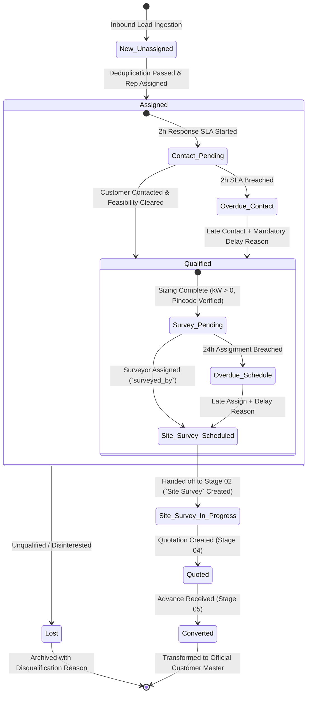
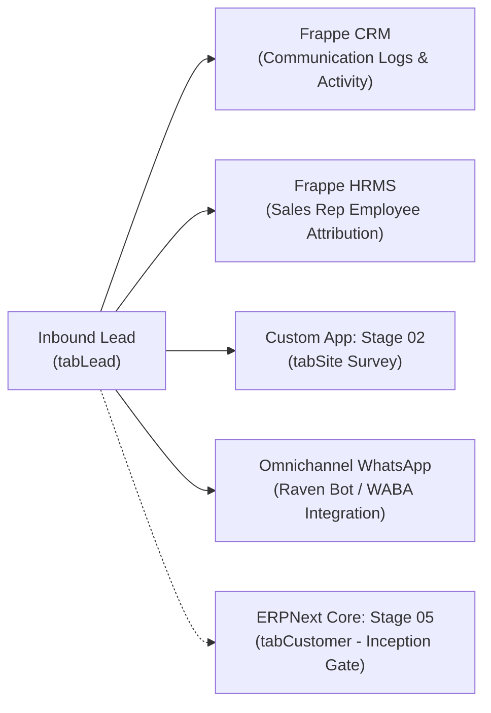

# STEP_01_LEAD_MANAGEMENT_SPECIFICATION.caveman.md

# Enterprise Lifecycle Step Specification: Lead Onboarding, Deduplication & Survey Scheduling

**Document ID:** `STEP-01-LEAD`  
**Lifecycle Flow:** Flow 1: Core Solar EPC Project Execution (Stage 01 of 11)  
**Governing Architecture:** [`architect_docs/02_STEP_PLANNING_SPECIFICATION_BLUEPRINT.md`](../architect_docs/02_STEP_PLANNING_SPECIFICATION_BLUEPRINT.md)  
**PRD / FRS Traceability:** [`planning_ref_docs/01_PROJECT_FOUNDATION_MODEL.md`](../planning_ref_docs/01_PROJECT_FOUNDATION_MODEL.md) (`BC-01`), [`planning_ref_docs/05_BUSINESS_REQUIREMENTS_DOCUMENT.md`](../planning_ref_docs/05_BUSINESS_REQUIREMENTS_DOCUMENT.md) (`BR-001`), [`planning_ref_docs/06_FUNCTIONAL_REQUIREMENTS_SPECIFICATION.md`](../planning_ref_docs/06_FUNCTIONAL_REQUIREMENTS_SPECIFICATION.md) (`FR-001`)  
**Target Module:** `solar_module` / `manoj`  
**Author:** Principal Enterprise Architect  
**Status:** Ready for Implementation

---

## 1. Step Scope, Objectives & Context Traceability

### 1.1 Lifecycle Positioning & Context

Stage 01 is primary customer entry gateway for Solar EPC Project Execution Lifecycle. Ingest inquiries across omnichannel sources (PM Surya Ghar portal, web pages, walk-in showrooms, referral networks, telecalling). Execute instant phone deduplication, collect preliminary technical sizing metrics (sanctioned load, electricity tariff class, monthly bill amount, proposed kW capacity, site pincode), transition qualified prospects to Stage 02 (`Site Survey`) within 24h SLA.

```
┌─────────────────┐       ┌─────────────────────────────────────────────────────────┐       ┌─────────────────┐
│ Omnichannel     │       │                STAGE 01: LEAD MANAGEMENT                 │       │    STAGE 02:    │
│ Ingestion:      │──────▶│ - 10-Digit Mobile Sanitization & Strict Deduplication   │──────▶│  Site Survey &  │
│ - PM Surya Ghar │       │ - Technical Sizing (Bill Amt, kW Capacity, Pincode)     │       │ Technical Audit │
│ - Web / WABA    │       │ - 2-Hour Initial Response SLA & Escalation Engine       │       │   (24h SLA)     │
│ - Walk-ins      │       │ - Site Surveyor Assignment & Automated Doc Instantiation│       │                 │
└─────────────────┘       └─────────────────────────────────────────────────────────┘       └─────────────────┘
```

- **Predecessors:** Omnichannel marketing campaigns, government subsidy portal webhooks, inbound WhatsApp inquiries.
- **Successor:** Stage 02: Technical Site Survey (`Site Survey` DocType).

### 1.2 Core Business Objectives & Target KPIs

1. **Zero Duplicate Ingestion (100% Deduplication):** Enforce server-side phone normalization (strip spaces, prefixes, non-numeric to 10 standard digits). Cross-check duplicates across `tabLead`, `tabCRM Lead`, `tabCustomer`, `tabContact`.
2. **Sub-2-Hour Response SLA:** First contact between sales reps and inbound prospects within 2h of ingestion during business hours.
3. **High Qualification Accuracy ($\ge 85\%$):** Ensure solar plant sizing feasibility (sanctioned load vs requested kW capacity) logged before field deployment.
4. **Sub-24-Hour Survey Scheduling:** Qualified leads assigned to authorized `Survey Engineer` (or `Survey Assistant`) with verified coordinates within 24h.

### 1.3 Failure Modes Eliminated

- **Sales Rep Collision & Dispute:** Multiple sales reps calling same client due to unstandardized mobile numbers (+91, 0, spaces).
- **Abandoned Inbound Leads:** Inquiries lost in email inboxes or unmonitored WhatsApp numbers without SLA accountability.
- **Unqualified Field Trips:** Survey engineers dispatched without verified roof ownership, sanctioned load, or average monthly power bills.
- **Lost Operational Audit Trail:** No structured documentation explaining why lead stalled past turnaround times.

---

## 2. Stakeholders, Enterprise Actors & HRMS Role Mapping

### 2.1 Enterprise User Roles Matrix

Zero "User" Suffix Rule enforced:

| Persona / Business Actor              | Frappe System Role     | HRMS Department        | HRMS Designation              | Operational Responsibilities                                                                              |
| :------------------------------------ | :--------------------- | :--------------------- | :---------------------------- | :-------------------------------------------------------------------------------------------------------- |
| **Inbound Telecaller / Inside Sales** | `Lead Representative`  | Sales & Marketing      | `Inside Sales Representative` | Ingests leads, cleanses mobile number, collects electricity bill amount, logs initial qualification.      |
| **Field Sales Executive**             | `Sales Representative` | Sales & Marketing      | `Sales Executive`             | Conducts primary customer consultation, determines estimated solar kW, schedules site survey.             |
| **Area Sales / BD Manager**           | `Area Sales Manager`   | Sales & Marketing      | `Area Sales Manager`          | Territory allocation, lead reassignment, overdue SLA delay review, conversion monitoring.                 |
| **Site Survey Engineer**              | `Survey Engineer`      | Engineering Operations | `Site Survey Auditor`         | Receives survey assignment, reviews preliminary sizing data, conducts on-site technical survey.           |
| **Solar EPC Director / Admin**        | `Admin`, `Director`    | Executive Management   | `Managing Director`           | Supreme operational command across all lifecycles; SLA configuration, notification toggles, audit trails. |

> [!IMPORTANT]
> **Enterprise Role Hierarchy: Administrator $\rightarrow$ System Manager $\rightarrow$ Admin (Project Supreme):**
>
> - **`Administrator` & `System Manager` (Framework Supreme & Developer Realm):** Frappe native `Administrator` and `System Manager` sit at apex of system hierarchy (supreme over `Admin`). `System Manager` possesses full access to everything `Admin` has, plus full technical rights over source code, DocType schema builder, Client/Server Scripts, bench tooling, developer mode. Reserved for technical developers, bench engineers, DevOps administrators.
> - **`Admin` (Project / Solar EPC Level Supreme Command):** Introduced specifically for **project-level operational supremacy**. Unrestricted operational access across Flow 1 and Flow 2, full authority over governance settings (`Solar SLA Settings`, `Solar Notification Settings`, delay approvals, manager overrides). **Restricted from code, DocType schema customization, client/server scripts, internal technical implementation access.**

### 2.2 Permission Hierarchy Matrix

| DocType / Action               | Lead Representative | Sales Representative | Area Sales Manager | Survey Engineer |     Admin\*      |
| :----------------------------- | :-----------------: | :------------------: | :----------------: | :-------------: | :--------------: |
| **Lead (Read)**                |   Own / Assigned    |   Own / Territory    |  Full Department   |  Assigned Only  |   All Records    |
| **Lead (Create)**              |         Yes         |         Yes          |        Yes         |       No        |       Yes        |
| **Lead (Write / Update)**      |   Own / Assigned    |    Own / Assigned    |  Full Department   |   Status Only   |   All Records    |
| **Lead (Assign Survey)**       |         No          |         Yes          |        Yes         |       No        |       Yes        |
| **Remark-Delay Log (Write)**   |         Own         |         Own          |  Full Department   |       Own       |   Full Access    |
| **Solar SLA Settings (Write)** |         No          |          No          |         No         |       No        | Yes (Admin Only) |
| **Export Leads**               |         No          |          No          |     Permitted      |       No        |    Permitted     |

_\*Note: Frappe `Administrator` and `System Manager` sit above `Admin` and inherit all permissions._

---

## 3. Relational Schema & 3NF Data Dictionary

### 3.1 Core DocType Extensions: `tabLead`

Standard ERPNext `Lead` extended with enterprise solar fields via fixtures/custom fields. Explicit fieldtypes, indexes, 3NF normalization:

| Fieldname              | Label                   | Fieldtype    | Options / Target                                                       | Mandatory |    Index     | Description & Validation Rules                                         |
| :--------------------- | :---------------------- | :----------- | :--------------------------------------------------------------------- | :-------: | :----------: | :--------------------------------------------------------------------- |
| `mobile_no`            | Mobile Number           | `Data`       | -                                                                      |  **Yes**  | **Index: 1** | Exactly 10 digits sanitized by regex `^[6-9]\d{9}$`. Key dedup anchor. |
| `solar_capacity`       | Proposed Capacity (kW)  | `Float`      | -                                                                      |  **Yes**  |      -       | Estimated PV capacity (e.g. 5.0 kW). Reqd for survey assignment.       |
| `bill_amt`             | Avg Monthly Bill (INR)  | `Currency`   | `Company:currency`                                                     |    No     |      -       | Current monthly electricity bill to evaluate sizing feasibility.       |
| `advance_amt`          | Pre-Booking Advance     | `Currency`   | `Company:currency`                                                     |    No     |      -       | Token advance payment collected prior to sales order (if applicable).  |
| `per_advance`          | % Advance Collected     | `Float`      | -                                                                      |    No     |      -       | Calculated percentage of advance against preliminary budget.           |
| `custom_address`       | Site Physical Address   | `Small Text` | -                                                                      |  **Yes**  |      -       | Full property location for rooftop survey inspection.                  |
| `custom_pincode`       | Site Pincode            | `Data`       | -                                                                      |  **Yes**  | **Index: 1** | 6-digit Indian Postal PIN. Resolves territory and local sales team.    |
| `surveyed_by`          | Survey Assigned To      | `Link`       | `User`                                                                 |    No     | **Index: 1** | Filtered by role `Survey Engineer`. Assignee for Stage 02.             |
| `for_survey_assign_on` | Survey Assigned On      | `Datetime`   | -                                                                      |    No     |      -       | Timestamp of survey handoff; triggers Stage 02 24h SLA timer.          |
| `creation_date`        | Creation Date           | `Date`       | -                                                                      |  **Yes**  |      -       | Default: `Today`. Used for SLA initiation countdown.                   |
| `duplicate_mobile`     | Duplicate Mobile Flag   | `Check`      | -                                                                      |    No     |      -       | Auto-set to 1 if dedup engine catches secondary inquiry on mobile.     |
| `auto_follow`          | Auto Follow-up Active   | `Check`      | -                                                                      |    No     |      -       | Enables automated WhatsApp and SMS follow-up prompts (Default: 1).     |
| `tat_days`             | Configured TAT (Days)   | `Int`        | -                                                                      |    No     |      -       | Dynamic SLA days fetched from `Solar SLA Settings` (Default: 2 days).  |
| `act_nxstp_dt`         | Actual Next Step Date   | `Date`       | -                                                                      |    No     |      -       | Actual completion timestamp of active lead milestone.                  |
| `exp_nxstp_dt`         | Expected Next Step Date | `Date`       | -                                                                      |    No     |      -       | Calculated deadline: `creation_date + tat_days`.                       |
| `stage_status`         | Solar Lifecycle Status  | `Select`     | `Draft\nOpen\nAssigned\nSite Survey\nQuoted\nConverted\nLost\nOverdue` |  **Yes**  | **Index: 1** | Primary operational state machine attribute.                           |
| `complete_status`      | SLA Compliance Status   | `Select`     | `\nOn Time\nDelayed`                                                   |    No     |      -       | SLA indicator: evaluates whether survey/quote milestone met in TAT.    |
| `sla_due_date`         | SLA Deadline Datetime   | `Datetime`   | -                                                                      |    No     | **Index: 1** | Absolute timestamp when lead response / survey breaches SLA.           |
| `complete_date`        | Stage Complete Date     | `Date`       | -                                                                      |    No     |      -       | Closed date (earliest of survey date or quotation date).               |
| `remark_delay_log`     | Delay & Audit Table     | `Table`      | `Remark-Delay Log`                                                     |    No     |      -       | Mandatory delay justification log when actions past `sla_due_date`.    |
| `lead_progress_html`   | Stage Progress Stepper  | `HTML`       | -                                                                      |    No     |      -       | Visual 11-stage progress tracker rendered on Desk form.                |

### 3.2 Child DocType Schema: `tabRemark-Delay Log`

Captures operational remarks, conversation milestones, mandatory delay explanations:

| Fieldname      | Label           | Fieldtype    | Options                                                                                                                                                                   | Mandatory | Description                                                     |
| :------------- | :-------------- | :----------- | :------------------------------------------------------------------------------------------------------------------------------------------------------------------------ | :-------: | :-------------------------------------------------------------- |
| `user`         | Logged By       | `Link`       | `User`                                                                                                                                                                    |  **Yes**  | System user recording entry (auto-populated with session user). |
| `timestamp`    | Recorded At     | `Datetime`   | -                                                                                                                                                                         |  **Yes**  | Immutable timestamp when remark or delay logged.                |
| `stage`        | Lifecycle Stage | `Data`       | -                                                                                                                                                                         |  **Yes**  | Defaults to "Stage 01: Lead Management".                        |
| `delay_reason` | Delay Category  | `Select`     | `Customer Unreachable\nCustomer Requested Postponement\nRoof Under Construction\nUtility Bill Pending\nFinancial Evaluation Pending\nTechnical Re-sizing Required\nOther` |    No     | Mandatory when docstatus is `Overdue`.                          |
| `remarks`      | Detailed Notes  | `Small Text` | -                                                                                                                                                                         |  **Yes**  | Free-text commentary explaining action or customer discussion.  |

### 3.3 Database Indexing & Autonaming Strategy

- **Autonaming:** Autoname follows `format:LEAD-.YYYY.-.#####` (e.g. `LEAD-2026-00042`).
- **Composite B-Tree Indexes:**
  - `CREATE INDEX idx_lead_mobile_status ON tabLead (mobile_no, status);`
  - `CREATE INDEX idx_lead_stage_sla ON tabLead (stage_status, sla_due_date);`
  - `CREATE INDEX idx_lead_pincode ON tabLead (custom_pincode);`
  - `CREATE INDEX idx_lead_surveyed_by ON tabLead (surveyed_by, stage_status);`

---

## 4. State Machine, Verification Gates & SLA Engine

### 4.1 Lead Lifecycle State Machine Diagram



### 4.2 Server-Side Hard Verification Gates

1. **Gate 1: 10-Digit Mobile Sanitization & Deduplication Gate:**
   - Cleanses input: removes whitespace, hyphens, brackets, `+91`/`0` prefixes.
   - Asserts regex `^[6-9]\d{9}$`. If fail, raises `frappe.ValidationError(_("Mobile number must be exactly 10 digits starting with 6, 7, 8, or 9."))`.
   - Deduplication query: If non-cancelled `Lead` or `Customer` exists with identical 10-digit mobile, blocks insert unless approved by `Sales Manager` with `duplicate_mobile = 1`.

2. **Gate 2: Technical Sizing Feasibility Gate:**
   - Before transition to `Qualified` or scheduling survey, verifies:
     $$\text{solar\_capacity} > 0.0 \quad \text{AND} \quad \text{len}(\text{custom\_pincode}) == 6 \quad \text{AND} \quad \text{custom\_address} \ne \text{None}$$
   - Prevents dispatching technical survey personnel to unverified locations.

3. **Gate 3: Survey Engineer Assignment Gate:**
   - Validates `surveyed_by` is active employee with role `Survey Engineer` (or `Survey Assistant`).
   - Populates `for_survey_assign_on = now_datetime()`.
   - Instantiates linked `Site Survey` doc in `Draft` status pre-populated with lead contact data, capacity, coordinates.

4. **Gate 4: Mandatory Delay Reason Gate:**
   - If current time $> \text{sla\_due\_date}$, status change or save hard-blocked unless new row appended to `remark_delay_log` with selected `delay_reason`.

### 4.3 SLA Engine Specification & Escalation Countdown

Lead SLA Engine executes via document hooks and background workers:

$$\text{sla\_due\_date} = \text{creation\_timestamp} + \text{get\_lead\_sla\_hours}()$$

- **Default Response SLA:** **2 Hours** (Configurable in `Solar SLA Settings`).
- **Default Survey Scheduling SLA:** **24 Hours** (Configurable in `Solar SLA Settings`).
- **Overdue Daemon (`solar_module.tasks.recompute_lead_sla`):**
  - Runs every 15 minutes.
  - Queries active leads where $\text{now\_datetime}() > \text{sla\_due\_date}$ and `stage_status` not in (`Converted`, `Lost`, `Site Survey`).
  - Transitions `stage_status = 'Overdue'` and `complete_status = 'Delayed'`.
  - Dispatches priority alert to Lead Owner, Area Sales Manager, Director.

---

## 5. Controller Logic, Domain Services & Whitelisted APIs

### 5.1 Architecture & Separation of Concerns (SOLID)

Decoupled controllers for full testability:

- **`LeadController` (`solar_module/overrides/lead.py`):** Thin lifecycle dispatcher handling Frappe events (`before_save`, `after_insert`, `on_update`, `on_trash`).
- **`LeadValidationService` (`solar_module/services/lead/validation.py`):** Validation math for mobile numbers, address coordinates, duplicate checking.
- **`LeadSLAService` (`solar_module/services/lead/sla.py`):** Turnaround time calculations, due dates, overdue updates.
- **`SiteSurveyBridgeService` (`solar_module/services/lead/survey_bridge.py`):** Auto-creation and sync of downstream `Site Survey` records.
- **`LeadNotificationService` (`solar_module/services/lead/notifications.py`):** Omni-channel dispatch across Raven Bot chat channels and WhatsApp templates.

### 5.2 Whitelisted REST/RPC API Endpoints

All mutating APIs enforce `@frappe.whitelist(methods=["POST"])`, strict typing, in-method IDOR checks.

#### API 1: Create Sanitized Solar Lead

```python
@frappe.whitelist(methods=["POST"])
def create_solar_lead(
    first_name: str,
    mobile_no: str,
    solar_capacity: float,
    custom_address: str,
    custom_pincode: str,
    bill_amt: float = 0.0,
    source: str = "Web Portal",
    email_id: str | None = None
) -> dict:
    """Whitelisted endpoint to ingest and sanitize new Solar EPC Leads."""
    frappe.only_for(["Guest", "Lead Representative", "Sales Representative", "Admin", "System Manager"])

    clean_mobile = LeadValidationService.sanitize_mobile(mobile_no)
    existing_lead = LeadValidationService.check_duplicate(clean_mobile)
    if existing_lead:
        frappe.throw(
            _("A lead already exists with mobile {0} (Lead ID: {1})").format(clean_mobile, existing_lead),
            frappe.DuplicateEntryError
        )

    lead_doc = frappe.get_doc({
        "doctype": "Lead",
        "first_name": first_name.strip(),
        "mobile_no": clean_mobile,
        "email_id": email_id.strip() if email_id else None,
        "source": source,
        "solar_capacity": float(solar_capacity),
        "custom_address": custom_address.strip(),
        "custom_pincode": custom_pincode.strip(),
        "bill_amt": float(bill_amt),
        "stage_status": "Open",
        "creation_date": frappe.utils.today()
    })
    lead_doc.insert(ignore_permissions=True if frappe.session.user == "Guest" else False)

    return {
        "status": "success",
        "lead_name": lead_doc.name,
        "sla_due_date": lead_doc.sla_due_date
    }
```

#### API 2: Assign Lead to Survey Engineer

```python
@frappe.whitelist(methods=["POST"])
def assign_site_surveyor(lead_name: str, surveyor_engineer: str) -> dict:
    """Assigns an authorized survey engineer and spawns the Stage 02 Site Survey container."""
    if not lead_name or not surveyor_engineer:
        frappe.throw(_("Both lead_name and surveyor_engineer are required."), frappe.ValidationError)

    lead = frappe.get_doc("Lead", lead_name)
    lead.check_permission("write")

    # Assert surveyor has role
    roles = frappe.get_roles(surveyor_engineer)
    if "Survey Engineer" not in roles and "Survey Assistant" not in roles and "Admin" not in roles and "System Manager" not in roles:
        frappe.throw(_("User {0} does not hold the Survey Engineer or Survey Assistant role.").format(surveyor_engineer), frappe.PermissionError)

    lead.surveyed_by = surveyor_engineer
    lead.for_survey_assign_on = frappe.utils.now_datetime()
    lead.stage_status = "Site Survey"
    lead.save()

    survey_name = SiteSurveyBridgeService.create_or_update_survey(lead)

    return {
        "status": "success",
        "lead": lead.name,
        "survey_assigned_to": surveyor_engineer,
        "site_survey_id": survey_name
    }
```

#### API 3: Log SLA Delay Reason

```python
@frappe.whitelist(methods=["POST"])
def log_lead_delay(lead_name: str, delay_reason: str, remarks: str) -> dict:
    """Appends a mandatory delay explanation for an overdue lead."""
    lead = frappe.get_doc("Lead", lead_name)
    lead.check_permission("write")

    lead.append("remark_delay_log", {
        "user": frappe.session.user,
        "timestamp": frappe.utils.now_datetime(),
        "stage": "Stage 01: Lead Management",
        "delay_reason": delay_reason,
        "remarks": remarks.strip()
    })
    lead.save()

    return {"status": "success", "message": _("Delay log recorded successfully.")}
```

---

## 6. Frontend UI/UX Specification (Desk & Vue 3 / Frappe UI)

### 6.1 Landing Page Wrapper Architecture (`/solar`)

Universal landing on `/solar`. Vue 3 SPA adapts to user role:

```
┌──────────────────────────────────────────────────────────────────────────────────────────────────┐
│ SADBHAV SOLAR EPC COMMAND CENTER (`/solar`)               Logged in: Sales Exec (Ahmedabad)      │
├──────────────────────────────────────────────────────────────────────────────────────────────────┤
│ [Active KPI Cards]                                                                               │
│ ┌────────────────┐ ┌────────────────┐ ┌────────────────┐ ┌─────────────────────────────────────┐ │
│ │ New Leads (2h) │ │ My Open Leads  │ │ Surveys Booked │ │ Overdue SLA Calls                   │ │
│ │ 12 Inbound     │ │ 28 Pipeline    │ │ 9 Scheduled    │ │ 3 Action Needed (Urgent)            │ │
│ └────────────────┘ └────────────────┘ └────────────────┘ └─────────────────────────────────────┘ │
├──────────────────────────────────────────────────────────────────────────────────────────────────┤
│ [Quick Action Bar]  [+ New Solar Lead]  [Quick Assign]  [Filter: Capacity > 10kW]  [Search Phone]│
├──────────────────────────────────────────────────────────────────────────────────────────────────┤
│ [Interactive Lead Data Table: `/solar/leads`]                                                    │
│ Lead ID       | Customer Name  | Mobile     | Capacity | Pincode | SLA Clock | Stage Status    | │
│ LEAD-2026-042 | Patel Ceramics | 9825012345 | 40.0 kW  | 380015  | 01h 14m   | Open            | │
│ LEAD-2026-039 | Rajesh Mehta   | 9898098765 | 5.0 kW   | 382481  | OVERDUE   | Overdue Log Req | │
│                                                                                                  │
│ [Actions per Row]: [Call Client]  [Schedule Survey Modal]  [Open Full Desk Form (Perm-Gated)]    │
└──────────────────────────────────────────────────────────────────────────────────────────────────┘
```

#### Desk Deep-Linking Bridge:

- **"Open Full Desk Form":** opens `https://<domain>/app/lead/<lead_name>`.
- **Access Rule:** Permitted only if user has `Sales Representative` permission on record.
- Unauthorized deep link triggers Frappe `PermissionError`.
- Direct root `/app` or `/desk` navigation redirects to `/solar`.

### 6.2 Rapid Onboarding Modal (`LeadCreateModal.vue`)

- **Fields:** Customer Full Name, 10-Digit Mobile, Solar Capacity Slider (1–100 kW+), Average Monthly Bill (INR), Site Pincode, Address Textarea.
- **Client Interactions:**
  - `blur` on Mobile Input calls `GET /api/method/solar_module.api.lead.check_duplicate?mobile=...`.
  - Duplicate triggers amber alert with Lead ID, owner, status. Disables submit unless manager override granted.
  - Pincode `blur` resolves Territory, suggests regional sales reps.

### 6.3 11-Stage Visual Stepper Component (`LeadProgressBar.vue`)

- Interactive horizontal stepper on `/solar/leads/:id` and Frappe Desk Form (`lead_progress_html`).
- **Endpoint:** `GET /api/method/solar_module.api.lead.get_lead_progress?lead_id=...` dynamically resolves lifecycle state across 11 stages using persistent `custom_lead_reference`:
  1. `Stage 01: Lead Qualified` (`tabLead`)
  2. `Stage 02: Site Survey` (`tabSite Survey`)
  3. `Stage 03: PV Design & BOM` (`tabSurvey Engineering Design`)
  4. `Stage 04: Commercial Proposal` (`tabQuotation`)
  5. `Stage 05: Advance Clearance & Customer` (`tabCustomer`, `tabPayment Entry`)
  6. `Stage 06: Sales Order Baseline` (`tabSales Order`)
  7. `Stage 07: Material Dispatch` (`tabDelivery Note`)
  8. `Stage 08: Installation Execution` (`tabProject`, WBS `tabTask`)
  9. `Stage 09: Material Reconciliation` (`tabStock Entry`)
  10. `Stage 10: Liaisoning & Grid Sync` (`tabLiaisoning And Synchronization`)
  11. `Stage 11: COD & Asset Register` (`tabSolar Asset Register`)
- **Stage Badging & History:**
  - Active stage marked with Solar Amber badge (`#D97706`) and live SLA countdown timer (`On Time` green, `Overdue` red).
  - Completed stages show green checkmark, completion date/time stamp, and turnaround time.
  - Future stages display lock icon until prerequisite gate clears.
- **Click-to-Drawer Interaction:** Clicking any milestone bubble opens a slide-out drawer displaying linked document summary, attached PDFs (Survey photos, Proposal PDF, Signed Contract, Delivery Note, Net-Metering NOC), and responsible owner.

### 6.4 Frappe Desk Client Script Customizations (`codes/client_script/lead.js`)

- **Button Governance:** Suppress non-solar Frappe buttons (`Customer`, `Opportunity`, `Quotation`, `Prospect`) to prevent workflow bypass.
- **Sidebar Cleanup:** Hide irrelevant DocTypes (`Opportunity`, `Prospect`) from connections panel.
- **Client Regex Check:** Validate 10-digit mobile number before save.

---

## 7. Cross-App Integration Touchpoints



### 7.1 ERPNext Core Integration & Thread of Identity

- **Prospect Isolation:** Prospects stay in `tabLead` across Stages 01–04.
- **Customer Inception Gate:** No `Customer` created during Lead Onboarding. ERPNext `Customer` instantiated only at Stage 05 upon verified advance payment or loan sanction.
- **Address & Contact Linkage (Tiered Precedence):** At Stage 05, ground-truth data from Stage 02 `Site Survey` and Stage 04 `Quotation` takes precedence over initial incomplete Lead data to create `tabAddress` and `tabContact`.
- **Persistent Lead Thread (`custom_lead_reference`):** When the lead is converted at Stage 05 (`lead.status = 'Converted'`), it is never disconnected. All downstream execution entities—`tabSales Order` (Stage 06), `tabDelivery Note` (Stage 07: Material Dispatch), `tabProject` (Stage 08: Installation), and `tabLiaisoning And Synchronization` (Stage 10: Grid Sync)—maintain an indexed `custom_lead_reference`. This ensures the Sales & CRM 11-stage progress bar provides continuous, real-time lifecycle tracking from inquiry through grid energization.

### 7.2 Frappe CRM Integration

- **Omnichannel Sync:** Leads captured via Frappe CRM campaigns sync bidirectionally with `tabLead`.
- **Activity & Call Logs:** Telecalling interactions, notes, call recordings in Frappe CRM associate with `Lead` timeline.

### 7.3 Frappe HRMS Integration

- **Employee Attribution:** `surveyed_by` and `owner` map to `tabEmployee`.
- **Territory & Attendance Verification:** Checks assigned sales rep has active `Employee Checkin` for day before auto-assigning priority leads.

### 7.4 External Communications & Statutory Portals

- **Raven Message Notification Broker:** Dispatches rich HTML card to chat channel (`Raven-lead-notification`) with customer name, capacity, location, direct link.
- **WhatsApp Business API (WABA):** Sends automated template acknowledging inquiry, attaching brochure, assigning sales rep.
- **PM Surya Ghar National Portal API:** Webhook receiver ingesting consumer application registrations, rooftop photos, consumer connection numbers.

---

## 8. Automated Testing & QA Criteria

### 8.1 Testing Philosophy & Zero-Commit Rule

All tests subclass `frappe.tests.utils.FrappeTestCase` or `frappe.testing.IntegrationTestCase`. Every test runs in atomic transaction rolling back automatically (`frappe.db.rollback()`). Zero database commits (`frappe.db.commit()`) permitted.

### 8.2 Comprehensive Integration Test Suite (`test_lead_lifecycle.py`)

```python
import frappe
from frappe.testing import IntegrationTestCase
from frappe.utils import now_datetime, add_to_date, today
from solar_module.services.lead.validation import LeadValidationService
from solar_module.services.lead.sla import LeadSLAService

class TestSolarLeadLifecycle(IntegrationTestCase):
    def setUp(self):
        super().setUp()
        self.test_mobile = "9876543210"
        # Cleanup any existing test artifacts
        frappe.db.delete("Lead", {"mobile_no": self.test_mobile})
        frappe.db.delete("Site Survey", {"custom_lead_mobile": self.test_mobile})

    def test_01_create_lead_happy_path(self):
        """Verify standard lead creation, mobile sanitization, and SLA clock initialization."""
        lead = frappe.get_doc({
            "doctype": "Lead",
            "first_name": "Vikram Solar Test",
            "mobile_no": " +91 98765 43210 ",  # Raw formatting with prefix & spaces
            "solar_capacity": 10.5,
            "custom_address": "Plot 42, GIDC Sanand, Ahmedabad",
            "custom_pincode": "382110",
            "bill_amt": 15000.0,
            "stage_status": "Open",
            "creation_date": today()
        }).insert()

        self.assertEqual(lead.mobile_no, "9876543210", "Mobile number was not properly sanitized to 10 digits.")
        self.assertIsNotNone(lead.sla_due_date, "SLA due date was not initialized.")
        self.assertEqual(lead.stage_status, "Open")

    def test_02_duplicate_mobile_rejection(self):
        """Assert server-side gate blocks duplicate lead with identical mobile."""
        # Insert initial lead
        frappe.get_doc({
            "doctype": "Lead",
            "first_name": "First Lead",
            "mobile_no": self.test_mobile,
            "solar_capacity": 5.0,
            "custom_address": "Test Street",
            "custom_pincode": "380001",
            "stage_status": "Open"
        }).insert()

        # Attempt duplicate insert
        duplicate_lead = frappe.get_doc({
            "doctype": "Lead",
            "first_name": "Duplicate Attempt",
            "mobile_no": self.test_mobile,
            "solar_capacity": 8.0,
            "custom_address": "Different Street",
            "custom_pincode": "380001",
            "stage_status": "Open"
        })
        with self.assertRaises(frappe.DuplicateEntryError):
            LeadValidationService.validate_unique_mobile(duplicate_lead)

    def test_03_invalid_mobile_format_rejection(self):
        """Assert validation failure on invalid mobile numbers (non-10 digits)."""
        invalid_lead = frappe.get_doc({
            "doctype": "Lead",
            "first_name": "Invalid Mobile",
            "mobile_no": "12345",  # Invalid
            "solar_capacity": 3.0,
            "custom_address": "Test Address",
            "custom_pincode": "380001"
        })
        with self.assertRaises(frappe.ValidationError):
            LeadValidationService.sanitize_mobile(invalid_lead.mobile_no)

    def test_04_survey_assignment_and_downstream_sync(self):
        """Verify surveyor assignment automatically updates status and spawns Site Survey."""
        lead = frappe.get_doc({
            "doctype": "Lead",
            "first_name": "Survey Sync Test",
            "mobile_no": self.test_mobile,
            "solar_capacity": 15.0,
            "custom_address": "Survey Road, Vadodara",
            "custom_pincode": "390001",
            "stage_status": "Open"
        }).insert()

        # Execute assignment
        surveyor_email = "test_surveyor@sadbhav.com"
        if not frappe.db.exists("User", surveyor_email):
            surveyor = frappe.get_doc({
                "doctype": "User",
                "email": surveyor_email,
                "first_name": "Test Surveyor",
                "send_welcome_email": 0
            }).insert(ignore_permissions=True)
            surveyor.add_roles("Survey Engineer")

        lead.surveyed_by = surveyor_email
        lead.for_survey_assign_on = now_datetime()
        lead.stage_status = "Site Survey"
        lead.save()

        # Assert downstream Site Survey created or status updated
        surveys = frappe.get_all("Site Survey", filters={"lead": lead.name})
        self.assertTrue(len(surveys) > 0, "Site Survey document was not auto-spawned upon lead assignment.")

    def test_05_sla_breach_and_mandatory_delay_logging(self):
        """Assert overdue transition occurs and requires delay logging before status change."""
        lead = frappe.get_doc({
            "doctype": "Lead",
            "first_name": "Overdue Test",
            "mobile_no": self.test_mobile,
            "solar_capacity": 6.0,
            "custom_address": "Overdue Street, Surat",
            "custom_pincode": "395001",
            "stage_status": "Open",
            "creation_date": add_to_date(today(), days=-5)  # 5 days in the past
        }).insert()

        LeadSLAService.recompute_lead_sla(lead.name)
        lead.reload()
        self.assertEqual(lead.stage_status, "Overdue", "Lead did not transition to Overdue despite past due date.")
        self.assertEqual(lead.complete_status, "Delayed")

        # Attempt to mark Qualified without delay log
        lead.stage_status = "Qualified"
        with self.assertRaises(frappe.ValidationError):
            LeadSLAService.enforce_delay_reason_if_overdue(lead)

        # Append valid delay log
        lead.append("remark_delay_log", {
            "user": "Administrator",
            "timestamp": now_datetime(),
            "stage": "Stage 01: Lead Management",
            "delay_reason": "Customer Requested Postponement",
            "remarks": "Client traveling abroad until next week."
        })
        lead.save()
        self.assertEqual(lead.stage_status, "Qualified", "Lead failed to save after valid delay log was provided.")
```

---

## 9. Operational SOP, Error Resolution & Runbook

### 9.1 Frontline Sales Executive SOP: Lead Ingestion to Survey Handoff

```
┌──────────────────────────────────────────────────────────────────────────────────────────────────┐
│                     SALES EXECUTIVE STANDARD OPERATING PROCEDURE (SOP)                           │
└───────────────────────────────────┬──────────────────────────────────────────────────────────────┘
                                    │
    [Step 1: Open /solar] ─────────▶│ Access `/solar` landing wrapper. Review 'New Inbound Leads'.
                                    │
    [Step 2: Rapid Qualification] ─▶│ Initiate first call within 2 hours. Verify:
                                    │ 1. 10-digit mobile and property address.
                                    │ 2. Sanctioned load on recent electricity bill.
                                    │ 3. Proposed capacity (kW) and roof accessibility.
                                    │
    [Step 3: Log Sizing Data] ─────▶│ Enter `bill_amt`, `solar_capacity`, and `custom_pincode`.
                                    │
    [Step 4: Assign Surveyor] ─────▶│ Select qualified `Survey Engineer` (or `Survey Assistant`) from dropdown.
                                    │ Confirm appointment date/time with customer.
                                    │
    [Step 5: Status Transition] ───▶│ Set status to 'Site Survey'. System auto-spawns
                                    │ Stage 02 `Site Survey` draft and dispatches SMS/WhatsApp.
```

### 9.2 Operator Error Resolution Guide

| Error Message Displayed                                                | Root Cause                                                    | Operator Resolution Steps                                                                                                                             |
| :--------------------------------------------------------------------- | :------------------------------------------------------------ | :---------------------------------------------------------------------------------------------------------------------------------------------------- |
| **`DuplicateEntryError: Mobile number already exists`**                | Lead or customer with exact 10-digit mobile exists.           | 1. Open link to view existing lead.<br>2. If new project for existing customer, contact Area Sales Manager to check `duplicate_mobile` override flag. |
| **`ValidationError: Mobile number must be exactly 10 digits`**         | Input has letters, special characters, or invalid length.     | Cleanse input: remove `+91` or `0`, remove spaces, re-enter 10-digit number (e.g. `9825012345`).                                                      |
| **`ValidationError: Proposed capacity (kW) and Pincode are required`** | Attempted to schedule survey without preliminary sizing data. | Enter estimated capacity (kW), address, 6-digit site pincode before assigning surveyor.                                                               |
| **`PermissionError: User does not hold Survey Engineer role`**         | Assignee in `surveyed_by` lacks field survey permissions.     | Select certified engineer with `Survey Engineer` or `Survey Assistant` role from dropdown.                                                            |
| **`ValidationError: Overdue Lead requires mandatory Delay Reason`**    | SLA deadline expired and status updating without explanation. | Go to **TAT & Delay Tracking**, click **Add Row** in `Remark-Delay Log`, select `delay_reason`, enter remarks, save.                                  |

### 9.3 DevOps & L3 Technical Incident Runbook

#### Incident 1: Leads Stuck in "Open" Past Due Date (SLA Daemon Failure)

- **Symptom:** Inbound leads older than 2h / 24h remain in `stage_status = 'Open'` instead of transitioning to `Overdue`.
- **Triage Steps:**
  1. Check status of Frappe background scheduler:
     ```bash
     bench --site sadbhav.local doctor
     ```
  2. Inspect Redis worker queue logs for scheduled job failures:
     ```bash
     bench --site sadbhav.local show-pending-jobs
     ```
  3. Verify scheduled event entry in `hooks.py`:
     ```python
     # Confirm scheduler_events['hourly'] or ['cron'] contains:
     "manoj.utils.sla_engine.mark_overdue_stages"
     ```
  4. Manually trigger SLA recomputation across all open leads:
     ```bash
     bench --site sadbhav.local execute manoj.utils.sla_engine.fix_incorrect_sla_fields
     ```

#### Incident 2: Raven / WhatsApp Inbound Notification Failure

- **Symptom:** New leads created in `tabLead` but no notification in Raven channel `Raven-lead-notification` or on WhatsApp.
- **Triage Steps:**
  1. Check `tabError Log` for webhook timeouts:
     ```sql
     SELECT name, error, creation FROM `tabError Log` WHERE method LIKE '%lead_notification%' ORDER BY creation DESC LIMIT 5;
     ```
  2. Verify Raven Message channel `Raven-lead-notification` exists and bot user has posting permissions.
  3. For WhatsApp WABA failures, verify API bearer token validity in `tabWABA Setting`.

---

## 10. Definition-of-Done Rollup Checklist

- [x] **Section 1:** Step scope, positioning, KPIs, failure modes clearly articulated.
- [x] **Section 2:** Stakeholders, HRMS designations, permission hierarchy mapped with zero ambiguity.
- [x] **Section 3:** 3NF relational data dictionary complete with explicit fieldtypes, indexes, autonaming.
- [x] **Section 4:** State machine, verification gates, 2h/24h SLA engine, delay logging specified.
- [x] **Section 5:** Decoupled SOLID domain services, controller hooks, whitelisted APIs documented.
- [x] **Section 6:** Vue 3 landing wrapper (`/solar`), role-based screens, deep-link permission boundary defined.
- [x] **Section 7:** Cross-app integrations (ERPNext, CRM, HRMS, Raven, WABA, PM Surya Ghar) established.
- [x] **Section 8:** Automated integration tests specified with zero database commits (`FrappeTestCase`).
- [x] **Section 9:** Frontline SOP, operator error guide, L3 DevOps incident runbook ready for deployment.
