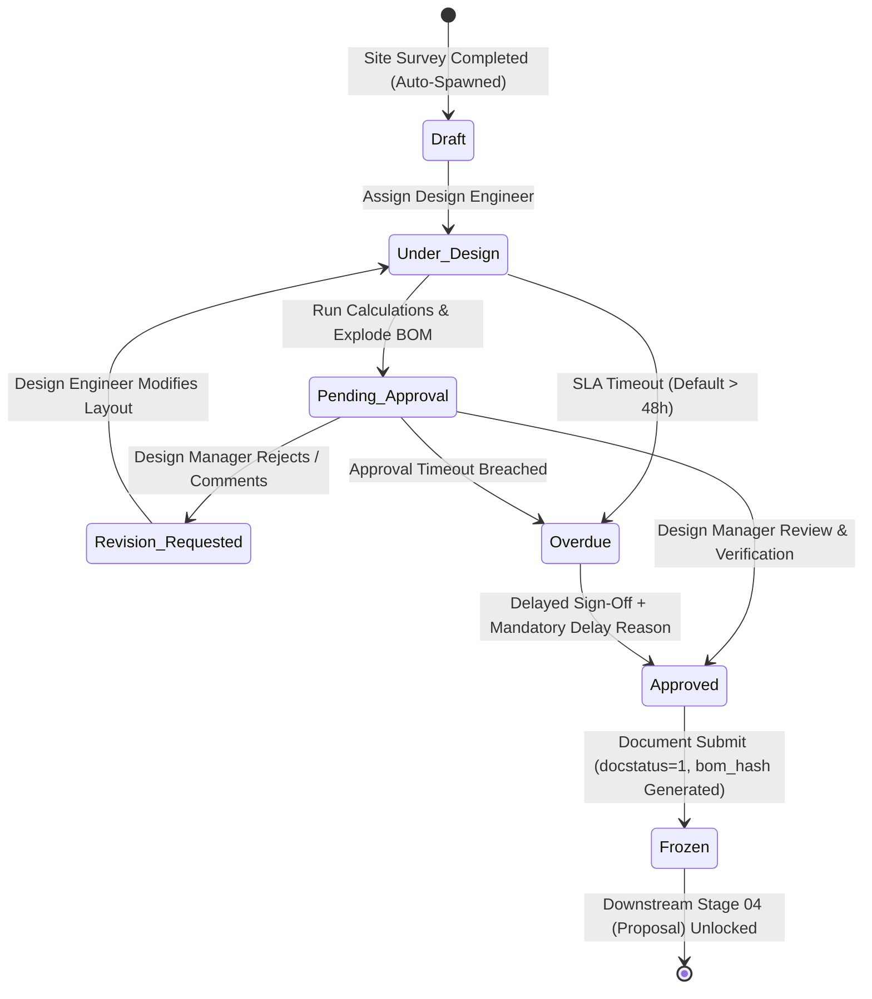

# STEP_03_SURVEY_ENGINEERING_DESIGN_BOM_SPECIFICATION.caveman.md

# Enterprise Lifecycle Step Specification: Survey Engineering Design & Dynamic BOM Freeze

**Document ID:** `STEP-03-DESIGN`  
**Lifecycle Flow:** Flow 1: Core Solar EPC Project Execution (Stage 03 of 11)  
**Governing Architecture:** [`architect_docs/02_STEP_PLANNING_SPECIFICATION_BLUEPRINT.md`](../architect_docs/02_STEP_PLANNING_SPECIFICATION_BLUEPRINT.md)  
**PRD / FRS Traceability:** [`planning_ref_docs/01_PROJECT_FOUNDATION_MODEL.md`](../planning_ref_docs/01_PROJECT_FOUNDATION_MODEL.md) (`BC-03`, `Sec 3.3`), [`planning_ref_docs/05_BUSINESS_REQUIREMENTS_DOCUMENT.md`](../planning_ref_docs/05_BUSINESS_REQUIREMENTS_DOCUMENT.md) (`BR-003`), [`planning_ref_docs/06_FUNCTIONAL_REQUIREMENTS_SPECIFICATION.md`](../planning_ref_docs/06_FUNCTIONAL_REQUIREMENTS_SPECIFICATION.md) (`FR-003`), [`planning_ref_docs/08_DATABASE_DESIGN_DOCUMENT.md`](../planning_ref_docs/08_DATABASE_DESIGN_DOCUMENT.md) (`Domain 3: ENG`), [`planning_ref_docs/09_API_DESIGN_AND_INTEGRATIONS.md`](../planning_ref_docs/09_API_DESIGN_AND_INTEGRATIONS.md) (`API 3`), [`planning_ref_docs/10_UI_UX_SPECIFICATION.md`](../planning_ref_docs/10_UI_UX_SPECIFICATION.md) (`Screen 6`), [`planning_ref_docs/11_MODULE_FUNCTIONAL_DOCUMENTATION.md`](../planning_ref_docs/11_MODULE_FUNCTIONAL_DOCUMENTATION.md) (`MOD-03`)  
**Target Module:** `solar_module` / `manoj`  
**Author:** Principal Enterprise Architect  
**Status:** Ready for Implementation

---

## 1. Step Scope, Objectives & Context Traceability

### 1.1 Lifecycle Positioning & Engineering Context

Stage 03 establish technical blueprint + material baseline for Solar EPC project. Trigger on Stage 02 (`Site Survey`) completion. Bridge field survey measurements to CAD layouts, Single Line Diagrams (SLD), parametric electrical cable math, dynamic BOM explosion.

Enforce submittable DocType: `Survey Engineering Design` (`tabSurvey Engineering Design`). Lock technical parameters, compute cable cross-sections ($\le 2\%$ voltage drop), generate SHA-256 hash (`bom_hash`) of BOM rows, freeze single source of truth for Stage 04 (`Proposal`) + Stage 06 (`Sales Order`) + Stage 07 (`Delivery Note`).

```
┌─────────────────┐       ┌─────────────────────────────────────────────────────────┐       ┌─────────────────┐
│   STAGE 02:     │       │        STAGE 03: SURVEY ENGINEERING DESIGN & BOM        │       │    STAGE 04:    │
│ Site Survey &   │──────▶│ - Standalone Submittable DocType (Survey Eng Design)    │──────▶│ Commercial      │
│ Technical Audit │       │ - AutoCAD / SLD / PVsyst Versioned CAD Dropzone         │       │ Proposal &      │
│ (Completed, GPS)│       │ - Parametric Cable Sizing & Voltage Drop Math (≤ 2%)    │       │ Subsidy Engine  │
│                 │       │ - Dynamic BOM Explosion (`Custom Quot BOM`)             │       │ (PM Surya Ghar) │
│                 │       │ - Cryptographic Baseline Freeze (`bom_hash` SHA-256)    │       │                 │
│                 │       │ - 24h/48h SLA Engine & Delayed Sign-Off Logging         │       │                 │
└─────────────────┘       └─────────────────────────────────────────────────────────┘       └─────────────────┘
```

- **Predecessor:** Stage 02: Technical Site Survey & Audit (`Site Survey` status `Completed`, GPS lock, 6 mandatory photos).
- **Successor:** Stage 04: Commercial Proposal & Subsidy Engine (`Proposal` + `Quotation` consume frozen `Custom Quot BOM`).

### 1.2 Core Business Objectives & Target KPIs

1. **Zero Redesign Rework:** Layout + MPPT stringing + cable routes match audited site before quotation.
2. **Sub-48h Turnaround (SLA $\le 48\text{h}$):** Standard design, CAD upload, calculations, BOM in $\le 48\text{h}$.
3. **Voltage Drop Limit ($\le 2\%$):** DC/AC voltage drop $\le 2.0\%$ under peak load per IEC 60364-7-712 & IS 732.
4. **BOM Freeze Hash (`bom_hash`):** Deterministic SHA-256 hash across all BOM rows on submission.
5. **Configurable File Upload Cap:** Admin-configurable upload ceiling (`max_file_size_mb`, default 25 MB).

### 1.3 Failure Modes Eliminated

- **Under-Budgeted BOS:** Eliminates on-site DC cable / earthing shortages at Stage 08.
- **Inverter MPPT Clipping:** Prevents winter overvoltage / summer undervoltage.
- **DISCOM SLD Rejections:** Standardizes SLD drawings, eliminates net-meter rejection at Stage 10.
- **Uncontrolled BOM Drift:** Prevents sales edits to engineering BOM post sign-off.

---

## 2. Stakeholders, Enterprise Actors & HRMS Role Mapping

### 2.1 Enterprise User Roles Matrix

Zero "User" Suffix Rule enforced:

| Persona / Business Actor        | Frappe System Role   | HRMS Department           | HRMS Designation             | Operational Responsibilities                                                                        |
| :------------------------------ | :------------------- | :------------------------ | :--------------------------- | :-------------------------------------------------------------------------------------------------- |
| **Solar Design Specialist**     | `Design Engineer`    | Design & Engineering      | `Solar Design Engineer`      | Ingest survey, draft CAD/SLD, run cable math, explode BOM, submit design.                           |
| **Engineering Approver / Lead** | `Design Manager`     | Design & Engineering      | `Engineering Design Manager` | Review technical math, verify loadings/drops, approve & submit design baseline.                     |
| **Site Survey Auditor**         | `Survey Engineer`    | Engineering Operations    | `Site Survey Auditor`        | Provide physical roof clarifications and cable path constraints.                                    |
| **Area Sales Manager**          | `Area Sales Manager` | Sales & Marketing         | `Area Sales Manager`         | Consume frozen BOM for commercial proposal.                                                         |
| **Solar EPC Director / Admin**  | `Admin`, `Director`  | Executive Management      | `Managing Director`          | Supreme operational command; manage `Solar SLA Settings`, `Solar Design Settings`, delay overrides. |
| **Technical DevOps Lead**       | `System Manager`     | Technology Infrastructure | `DevOps Architect`           | Framework apex; manage DocType schemas, Redis queues, daemons, bench CLI.                           |

### 2.2 Permission Hierarchy Matrix

| DocType / Action                        | Design Engineer  | Design Manager | Survey Engineer | Area Sales Manager |     Admin\*      |
| :-------------------------------------- | :--------------: | :------------: | :-------------: | :----------------: | :--------------: |
| **Survey Engineering Design (Read)**    |  Assigned Only   | Full Territory |  Linked Survey  |     Permitted      |   All Records    |
| **Survey Engineering Design (Create)**  |   Auto-Spawned   |   Permitted    |       No        |         No         |       Yes        |
| **Survey Engineering Design (Write)**   | Own (Draft Only) | Full Territory |       No        |         No         |   All Records    |
| **Survey Engineering Design (Approve)** |        No        |      Yes       |       No        |         No         |       Yes        |
| **Survey Engineering Design (Submit)**  |        No        |      Yes       |       No        |         No         |       Yes        |
| **Site Survey Design File (Upload)**    |    Own Record    |   Permitted    |       No        |         No         |   Full Access    |
| **Cable Calculation Table (Edit)**      |    Own Record    |   Permitted    |       No        |         No         |   Full Access    |
| **Custom Quot BOM (Edit)**              |    Own Record    |   Permitted    |       No        |         No         |   Full Access    |
| **Remark-Delay Log (Append)**           |    Own Record    |   Permitted    |       No        |     Permitted      |   Full Access    |
| **Solar Design Settings (Manage)**      |        No        |       No       |       No        |         No         | Yes (Admin Only) |

---

## 3. Relational Schema & 3NF Data Dictionary

### 3.1 Standalone Submittable DocType: `tabSurvey Engineering Design`

| Fieldname                  | Label                          | Fieldtype    | Options / Target                                                                       | Mandatory |    Index     | Description & Validation Rules                                        |
| :------------------------- | :----------------------------- | :----------- | :------------------------------------------------------------------------------------- | :-------: | :----------: | :-------------------------------------------------------------------- |
| `naming_series`            | Naming Series                  | `Select`     | `SED-.YYYY.-.#####`                                                                    |  **Yes**  |      -       | Autonaming series reset annually.                                     |
| `site_survey`              | Linked Site Survey             | `Link`       | `Site Survey`                                                                          |  **Yes**  | **Index: 1** | FK upstream Stage 02 survey. Must have `stage_status == 'Completed'`. |
| `lead`                     | Linked Lead Reference          | `Link`       | `Lead`                                                                                 |  **Yes**  | **Index: 1** | Read-only FK from `site_survey.lead`.                                 |
| `customer_name`            | Client / Customer Name         | `Data`       | -                                                                                      |    No     |      -       | Fetch `site_survey.lead_name`.                                        |
| `design_date`              | Design Initiation Date         | `Date`       | -                                                                                      |  **Yes**  |      -       | Default: `Today`.                                                     |
| `design_engineer`          | Design Engineer Assigned       | `Link`       | `User`                                                                                 |  **Yes**  | **Index: 1** | Role `Design Engineer`.                                               |
| `design_manager`           | Design Approver                | `Link`       | `User`                                                                                 |    No     |      -       | Role `Design Manager`. Reqd before submit.                            |
| `system_type`              | System Configuration           | `Select`     | `On-Grid\nHybrid\nOff-Grid`                                                            |  **Yes**  |      -       | Fetched from survey.                                                  |
| `site_type`                | Roof / Surface Classification  | `Select`     | `RCC\nGround Mount\nShed (Profile Sheet)\nCar Port (Parking)\nRCC & Shed\nOther`       |  **Yes**  |      -       | Fetched from survey.                                                  |
| `mounting_type`            | MMS Mounting Standard          | `Select`     | `Normal\nElevated\nProfile Sheet\nBallast\nGround Screws\nOthers`                      |  **Yes**  |      -       | MMS architecture; drives MMS tonnage.                                 |
| `target_capacity`          | Target Capacity (kW)           | `Float`      | -                                                                                      |  **Yes**  |      -       | Survey capacity. Precision: 2.                                        |
| `actual_designed_capacity` | Actual Designed Capacity (kWp) | `Float`      | -                                                                                      |  **Yes**  |      -       | Total Modules \* Module Wattage / 1000. Precision: 2.                 |
| `module_item_code`         | Selected PV Module             | `Link`       | `Item`                                                                                 |  **Yes**  |      -       | Item Group: `Solar PV Module`.                                        |
| `module_wattage`           | Module Peak Wattage (Wp)       | `Float`      | -                                                                                      |  **Yes**  |      -       | Fetch from `module_item_code`. Precision: 1.                          |
| `module_tech_type`         | Cell Technology & Sourcing     | `Select`     | `DCR\nNDCR`                                                                            |  **Yes**  |      -       | Domestic Content Requirement flag.                                    |
| `total_modules_count`      | Total Number of Modules        | `Int`        | -                                                                                      |  **Yes**  |      -       | Panel count; integer string sizing.                                   |
| `inverter_item_code`       | Selected Solar Inverter        | `Link`       | `Item`                                                                                 |  **Yes**  |      -       | Item Group: `Solar Inverter`.                                         |
| `inverter_rated_capacity`  | Inverter Rated Power (kW)      | `Float`      | -                                                                                      |  **Yes**  |      -       | Nominal AC rating. Precision: 2.                                      |
| `inverter_count`           | Inverter Quantity              | `Int`        | -                                                                                      |  **Yes**  |      -       | Default: 1.                                                           |
| `dc_ac_ratio`              | DC to AC Sizing Ratio (ILR)    | `Float`      | -                                                                                      |  **Yes**  |      -       | Ratio: designed capacity / (inverter kW \* count).                    |
| `modules_per_string`       | Modules per String             | `Int`        | -                                                                                      |  **Yes**  |      -       | String length; validated against $V_{mppt}$.                          |
| `number_of_strings`        | Total Number of Strings        | `Int`        | -                                                                                      |  **Yes**  |      -       | Parallel strings.                                                     |
| `max_dc_voltage_drop_pct`  | Max DC Voltage Drop (%)        | `Float`      | -                                                                                      |  **Yes**  |      -       | Max DC drop across rows. Must be $\le 2.0\%$.                         |
| `max_ac_voltage_drop_pct`  | Max AC Voltage Drop (%)        | `Float`      | -                                                                                      |  **Yes**  |      -       | Max AC drop to meter. Must be $\le 2.0\%$.                            |
| `design_files`             | Versioned CAD / SLD Files      | `Table`      | `Site Survey Design File`                                                              |  **Yes**  |      -       | CAD/SLD/PVsyst repository.                                            |
| `cable_calculations`       | Parametric Cable Math Table    | `Table`      | `Cable Calculation Table`                                                              |  **Yes**  |      -       | Sizing & voltage drop child rows.                                     |
| `bom_items`                | Dynamic Engineering BoQ        | `Table`      | `Custom Quot BOM`                                                                      |  **Yes**  |      -       | Exploded BoQ rows.                                                    |
| `stage_status`             | Lifecycle Stage Status         | `Select`     | `Draft\nUnder Design\nPending Approval\nApproved\nFrozen\nOverdue\nRevision Requested` |  **Yes**  | **Index: 1** | Primary state attribute.                                              |
| `is_frozen`                | Engineering Baseline Locked    | `Check`      | -                                                                                      |  **Yes**  | **Index: 1** | Set to 1 on submission.                                               |
| `bom_hash`                 | Cryptographic BOM Checksum     | `Data`       | -                                                                                      |    No     | **Index: 1** | SHA-256 hash of BOM rows.                                             |
| `for_design_assign_on`     | Assignment Timestamp           | `Datetime`   | -                                                                                      |  **Yes**  |      -       | Assignment timestamp; starts SLA.                                     |
| `exp_complete_date`        | SLA Deadline Datetime          | `Datetime`   | -                                                                                      |  **Yes**  | **Index: 1** | `for_design_assign_on + SLA_Hours`.                                   |
| `completed_date`           | Actual Completion Datetime     | `Datetime`   | -                                                                                      |    No     |      -       | Timestamp when frozen.                                                |
| `complete_status`          | SLA Compliance Outcome         | `Select`     | `On Time\nDelayed`                                                                     |    No     |      -       | SLA evaluation.                                                       |
| `delay_log`                | Delay Reason Summary           | `Small Text` | -                                                                                      |    No     |      -       | Reqd if `complete_status == 'Delayed'`.                               |
| `remark_delay_log`         | Granular Delay Audit Table     | `Table`      | `Remark-Delay Log`                                                                     |    No     |      -       | Immutable delay log.                                                  |

---

### 3.2 Child DocType: `tabSite Survey Design File`

| Fieldname          | Label             | Fieldtype  | Options / Target                                                                                                                                        | Mandatory | In List View | Description & Rules                                  |
| :----------------- | :---------------- | :--------- | :------------------------------------------------------------------------------------------------------------------------------------------------------ | :-------: | :----------: | :--------------------------------------------------- |
| `file_category`    | Document Category | `Select`   | `CAD Layout (DWG/DXF)\nSingle Line Diagram (SLD)\nPVsyst Simulation Report\n3D Shadow Analysis\nStructural Stability Certificate\nOther Technical File` |  **Yes**  |      1       | Classification. Must have $\ge 1$ CAD + $\ge 1$ SLD. |
| `version`          | Document Version  | `Data`     | -                                                                                                                                                       |  **Yes**  |      1       | Semantic version (e.g. `v1.0`).                      |
| `attached_file`    | File Attachment   | `Attach`   | -                                                                                                                                                       |  **Yes**  |      1       | Validated against Admin limit (`max_file_size_mb`).  |
| `file_size_kb`     | File Size (KB)    | `Float`    | -                                                                                                                                                       |    No     |      1       | Populated on upload.                                 |
| `remarks`          | Design Notes      | `Data`     | -                                                                                                                                                       |    No     |      0       | Engineering change notes.                            |
| `uploaded_by`      | Uploaded By       | `Link`     | `User`                                                                                                                                                  |    No     |      0       | User audit tracking.                                 |
| `upload_timestamp` | Uploaded On       | `Datetime` | -                                                                                                                                                       |    No     |      0       | System timestamp.                                    |

---

### 3.3 Child DocType: `tabCable Calculation Table`

| Fieldname             | Label                    | Fieldtype | Options / Target                                                                              | Mandatory | In List View | Description & Calculation Rules                                                               |
| :-------------------- | :----------------------- | :-------- | :-------------------------------------------------------------------------------------------- | :-------: | :----------: | :-------------------------------------------------------------------------------------------- |
| `circuit_type`        | Circuit Description      | `Select`  | `DC String to Inverter\nInverter AC Output to Meter\nEarthing Conductor\nLightning Conductor` |  **Yes**  |      1       | Electrical circuit role.                                                                      |
| `circuit_tag`         | Circuit Identifier       | `Data`    | -                                                                                             |  **Yes**  |      1       | Identifier (e.g. `DC-STR-01`).                                                                |
| `cable_length_m`      | One-Way Route Length (m) | `Float`   | -                                                                                             |  **Yes**  |      1       | One-way distance (DC from survey `panel_and_inverter_dst`, AC from `panel_and_meter_dst`).    |
| `conductor_material`  | Conductor Metal          | `Select`  | `Copper (Cu)\nAluminium (Al)`                                                                 |  **Yes**  |      1       | Cu standard for DC; Al/Cu for AC.                                                             |
| `conductor_size_mm2`  | Cross Section ($mm^2$)   | `Select`  | `4.0\n6.0\n10.0\n16.0\n25.0\n35.0\n50.0\n70.0\n95.0\n120.0\n150.0\n185.0\n240.0`              |  **Yes**  |      1       | Metric wire gauge.                                                                            |
| `rated_current_a`     | Design Current ($I_b$)   | `Float`   | -                                                                                             |  **Yes**  |      1       | DC: $I_{mp}$ or $1.25 \times I_{sc}$. AC: $\frac{P_{ac}}{\sqrt{3} \times V \times \cos\phi}$. |
| `operating_voltage_v` | System Voltage ($V$)     | `Float`   | -                                                                                             |  **Yes**  |      0       | System voltage ($600\text{V DC}$, $415\text{V AC}$, $230\text{V AC}$).                        |
| `resistance_ohm_km`   | Conductor Resistance     | `Float`   | -                                                                                             |  **Yes**  |      0       | Ohmic resistance at $75^\circ\text{C}$ ($\Omega/\text{km}$).                                  |
| `voltage_drop_v`      | Voltage Drop (Volts)     | `Float`   | -                                                                                             |  **Yes**  |      1       | 1-Phase/DC: $\frac{2 L I R}{1000}$. 3-Phase: $\frac{\sqrt{3} L I R}{1000}$.                   |
| `voltage_drop_pct`    | Voltage Drop (%)         | `Float`   | -                                                                                             |  **Yes**  |      1       | $(\Delta V / V) \times 100$. Must be $\le 2.0\%$.                                             |
| `compliance_status`   | Gate Status              | `Select`  | `Pass\nFail`                                                                                  |  **Yes**  |      1       | `Pass` if $\le 2.0\%$, else `Fail`.                                                           |

---

### 3.4 Child DocType: `tabCustom Quot BOM`

| Fieldname             | Label               | Fieldtype  | Options / Target                                                                                          | Mandatory | In List View | Description & Business Rules                                |
| :-------------------- | :------------------ | :--------- | :-------------------------------------------------------------------------------------------------------- | :-------: | :----------: | :---------------------------------------------------------- |
| `item_code`           | ERPNext Item Code   | `Link`     | `Item`                                                                                                    |  **Yes**  |      1       | Stock item FK.                                              |
| `bom_item`            | Item Name / Label   | `Data`     | -                                                                                                         |  **Yes**  |      1       | Descriptor (e.g. `Solar PV Modules`, `Grid Tied Inverter`). |
| `category`            | BoQ Category        | `Select`   | `Modules\nInverter\nStructure (MMS)\nDC Electrical\nAC Electrical\nEarthing & Protection\nHardware & BOS` |  **Yes**  |      1       | Grouping category.                                          |
| `type`                | Sourcing Sub-Type   | `Select`   | `\nDCR\nNDCR`                                                                                             |    No     |      1       | Mandatory when `category == 'Modules'`.                     |
| `brand`               | Preferred OEM/Make  | `Data`     | -                                                                                                         |    No     |      1       | OEM (e.g. `Waaree`, `Adani`, `Growatt`).                    |
| `capacity`            | Technical Rating    | `Data`     | -                                                                                                         |    No     |      1       | Rating (e.g. `550 Wp Bifacial`, `10 kW 3-Phase`).           |
| `quantity`            | Billable Quantity   | `Float`    | -                                                                                                         |  **Yes**  |      1       | Exploded quantity. Precision: 2.                            |
| `uom`                 | Unit of Measure     | `Link`     | `UOM`                                                                                                     |  **Yes**  |      1       | Standard UOM (`Nos`, `Meter`, `Set`, `Kg`).                 |
| `estimated_unit_rate` | Estimated Base Rate | `Currency` | `Company:currency`                                                                                        |    No     |      0       | Rate from Item Price list.                                  |
| `estimated_amount`    | Total Line Amount   | `Currency` | `Company:currency`                                                                                        |    No     |      0       | `quantity * estimated_unit_rate`.                           |
| `description`         | Item Specification  | `Text`     | -                                                                                                         |    No     |      0       | Spec details.                                               |

---

## 4. State Machine, Verification Gates & SLA Engine

### 4.1 State Machine Lifecycle Diagram



### 4.2 Hard Verification Gates

```
┌──────────────────────────────────────────────────────────────────────────────────────────────────┐
│                             STAGE 03 HARD VERIFICATION GATES                                     │
├──────────────────────────────────────────────────────────────────────────────────────────────────┤
│ Gate 1: Mandatory File Verification                                                              │
│ - Design Files child table must contain ≥ 1 record with `file_category == 'CAD Layout (DWG/DXF)'`│
│ - Design Files child table must contain ≥ 1 record with `file_category == 'Single Line Diagram'` │
│ - Every attached file must not exceed `max_file_size_mb` configured in `Solar Design Settings`   │
├──────────────────────────────────────────────────────────────────────────────────────────────────┤
│ Gate 2: Electrical Voltage Drop Compliance                                                       │
│ - All rows in `tabCable Calculation Table` must evaluate to `compliance_status == 'Pass'`        │
│ - `max_dc_voltage_drop_pct` must be ≤ 2.0% under worst-case string operating current             │
│ - `max_ac_voltage_drop_pct` must be ≤ 2.0% under rated inverter output current                   │
├──────────────────────────────────────────────────────────────────────────────────────────────────┤
│ Gate 3: Inverter Sizing Ratio (ILR) Window                                                       │
│ - Inverter Loading Ratio (`dc_ac_ratio`) must fall strictly between 1.10 and 1.35                │
│ - Calculated string voltage at minimum temperature (-5°C) must not exceed inverter max $V_{dc}$  │
│ - Calculated string voltage at maximum temperature (70°C) must not drop below inverter $V_{mppt}$│
├──────────────────────────────────────────────────────────────────────────────────────────────────┤
│ Gate 4: Dynamic BOM Integrity & Cryptographic Baseline Freeze                                    │
│ - `tabCustom Quot BOM` must contain at least 1 module row and 1 inverter row                     │
│ - All BOM quantities must be > 0.0 with valid ERPNext Item links                                 │
│ - System computes SHA-256 hash of all BOM rows and writes to `bom_hash` upon `on_submit()`       │
└──────────────────────────────────────────────────────────────────────────────────────────────────┘
```

### 4.3 SLA, TAT Engine & Delay Logging

1. **SLA Countdown Start:** `for_design_assign_on` stamped on assignment. `exp_complete_date = for_design_assign_on + SLA_Hours (default 48h)`.
2. **Escalation Daemon (`solar_module.solar_tat.evaluate_design_sla`):** Hourly background job flags records past deadline as `Overdue` + `complete_status = 'Delayed'`. Send notification to `Design Manager` & `Area Sales Manager`.
3. **Mandatory Delay Reason:** If overdue design approved, controller enforces `delay_log` ($\ge 15\text{ chars}$) + append audit row in `tabRemark-Delay Log`.

---

## 5. Controller Logic, Domain Services & Whitelisted APIs

### 5.1 DocType Controller: `SurveyEngineeringDesign`

```python
# solar_module/solar/doctype/survey_engineering_design/survey_engineering_design.py
import json
import hashlib
import frappe
from frappe import _
from frappe.model.document import Document
from frappe.utils import flt, now_datetime, get_datetime
from solar_module.solar.services.design_calculation_service import SolarDesignCalculationService
from solar_module.solar.services.bom_explosion_service import SolarBOMExplosionService
from solar_module.solar.services.design_gate_service import SolarDesignGateService
from solar_module.solar.services.design_sla_service import SolarDesignSLAService


class SurveyEngineeringDesign(Document):
    def validate(self):
        """Standard Frappe validation lifecycle."""
        self.enforce_predecessor_integrity()
        self.enforce_file_size_limits()
        self.recalculate_engineering_parameters()
        SolarDesignGateService.validate_draft_invariants(self)

    def before_submit(self):
        """Verification gate execution prior to formal submission."""
        SolarDesignGateService.verify_all_gates(self)
        self.execute_bom_freeze()

    def on_submit(self):
        """Permanent lock and downstream stage activation."""
        self.is_frozen = 1
        self.stage_status = "Frozen"
        self.completed_date = now_datetime()
        SolarDesignSLAService.record_completion(self)
        self.update_site_survey_status()
        self.publish_design_event()

    def on_cancel(self):
        """Restricted cancellation: blocks cancel if downstream Proposal/Quotation exists."""
        if frappe.db.exists("Quotation", {"custom_survey_design": self.name, "docstatus": 1}):
            frappe.throw(
                _("Cannot cancel Engineering Design {0} because it is referenced in an active Quotation.").format(self.name),
                frappe.LinkExistsError
            )
        self.is_frozen = 0
        self.stage_status = "Draft"

    def enforce_predecessor_integrity(self):
        survey_status = frappe.db.get_value("Site Survey", self.site_survey, "stage_status")
        if survey_status != "Completed":
            frappe.throw(
                _("Linked Site Survey {0} must be 'Completed' before engineering design can proceed.").format(self.site_survey),
                frappe.ValidationError
            )

    def enforce_file_size_limits(self):
        max_mb = flt(frappe.db.get_single_value("Solar Design Settings", "max_file_size_mb")) or 25.0
        for row in self.get("design_files", []):
            if row.attached_file:
                file_doc = frappe.get_doc("File", {"file_url": row.attached_file})
                file_mb = flt(file_doc.file_size) / (1024 * 1024)
                row.file_size_kb = flt(file_doc.file_size) / 1024
                if file_mb > max_mb:
                    frappe.throw(
                        _("File '{0}' ({1:.2f} MB) exceeds maximum allowed size of {2} MB. Adjust in Solar Design Settings.").format(
                            file_doc.file_name, file_mb, max_mb
                        ),
                        frappe.ValidationError
                    )

    def recalculate_engineering_parameters(self):
        SolarDesignCalculationService.calculate_capacities_and_drops(self)

    def execute_bom_freeze(self):
        """Calculates deterministic SHA-256 hash of exploded BOM."""
        self.bom_hash = SolarBOMExplosionService.compute_bom_hash(self.get("bom_items", []))

    def update_site_survey_status(self):
        frappe.db.set_value("Site Survey", self.site_survey, "custom_design_frozen", 1, update_modified=False)
```

---

### 5.2 Pure Domain Service: `SolarDesignCalculationService`

```python
# solar_module/solar/services/design_calculation_service.py
import math
from frappe.utils import flt


class SolarDesignCalculationService:
    COPPER_RHO = 0.0175  # Ohm * mm^2 / m at 20 deg C
    ALUMINIUM_RHO = 0.0282  # Ohm * mm^2 / m at 20 deg C
    TEMP_COEFF = 0.004  # Standard temperature coefficient per deg C

    @classmethod
    def calculate_capacities_and_drops(cls, doc):
        """Calculates system capacities, DC/AC ratios, and evaluates cable rows."""
        total_modules = int(doc.total_modules_count or 0)
        module_wp = flt(doc.module_wattage or 0.0)
        doc.actual_designed_capacity = flt((total_modules * module_wp) / 1000.0, 2)

        inverter_kw = flt(doc.inverter_rated_capacity or 0.0)
        inverter_count = int(doc.inverter_count or 1)
        total_inverter_kw = inverter_kw * inverter_count

        if total_inverter_kw > 0:
            doc.dc_ac_ratio = flt(doc.actual_designed_capacity / total_inverter_kw, 2)
        else:
            doc.dc_ac_ratio = 0.0

        max_dc_drop = 0.0
        max_ac_drop = 0.0

        for row in doc.get("cable_calculations", []):
            drop_pct = cls.calculate_row_voltage_drop(row)
            row.voltage_drop_pct = drop_pct
            row.compliance_status = "Pass" if drop_pct <= 2.0 else "Fail"

            if "DC" in (row.circuit_type or ""):
                max_dc_drop = max(max_dc_drop, drop_pct)
            elif "AC" in (row.circuit_type or ""):
                max_ac_drop = max(max_ac_drop, drop_pct)

        doc.max_dc_voltage_drop_pct = flt(max_dc_drop, 2)
        doc.max_ac_voltage_drop_pct = flt(max_ac_drop, 2)

    @classmethod
    def calculate_row_voltage_drop(cls, row):
        length_m = flt(row.cable_length_m)
        current_a = flt(row.rated_current_a)
        area_mm2 = flt(row.conductor_size_mm2)
        voltage_v = flt(row.operating_voltage_v)

        if area_mm2 <= 0 or voltage_v <= 0 or length_m <= 0 or current_a <= 0:
            return 0.0

        is_copper = "Copper" in (row.conductor_material or "Copper")
        base_rho = cls.COPPER_RHO if is_copper else cls.ALUMINIUM_RHO
        # Corrected for 75 deg C operating temperature
        rho_75 = base_rho * (1 + cls.TEMP_COEFF * (75 - 20))
        resistance_per_meter = rho_75 / area_mm2
        row.resistance_ohm_km = flt(resistance_per_meter * 1000.0, 4)

        is_three_phase = "3-Phase" in (str(row.operating_voltage_v) or "") or voltage_v >= 380

        if is_three_phase:
            v_drop = math.sqrt(3) * length_m * current_a * resistance_per_meter
        else:
            v_drop = 2.0 * length_m * current_a * resistance_per_meter

        row.voltage_drop_v = flt(v_drop, 2)
        return flt((v_drop / voltage_v) * 100.0, 2)
```

---

### 5.3 Pure Domain Service: `SolarBOMExplosionService`

```python
# solar_module/solar/services/bom_explosion_service.py
import json
import hashlib
import frappe
from frappe.utils import flt, ceil


class SolarBOMExplosionService:
    @classmethod
    def explode_dynamic_bom(cls, design_doc):
        """Explodes dynamic Bill of Materials based on capacity, site type, and cable math."""
        items = []
        capacity_kw = flt(design_doc.actual_designed_capacity)
        total_modules = int(design_doc.total_modules_count)
        system_type = design_doc.system_type
        site_type = design_doc.site_type

        # 1. Primary PV Modules
        items.append({
            "item_code": design_doc.module_item_code,
            "bom_item": "Solar PV Modules",
            "category": "Modules",
            "type": design_doc.module_tech_type,
            "brand": frappe.db.get_value("Item", design_doc.module_item_code, "brand") or "Tier 1",
            "capacity": f"{design_doc.module_wattage} Wp",
            "quantity": total_modules,
            "uom": "Nos",
        })

        # 2. Solar Inverter
        items.append({
            "item_code": design_doc.inverter_item_code,
            "bom_item": "Grid Tied Inverter",
            "category": "Inverter",
            "type": "On-Grid" if system_type == "On-Grid" else "Hybrid",
            "brand": frappe.db.get_value("Item", design_doc.inverter_item_code, "brand") or "Standard OEM",
            "capacity": f"{design_doc.inverter_rated_capacity} kW",
            "quantity": int(design_doc.inverter_count or 1),
            "uom": "Nos",
        })

        # 3. Module Mounting Structure (MMS) - Kg estimate based on site type
        mms_factor_kg_per_kw = 45.0 if "Elevated" in (design_doc.mounting_type or "") else 25.0
        mms_tonnage = flt((capacity_kw * mms_factor_kg_per_kw), 1)
        mms_item = cls.get_default_item_for_category("Structure (MMS)", "HDG MMS Structure Kit")
        items.append({
            "item_code": mms_item,
            "bom_item": "Module Mounting Structure (HDG)",
            "category": "Structure (MMS)",
            "type": design_doc.mounting_type,
            "capacity": f"Tilt Angle 15-25 Deg",
            "quantity": mms_tonnage,
            "uom": "Kg",
        })

        # 4. DC Solar Cable (Twin Core 4/6 sq.mm)
        dc_len_m = 0.0
        for row in design_doc.get("cable_calculations", []):
            if "DC" in (row.circuit_type or ""):
                dc_len_m += flt(row.cable_length_m) * 2.1  # Positive + Negative + 5% slack
        dc_len_m = max(dc_len_m, capacity_kw * 12.0)  # Rule of thumb fallback
        dc_cable_item = cls.get_default_item_for_category("DC Electrical", "Solar DC Cable 4/6 sq.mm")
        items.append({
            "item_code": dc_cable_item,
            "bom_item": "Solar DC Cable XLPO",
            "category": "DC Electrical",
            "capacity": "1.5 kV DC Rated",
            "quantity": ceil(dc_len_m),
            "uom": "Meter",
        })

        # 5. AC Armoured Cable
        ac_len_m = 0.0
        for row in design_doc.get("cable_calculations", []):
            if "AC" in (row.circuit_type or ""):
                ac_len_m += flt(row.cable_length_m) * 1.08  # 8% route routing factor
        ac_len_m = max(ac_len_m, 20.0)  # Minimum 20m default
        ac_cable_item = cls.get_default_item_for_category("AC Electrical", "AC Armoured Cable")
        items.append({
            "item_code": ac_cable_item,
            "bom_item": "AC Armoured Feeder Cable",
            "category": "AC Electrical",
            "capacity": "1.1 kV Grade",
            "quantity": ceil(ac_len_m),
            "uom": "Meter",
        })

        # 6. Protection & Earthing Kits
        earth_pits = 3 if capacity_kw <= 10.0 else 5
        earth_item = cls.get_default_item_for_category("Earthing & Protection", "Chemical Earthing Electrode")
        items.append({
            "item_code": earth_item,
            "bom_item": "Chemical Earthing Kit",
            "category": "Earthing & Protection",
            "capacity": "Copper Bonded 50mm x 3m",
            "quantity": earth_pits,
            "uom": "Set",
        })

        # Populate rates from standard buying price list
        for itm in items:
            rate = frappe.db.get_value("Item Price", {"item_code": itm["item_code"], "buying": 1}, "price_list_rate") or 0.0
            itm["estimated_unit_rate"] = flt(rate, 2)
            itm["estimated_amount"] = flt(itm["quantity"] * itm["estimated_unit_rate"], 2)

        return items

    @classmethod
    def get_default_item_for_category(cls, category, default_label):
        code = frappe.db.get_value("Item", {"item_group": category, "is_stock_item": 1}, "name")
        return code or default_label

    @classmethod
    def compute_bom_hash(cls, bom_rows):
        """Generates deterministic cryptographic SHA-256 hash of BOM entries."""
        canonical_rows = []
        for r in sorted(bom_rows, key=lambda x: str(x.get("item_code") or x.get("bom_item"))):
            canonical_rows.append({
                "item_code": r.get("item_code"),
                "bom_item": r.get("bom_item"),
                "quantity": flt(r.get("quantity"), 2),
                "uom": r.get("uom"),
                "type": r.get("type"),
                "capacity": r.get("capacity")
            })
        raw_payload = json.dumps(canonical_rows, sort_keys=True, separators=(',', ':'))
        return hashlib.sha256(raw_payload.encode("utf-8")).hexdigest()
```

---

### 5.4 Whitelisted REST / RPC APIs

```python
# solar_module/api/design.py
import json
import frappe
from frappe import _
from solar_module.solar.services.bom_explosion_service import SolarBOMExplosionService
from solar_module.solar.services.design_calculation_service import SolarDesignCalculationService


@frappe.whitelist(methods=["POST"])
def calculate_electrical_parameters(doc_name: str) -> dict:
    """Whitelisted endpoint to re-run electrical voltage drop calculations."""
    if not doc_name:
        frappe.throw(_("Document name is required"), frappe.ValidationError)

    doc = frappe.get_doc("Survey Engineering Design", doc_name)
    doc.check_permission("write")

    SolarDesignCalculationService.calculate_capacities_and_drops(doc)
    doc.save()

    return {
        "status": "success",
        "actual_designed_capacity": doc.actual_designed_capacity,
        "dc_ac_ratio": doc.dc_ac_ratio,
        "max_dc_voltage_drop_pct": doc.max_dc_voltage_drop_pct,
        "max_ac_voltage_drop_pct": doc.max_ac_voltage_drop_pct,
        "calculations": [
            {
                "circuit_tag": r.circuit_tag,
                "voltage_drop_pct": r.voltage_drop_pct,
                "compliance_status": r.compliance_status
            }
            for r in doc.get("cable_calculations", [])
        ]
    }


@frappe.whitelist(methods=["POST"])
def explode_dynamic_bom(doc_name: str) -> dict:
    """Whitelisted endpoint to dynamically regenerate the engineering BOM."""
    if not doc_name:
        frappe.throw(_("Document name is required"), frappe.ValidationError)

    doc = frappe.get_doc("Survey Engineering Design", doc_name)
    doc.check_permission("write")

    if doc.docstatus == 1 or doc.is_frozen:
        frappe.throw(_("Cannot explode BOM on a frozen or submitted engineering design."), frappe.ValidationError)

    exploded_items = SolarBOMExplosionService.explode_dynamic_bom(doc)
    doc.set("bom_items", [])
    for itm in exploded_items:
        doc.append("bom_items", itm)

    doc.save()
    return {"status": "success", "total_items": len(doc.bom_items)}


@frappe.whitelist(methods=["POST"])
def submit_design_approval(doc_name: str) -> dict:
    """Action for Design Manager to approve and submit the design baseline."""
    if not doc_name:
        frappe.throw(_("Document name is required"), frappe.ValidationError)

    doc = frappe.get_doc("Survey Engineering Design", doc_name)
    if "Design Manager" not in frappe.get_roles() and "System Manager" not in frappe.get_roles():
        frappe.throw(_("Only Design Managers can approve engineering designs."), frappe.PermissionError)

    doc.design_manager = frappe.session.user
    doc.stage_status = "Approved"
    doc.submit()

    return {"status": "success", "stage_status": doc.stage_status, "bom_hash": doc.bom_hash}
```

---

## 6. Frontend UI/UX Specification & Workbench

### 6.1 Unified Landing Architecture & Desk Access Rule

Root `/desk` or `/app` intercepted. Designers land on `/solar/design/:id` in Vue 3 SPA. Desk views accessible only via permission-gated deep-links.

### 6.2 Responsive Vue 3 Design Workbench Layout Blueprint (`/solar/design/:id`)

Three-column workbench layout:

```
┌──────────────────────────────────────────────────────────────────────────────────────────────────┐
│ TOP BAR: SED-2026-00042  |  Site: Thane Logistics Shed  |  Status: [ UNDER DESIGN ]  | SLA: 18h │
├─────────────────────────┬───────────────────────────────────┬────────────────────────────────────┤
│ 1. SURVEY CONTEXT CARD  │ 2. CAD & SCHEMATIC WORKSPACE      │ 3. ELECTRICAL MATH & DYNAMIC BOM   │
├─────────────────────────┼───────────────────────────────────┼────────────────────────────────────┤
│ • Client: Sadbhav Agro  │ • Dropzone: CAD DWG / SLD / PVsyst│ • Module Sizing: 550 Wp DCR Monos  │
│ • Verified kW: 12.0 kW  │   [ Upload New Version ]          │   Total Panels: 24 (13.20 kWp)     │
│ • Surface: Profile Shed │ • Active Files:                   │ • Inverter: Growatt 10kW (ILR 1.32)│
│ • Array-Inverter: 32 m  │   - Layout_v1.2.dwg (18.4 MB)     │ • DC Cable Drop: 1.42% [PASS]      │
│ • Inverter-Meter: 48 m  │   - SLD_Electrical_v1.0.pdf (4MB) │ • AC Cable Drop: 1.68% [PASS]      │
│ • 360° Photo Gallery    │ • Admin File Limit: 25 MB max     ├────────────────────────────────────┤
│   [Thumbnail Grid]      │                                   │ • Dynamic BOM Items (8 Rows)       │
│ • Satellite Map Pin     │                                   │   [ Re-Explode Dynamic BOM ]       │
│   (Lat: 19.21, Lng: 72.9│                                   │ • BOM Hash: 8f9b...a12c            │
├─────────────────────────┴───────────────────────────────────┴────────────────────────────────────┤
│ FOOTER ACTION BAR: [ Run Cable Calculations ]   [ Explode BOM ]   [ Submit to Manager for Sign-Off]│
└──────────────────────────────────────────────────────────────────────────────────────────────────┘
```

### 6.3 Frappe Desk Form View Customizations

1. **Status Badges:** `Draft` (Grey), `Under Design` (Blue), `Pending Approval` (Orange), `Approved` (Indigo), `Frozen` (Emerald Padlock), `Overdue` (Flashing Red).
2. **Desk Action Buttons (`survey_engineering_design.js`):**
   - `Run Parametric Math`: Call `calculate_electrical_parameters`.
   - `Explode Dynamic BOM`: Call `explode_dynamic_bom`.
   - `Sign-Off & Freeze Baseline`: Visible to `Design Manager` if gates evaluate `Pass`.

---

## 7. Cross-App Integration Touchpoints

### 7.1 ERPNext Core

- **Item Master (`tabItem`):** Query items in `Solar PV Module`, `Solar Inverter`, `Structure (MMS)`, `DC Electrical`, `AC Electrical`. Pull UOM and buying rates.
- **Quotation (`tabQuotation`):** Stage 04 copies `bom_items` to `Quotation.custom_bom` and cable calculations to `Quotation.custom_extra_cable_calculation`.
- **Sales Order (`tabSales Order`):** Stage 06 locks baseline, converts `Custom Quot BOM` rows to `is_site_material: 1`.

### 7.2 Frappe CRM

- **CRM Lead / Deal Sync:** Transition to `Approved` or `Frozen` emits event setting `CRM Lead` stage to `Engineering Design Completed` and records CAD links in timeline.

### 7.3 Frappe HRMS

- **Staff Assignment & Turnaround Tracking:** `design_engineer` maps to `tabEmployee`. Tracks turnaround time (`completed_date - for_design_assign_on`) in departmental KPIs.

### 7.4 Governance Settings Integration

- **`Solar Design Settings`:** Admin single DocType exposing `max_file_size_mb` (25 MB default), `default_dc_drop_limit_pct` (2.0%), `default_ac_drop_limit_pct` (2.0%).
- **`Solar SLA Settings`:** Admin DocType configuring target SLA hours (48h commercial, 24h residential).

---

## 8. Automated Testing & QA Criteria

### 8.1 Test Architecture & Zero-Commit Rule

All tests subclass `frappe.testing.IntegrationTestCase`. Transactions rollback automatically (`frappe.db.rollback()`). Zero `commit()`.

### 8.2 Mandatory Automated Test Suite

```python
# solar_module/solar/doctype/survey_engineering_design/test_survey_engineering_design.py
import frappe
from frappe.testing import IntegrationTestCase
from frappe.utils import now_datetime, add_to_date


class TestSurveyEngineeringDesign(IntegrationTestCase):
    def setUp(self):
        super().setUp()
        self.create_prerequisite_masters()

    def tearDown(self):
        frappe.db.rollback()
        super().tearDown()

    def create_prerequisite_masters(self):
        # Create mock survey, items, and settings
        pass

    def test_happy_path_design_submission_and_bom_freeze(self):
        """Test complete flow: calculation, BOM explosion, and baseline freezing."""
        doc = self.create_valid_design_doc()
        doc.save()

        # Assert preliminary calculations
        self.assertEqual(doc.actual_designed_capacity, 11.0)
        self.assertLessEqual(doc.max_dc_voltage_drop_pct, 2.0)

        # Approve and Submit
        doc.stage_status = "Approved"
        doc.design_manager = "test_manager@sadbhav.com"
        doc.submit()

        self.assertEqual(doc.docstatus, 1)
        self.assertEqual(doc.is_frozen, 1)
        self.assertTrue(len(doc.bom_hash) == 64)  # Valid SHA-256 hash
        self.assertEqual(doc.stage_status, "Frozen")

    def test_rejection_when_cad_files_missing(self):
        """Gate 1 Failure: Should raise ValidationError if CAD or SLD is missing."""
        doc = self.create_valid_design_doc()
        doc.design_files = []  # Clear files
        doc.stage_status = "Pending Approval"

        with self.assertRaises(frappe.ValidationError):
            doc.submit()

    def test_rejection_when_voltage_drop_exceeds_threshold(self):
        """Gate 2 Failure: Should raise ValidationError if cable voltage drop > 2.0%."""
        doc = self.create_valid_design_doc()
        # Force excessive cable length
        doc.cable_calculations[0].cable_length_m = 500.0
        doc.cable_calculations[0].conductor_size_mm2 = "4.0"
        doc.save()

        self.assertGreater(doc.max_dc_voltage_drop_pct, 2.0)
        with self.assertRaises(frappe.ValidationError):
            doc.submit()

    def test_rejection_when_file_exceeds_admin_size_limit(self):
        """Admin Custom Limit: Reject file exceeding configured threshold."""
        frappe.db.set_single_value("Solar Design Settings", "max_file_size_mb", 10.0)
        doc = self.create_valid_design_doc()
        # Mock file size 15 MB
        doc.design_files[0].file_size_kb = 15 * 1024

        with self.assertRaises(frappe.ValidationError):
            doc.save()

    def test_sla_escalation_and_delay_reason_enforcement(self):
        """Ensure overdue designs require delay reasons before saving."""
        doc = self.create_valid_design_doc()
        doc.for_design_assign_on = add_to_date(now_datetime(), days=-3)
        doc.exp_complete_date = add_to_date(now_datetime(), days=-1)
        doc.stage_status = "Overdue"
        doc.complete_status = "Delayed"
        doc.delay_log = ""  # Missing explanation

        with self.assertRaises(frappe.ValidationError):
            doc.save()
```

---

## 9. Operational SOP, Error Resolution & Runbook

### 9.1 End-User Standard Operating Procedure (SOP)

1. **Assignment Ingestion:** Design Engineer opens `/solar/design/:id` on survey completion alert.
2. **Review Field Parameters:** Verify roof dimensions, 360° photos, sanctioned load, cable distance.
3. **Upload Engineering Drawings:** Drop CAD layout (.dwg/.dxf) + SLD (.pdf/.dwg). Verify file $\le 25\text{ MB}$.
4. **Run Parametric Math:** Click **Run Parametric Math**. Verify DC/AC drops show green `Pass` ($\le 2\%$).
5. **Explode Dynamic BOM:** Click **Explode Dynamic BOM**. Review panels, inverters, MMS tonnage, cables.
6. **Submission & Approval:** Click **Submit to Manager for Sign-Off**. Design Manager clicks **Approve & Freeze Baseline**. Locks with green `Frozen` + `bom_hash`.

### 9.2 Operator Error Resolution Matrix

| Error Message Displayed                     | Root Cause                                     | Operator Remediation Procedure                                                          |
| :------------------------------------------ | :--------------------------------------------- | :-------------------------------------------------------------------------------------- |
| `CAD Layout or SLD File Missing`            | Gate 1 incomplete; mandatory drawings missing. | Upload $\ge 1$ CAD Layout and $\ge 1$ Single Line Diagram.                              |
| `File Exceeds Max Allowed Size (25 MB)`     | Uploaded file exceeds Admin limit.             | Purge CAD layers or request Admin adjust `max_file_size_mb` in `Solar Design Settings`. |
| `Voltage Drop Exceeded (Max 2.0%)`          | Wire gauge too small for distance.             | Increase cross-section (4 sq.mm $\rightarrow$ 6 or 10 sq.mm) and re-run calculations.   |
| `DC/AC Ratio Out of Bounds (1.10 - 1.35)`   | Inverter mismatched for PV array.              | Adjust inverter rating or panel count to match 1.15-1.30 ILR window.                    |
| `Delay Reason Mandatory for Overdue Design` | Design finished past 48h SLA deadline.         | Enter detailed delay reason ($\ge 15\text{ chars}$) before save.                        |
| `BOM Frozen: Mutation Prohibited`           | Document submitted and frozen.                 | File Engineering Change Request (ECR) via `Revision Requested`.                         |

### 9.3 Technical Incident Runbook (L3 DevOps)

- **Queue Job Lag:** Run `bench doctor`. Inspect RQ jobs in `default`. Trigger manual check: `bench execute solar_module.solar_tat.evaluate_design_sla`.
- **BOM Hash Mismatch:** Recompute hash via `SolarBOMExplosionService.compute_bom_hash()`. Flag unauthorized database mutations.
- **Nginx Upload Ceiling:** Verify `client_max_body_size 50m;` in `/etc/nginx/conf.d/frappe.conf`.

---

## 10. Definition-of-Done Rollup Checklist

| Check                                                                                         | Governing Reference | Verification Method       |
| :-------------------------------------------------------------------------------------------- | :-----------------: | :------------------------ |
| Dedicated submittable DocType `Survey Engineering Design` configured with `is_submittable: 1` |   `03`, `STEP-03`   | Schema Review             |
| Zero "User" Suffix Rule strictly enforced (`Design Engineer`, `Design Manager`, `Admin`)      |    `02`, README     | Nomenclature Audit        |
| Mandatory CAD and SLD file gate implemented with customizable Admin file size threshold       |    `04`, Sec 4.2    | Unit Test Execution       |
| Pure domain calculation service (`SolarDesignCalculationService`) enforces $\le 2\%$ drop     |    `05`, Sec 5.2    | Mathematical Verification |
| Dynamic BOM explosion service generates `Custom Quot BOM` with cryptographic `bom_hash`       |    `05`, Sec 5.3    | SHA-256 Checksum Test     |
| 24h/48h SLA countdown engine and overdue delay reason enforcement active                      |    `01`, Sec 4.3    | Daemon Execution Audit    |
| Whitelisted POST RPC endpoints declare IDOR checks and typed parameters                       |    `04`, Sec 5.4    | Static Code Analysis      |
| Automated integration test suite passes with zero database commits (`rollback`)               |    `07`, Sec 8.2    | CI Test Runner            |
| Complete 9-section step specification, user SOP, and DevOps runbook finalized                 |    `02`, Sec 1-9    | Documentation Gate        |
