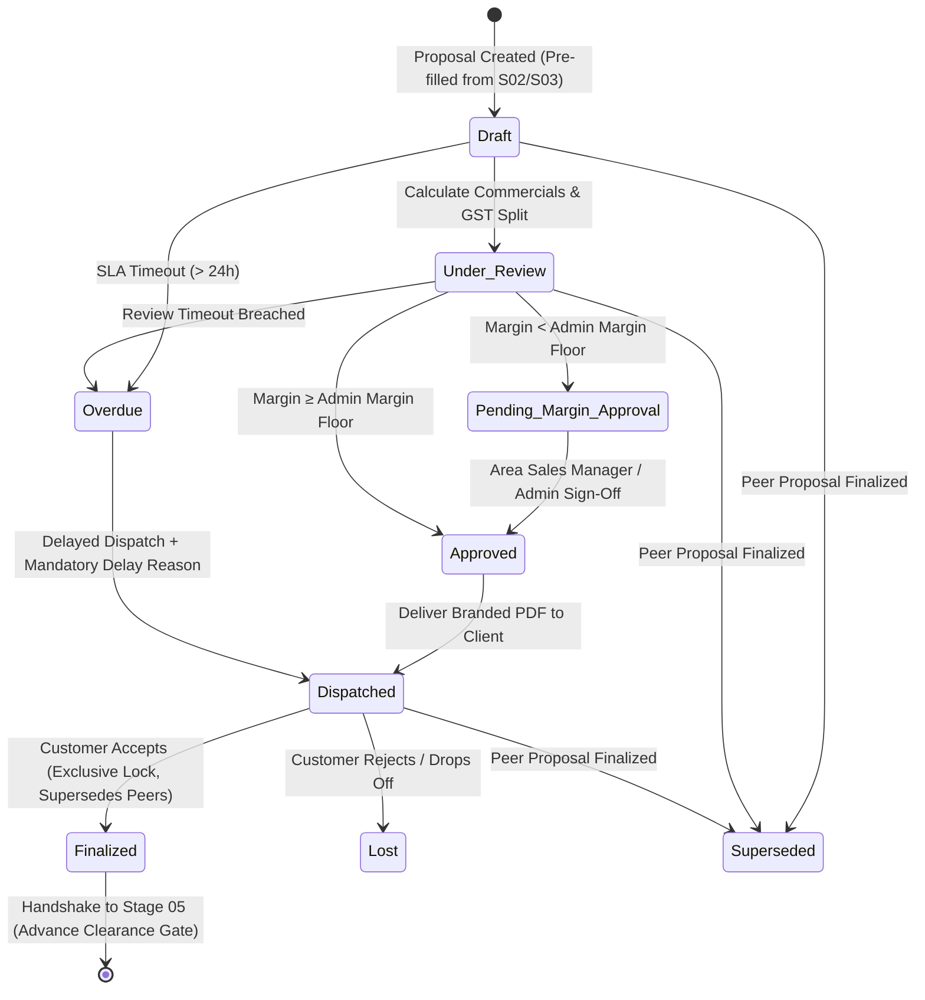

# STEP_04_PROPOSAL_SUBSIDY_SPECIFICATION.caveman.md

# Enterprise Lifecycle Step Specification: Proposal & Subsidy Engine

**Document ID:** `STEP-04-PROPOSAL`  
**Lifecycle Flow:** Flow 1: Core Solar EPC Project Execution (Stage 04 of 11)  
**Governing Architecture:** [`architect_docs/02_STEP_PLANNING_SPECIFICATION_BLUEPRINT.md`](../architect_docs/02_STEP_PLANNING_SPECIFICATION_BLUEPRINT.md)  
**Architecture Decision Record:** [`docs/decisions/ADR-004-PROPOSAL-SUBSIDY-ENGINE.md`](../docs/decisions/ADR-004-PROPOSAL-SUBSIDY-ENGINE.md)  
**PRD / FRS Traceability:** [`planning_ref_docs/01_PROJECT_FOUNDATION_MODEL.md`](../planning_ref_docs/01_PROJECT_FOUNDATION_MODEL.md) (`BC-04`, `Sec 3.4`), [`planning_ref_docs/05_BUSINESS_REQUIREMENTS_DOCUMENT.md`](../planning_ref_docs/05_BUSINESS_REQUIREMENTS_DOCUMENT.md) (`BR-004`), [`planning_ref_docs/06_FUNCTIONAL_REQUIREMENTS_SPECIFICATION.md`](../planning_ref_docs/06_FUNCTIONAL_REQUIREMENTS_SPECIFICATION.md) (`FR-004`), [`planning_ref_docs/08_DATABASE_DESIGN_DOCUMENT.md`](../planning_ref_docs/08_DATABASE_DESIGN_DOCUMENT.md) (`Domain 4: FIN`), [`planning_ref_docs/09_API_DESIGN_AND_INTEGRATIONS.md`](../planning_ref_docs/09_API_DESIGN_AND_INTEGRATIONS.md) (`API 4`), [`planning_ref_docs/10_UI_UX_SPECIFICATION.md`](../planning_ref_docs/10_UI_UX_SPECIFICATION.md) (`Screen 7`), [`planning_ref_docs/11_MODULE_FUNCTIONAL_DOCUMENTATION.md`](../planning_ref_docs/11_MODULE_FUNCTIONAL_DOCUMENTATION.md) (`MOD-04`)  
**Target Module:** `solar_module` / `manoj` (Extend ERPNext `Quotation` via Custom Fields + Property Setters, alias to `Proposal`)  
**Author:** Principal Enterprise Architect  
**Status:** Ready for Implementation

---

## 1. Step Scope, Objectives & Context Traceability

### 1.1 Lifecycle Positioning & Commercial Context

Stage 04 bridge Stage 03 (`Survey Engineering Design` + `Custom Quot BOM`) to commercial client contracts. Convert technical sizing, cable schedule, frozen BOM into legally compliant **Proposal**.

Key design parameters:

1. **Universal Naming:** Document named strictly **`Proposal`** across system, forms, print, portal. Underlying entity: ERPNext `tabQuotation` with label aliasing.
2. **Repetitive Multi-Proposal per Project:** Client can request multiple capacity / brand / discount options for same survey/deal (e.g. 5 kW vs 8 kW vs 10 kW). Multiple proposals creatable for same survey; **only 1 finalized**, peer proposals auto-marked `Superseded`. All marked `Lost`/`Rejected` if deal drops.
3. **Two-Tier Pre-Fill:** Auto-pull Stage 02 (`Site Survey` address, GPS, load, DISCOM, roof type) + Stage 03 (`Survey Engineering Design` kW capacity, module/inverter models, cable math, BOM verified via `bom_hash`).
4. **Configurable 70:30 Solar GST Split:** Statutory CBIC solar split: **70% Goods** (`Solar Power Plant` @ 12% or 5% GST) + **30% Services** (`Installation & Commissioning` @ 18% GST). Ratio editable per proposal if client contract require supply-only or custom split.
5. **Dual Subsidy Engine:** Pre-defined subsidy selector (`Solar Subsidy Scheme`) + Admin-managed Central (PM Surya Ghar CFA) & State slabs in `Solar Proposal Settings`.
6. **Admin Margin Floor Gate:** Compare live BOM cost to quoted price. Margin < Admin floor (default 18%) trigger mandatory `Area Sales Manager` / `Admin` approval.
7. **Advance Verification & Goodwill VIP Gate:** Standard advance $\ge 50\%$, or Finance Officer waiver, or **Goodwill / VIP Approval** by CEO / MD / Admin (no finance clearance needed).
8. **Prospect Quarantine:** Prospect stay in `tabLead` throughout Stage 04. No `Customer` record created until Stage 05 advance clearance.

```
┌──────────────────┐       ┌────────────────────────────────────────────────────────┐       ┌──────────────────┐
│    STAGE 03:     │       │                STAGE 04: PROPOSAL & SUBSIDY            │       │    STAGE 05:     │
│ Survey Eng Design│──────▶│ - Repetitive Multi-Proposals per Survey / Deal         │──────▶│ Advance Clearance│
│ & Dynamic BOM    │       │ - Auto Pre-Fill from Survey (S02) & Design (S03)       │       │ & Customer Gate  │
│ (Frozen bom_hash)│       │ - Configurable 70:30 Composite Solar GST Engine        │       │ (≥50% Advance OR │
│                  │       │ - Pre-Defined & Admin-Configured Subsidy Slabs         │       │ Goodwill VIP CEO)│
│                  │       │ - Admin-Controlled Gross Margin Floor Governance Gate  │       │                  │
│                  │       │ - Exclusive Finalization Lock (1 Accepted, Rest Supers)│       │                  │
│                  │       │ - 24-Hour SLA / TAT Engine with Delay Logging          │       │                  │
└──────────────────┘       └────────────────────────────────────────────────────────┘       └──────────────────┘
```

- **Predecessor:** Stage 03: Survey Engineering Design (`Survey Engineering Design` status `Frozen`, submittable).
- **Successor:** Stage 05: Advance Payment & Customer Inception Gate (`custom_is_finalized == 1`, advance $\ge 50\%$ or Goodwill waiver $\rightarrow$ `Customer` master created).

### 1.2 Core Business Objectives & Target KPIs

1. **Sub-15m Proposal Creation:** Fast proposal generation by auto-populating survey + design BOM.
2. **100% Margin Floor Governance:** Block unauthorized margin erosion via automated margin check and ASM/Admin gate.
3. **Flawless GST Compliance:** Split goods (70%) and services (30%) lines to eliminate tax penalty risks.
4. **Zero Multi-Proposal State Conflict:** Only 1 proposal finalized per survey; active siblings set to `Superseded`.
5. **Subsidy Accuracy:** Exact PM Surya Ghar CFA + State subsidy math using Admin-configured slabs.
6. **Lead Quarantine:** No `Customer` master created before Stage 05 advance verified.

### 1.3 Failure Modes Eliminated

- **Ad-Hoc Discount Slippage:** Eliminates unapproved sales discounts below profitable margins.
- **Solar GST Audit Penalties:** Eliminates single-line turnkey solar quote tax penalties under Indian GST.
- **Conflicting Dual Commitments:** Prevents multiple conflicting proposal options from active execution.
- **Manual Data Re-Entry Errors:** Auto-transposes module counts, inverter ratings, cable runs from engineering SED.
- **Subsidy Miscalculation:** Eliminates incorrect subsidy quotes to customer.

---

## 2. Stakeholders, Enterprise Actors & HRMS Role Mapping

### 2.1 Enterprise User Roles Matrix

Zero "User" Suffix Rule enforced:

| Persona / Business Actor      | Frappe System Role     | HRMS Department           | HRMS Designation            | Operational Responsibilities                                                                                         |
| :---------------------------- | :--------------------- | :------------------------ | :-------------------------- | :------------------------------------------------------------------------------------------------------------------- |
| **CRM Representative**        | `CRM Representative`   | CRM & Proposals           | `CRM Representative`        | Pull survey + design data, select template, set commercial pricing, generate proposals, send to client.              |
| **CRM Manager**               | `CRM Manager`          | CRM & Proposals           | `CRM Manager`               | Audit pricing, check 70:30 GST split, verify subsidy applicability, review margin floors, supervisory oversight.     |
| **Sales Representative**      | `Sales Representative` | Sales & Marketing         | `Sales Representative`      | Lead-to-proposal handoff alignment, customer relationship management.                                                |
| **Sales Manager**             | `Sales Manager`        | Sales & Marketing         | `Sales Manager`             | Sales operations coordination and margin review.                                                                     |
| **Accounts Assistant**        | `Accounts Assistant`   | Accounts & Finance        | `Accounts Assistant`        | Review commercial milestone schedule, handle formal advance verification.                                            |
| **Accounts Manager**          | `Accounts Manager`     | Accounts & Finance        | `Accounts Manager`          | Authorize finance advance waivers and credit terms.                                                                  |
| **Solar Design Specialist**   | `Design Engineer`      | Design & Engineering      | `Solar Design Engineer`     | Upstream author; provide frozen `Survey Engineering Design`, technical ratings, dynamic BOM (`bom_hash`).            |
| **Executive Supreme Command** | `Admin`, `Director`    | Executive Leadership      | `Managing Director` / `CEO` | Supreme operational command; grant Goodwill / VIP advance waivers, manage `Solar Proposal Settings`, review margins. |
| **Technical DevOps Lead**     | `System Manager`       | Technology Infrastructure | `DevOps Architect`          | Framework apex; manage DocType schemas, custom fields, Property Setters, Redis worker queues, bench CLI tooling.     |

> [!IMPORTANT]
> **Authority Hierarchy:** `System Manager` (Framework Apex / Developer) $\rightarrow$ `Admin` (Project Supreme Command) $\rightarrow$ Operational Roles.
>
> - `System Manager`: Code, DocType schemas, bench CLI, system console, Developer Mode.
> - `Admin`: Supreme command on business docs, manages `Solar Proposal Settings`, margin floors, subsidy slabs, SLA settings. Grants Goodwill / VIP approvals. Restricted from code and DocType schema modification.

### 2.2 Permission Hierarchy Matrix

| DocType / Action                           | CRM Representative |   CRM Manager   | Sales Representative | Accounts Manager |      Admin\*      |
| :----------------------------------------- | :----------------: | :-------------: | :------------------: | :--------------: | :---------------: |
| **Proposal / Quotation (Read)**            |   Assigned Only    | Full Department |    Assigned Only     |    Permitted     |    All Records    |
| **Proposal / Quotation (Create)**          |     Permitted      |    Permitted    |      Permitted       |        No        |        Yes        |
| **Proposal / Quotation (Write/Edit)**      |  Own (Draft Only)  | Full Department |   Own (Draft Only)   |        No        |    All Records    |
| **Proposal / Quotation (Submit)**          |     Permitted      |       Yes       |      Permitted       |        No        |        Yes        |
| **Margin Floor Override Approval**         |     Restricted     |     **Yes**     |      Restricted      |    Restricted    | **Yes (Supreme)** |
| **Proposal Finalization (`is_finalized`)** |     Permitted      |       Yes       |      Permitted       |        No        |        Yes        |
| **Goodwill / VIP Advance Waiver**          |     Restricted     |   Restricted    |      Restricted      |    Restricted    | **Yes (CEO/MD)**  |
| **Solar Proposal Template (Manage)**       |     Read Only      |    Permitted    |      Read Only       |    Read Only     |        Yes        |
| **Solar Proposal Settings (Manage)**       |         No         |       No        |          No          |        No        | Yes (Admin Only)  |
| **Remark-Delay Log (Append)**              |     Own Record     | Full Department |      Own Record      |    Permitted     |    Full Access    |

_\*Note: `Administrator` and `System Manager` inherit all permissions._

---

## 3. Relational Schema & 3NF Data Dictionary

### 3.1 Core Entity Modeling: Extending ERPNext `tabQuotation`

Option B: Extend standard `tabQuotation` with `custom_*` fields, alias UI to **`Proposal`**:

| Fieldname                          | Label                          | Fieldtype    | Options / Target                                                                                  | Mandatory |    Index     | Description & Validation Rules                                                      |
| :--------------------------------- | :----------------------------- | :----------- | :------------------------------------------------------------------------------------------------ | :-------: | :----------: | :---------------------------------------------------------------------------------- |
| `custom_proposal_id`               | Proposal Reference ID          | `Data`       | -                                                                                                 |    No     | **Index: 1** | Formatted ID (e.g. `PROP-2026-00124-A`).                                            |
| `custom_site_survey`               | Linked Site Survey             | `Link`       | `Site Survey`                                                                                     |  **Yes**  | **Index: 1** | Foreign key linking upstream Stage 02 survey.                                       |
| `custom_survey_engineering_design` | Linked Engineering Design      | `Link`       | `Survey Engineering Design`                                                                       |    No     | **Index: 1** | Foreign key linking Stage 03 design. Must be `stage_status == 'Frozen'`.            |
| `party_name`                       | Prospect Reference (Lead)      | `Link`       | `Lead`                                                                                            |  **Yes**  | **Index: 1** | Enforce quarantine: `quotation_to == 'Lead'`.                                       |
| `custom_solar_capacity`            | Solar Capacity (kW)            | `Float`      | -                                                                                                 |  **Yes**  |      -       | Sized DC plant capacity. Pre-filled from SED or template. Precision: 2.             |
| `custom_plant_category`            | Plant Category                 | `Select`     | `Residential\nCommercial\nIndustrial\nAgricultural (KUSUM)`                                       |  **Yes**  |      -       | Sets tariff logic, tax rates, subsidy applicability.                                |
| `custom_system_type`               | System Type                    | `Select`     | `On-Grid\nHybrid\nOff-Grid`                                                                       |  **Yes**  |      -       | Ingested from survey/design.                                                        |
| `custom_mount_type`                | MMS Mounting Type              | `Select`     | `Normal\nElevated\nProfile Sheet\nBallast\nGround Screws\nOthers`                                 |  **Yes**  |      -       | Ingested from survey/design.                                                        |
| `custom_proposal_template`         | Proposal Package Template      | `Link`       | `Solar Proposal Template`                                                                         |    No     |      -       | Standard capacity equipment & pricing packages.                                     |
| `custom_goods_services_ratio`      | GST Supply Ratio Standard      | `Select`     | `70:30 Standard (CBIC)\n100:0 Supply Only\n0:100 Service Only\nCustom Ratio`                      |  **Yes**  |      -       | Default: `70:30 Standard (CBIC)`.                                                   |
| `custom_goods_ratio_pct`           | Goods Proportion (%)           | `Percent`    | -                                                                                                 |  **Yes**  |      -       | Allocated to Goods (`Solar Power Plant`). Default: 70.0%. Editable on custom ratio. |
| `custom_services_ratio_pct`        | Services Proportion (%)        | `Percent`    | -                                                                                                 |  **Yes**  |      -       | Allocated to Services (`Installation & Commissioning`). Default: 30.0%.             |
| `custom_subsidy_scheme`            | Pre-Defined Subsidy Scheme     | `Link`       | `Solar Subsidy Scheme`                                                                            |    No     |      -       | Link to pre-defined government subsidy program.                                     |
| `custom_central_subsidy_amount`    | Central Subsidy (CFA ₹)        | `Currency`   | `Company:currency`                                                                                |    No     |      -       | PM Surya Ghar or PM KUSUM CFA amount.                                               |
| `custom_state_subsidy_amount`      | State Top-Up Subsidy (₹)       | `Currency`   | `Company:currency`                                                                                |    No     |      -       | State DISCOM top-up subsidy from Admin-configured slabs.                            |
| `custom_total_subsidy_amount`      | Total Subsidy Amount (₹)       | `Currency`   | `Company:currency`                                                                                |    No     |      -       | Central + State subsidy sum.                                                        |
| `custom_net_customer_payable`      | Net Customer Payable (₹)       | `Currency`   | `Company:currency`                                                                                |  **Yes**  |      -       | `grand_total - custom_total_subsidy_amount`. Net customer investment.               |
| `custom_annual_generation_kwh`     | Estimated Annual Yield (kWh)   | `Float`      | -                                                                                                 |    No     |      -       | Energy output ($kWh/\text{year}$) via specific yield factor.                        |
| `custom_annual_savings_amount`     | Estimated Annual Savings (₹)   | `Currency`   | `Company:currency`                                                                                |    No     |      -       | `annual_generation_kwh * grid_tariff_rate`.                                         |
| `custom_payback_years`             | Estimated Simple Payback (Yrs) | `Float`      | -                                                                                                 |    No     |      -       | `custom_net_customer_payable / custom_annual_savings_amount`. Precision: 1.         |
| `custom_estimated_bom_cost`        | Total Estimated BOM Cost (₹)   | `Currency`   | `Company:currency`                                                                                |  **Yes**  |      -       | Aggregated live material cost of BOM from Stage 03 SED.                             |
| `custom_gross_margin_pct`          | Calculated Gross Margin (%)    | `Percent`    | -                                                                                                 |  **Yes**  | **Index: 1** | `((net_total - custom_estimated_bom_cost) / net_total) * 100`. Precision: 2.        |
| `custom_margin_status`             | Gross Margin Evaluation        | `Select`     | `Within Margin\nMargin Floor Exception\nMargin Override Approved`                                 |  **Yes**  | **Index: 1** | Evaluated vs Admin floor. Default: `Within Margin`.                                 |
| `custom_margin_approved_by`        | Margin Override Approver       | `Link`       | `User`                                                                                            |    No     |      -       | Digital signature of `Area Sales Manager` or `Admin` authorizing override.          |
| `custom_margin_override_remark`    | Margin Override Justification  | `Small Text` | -                                                                                                 |    No     |      -       | Mandatory justification text for commercial margin exception.                       |
| `custom_advance_requirement_pct`   | Required Advance (%)           | `Percent`    | -                                                                                                 |  **Yes**  |      -       | Standard: 50.0%. Admin-configurable.                                                |
| `custom_advance_waiver_type`       | Advance Payment Clearance Gate | `Select`     | `Standard (≥50% Required)\nFinance Approved Waiver\nGoodwill / VIP Approved`                      |  **Yes**  |      -       | Governs Stage 05 gate. Default: `Standard (≥50% Required)`.                         |
| `custom_advance_waived_by`         | Advance Waived / Approved By   | `Link`       | `User`                                                                                            |    No     |      -       | Required on waiver. Goodwill waiver restricted to CEO / MD / Admin.                 |
| `custom_advance_waiver_remark`     | Advance Waiver Justification   | `Small Text` | -                                                                                                 |    No     |      -       | Mandatory justification for advance waiver or VIP customer classification.          |
| `custom_is_finalized`              | Finalized Commercial Proposal  | `Check`      | -                                                                                                 |  **Yes**  | **Index: 1** | Exactly ONE proposal per survey can be 1. Supersedes peer proposals.                |
| `custom_superseded_by`             | Superseded by Proposal         | `Link`       | `Quotation`                                                                                       |    No     |      -       | Pointer to finalized winning proposal.                                              |
| `custom_finalized_datetime`        | Finalization Timestamp         | `Datetime`   | -                                                                                                 |    No     |      -       | Timestamp when customer accepted and proposal locked as finalized.                  |
| `custom_bom_hash`                  | Cryptographic BOM Checksum     | `Data`       | -                                                                                                 |    No     | **Index: 1** | Ingested SHA-256 hash from Stage 03 SED.                                            |
| `custom_extra_cable_calculation`   | Extra Cable Length Table       | `Table`      | `Cable Calculation Table`                                                                         |    No     |      -       | Surcharges for cable runs over standard allowance.                                  |
| `custom_proposal_sent_date`        | Proposal Dispatched Date       | `Date`       | -                                                                                                 |    No     |      -       | Date PDF emailed/messaged to prospect.                                              |
| `custom_proposal_sent_days`        | Age Since Dispatch (Days)      | `Int`        | -                                                                                                 |    No     |      -       | Daily counter updated by worker daemon.                                             |
| `custom_next_followup_date`        | Next Commercial Followup       | `Date`       | -                                                                                                 |    No     |      -       | Scheduled sales followup date.                                                      |
| `stage_status`                     | Lifecycle Stage Status         | `Select`     | `Draft\nUnder Review\nPending Margin Approval\nApproved\nDispatched\nFinalized\nSuperseded\nLost` |  **Yes**  | **Index: 1** | Operational lifecycle workflow state.                                               |
| `for_proposal_assign_on`           | Assignment Datetime            | `Datetime`   | -                                                                                                 |  **Yes**  |      -       | Timestamp when Stage 04 began; starts 24h SLA timer.                                |
| `exp_complete_date`                | SLA Due Datetime               | `Datetime`   | -                                                                                                 |  **Yes**  | **Index: 1** | Deadline: `for_proposal_assign_on + SLA_Hours`.                                     |
| `completed_date`                   | Completion Datetime            | `Datetime`   | -                                                                                                 |    No     |      -       | Datetime proposal dispatched or finalized.                                          |
| `complete_status`                  | SLA Compliance Status          | `Select`     | `On Time\nDelayed`                                                                                |    No     |      -       | SLA evaluation outcome.                                                             |
| `delay_log`                        | Delay Reason Summary           | `Small Text` | -                                                                                                 |    No     |      -       | Mandatory summary when `complete_status == 'Delayed'`.                              |
| `remark_delay_log`                 | Granular Delay Audit Table     | `Table`      | `Remark-Delay Log`                                                                                |    No     |      -       | Immutable audit log tracking user, timestamp, delay reason, remarks.                |

---

### 3.2 Extended Child DocType: `tabQuotation Item`

Extend standard `tabQuotation Item`:

| Fieldname            | Label                   | Fieldtype  | Options / Target                                                                          | Mandatory | In List View | Description & Business Rules                                                        |
| :------------------- | :---------------------- | :--------- | :---------------------------------------------------------------------------------------- | :-------: | :----------: | :---------------------------------------------------------------------------------- |
| `item_code`          | Item Code               | `Link`     | `Item`                                                                                    |  **Yes**  |      1       | `Solar Power Plant`, `Installation & Commissioning`, or BOS item.                   |
| `custom_category`    | Supply Category         | `Select`   | `Solar Equipment (Goods)\nInstallation & Civil (Services)\nAdditional BOS\nExtra Cabling` |  **Yes**  |      1       | Classify goods vs services for GST.                                                 |
| `solar_base_rate`    | Base Price Before Extra | `Currency` | `Company:currency`                                                                        |    No     |      1       | Base package rate prior to absorbing extra cable additions.                         |
| `custom_capacity_wp` | Rated Capacity          | `Data`     | -                                                                                         |    No     |      1       | Technical rating (e.g. `550 Wp`, `10 kW`).                                          |
| `item_tax_template`  | GST Tax Template        | `Link`     | `Item Tax Template`                                                                       |  **Yes**  |      1       | `GST 12% - Solar Goods` (or 5%) for Goods; `GST 18% - Solar Services` for Services. |

---

### 3.3 Configuration Master: `tabSolar Proposal Settings` (Single DocType)

Managed strictly by **`Admin`**:

| Fieldname                        | Label                          | Fieldtype  | Options / Target             | Mandatory | Description & Rules                                                                    |
| :------------------------------- | :----------------------------- | :--------- | :--------------------------- | :-------: | :------------------------------------------------------------------------------------- |
| `default_gross_margin_floor_pct` | Default Gross Margin Floor (%) | `Percent`  | -                            |  **Yes**  | Corporate margin floor (default: 18.0%). Lower quotes trigger ASM/Admin approval gate. |
| `default_advance_pct`            | Default Advance Payment (%)    | `Percent`  | -                            |  **Yes**  | Required advance percentage (default: 50.0%).                                          |
| `default_proposal_sla_hours`     | Proposal Generation SLA (Hrs)  | `Int`      | -                            |  **Yes**  | SLA turnaround in hours (default: 24).                                                 |
| `default_goods_ratio_pct`        | Default Goods Ratio (%)        | `Percent`  | -                            |  **Yes**  | Default 70.0% for turnkey contracts.                                                   |
| `default_services_ratio_pct`     | Default Services Ratio (%)     | `Percent`  | -                            |  **Yes**  | Default 30.0% for turnkey contracts.                                                   |
| `specific_yield_kwh_per_kwp`     | Annual Specific Yield Factor   | `Float`    | -                            |  **Yes**  | Multiplier (default: 1450.0 kWh/kWp/year).                                             |
| `default_grid_tariff_rate`       | Default Grid Tariff (₹/kWh)    | `Currency` | `Company:currency`           |  **Yes**  | Base electricity tariff for payback forecast (e.g. ₹7.50 / kWh).                       |
| `central_subsidy_slabs`          | Central Subsidy Slabs          | `Table`    | `Solar Central Subsidy Slab` |  **Yes**  | PM Surya Ghar CFA brackets. Admin-editable.                                            |
| `state_subsidy_slabs`            | State Subsidy Slabs            | `Table`    | `Solar State Subsidy Slab`   |    No     | State DISCOM top-up subsidies. Admin-editable.                                         |

#### Child Table: `tabSolar Central Subsidy Slab`

- `from_kw` (`Float`): Capacity lower bound (0.0 kW)
- `to_kw` (`Float`): Capacity upper bound (2.0 kW)
- `subsidy_per_kw` (`Currency`): Rate per kW (₹30,000)
- `fixed_amount` (`Currency`): Fixed subsidy amount
- `max_subsidy_amount` (`Currency`): Cap limit (₹78,000 for residential $\ge 3\text{ kW}$)

#### Child Table: `tabSolar State Subsidy Slab`

- `state` (`Data`): Target State (`Gujarat`, `Maharashtra`, etc.)
- `plant_category` (`Select`): `Residential`, `Agricultural (KUSUM)`, `RWA/GHS`
- `subsidy_per_kw` (`Currency`): State top-up per kW
- `max_subsidy_amount` (`Currency`): Max state subsidy cap

---

### 3.4 Master DocType: `tabSolar Subsidy Scheme`

- **Naming:** `field:scheme_name`
- **Fields:**
  - `scheme_name` (`Data`, Unique): e.g. `PM Surya Ghar - Residential Individual`, `PM Surya Ghar - GHS/RWA`, `PM KUSUM - Component B (Pumps)`, `Surya Gujarat Top-Up`.
  - `is_active` (`Check`): Default: 1.
  - `applicable_category` (`Select`): `Residential`, `Agricultural`, `Commercial`, `All`.
  - `description` (`Small Text`): Scheme guidelines, eligibility notes, portal links.

---

## 4. State Machine, Verification Gates & SLA Engine

### 4.1 State Machine Lifecycle Diagram



### 4.2 Hard Verification Gates

```
┌──────────────────────────────────────────────────────────────────────────────────────────────────┐
│                               STAGE 04 HARD VERIFICATION GATES                                   │
├──────────────────────────────────────────────────────────────────────────────────────────────────┤
│ Gate 1: Upstream Ingestion & Data Pre-Fill Gate                                                  │
│ - Must link active `tabSite Survey` (`custom_site_survey`)                                       │
│ - Quarantine: Must be `Lead` (`quotation_to == 'Lead'`)                                          │
│ - If SED linked, SED must be submitted and frozen (`is_frozen == 1`)                             │
├──────────────────────────────────────────────────────────────────────────────────────────────────┤
│ Gate 2: Sizing & Live BOM Cost Verification Gate (`bom_hash`)                                    │
│ - BOM rows SHA-256 hash must match SED `bom_hash`                                                │
│ - `custom_estimated_bom_cost` must be > 0.0 from price list rates                                │
├──────────────────────────────────────────────────────────────────────────────────────────────────┤
│ Gate 3: Configurable Composite Solar GST Gate (70:30 Rule)                                       │
│ - Item 1: `Solar Power Plant` = `custom_goods_ratio_pct` (default 70%)                           │
│ - Item 2: `Installation & Commissioning` = `services_ratio` (default 30%)                        │
│ - Item tax templates mapped to Goods GST vs Services GST                                         │
│ - Sum of goods + services ratios = 100.0%                                                        │
├──────────────────────────────────────────────────────────────────────────────────────────────────┤
│ Gate 4: Admin-Controlled Gross Margin Floor Governance Gate                                      │
│ - `custom_gross_margin_pct` evaluated against `default_gross_margin_floor_pct`                    │
│ - If margin < floor, status = `Pending Margin Approval`                                          │
│ - Dispatch / Finalize blocked until `Area Sales Manager` or `Admin` populates                    │
│   `custom_margin_approved_by` and `custom_margin_override_remark`                                │
├──────────────────────────────────────────────────────────────────────────────────────────────────┤
│ Gate 5: Exclusive Proposal Finalization Gate                                                     │
│ - Only ONE proposal per `custom_site_survey` can have `custom_is_finalized == 1`                 │
│ - Marking `Finalized` atomically sets all peer unfinalized proposals for survey to `Superseded`  │
├──────────────────────────────────────────────────────────────────────────────────────────────────┤
│ Gate 6: Advance Clearance / Goodwill VIP Verification Gate                                       │
│ - Before Stage 05/06:                                                                            │
│   - Condition A: Verified advance receipt ≥ 50.0% (`custom_advance_requirement_pct`)             │
│   - Condition B: OR `custom_advance_waiver_type == 'Finance Approved'` (finance officer sign)     │
│   - Condition C: OR `custom_advance_waiver_type == 'Goodwill / VIP Approved'` (authorized strictly│
│     by MD / CEO / Admin, no finance clearance needed)                                            │
└──────────────────────────────────────────────────────────────────────────────────────────────────┘
```

### 4.3 SLA, TAT Engine & Delay Logging

1. **SLA Setup:** `default_proposal_sla_hours` (default: 24h) in `tabSolar Proposal Settings`.
2. **Clock Start:** On creation (`for_proposal_assign_on = now_datetime()`).
   $$\text{exp\_complete\_date} = \text{for\_proposal\_assign\_on} + \text{SLA\_Hours}$$
3. **Escalation Daemon:** Background job runs every 15 min. If `now_datetime() > exp_complete_date`:
   - `stage_status = 'Overdue'`
   - `complete_status = 'Delayed'`
   - Dispatches Raven alert to Area Sales Manager & Admin.
4. **Delay Reason Requirement:** Save / Submit / Dispatch blocked when `Overdue` unless entry added to `tabRemark-Delay Log`.

---

## 5. Controller Logic, Domain Services & Whitelisted APIs

### 5.1 Architecture: Decoupled Domain Service Layer

```
┌────────────────────────────────────────────────────────────────────────────────────────┐
│                                 DOMAIN SERVICE LAYER                                   │
├───────────────────────────────┬────────────────────────────────────────────────────────┤
│ `ProposalPrefillService`      │ Pre-populates proposal from Site Survey & Design       │
│ `ProposalCalculationService`  │ Handles 70:30 GST splitting, BOM costing, extra cables │
│ `ProposalSubsidyService`      │ Calculates PM Surya Ghar CFA, state slabs, payback     │
│ `ProposalMarginGateService`   │ Enforces gross margin floor & routes approval          │
│ `ProposalFinalizationService` │ Manages multi-proposal atomic finalization lock        │
│ `ProposalSLAService`          │ Monitors 24h SLA clocks and validates delay logs       │
│ `ProposalPDFService`          │ Generates executive branded PDF proposal documents     │
└───────────────────────────────┴────────────────────────────────────────────────────────┘
```

### 5.2 Service Implementation Blueprints

#### 1. `ProposalPrefillService`

```python
class ProposalPrefillService:
    @staticmethod
    def prefill_from_survey_and_design(quotation_doc, site_survey_name, sed_name=None):
        survey = frappe.get_doc("Site Survey", site_survey_name)

        quotation_doc.custom_site_survey = survey.name
        quotation_doc.party_name = survey.lead
        quotation_doc.quotation_to = "Lead"
        quotation_doc.custom_system_type = survey.system_type or "On-Grid"
        quotation_doc.custom_mount_type = survey.mounting_type or "Normal"
        quotation_doc.custom_plant_category = (
            "Residential" if survey.site_type in ["RCC", "Shed (Profile Sheet)"] else "Commercial"
        )

        if sed_name:
            sed = frappe.get_doc("Survey Engineering Design", sed_name)
            if sed.docstatus != 1 or not sed.is_frozen:
                frappe.throw(
                    _("Survey Engineering Design {0} must be Submitted and Frozen before linking.")
                    .format(sed_name),
                    frappe.ValidationError
                )
            quotation_doc.custom_survey_engineering_design = sed.name
            quotation_doc.custom_solar_capacity = sed.actual_designed_capacity or sed.target_capacity
            quotation_doc.custom_bom_hash = sed.bom_hash

            total_bom_cost = 0.0
            for row in sed.get("bom_items", []):
                rate = row.estimated_unit_rate or frappe.db.get_value("Item", row.item_code, "valuation_rate") or 0.0
                total_bom_cost += flt(row.quantity) * flt(rate)
            quotation_doc.custom_estimated_bom_cost = total_bom_cost
```

#### 2. `ProposalCalculationService`

```python
class ProposalCalculationService:
    @staticmethod
    def calculate_commercial_split(quotation_doc):
        settings = frappe.get_cached_doc("Solar Proposal Settings")

        goods_ratio = flt(quotation_doc.custom_goods_ratio_pct) or flt(settings.default_goods_ratio_pct, 70.0)
        services_ratio = flt(quotation_doc.custom_services_ratio_pct) or flt(settings.default_services_ratio_pct, 30.0)

        if round(goods_ratio + services_ratio, 2) != 100.0:
            frappe.throw(_("Goods and Services ratio must sum to exactly 100.0%."))

        total_extra_cable_amt = 0.0
        for row in quotation_doc.get("custom_extra_cable_calculation", []):
            row.amt = flt(row.length) * flt(row.cable_rate)
            total_extra_cable_amt += row.amt

        base_proposal_cost = flt(quotation_doc.custom_base_contract_value)
        goods_base = base_proposal_cost * (goods_ratio / 100.0)
        services_base = base_proposal_cost * (services_ratio / 100.0)

        goods_total = goods_base + (total_extra_cable_amt * (goods_ratio / 100.0))
        services_total = services_base + (total_extra_cable_amt * (services_ratio / 100.0))

        quotation_doc.set("items", [])
        quotation_doc.append("items", {
            "item_code": "Solar Power Plant",
            "item_name": "Solar Power Plant Equipment (Supply of Goods)",
            "custom_category": "Solar Equipment (Goods)",
            "qty": 1,
            "rate": goods_total,
            "solar_base_rate": goods_base,
            "item_tax_template": "GST 12% - Solar Goods",
            "uom": "NOS"
        })
        quotation_doc.append("items", {
            "item_code": "Installation & Commissioning",
            "item_name": "Installation, Erection & Commissioning (Supply of Services)",
            "custom_category": "Installation & Civil (Services)",
            "qty": 1,
            "rate": services_total,
            "solar_base_rate": services_base,
            "item_tax_template": "GST 18% - Solar Services",
            "uom": "NOS"
        })
```

#### 3. `ProposalSubsidyService`

```python
class ProposalSubsidyService:
    @staticmethod
    def compute_subsidies_and_payback(quotation_doc):
        settings = frappe.get_cached_doc("Solar Proposal Settings")
        capacity = flt(quotation_doc.custom_solar_capacity)
        category = quotation_doc.custom_plant_category

        central_subsidy = 0.0
        state_subsidy = 0.0

        if category in ["Residential", "Agricultural (KUSUM)"]:
            for slab in settings.get("central_subsidy_slabs", []):
                from_kw = flt(slab.from_kw)
                to_kw = flt(slab.to_kw)
                if capacity > from_kw:
                    applicable_kw = min(capacity, to_kw) - from_kw
                    central_subsidy += applicable_kw * flt(slab.subsidy_per_kw)
                    if slab.max_subsidy_amount and central_subsidy > flt(slab.max_subsidy_amount):
                        central_subsidy = flt(slab.max_subsidy_amount)

        survey_state = frappe.db.get_value("Site Survey", quotation_doc.custom_site_survey, "state")
        for state_slab in settings.get("state_subsidy_slabs", []):
            if state_slab.state == survey_state and state_slab.plant_category == category:
                calc_state = capacity * flt(state_slab.subsidy_per_kw)
                state_subsidy = min(calc_state, flt(state_slab.max_subsidy_amount or calc_state))
                break

        quotation_doc.custom_central_subsidy_amount = central_subsidy
        quotation_doc.custom_state_subsidy_amount = state_subsidy
        quotation_doc.custom_total_subsidy_amount = central_subsidy + state_subsidy

        quotation_doc.custom_net_customer_payable = max(0.0, flt(quotation_doc.grand_total) - quotation_doc.custom_total_subsidy_amount)

        specific_yield = flt(settings.specific_yield_kwh_per_kwp, 1450.0)
        tariff = flt(settings.default_grid_tariff_rate, 7.50)

        annual_units = capacity * specific_yield
        annual_savings = annual_units * tariff

        quotation_doc.custom_annual_generation_kwh = annual_units
        quotation_doc.custom_annual_savings_amount = annual_savings
        quotation_doc.custom_payback_years = (
            round(quotation_doc.custom_net_customer_payable / annual_savings, 1) if annual_savings > 0 else 0.0
        )
```

#### 4. `ProposalMarginGateService`

```python
class ProposalMarginGateService:
    @staticmethod
    def evaluate_margin(quotation_doc):
        settings = frappe.get_cached_doc("Solar Proposal Settings")
        floor_pct = flt(settings.default_gross_margin_floor_pct, 18.0)

        net_revenue = flt(quotation_doc.net_total)
        bom_cost = flt(quotation_doc.custom_estimated_bom_cost)

        margin_pct = ((net_revenue - bom_cost) / net_revenue * 100.0) if net_revenue > 0 else 0.0
        quotation_doc.custom_gross_margin_pct = round(margin_pct, 2)

        if margin_pct < floor_pct:
            if not quotation_doc.custom_margin_approved_by:
                quotation_doc.custom_margin_status = "Margin Floor Exception"
            else:
                quotation_doc.custom_margin_status = "Margin Override Approved"
        else:
            quotation_doc.custom_margin_status = "Within Margin"
```

#### 5. `ProposalFinalizationService`

```python
class ProposalFinalizationService:
    @staticmethod
    def finalize_proposal(quotation_name):
        doc = frappe.get_doc("Quotation", quotation_name)
        doc.check_permission("write")

        if doc.custom_margin_status == "Margin Floor Exception":
            frappe.throw(
                _("Proposal {0} cannot be finalized because Gross Margin ({1}%) is below floor and requires Area Sales Manager approval.")
                .format(doc.name, doc.custom_gross_margin_pct),
                frappe.ValidationError
            )

        with frappe.db.transaction():
            doc.custom_is_finalized = 1
            doc.custom_finalized_datetime = frappe.utils.now_datetime()
            doc.stage_status = "Finalized"
            doc.save()

            siblings = frappe.get_all(
                "Quotation",
                filters={
                    "custom_site_survey": doc.custom_site_survey,
                    "name": ["!=", doc.name],
                    "docstatus": ["!=", 2],
                    "stage_status": ["not in", ["Finalized", "Lost", "Superseded"]]
                },
                pluck="name"
            )
            for sib_name in siblings:
                frappe.db.set_value(
                    "Quotation", sib_name,
                    {
                        "stage_status": "Superseded",
                        "custom_superseded_by": doc.name
                    }
                )
                frappe.get_doc("Quotation", sib_name).add_comment(
                    "Workflow", _("Superseded automatically by finalized proposal {0}.").format(doc.name)
                )

        return {"status": "success", "finalized_proposal": doc.name, "superseded_count": len(siblings)}
```

### 5.3 Whitelisted API Contracts (`solar_module.api.proposal`)

```python
@frappe.whitelist(methods=["POST"])
def create_proposal(site_survey: str, sed_name: str = None, template_name: str = None, capacity_kw: float = None) -> dict:
    if not site_survey:
        frappe.throw(_("site_survey is required."), frappe.ValidationError)

    doc = frappe.new_doc("Quotation")
    ProposalPrefillService.prefill_from_survey_and_design(doc, site_survey, sed_name)
    if capacity_kw:
        doc.custom_solar_capacity = flt(capacity_kw)
    if template_name:
        doc.custom_proposal_template = template_name

    doc.insert()
    return {"status": "success", "proposal_name": doc.name}

@frappe.whitelist(methods=["POST"])
def calculate_commercials(proposal_name: str, base_cost: float, goods_ratio: float = 70.0, services_ratio: float = 30.0) -> dict:
    doc = frappe.get_doc("Quotation", proposal_name)
    doc.check_permission("write")

    doc.custom_base_contract_value = flt(base_cost)
    doc.custom_goods_ratio_pct = flt(goods_ratio)
    doc.custom_services_ratio_pct = flt(services_ratio)

    ProposalCalculationService.calculate_commercial_split(doc)
    doc.run_method("calculate_taxes_and_totals")
    ProposalSubsidyService.compute_subsidies_and_payback(doc)
    ProposalMarginGateService.evaluate_margin(doc)
    doc.save()

    return {
        "grand_total": doc.grand_total,
        "subsidy": doc.custom_total_subsidy_amount,
        "net_payable": doc.custom_net_customer_payable,
        "gross_margin_pct": doc.custom_gross_margin_pct,
        "margin_status": doc.custom_margin_status,
        "payback_years": doc.custom_payback_years
    }

@frappe.whitelist(methods=["POST"])
def authorize_margin_override(proposal_name: str, justification: str) -> dict:
    user_roles = frappe.get_roles()
    if not ("Area Sales Manager" in user_roles or "Admin" in user_roles or "System Manager" in user_roles):
        frappe.throw(_("Not permitted. Only Area Sales Manager or Admin can authorize margin overrides."), frappe.PermissionError)

    doc = frappe.get_doc("Quotation", proposal_name)
    doc.check_permission("write")

    doc.custom_margin_approved_by = frappe.session.user
    doc.custom_margin_override_remark = justification
    doc.custom_margin_status = "Margin Override Approved"
    doc.stage_status = "Approved"
    doc.save()

    return {"status": "success", "message": _("Margin override approved.")}

@frappe.whitelist(methods=["POST"])
def finalize_proposal(proposal_name: str) -> dict:
    return ProposalFinalizationService.finalize_proposal(proposal_name)

@frappe.whitelist(methods=["POST"])
def grant_advance_waiver(proposal_name: str, waiver_type: str, justification: str) -> dict:
    user_roles = frappe.get_roles()
    if waiver_type == "Goodwill / VIP Approved":
        if not ("Admin" in user_roles or "Director" in user_roles or "System Manager" in user_roles):
            frappe.throw(_("Goodwill / VIP waivers can only be granted by Managing Director, CEO, or Admin."), frappe.PermissionError)
    elif waiver_type == "Finance Approved Waiver":
        if not ("Accounts Manager" in user_roles or "Admin" in user_roles or "System Manager" in user_roles):
            frappe.throw(_("Finance waivers require Accounts Manager or Admin authorization."), frappe.PermissionError)

    doc = frappe.get_doc("Quotation", proposal_name)
    doc.custom_advance_waiver_type = waiver_type
    doc.custom_advance_waived_by = frappe.session.user
    doc.custom_advance_waiver_remark = justification
    doc.save()

    return {"status": "success", "waiver_type": waiver_type, "waived_by": frappe.session.user}
```

---

## 6. Frontend UI/UX Specification

### 6.1 Custom Vue 3 / Frappe UI Single Page Application (`/solar`)

1. **Multi-Proposal Comparative Workbench (`/solar/proposals?survey=:id`):**
   - Displays client name, address, sanctioned load, Stage 03 designed capacity.
   - Shows proposals side-by-side (e.g. Option A: 5 kW Residential DCR vs. Option B: 8 kW TopCon).
   - Side-by-side metrics: Price, Subsidy, Net Payable, Payback (Yrs), Margin (%).
   - Action: "Finalize Proposal" button with modal warning that peer options become `Superseded`.

2. **Proposal & Subsidy Builder (`/solar/proposals/:id`):**
   - Capacity slider with live yield & price recalibration.
   - 70:30 Goods/Services split sliders with live tax preview.
   - Subsidy selector dropdown (`Solar Subsidy Scheme`) + Central/State breakdown tile.
   - Gross Margin live gauge (Green $\ge 18.0\%$, Red $< 18.0\%$ with ASM override button).
   - Advance Clearance drawer with 50% advance status and CEO/Admin "Goodwill VIP" approval toggle.
   - 1-click branded PDF generator + WhatsApp share.

### 6.2 Standard Frappe Desk Form View

- Aliased to **`Proposal`** in title and workspace.
- Grouped sections:
  1. _Proposal Sizing & Survey References_
  2. _Composite GST & Commercial Bifurcation_ (70:30)
  3. _Government Subsidies & Customer Payback_
  4. _Gross Margin & Executive Governance_
  5. _Advance Clearance & Goodwill VIP Status_
  6. _SLA Clocks & Delay Audit Log_

---

## 7. Cross-App Integration Touchpoints

- **Upstream:** Pulls from `Site Survey` (Stage 02) and `Survey Engineering Design` (Stage 03, checks `bom_hash`).
- **Lead Quarantine:** Targets `Lead` (`party_name = lead.name`, `quotation_to = 'Lead'`). No `Customer` record created.
- **Downstream:** Finalized proposal unlocks Stage 05 (Advance Payment Gate: $\ge 50\%$ or Goodwill VIP waiver). On clearance, creates `Customer` and converts to Stage 06 `Sales Order`.
- **Omnichannel:** Dispatches PDF via WABA WhatsApp and Raven chat alerts.

---

## 8. Automated Testing & QA Criteria

### 8.1 Testing Philosophy: Strict Zero-Commit Rule

Subclass `frappe.testing.IntegrationTestCase`. Auto-rollback via `frappe.db.rollback()`. Never call `frappe.db.commit()`.

### 8.2 Mandatory Test Cases Matrix

```python
class TestSolarProposalEngine(IntegrationTestCase):
    def setUp(self):
        super().setUp()
        self.lead = create_test_lead()
        self.survey = create_test_survey(self.lead.name)
        self.sed = create_test_sed(self.survey.name)

    def test_01_prefill_from_survey_and_design(self):
        """Verify proposal auto-populates site parameters and live BOM cost from SED."""
        proposal = create_test_proposal(self.survey.name, self.sed.name)
        self.assertEqual(proposal.party_name, self.lead.name)
        self.assertEqual(proposal.custom_solar_capacity, self.sed.actual_designed_capacity)
        self.assertEqual(proposal.custom_bom_hash, self.sed.bom_hash)
        self.assertGreater(proposal.custom_estimated_bom_cost, 0.0)

    def test_02_composite_70_30_gst_split(self):
        """Verify statutory 70:30 goods/services tax split and item generation."""
        proposal = create_test_proposal(self.survey.name, self.sed.name)
        proposal.custom_base_contract_value = 100000.0
        ProposalCalculationService.calculate_commercial_split(proposal)

        self.assertEqual(len(proposal.items), 2)
        goods_row = [i for i in proposal.items if i.item_code == "Solar Power Plant"][0]
        services_row = [i for i in proposal.items if i.item_code == "Installation & Commissioning"][0]
        self.assertEqual(goods_row.rate, 70000.0)
        self.assertEqual(services_row.rate, 30000.0)

    def test_03_custom_ratio_override(self):
        """Verify custom ratio adjustment (e.g. 60:40)."""
        proposal = create_test_proposal(self.survey.name, self.sed.name)
        proposal.custom_base_contract_value = 100000.0
        proposal.custom_goods_ratio_pct = 60.0
        proposal.custom_services_ratio_pct = 40.0
        ProposalCalculationService.calculate_commercial_split(proposal)

        goods_row = [i for i in proposal.items if i.item_code == "Solar Power Plant"][0]
        self.assertEqual(goods_row.rate, 60000.0)

    def test_04_pm_surya_ghar_subsidy_calculation(self):
        """Verify PM Surya Ghar Central CFA brackets (₹30k/kW up to 2kW, ₹78k max)."""
        proposal = create_test_proposal(self.survey.name, self.sed.name)
        proposal.custom_solar_capacity = 3.0
        proposal.custom_plant_category = "Residential"
        proposal.grand_total = 180000.0

        ProposalSubsidyService.compute_subsidies_and_payback(proposal)
        self.assertEqual(proposal.custom_central_subsidy_amount, 78000.0)
        self.assertEqual(proposal.custom_net_customer_payable, 102000.0)
        self.assertGreater(proposal.custom_annual_generation_kwh, 0.0)

    def test_05_margin_floor_violation_blocks_dispatch(self):
        """Verify proposal falling below margin floor triggers Margin Floor Exception."""
        proposal = create_test_proposal(self.survey.name, self.sed.name)
        proposal.net_total = 100000.0
        proposal.custom_estimated_bom_cost = 90000.0 # Margin is 10% (< 18% floor)

        ProposalMarginGateService.evaluate_margin(proposal)
        self.assertEqual(proposal.custom_margin_status, "Margin Floor Exception")
        self.assertRaises(frappe.ValidationError, ProposalFinalizationService.finalize_proposal, proposal.name)

    def test_06_margin_override_authorization(self):
        """Verify Area Sales Manager can authorize sub-floor margin override."""
        proposal = create_test_proposal(self.survey.name, self.sed.name)
        proposal.custom_margin_status = "Margin Floor Exception"
        proposal.save()

        frappe.set_user("asm@sadbhav.com")
        authorize_margin_override(proposal.name, "Approved strategic volume discount.")

        proposal.reload()
        self.assertEqual(proposal.custom_margin_status, "Margin Override Approved")

    def test_07_multi_proposal_exclusive_finalization(self):
        """Verify multiple proposals for same survey and exclusive finalization lock."""
        p1 = create_test_proposal(self.survey.name, self.sed.name)
        p2 = create_test_proposal(self.survey.name, self.sed.name)

        p1.custom_margin_status = "Within Margin"
        p1.save()
        finalize_proposal(p1.name)

        p1.reload()
        p2.reload()
        self.assertEqual(p1.custom_is_finalized, 1)
        self.assertEqual(p1.stage_status, "Finalized")
        self.assertEqual(p2.stage_status, "Superseded")
        self.assertEqual(p2.custom_superseded_by, p1.name)

    def test_08_goodwill_vip_advance_waiver(self):
        """Verify CEO/Admin can grant Goodwill VIP waiver bypassing finance clearance."""
        proposal = create_test_proposal(self.survey.name, self.sed.name)

        frappe.set_user("admin@sadbhav.com")
        grant_advance_waiver(proposal.name, "Goodwill / VIP Approved", "Strategic VIP industrial account.")

        proposal.reload()
        self.assertEqual(proposal.custom_advance_waiver_type, "Goodwill / VIP Approved")
        self.assertEqual(proposal.custom_advance_waived_by, "admin@sadbhav.com")

    def test_09_sla_timeout_and_delay_log_enforcement(self):
        """Verify SLA timeout transitions status to Overdue and enforces delay log."""
        proposal = create_test_proposal(self.survey.name, self.sed.name)
        proposal.for_proposal_assign_on = frappe.utils.add_to_date(frappe.utils.now_datetime(), hours=-30)
        proposal.exp_complete_date = frappe.utils.add_to_date(proposal.for_proposal_assign_on, hours=24)

        ProposalSLAService.recompute_sla(proposal)
        self.assertEqual(proposal.stage_status, "Overdue")
        self.assertEqual(proposal.complete_status, "Delayed")

    def test_10_lead_quarantine_assertion(self):
        """Assert prospect remains in tabLead and no Customer record created at Stage 04."""
        proposal = create_test_proposal(self.survey.name, self.sed.name)
        proposal.submit()

        customer_exists = frappe.db.exists("Customer", {"lead_name": self.lead.name})
        self.assertFalse(customer_exists)
```

---

## 9. Operational SOP, Error Resolution & Runbook

### 9.1 End-User Standard Operating Procedure (SOP)

#### Persona: `Sales Representative`

1. **Initiate Proposal:** Open `/solar/proposals` $\rightarrow$ select `Site Survey` $\rightarrow$ select approved `Survey Engineering Design` (auto-pulls capacity, equipment, BOM cost).
2. **Set Commercials:** Select `Solar Proposal Template` or enter pricing. Verify 70:30 GST ratio. Select subsidy scheme from dropdown.
3. **Verify Margin:** Check Gross Margin meter. If $\ge 18.0\%$, submit. If $< 18.0\%$, add note and submit for **Area Sales Manager Review**.
4. **Multi-Proposal (Optional):** Create Option B/C for higher capacity or alternative module/inverter brand.
5. **Dispatch:** Click **`Generate Branded PDF`** $\rightarrow$ send via WhatsApp / Email.
6. **Finalize:** Customer confirms selection $\rightarrow$ click **`Finalize Proposal`** (locks proposal, marks peers `Superseded`).

---

### 9.2 Frequently Encountered Operational Errors

| Error Message Displayed                     | Root Cause                                     | Operator Resolution                                                           |
| :------------------------------------------ | :--------------------------------------------- | :---------------------------------------------------------------------------- |
| `SED must be Submitted and Frozen`          | Linked Engineering Design is Draft or Revision | Contact `Design Engineer` / `Design Manager` to submit Stage 03 SED.          |
| `Margin Floor Exception: Approval Required` | Quoted price yields gross margin below 18.0%   | Submit proposal to `Area Sales Manager` for margin override.                  |
| `Goods and Services ratio must sum to 100%` | Goods % and Services % do not total 100.0%     | Adjust percentages so Goods + Services = 100.0%.                              |
| `SLA Expired: Delay Reason Required`        | 24-hour proposal window exceeded               | Append categorized delay entry in `tabRemark-Delay Log`.                      |
| `Another Proposal is Already Finalized`     | Sibling proposal for survey already finalized  | Reopen existing finalized proposal or consult `Area Sales Manager` to revert. |
| `Goodwill VIP Waiver Permission Denied`     | Non-executive attempted Goodwill waiver        | Goodwill waivers reserved strictly for MD, CEO, or Project Admin.             |

---

### 9.3 Technical Incident Runbook (For L3 Engineers & DevOps)

#### Incident 1: Proposal PDF Generation Timeout

- **Symptom:** User clicks `Render Proposal PDF`, times out with `504` or RQ error.
- **Triage & Remediation:**
  ```bash
  bench --site <site> doctor
  tail -n 100 ~/frappe-bench/logs/worker.error.log
  bench restart --web
  bench restart --worker
  ```

#### Incident 2: Cryptographic BOM Hash Mismatch

- **Symptom:** `ValidationError: BOM checksum mismatch against Survey Engineering Design`.
- **Triage & Remediation:**
  ```sql
  SELECT name, bom_hash, is_frozen FROM `tabSurvey Engineering Design` WHERE name = 'SED-2026-00012';
  SELECT name, custom_bom_hash FROM `tabQuotation` WHERE name = 'PROP-2026-00045';
  ```
  Recalculate hash via `SolarBOMExplosionService.recompute_bom_hash(sed_doc)` and update `tabQuotation`.
