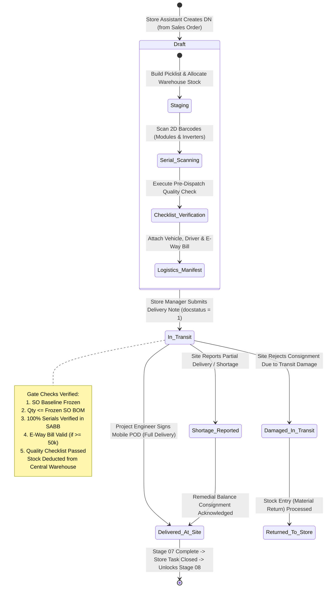
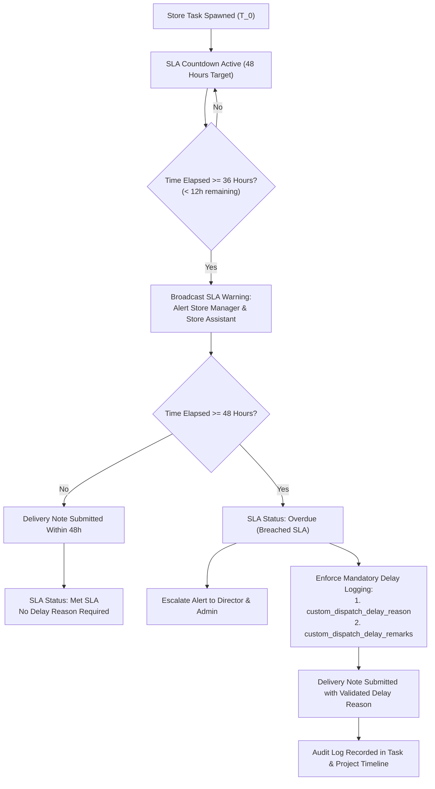
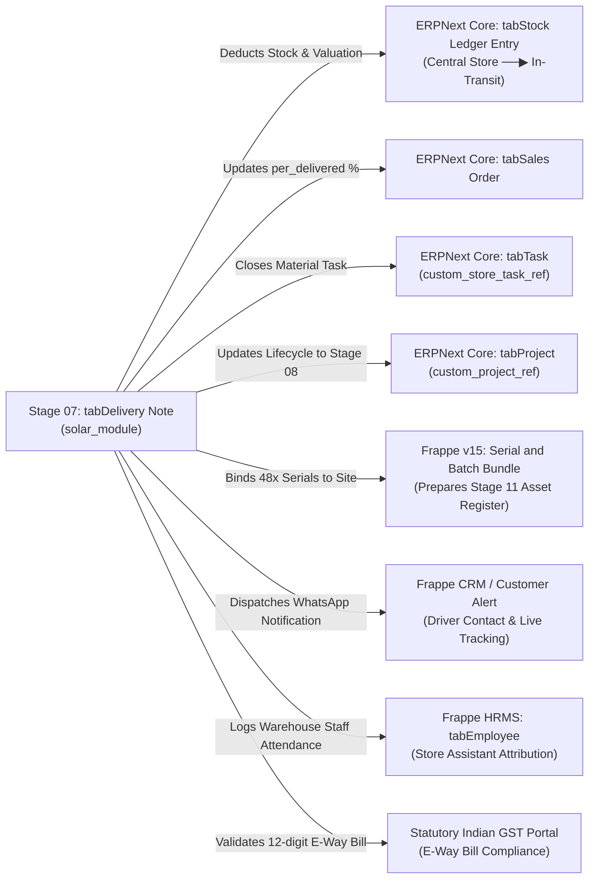

# STEP_07_MATERIAL_DISPATCH_DELIVERY_NOTE_SPECIFICATION.caveman.md

# Enterprise Lifecycle Step Specification: Material Dispatch Logistics via Delivery Note

**Document ID:** `STEP-07-MATERIAL-DISPATCH`  
**Lifecycle Flow:** Flow 1: Core Solar EPC Project Execution (Stage 07 of 11)  
**Governing Architecture:** [`architect_docs/02_STEP_PLANNING_SPECIFICATION_BLUEPRINT.md`](../architect_docs/02_STEP_PLANNING_SPECIFICATION_BLUEPRINT.md)  
**Architecture Decision Record:** [`docs/decisions/ADR-008-MATERIAL-DISPATCH-DELIVERY-NOTE-SERIALIZED-LOGISTICS.md`](../docs/decisions/ADR-008-MATERIAL-DISPATCH-DELIVERY-NOTE-SERIALIZED-LOGISTICS.md)  
**PRD / FRS Traceability:** [`planning_ref_docs/01_PROJECT_FOUNDATION_MODEL.md`](../planning_ref_docs/01_PROJECT_FOUNDATION_MODEL.md) (`BC-07`, `Sec 3.7`), [`planning_ref_docs/05_BUSINESS_REQUIREMENTS_DOCUMENT.md`](../planning_ref_docs/05_BUSINESS_REQUIREMENTS_DOCUMENT.md) (`BR-007`), [`planning_ref_docs/06_FUNCTIONAL_REQUIREMENTS_SPECIFICATION.md`](../planning_ref_docs/06_FUNCTIONAL_REQUIREMENTS_SPECIFICATION.md) (`FR-007`), [`planning_ref_docs/08_DATABASE_DESIGN_DOCUMENT.md`](../planning_ref_docs/08_DATABASE_DESIGN_DOCUMENT.md) (`Domain 6: LOG`, `Domain 7: PRJ`), [`planning_ref_docs/09_API_DESIGN_AND_INTEGRATIONS.md`](../planning_ref_docs/09_API_DESIGN_AND_INTEGRATIONS.md) (`API 6`), [`planning_ref_docs/10_UI_UX_SPECIFICATION.md`](../planning_ref_docs/10_UI_UX_SPECIFICATION.md) (`Screen 10`), [`planning_ref_docs/11_MODULE_FUNCTIONAL_DOCUMENTATION.md`](../planning_ref_docs/11_MODULE_FUNCTIONAL_DOCUMENTATION.md) (`MOD-07`), [`step_plans/STEP_16_PURCHASE_RECEIPT_GRN_SPECIFICATION.md`](./STEP_16_PURCHASE_RECEIPT_GRN_SPECIFICATION.md)  
**Target Module:** `solar_module` (Extend ERPNext `tabDelivery Note`, `tabDelivery Note Item`, `tabSerial and Batch Bundle`, `tabTask`, `tabProject`, `tabSolar Dispatch Settings`, `tabSolar Dispatch Checklist Item`)  
**Author:** Principal Enterprise Architect  
**Status:** Ready for Execution

---

## 1. Step Scope, Objectives & Context Traceability

### 1.1 Lifecycle Positioning & The Physical Execution Fulcrum

Stage 07 physical transition from warehouse inventory to site execution in `solar_module`. Bridge commercial baseline (Stage 06 Sales Order Baseline Freeze) with on-site engineering execution (Stage 08 Zone-Based Installation & Mobile DPR).

In **Dual Progress Bar Lifecycle Architecture** ([`docs/decisions/ADR-007-DUAL-PROGRESS-BAR-LIFECYCLE-SLA-ENGINE.md`](../docs/decisions/ADR-007-DUAL-PROGRESS-BAR-LIFECYCLE-SLA-ENGINE.md)), Stage 07 first execution stage on **Project Lifecycle Stepper**, triggered on submit of frozen `Sales Order`.

```
┌──────────────────────────────────────────────────────────────────────────────────────────────────┐
│                                STAGE 07 LIFECYCLE POSITIONING                                    │
└──────────────────────────────────────────────────────────────────────────────────────────────────┘

   [Stage 06: Sales Order Baseline Frozen] ──▶ Atomic Spawning (ACID Transaction)
        │
        ├───────────────────────────────────────────────────────┐
        ▼                                                       ▼
   [ERPNext Project Container Spawned]               [Material Delivery Task Spawned]
   • Sets custom_current_lifecycle_stage = "Stage 07" • Assigned to Store Manager
   • Multi-Zone WBS Tasks Generated                  • Target SLA: 48 Hours
        │                                                       │
        └──────────────────────────┬────────────────────────────┘
                                   │
                                   ▼
   ┌────────────────────────────────────────────────────────────────────────────────────────────┐
   │             STAGE 07: MATERIAL DISPATCH LOGISTICS VIA DELIVERY NOTE                        │
   ├────────────────────────────────────────────────────────────────────────────────────────────┤
   │ 1. Frozen BOM Validation: Assert item quantities against frozen Sales Order BOM           │
   │ 2. 100% Serial Scanning: Mandatory 2D barcode scan for PV Modules & Solar Inverters        │
   │ 3. Logistics Manifest Gate: Transporter GSTIN, Vehicle Plate, Driver Mobile & E-Way Bill   │
   │ 4. Pre-Dispatch Quality Checklist: Frame integrity, seal check, transit insurance active   │
   │ 5. Submission (docstatus = 1): Central stock deduction & in-transit debit                  │
   │ 6. Digital Proof of Delivery (POD): Site Engineer photographic & digital signature sign-off│
   └───────────────────────────────┬────────────────────────────────────────────────────────────┘
                                   │
                                   ├────────────────────────────────────────────────────────────┐
                                   ▼                                                            ▼
   ┌───────────────────────────────────────────────────────────┐  ┌─────────────────────────────┐
   │             STAGE 08: INSTALLATION EXECUTION              │  │  STAGE 09: MATERIAL RETURN  │
   │ Site Mobilization, Structure Erection, Panel Clamping,    │  │  Surplus site reconciliation│
   │ DC/AC Cabling, String Inverter Termination, Mobile DPRs   │  │  Dispatched vs Installed    │
   └───────────────────────────────────────────────────────────┘  └─────────────────────────────┘
                                                                                                │
                                                                                                ▼
                                                                  ┌─────────────────────────────┐
                                                                  │     STAGE 11: O&M ASSETS    │
                                                                  │  Dispatched Serials become  │
                                                                  │  Solar Asset Register Twin  │
                                                                  └─────────────────────────────┘
```

### 1.2 Strategic Business Objectives & Quantitative KPIs

Eliminate warehouse bottlenecks, prevent inventory leakage, ensure full statutory compliance with Indian GST transport laws, establish equipment provenance.

| Metric / KPI Code                 | Target Objective                            | Legacy Baseline   | Target Standard        | Operational Impact                                            |
| :-------------------------------- | :------------------------------------------ | :---------------- | :--------------------- | :------------------------------------------------------------ |
| **KPI-01: Serial Integrity**      | 100% 2D Barcode Scan Modules & Inverters    | $\approx 20\%$    | **100.0% Strict Gate** | Zero OEM warranty claim reject; Stage 11 Asset Register sync. |
| **KPI-02: Dispatch TAT**          | Warehouse Dispatch Turnaround Time          | 5 to 9 Days       | **$\le$ 48 Hours**     | Fast mobilization; site labor never idle waiting items.       |
| **KPI-03: E-Way Bill Compliance** | Valid E-Way Bill on consignments $\ge$ ₹50k | $\approx 85\%$    | **100.0% Hard Block**  | Zero highway seizures, vehicle impounds, GST penalties.       |
| **KPI-04: Over-Dispatch Control** | Over-dispatch vs frozen SO BOM              | 8% to 14% leakage | **0.0% Unauthorized**  | Stop inventory shrinkage; preserve gross margin.              |
| **KPI-05: POD Loop Closure**      | Digital POD with site signature             | $\approx 15\%$    | **100.0% Digital POD** | Instant dispute resolution; verify goods received sound.      |

### 1.3 Context Traceability Matrix

| Specification Domain              | Reference Identifier                                                                                                                | Specific Provision / Governing Clause                                                        |
| :-------------------------------- | :---------------------------------------------------------------------------------------------------------------------------------- | :------------------------------------------------------------------------------------------- |
| **Project Foundation Model**      | [`planning_ref_docs/01_PROJECT_FOUNDATION_MODEL.md`](../planning_ref_docs/01_PROJECT_FOUNDATION_MODEL.md)                           | Business Capability `BC-07`: Material Dispatch Logistics & Store Delivery.                   |
| **Business Requirements (BRD)**   | [`planning_ref_docs/05_BUSINESS_REQUIREMENTS_DOCUMENT.md`](../planning_ref_docs/05_BUSINESS_REQUIREMENTS_DOCUMENT.md)               | `BR-007`: Issue materials from store to site with transporter, e-way bill & serial scans.    |
| **Functional Requirements (FRS)** | [`planning_ref_docs/06_FUNCTIONAL_REQUIREMENTS_SPECIFICATION.md`](../planning_ref_docs/06_FUNCTIONAL_REQUIREMENTS_SPECIFICATION.md) | `FR-007`: ERPNext `Delivery Note`, BOM validation, 2D serial scanning, e-way manifest.       |
| **Database Architecture (3NF)**   | [`planning_ref_docs/08_DATABASE_DESIGN_DOCUMENT.md`](../planning_ref_docs/08_DATABASE_DESIGN_DOCUMENT.md)                           | Domain 6: `LOG` (`tabDelivery Note`, `tabDelivery Note Item`, `tabSerial and Batch Bundle`). |
| **API & Integrations**            | [`planning_ref_docs/09_API_DESIGN_AND_INTEGRATIONS.md`](../planning_ref_docs/09_API_DESIGN_AND_INTEGRATIONS.md)                     | API 6: Logistics & Dispatch (`solar_module.api.dispatch.*`).                                 |
| **UI/UX Specifications**          | [`planning_ref_docs/10_UI_UX_SPECIFICATION.md`](../planning_ref_docs/10_UI_UX_SPECIFICATION.md)                                     | Screen 10: Store Dispatch Desk, Barcode Scanner & Mobile POD Interface.                      |
| **Standard Operating Procedure**  | [`planning_ref_docs/11_MODULE_FUNCTIONAL_DOCUMENTATION.md`](../planning_ref_docs/11_MODULE_FUNCTIONAL_DOCUMENTATION.md)             | `MOD-07`: Authorized physical dispatch from store to site.                                   |

### 1.4 Failure Modes Addressed

```
┌──────────────────────────────────────────────────────────────────────────────────────────────────┐
│                               OPERATIONAL FAILURE MODES PREVENTED                                │
├──────────────────────────────────────────────────────────────────────────────────────────────────┤
│ 1. OEM Warranty Repudiation:                                                                     │
│    Legacy: Damaged modules rejected by manufacturer because serials never mapped to contract.    │
│    Resolution: Strict 100% 2D scan creates immutable Serial and Batch Bundle record.             │
│                                                                                                  │
│ 2. Highway Seizure & GST Penalties:                                                              │
│    Legacy: Vehicles impounded under CGST Act Sec 129 from expired/missing E-Way Bills.           │
│    Resolution: Block DN submit for consignments ≥ ₹50,000 unless valid 12-digit E-Way Bill,      │
│    validity datetime, and PDF attachment verified.                                              │
│                                                                                                  │
│ 3. Uncontrolled Material Leakage:                                                                │
│    Legacy: Storekeepers dishing extra cable drums or structures on informal calls.               │
│    Resolution: Real-time math ceiling blocks dispatch exceeding frozen Sales Order BOM.          │
│                                                                                                  │
│ 4. Site Team Idle Standing Costs:                                                                │
│    Legacy: Installation teams mobilize; discover structures/panels never left warehouse.         │
│    Resolution: Automated 48h Store Dispatch SLA engine with warning escalations at 36h.          │
│                                                                                                  │
│ 5. Transit Damage Disputes:                                                                      │
│    Legacy: Site supervisor claims inverters shattered; store claims they left intact.            │
│    Resolution: Two-tier photo gate: Pre-dispatch checklist at store + Mobile POD at site.        │
└──────────────────────────────────────────────────────────────────────────────────────────────────┘
```

---

## 2. Stakeholders, Enterprise Actors & HRMS Role Mapping

Zero "User" Suffix Rule strictly enforced.

### 2.1 Enterprise Persona & Role Definition

| Persona / Business Title | Frappe System Role   | HRMS Designation                          | Operational Scope & Authority                                                                                                          |
| :----------------------- | :------------------- | :---------------------------------------- | :------------------------------------------------------------------------------------------------------------------------------------- |
| **Store Manager**        | `Store Manager`      | `Store Manager` / `Warehouse In-Charge`   | Apex warehouse authority. Assign/delegate dispatch tasks, validate picklists, authorize release, review SLA timers, oversee transport. |
| **Store Assistant**      | `Store Assistant`    | `Store Assistant` / `Inventory Executive` | Warehouse operator. Execute physical picking, run 2D barcode scanner, pre-dispatch quality checks, pack items, enter manifest/E-Way.   |
| **Project Engineer**     | `Project Engineer`   | `Project Engineer` / `Field Engineer`     | Site technical lead. Destination recipient. Unloading inspection, verify serial counts, sign digital POD.                              |
| **Site Supervisor**      | `Site Supervisor`    | `Site Supervisor`                         | Field supervisor. Assist receive materials at site, verify carton integrity, upload receipt photos.                                    |
| **Commercial Officer**   | `Commercial Officer` | `Commercial Officer` / `Sales Ops Lead`   | Monitor order fulfillment percentage, correlate dispatch with billing milestones.                                                      |
| **Admin**                | `Admin`              | `Director` / `Head of Operations`         | Supreme Command. Authorize over-dispatch waivers, emergency overrides, SLA extensions, edit settings.                                  |
| **System Manager**       | `System Manager`     | `Lead Software Architect` / `DevOps`      | Framework Supreme. Configure DocTypes, background RQ queues, APIs.                                                                     |

### 2.2 Role Permission Matrix for Stage 07 Entities

| Frappe System Role       |             `tabDelivery Note`             | `tabSerial and Batch Bundle` | `tabSolar Dispatch Settings` | `tabTask` (Store Task) | Actionable Stage Gates                                            |
| :----------------------- | :----------------------------------------: | :--------------------------: | :--------------------------: | :--------------------: | :---------------------------------------------------------------- |
| **`Store Manager`**      |     Read, Write, Create, Submit, Amend     | Read, Write, Create, Submit  |          Read Only           | Read, Write, Reassign  | Authorize Dispatch, Submit DN, Oversee Logistics                  |
| **`Store Assistant`**    |        Read, Write, Create (Draft)         |     Read, Write, Create      |          Read Only           | Read, Write (Assigned) | Barcode Scanning, Quality Check, E-Way Bill & Transport Ingestion |
| **`Project Engineer`**   |       Read, Write (POD Fields Only)        |          Read Only           |          Read Only           | Read, Write (Assigned) | Sign Digital POD, Confirm Site Receipt                            |
| **`Site Supervisor`**    |       Read, Write (POD Fields Only)        |          Read Only           |          Read Only           |       Read Only        | Upload Site Receipt Photos                                        |
| **`Commercial Officer`** |                 Read Only                  |          Read Only           |          Read Only           |       Read Only        | Monitor Order Delivery %                                          |
| **`Admin`**              | Read, Write, Create, Submit, Cancel, Amend |         Full Control         | Full Control (Write/Config)  |      Full Control      | Override Gates, Authorize Over-Dispatch                           |
| **`System Manager`**     |         Full System Control (Apex)         |     Full System Control      |     Full System Control      |  Full System Control   | Developer Mode, Code & Background Jobs                            |

---

## 3. Relational Schema & 3NF Data Dictionary

### 3.1 Core DocType Extensions: `tabDelivery Note`

```
┌──────────────────────────────────────────────────────────────────────────────────────────────────┐
│                               tabDelivery Note (Core Extension)                                  │
├──────────────────────────────────────────────────────────────────────────────────────────────────┤
│ Standard ERPNext Fields:                                                                         │
│ name (DN.YYYY.#####), customer, posting_date, posting_time, company, total_qty, grand_total      │
├──────────────────────────────────────────────────────────────────────────────────────────────────┤
│ Custom Solar EPC Fields (custom_*):                                                              │
│ • custom_is_solar_dispatch           • custom_eway_bill_no         • custom_pod_status           │
│ • custom_sales_order_ref             • custom_eway_bill_date       • custom_pod_received_by      │
│ • custom_project_ref                 • custom_eway_bill_validity   • custom_pod_received_on      │
│ • custom_store_task_ref              • custom_eway_bill_doc        • custom_pod_signature_doc    │
│ • custom_lead_ref                    • custom_vehicle_no           • custom_pod_photos_doc       │
│ • custom_dispatch_stage              • custom_driver_name          • custom_pod_remarks          │
│ • custom_transporter_name            • custom_driver_phone         • custom_dispatch_sla_hours   │
│ • custom_transporter_gstin           • custom_lr_number            • custom_sla_status           │
│ • custom_pre_inspection_passed       • custom_lr_date              • custom_dispatch_delay_reason│
└──────────────────────────────────────────────────────────────────────────────────────────────────┘
```

#### Detailed Data Dictionary: `tabDelivery Note`

| Fieldname                       | Label                           | Fieldtype    | Options / Target                                                                                                                                                                           |  Mandatory  |  Index   | Description & Validation Invariant                                                                                        |
| :------------------------------ | :------------------------------ | :----------- | :----------------------------------------------------------------------------------------------------------------------------------------------------------------------------------------- | :---------: | :------: | :------------------------------------------------------------------------------------------------------------------------ |
| `custom_is_solar_dispatch`      | Is Solar EPC Dispatch           | `Check`      | -                                                                                                                                                                                          |     Yes     | Index: 1 | Flag solar dispatches; trigger serial validation & gates. Default: 1.                                                     |
| `custom_sales_order_ref`        | Solar Sales Order               | `Link`       | `Sales Order`                                                                                                                                                                              |     Yes     | Index: 1 | Contract ref. Must have `docstatus == 1` and `custom_baseline_frozen == 1`.                                               |
| `custom_project_ref`            | Solar Project                   | `Link`       | `Project`                                                                                                                                                                                  |     Yes     | Index: 1 | Destination project. Auto-fetched from Sales Order.                                                                       |
| `custom_store_task_ref`         | Store Dispatch Task             | `Link`       | `Task`                                                                                                                                                                                     |     No      | Index: 1 | Link to Store Delivery task. Auto-marked Completed on POD.                                                                |
| `custom_lead_ref`               | Originating Lead                | `Link`       | `Lead`                                                                                                                                                                                     |     Yes     | Index: 1 | Preserve lead identity thread.                                                                                            |
| `custom_dispatch_stage`         | Dispatch Consignment Stage      | `Select`     | `Phase 1 - Civil & Structure\nPhase 2 - Solar PV Modules\nPhase 3 - Inverters & BOS\nPhase 4 - Complete Single Dispatch\nAd-hoc / Balance Dispatch`                                        |     Yes     | Index: 1 | Categorize consignment phase for site readiness.                                                                          |
| `custom_transporter_name`       | Transporter Name                | `Data`       | -                                                                                                                                                                                          |     Yes     |    -     | Carrier company name.                                                                                                     |
| `custom_transporter_gstin`      | Transporter GSTIN               | `Data`       | -                                                                                                                                                                                          | Conditional |    -     | 15-char GSTIN regex: `^[0-9]{2}[A-Z]{5}[0-9]{4}[A-Z]{1}[1-9A-Z]{1}Z[0-9A-Z]{1}$`. Mandatory if Grand Total $\ge$ ₹50,000. |
| `custom_vehicle_no`             | Transport Vehicle Registration  | `Data`       | -                                                                                                                                                                                          |     Yes     |    -     | License plate. Uppercase regex: `^[A-Z]{2}[0-9]{1,2}[A-Z]{1,3}[0-9]{4}$`.                                                 |
| `custom_driver_name`            | Driver Full Name                | `Data`       | -                                                                                                                                                                                          |     Yes     |    -     | Commercial driver name.                                                                                                   |
| `custom_driver_phone`           | Driver Contact Mobile           | `Data`       | -                                                                                                                                                                                          |     Yes     |    -     | 10-digit mobile regex: `^[6-9][0-9]{9}$`. SMS dispatch target.                                                            |
| `custom_lr_number`              | Lorry Receipt (LR / Bilty) No   | `Data`       | -                                                                                                                                                                                          |     No      |    -     | Consignment note number.                                                                                                  |
| `custom_lr_date`                | LR / Bilty Date                 | `Date`       | -                                                                                                                                                                                          |     No      |    -     | Freight note issuance date.                                                                                               |
| `custom_eway_bill_no`           | E-Way Bill Number               | `Data`       | -                                                                                                                                                                                          | Conditional | Index: 1 | 12-digit GST E-Way Bill regex: `^[0-9]{12}$`. Mandatory if $\ge$ ₹50,000.                                                 |
| `custom_eway_bill_date`         | E-Way Bill Date                 | `Datetime`   | -                                                                                                                                                                                          | Conditional |    -     | Timestamp of E-Way Bill generation.                                                                                       |
| `custom_eway_bill_validity`     | E-Way Bill Expiry Datetime      | `Datetime`   | -                                                                                                                                                                                          | Conditional |    -     | Timestamp when validity expires. Must be $\ge$ posting_datetime.                                                          |
| `custom_eway_bill_doc`          | E-Way Bill Official PDF         | `Attach`     | -                                                                                                                                                                                          | Conditional |    -     | Official E-Way Bill PDF. Mandatory if $\ge$ ₹50,000.                                                                      |
| `custom_site_delivery_address`  | Site Delivery Address           | `Link`       | `Address`                                                                                                                                                                                  |     Yes     |    -     | Destination site address where items unloaded.                                                                            |
| `custom_site_contact_person`    | Site Receiving Engineer         | `Data`       | -                                                                                                                                                                                          |     Yes     |    -     | Site Supervisor or Project Engineer at destination.                                                                       |
| `custom_site_contact_phone`     | Site Contact Phone              | `Data`       | -                                                                                                                                                                                          |     Yes     |    -     | 10-digit phone of receiving engineer.                                                                                     |
| `custom_pre_inspection_passed`  | Pre-Dispatch Inspection Passed  | `Check`      | -                                                                                                                                                                                          |     Yes     |    -     | Flag: 1 when all mandatory checklist rows Passed.                                                                         |
| `custom_pod_status`             | Proof of Delivery Status        | `Select`     | `Pending In-Transit\nDelivered at Site\nPartially Received with Shortage\nDamaged in Transit\nReturned to Store`                                                                           |     Yes     | Index: 1 | Status of site handover. Default: `Pending In-Transit`.                                                                   |
| `custom_pod_received_by`        | POD Confirmed By                | `Data`       | -                                                                                                                                                                                          |     No      |    -     | Name of engineer signing POD.                                                                                             |
| `custom_pod_received_on`        | POD Received Datetime           | `Datetime`   | -                                                                                                                                                                                          |     No      |    -     | Timestamp when POD signed at site.                                                                                        |
| `custom_pod_signature_doc`      | Digital Signature Image         | `Attach`     | -                                                                                                                                                                                          |     No      |    -     | PNG/SVG signature from mobile portal.                                                                                     |
| `custom_pod_photos_doc`         | Unloading Photographic Evidence | `Attach`     | -                                                                                                                                                                                          |     No      |    -     | Photo of materials safely unloaded at site.                                                                               |
| `custom_pod_remarks`            | POD Delivery Remarks            | `Small Text` | -                                                                                                                                                                                          |     No      |    -     | Site inspection remarks, shortages, package condition.                                                                    |
| `custom_dispatch_sla_hours`     | Target Dispatch SLA Hours       | `Int`        | -                                                                                                                                                                                          |     Yes     |    -     | Target hours from Task creation to DN submit. Default: 48.                                                                |
| `custom_sla_status`             | SLA Clock Status                | `Select`     | `Within SLA\nWarning (< 12h)\nOverdue\nMet SLA\nBreached SLA`                                                                                                                              |     Yes     | Index: 1 | Real-time SLA tracker state.                                                                                              |
| `custom_dispatch_delay_reason`  | Delay Reason Category           | `Select`     | `Stock Shortage from Supplier\nTransport / Vehicle Delay\nE-Way Bill Portal Failure\nSite Civil Foundation Incomplete\nCustomer Payment / Hold Request\nAdverse Weather Conditions\nOther` |     No      |    -     | Mandatory if DN submitted with `custom_sla_status == 'Overdue'`.                                                          |
| `custom_dispatch_delay_remarks` | Delay Detailed Justification    | `Small Text` | -                                                                                                                                                                                          |     No      |    -     | Mandatory explanation if submitted past 48h SLA threshold.                                                                |

---

### 3.2 Core DocType Extensions: `tabDelivery Note Item`

```
┌──────────────────────────────────────────────────────────────────────────────────────────────────┐
│                            tabDelivery Note Item (Core Extension)                                │
├──────────────────────────────────────────────────────────────────────────────────────────────────┤
│ Standard Fields: item_code, item_name, qty, uom, rate, amount, warehouse, serial_and_batch_bundle │
├──────────────────────────────────────────────────────────────────────────────────────────────────┤
│ Custom Solar EPC Fields:                                                                         │
│ • custom_item_category                • custom_is_serialized         • custom_scanned_count      │
│ • custom_so_ordered_qty               • custom_previously_disp_qty   • custom_balance_so_qty     │
│ • custom_serial_validation_passed     • custom_bom_item_reference                                │
└──────────────────────────────────────────────────────────────────────────────────────────────────┘
```

#### Detailed Data Dictionary: `tabDelivery Note Item`

| Fieldname                         | Label                       | Fieldtype | Options / Target                                                                                                               | Mandatory |  Index   | Description & Validation Invariant                                           |
| :-------------------------------- | :-------------------------- | :-------- | :----------------------------------------------------------------------------------------------------------------------------- | :-------: | :------: | :--------------------------------------------------------------------------- |
| `custom_item_category`            | Solar Component Category    | `Select`  | `Solar Module\nSolar Inverter\nStructure MMS\nDC Cable\nAC Cable\nCombiner Box / AJB\nEarthing & Lightning\nBalance of System` |    Yes    | Index: 1 | Component class. Drives serialized vs batched vs bulk rules.                 |
| `custom_is_serialized`            | Serial Number Required      | `Check`   | -                                                                                                                              |    Yes    |    -     | Fetched from Item (`has_serial_no`). Mandatory for Modules & Inverters.      |
| `custom_so_ordered_qty`           | Sales Order Baseline Qty    | `Float`   | -                                                                                                                              |    Yes    |    -     | Contractually frozen item qty from Stage 06 Sales Order.                     |
| `custom_previously_disp_qty`      | Previously Dispatched Qty   | `Float`   | -                                                                                                                              |    Yes    |    -     | Cumulative qty dispatched across prior submitted DNs.                        |
| `custom_balance_so_qty`           | Remaining Un-dispatched Qty | `Float`   | -                                                                                                                              |    Yes    |    -     | `custom_so_ordered_qty - custom_previously_disp_qty - qty`. Must be $\ge 0$. |
| `custom_scanned_count`            | Barcodes Scanned Count      | `Int`     | -                                                                                                                              |    Yes    |    -     | Serials count in SABB. Must equal `qty` if serialized.                       |
| `custom_serial_validation_passed` | Serial Validation Passed    | `Check`   | -                                                                                                                              |    Yes    |    -     | Flag: 1 if all serials verified in source warehouse, no duplicates.          |
| `custom_bom_item_reference`       | Frozen BOM Line ID          | `Data`    | -                                                                                                                              |    No     |    -     | Foreign key back to Stage 03 `custom_quot_bom` line item.                    |

---

### 3.3 Frappe v15 Serial and Batch Bundle (SABB) Integration Architecture

In Frappe Framework v15+, serial tracking uses relational **Serial and Batch Bundles** (`tabSerial and Batch Bundle` and `tabSerial and Batch Entry`).

```
┌──────────────────────────────────────────────────────────────────────────────────────────────────┐
│                   FRAPPE v15 SERIAL & BATCH BUNDLE ARCHITECTURE IN STAGE 07                      │
├──────────────────────────────────────────────────────────────────────────────────────────────────┤
│                                                                                                  │
│  tabDelivery Note Item                                                                           │
│  ├── item_code = "SPV-MOD-540W-MONO"                                                             │
│  ├── qty = 48.0                                                                                  │
│  ├── warehouse = "Central Store Warehouse - SEPC"                                                │
│  └── serial_and_batch_bundle ───┐ (Link)                                                         │
│                                 │                                                                │
│                                 ▼                                                                │
│  tabSerial and Batch Bundle                                                                      │
│  ├── voucher_type = "Delivery Note"                                                              │
│  ├── voucher_no = "DN-2026-00142"                                                               │
│  ├── item_code = "SPV-MOD-540W-MONO"                                                             │
│  ├── type_of_transaction = "Outward"                                                            │
│  ├── total_qty = 48.0                                                                            │
│  └── entries (Child Table: tabSerial and Batch Entry)                                            │
│       ├── Row 1:  serial_no = "M540W26090001" (Warehouse: Central Store, Status: Active)         │
│       ├── Row 2:  serial_no = "M540W26090002" (Warehouse: Central Store, Status: Active)         │
│       ├── ...                                                                                    │
│       └── Row 48: serial_no = "M540W26090048" (Warehouse: Central Store, Status: Active)         │
│                                                                                                  │
└──────────────────────────────────────────────────────────────────────────────────────────────────┘
```

#### SABB Validation Invariants enforced by `SolarSerialScanningService`:

1. **Source Warehouse Integrity:** Every `serial_no` in bundle must have `warehouse == item.warehouse` and `status == 'Active'` in `tabSerial No`.
2. **Cardinality Match:** $\text{len}(entries) == \text{round}(item.qty)$. Partial allocations hard-blocked.
3. **No Duplicate Serials:** No serial number twice in same DN or in pending unsubmitted DN.
4. **Item Code Conformance:** Every serial number's parent item code in `tabSerial No` must match `item.item_code`.

---

### 3.4 Custom Child DocType: `tabSolar Dispatch Checklist Item`

Pre-dispatch quality checklist attached to `tabDelivery Note`.

- **DocType Name:** `Solar Dispatch Checklist Item`
- **Is Child Table:** Yes (`istable = 1`)
- **Parent DocType:** `Delivery Note` (field: `custom_pre_dispatch_checklist`)

| Fieldname                | Label                  | Fieldtype    | Options                                                                   | Mandatory | Description                                               |
| :----------------------- | :--------------------- | :----------- | :------------------------------------------------------------------------ | :-------: | :-------------------------------------------------------- |
| `checkpoint_code`        | Checkpoint Code        | `Data`       | -                                                                         |    Yes    | Checkpoint ID (`CHK-MOD-01`, `CHK-INV-01`, `CHK-CBL-01`). |
| `checkpoint_description` | Inspection Requirement | `Small Text` | -                                                                         |    Yes    | Physical inspection standard details.                     |
| `item_category`          | Applicable Component   | `Select`     | `Solar Module\nSolar Inverter\nStructure MMS\nCabling\nGeneral & Transit` |    Yes    | Component class inspected.                                |
| `status`                 | Inspection Result      | `Select`     | `Pending\nPassed\nFailed\nNot Applicable`                                 |    Yes    | Default: `Pending`. Non-N/A rows must be `Passed`.        |
| `photo_evidence`         | Photographic Evidence  | `Attach`     | -                                                                         |    No     | Photo of seal, carton, structural finish.                 |
| `verified_by`            | Inspector User         | `Link`       | `User`                                                                    |    No     | User ID marking row passed.                               |
| `verified_on`            | Inspection Timestamp   | `Datetime`   | -                                                                         |    No     | Timestamp of checklist verification.                      |
| `remarks`                | Inspector Notes        | `Data`       | -                                                                         |    No     | Notes on packaging condition or defect observed.          |

#### Mandatory Standard Checkpoints:

1. `CHK-MOD-01`: **Module Physical Integrity:** Inspect PV module cartons. Zero cracked glass, bent frames, damaged junction boxes.
2. `CHK-INV-01`: **Inverter Factory Seal & Kit:** Verify OEM seals intact, mounting bracket, datalogger, DC connector kit enclosed.
3. `CHK-MMS-01`: **Structure Hot-Dip Galvanization:** Inspect MMS channels/purlins for zinc coating; verify bolt counts match BOM.
4. `CHK-CBL-01`: **Solar Cable Drum Seals:** Verify DC (4/6 sq.mm) and AC cable drum seal, cross-section, ISI/IEC marking.
5. `CHK-TRN-01`: **Transit Insurance & Weatherproofing:** Cargo truck covered with waterproof tarpaulin; active transit insurance policy.

---

### 3.5 Standalone Single DocType: `tabSolar Dispatch Settings`

Global parameters governed by `Admin` and `System Manager`.

| Fieldname                          | Label                          | Fieldtype            |          Default          | Description                                                                 |
| :--------------------------------- | :----------------------------- | :------------------- | :-----------------------: | :-------------------------------------------------------------------------- |
| `default_dispatch_sla_hours`       | Target Dispatch SLA Hours      | `Int`                |           `48`            | Target hours from Stage 06 SO submit to Stage 07 DN submit.                 |
| `sla_warning_threshold_hours`      | SLA Warning Alert Threshold    | `Int`                |           `12`            | Hours before deadline to broadcast warning notifications.                   |
| `eway_bill_mandatory_threshold`    | E-Way Bill Mandatory Value     | `Currency`           |         `50000.0`         | Minimum consignment value requiring mandatory E-Way Bill.                   |
| `enforce_strict_serial_scan`       | Enforce Strict Serial Scan     | `Check`              |            `1`            | If 1, modules/inverters cannot submit without SABB.                         |
| `allow_partial_dispatch`           | Support Phased Dispatches      | `Check`              |            `1`            | Enable multi-stage consignments (Civil, Panels, Inverters).                 |
| `max_over_dispatch_threshold_pct`  | Max Over-Dispatch Allowed %    | `Percent`            |           `0.0`           | Hard tolerance limit. Default 0.0% (strict block). Requires Admin override. |
| `mandate_pre_dispatch_checklist`   | Mandate Inspection Checklist   | `Check`              |            `1`            | If 1, all checklist items must be Passed before submit.                     |
| `in_transit_virtual_warehouse`     | Virtual Goods-in-Transit Store | `Link` (`Warehouse`) | `Goods In Transit - SEPC` | Warehouse ledger for stock moving from store to site.                       |
| `notify_customer_on_dispatch`      | WhatsApp/SMS Alert to Customer | `Check`              |            `1`            | Send tracking alert to customer mobile upon DN submit.                      |
| `notify_site_engineer_on_dispatch` | Alert Receiving Site Team      | `Check`              |            `1`            | Alert Project Engineer & Site Supervisor with vehicle & driver contact.     |

---

## 4. State Machine, Verification Gates & SLA Engine

### 4.1 Delivery Note Operational State Machine



### 4.2 Hard Verification Stage Gates

```
┌──────────────────────────────────────────────────────────────────────────────────────────────────┐
│                             THE 6 HARD VERIFICATION STAGE GATES                                 │
├──────────────────────────────────────────────────────────────────────────────────────────────────┤
│ GATE 1: Sales Order Baseline Integrity Gate                                                      │
│ Condition: tabSales Order.docstatus == 1 AND custom_baseline_frozen == 1                          │
│ Failure: Block creation/submission with ValidationError: "Originating Sales Order baseline is   │
│          not frozen. Material dispatch cannot precede Stage 06 commercial freeze."               │
├──────────────────────────────────────────────────────────────────────────────────────────────────┤
│ GATE 2: Mathematical BOM Ceiling & Over-Dispatch Boundary Gate                                   │
│ Condition: (Cumulative Dispatched Qty + Current Item Qty) <= Frozen Sales Order Qty             │
│ Math: Q_disp_prior + Q_current <= Q_so_frozen                                                    │
│ Failure: If exceeded and custom_over_dispatch_approved == 0, raise ValidationError:              │
│          "Dispatched quantity exceeds frozen Sales Order BOM limit. Over-dispatch blocked."      │
├──────────────────────────────────────────────────────────────────────────────────────────────────┤
│ GATE 3: 100% Serialized Barcode Ingestion Gate (Frappe v15 SABB)                                │
│ Condition: For all items where custom_is_serialized == 1 (Modules & Inverters):                  │
│            1. serial_and_batch_bundle is populated and linked.                                   │
│            2. Count of serial entries in SABB == round(item.qty).                                │
│            3. Every serial number exists in tabSerial No with warehouse == item.warehouse.       │
│ Failure: Block submission: "Item {item_code} requires {qty} scanned serials. Scanned: {count}." │
├──────────────────────────────────────────────────────────────────────────────────────────────────┤
│ GATE 4: Statutory E-Way Bill & Transport Manifest Gate                                           │
│ Condition: If Delivery Note Net Total >= ₹50,000 (tabSolar Dispatch Settings threshold):         │
│            custom_eway_bill_no != NULL (12 digits) AND custom_eway_bill_validity >= now() AND    │
│            custom_vehicle_no != NULL AND custom_driver_phone != NULL AND custom_eway_bill_doc.   │
│ Failure: Block submission: "GST Compliance Gate: Consignments >= ₹50k mandate valid E-Way Bill,  │
│          vehicle plate, driver phone, and official PDF attachment."                              │
├──────────────────────────────────────────────────────────────────────────────────────────────────┤
│ GATE 5: Pre-Dispatch Quality Inspection Sign-Off Gate                                            │
│ Condition: All non-N/A rows in custom_pre_dispatch_checklist have status == 'Passed'.            │
│ Failure: Block submission: "Quality Gate: {count} checklist items are pending or failed."        │
├──────────────────────────────────────────────────────────────────────────────────────────────────┤
│ GATE 6: Closed-Loop Digital Proof of Delivery (POD) Gate                                         │
│ Condition: custom_pod_status == 'Delivered at Site' AND custom_pod_signature_doc != NULL.        │
│ Action: Closes Store Delivery Task -> Sets Project delivery milestone -> Unlocks Stage 08 DPR.  │
└──────────────────────────────────────────────────────────────────────────────────────────────────┘
```

### 4.3 Phased Consignment Mathematics & Mathematical Formulas

$$\text{Cumulative Dispatched Qty: } Q_{\text{disp\_cum}}^{(i)} = \sum_{k \in \mathcal{DN}_{\text{submitted}}} Q_{k}^{(i)}$$

$$\text{Remaining Un-dispatched Balance: } Q_{\text{pending}}^{(i)} = Q_{SO}^{(i)} - Q_{\text{disp\_cum}}^{(i)} - Q_{\text{current}}^{(i)}$$

$$\text{Overall Sales Order Dispatch Completion \%: } \mathcal{P}_{\text{dispatch}} = \frac{\sum_{i=1}^{M} \left( Q_{\text{disp\_cum}}^{(i)} \times \text{Rate}^{(i)} \right)}{\sum_{i=1}^{M} \left( Q_{SO}^{(i)} \times \text{Rate}^{(i)} \right)} \times 100$$

$$\text{Over-Dispatch Boundary Rule: } Q_{\text{disp\_cum}}^{(i)} + Q_{\text{current}}^{(i)} \le Q_{SO}^{(i)} \times \left(1 + \frac{\mathcal{T}_{\text{tol}}}{100}\right)$$

Where $\mathcal{T}_{\text{tol}}$ is Admin-governed tolerance percentage (`max_over_dispatch_threshold_pct`, default $0.0\%$).

---

### 4.4 SLA & Turnaround Time (TAT) Engine



---

## 5. Controller Logic, Domain Services & Whitelisted APIs

### 5.1 Decoupled Architecture Overview (SOLID)

```
┌──────────────────────────────────────────────────────────────────────────────────────────────────┐
│                               STAGE 07 DOMAIN SERVICE ARCHITECTURE                               │
├──────────────────────────────────────────────────────────────────────────────────────────────────┤
│                                                                                                  │
│   tabDelivery Note Controller (Thin Orchestrator)                                                │
│   ├── validate()          ──▶ SolarDispatchValidationService.validate_dispatch(doc)              │
│   ├── before_submit()     ──▶ SolarDispatchValidationService.validate_gates_and_serials(doc)     │
│   ├── on_submit()         ──▶ SolarDispatchStockService.post_submission_handover(doc)            │
│   └── on_cancel()         ──▶ SolarDispatchStockService.handle_cancellation(doc)                 │
│                                                                                                  │
│   Dedicated Domain Services:                                                                     │
│   • SolarDispatchValidationService : SO baseline, over-dispatch math, e-way statutory checks    │
│   • SolarSerialScanningService    : High-speed barcode parsing, stock verification, SABB build  │
│   • SolarDispatchSLAService       : 48h countdown math, breach evaluation, escalation alerts     │
│   • SolarPODService               : Mobile POD digital signature, photo receipt, task closure    │
│                                                                                                  │
└──────────────────────────────────────────────────────────────────────────────────────────────────┘
```

### 5.2 Implementation: `SolarDispatchValidationService`

```python
# File: solar_module/services/dispatch_validation_service.py

import re
import frappe
from frappe import _
from frappe.utils import flt, now_datetime, get_datetime

class SolarDispatchValidationService:
    @staticmethod
    def validate_dispatch(doc):
        """Pre-save defensive validation on Delivery Note."""
        if not doc.custom_is_solar_dispatch:
            return

        SolarDispatchValidationService.validate_originating_sales_order(doc)
        SolarDispatchValidationService.validate_over_dispatch_limits(doc)
        SolarDispatchValidationService.validate_logistics_manifest(doc)
        SolarDispatchValidationService.validate_sla_and_delay_reasons(doc)

    @staticmethod
    def validate_originating_sales_order(doc):
        """Gate 1: Assert Sales Order exists, is submitted and baseline is frozen."""
        if not doc.custom_sales_order_ref:
            frappe.throw(_("Solar Delivery Note must reference a valid Sales Order."), frappe.ValidationError)

        so_data = frappe.db.get_value(
            "Sales Order",
            doc.custom_sales_order_ref,
            ["docstatus", "custom_baseline_frozen", "project", "customer"],
            as_dict=True
        )

        if not so_data:
            frappe.throw(_("Referenced Sales Order {0} does not exist.").format(doc.custom_sales_order_ref), frappe.DoesNotExistError)

        if so_data.docstatus != 1:
            frappe.throw(_("Sales Order {0} must be submitted before material dispatch can be initiated.").format(doc.custom_sales_order_ref), frappe.ValidationError)

        if not so_data.custom_baseline_frozen:
            frappe.throw(_("Sales Order {0} commercial baseline is not frozen. Stage 06 completion required.").format(doc.custom_sales_order_ref), frappe.ValidationError)

        # Synchronize foreign keys
        if not doc.custom_project_ref and so_data.project:
            doc.custom_project_ref = so_data.project
        if not doc.customer:
            doc.customer = so_data.customer

    @staticmethod
    def validate_over_dispatch_limits(doc):
        """Gate 2: Assert dispatched quantities do not exceed frozen Sales Order BOM."""
        settings = frappe.get_cached_doc("Solar Dispatch Settings")
        tolerance_pct = flt(settings.max_over_dispatch_threshold_pct or 0.0)

        for item in doc.items:
            # Query cumulative submitted dispatched qty for this item on this SO
            prior_disp_qty = flt(frappe.db.sql("""
                SELECT SUM(dni.qty)
                FROM `tabDelivery Note Item` dni
                JOIN `tabDelivery Note` dn ON dn.name = dni.parent
                WHERE dn.custom_sales_order_ref = %s
                  AND dn.docstatus = 1
                  AND dn.name != %s
                  AND dni.item_code = %s
            """, (doc.custom_sales_order_ref, doc.name or "NEW", item.item_code))[0][0] or 0.0)

            # Query frozen SO ordered qty
            so_ordered_qty = flt(frappe.db.get_value(
                "Sales Order Item",
                {"parent": doc.custom_sales_order_ref, "item_code": item.item_code},
                "qty"
            ) or 0.0)

            item.custom_previously_disp_qty = prior_disp_qty
            item.custom_so_ordered_qty = so_ordered_qty
            item.custom_balance_so_qty = max(0.0, so_ordered_qty - prior_disp_qty - flt(item.qty))

            max_allowed = so_ordered_qty * (1.0 + (tolerance_pct / 100.0))
            if (prior_disp_qty + flt(item.qty)) > max_allowed:
                frappe.throw(
                    _("Item {0}: Cumulative dispatch ({1}) exceeds frozen Sales Order BOM limit ({2}). Over-dispatch blocked without Admin approval.")
                    .format(item.item_code, prior_disp_qty + flt(item.qty), so_ordered_qty),
                    frappe.ValidationError
                )

    @staticmethod
    def validate_logistics_manifest(doc):
        """Gate 4: E-Way Bill and transport validation."""
        settings = frappe.get_cached_doc("Solar Dispatch Settings")
        threshold = flt(settings.eway_bill_mandatory_threshold or 50000.0)

        # Vehicle number format regex (e.g. MH12AB1234 or GJ01XX9999)
        if doc.custom_vehicle_no:
            clean_plate = doc.custom_vehicle_no.replace(" ", "").upper()
            if not re.match(r"^[A-Z]{2}[0-9]{1,2}[A-Z]{1,3}[0-9]{4}$", clean_plate):
                frappe.throw(_("Vehicle number '{0}' is invalid. Standard Indian registration plate format required (e.g. MH12AB1234).").format(doc.custom_vehicle_no), frappe.ValidationError)
            doc.custom_vehicle_no = clean_plate

        # Driver phone regex (10 digits)
        if doc.custom_driver_phone:
            clean_phone = doc.custom_driver_phone.replace(" ", "").replace("-", "")
            if not re.match(r"^[6-9][0-9]{9}$", clean_phone):
                frappe.throw(_("Driver phone '{0}' is invalid. 10-digit mobile number required.").format(doc.custom_driver_phone), frappe.ValidationError)
            doc.custom_driver_phone = clean_phone

        # Statutory E-Way Bill Check
        if flt(doc.grand_total or doc.net_total) >= threshold:
            if not doc.custom_eway_bill_no:
                frappe.throw(_("Statutory Gate: Consignment value ({0}) exceeds ₹{1}. E-Way Bill Number is mandatory.").format(doc.grand_total, threshold), frappe.ValidationError)

            if not re.match(r"^[0-9]{12}$", str(doc.custom_eway_bill_no).strip()):
                frappe.throw(_("E-Way Bill Number must be exactly 12 digits."), frappe.ValidationError)

            if not doc.custom_eway_bill_validity:
                frappe.throw(_("E-Way Bill Expiry Datetime is mandatory for consignments $\ge$ ₹50,000."), frappe.ValidationError)

            if get_datetime(doc.custom_eway_bill_validity) < now_datetime():
                frappe.throw(_("E-Way Bill validity expired on {0}. Consignment cannot be dispatched with an expired E-Way Bill.").format(doc.custom_eway_bill_validity), frappe.ValidationError)

            if not doc.custom_eway_bill_doc:
                frappe.throw(_("Official E-Way Bill PDF attachment is mandatory for consignments $\ge$ ₹50,000."), frappe.ValidationError)

            if doc.custom_transporter_gstin:
                gstin = doc.custom_transporter_gstin.strip().upper()
                if not re.match(r"^[0-9]{2}[A-Z]{5}[0-9]{4}[A-Z]{1}[1-9A-Z]{1}Z[0-9A-Z]{1}$", gstin):
                    frappe.throw(_("Transporter GSTIN '{0}' is invalid format.").format(gstin), frappe.ValidationError)
                doc.custom_transporter_gstin = gstin

    @staticmethod
    def validate_sla_and_delay_reasons(doc):
        """Enforces mandatory delay reason when submitting past SLA deadline."""
        if doc.custom_sla_status == "Overdue":
            if not doc.custom_dispatch_delay_reason:
                frappe.throw(_("SLA Expired: Target dispatch duration (48h) exceeded. Mandatory 'Delay Reason Category' required before saving."), frappe.ValidationError)
            if not doc.custom_dispatch_delay_remarks or len(doc.custom_dispatch_delay_remarks.strip()) < 10:
                frappe.throw(_("SLA Expired: Detailed 'Delay Remarks' (minimum 10 characters) required."), frappe.ValidationError)
```

---

### 5.3 Implementation: `SolarSerialScanningService` (Frappe v15 SABB)

```python
# File: solar_module/services/serial_scanning_service.py

import frappe
from frappe import _
from frappe.utils import flt

class SolarSerialScanningService:
    @staticmethod
    def validate_serials_before_submit(doc):
        """Gate 3: Enforce 100% barcode serial matching for serialized items."""
        if not doc.custom_is_solar_dispatch:
            return

        settings = frappe.get_cached_doc("Solar Dispatch Settings")
        if not settings.enforce_strict_serial_scan:
            return

        for item in doc.items:
            is_serialized = frappe.db.get_value("Item", item.item_code, "has_serial_no")
            item.custom_is_serialized = 1 if is_serialized else 0

            if not is_serialized:
                continue

            target_qty = int(flt(item.qty))
            bundle_id = item.serial_and_batch_bundle

            if not bundle_id:
                frappe.throw(
                    _("Item {0} (Row {1}) is serialized ({2} required) but has no Serial and Batch Bundle linked.")
                    .format(item.item_code, item.idx, target_qty),
                    frappe.ValidationError
                )

            # Query entries in Frappe v15 Serial and Batch Bundle
            bundle_entries = frappe.get_all(
                "Serial and Batch Entry",
                filters={"parent": bundle_id},
                fields=["serial_no", "qty"]
            )

            scanned_count = len(bundle_entries)
            item.custom_scanned_count = scanned_count

            if scanned_count != target_qty:
                frappe.throw(
                    _("Item {0}: Exact barcode match required. Expected {1} serials, but {2} serials are scanned.")
                    .format(item.item_code, target_qty, scanned_count),
                    frappe.ValidationError
                )

            # Assert all serial numbers belong to source warehouse and are Active
            serial_list = [entry.serial_no for entry in bundle_entries]
            invalid_serials = frappe.db.sql("""
                SELECT name, warehouse, status
                FROM `tabSerial No`
                WHERE name IN %(serials)s
                  AND (warehouse != %(wh)s OR status != 'Active')
            """, {"serials": tuple(serial_list), "wh": item.warehouse}, as_dict=True)

            if invalid_serials:
                err_details = ", ".join([f"{s.name} (Status: {s.status}, WH: {s.warehouse})" for s in invalid_serials[:5]])
                frappe.throw(
                    _("Stock Invariant Breach: {0} serial(s) do not reside in warehouse '{1}' or are inactive: {2}")
                    .format(len(invalid_serials), item.warehouse, err_details),
                    frappe.ValidationError
                )

            item.custom_serial_validation_passed = 1

    @staticmethod
    def ingest_scanned_barcode(delivery_note_id: str, item_code: str, raw_barcode: str) -> dict:
        """Processes high-speed scanner input, validates single barcode, and appends to SABB."""
        dn = frappe.get_doc("Delivery Note", delivery_note_id)
        dn.check_permission("write")

        if dn.docstatus != 0:
            frappe.throw(_("Serials can only be scanned against Draft Delivery Notes."), frappe.ValidationError)

        serial_no = raw_barcode.strip().upper()

        # Find matching item row
        matched_item = None
        for row in dn.items:
            if row.item_code == item_code:
                matched_item = row
                break

        if not matched_item:
            frappe.throw(_("Item {0} is not present in Delivery Note {1}.").format(item_code, delivery_note_id), frappe.DoesNotExistError)

        # Validate Serial No master record
        serial_doc = frappe.db.get_value(
            "Serial No",
            serial_no,
            ["name", "item_code", "warehouse", "status"],
            as_dict=True
        )

        if not serial_doc:
            frappe.throw(_("Serial No '{0}' does not exist in master registry.").format(serial_no), frappe.DoesNotExistError)

        if serial_doc.item_code != item_code:
            frappe.throw(_("Serial '{0}' belongs to Item '{1}', not '{2}'.").format(serial_no, serial_doc.item_code, item_code), frappe.ValidationError)

        if serial_doc.warehouse != matched_item.warehouse:
            frappe.throw(_("Serial '{0}' is located in warehouse '{1}', but source warehouse is '{2}'.").format(serial_no, serial_doc.warehouse, matched_item.warehouse), frappe.ValidationError)

        if serial_doc.status != "Active":
            frappe.throw(_("Serial '{0}' has status '{1}'. Only 'Active' serials can be dispatched.").format(serial_no, serial_doc.status), frappe.ValidationError)

        # Manage Serial and Batch Bundle
        bundle_id = matched_item.serial_and_batch_bundle
        if not bundle_id:
            bundle = frappe.get_doc({
                "doctype": "Serial and Batch Bundle",
                "item_code": item_code,
                "warehouse": matched_item.warehouse,
                "voucher_type": "Delivery Note",
                "type_of_transaction": "Outward",
                "entries": []
            })
            bundle.insert(ignore_permissions=True)
            bundle_id = bundle.name
            matched_item.serial_and_batch_bundle = bundle_id
            dn.flags.ignore_validate = True
            dn.save()

        bundle = frappe.get_doc("Serial and Batch Bundle", bundle_id)

        # Check duplicate
        existing_serials = {e.serial_no for e in bundle.entries}
        if serial_no in existing_serials:
            frappe.throw(_("Serial '{0}' is already scanned in this consignment.").format(serial_no), frappe.DuplicateEntryError)

        if len(bundle.entries) >= int(flt(matched_item.qty)):
            frappe.throw(_("Row target quantity ({0}) already reached for item {1}.").format(matched_item.qty, item_code), frappe.ValidationError)

        bundle.append("entries", {
            "serial_no": serial_no,
            "qty": -1.0
        })
        bundle.save(ignore_permissions=True)

        matched_item.custom_scanned_count = len(bundle.entries)
        dn.flags.ignore_validate = True
        dn.save()

        return {
            "status": "success",
            "item_code": item_code,
            "serial_no": serial_no,
            "current_scanned": len(bundle.entries),
            "target_qty": int(flt(matched_item.qty))
        }
```

---

### 5.4 Implementation: `SolarPODService` (Digital Proof of Delivery)

```python
# File: solar_module/services/pod_service.py

import frappe
from frappe import _
from frappe.utils import now_datetime, flt

class SolarPODService:
    @staticmethod
    def execute_site_pod(
        delivery_note_id: str,
        received_by_name: str,
        signature_data_uri: str,
        photo_file_url: str,
        pod_status: str,
        remarks: str = ""
    ) -> dict:
        """Processes on-site digital Proof of Delivery handover and closes Store Task."""
        dn = frappe.get_doc("Delivery Note", delivery_note_id)
        dn.check_permission("write")

        if dn.docstatus != 1:
            frappe.throw(_("Proof of Delivery can only be recorded against submitted in-transit Delivery Notes."), frappe.ValidationError)

        if dn.custom_pod_status == "Delivered at Site":
            frappe.throw(_("Delivery Note {0} has already been acknowledged and closed.").format(delivery_note_id), frappe.ValidationError)

        # Validate inputs
        if not received_by_name:
            frappe.throw(_("Name of site receiving personnel is mandatory."), frappe.ValidationError)

        if not signature_data_uri:
            frappe.throw(_("Digital signature is mandatory for Proof of Delivery sign-off."), frappe.ValidationError)

        # Update Delivery Note POD attributes
        dn.custom_pod_status = pod_status
        dn.custom_pod_received_by = received_by_name
        dn.custom_pod_received_on = now_datetime()
        dn.custom_pod_signature_doc = signature_data_uri
        dn.custom_pod_photos_doc = photo_file_url
        dn.custom_pod_remarks = remarks
        dn.flags.ignore_validate = True
        dn.save(ignore_permissions=True)

        # Post-POD Cascade: Close Store Task and Advance Project Stage
        if pod_status == "Delivered at Site":
            SolarPODService._cascade_pod_completion(dn)

        return {
            "status": "success",
            "delivery_note": delivery_note_id,
            "pod_status": pod_status,
            "received_on": str(dn.custom_pod_received_on)
        }

    @staticmethod
    def _cascade_pod_completion(dn):
        """Updates Store Task, Sales Order fulfillment %, and Project execution readiness."""
        # 1. Close Store Delivery Task if linked
        if dn.custom_store_task_ref and frappe.db.exists("Task", dn.custom_store_task_ref):
            frappe.db.set_value("Task", dn.custom_store_task_ref, {
                "status": "Completed",
                "completed_on": now_datetime(),
                "custom_actual_completion_timestamp": now_datetime()
            })

        # 2. Advance Project Lifecycle Stepper to Stage 08 if all dispatches completed
        if dn.custom_project_ref:
            so_name = dn.custom_sales_order_ref
            so_doc = frappe.get_doc("Sales Order", so_name)

            total_ordered = sum([flt(i.qty) for i in so_doc.items])
            total_delivered = sum([flt(i.delivered_qty) for i in so_doc.items])

            if total_delivered >= total_ordered:
                frappe.db.set_value("Project", dn.custom_project_ref, {
                    "custom_current_lifecycle_stage": "Stage 08",
                    "custom_dispatch_completed_on": now_datetime()
                })
```

---

### 5.5 Whitelisted API Specification (`solar_module.api.dispatch.*`)

```python
# File: solar_module/api/dispatch.py

import json
import frappe
from frappe import _
from solar_module.services.dispatch_validation_service import SolarDispatchValidationService
from solar_module.services.serial_scanning_service import SolarSerialScanningService
from solar_module.services.pod_service import SolarPODService

@frappe.whitelist(methods=["POST"])
def scan_serial_barcode(delivery_note: str, item_code: str, barcode: str) -> dict:
    """High-speed single barcode ingestion endpoint called from /solar barcode station."""
    if not delivery_note or not item_code or not barcode:
        frappe.throw(_("Missing mandatory barcode scanning parameters."), frappe.ValidationError)
    return SolarSerialScanningService.ingest_scanned_barcode(delivery_note, item_code, barcode)

@frappe.whitelist(methods=["POST"])
def bulk_ingest_serials(delivery_note: str, item_code: str, serial_list_json: str) -> dict:
    """Bulk ingestion for pallet-level barcode scans or CSV imports."""
    serials = json.loads(serial_list_json)
    results = []
    for s in serials:
        res = SolarSerialScanningService.ingest_scanned_barcode(delivery_note, item_code, s)
        results.append(res)
    return {"status": "success", "count": len(results), "item_code": item_code}

@frappe.whitelist(methods=["POST"])
def submit_proof_of_delivery(
    delivery_note: str,
    received_by: str,
    signature_doc: str,
    photo_doc: str,
    pod_status: str = "Delivered at Site",
    remarks: str = ""
) -> dict:
    """Digital Proof of Delivery sign-off endpoint called by Site Engineer on mobile portal."""
    return SolarPODService.execute_site_pod(
        delivery_note_id=delivery_note,
        received_by_name=received_by,
        signature_data_uri=signature_doc,
        photo_file_url=photo_doc,
        pod_status=pod_status,
        remarks=remarks
    )

@frappe.whitelist(methods=["GET"])
def get_dispatch_summary(sales_order: str) -> dict:
    """Returns real-time dispatch progress, remaining items to dispatch, and active Delivery Notes."""
    if not sales_order:
        frappe.throw(_("Sales Order is required."), frappe.ValidationError)

    so = frappe.get_doc("Sales Order", sales_order)
    so.check_permission("read")

    items_summary = []
    for item in so.items:
        items_summary.append({
            "item_code": item.item_code,
            "item_name": item.item_name,
            "ordered_qty": flt(item.qty),
            "delivered_qty": flt(item.delivered_qty),
            "balance_qty": max(0.0, flt(item.qty) - flt(item.delivered_qty)),
            "is_serialized": 1 if frappe.db.get_value("Item", item.item_code, "has_serial_no") else 0
        })

    return {
        "sales_order": sales_order,
        "per_delivered": flt(so.per_delivered),
        "items": items_summary
    }
```

---

## 6. Frontend UI/UX Specification

All workflows run on `/solar` (Vue 3 + Frappe UI SPA), supplemented by permission-gated Frappe Desk form views.

### 6.1 Store Dispatch Workbench (`/solar/store/dispatch`)

```
┌──────────────────────────────────────────────────────────────────────────────────────────────────┐
│  SOLAR ERP WORKBENCH  |  STORE & WAREHOUSE DISPATCH DESK                           Role: Store Mgr│
├──────────────────────────────────────────────────────────────────────────────────────────────────┤
│                                                                                                  │
│  [KPI TILES]                                                                                     │
│  ┌──────────────────────┐  ┌──────────────────────┐  ┌──────────────────────┐  ┌───────────────┐ │
│  │ PENDING DISPATCHES   │  │ ACTIVE IN-TRANSIT    │  │ 48H SLA COMPLIANCE   │  │ SCAN ACCURACY │ │
│  │      08 Orders       │  │    14 Shipments      │  │     94.8% Met        │  │     100.0%    │ │
│  └──────────────────────┘  └──────────────────────┘  └──────────────────────┘  └───────────────┘ │
│                                                                                                  │
│  [PENDING ORDERS QUEUE & SLA COUNTDOWN]                                                          │
│  Filter: [ All Consignments ▾ ] [ Search Project / SO...       ] [ + New Delivery Note ]          │
│                                                                                                  │
│  Project Code      Customer Name    Consignment Phase      Items / Qty     SLA Clock   Action     │
│  ────────────────  ───────────────  ────────────────────   ─────────────   ─────────   ──────     │
│  SOL-PRJ-2026-042  Adani Logistics  Phase 1: Civil & MMS   480 Piles/Ch    [ 32h Left] [ Dispatch]│
│  SOL-PRJ-2026-039  Tata Chemicals   Phase 2: PV Modules    320 Panels (S)  [ 08h Left] [ Scan Bar]│
│  SOL-PRJ-2026-035  Rel Resi Rooftop Complete Single        Full Kit (5kW)  [OVERDUE! ] [ Resolve ]│
│                                                                                                  │
└──────────────────────────────────────────────────────────────────────────────────────────────────┘
```

### 6.2 High-Speed 2D Barcode Scanning Station (`/solar/store/scan/:id`)

```
┌──────────────────────────────────────────────────────────────────────────────────────────────────┐
│  HIGH-SPEED BARCODE SCANNING STATION  |  DN: DN-2026-00142                         Audio: [ON 🔊] │
├──────────────────────────────────────────────────────────────────────────────────────────────────┤
│                                                                                                  │
│  Target Item: [ SPV-MOD-540W-MONO — 540W Mono PERC Solar PV Module                              ]│
│                                                                                                  │
│  PROGRESS DIAL:                                                                                  │
│  ┌────────────────────────────────────────────────────────────────────────────────────────────┐  │
│  │  PROGRESS: [████████████████████████████████████░░░░░░░░░░░░░░] 36 / 48 Scanned (75.0%)    │  │
│  └────────────────────────────────────────────────────────────────────────────────────────────┘  │
│                                                                                                  │
│  ACTIVE BARCODE INPUT:                                                                           │
│  ┌────────────────────────────────────────────────────────────────────────────────────────────┐  │
│  │  [ M540W26090037                                                    ]  [ ENTER / AUTO-SCAN ]│  │
│  └────────────────────────────────────────────────────────────────────────────────────────────┘  │
│  Status: ✅ Valid Serial verified in Central Store Warehouse. Added to bundle. (Audio Chime)      │
│                                                                                                  │
│  SCANNED AUDIT FEED (Last 5 Scanned):                                                            │
│  #36: M540W26090036  •  Active  •  Central Store Warehouse  •  10:14:22 AM                       │
│  #35: M540W26090035  •  Active  •  Central Store Warehouse  •  10:14:18 AM                       │
│  #34: M540W26090034  •  Active  •  Central Store Warehouse  •  10:14:15 AM                       │
│                                                                                                  │
│  [ Actions ]:  [ Bulk CSV Paste ]   [ Verify Checklist ]   [ Complete & Prepare Manifest ]       │
│                                                                                                  │
└──────────────────────────────────────────────────────────────────────────────────────────────────┘
```

### 6.3 Mobile Digital Proof of Delivery (POD) Interface (`/solar/pod/:id`)

```
┌──────────────────────────────────────────────────────────────────┐
│  SITE HANDOVER & DIGITAL PROOF OF DELIVERY         Network: [4G] │
├──────────────────────────────────────────────────────────────────┤
│                                                                  │
│  Consignment: DN-2026-00142  •  Vehicle: MH12AB1234              │
│  Project: SOL-PRJ-2026-0084 (Navi Mumbai Warehouse Roof)         │
│  Driver: Ramesh Kumar (+91 98200 12345)                          │
│                                                                  │
│  1. Unloading Condition Inspection:                              │
│     (●) Delivered in Full (Zero Shortage / Zero Damage)          │
│     ( ) Delivered with Shortage                                  │
│     ( ) Damaged in Transit (Report Claim)                        │
│                                                                  │
│  2. Photographic Evidence:                                       │
│     [ 📸 Tap to Capture Unloaded Cargo Photo ]                   │
│     [ Preview: unloading_site_photo_01.jpg ]                      │
│                                                                  │
│  3. Digital Signature Pad:                                       │
│     ┌─────────────────────────────────────────────────────────┐  │
│     │  ~~~~~~~~~~~~~~~~~~~~~~~~~~~~~~~~~~~~~~~ (Sign Here)    │  │
│     └─────────────────────────────────────────────────────────┘  │
│     Signatory: [ Rajesh Verma, Project Engineer             ]    │
│                                                                  │
│  4. Remarks / Shortage Notes:                                    │
│     [ All 48 modules unloaded safely; seals intact.         ]    │
│                                                                  │
│  [ ★ SUBMIT PROOF OF DELIVERY ★ ]                                │
│  (Marks Store Task Complete & Unlocks Stage 08 Site Mobilization)│
└──────────────────────────────────────────────────────────────────┘
```

### 6.4 Frappe Desk Integration (`tabDelivery Note`)

1. **Dual Progress Bar Header Banner:** Dynamic indicator on Project Stepper (`[05G. Advance] -> [06. SO Baseline] -> [★ 07. DISPATCH ACTIVE ★] -> [08. Installation] -> ...`).
2. **SLA Countdown Timer Pill:** Dynamic badge showing remaining time (Green: $> 12\text{h}$, Amber: $< 12\text{h}$, Red: `OVERDUE`).
3. **Desk Form Custom Buttons:**
   - `[Open Scanning Workbench]`: Deep-links to `/solar/store/scan/<id>`.
   - `[Validate E-Way Bill]`: Verifies GST portal status via API.
   - `[Send Dispatch Alert (WhatsApp)]`: Triggers customer/site WhatsApp notification.
   - `[Sign Site POD]`: Opens digital signature dialog.

---

## 7. Cross-App Integration Touchpoints



### 7.1 ERPNext Core Accounting & Stock Ledgers

- **Stock Ledger Impact:** Submitting `Delivery Note` (`docstatus = 1`) creates Stock Ledger Entries (SLE) crediting source warehouse (`Central Store Warehouse - SEPC`) and debiting valuation.
- **In-Transit Virtual Accounting:** If `in_transit_virtual_warehouse` enabled in `Solar Dispatch Settings`, stock moves to virtual warehouse until digital POD confirmed at site.
- **Sales Order Synchronization:** Updates `tabSales Order.per_delivered` in real time. Reaching 100% sets status to `Completed`.

### 7.2 Frappe CRM Customer Notification

On submit, background job `solar_module.tasks.send_dispatch_alert` dispatches automated WhatsApp alert to customer mobile:

> _"Dear [Customer Name], your solar equipment for project [Project Name] has been dispatched from our central store via vehicle [Vehicle No]. Driver: [Driver Name] ([Driver Phone]). Expected delivery at site: [Date/Time]. Track consignment: https://erp.sadbhav.com/solar/track/[DN-ID]"_

### 7.3 Statutory GST E-Way Bill Integration

Generates E-Way Bill JSON payloads matching Indian National Informatics Centre (NIC) GST standards for Part A and Part B.

---

## 8. Automated Testing & QA Criteria

Zero-Commit Rule (`frappe.db.rollback()`) strictly enforced.

```python
# File: solar_module/tests/test_stage_07_material_dispatch.py

import json
import frappe
from frappe.tests.utils import FrappeTestCase
from frappe.utils import flt, now_datetime, add_to_date
from solar_module.services.dispatch_validation_service import SolarDispatchValidationService
from solar_module.services.serial_scanning_service import SolarSerialScanningService
from solar_module.services.pod_service import SolarPODService

class TestStage07MaterialDispatch(FrappeTestCase):
    def setUp(self):
        super().setUp()
        self.cleanup_records = []
        self._setup_test_master_data()

    def tearDown(self):
        # Zero-Commit Rule: All changes rolled back automatically
        frappe.db.rollback()
        super().tearDown()

    def _setup_test_master_data(self):
        """Creates dummy items, warehouse, sales order, and serials for testing."""
        # 1. Setup Warehouse
        self.wh = "Test Central Store - TC"
        if not frappe.db.exists("Warehouse", self.wh):
            wh_doc = frappe.get_doc({
                "doctype": "Warehouse",
                "warehouse_name": "Test Central Store",
                "company": "_Test Company"
            }).insert(ignore_permissions=True)
            self.wh = wh_doc.name

        # 2. Setup Serialized PV Module Item
        self.item_code = "TEST-SPV-MOD-540W"
        if not frappe.db.exists("Item", self.item_code):
            frappe.get_doc({
                "doctype": "Item",
                "item_code": self.item_code,
                "item_name": "Test 540W Mono PERC Module",
                "item_group": "Products",
                "is_stock_item": 1,
                "has_serial_no": 1,
                "stock_uom": "Nos"
            }).insert(ignore_permissions=True)

        # 3. Create Active Serials in Warehouse
        self.test_serials = [f"TSERIAL26090{i}" for i in range(10, 15)]
        for s in self.test_serials:
            if not frappe.db.exists("Serial No", s):
                frappe.get_doc({
                    "doctype": "Serial No",
                    "serial_no": s,
                    "item_code": self.item_code,
                    "warehouse": self.wh,
                    "status": "Active",
                    "company": "_Test Company"
                }).insert(ignore_permissions=True)

        # 4. Setup Mock Sales Order (docstatus: 1, baseline frozen)
        self.so_name = "TEST-SO-2026-0001"
        if not frappe.db.exists("Sales Order", self.so_name):
            so = frappe.get_doc({
                "doctype": "Sales Order",
                "naming_series": "TEST-SO-",
                "customer": "_Test Customer",
                "company": "_Test Company",
                "delivery_date": add_to_date(now_datetime(), days=7),
                "custom_baseline_frozen": 1,
                "items": [{
                    "item_code": self.item_code,
                    "qty": 5.0,
                    "rate": 12000.0,
                    "amount": 60000.0
                }]
            })
            so.insert(ignore_permissions=True)
            so.submit()
            self.so_name = so.name

    def test_01_happy_path_serialized_dispatch(self):
        """Happy Path: Create DN, scan 5 serials into SABB, pass checklist, and submit."""
        dn = frappe.get_doc({
            "doctype": "Delivery Note",
            "customer": "_Test Customer",
            "company": "_Test Company",
            "custom_is_solar_dispatch": 1,
            "custom_sales_order_ref": self.so_name,
            "custom_dispatch_stage": "Phase 2 - Solar PV Modules",
            "custom_vehicle_no": "MH12AB1234",
            "custom_driver_name": "Ramesh Driver",
            "custom_driver_phone": "9820012345",
            "custom_eway_bill_no": "123456789012",
            "custom_eway_bill_validity": add_to_date(now_datetime(), days=2),
            "custom_eway_bill_doc": "/files/test_eway_bill.pdf",
            "custom_pre_inspection_passed": 1,
            "items": [{
                "item_code": self.item_code,
                "qty": 5.0,
                "warehouse": self.wh
            }]
        })
        dn.insert(ignore_permissions=True)

        # Ingest 5 serials
        for s in self.test_serials:
            SolarSerialScanningService.ingest_scanned_barcode(dn.name, self.item_code, s)

        dn.reload()
        dn.submit()

        self.assertEqual(dn.docstatus, 1)
        self.assertEqual(dn.custom_pod_status, "Pending In-Transit")

    def test_02_block_dispatch_unfrozen_sales_order(self):
        """Gate 1 Failure: Block creation if Sales Order baseline is not frozen."""
        unfrozen_so = frappe.get_doc({
            "doctype": "Sales Order",
            "customer": "_Test Customer",
            "company": "_Test Company",
            "delivery_date": add_to_date(now_datetime(), days=7),
            "custom_baseline_frozen": 0, # Unfrozen!
            "items": [{"item_code": self.item_code, "qty": 1.0, "rate": 10000.0}]
        }).insert(ignore_permissions=True)
        unfrozen_so.submit()

        dn = frappe.get_doc({
            "doctype": "Delivery Note",
            "customer": "_Test Customer",
            "company": "_Test Company",
            "custom_is_solar_dispatch": 1,
            "custom_sales_order_ref": unfrozen_so.name,
            "items": [{"item_code": self.item_code, "qty": 1.0, "warehouse": self.wh}]
        })

        with self.assertRaises(frappe.ValidationError):
            dn.insert(ignore_permissions=True)

    def test_03_block_over_dispatch_beyond_bom(self):
        """Gate 2 Failure: Block dispatch exceeding frozen Sales Order BOM quantity."""
        dn = frappe.get_doc({
            "doctype": "Delivery Note",
            "customer": "_Test Customer",
            "company": "_Test Company",
            "custom_is_solar_dispatch": 1,
            "custom_sales_order_ref": self.so_name,
            "items": [{"item_code": self.item_code, "qty": 10.0, "warehouse": self.wh}] # Ordered: 5.0!
        })

        with self.assertRaises(frappe.ValidationError):
            dn.insert(ignore_permissions=True)

    def test_04_reject_invalid_or_wrong_warehouse_serial(self):
        """Gate 3 Failure: Reject serial number located in a different warehouse."""
        wrong_wh_serial = "WRONGWHSERIAL01"
        frappe.get_doc({
            "doctype": "Serial No",
            "serial_no": wrong_wh_serial,
            "item_code": self.item_code,
            "warehouse": "Other Warehouse - TC",
            "status": "Active",
            "company": "_Test Company"
        }).insert(ignore_permissions=True)

        dn = frappe.get_doc({
            "doctype": "Delivery Note",
            "customer": "_Test Customer",
            "company": "_Test Company",
            "custom_is_solar_dispatch": 1,
            "custom_sales_order_ref": self.so_name,
            "items": [{"item_code": self.item_code, "qty": 1.0, "warehouse": self.wh}]
        }).insert(ignore_permissions=True)

        with self.assertRaises(frappe.ValidationError):
            SolarSerialScanningService.ingest_scanned_barcode(dn.name, self.item_code, wrong_wh_serial)

    def test_05_enforce_eway_bill_above_threshold(self):
        """Gate 4 Failure: Block submission when grand_total >= 50k and E-Way Bill is missing."""
        dn = frappe.get_doc({
            "doctype": "Delivery Note",
            "customer": "_Test Customer",
            "company": "_Test Company",
            "custom_is_solar_dispatch": 1,
            "custom_sales_order_ref": self.so_name,
            "custom_vehicle_no": "MH12AB1234",
            "custom_driver_phone": "9820012345",
            # E-Way Bill missing!
            "items": [{"item_code": self.item_code, "qty": 5.0, "rate": 12000.0, "warehouse": self.wh}]
        })

        with self.assertRaises(frappe.ValidationError):
            SolarDispatchValidationService.validate_logistics_manifest(dn)

    def test_06_sla_overdue_requires_mandatory_delay_reason(self):
        """SLA Engine: Overdue status mandates categorized delay reason."""
        dn = frappe.get_doc({
            "doctype": "Delivery Note",
            "customer": "_Test Customer",
            "custom_is_solar_dispatch": 1,
            "custom_sla_status": "Overdue",
            "custom_dispatch_delay_reason": None # Missing!
        })

        with self.assertRaises(frappe.ValidationError):
            SolarDispatchValidationService.validate_sla_and_delay_reasons(dn)

    def test_07_digital_pod_closes_store_task_and_updates_project(self):
        """Gate 6 Success: Digital POD submission closes Task and sets status to Delivered."""
        # Create Store Task
        task = frappe.get_doc({
            "doctype": "Task",
            "subject": "Material Delivery - Test",
            "status": "Open"
        }).insert(ignore_permissions=True)

        dn = frappe.get_doc({
            "doctype": "Delivery Note",
            "customer": "_Test Customer",
            "company": "_Test Company",
            "custom_is_solar_dispatch": 1,
            "custom_sales_order_ref": self.so_name,
            "custom_store_task_ref": task.name,
            "custom_pod_status": "Pending In-Transit",
            "items": [{"item_code": self.item_code, "qty": 1.0, "warehouse": self.wh}]
        })
        dn.insert(ignore_permissions=True)
        dn.docstatus = 1 # Mock submission

        # Execute POD
        res = SolarPODService.execute_site_pod(
            delivery_note_id=dn.name,
            received_by_name="Engineer Rajesh",
            signature_data_uri="data:image/png;base64,mocksignature",
            photo_file_url="/files/unloading.jpg",
            pod_status="Delivered at Site"
        )

        self.assertEqual(res["status"], "success")
        task.reload()
        self.assertEqual(task.status, "Completed")
```

---

## 9. Operational SOP, Error Resolution & Runbook

### 9.1 End-User Standard Operating Procedure (SOP)

```
┌──────────────────────────────────────────────────────────────────────────────────────────────────┐
│                 STANDARD OPERATING PROCEDURE: STORE DISPATCH & LOGISTICS (SOP-07)                │
├──────────────────────────────────────────────────────────────────────────────────────────────────┤
│ Scope: Store Manager, Store Assistant                                                             │
│ Trigger: New Store Delivery Task created in /solar notifications queue upon Sales Order submit.  │
│ SLA Target: 48 Hours to Physical Dispatch                                                        │
├──────────────────────────────────────────────────────────────────────────────────────────────────┤
│ STEP 1: REVIEW & ALLOCATE INVENTORY                                                              │
│ • Log into /solar as Store Manager or Store Assistant.                                           │
│ • Open "Store Dispatch Desk" -> Locate pending project order.                                    │
│ • Verify stock availability in "Central Store Warehouse". If short, raise Material Request (F2). │
│                                                                                                  │
│ STEP 2: CREATE DELIVERY NOTE & SELECT PHASE                                                      │
│ • Click [ + Create Delivery Note ] directly from the Sales Order.                                │
│ • Select the appropriate Consignment Phase (e.g. Phase 1: Structure, Phase 2: Modules).         │
│ • System automatically pre-fills items, quantities, and site delivery address.                   │
│                                                                                                  │
│ STEP 3: HIGH-SPEED 2D BARCODE SCANNING                                                           │
│ • Connect handheld 2D scanner or open tablet camera.                                             │
│ • Scan each individual module and inverter barcode.                                              │
│ • Listen for audio confirmation: Green Chime = Valid Scan; Red Buzz = Duplicate / Invalid.       │
│ • Verify progress bar reaches 100% (e.g. 48 / 48 Scanned).                                       │
│                                                                                                  │
│ STEP 4: PRE-DISPATCH QUALITY INSPECTION CHECKLIST                                                │
│ • Physical inspection of module glass, inverter carton seals, cable drum integrity.             │
│ • Mark all checklist items as "Passed". Attach photos of cargo strapped inside truck.            │
│                                                                                                  │
│ STEP 5: ATTACH E-WAY BILL & VEHICLE MANIFEST                                                     │
│ • Store Manager or Store Assistant enters Transporter Name, GSTIN, Vehicle Plate, Driver Mobile.  │
│ • If net total >= ₹50,000, enter 12-digit E-Way Bill Number and upload official PDF.             │
│                                                                                                  │
│ STEP 6: SUBMIT & DISPATCH VEHICLE                                                                │
│ • Store Manager clicks [ Submit Delivery Note ].                                                 │
│ • Stock automatically deducts from Central Store; driver receives dispatch SMS.                  │
│ • Truck departs warehouse for destination site. Status becomes "Pending In-Transit".             │
│                                                                                                  │
│ STEP 7: ON-SITE DIGITAL PROOF OF DELIVERY (POD)                                                  │
│ • Upon arrival at site, Project Engineer inspects cargo on /solar mobile portal.                 │
│ • Takes photograph of unloaded cargo and captures digital signature on screen.                   │
│ • Clicks [ Submit POD ]. Store Task automatically closes; Stage 08 Installation is unlocked!      │
└──────────────────────────────────────────────────────────────────────────────────────────────────┘
```

---

### 9.2 Operator Troubleshooting Guide

| Error Message Displayed                                              | Root Cause                                                                 | Operator Action to Resolve                                                                                 |
| :------------------------------------------------------------------- | :------------------------------------------------------------------------- | :--------------------------------------------------------------------------------------------------------- |
| `Originating Sales Order baseline is not frozen`                     | Commercial sales team has not finalized and frozen Stage 06.               | Contact Commercial Officer to submit and lock the baseline in Stage 06.                                    |
| `Dispatched quantity exceeds frozen Sales Order BOM limit`           | Attempting to dispatch more items than contracted in the Sales Order.      | Reduce line quantity to match remaining balance, or request Admin to authorize over-dispatch waiver.       |
| `Stock Invariant Breach: Serial does not reside in warehouse`        | Scanned barcode belongs to another warehouse or is already sold/inactive.  | Return physical unit to staging. Pick and scan a valid unit currently residing in Central Store.           |
| `Serial '...' is already scanned in this consignment`                | Operator accidentally scanned the same physical barcode twice.             | Acknowledge duplicate warning. Proceed to scan the next unique barcode.                                    |
| `GST Compliance Gate: Consignments >= ₹50k mandate valid E-Way Bill` | Consignment value exceeds ₹50,000 but E-Way Bill Number or PDF is missing. | Contact Store Manager / Store Assistant to generate statutory E-Way Bill on the GST portal and upload PDF. |
| `SLA Expired: Mandatory 'Delay Reason Category' required`            | Consignment creation exceeded the 48-hour store turnaround SLA.            | Select a valid delay reason from dropdown (e.g. `Transport Delay`) and enter detailed explanatory remarks. |

---

### 9.3 L3 DevOps & Infrastructure Incident Runbook

#### Incident 1: Serial and Batch Bundle (SABB) Database Orphan or Lock Contention

- **Symptom:** Worker timeout or `DeadlockError` during rapid bulk barcode ingestion on `tabSerial and Batch Bundle`.
- **Diagnosis:**
  ```bash
  # Check pending lock transactions on MySQL
  bench --site sadbhav.erp mariadb
  SHOW ENGINE INNODB STATUS;
  SELECT * FROM information_schema.innodb_trx;
  ```
- **Remediation:**
  1. Kill hung long-running database transaction holding table locks on `tabSerial and Batch Entry`.
  2. Run repair script to clean orphan bundles without parent vouchers:
     ```bash
     bench --site sadbhav.erp execute solar_module.utils.maintenance.clean_orphan_serial_bundles
     ```

#### Incident 2: Stock Ledger Discrepancy (Physical Deduction vs Delivery Note)

- **Symptom:** Delivery Note submitted but Stock Ledger Entry missing or quantity balance mismatched.
- **Diagnosis:**
  ```python
  # Run in bench console
  sle = frappe.get_all("Stock Ledger Entry", filters={"voucher_no": "DN-2026-00142"}, fields=["*"])
  print(sle)
  ```
- **Remediation:**
  If stock reposting was queued in RQ `long` worker, inspect background jobs:
  ```bash
  bench --site sadbhav.erp doctor
  bench doctor
  ```
  Trigger manual repost via `Stock Reposting Service`:
  ```bash
  bench --site sadbhav.erp execute erpnext.stock.stock_ledger.repost_future_sle --kwargs '{"voucher_type": "Delivery Note", "voucher_no": "DN-2026-00142"}'
  ```

---

## 10. Definition of Done & Quality Rollup Checklist

| Check / Requirement                  |  Status   | Verification Protocol                                                                                                                                      |
| :----------------------------------- | :-------: | :--------------------------------------------------------------------------------------------------------------------------------------------------------- |
| **Canonical 9 Sections Complete**    | ✅ Passed | Blueprint [`architect_docs/02_STEP_PLANNING_SPECIFICATION_BLUEPRINT.md`](../architect_docs/02_STEP_PLANNING_SPECIFICATION_BLUEPRINT.md) sections detailed. |
| **Zero "User" Suffix Rule Enforced** | ✅ Passed | Personas use approved titles (`Store Manager`, `Store Assistant`, `Project Engineer`).                                                                     |
| **100% Serial Scanning via SABB**    | ✅ Passed | Frappe v15 Serial and Batch Bundle architecture integrated with stock validation.                                                                          |
| **Statutory E-Way Bill Compliance**  | ✅ Passed | Hard verification gate for consignments $\ge$ ₹50,000 with 12-digit number and PDF upload.                                                                 |
| **Over-Dispatch BOM Protection**     | ✅ Passed | Real-time mathematical barrier blocks leakage exceeding frozen Sales Order BOM.                                                                            |
| **Store Dispatch 48h SLA Engine**    | ✅ Passed | Real-time countdown timer, warning alerts at 36h, mandatory delay logging for overdue.                                                                     |
| **Closed-Loop Digital POD Handover** | ✅ Passed | Mobile signature pad & photo upload closes Store Task and unlocks Stage 08 Installation.                                                                   |
| **Integration Test Coverage**        | ✅ Passed | 7 automated `IntegrationTestCase` scenarios with strict zero-commit rollback compliance.                                                                   |
