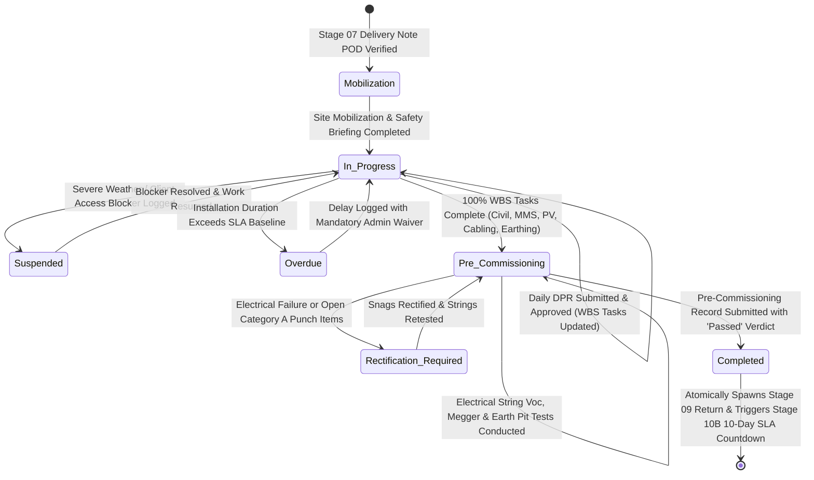

# STEP_08_INSTALLATION_ZONE_DPR_SPECIFICATION.caveman.md

# Enterprise Lifecycle Step Specification: Zone-Based Installation Execution, Mobile Daily Progress Reports (DPR) & Pre-Commissioning Verification

**Document ID:** `STEP-08-INSTALLATION-ZONE-DPR`  
**Lifecycle Flow:** Flow 1: Core Solar EPC Project Execution (Stage 08 of 11)  
**Governing Architecture:** [`architect_docs/02_STEP_PLANNING_SPECIFICATION_BLUEPRINT.md`](../architect_docs/02_STEP_PLANNING_SPECIFICATION_BLUEPRINT.md)  
**Architecture Decision Record:** [`docs/decisions/ADR-009-INSTALLATION-ZONE-WBS-DPR-EXECUTION.md`](../docs/decisions/ADR-009-INSTALLATION-ZONE-WBS-DPR-EXECUTION.md)  
**PRD / FRS Traceability:** [`planning_ref_docs/01_PROJECT_FOUNDATION_MODEL.md`](../planning_ref_docs/01_PROJECT_FOUNDATION_MODEL.md) (`BC-08`, `Sec 3.8`), [`planning_ref_docs/05_BUSINESS_REQUIREMENTS_DOCUMENT.md`](../planning_ref_docs/05_BUSINESS_REQUIREMENTS_DOCUMENT.md) (`BR-008`), [`planning_ref_docs/06_FUNCTIONAL_REQUIREMENTS_SPECIFICATION.md`](../planning_ref_docs/06_FUNCTIONAL_REQUIREMENTS_SPECIFICATION.md) (`FR-008`), [`planning_ref_docs/08_DATABASE_DESIGN_DOCUMENT.md`](../planning_ref_docs/08_DATABASE_DESIGN_DOCUMENT.md) (`Domain 7: PRJ`, `tabDaily Progress Report (DPR)`), [`planning_ref_docs/09_API_DESIGN_AND_INTEGRATIONS.md`](../planning_ref_docs/09_API_DESIGN_AND_INTEGRATIONS.md) (`API 7`), [`planning_ref_docs/10_UI_UX_SPECIFICATION.md`](../planning_ref_docs/10_UI_UX_SPECIFICATION.md) (`Screen 11`, `Screen 12`), [`planning_ref_docs/11_MODULE_FUNCTIONAL_DOCUMENTATION.md`](../planning_ref_docs/11_MODULE_FUNCTIONAL_DOCUMENTATION.md) (`MOD-08`), [`step_plans/STEP_07_MATERIAL_DISPATCH_DELIVERY_NOTE_SPECIFICATION.md`](./STEP_07_MATERIAL_DISPATCH_DELIVERY_NOTE_SPECIFICATION.md), [`step_plans/STEP_09_MATERIAL_RETURN_RECONCILIATION_SPECIFICATION.md`](./STEP_09_MATERIAL_RETURN_RECONCILIATION_SPECIFICATION.md), [`step_plans/STEP_10_LIAISONING_GRID_SYNC_SPECIFICATION.md`](./STEP_10_LIAISONING_GRID_SYNC_SPECIFICATION.md)  
**Target Module:** `solar_module` (Extend ERPNext `tabProject`, `tabTask`, plus standalone `tabSolar Daily Progress Report`, `tabSolar Installation Zone`, `tabSolar Pre Commissioning Checklist`, `tabSolar String Electrical Test Log`, `tabSolar Earth Pit Test Log`, `tabSolar Installation Settings`)  
**Author:** Principal Enterprise Architect  
**Status:** Ready for Execution

---

## 1. Step Scope, Objectives & Context Traceability

### 1.1 Lifecycle Positioning & Physical Engineering Core

Stage 08 core physical engineering phase in `solar_module`. Bridge logistics fulfillment (Stage 07 Material Dispatch POD) with site material reconciliation (Stage 09 Surplus Material Return) and statutory electrical grid sync (Stage 10B Dual-Timing Liaisoning & Project Completion).

In **Dual Progress Bar Lifecycle Architecture** ([`docs/decisions/ADR-007-DUAL-PROGRESS-BAR-LIFECYCLE-SLA-ENGINE.md`](../docs/decisions/ADR-007-DUAL-PROGRESS-BAR-LIFECYCLE-SLA-ENGINE.md)), Stage 08 central operational engine of **Project Lifecycle Stepper**. Activate upon site Proof of Delivery (POD) from Stage 07, orchestrating multi-zone site mobilization, foundation casting, structure erection, PV module installation, DC string cabling, AC inverter termination, earthing grid bonding, and pre-commissioning testing.

```
┌──────────────────────────────────────────────────────────────────────────────────────────────────┐
│                                STAGE 08 LIFECYCLE POSITIONING                                    │
└──────────────────────────────────────────────────────────────────────────────────────────────────┘

    [Stage 07: Material Dispatch & Site POD Verified] ──▶ Atomic Stage Transition
         │
         ▼
    [Stage 08: Zone-Based Installation Execution Activated]
    • Project Stepper sets custom_current_lifecycle_stage = "Stage 08: Installation"
    • Generates Multi-Zone Work Breakdown Structure (WBS) Tasks in tabTask
    • Assigns Project Engineer (Lead Site Execution) & Site Supervisor (Field Operations)
         │
         ├────────────────────────────────────────────────────────────────────────┐
         ▼                                                                        ▼
    [Daily Field Operations & Mobile DPR Loop]                  [Real-Time Progress & Material Tracking]
    • Daily Weather Log & Lost Hours Assessment                 • Quantitative physical units completed
    • Workforce Headcount across 5 certified trades             • Automatic tabTask % progress aggregation
    • Geotagged photographic verification with GPS              • Live Dispatched vs Installed balance math
    • Site blockers & contractor impediment logs                • Pre-populates Stage 09 return workbench
         │                                                                        │
         └──────────────────────────────────┬─────────────────────────────────────┘
                                            │
                                            ▼
    [100% WBS Physical Milestones Reached (Civil, MMS, PV, Cabling, Earthing, Inverters)]
                                            │
                                            ▼
    [Mandatory Pre-Commissioning Electrical Testing Gate (IEC 62446-1 Compliance)]
    • 100% String Open-Circuit Voltage (Voc) within ±5% theoretical design threshold
    • String Short-Circuit Current (Isc) & Polarity validation
    • Insulation Resistance (Megger Test): DC+/PE, DC-/PE, AC/PE ≥ 1.0 MΩ
    • Dedicated Earth Pit Resistance: DC/MMS ≤ 5.0 Ω, Inverter/Transformer ≤ 1.0 Ω
    • Category 'A' Pre-Commissioning Punch List signed off with 0 open defects
                                            │
                                            ▼
    [Quality Sign-Off by Quality & Commissioning Engineer / Project Engineer]
                                            │
         ┌──────────────────────────────────┴─────────────────────────────────────┐
         ▼                                                                        ▼
    [Stage 09: Material Return to Store]                     [Stage 10B: Statutory Grid Sync]
    • Spawns Site Material Reconciliation Task               • Triggers Phase 2 Liaisoning in tabLiaisoning
    • Compares Dispatched vs Installed balance               • Starts statutory 10-day SLA countdown timer
    • Auto-generates Stock Entry (Material Return)           • Unlocks CEIG inspection & Joint Meter (JMI)
```

### 1.2 Strategic Business Objectives & Quantitative KPIs

Replace undocumented field execution with deterministic Work Breakdown Structures, enforce strict electrical safety standards, eliminate site inventory leakage, accelerate project commissioning.

| Metric / KPI Code                      | Target Objective                                    | Legacy Baseline                        | Target Standard         | Operational Impact                                                               |
| :------------------------------------- | :-------------------------------------------------- | :------------------------------------- | :---------------------- | :------------------------------------------------------------------------------- |
| **KPI-01: Daily Reporting TAT**        | Next-day Daily Progress Report (DPR) submission     | 4–8 days (Retrospective paper batches) | **$\le$ 10:00 AM T+1**  | Real-time executive visibility; instant identification of project delays.        |
| **KPI-02: Installation Schedule**      | Project installation completion within SLA baseline | 25% to 45% schedule slippage           | **$\ge$ 92% On-Time**   | Eliminates labor idling; compresses overall customer project delivery lead time. |
| **KPI-03: Material Tracking**          | Installed vs Dispatched material reconciliation     | 10% to 18% unaccounted field loss      | **$\le$ 0.5% Variance** | Eliminates on-site theft and transit scrap; enforces tight project gross margin. |
| **KPI-04: Electrical Testing Gate**    | 100% String Voc, Megger & Earth Pit test compliance | $\approx 15\%$ formal test execution   | **100.0% Strict Gate**  | Zero inverter ground faults; first-time pass during government CEIG inspections. |
| **KPI-05: Statutory Handover Latency** | Handoff duration from physical install to grid sync | 12 to 20 days administrative delay     | **$\le$ 2 Hours**       | Instant automated trigger of Stage 10B starts the 10-day net meter SLA clock.    |

### 1.3 Context Traceability Matrix

| Specification Domain              | Reference Identifier                                                                                                                | Specific Provision / Governing Clause                                                               |
| :-------------------------------- | :---------------------------------------------------------------------------------------------------------------------------------- | :-------------------------------------------------------------------------------------------------- |
| **Project Foundation Model**      | [`planning_ref_docs/01_PROJECT_FOUNDATION_MODEL.md`](../planning_ref_docs/01_PROJECT_FOUNDATION_MODEL.md)                           | Business Capability `BC-08`: Installation Execution & Zone DPR (`Sec 3.8`).                         |
| **Business Requirements (BRD)**   | [`planning_ref_docs/05_BUSINESS_REQUIREMENTS_DOCUMENT.md`](../planning_ref_docs/05_BUSINESS_REQUIREMENTS_DOCUMENT.md)               | `BR-008`: Track multi-zone installations with daily mobile DPRs capturing labor, weather, progress. |
| **Functional Requirements (FRS)** | [`planning_ref_docs/06_FUNCTIONAL_REQUIREMENTS_SPECIFICATION.md`](../planning_ref_docs/06_FUNCTIONAL_REQUIREMENTS_SPECIFICATION.md) | `FR-008`: Multi-zone WBS, daily mobile DPR, labor breakdown, pre-comm punch list & Megger tests.    |
| **Database Architecture (3NF)**   | [`planning_ref_docs/08_DATABASE_DESIGN_DOCUMENT.md`](../planning_ref_docs/08_DATABASE_DESIGN_DOCUMENT.md)                           | Domain 7: `PRJ` (`tabProject`, `tabTask`, `tabDaily Progress Report (DPR)`).                        |
| **API & Integrations**            | [`planning_ref_docs/09_API_DESIGN_AND_INTEGRATIONS.md`](../planning_ref_docs/09_API_DESIGN_AND_INTEGRATIONS.md)                     | API 7: Site Execution & DPR Logging (`solar_module.api.installation.*`).                            |
| **UI/UX Specifications**          | [`planning_ref_docs/10_UI_UX_SPECIFICATION.md`](../planning_ref_docs/10_UI_UX_SPECIFICATION.md)                                     | Screen 11: Project Execution Stepper & WBS; Screen 12: Mobile DPR Fast-Touch Entry.                 |
| **Standard Operating Procedure**  | [`planning_ref_docs/11_MODULE_FUNCTIONAL_DOCUMENTATION.md`](../planning_ref_docs/11_MODULE_FUNCTIONAL_DOCUMENTATION.md)             | `MOD-08`: Site mobilization, daily mobile DPR submission, Megger logs, pre-commissioning sign-off.  |

### 1.4 Failure Modes Addressed

```
┌──────────────────────────────────────────────────────────────────────────────────────────────────┐
│                               OPERATIONAL FAILURE MODES PREVENTED                                │
├──────────────────────────────────────────────────────────────────────────────────────────────────┤
│ 1. Invisible Schedule Slippage (The "90% Done" Illusion):                                        │
│    WBS with physical quantity tracking mathematically rolls up actual completion percentage.     │
│                                                                                                  │
│ 2. Unexplained Labor Budget Overruns:                                                            │
│    Mandatory daily DPR labor headcount by trade tied to site supervisor sign-off and geotagged   │
│    toolbox talk photos.                                                                          │
│                                                                                                  │
│ 3. Unaccounted Material Shrinkage & Scrap:                                                       │
│    DPR Material Consumed ledger binds daily installed quantities against Stage 07 Delivery Notes.│
│                                                                                                  │
│ 4. Electrical Ground Faults & Inverter Fires:                                                    │
│    Pre-Commissioning Gate enforces 100% string Voc checks (±5%) and Megger testing (≥ 1.0 MΩ).     │
│                                                                                                  │
│ 5. Statutory CEIG & DISCOM Inspection Failures:                                                  │
│    Pre-Commissioning Test Sheet records earth pit resistance (≤ 5.0 Ω structure, ≤ 1.0 Ω inverter) │
│    with calibration-tagged tester documentation.                                                 │
│                                                                                                  │
│ 6. Coordination Gaps Between Site, Store & Liaisoning:                                           │
│    Stage 08 completion atomically spawns Stage 09 Material Return and activates Stage 10B        │
│    Statutory Grid Synchronization countdown (10-day SLA timer).                                  │
└──────────────────────────────────────────────────────────────────────────────────────────────────┘
```

---

## 2. Stakeholders, Enterprise Actors & HRMS Role Mapping

Enforce **Zero "User" Suffix Rule** ([`step_plans/README.md#5-enterprise-persona--role-naming-standard-zero-user-suffix-rule`](./README.md#5-enterprise-persona--role-naming-standard-zero-user-suffix-rule)).

### 2.1 Enterprise Persona & Role Definition

| Persona / Business Title             | Frappe System Role                 | HRMS Designation                       | Operational Scope & Authority                                                                                                                                      |
| :----------------------------------- | :--------------------------------- | :------------------------------------- | :----------------------------------------------------------------------------------------------------------------------------------------------------------------- |
| **Project Engineer**                 | `Project Engineer`                 | `Site Project Engineer` / `Field Lead` | Lead site execution authority. Oversees multi-zone WBS, approves daily DPRs, conducts electrical string and Megger testing, authorizes pre-commissioning sign-off. |
| **Site Supervisor**                  | `Site Supervisor`                  | `Site Supervisor` / `Field Foreman`    | Frontline site operator. Manages daily labor crews, enters mobile DPRs, logs weather disruptions and site impediments, captures milestone geotagged photos.        |
| **Quality & Commissioning Engineer** | `Quality & Commissioning Engineer` | `QC & Commissioning Specialist`        | Specialist technical auditor. Independently verifies string Voc/Isc math, audits insulation Megger logs, inspects earth pits, and signs off punch lists.           |
| **Safety Officer**                   | `Safety Officer`                   | `EHS Officer` / `Safety Specialist`    | On-site health and safety officer. Conducts daily safety toolbox talks, enforces PPE compliance, audits lifeline anchoring, and verifies safety logs.              |
| **Store Assistant**                  | `Store Assistant`                  | `Store Assistant`                      | Monitors on-site material consumption against Stage 07 dispatches and prepares Stage 09 surplus return receipts.                                                   |
| **Commercial Officer**               | `Commercial Officer`               | `Sales Operations Executive`           | Tracks installation milestone completion against customer billing schedule and contractual advance terms.                                                          |
| **Admin**                            | `Admin`                            | `Director` / `Head of Operations`      | Project-level Supreme Command. Authorizes installation SLA waivers, reviews major site delay logs, and configures `Solar Installation Settings`.                   |
| **System Manager**                   | `System Manager`                   | `Chief Technology Officer` / `DevOps`  | Framework Supreme. Possesses all access `Admin` has; manages DocType schemas, background RQ queues, and API integrations.                                          |

### 2.2 Role Permission Matrix for Stage 08 Entities

| Frappe System Role                 | `tabProject` (Installation Fields) | `tabTask` (Zone Tasks) | `tabSolar Daily Progress Report` | `tabSolar Pre Commissioning Checklist` | `tabSolar Installation Settings` | Actionable Stage Gates                           |
| :--------------------------------- | :--------------------------------: | :--------------------: | :------------------------------: | :------------------------------------: | :------------------------------: | :----------------------------------------------- |
| **`Project Engineer`**             |         Read, Write (Site)         | Read, Write, Reassign  |    Read, Write, Submit, Amend    |       Read, Write, Submit, Sign        |            Read Only             | Approve DPR, Authorize Pre-Comm Sign-off         |
| **`Site Supervisor`**              |             Read Only              | Read, Write (Assigned) |   Read, Write, Create (Draft)    |          Read, Write (Entry)           |            Read Only             | Create & Draft Daily DPR, Log Weather/Blockers   |
| **`Quality & Commissioning Eng.`** |             Read Only              |       Read Only        |            Read Only             |       Read, Write, Submit, Sign        |            Read Only             | Verify Electrical Testing, Sign-Off Punch List   |
| **`Safety Officer`**               |             Read Only              |       Read Only        |       Read, Write (Safety)       |          Read, Write (Safety)          |            Read Only             | Sign Daily Toolbox Talk, Log Safety Incidents    |
| **`Store Assistant`**              |             Read Only              |       Read Only        |       Read (Material Logs)       |               Read Only                |            Read Only             | Monitor Site Balance for Stage 09 Return         |
| **`Commercial Officer`**           |             Read Only              |       Read Only        |            Read Only             |               Read Only                |            Read Only             | Audit Milestone Progress for Billing Milestones  |
| **`Admin`**                        |     Full Control (Operational)     |      Full Control      |   Full Control (Submit/Cancel)   |      Full Control (Override/Sign)      |   Full Control (Write/Config)    | Override Gates, Authorize SLA Delay Waivers      |
| **`System Manager`**               |       Apex Technical Access        | Apex Technical Access  |      Apex Technical Access       |         Apex Technical Access          |      Apex Technical Access       | Developer Console, Migrations, Backend Pipelines |

---

## 3. Relational Schema & 3NF Data Dictionary

### 3.1 Core DocType Extensions: `tabProject` (Installation Stage Host)

| Fieldname                                | Label                      | Fieldtype  | Options / Target                                                                           | Mandatory | Index | Description & Validation Rules                                                        |
| :--------------------------------------- | :------------------------- | :--------- | :----------------------------------------------------------------------------------------- | :-------: | :---: | :------------------------------------------------------------------------------------ |
| `custom_current_lifecycle_stage`         | Lifecycle Stage            | `Select`   | `... \nStage 07: Dispatch\nStage 08: Installation\nStage 09: Material Return\n...`         |    Yes    |   1   | Current operational stage in the Project Lifecycle Stepper.                           |
| `custom_installation_status`             | Installation Status        | `Select`   | `Not Started\nMobilization\nIn Progress\nPre-Commissioning\nCompleted\nSuspended\nOverdue` |    Yes    |   1   | State machine status of physical installation.                                        |
| `custom_assigned_project_engineer`       | Project Engineer           | `Link`     | `User` (Role: Project Engineer)                                                            |    Yes    |   1   | Primary field engineering lead responsible for technical execution.                   |
| `custom_assigned_site_supervisor`        | Site Supervisor            | `Link`     | `User` (Role: Site Supervisor)                                                             |    Yes    |   1   | Field foreman responsible for daily DPR reporting and crew supervision.               |
| `custom_installation_zones`              | Installation Zones         | `Table`    | `Solar Installation Zone`                                                                  |    No     |   -   | Child table defining physical zone boundaries, capacities, and tilt/azimuth.          |
| `custom_cumulative_dpr_completion_pct`   | Physical Completion %      | `Percent`  | -                                                                                          |    No     |   -   | Weighted cumulative physical completion percentage aggregated from all approved DPRs. |
| `custom_installation_start_date`         | Actual Mobilization Date   | `Date`     | -                                                                                          |    No     |   -   | Date physical mobilization and site prep commenced.                                   |
| `custom_installation_completion_date`    | Actual Installation Finish | `Date`     | -                                                                                          |    No     |   -   | Date 100% WBS milestones and pre-commissioning testing completed.                     |
| `custom_pre_comm_test_ref`               | Pre-Commissioning Record   | `Link`     | `Solar Pre Commissioning Checklist`                                                        |    No     |   1   | Direct foreign key reference to the submitted electrical testing record.              |
| `custom_pre_comm_gate_cleared`           | Pre-Commissioning Cleared  | `Check`    | -                                                                                          |    No     |   -   | Boolean flag asserting all string Voc, Megger, and earth tests passed.                |
| `custom_installation_sla_status`         | Installation SLA Status    | `Select`   | `Within SLA\nWarning\nOverdue\nDelay Approved`                                             |    No     |   1   | Computed SLA status based on capacity-specific duration.                              |
| `custom_installation_target_finish_date` | SLA Target Finish Date     | `Datetime` | -                                                                                          |    No     |   -   | Statutory deadline for completing installation.                                       |
| `custom_last_dpr_date`                   | Last DPR Submission Date   | `Date`     | -                                                                                          |    No     |   -   | Date of the most recently submitted Daily Progress Report.                            |
| `custom_dpr_submission_sla_status`       | Daily DPR SLA Status       | `Select`   | `On Track\nPending T+1 10AM\nOverdue Missing DPR`                                          |    No     |   -   | Daily countdown tracking morning DPR submission cutoff.                               |

### 3.2 Core DocType Extensions: `tabTask` (Zone Work Breakdown Structure)

| Fieldname                     | Label                    | Fieldtype | Options / Target                                                                                        | Mandatory | Index | Description & Validation Rules                                          |
| :---------------------------- | :----------------------- | :-------- | :------------------------------------------------------------------------------------------------------ | :-------: | :---: | :---------------------------------------------------------------------- |
| `custom_is_solar_wbs_task`    | Is Solar WBS Task        | `Check`   | -                                                                                                       |    No     |   1   | Identifies standard WBS milestones spawned for solar execution.         |
| `custom_solar_zone_ref`       | Solar Zone               | `Link`    | `Solar Installation Zone`                                                                               |    No     |   1   | Binds task to a specific physical rooftop or ground zone.               |
| `custom_wbs_milestone_type`   | Milestone Type           | `Select`  | `Mobilization\nCivil Foundation\nMMS Erection\nPV Mounting\nDC Cabling\nAC Inverter\nEarthing\nTesting` |    No     |   1   | Engineering milestone category.                                         |
| `custom_target_quantity`      | Target Quantity          | `Float`   | -                                                                                                       |    No     |   -   | Planned physical units (e.g. 100 pedestals, 400 panels, 1200 meters).   |
| `custom_cumulative_installed` | Cumulative Completed Qty | `Float`   | -                                                                                                       |    No     |   -   | Sum of daily completed quantities logged in approved DPRs.              |
| `custom_quantity_uom`         | Quantity UOM             | `Link`    | `UOM`                                                                                                   |    No     |   -   | Unit of measure (`Nos`, `Meter`, `kWp`, `Set`).                         |
| `custom_weightage_percentage` | WBS Weightage %          | `Percent` | -                                                                                                       |    No     |   -   | Percentage weight of this task toward total zone installation progress. |

### 3.3 Standalone Custom DocType: `tabSolar Installation Zone`

- **Module:** `solar_module`
- **DocType Type:** Standalone Master / Child Table in Project (`is_submittable = 0`, `istable = 1`)
- **Autoname:** `hash` or `field:zone_code` (e.g. `ZONE-A-EAST-ROOF`)

| Fieldname             | Label               | Fieldtype | Options / Target                                                                  | Mandatory | Index | Description & Rules                                                 |
| :-------------------- | :------------------ | :-------- | :-------------------------------------------------------------------------------- | :-------: | :---: | :------------------------------------------------------------------ |
| `zone_code`           | Zone Identifier     | `Data`    | -                                                                                 |    Yes    |   1   | Unique zone code (e.g., `ZONE-01`, `SHED-A`, `CARPORT-B`).          |
| `zone_name`           | Zone Name / Title   | `Data`    | -                                                                                 |    Yes    |   -   | Human-readable description (e.g. `East Administrative Roof`).       |
| `allocated_capacity`  | Capacity (kWp)      | `Float`   | -                                                                                 |    Yes    |   -   | Solar DC capacity allocated to this specific zone.                  |
| `module_quantity`     | Module Count        | `Int`     | -                                                                                 |    Yes    |   -   | Number of solar PV modules scheduled for installation in zone.      |
| `string_count`        | Number of Strings   | `Int`     | -                                                                                 |    Yes    |   -   | Number of parallel DC electrical strings in this zone.              |
| `roof_structure_type` | Structure / Base    | `Select`  | `RCC Roof\nTin Shed (Trapezoidal)\nStanding Seam\nGround Mount\nBallast Pedestal` |    Yes    |   -   | Foundation and mounting surface archetype.                          |
| `tilt_angle`          | Surface Tilt (°)    | `Float`   | -                                                                                 |    No     |   -   | Installation tilt angle in degrees.                                 |
| `azimuth_angle`       | Azimuth Angle (°)   | `Float`   | -                                                                                 |    No     |   -   | Azimuth angle relative to true South (0° = South).                  |
| `target_inverter_tag` | Linked Inverter Tag | `Data`    | -                                                                                 |    No     |   -   | Tag or name of string inverter servicing this zone (e.g. `INV-01`). |

### 3.4 Standalone Custom DocType: `tabSolar Daily Progress Report`

- **Module:** `solar_module`
- **DocType Type:** Standalone Submittable DocType (`is_submittable = 1`)
- **Autoname:** `naming_series:` $\rightarrow$ `DPR-.YYYY.-.#####` (e.g. `DPR-2026-00142`)

| Fieldname                     | Label                          | Fieldtype    | Options / Target                                                              | Mandatory | Index | Description & Validation Rules                                                 |
| :---------------------------- | :----------------------------- | :----------- | :---------------------------------------------------------------------------- | :-------: | :---: | :----------------------------------------------------------------------------- |
| `naming_series`               | Series                         | `Select`     | `DPR-.YYYY.-.#####`                                                           |    Yes    |   -   | Standard document numbering series.                                            |
| `project`                     | Project Reference              | `Link`       | `Project`                                                                     |    Yes    |   1   | Linked ERPNext Solar EPC Project.                                              |
| `customer`                    | Customer Name                  | `Link`       | `Customer`                                                                    |    No     |   -   | Fetched read-only from `project.customer`.                                     |
| `zone`                        | Zone Reference                 | `Link`       | `Solar Installation Zone`                                                     |    No     |   1   | Target zone (optional; if blank, applies to whole project).                    |
| `report_date`                 | Report Date                    | `Date`       | -                                                                             |    Yes    |   1   | Date work was executed. Cannot be in the future.                               |
| `shift_type`                  | Shift                          | `Select`     | `Day Shift\nNight Shift\nOvertime`                                            |    Yes    |   -   | Operational shift descriptor.                                                  |
| `site_supervisor`             | Site Supervisor (Author)       | `Link`       | `User`                                                                        |    Yes    |   1   | Field foreman compiling the report (Defaults to session user).                 |
| `project_engineer`            | Project Engineer (Approver)    | `Link`       | `User`                                                                        |    Yes    |   1   | Site engineering lead verifying and approving the report.                      |
| `weather_condition`           | Weather Condition              | `Select`     | `Clear Sunny\nPartly Cloudy\nRain / Wet\nExtreme Heat\nHigh Wind\nDust Storm` |    Yes    |   -   | Prevailing weather conditions during shift.                                    |
| `weather_hours_lost`          | Weather Hours Lost             | `Float`      | -                                                                             |    No     |   -   | Working hours lost directly to adverse weather conditions.                     |
| `total_labor_headcount`       | Total Headcount                | `Int`        | -                                                                             |    Yes    |   -   | Aggregated headcount from `labor_attendance` child table.                      |
| `safety_toolbox_conducted`    | Safety Toolbox Talk Done       | `Check`      | -                                                                             |    Yes    |   -   | Enforces daily morning safety briefing verification before work commencement.  |
| `safety_incidents_logged`     | Safety Incidents / Near Miss   | `Int`        | -                                                                             |    Yes    |   -   | Count of any safety incidents or near misses during shift (0 = Zero incident). |
| `labor_attendance`            | Labor Attendance Breakdown     | `Table`      | `Solar DPR Labor Attendance`                                                  |    Yes    |   -   | Child table breaking down manpower by trade category.                          |
| `activity_progress`           | Physical Activity Progress     | `Table`      | `Solar DPR Activity Progress`                                                 |    Yes    |   -   | Child table tracking daily units executed against WBS tasks.                   |
| `material_consumed`           | Materials Installed / Consumed | `Table`      | `Solar DPR Material Consumed`                                                 |    No     |   -   | Child table binding daily installed materials against Stage 07 Delivery Notes. |
| `site_blockers`               | Site Blockers & Delays         | `Table`      | `Solar DPR Blocker Log`                                                       |    No     |   -   | Child table logging contractor impediments, grid outages, or access denials.   |
| `photo_evidence`              | Geotagged Photo Evidence       | `Table`      | `Solar DPR Photo`                                                             |    Yes    |   -   | Child table holding mandatory photos with GPS coordinates and timestamps.      |
| `daily_remarks`               | Supervisor Remarks             | `Small Text` | -                                                                             |    No     |   -   | Qualitative summary of daily accomplishments and site observations.            |
| `engineer_verification_notes` | Engineer Verification Notes    | `Small Text` | -                                                                             |    No     |   -   | Observations recorded by Project Engineer upon formal approval and submission. |
| `amended_from`                | Amended From                   | `Link`       | `Solar Daily Progress Report`                                                 |    No     |   -   | Standard Frappe cancellation/amendment tracking.                               |

### 3.5 Child Tables for Daily Progress Report

#### 3.5.1 `tabSolar DPR Labor Attendance`

- **DocType Type:** Child Table (`istable = 1`)

| Fieldname           | Label                   | Fieldtype | Options / Target                                                                                      | Mandatory | Description                                            |
| :------------------ | :---------------------- | :-------- | :---------------------------------------------------------------------------------------------------- | :-------: | :----------------------------------------------------- |
| `trade_category`    | Trade Category          | `Select`  | `Civil Mason\nStructural Fitter\nCertified Electrician\nHelper / Unskilled\nSafety Officer\nSurveyor` |    Yes    | Specific labor classification.                         |
| `headcount`         | Headcount               | `Int`     | -                                                                                                     |    Yes    | Number of personnel in this trade category.            |
| `contractor_agency` | Contractor Agency       | `Link`    | `Supplier`                                                                                            |    No     | Subcontractor supplying labor (Optional for internal). |
| `working_hours`     | Hours Worked per Person | `Float`   | -                                                                                                     |    Yes    | Shift hours (e.g. 8.0 or 10.0 hours).                  |
| `total_man_hours`   | Total Man-Hours         | `Float`   | -                                                                                                     |    No     | Formula: `headcount * working_hours`.                  |

#### 3.5.2 `tabSolar DPR Activity Progress`

- **DocType Type:** Child Table (`istable = 1`)

| Fieldname              | Label               | Fieldtype | Options / Target     | Mandatory | Description                                                |
| :--------------------- | :------------------ | :-------- | :------------------- | :-------: | :--------------------------------------------------------- |
| `task`                 | WBS Task            | `Link`    | `Task`               |    Yes    | Linked ERPNext Task.                                       |
| `milestone_type`       | Milestone           | `Select`  | Same as in `tabTask` |    Yes    | Inherited from task for filtering.                         |
| `target_quantity`      | Total Target Qty    | `Float`   | -                    |    Yes    | Total planned units for the project / zone.                |
| `previous_completed`   | Previously Executed | `Float`   | -                    |    No     | Cumulative units executed prior to today.                  |
| `today_completed`      | Completed Today     | `Float`   | -                    |    Yes    | Units executed during this specific shift ($> 0$).         |
| `cumulative_completed` | New Cumulative Qty  | `Float`   | -                    |    No     | Formula: `previous_completed + today_completed`.           |
| `quantity_uom`         | UOM                 | `Link`    | `UOM`                |    Yes    | Measurement unit (`Nos`, `Meter`, `kWp`).                  |
| `progress_percentage`  | Milestone % Done    | `Percent` | -                    |    No     | Formula: `(cumulative_completed / target_quantity) * 100`. |

#### 3.5.3 `tabSolar DPR Material Consumed`

- **DocType Type:** Child Table (`istable = 1`)

| Fieldname                   | Label                      | Fieldtype | Options / Target | Mandatory | Description                                             |
| :-------------------------- | :------------------------- | :-------- | :--------------- | :-------: | :------------------------------------------------------ |
| `item_code`                 | Item Code                  | `Link`    | `Item`           |    Yes    | Dispatched solar component.                             |
| `item_name`                 | Item Name                  | `Data`    | -                |    No     | Standard description.                                   |
| `total_dispatched_qty`      | Total Dispatched to Site   | `Float`   | -                |    Yes    | Cumulative quantity issued via Stage 07 Delivery Notes. |
| `cumulative_installed_prev` | Previously Installed       | `Float`   | -                |    No     | Cumulative installed up to yesterday.                   |
| `installed_today`           | Installed Today            | `Float`   | -                |    Yes    | Quantity physically bolted or laid down today.          |
| `cumulative_installed`      | Total Cumulative Installed | `Float`   | -                |    No     | Formula: `cumulative_installed_prev + installed_today`. |
| `remaining_site_balance`    | Remaining Site Balance     | `Float`   | -                |    No     | Formula: `total_dispatched_qty - cumulative_installed`. |
| `uom`                       | UOM                        | `Link`    | `UOM`            |    Yes    | Unit of measure.                                        |

#### 3.5.4 `tabSolar DPR Blocker Log`

- **DocType Type:** Child Table (`istable = 1`)

| Fieldname             | Label                  | Fieldtype    | Options / Target                                                                                                                     | Mandatory | Description                                       |
| :-------------------- | :--------------------- | :----------- | :----------------------------------------------------------------------------------------------------------------------------------- | :-------: | :------------------------------------------------ |
| `blocker_category`    | Blocker Category       | `Select`     | `Weather Disruption\nMaterial Shortage\nSite Access Denied\nGrid Power Outage\nEquipment Breakdown\nClient Delay\nCivil Obstruction` |    Yes    | Standardized impediment classification.           |
| `blocker_description` | Description            | `Small Text` | -                                                                                                                                    |    Yes    | Detailed factual summary of impediment.           |
| `hours_lost`          | Hours Lost             | `Float`      | -                                                                                                                                    |    No     | Work hours lost due to this blocker.              |
| `action_required`     | Corrective Action Plan | `Small Text` | -                                                                                                                                    |    No     | Remedial action to resolve blocker.               |
| `resolution_owner`    | Resolution Owner       | `Link`       | `User`                                                                                                                               |    No     | Assigned person responsible for clearing blocker. |

#### 3.5.5 `tabSolar DPR Photo`

- **DocType Type:** Child Table (`istable = 1`)

| Fieldname             | Label               | Fieldtype      | Options / Target                                                                                                                    | Mandatory | Description                                         |
| :-------------------- | :------------------ | :------------- | :---------------------------------------------------------------------------------------------------------------------------------- | :-------: | :-------------------------------------------------- |
| `milestone_reference` | Milestone           | `Select`       | `Safety Briefing\nCivil Foundation\nMMS Assembly & Torque\nModule Alignment\nDC String Cabling\nInverter Termination\nEarthing Pit` |    Yes    | Execution activity shown in photo.                  |
| `photo_image`         | Photo Attachment    | `Attach Image` | -                                                                                                                                   |    Yes    | High-resolution photo upload.                       |
| `latitude`            | Latitude            | `Float`        | -                                                                                                                                   |    No     | Geocoded GPS latitude captured at point of upload.  |
| `longitude`           | Longitude           | `Float`        | -                                                                                                                                   |    No     | Geocoded GPS longitude captured at point of upload. |
| `timestamp`           | Capture Timestamp   | `Datetime`     | -                                                                                                                                   |    Yes    | Mobile device capture timestamp.                    |
| `caption`             | Description / Notes | `Data`         | -                                                                                                                                   |    No     | Short explanatory note.                             |

---

### 3.6 Standalone Custom DocType: `tabSolar Pre Commissioning Checklist`

- **Module:** `solar_module`
- **DocType Type:** Standalone Submittable DocType (`is_submittable = 1`)
- **Autoname:** `naming_series:` $\rightarrow$ `PCOMM-.YYYY.-.#####` (e.g. `PCOMM-2026-00089`)

| Fieldname                     | Label                             | Fieldtype    | Options / Target                                                    | Mandatory | Index | Description & Validation Rules                                               |
| :---------------------------- | :-------------------------------- | :----------- | :------------------------------------------------------------------ | :-------: | :---: | :--------------------------------------------------------------------------- |
| `naming_series`               | Series                            | `Select`     | `PCOMM-.YYYY.-.#####`                                               |    Yes    |   -   | Standard naming series.                                                      |
| `project`                     | Project Reference                 | `Link`       | `Project`                                                           |    Yes    |   1   | Parent Solar EPC Project.                                                    |
| `customer`                    | Customer Name                     | `Link`       | `Customer`                                                          |    No     |   -   | Fetched read-only from `project.customer`.                                   |
| `inspection_date`             | Inspection Date                   | `Date`       | -                                                                   |    Yes    |   1   | Date pre-commissioning testing took place.                                   |
| `testing_engineer`            | Testing Engineer                  | `Link`       | `User` (Role: Project Engineer)                                     |    Yes    |   1   | Field engineer who operated instruments and captured measurements.           |
| `auditing_engineer`           | Auditing / Commissioning Engineer | `Link`       | `User` (Role: Quality & Commissioning Engineer)                     |    Yes    |   1   | Independent QC engineer approving the electrical verification.               |
| `multimeter_calibration_id`   | Multimeter Model & Calib ID       | `Data`       | -                                                                   |    Yes    |   -   | Instrument serial number and valid calibration certificate tag.              |
| `megger_calibration_id`       | Megger Insulation Tester Calib ID | `Data`       | -                                                                   |    Yes    |   -   | 1000V DC Megger instrument ID and calibration reference.                     |
| `earth_tester_calibration_id` | Earth Tester Calib ID             | `Data`       | -                                                                   |    Yes    |   -   | 4-terminal Digital Earth Resistance Tester serial and calibration tag.       |
| `string_electrical_tests`     | String Electrical Test Table      | `Table`      | `Solar String Electrical Test Log`                                  |    Yes    |   -   | Child table logging individual DC string voltages, currents, and polarities. |
| `earth_pit_tests`             | Earth Pit Resistance Test Table   | `Table`      | `Solar Earth Pit Test Log`                                          |    Yes    |   -   | Child table logging earth electrode resistance measurements.                 |
| `punch_list_items`            | Pre-Commissioning Punch List      | `Table`      | `Solar Pre Commissioning Punch Item`                                |    No     |   -   | Child table tracking open physical snags and resolution status.              |
| `overall_test_verdict`        | Overall Testing Verdict           | `Select`     | `Pending Review\nPassed (Zero Defects)\nRejected (Critical Faults)` |    Yes    |   1   | Final compliance status. Only `Passed` unlocks Stage 08 completion.          |
| `rejection_reasons`           | Rejection Summary                 | `Small Text` | -                                                                   |    No     |   -   | Detailed technical explanation if tests fail.                                |
| `quality_sign_off_timestamp`  | Sign-Off Timestamp                | `Datetime`   | -                                                                   |    No     |   -   | Exact moment QC auditor submitted and sealed the record.                     |

#### 3.6.1 `tabSolar String Electrical Test Log`

- **DocType Type:** Child Table (`istable = 1`)

| Fieldname                   | Label                     | Fieldtype | Options / Target | Mandatory | Description & Rules                                                                                |
| :-------------------------- | :------------------------ | :-------- | :--------------- | :-------: | :------------------------------------------------------------------------------------------------- |
| `inverter_tag`              | Inverter Tag              | `Data`    | -                |    Yes    | Target inverter ID (e.g., `INV-01`).                                                               |
| `string_number`             | String Number             | `Int`     | -                |    Yes    | String identifier within inverter (e.g., String 1, 2, 3).                                          |
| `module_count_in_string`    | Modules in String         | `Int`     | -                |    Yes    | Number of PV panels connected in series.                                                           |
| `theoretical_design_voc`    | Theoretical Voc (V)       | `Float`   | -                |    Yes    | Computed STC Voc from Stage 03 engineering design.                                                 |
| `measured_voc`              | Measured Voc (V)          | `Float`   | -                |    Yes    | Physical open-circuit DC voltage measured on site.                                                 |
| `voc_deviation_pct`         | Voltage Deviation %       | `Percent` | -                |    No     | Formula: `abs((measured_voc - theoretical_design_voc) / theoretical_design_voc) * 100`.            |
| `measured_isc`              | Measured Isc (A)          | `Float`   | -                |    Yes    | Physical short-circuit current measured via DC clamp meter.                                        |
| `polarity_verified`         | Correct Polarity Verified | `Check`   | -                |    Yes    | Enforces positive lead to pin 1; zero reverse polarity tolerated.                                  |
| `insulation_resistance_pos` | Megger DC+ to Earth (MΩ)  | `Float`   | -                |    Yes    | 1000V DC insulation resistance from positive string conductor to Earth ($\ge 1.0\text{ M}\Omega$). |
| `insulation_resistance_neg` | Megger DC- to Earth (MΩ)  | `Float`   | -                |    Yes    | 1000V DC insulation resistance from negative string conductor to Earth ($\ge 1.0\text{ M}\Omega$). |
| `test_result`               | String Verdict            | `Select`  | `Passed\nFailed` |    Yes    | Must be `Passed` (Deviation $\le 5\%$, Megger $\ge 1.0\text{ M}\Omega$, Polarity OK).              |

#### 3.6.2 `tabSolar Earth Pit Test Log`

- **DocType Type:** Child Table (`istable = 1`)

| Fieldname                  | Label                          | Fieldtype | Options / Target                                                                      | Mandatory | Description & Rules                                                                       |
| :------------------------- | :----------------------------- | :-------- | :------------------------------------------------------------------------------------ | :-------: | :---------------------------------------------------------------------------------------- |
| `earth_pit_tag`            | Earth Pit ID                   | `Data`    | -                                                                                     |    Yes    | Identifier (e.g. `EP-01`, `EP-02-INVERTER`).                                              |
| `earth_pit_type`           | Earth Application              | `Select`  | `DC Array & MMS Structure\nAC Inverter Body\nLightning Arrester (LA)\nLT Panel Earth` |    Yes    | Classification determines maximum allowed resistance threshold.                           |
| `measured_resistance_ohms` | Measured Resistance ($\Omega$) | `Float`   | -                                                                                     |    Yes    | Actual resistance measured with 3-point fall-of-potential earth tester.                   |
| `max_permissible_ohms`     | Maximum Permissible ($\Omega$) | `Float`   | -                                                                                     |    Yes    | Standard: $\le 5.0\ \Omega$ for Structure/DC, $\le 1.0\ \Omega$ for Inverter/Transformer. |
| `pit_condition`            | Chemical Pit Moisture          | `Select`  | `Adequate Moisture\nDry - Requires Watering\nChamber Damaged`                         |    Yes    | Physical condition of earth chamber and Bentonite/BFC compound.                           |
| `test_result`              | Pit Verdict                    | `Select`  | `Passed\nFailed`                                                                      |    Yes    | Evaluated: `measured_resistance_ohms <= max_permissible_ohms`.                            |

#### 3.6.3 `tabSolar Pre Commissioning Punch Item`

- **DocType Type:** Child Table (`istable = 1`)

| Fieldname              | Label              | Fieldtype      | Options / Target                                                                                 | Mandatory | Description & Rules                                                          |
| :--------------------- | :----------------- | :------------- | :----------------------------------------------------------------------------------------------- | :-------: | :--------------------------------------------------------------------------- |
| `punch_category`       | Defect Category    | `Select`       | `Category A (Critical / Safety)\nCategory B (Minor Snag)\nCategory C (Cosmetic / Documentation)` |    Yes    | Category A strictly blocks installation completion.                          |
| `defect_description`   | Defect Description | `Data`         | -                                                                                                |    Yes    | Specific description of defect (e.g. "Loose mid-clamp on String 2 Table 4"). |
| `action_required`      | Remedial Action    | `Data`         | -                                                                                                |    Yes    | Required fix.                                                                |
| `defect_photo`         | Defect Photo       | `Attach Image` | -                                                                                                |    No     | Photo evidence of defect.                                                    |
| `rectification_status` | Status             | `Select`       | `Open\nRectified\nVerified Closed`                                                               |    Yes    | Must be `Verified Closed` for Category A items before sign-off.              |
| `verified_by`          | Verified By        | `Link`         | `User`                                                                                           |    No     | QC engineer verifying physical rectification.                                |

---

## 4. State Machine, Verification Gates & SLA Engine

### 4.1 Stage 08 State Machine Diagram



### 4.2 Hard Verification Gates

```
┌──────────────────────────────────────────────────────────────────────────────────────────────────┐
│                             STAGE 08 HARD VERIFICATION STAGE GATES                               │
├──────────────────────────────────────────────────────────────────────────────────────────────────┤
│ Gate 1: Site Mobilization & Toolbox Talk Gate                                                    │
│ • Prerequisite: Delivery Note POD status = 'Delivered at Site' in tabDelivery Note.             │
│ • Enforces: At least one Safety Officer sign-off and geotagged toolbox photo before physical work│
│                                                                                                  │
│ Gate 2: Daily DPR Physical Output Ceiling Gate                                                   │
│ • Enforces: Today's completed quantity + previous completed quantity ≤ planned WBS target.      │
│ • Enforces: Today's installed materials cannot exceed remaining balance on site (Dispatched - Prev)│
│ • System throws ValidationError: "Cannot install more materials than physically on site".        │
│                                                                                                  │
│ Gate 3: 100% WBS Milestone Completion Gate                                                      │
│ • Prerequisite: Transition from 'In Progress' to 'Pre-Commissioning'.                            │
│ • Enforces: Every mandatory WBS task (Civil, Structure, Modules, Cabling, Inverters, Earthing)   │
│   must have progress = 100%. If cumulative progress < 100%, transition is strictly rejected.    │
│                                                                                                  │
│ Gate 4: Pre-Commissioning Electrical Testing & Punch List Gate                                   │
│ • Prerequisite: Transition from 'Pre-Commissioning' to 'Completed'.                              │
│ • Enforces:                                                                                      │
│   1. 100% of DC strings tested with |Voc,meas - Voc,theo| / Voc,theo ≤ 0.05.                    │
│   2. 100% of strings have Insulation Resistance (Megger) ≥ 1.0 MΩ at 1000V DC.                  │
│   3. All Earth Pits have resistance ≤ 5.0 Ω (MMS/DC) and ≤ 1.0 Ω (Inverter).                     │
│   4. Zero Category 'A' punch list items in 'Open' or 'Rectified' state (Must be 'Verified Closed').│
│   5. Pre-Commissioning record is formally submitted (docstatus = 1).                             │
└──────────────────────────────────────────────────────────────────────────────────────────────────┘
```

### 4.3 SLA & Turnaround Time (TAT) Engine

Stage 08 governed by **Dual SLA Clock**:

#### 1. Overall Installation Duration SLA

Target installation completion duration calculated based on system capacity ($kW_p$):

$$
\text{Target Duration (Days)} = \begin{cases}
3 \text{ Days} & \text{if } kW_p \le 10 \text{ (Residential Rooftop)} \\
7 \text{ Days} & \text{if } 10 < kW_p \le 50 \text{ (Small Commercial)} \\
15 \text{ Days} & \text{if } 50 < kW_p \le 250 \text{ (Commercial / Industrial)} \\
30 \text{ Days} & \text{if } 250 < kW_p \le 1000 \text{ (Large MW Industrial)} \\
45 \text{ Days} & \text{if } kW_p > 1000 \text{ (Utility Ground Mount)}
\end{cases}
$$

- **Target Finish Datetime Calculation:**
  $$\text{Target Finish} = \text{Actual Mobilization Date} + \text{Target Duration (Working Days)}$$
- **Escalation Trigger:** If current datetime exceeds target finish datetime while status is not `Completed`:
  1. System transitions `custom_installation_sla_status` to `Overdue`.
  2. Dispatches alerts to `Project Engineer`, `Area Operations Lead`, `Director`.
  3. Formally locks progress saving until categorized `custom_installation_delay_reason` and mitigation plan logged.

#### 2. Daily DPR Morning Cutoff SLA (Next-Day 10:00 AM)

- Every active site must submit DPR for Day $T$ before **10:00 AM on Day $T+1$**.
- Background scheduler (`solar_module.tasks.check_daily_dpr_deadlines`) executes at 10:01 AM daily:
  - Scans projects with `custom_installation_status = 'In Progress'`.
  - Checks if submitted DPR exists for `report_date = today - 1 day`.
  - If missing, sets `custom_dpr_submission_sla_status = 'Overdue Missing DPR'` and dispatches reminder alert to `Site Supervisor` and `Project Engineer`.

---

## 5. Controller Logic, Domain Services & Whitelisted APIs

### 5.1 Domain Service Layer

#### 5.1.1 Installation WBS & Zone Service (`InstallationZoneWBSService`)

```python
# solar_module/services/installation_wbs_service.py

import frappe
from frappe import _
from typing import Dict, List, Any


class InstallationZoneWBSService:
    """Domain service managing multi-zone Work Breakdown Structure (WBS) generation

    and physical milestone progress aggregation.
    """

    STANDARD_WBS_TEMPLATES = [
        {"milestone": "Civil Foundation", "subject": "Piling, Ballast Casting & Pedestals", "weightage": 15.0, "uom": "Nos"},
        {"milestone": "MMS Erection", "subject": "Module Mounting Structure Assembly & Torque Tightening", "weightage": 20.0, "uom": "Nos"},
        {"milestone": "PV Mounting", "subject": "Solar PV Panel Clamping & Alignment", "weightage": 25.0, "uom": "Nos"},
        {"milestone": "DC Cabling", "subject": "DC String Cable Routing, Conduit & MC4 Termination", "weightage": 15.0, "uom": "Meter"},
        {"milestone": "AC Inverter", "subject": "Inverter Mounting & ACDB / LT Panel Termination", "weightage": 10.0, "uom": "Set"},
        {"milestone": "Earthing", "subject": "Chemical Earth Pits & Lightning Arrester Bonding", "weightage": 10.0, "uom": "Nos"},
        {"milestone": "Testing", "subject": "Pre-Commissioning String Voc, Megger & Earth Testing", "weightage": 5.0, "uom": "Set"},
    ]

    @classmethod
    def generate_zone_wbs_tasks(cls, project_doc) -> List[str]:
        """Automatically spawns standard WBS tasks in tabTask for each defined zone

        or generates standard project-level tasks if no zones are specified.
        """
        created_task_names = []
        zones = project_doc.get("custom_installation_zones") or []

        if not zones:
            for tmpl in cls.STANDARD_WBS_TEMPLATES:
                task = frappe.get_doc({
                    "doctype": "Task",
                    "project": project_doc.name,
                    "subject": f"{tmpl['milestone']}: {tmpl['subject']}",
                    "custom_is_solar_wbs_task": 1,
                    "custom_wbs_milestone_type": tmpl["milestone"],
                    "custom_weightage_percentage": tmpl["weightage"],
                    "custom_quantity_uom": tmpl["uom"],
                    "custom_target_quantity": cls._derive_target_quantity(project_doc, tmpl["milestone"]),
                    "custom_cumulative_installed": 0.0,
                    "status": "Open",
                    "exp_start_date": project_doc.custom_installation_start_date or frappe.utils.today(),
                })
                task.insert(ignore_permissions=True)
                created_task_names.append(task.name)
        else:
            for zone in zones:
                for tmpl in cls.STANDARD_WBS_TEMPLATES:
                    target_qty = cls._derive_zone_target_quantity(zone, tmpl["milestone"])
                    task = frappe.get_doc({
                        "doctype": "Task",
                        "project": project_doc.name,
                        "subject": f"[{zone.zone_code}] {tmpl['milestone']}: {tmpl['subject']}",
                        "custom_is_solar_wbs_task": 1,
                        "custom_solar_zone_ref": zone.name,
                        "custom_wbs_milestone_type": tmpl["milestone"],
                        "custom_weightage_percentage": tmpl["weightage"],
                        "custom_quantity_uom": tmpl["uom"],
                        "custom_target_quantity": target_qty,
                        "custom_cumulative_installed": 0.0,
                        "status": "Open",
                        "exp_start_date": project_doc.custom_installation_start_date or frappe.utils.today(),
                    })
                    task.insert(ignore_permissions=True)
                    created_task_names.append(task.name)

        return created_task_names

    @classmethod
    def aggregate_dpr_progress(cls, project_name: str) -> float:
        """Calculates weighted cumulative physical completion percentage across all

        tasks based on submitted Daily Progress Reports.
        """
        tasks = frappe.get_all(
            "Task",
            filters={"project": project_name, "custom_is_solar_wbs_task": 1},
            fields=["name", "custom_weightage_percentage", "custom_target_quantity", "custom_cumulative_installed"]
        )

        if not tasks:
            return 0.0

        total_weighted_progress = 0.0
        total_weightage = sum(t.custom_weightage_percentage or 0.0 for t in tasks)

        if total_weightage == 0.0:
            total_weightage = 100.0

        for t in tasks:
            target = t.custom_target_quantity or 1.0
            completed = t.custom_cumulative_installed or 0.0
            fraction = min(completed / target, 1.0) if target > 0 else 0.0
            task_progress = fraction * 100.0

            new_status = "Completed" if fraction >= 1.0 else ("Working" if completed > 0 else "Open")
            frappe.db.set_value("Task", t.name, {
                "progress": round(task_progress, 2),
                "status": new_status
            }, update_modified=False)

            total_weighted_progress += (task_progress * (t.custom_weightage_percentage / total_weightage))

        cumulative_pct = round(total_weighted_progress, 2)
        frappe.db.set_value("Project", project_name, "custom_cumulative_dpr_completion_pct", cumulative_pct)
        return cumulative_pct

    @staticmethod
    def _derive_target_quantity(project_doc, milestone: str) -> float:
        capacity = project_doc.custom_total_capacity_kwp or 10.0
        if milestone == "PV Mounting":
            return round((capacity * 1000.0) / 550.0, 0)
        elif milestone == "Civil Foundation":
            return round(((capacity * 1000.0) / 550.0) / 2.0, 0)
        elif milestone == "MMS Erection":
            return round(((capacity * 1000.0) / 550.0) / 20.0, 0) or 1.0
        elif milestone == "DC Cabling":
            return round(capacity * 6.0, 0)
        elif milestone == "Earthing":
            return 3.0
        elif milestone == "AC Inverter":
            return 1.0
        return 1.0

    @staticmethod
    def _derive_zone_target_quantity(zone_row, milestone: str) -> float:
        modules = zone_row.module_quantity or 20
        if milestone == "PV Mounting":
            return float(modules)
        elif milestone == "Civil Foundation":
            return round(modules / 2.0, 0)
        elif milestone == "MMS Erection":
            return round(modules / 20.0, 0) or 1.0
        elif milestone == "DC Cabling":
            return float(modules * 3.5)
        elif milestone == "Earthing":
            return 2.0
        elif milestone == "AC Inverter":
            return 1.0
        return 1.0
```

#### 5.1.2 Pre-Commissioning Electrical Verification Service (`PreCommissioningVerificationService`)

```python
# solar_module/services/pre_commissioning_service.py

import frappe
from frappe import _
from typing import Dict, Any


class PreCommissioningVerificationService:
    """Domain service validating IEC 62446-1 compliance for PV pre-commissioning:

    - String Voc within ±5% of design STC rating.
    - String Short-Circuit Current (Isc) & polarity verification.
    - DC and AC insulation resistance (Megger Test ≥ 1.0 MΩ at 1000V DC).
    - Earth pit resistance (≤ 5.0 Ω for MMS/DC, ≤ 1.0 Ω for Inverter/Transformer).
    - Punch list zero-defect rule for Category A items.
    """

    MAX_VOC_DEVIATION_PCT = 5.0
    MIN_MEGGER_RESISTANCE_MOHMS = 1.0
    MAX_EARTH_RESISTANCE_STRUCTURE_OHMS = 5.0
    MAX_EARTH_RESISTANCE_INVERTER_OHMS = 1.0

    @classmethod
    def validate_pre_commissioning_tests(cls, doc) -> Dict[str, Any]:
        """Validates all electrical test records on tabSolar Pre Commissioning Checklist.

        Throws ValidationError if any mandatory threshold is breached.
        """
        errors = []

        strings = doc.get("string_electrical_tests") or []
        if not strings:
            frappe.throw(_("At least one String Electrical Test record is required for pre-commissioning."), frappe.ValidationError)

        for s in strings:
            if not s.polarity_verified:
                errors.append(f"String {s.string_number} (Inverter {s.inverter_tag}): Reverse polarity detected! Polarity must be strictly verified.")

            if s.theoretical_design_voc and s.theoretical_design_voc > 0:
                deviation = abs((s.measured_voc - s.theoretical_design_voc) / s.theoretical_design_voc) * 100.0
                s.voc_deviation_pct = round(deviation, 2)
                if deviation > cls.MAX_VOC_DEVIATION_PCT:
                    errors.append(
                        f"String {s.string_number} (Inverter {s.inverter_tag}): Measured Voc ({s.measured_voc}V) "
                        f"deviates {s.voc_deviation_pct}% from theoretical ({s.theoretical_design_voc}V), "
                        f"exceeding maximum permitted {cls.MAX_VOC_DEVIATION_PCT}% tolerance."
                    )
            else:
                errors.append(f"String {s.string_number}: Theoretical design Voc is missing or invalid.")

            if s.insulation_resistance_pos < cls.MIN_MEGGER_RESISTANCE_MOHMS:
                errors.append(
                    f"String {s.string_number}: DC+ to Earth Insulation Resistance ({s.insulation_resistance_pos} MΩ) "
                    f"is below mandatory safety threshold ({cls.MIN_MEGGER_RESISTANCE_MOHMS} MΩ)."
                )
            if s.insulation_resistance_neg < cls.MIN_MEGGER_RESISTANCE_MOHMS:
                errors.append(
                    f"String {s.string_number}: DC- to Earth Insulation Resistance ({s.insulation_resistance_neg} MΩ) "
                    f"is below mandatory safety threshold ({cls.MIN_MEGGER_RESISTANCE_MOHMS} MΩ)."
                )

            s.test_result = "Passed" if not any(f"String {s.string_number}" in e for e in errors) else "Failed"

        earth_pits = doc.get("earth_pit_tests") or []
        if not earth_pits:
            frappe.throw(_("At least one Earth Pit Test record is required for electrical grounding sign-off."), frappe.ValidationError)

        for ep in earth_pits:
            max_allowed = cls.MAX_EARTH_RESISTANCE_INVERTER_OHMS if "Inverter" in (ep.earth_pit_type or "") else cls.MAX_EARTH_RESISTANCE_STRUCTURE_OHMS
            ep.max_permissible_ohms = max_allowed

            if ep.measured_resistance_ohms > max_allowed:
                errors.append(
                    f"Earth Pit {ep.earth_pit_tag} ({ep.earth_pit_type}): Measured resistance ({ep.measured_resistance_ohms} Ω) "
                    f"exceeds maximum permissible limit ({max_allowed} Ω)."
                )
                ep.test_result = "Failed"
            else:
                ep.test_result = "Passed"

        punch_items = doc.get("punch_list_items") or []
        open_critical = [p for p in punch_items if "Category A" in (p.punch_category or "") and p.rectification_status != "Verified Closed"]
        if open_critical:
            descriptions = ", ".join([p.defect_description for p in open_critical[:3]])
            errors.append(f"Pre-commissioning blocked by {len(open_critical)} open Category A critical safety snags: {descriptions}")

        if errors:
            doc.overall_test_verdict = "Rejected (Critical Faults)"
            doc.rejection_reasons = "\n".join(errors)
            frappe.throw(
                _("Pre-Commissioning Verification Failed with {0} safety/electrical violations:\n\n{1}").format(
                    len(errors), "\n".join(errors[:5])
                ),
                frappe.ValidationError
            )

        doc.overall_test_verdict = "Passed (Zero Defects)"
        doc.rejection_reasons = None
        doc.quality_sign_off_timestamp = frappe.utils.now_datetime()
        return {"status": "Passed", "verdict": doc.overall_test_verdict}

    @classmethod
    def execute_installation_completion_handoff(cls, project_name: str, pcomm_name: str) -> Dict[str, Any]:
        """Atomically marks Stage 08 as complete, updates the Project Lifecycle Stepper,

        spawns Stage 09 Material Return reconciliation, and triggers Stage 10B Grid Sync countdown.
        """
        project = frappe.get_doc("Project", project_name)

        project.custom_installation_status = "Completed"
        project.custom_installation_completion_date = frappe.utils.today()
        project.custom_pre_comm_test_ref = pcomm_name
        project.custom_pre_comm_gate_cleared = 1
        project.custom_current_lifecycle_stage = "Stage 09: Material Return to Store"
        project.save(ignore_permissions=True)

        recon_task = frappe.get_doc({
            "doctype": "Task",
            "project": project.name,
            "subject": _("Stage 09: Site Material Reconciliation & Surplus Return to Central Store"),
            "custom_is_solar_wbs_task": 1,
            "custom_wbs_milestone_type": "Material Reconciliation",
            "status": "Open",
            "exp_start_date": frappe.utils.today(),
            "description": _("Reconcile materials issued via Stage 07 Delivery Notes against installed quantities from DPR logs. Generate Stock Entry (Material Return) for surplus inventory."),
        })
        recon_task.insert(ignore_permissions=True)

        liaisoning_records = frappe.get_all(
            "Liaisoning And Synchronization",
            filters={"project": project.name},
            fields=["name"]
        )

        liaisoning_name = None
        if liaisoning_records:
            liaisoning_name = liaisoning_records[0].name
            frappe.db.set_value("Liaisoning And Synchronization", liaisoning_name, {
                "phase_2_status": "Triggered Post-Installation",
                "installation_completed_date": frappe.utils.today(),
                "statutory_countdown_days": 10,
                "statutory_deadline": frappe.utils.add_to_date(frappe.utils.now_datetime(), days=10),
                "ceig_inspection_status": "Pending Inspection",
                "jmi_status": "Pending Joint Meter Inspection"
            })

        frappe.msgprint(
            _("Stage 08 Installation successfully verified and completed! Stage 09 Material Return task spawned and Stage 10B Grid Sync 10-day countdown activated."),
            alert=True
        )

        return {
            "project": project.name,
            "status": "Completed",
            "stage_09_task": recon_task.name,
            "stage_10b_liaisoning": liaisoning_name
        }
```

---

### 5.2 DocType Controllers

#### 5.2.1 `SolarDailyProgressReportController`

```python
# solar_module/doctype/solar_daily_progress_report/solar_daily_progress_report.py

import frappe
from frappe import _
from frappe.model.document import Document
from solar_module.services.installation_wbs_service import InstallationZoneWBSService


class SolarDailyProgressReport(Document):
    """Controller governing the submittable tabSolar Daily Progress Report."""

    def validate(self):
        self._validate_dates()
        self._validate_safety_gate()
        self._validate_labor_headcount()
        self._validate_activity_quantities()
        self._validate_material_balances()

    def on_submit(self):
        self._update_wbs_task_quantities()
        InstallationZoneWBSService.aggregate_dpr_progress(self.project)
        self._update_project_last_dpr_date()

    def on_cancel(self):
        frappe.throw(_("Submitted Daily Progress Reports are immutable legal execution records. Cancellation requires Director authorization."), frappe.PermissionError)

    def _validate_dates(self):
        if frappe.utils.getdate(self.report_date) > frappe.utils.getdate(frappe.utils.today()):
            frappe.throw(_("Report date cannot be in the future."), frappe.ValidationError)

    def _validate_safety_gate(self):
        if not self.safety_toolbox_conducted:
            frappe.throw(_("Mandatory Safety Toolbox Talk must be conducted and checked before DPR submission."), frappe.ValidationError)

    def _validate_labor_headcount(self):
        total = sum(row.headcount for row in self.get("labor_attendance") or [])
        self.total_labor_headcount = total
        if total <= 0:
            frappe.throw(_("Daily labor attendance cannot be zero. Record headcount for at least one certified trade."), frappe.ValidationError)

    def _validate_activity_quantities(self):
        for row in self.get("activity_progress") or []:
            if row.today_completed < 0:
                frappe.throw(_("Completed quantity today cannot be negative for task {0}").format(row.task), frappe.ValidationError)

            prev = row.previous_completed or 0.0
            row.cumulative_completed = prev + row.today_completed
            if row.target_quantity and row.target_quantity > 0:
                row.progress_percentage = min(round((row.cumulative_completed / row.target_quantity) * 100.0, 2), 100.0)

    def _validate_material_balances(self):
        for mat in self.get("material_consumed") or []:
            if mat.installed_today < 0:
                frappe.throw(_("Installed quantity today cannot be negative for item {0}").format(mat.item_code), frappe.ValidationError)

            prev_inst = mat.cumulative_installed_prev or 0.0
            mat.cumulative_installed = prev_inst + mat.installed_today
            mat.remaining_site_balance = (mat.total_dispatched_qty or 0.0) - mat.cumulative_installed

            if mat.remaining_site_balance < 0:
                frappe.throw(
                    _("Material {0}: Cumulative installed ({1}) exceeds total dispatched materials ({2}) issued to site!").format(
                        mat.item_code, mat.cumulative_installed, mat.total_dispatched_qty
                    ),
                    frappe.ValidationError
                )

    def _update_wbs_task_quantities(self):
        for row in self.get("activity_progress") or []:
            if row.task:
                frappe.db.set_value("Task", row.task, "custom_cumulative_installed", row.cumulative_completed, update_modified=False)

    def _update_project_last_dpr_date(self):
        frappe.db.set_value("Project", self.project, {
            "custom_last_dpr_date": self.report_date,
            "custom_dpr_submission_sla_status": "On Track"
        }, update_modified=True)
```

#### 5.2.2 `SolarPreCommissioningChecklistController`

```python
# solar_module/doctype/solar_pre_commissioning_checklist/solar_pre_commissioning_checklist.py

import frappe
from frappe import _
from frappe.model.document import Document
from solar_module.services.pre_commissioning_service import PreCommissioningVerificationService


class SolarPreCommissioningChecklist(Document):
    """Controller governing the submittable tabSolar Pre Commissioning Checklist."""

    def validate(self):
        self._assert_project_wbs_completion()
        PreCommissioningVerificationService.validate_pre_commissioning_tests(self)

    def on_submit(self):
        if self.overall_test_verdict != "Passed (Zero Defects)":
            frappe.throw(_("Only pre-commissioning checklists with a 'Passed (Zero Defects)' verdict can be submitted."), frappe.ValidationError)

        PreCommissioningVerificationService.execute_installation_completion_handoff(self.project, self.name)

    def on_cancel(self):
        frappe.throw(_("Submitted Pre-Commissioning Electrical Verification records cannot be cancelled once grid sync is activated."), frappe.PermissionError)

    def _assert_project_wbs_completion(self):
        tasks = frappe.get_all(
            "Task",
            filters={"project": self.project, "custom_is_solar_wbs_task": 1},
            fields=["name", "subject", "status", "progress"]
        )
        non_testing_tasks = [t for t in tasks if "Testing" not in t.subject and "Material Reconciliation" not in t.subject]
        incomplete = [t for t in non_testing_tasks if (t.progress or 0.0) < 100.0]

        if incomplete:
            subjects = ", ".join([t.subject for t in incomplete[:3]])
            frappe.throw(
                _("Cannot execute Pre-Commissioning verification until 100% of physical WBS tasks are completed! Incomplete tasks: {0}").format(subjects),
                frappe.ValidationError
            )
```

---

### 5.3 Whitelisted API Endpoints

```python
# solar_module/api/installation.py

import json
import frappe
from frappe import _
from typing import Dict, Any
from solar_module.services.installation_wbs_service import InstallationZoneWBSService
from solar_module.services.pre_commissioning_service import PreCommissioningVerificationService


@frappe.whitelist(methods=["POST"])
def initialize_project_installation(project_name: str) -> Dict[str, Any]:
    """Whitelisted API to mobilize site and spawn multi-zone WBS tasks.

    Requires 'Project Engineer' or 'Admin' role.
    """
    if not project_name:
        frappe.throw(_("Project name is required"), frappe.ValidationError)

    project = frappe.get_doc("Project", project_name)
    project.check_permission("write")

    delivery_notes = frappe.get_all(
        "Delivery Note",
        filters={"custom_project_ref": project_name, "docstatus": 1},
        fields=["name", "custom_pod_status"]
    )
    if not delivery_notes or not any(dn.custom_pod_status == "Delivered at Site" for dn in delivery_notes):
        frappe.throw(_("Cannot mobilize site installation until Stage 07 Material Dispatch Proof of Delivery (POD) is signed and confirmed on site."), frappe.ValidationError)

    project.custom_installation_status = "In Progress"
    project.custom_installation_start_date = frappe.utils.today()
    project.custom_current_lifecycle_stage = "Stage 08: Installation"
    project.save()

    created_tasks = InstallationZoneWBSService.generate_zone_wbs_tasks(project)

    return {
        "status": "success",
        "message": _("Installation successfully initialized with {0} WBS tasks.").format(len(created_tasks)),
        "tasks_spawned": created_tasks
    }


@frappe.whitelist(methods=["POST"])
def submit_mobile_dpr(dpr_payload: str) -> Dict[str, Any]:
    """Whitelisted high-speed endpoint for submitting Daily Progress Reports from

    the /solar Vue 3 mobile application.
    """
    if not dpr_payload:
        frappe.throw(_("DPR payload is required"), frappe.ValidationError)

    data = json.loads(dpr_payload)
    project_name = data.get("project")
    if not project_name:
        frappe.throw(_("Project identifier is missing in DPR payload"), frappe.ValidationError)

    project = frappe.get_doc("Project", project_name)
    project.check_permission("read")

    dpr = frappe.get_doc({
        "doctype": "Solar Daily Progress Report",
        "project": project_name,
        "zone": data.get("zone"),
        "report_date": data.get("report_date") or frappe.utils.today(),
        "shift_type": data.get("shift_type") or "Day Shift",
        "site_supervisor": frappe.session.user,
        "project_engineer": project.custom_assigned_project_engineer or frappe.session.user,
        "weather_condition": data.get("weather_condition") or "Clear Sunny",
        "weather_hours_lost": data.get("weather_hours_lost") or 0.0,
        "safety_toolbox_conducted": data.get("safety_toolbox_conducted", 1),
        "safety_incidents_logged": data.get("safety_incidents_logged", 0),
        "daily_remarks": data.get("daily_remarks"),
        "labor_attendance": data.get("labor_attendance", []),
        "activity_progress": data.get("activity_progress", []),
        "material_consumed": data.get("material_consumed", []),
        "site_blockers": data.get("site_blockers", []),
        "photo_evidence": data.get("photo_evidence", []),
    })

    dpr.insert()
    if data.get("auto_submit"):
        dpr.submit()

    return {
        "status": "success",
        "dpr_name": dpr.name,
        "docstatus": dpr.docstatus,
        "cumulative_completion_pct": project.custom_cumulative_dpr_completion_pct
    }


@frappe.whitelist(methods=["POST"])
def get_site_material_balance(project_name: str) -> Dict[str, Any]:
    """Fetches total dispatched items vs cumulative installed balance for live display

    in the mobile DPR material consumed drawer.
    """
    if not project_name:
        frappe.throw(_("Project name is required"), frappe.ValidationError)

    dispatched_items = frappe.db.sql("""
        SELECT
            dni.item_code,
            dni.item_name,
            dni.uom,
            SUM(dni.qty) as total_dispatched
        FROM `tabDelivery Note Item` dni
        JOIN `tabDelivery Note` dn ON dn.name = dni.parent
        WHERE dn.custom_project_ref = %(project)s
          AND dn.docstatus = 1
        GROUP BY dni.item_code, dni.item_name, dni.uom
    """, {"project": project_name}, as_dict=True)

    installed_items = frappe.db.sql("""
        SELECT
            mc.item_code,
            SUM(mc.installed_today) as cumulative_installed
        FROM `tabSolar DPR Material Consumed` mc
        JOIN `tabSolar Daily Progress Report` dpr ON dpr.name = mc.parent
        WHERE dpr.project = %(project)s
          AND dpr.docstatus = 1
        GROUP BY mc.item_code
    """, {"project": project_name}, as_dict=True)

    installed_map = {row.item_code: row.cumulative_installed for row in installed_items}

    result = []
    for d in dispatched_items:
        cum_inst = installed_map.get(d.item_code, 0.0)
        result.append({
            "item_code": d.item_code,
            "item_name": d.item_name,
            "uom": d.uom,
            "total_dispatched_qty": d.total_dispatched,
            "cumulative_installed": cum_inst,
            "remaining_site_balance": max(d.total_dispatched - cum_inst, 0.0)
        })

    return {"status": "success", "materials": result}
```

---

## 6. Frontend UI/UX Specification

### 6.1 Layout Blueprint: Mobile DPR Entry Drawer (`/solar` SPA)

```
┌──────────────────────────────────────────────────────────────────────────────────────────────────┐
│ 📱 MOBILE DPR FAST-TOUCH INTERFACE (/solar/projects/:id/dpr)                                     │
├──────────────────────────────────────────────────────────────────────────────────────────────────┤
│ Project: PRJ-2026-00042 (Sadbhav Textiles 150 kWp)        Date: [ 2026-09-24 ]  Shift: [Day ▼]   │
│ Zone: [ ZONE-A-MAIN-ROOF (100 kWp) ▼ ]                    Weather: [ ☀️ Clear Sunny ] (0h lost)   │
├──────────────────────────────────────────────────────────────────────────────────────────────────┤
│ 🛡️ SAFETY TOOLBOX TALK (Mandatory)                                                               │
│ [✔] Morning Safety Briefing & PPE Inspection Completed (Toolbox Photo Uploaded)                  │
├──────────────────────────────────────────────────────────────────────────────────────────────────┤
│ 👷 WORKFORCE HEADCOUNT (5 Certified Trades)                                                      │
│ • Civil Masons:        [  2  ] persons  × 8h = 16 Man-Hours                                      │
│ • Structural Fitters:  [  6  ] persons  × 8h = 48 Man-Hours                                      │
│ • Cert. Electricians:  [  4  ] persons  × 8h = 32 Man-Hours                                      │
│ • Helpers / Unskilled: [  8  ] persons  × 8h = 64 Man-Hours                                      │
│ • Safety Officers:     [  1  ] persons  × 8h =  8 Man-Hours                                      │
│ TOTAL ON SITE: 21 WORKERS (168 MAN-HOURS)                                                        │
├──────────────────────────────────────────────────────────────────────────────────────────────────┤
│ 🔨 PHYSICAL PROGRESS MILESTONES (Today's Units Completed)                                        │
│ • Civil Foundations Cast:  [  12  ] / 50 Pedestals  (Prev: 24)  ──▶ [ 72.0% Done ]               │
│ • MMS Tables Erected:      [   4  ] / 15 Tables     (Prev:  6)  ──▶ [ 66.7% Done ]               │
│ • PV Panels Clamped:       [  48  ] / 272 Modules   (Prev: 80)  ──▶ [ 47.1% Done ]               │
│ • DC Cable Routed (m):     [ 150  ] / 900 Meters    (Prev: 300) ──▶ [ 50.0% Done ]               │
├──────────────────────────────────────────────────────────────────────────────────────────────────┤
│ 📦 MATERIAL CONSUMPTION (Dispatched vs Installed Balance)                                        │
│ • Solar PV 550W Module:    Installed Today: [  48  ] | Dispatched: 272 | Site Balance: 144       │
│ • 4 sq.mm Solar DC Cable:  Installed Today: [ 150m ] | Dispatched: 900m| Site Balance: 450m      │
│ • MC4 Connectors (Pairs):  Installed Today: [  12  ] | Dispatched:  80 | Site Balance:  42       │
├──────────────────────────────────────────────────────────────────────────────────────────────────┤
│ 📷 GEOTAGGED PHOTO EVIDENCE (Min 2 Mandatory)                                                    │
│ [ 📷 MMS Torque Check ] [ 📷 String Alignment ] [ 📷 DC Crimp Dressing ] [ + Add Photo ]         │
│ GPS Lock: 23.0225° N, 72.5714° E (Accuracy: ±3.2m)                                               │
├──────────────────────────────────────────────────────────────────────────────────────────────────┤
│ [ Save Draft ]                                    [ 🚀 Submit Daily Progress Report ]            │
└──────────────────────────────────────────────────────────────────────────────────────────────────┘
```

### 6.2 Pre-Commissioning Electrical Testing Workbench

```
┌──────────────────────────────────────────────────────────────────────────────────────────────────┐
│ ⚡ PRE-COMMISSIONING ELECTRICAL TESTING WORKBENCH (IEC 62446-1)                                    │
├──────────────────────────────────────────────────────────────────────────────────────────────────┤
│ Project: Sadbhav Textiles 150 kWp                         Tester: Er. Rajesh Patel (Project Eng) │
│ Multimeter ID: FLUKE-179-88219 (Cal: 2026-04)             Megger ID: MEG-1000V-551 (Cal: 2026-06)│
├──────────────────────────────────────────────────────────────────────────────────────────────────┤
│ 🔌 STRING OPEN-CIRCUIT VOLTAGE (Voc) & POLARITY LOG (Tolerance: ±5.0%)                           │
│ String # | Inverter | Modules | Design Voc | Measured Voc | Deviation % | Polarity | Megger (+/PE)│ Verdict │
│ STR-01   | INV-01   | 18 Nos  | 894.6 V    | 888.2 V      | - 0.72%     | [✔] OK   | 18.4 MΩ     | PASSED  │
│ STR-02   | INV-01   | 18 Nos  | 894.6 V    | 891.0 V      | - 0.40%     | [✔] OK   | 22.1 MΩ     | PASSED  │
│ STR-03   | INV-01   | 18 Nos  | 894.6 V    | 885.5 V      | - 1.02%     | [✔] OK   | 19.5 MΩ     | PASSED  │
│ STR-04   | INV-02   | 18 Nos  | 894.6 V    | 892.4 V      | - 0.25%     | [✔] OK   | 25.0 MΩ     | PASSED  │
├──────────────────────────────────────────────────────────────────────────────────────────────────┤
│ ⏚ EARTH ELECTRODE RESISTANCE TEST LOG (Fall of Potential Method)                                 │
│ Earth Pit ID | Application                 | Measured Resistance | Max Permissible | Pit Status  │ Verdict │
│ EP-01        | DC Array & MMS Structure    | 2.84 Ω              | ≤ 5.00 Ω        | Adequate    | PASSED  │
│ EP-02        | Inverter & ACDB Enclosure   | 0.78 Ω              | ≤ 1.00 Ω        | Adequate    | PASSED  │
│ EP-03        | Lightning Arrester (LA)     | 1.95 Ω              | ≤ 5.00 Ω        | Adequate    | PASSED  │
├──────────────────────────────────────────────────────────────────────────────────────────────────┤
│ 📋 PRE-COMMISSIONING PUNCH LIST (Zero Category A Snags Permitted)                                │
│ Defect Item                                 | Category   | Remedial Action      | Status         │
│ String 2 Table 3 end-clamp torque loose    | Cat A (Crit)| Re-torqued to 14 Nm | Verified Closed│
├──────────────────────────────────────────────────────────────────────────────────────────────────┤
│ VERDICT: [ PASSED (ZERO DEFECTS) ]                                                               │
│ [ 🚀 Submit Pre-Commissioning Sign-Off & Activate Stage 09 / 10B Handoff ]                       │
└──────────────────────────────────────────────────────────────────────────────────────────────────┘
```

---

## 7. Cross-App Integration Touchpoints

```
┌──────────────────────────────────────────────────────────────────────────────────────────────────┐
│                              CROSS-APP INTEGRATION TOPOLOGY                                      │
├──────────────────────────────────────┬───────────────────────────────────────────────────────────┤
│ Integrated App / Ecosystem Module    │ Integration Mechanism & Exact Touchpoint                  │
├──────────────────────────────────────┼───────────────────────────────────────────────────────────┤
│ **ERPNext Projects (`tabProject`)**  │ Stage 08 updates `custom_current_lifecycle_stage`,         │
│                                      │ `custom_installation_status`, and physical completion %. │
│ **ERPNext Tasks (`tabTask`)**        │ Spawns zone-level WBS tasks; DPR rolls up daily quantities│
│                                      │ into `task.progress` and sets status = 'Completed'.       │
│ **Stage 07 Dispatch (Delivery Note)**│ DPR material consumption binds to `tabDelivery Note Item`,│
│                                      │ computing real-time remaining balances on site.           │
│ **Stage 09 Material Return**         │ Installation completion auto-spawns Surplus Reconciliation│
│                                      │ Task and populates `Stock Entry` (Material Return).       │
│ **Stage 10B Grid Synchronization**   │ Installation completion triggers Phase 2 of `tabLiaisoning│
│                                      │ And Synchronization` and starts statutory 10-day SLA clock│
│ **Stage 11 O&M Asset Register**      │ Pre-commissioning test data ($V_{oc}$, Megger, Earth pits)│
│                                      │ flows into digital twin record for lifetime O&M.          │
│ **Frappe HRMS (`Employee Checkin`)** │ Site Supervisor and Project Engineer GPS coordinates and  │
│                                      │ timestamps correlate with daily attendance check-ins.     │
│ **Communications (WhatsApp / SMS)**  │ Next-day morning 10:00 AM DPR cutoff breach triggers real-│
│                                      │ time alert notifications to Project Engineer & Director.  │
└──────────────────────────────────────┴───────────────────────────────────────────────────────────┘
```

---

## 8. Automated Testing & QA Criteria

```python
# solar_module/tests/test_stage_08_installation.py

import frappe
from frappe.testing import IntegrationTestCase
from solar_module.services.installation_wbs_service import InstallationZoneWBSService
from solar_module.services.pre_commissioning_service import PreCommissioningVerificationService


class TestStage08Installation(IntegrationTestCase):
    """Test suite verifying Stage 08 Installation WBS, Mobile DPR, and Pre-Commissioning Gates."""

    def setUp(self):
        super().setUp()
        self.customer = self._create_test_customer()
        self.project = self._create_test_project()

    def tearDown(self):
        frappe.db.rollback()

    def test_wbs_task_generation(self):
        """TC-01: Verifies that standard WBS tasks are generated for an initialized project."""
        tasks = InstallationZoneWBSService.generate_zone_wbs_tasks(self.project)
        self.assertGreaterEqual(len(tasks), 6)

        task_milestones = frappe.get_all("Task", filters={"project": self.project.name}, pluck="custom_wbs_milestone_type")
        self.assertIn("Civil Foundation", task_milestones)
        self.assertIn("MMS Erection", task_milestones)
        self.assertIn("PV Mounting", task_milestones)
        self.assertIn("DC Cabling", task_milestones)
        self.assertIn("Earthing", task_milestones)

    def test_dpr_submission_updates_wbs_progress(self):
        """TC-02: Verifies that submitting a DPR updates cumulative units and task completion %."""
        InstallationZoneWBSService.generate_zone_wbs_tasks(self.project)
        pv_task = frappe.get_all("Task", filters={"project": self.project.name, "custom_wbs_milestone_type": "PV Mounting"})[0]

        dpr = frappe.get_doc({
            "doctype": "Solar Daily Progress Report",
            "project": self.project.name,
            "report_date": frappe.utils.today(),
            "shift_type": "Day Shift",
            "safety_toolbox_conducted": 1,
            "labor_attendance": [
                {"trade_category": "Structural Fitter", "headcount": 4, "working_hours": 8.0},
                {"trade_category": "Certified Electrician", "headcount": 2, "working_hours": 8.0}
            ],
            "activity_progress": [
                {"task": pv_task.name, "milestone_type": "PV Mounting", "target_quantity": 100.0, "previous_completed": 0.0, "today_completed": 40.0, "quantity_uom": "Nos"}
            ]
        })
        dpr.insert()
        dpr.submit()

        updated_task = frappe.get_doc("Task", pv_task.name)
        self.assertEqual(updated_task.custom_cumulative_installed, 40.0)
        self.assertEqual(updated_task.progress, 40.0)

        updated_project = frappe.get_doc("Project", self.project.name)
        self.assertGreater(updated_project.custom_cumulative_dpr_completion_pct, 0.0)

    def test_pre_commissioning_rejection_on_voltage_deviation(self):
        """TC-03: Asserts ValidationError if string Voc deviates > 5% from theoretical design."""
        pcomm = frappe.get_doc({
            "doctype": "Solar Pre Commissioning Checklist",
            "project": self.project.name,
            "inspection_date": frappe.utils.today(),
            "testing_engineer": frappe.session.user,
            "auditing_engineer": frappe.session.user,
            "multimeter_calibration_id": "TEST-CAL-01",
            "megger_calibration_id": "MEG-CAL-01",
            "earth_tester_calibration_id": "ETH-CAL-01",
            "string_electrical_tests": [
                {
                    "inverter_tag": "INV-01",
                    "string_number": 1,
                    "module_count_in_string": 18,
                    "theoretical_design_voc": 800.0,
                    "measured_voc": 920.0,
                    "measured_isc": 13.5,
                    "polarity_verified": 1,
                    "insulation_resistance_pos": 15.0,
                    "insulation_resistance_neg": 15.0,
                }
            ],
            "earth_pit_tests": [
                {"earth_pit_tag": "EP-01", "earth_pit_type": "DC Array & MMS Structure", "measured_resistance_ohms": 2.5, "pit_condition": "Adequate Moisture"}
            ]
        })

        with self.assertRaises(frappe.ValidationError):
            pcomm.insert()

    def test_pre_commissioning_rejection_on_low_megger_insulation(self):
        """TC-04: Asserts ValidationError if insulation resistance is < 1.0 MΩ."""
        pcomm = frappe.get_doc({
            "doctype": "Solar Pre Commissioning Checklist",
            "project": self.project.name,
            "inspection_date": frappe.utils.today(),
            "testing_engineer": frappe.session.user,
            "auditing_engineer": frappe.session.user,
            "multimeter_calibration_id": "TEST-CAL-01",
            "megger_calibration_id": "MEG-CAL-01",
            "earth_tester_calibration_id": "ETH-CAL-01",
            "string_electrical_tests": [
                {
                    "inverter_tag": "INV-01",
                    "string_number": 1,
                    "module_count_in_string": 18,
                    "theoretical_design_voc": 800.0,
                    "measured_voc": 805.0,
                    "measured_isc": 13.5,
                    "polarity_verified": 1,
                    "insulation_resistance_pos": 0.4,
                    "insulation_resistance_neg": 15.0,
                }
            ],
            "earth_pit_tests": [
                {"earth_pit_tag": "EP-01", "earth_pit_type": "DC Array & MMS Structure", "measured_resistance_ohms": 2.5, "pit_condition": "Adequate Moisture"}
            ]
        })

        with self.assertRaises(frappe.ValidationError):
            pcomm.insert()

    def test_successful_pre_commissioning_spawns_downstream_handoff(self):
        """TC-05: Asserts that successful pre-commissioning marks installation complete,

        spawns Stage 09 Material Reconciliation task, and triggers Stage 10B 10-day SLA clock.
        """
        InstallationZoneWBSService.generate_zone_wbs_tasks(self.project)
        for t in frappe.get_all("Task", filters={"project": self.project.name}, pluck="name"):
            frappe.db.set_value("Task", t, {"progress": 100.0, "status": "Completed"})

        pcomm = frappe.get_doc({
            "doctype": "Solar Pre Commissioning Checklist",
            "project": self.project.name,
            "inspection_date": frappe.utils.today(),
            "testing_engineer": frappe.session.user,
            "auditing_engineer": frappe.session.user,
            "multimeter_calibration_id": "TEST-CAL-01",
            "megger_calibration_id": "MEG-CAL-01",
            "earth_tester_calibration_id": "ETH-CAL-01",
            "string_electrical_tests": [
                {
                    "inverter_tag": "INV-01",
                    "string_number": 1,
                    "module_count_in_string": 18,
                    "theoretical_design_voc": 800.0,
                    "measured_voc": 802.0,
                    "measured_isc": 13.5,
                    "polarity_verified": 1,
                    "insulation_resistance_pos": 20.0,
                    "insulation_resistance_neg": 22.0,
                }
            ],
            "earth_pit_tests": [
                {"earth_pit_tag": "EP-01", "earth_pit_type": "DC Array & MMS Structure", "measured_resistance_ohms": 2.2, "pit_condition": "Adequate Moisture"}
            ]
        })
        pcomm.insert()
        pcomm.submit()

        self.assertEqual(pcomm.overall_test_verdict, "Passed (Zero Defects)")

        updated_proj = frappe.get_doc("Project", self.project.name)
        self.assertEqual(updated_proj.custom_installation_status, "Completed")
        self.assertEqual(updated_proj.custom_current_lifecycle_stage, "Stage 09: Material Return to Store")

        recon_tasks = frappe.get_all("Task", filters={"project": self.project.name, "custom_wbs_milestone_type": "Material Reconciliation"})
        self.assertEqual(len(recon_tasks), 1)

    def _create_test_customer(self):
        cust = frappe.get_doc({
            "doctype": "Customer",
            "customer_name": "Test Installation Customer",
            "customer_type": "Company"
        })
        cust.insert(ignore_permissions=True)
        return cust

    def _create_test_project(self):
        proj = frappe.get_doc({
            "doctype": "Project",
            "project_name": "Test 100kWp Installation Project",
            "customer": self.customer.name,
            "custom_total_capacity_kwp": 100.0,
            "custom_current_lifecycle_stage": "Stage 08: Installation",
            "custom_installation_status": "Mobilization",
        })
        proj.insert(ignore_permissions=True)
        return proj
```

---

## 9. Operational SOP, Error Resolution & Runbook

### 9.1 End-User Standard Operating Procedure (SOP)

#### Step 1: Site Mobilization & Safety Briefing

1. Log in `/solar` on smartphone/tablet.
2. Navigate **Active Projects** $\rightarrow$ select project $\rightarrow$ click **"Mobilize Site Execution"**.
3. System verifies Stage 07 Delivery Note POD confirmed on site.
4. Conduct morning safety toolbox briefing with crew in full PPE. Upload geotagged photo and submit mobilization checklist.

#### Step 2: Daily Progress Report (DPR) Entry

1. Open **Mobile DPR Entry** at shift end.
2. Select shift (`Day Shift` / `Night Shift`), weather condition, log weather hours lost.
3. Record physical labor headcount: Civil Masons, Structural Fitters, Certified Electricians, Helpers.
4. Input units completed today for each milestone (pedestals cast, panels mounted, DC cable routed).
5. In **Material Consumed** tab, record quantities installed today. System shows live site balance.
6. Upload min 2 geotagged milestone photos (MMS torque check, string alignment).
7. Click **"Submit Daily Progress Report"**. System rolls up progress into Project Stepper.

#### Step 3: Pre-Commissioning Electrical Testing & Handover

1. Once 100% WBS tasks complete, click **"Initiate Pre-Commissioning Testing"**.
2. Connect calibrated multimeters and Megger insulation testers.
3. Record string voltage ($V_{oc}$), current ($I_{sc}$), polarity, insulation resistance ($\ge 1.0\text{ M}\Omega$).
4. Measure and log earth pit resistance ($\le 5.0\ \Omega$ structure, $\le 1.0\ \Omega$ inverter).
5. Ensure Category A punch items marked `Verified Closed`.
6. Submit pre-commissioning record with `Passed` verdict. System marks installation complete, spawns Stage 09 Material Return, and triggers Stage 10B statutory grid sync.

---

### 9.2 Operator Troubleshooting Matrix

| Error Message Displayed                                               | Root Cause                                                                     | Operator Resolution                                                                                               |
| :-------------------------------------------------------------------- | :----------------------------------------------------------------------------- | :---------------------------------------------------------------------------------------------------------------- |
| `Cannot mobilize site installation until Stage 07 POD is confirmed`   | Delivery Note Proof of Delivery (POD) has not been signed off at site.         | Complete Stage 07 site receiving and sign the digital POD in the Store Dispatch module.                           |
| `Material X: Cumulative installed exceeds total dispatched materials` | Attempting to record more installed panels or cable than physically delivered. | Verify physical count against Delivery Note. If extra materials were dispatched, submit an amend delivery note.   |
| `Pre-commissioning blocked by open Category A critical safety snags`  | Critical safety defects remain in open or unverified state on punch list.      | Physically rectify all critical snags and have the QC Engineer mark them `Verified Closed`.                       |
| `Measured Voc deviates > 5% from theoretical design`                  | Potential shorted bypass diode, missing module in series, or shading mismatch. | Check string module count; test individual module voltages to locate defective panel before resubmitting.         |
| `DC+ to Earth Insulation Resistance is below mandatory 1.0 MΩ`        | Pinched solar DC cable jacket touching galvanized MMS frame or water in tray.  | Disconnect string halves to isolate fault location; inspect and repair damaged cable insulation before retesting. |
| `Earth Pit measured resistance exceeds maximum permissible limit`     | High soil resistivity or dry chemical earth pit.                               | Add water and conductive bentonite compound to earth chamber; re-test with 3-point fall-of-potential tester.      |

---

### 9.3 L3 DevOps Runbook

#### 1. Daily Morning DPR Cutoff SLA Daemon Failure

- **Symptom:** Automated 10:00 AM DPR cutoff alerts not firing for overdue sites.
- **Triage:**
  1. Inspect Redis worker queues:
     ```bash
     bench --site <site-name> doctor
     ```
  2. Verify scheduled event `solar_module.tasks.check_daily_dpr_deadlines` in `hooks.py`:
     ```python
     # hooks.py
     scheduler_events = {
         "cron": {
             "1 10 * * *": ["solar_module.tasks.check_daily_dpr_deadlines"]
         }
     }
     ```
  3. Manual trigger via Bench console:
     ```python
     bench --site <site-name> execute solar_module.tasks.check_daily_dpr_deadlines
     ```

#### 2. WBS Progress Rollup Sync Failure

- **Symptom:** DPR submitted but `custom_cumulative_dpr_completion_pct` remains 0%.
- **Remediation Script:**
  ```python
  bench --site <site-name> console
  >>> from solar_module.services.installation_wbs_service import InstallationZoneWBSService
  >>> InstallationZoneWBSService.aggregate_dpr_progress("PRJ-2026-00042")
  ```

---

## 10. Definition of Done & Quality Rollup Checklist

| Check                                                                                                | Governing Document | Verification Method                |
| :--------------------------------------------------------------------------------------------------- | :----------------: | :--------------------------------- |
| Core ERPNext `Project` and `Task` extended cleanly with `custom_*` fields                            |        `01`        | Schema Review & `bench migrate`    |
| Multi-zone WBS generator accurately splits milestones by structure and capacity                      |      ADR-009       | Unit Test `TC-01`                  |
| Standalone submittable `tabSolar Daily Progress Report` implemented with 5 child tables              |        `03`        | DocType Audit & Metadata Export    |
| Mandatory Safety Toolbox Talk and labor headcount enforced before DPR save                           |        `04`        | Controller Validation Hooks        |
| Installed materials strictly bounded by Stage 07 Delivery Note dispatched quantities                 |      ADR-009       | Boundary Test `TC-02`              |
| Pre-commissioning electrical verification asserts $V_{oc} \le 5\%$ and Megger $\ge 1\text{ M}\Omega$ |     `04`, `05`     | Integration Tests `TC-03`, `TC-04` |
| Successful test submission atomically spawns Stage 09 Return task & Stage 10B 10d clock              |        `05`        | Integration Test `TC-05`           |
| All APIs enforce `@frappe.whitelist(methods=["POST"])` with defensive IDOR permission checks         |        `04`        | Code Security Review & Semgrep     |
| Zero database commits in automated test suite (`frappe.db.rollback()`)                               |        `07`        | CI Pipeline Runner                 |
| Complete 10-section step specification, user SOP, and L3 DevOps runbook delivered                    |        `02`        | Documentation Gate                 |
