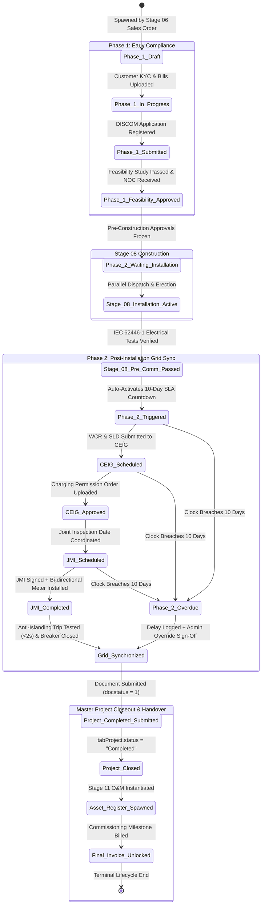
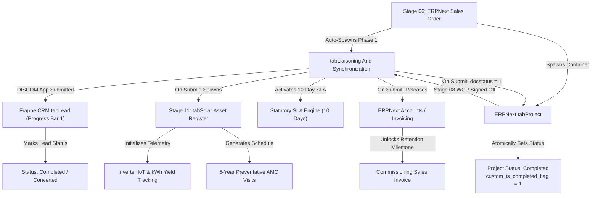

# STEP_10_LIAISONING_GRID_SYNC_SPECIFICATION.caveman.md

# Enterprise Lifecycle Step Specification: Dual-Timing Statutory Liaisoning, Regulatory Inspection, Net Metering & Grid Synchronization

**Document ID:** `STEP-10-LIAISONING-GRID-SYNC`  
**Lifecycle Flow:** Flow 1: Core Solar EPC Project Execution (Stage 10 of 11)  
**Governing Architecture:** [`architect_docs/02_STEP_PLANNING_SPECIFICATION_BLUEPRINT.md`](../architect_docs/02_STEP_PLANNING_SPECIFICATION_BLUEPRINT.md)  
**Architecture Decision Record:** [`docs/decisions/ADR-010-LIAISONING-STATUTORY-INSPECTION-GRID-SYNC.md`](../docs/decisions/ADR-010-LIAISONING-STATUTORY-INSPECTION-GRID-SYNC.md)  
**PRD / FRS Traceability:** [`planning_ref_docs/01_PROJECT_FOUNDATION_MODEL.md`](../planning_ref_docs/01_PROJECT_FOUNDATION_MODEL.md) (`BC-10`, `Sec 3.10`), [`planning_ref_docs/05_BUSINESS_REQUIREMENTS_DOCUMENT.md`](../planning_ref_docs/05_BUSINESS_REQUIREMENTS_DOCUMENT.md) (`BR-010`), [`planning_ref_docs/06_FUNCTIONAL_REQUIREMENTS_SPECIFICATION.md`](../planning_ref_docs/06_FUNCTIONAL_REQUIREMENTS_SPECIFICATION.md) (`FR-010`), [`planning_ref_docs/07_SOFTWARE_REQUIREMENTS_SPECIFICATION.md`](../planning_ref_docs/07_SOFTWARE_REQUIREMENTS_SPECIFICATION.md) (`Sec 2.2`, `Sec 4.3`), [`planning_ref_docs/08_DATABASE_DESIGN_DOCUMENT.md`](../planning_ref_docs/08_DATABASE_DESIGN_DOCUMENT.md) (`Domain 8: CMP`, `tabLiaisoning And Synchronization`), [`planning_ref_docs/09_API_DESIGN_AND_INTEGRATIONS.md`](../planning_ref_docs/09_API_DESIGN_AND_INTEGRATIONS.md) (`API 9`), [`planning_ref_docs/10_UI_UX_SPECIFICATION.md`](../planning_ref_docs/10_UI_UX_SPECIFICATION.md) (`Screen 14`), [`planning_ref_docs/11_MODULE_FUNCTIONAL_DOCUMENTATION.md`](../planning_ref_docs/11_MODULE_FUNCTIONAL_DOCUMENTATION.md) (`MOD-10`), [`step_plans/STEP_06_SALES_ORDER_BASELINE_SPECIFICATION.md`](./STEP_06_SALES_ORDER_BASELINE_SPECIFICATION.md), [`step_plans/STEP_08_INSTALLATION_ZONE_DPR_SPECIFICATION.md`](./STEP_08_INSTALLATION_ZONE_DPR_SPECIFICATION.md), [`step_plans/STEP_09_MATERIAL_RETURN_RECONCILIATION_SPECIFICATION.md`](./STEP_09_MATERIAL_RETURN_RECONCILIATION_SPECIFICATION.md), [`step_plans/STEP_11_LIFECYCLE_OM_TELEMETRY_SPECIFICATION.md`](./STEP_11_LIFECYCLE_OM_TELEMETRY_SPECIFICATION.md), [`step_plans/STEP_PLAN_DUAL_PROGRESS_BAR_LIFECYCLE_SLA_ENGINE.md`](./STEP_PLAN_DUAL_PROGRESS_BAR_LIFECYCLE_SLA_ENGINE.md)  
**Target Module:** `solar_module` (Extend ERPNext `tabProject`, `tabSales Order`, `tabCustomer`, standalone submittable `tabLiaisoning And Synchronization`, child tables `tabSolar Statutory Document Checklist`, `tabSolar Inspection Milestone Log`, `tabSolar Meter Reading Item`, `tabSolar Stage Delay Log`)  
**Author:** Principal Enterprise Architect  
**Status:** Ready for Execution

---

## 1. Step Scope, Objectives & Context Traceability

### 1.1 Lifecycle Positioning & Regulatory Completion Anchor

Stage 10 legal, regulatory, commercial closeout anchor in `solar_module`. Bridge physical engineering (Stage 08 Installation Execution, Stage 09 Material Return) with plant operations (Stage 11 Lifecycle O&M).

Per **Dual Progress Bar Lifecycle Architecture** ([`docs/decisions/ADR-007-DUAL-PROGRESS-BAR-LIFECYCLE-SLA-ENGINE.md`](../docs/decisions/ADR-007-DUAL-PROGRESS-BAR-LIFECYCLE-SLA-ENGINE.md)), Stage 10 split into two temporal phases:

1. **Phase 1: Early Statutory Compliance (Post-Sales Order):** Spawn with Stage 06 (`Sales Order Baseline Lock`). Collect consumer KYC, property docs, sanctioned load check, DISCOM application submission, grid feasibility NOC approval. Confirmed submission acts as **terminal closeout for Progress Bar 1 (`tabLead`)**, moving lead to immutable `Completed / Handed Over`.
2. **Phase 2: Actual Grid Sync & 10-Day Countdown (Post-Installation):** Auto-activate on Stage 08 Pre-Commissioning Electrical Testing sign-off (`IEC 62446-1`). Start **Statutory 10-Day SLA Countdown Timer** for CEIG safety inspection, Joint Meter Inspection (JMI), bi-directional net-meter calibration/install, anti-islanding test, grid energization, Commercial Operation Date (COD) certification.

```
┌──────────────────────────────────────────────────────────────────────────────────────────────────┐
│                                STAGE 10 DUAL-TIMING ARCHITECTURE                                 │
└──────────────────────────────────────────────────────────────────────────────────────────────────┘

 [Stage 06: Sales Order Baseline Frozen]
        │
        ▼
 ┌─────────────────────────────────────────────────────────────────────────────────────────────────┐
 │ PHASE 1: EARLY STATUTORY DOSSIER (Post-SO Compliance)                                           │
 │ • Auto-spawned by LiaisoningInceptionService upon Sales Order submission                        │
 │ • Collects Consumer KYC, Latest Electricity Bill, Property Tax, Sanctioned Load Check          │
 │ • Submits DISCOM Application & Registers on PM Surya Ghar National Portal                       │
 │ • Obtains Technical Feasibility Approval (TFR) & Grid Connectivity NOC                          │
 │ • TERMINAL TRIGGER: DISCOM Application Acknowledgment sets Lead Progress Bar 1 to "Completed"   │
 └─────────────────────────────────────────────────────────────────────────────────────────────────┘
        │
        │ ──▶ [Parallel Execution: Stage 07 Dispatch ──▶ Stage 08 Install ──▶ Stage 09 Return]
        │
        ▼
 [Stage 08: Pre-Commissioning Electrical Testing (IEC 62446-1) Verified]
        │
        ▼
 ┌─────────────────────────────────────────────────────────────────────────────────────────────────┐
 │ PHASE 2: STATUTORY GRID SYNC & 10-DAY SLA COUNTDOWN (Post-Installation)                         │
 │ ★ Starts 10-Day Regulatory SLA Clock in tabSolar SLA Settings (Configurable by Admin/Director) ★│
 │ • Work Completion Report (WCR) & Pre-Commissioning Megger/Earth Pit Logs attached               │
 │ • Gate 3: CEIG Safety Inspection & Statutory Charging Permission Order Uploaded                 │
 │ • Gate 4: Joint Meter Inspection (JMI) executed with DISCOM testing engineers                   │
 │ • Bi-directional Net-Meter Installed: Serial Number, CT/PT Ratio, Initial Import/Export kWh     │
 │ • Anti-Islanding Protection Trip Test (< 2.0s) verified & Grid Synchronized                     │
 │ • Gate 5: Commercial Operation Date (COD) Certificate issued                                    │
 └─────────────────────────────────────────────────────────────────────────────────────────────────┘
        │
        ▼
 ┌─────────────────────────────────────────────────────────────────────────────────────────────────┐
 │ MASTER PROJECT COMPLETION & DOWNSTREAM HANDOFF ENGINE (On Submit of Liaisoning Record)          │
 │ • Sets linked tabProject.status = "Completed" & custom_is_completed_flag = 1                    │
 │ • Freezes Project COD Date, Grid Sync Date, and Closes all remaining open tabTask nodes         │
 │ • Programmatically spawns Stage 11: tabSolar Asset Register (with serialized panels/inverters)  │
 │ • Unlocks final commercial retention milestone invoice in ERPNext Accounts                      │
 │ • Broadcasts multi-channel notification to Customer, Sales, Site Engineers, Accounts, and Admin │
 └─────────────────────────────────────────────────────────────────────────────────────────────────┘
```

---

### 1.2 Core Business Objectives & Strategic KPIs

| Strategic Objective              | Metric / KPI Target                        | Operational Mechanism                                                                                  |
| :------------------------------- | :----------------------------------------- | :----------------------------------------------------------------------------------------------------- |
| **Statutory TAT Adherence**      | $\le 10\text{ Business Days}$ post-install | Countdown daemon (`solar_module.tasks.check_liaisoning_sla`) tracking time from Stage 08 WCR to sync.  |
| **Subsidy Claim Protection**     | $100\%$ zero forfeiture                    | Instant upload of JMI report and meter data to PM Surya Ghar portal within 48h of meter install.       |
| **Commercial Milestone Release** | $0\text{ Days}$ billing delay              | Auto-notify Accounts on COD sign-off to bill final 10%–20% retention milestone.                        |
| **Project Completion Truth**     | $100\%$ regulatory alignment               | Project status in ERPNext never manually forced to "Completed"; coupled strictly to COD and net meter. |
| **Asset Register Integrity**     | $100\%$ serialized asset mapping           | Ingestion of dispatched module/inverter serials and net-meter serial into `tabSolar Asset Register`.   |

---

### 1.3 Context Traceability Matrix

| Document Source              | Section / Identifier                                                                                                                                   | Requirement Summary & System Realization                                                        |
| :--------------------------- | :----------------------------------------------------------------------------------------------------------------------------------------------------- | :---------------------------------------------------------------------------------------------- |
| **Architect Blueprint**      | [`architect_docs/02_STEP_PLANNING_SPECIFICATION_BLUEPRINT.md`](../architect_docs/02_STEP_PLANNING_SPECIFICATION_BLUEPRINT.md)                          | Follow Canonical 9-Section Step Planning standard.                                              |
| **Architecture Decision**    | [`docs/decisions/ADR-010-LIAISONING-STATUTORY-INSPECTION-GRID-SYNC.md`](../docs/decisions/ADR-010-LIAISONING-STATUTORY-INSPECTION-GRID-SYNC.md)        | Dual-timing bifurcation, 10-day statutory SLA, verification gates, atomic Project completion.   |
| **Dual Stepper Spec**        | [`step_plans/STEP_PLAN_DUAL_PROGRESS_BAR_LIFECYCLE_SLA_ENGINE.md`](./STEP_PLAN_DUAL_PROGRESS_BAR_LIFECYCLE_SLA_ENGINE.md)                              | Progress Bar 1 terminal closeout at Stage 10A; Progress Bar 2 closeout at Stage 10B.            |
| **Project Foundation Model** | [`planning_ref_docs/01_PROJECT_FOUNDATION_MODEL.md`](../planning_ref_docs/01_PROJECT_FOUNDATION_MODEL.md) (`BC-10`, `Sec 3.10`)                        | Phase 1 post-SO doc filing, Phase 2 post-install 10-day countdown for CEIG, JMI, Net Meter.     |
| **Business Requirements**    | [`planning_ref_docs/05_BUSINESS_REQUIREMENTS_DOCUMENT.md`](../planning_ref_docs/05_BUSINESS_REQUIREMENTS_DOCUMENT.md) (`BR-010`)                       | Net-meter sync legal trigger for closing ERPNext `Project`.                                     |
| **Functional Requirements**  | [`planning_ref_docs/06_FUNCTIONAL_REQUIREMENTS_SPECIFICATION.md`](../planning_ref_docs/06_FUNCTIONAL_REQUIREMENTS_SPECIFICATION.md) (`FR-010`)         | UI controls, field validations, 10-day timer, CEIG/JMI verification, net-meter readings.        |
| **Software Requirements**    | [`planning_ref_docs/07_SOFTWARE_REQUIREMENTS_SPECIFICATION.md`](../planning_ref_docs/07_SOFTWARE_REQUIREMENTS_SPECIFICATION.md) (`Sec 2.2`, `Sec 4.3`) | Dual-timing background daemon, notification broker, atomic completion hooks.                    |
| **Database Design**          | [`planning_ref_docs/08_DATABASE_DESIGN_DOCUMENT.md`](../planning_ref_docs/08_DATABASE_DESIGN_DOCUMENT.md) (`Domain 8: CMP`)                            | Schema for `tabLiaisoning And Synchronization` and compliance child entities.                   |
| **API Architecture**         | [`planning_ref_docs/09_API_DESIGN_AND_INTEGRATIONS.md`](../planning_ref_docs/09_API_DESIGN_AND_INTEGRATIONS.md) (`API 9`)                              | RPC endpoints: `update_phase_1`, `start_actual_countdown`, `complete_project_and_generate_cod`. |
| **UI/UX Specification**      | [`planning_ref_docs/10_UI_UX_SPECIFICATION.md`](../planning_ref_docs/10_UI_UX_SPECIFICATION.md) (`Screen 14`)                                          | Two-tier Kanban board (`/solar/liaisoning`) and radial circular 10-day countdown widget.        |

---

### 1.4 Critical Operational Failures Eliminated

1. **Post-Installation Dormancy & Abandoned Sites:** Eliminate unmonitored post-construction delay by auto-starting 10-day SLA clock when Stage 08 electrical testing passes.
2. **Subsidy Expirations & Financial Forfeiture:** Avoid residential subsidy rejection under PM Surya Ghar by tracking national portal application IDs and JMI uploads with proactive alerts.
3. **Trapped Working Capital & Delayed Final Invoicing:** Eliminate 60–90 day delay in collecting final 10%–20% retention payment through auto-COD and instant finance notification.
4. **Arbitrary / Premature Project Closure:** Lock `tabProject.status = "Completed"` from manual edits; only submittal of `tabLiaisoning And Synchronization` can write it.
5. **Lost Meter & Grid Baseline Data:** Prevent lost meter serial numbers, CT/PT ratios, initial readings by enforcing digital capture before submission.

---

## 2. Stakeholders, Enterprise Actors & HRMS Role Mapping

### 2.1 Persona Matrix & Role Governance

| Persona / Business Actor      | Approved Enterprise Standard     | Frappe System Role                     | HRMS Designation                      | Operational Authority & Primary Responsibility                                                                     |
| :---------------------------- | :------------------------------- | :------------------------------------- | :------------------------------------ | :----------------------------------------------------------------------------------------------------------------- |
| **Statutory Compliance Lead** | `Liaisoning Representative`      | `Liaisoning Representative`            | `Statutory Liaisoning Representative` | Dossier management; utility filings; DISCOM coordination; CEIG and JMI attendance; net-meter docs.                 |
| **Statutory Compliance Head** | `Liaisoning Manager`             | `Liaisoning Manager`                   | `Statutory Liaisoning Manager`        | Supervisory authority; utility dispute escalation; final COD verification; managerial inheritance.                 |
| **Field Commissioning Lead**  | `Field Commissioning Specialist` | `Project Engineer` / `Site Supervisor` | `Commissioning Engineer`              | On-site electrical support; anti-islanding test; initial meter readings; physical grid breaker sync.               |
| **Project Delivery Manager**  | `Project Manager`                | `Project Manager`                      | `Project Manager`                     | Pre-submission check of SLD, Megger/Earth logs, CEIG drawings, datasheets.                                         |
| **Project Supreme Command**   | `Admin`                          | `Admin`                                | `Director - EPC Operations`           | Operational supremacy across workflows; SLA overrides, holiday extensions, delay sign-offs. No code/schema access. |
| **Framework Supreme Dev**     | `System Manager`                 | `System Manager`                       | `Principal Architect / DevOps`        | Apex technical authority over Frappe framework, Bench CLI, background workers, scripts, DocType schemas.           |
| **Executive Leadership**      | `Director`                       | `Director`                             | `Managing Director / COO`             | Strategic macro oversight; executive dashboards; escalation review of statutory disputes.                          |

---

### 2.2 Frappe HRMS Organizational Attribution

- **Department:** `Statutory Compliance & Liaisoning` (Liaisoning Representatives & Managers) and `Engineering & Commissioning` (Field Specialists).
- **Mobile Geolocation Verification:** Field personnel check in via `/solar` mobile interface on inspection site, logging GPS coordinates to `tabEmployee Checkin`.
- **Assignment & Territory Rule:** Dossiers auto-assigned to `Liaisoning Representative` mapped to utility territory in Customer Master.

---

### 2.3 Comprehensive Permission Matrix

| Frappe System Role          | Level | Read | Write | Create | Submit | Cancel | Amend | Export | Permission Query Conditions                            |
| :-------------------------- | :---: | :--: | :---: | :----: | :----: | :----: | :---: | :----: | :----------------------------------------------------- |
| `System Manager`            |   0   | Yes  |  Yes  |  Yes   |  Yes   |  Yes   |  Yes  |  Yes   | Full Framework Access (No row-level restriction)       |
| `Admin`                     |   0   | Yes  |  Yes  |  Yes   |  Yes   |  Yes   |  Yes  |  Yes   | Full Business Access (All territories and projects)    |
| `Director`                  |   0   | Yes  |  No   |   No   |   No   |   No   |  No   |  Yes   | Full Executive Read Access across all records          |
| `Liaisoning Manager`        |   0   | Yes  |  Yes  |  Yes   |  Yes   |   No   |  Yes  |  Yes   | Department-wide access across all utility territories  |
| `Liaisoning Representative` |   0   | Yes  |  Yes  |  Yes   |  Yes   |   No   |  Yes  |  Yes   | Restricted to assigned Utility Territories / Projects  |
| `Project Manager`           |   0   | Yes  |  Yes  |   No   |   No   |   No   |  No   |   No   | Quality & CEIG verification; project-wide oversight    |
| `Project Engineer`          |   0   | Yes  |  Yes  |   No   |   No   |   No   |  No   |   No   | Restricted to assigned Projects (Commissioning fields) |
| `Sales Representative`      |   0   | Yes  |  No   |   No   |   No   |   No   |  No   |   No   | Read-only access to Phase 1 status of own Leads        |

---

## 3. Relational Schema & 3NF Data Dictionary

### 3.1 Architecture Decision Tree & Entity Hierarchy

```
┌──────────────────────────────────────────────────────────────────────────────────────────────────┐
│                             STAGE 10 RELATIONAL ENTITY HIERARCHY                                 │
└──────────────────────────────────────────────────────────────────────────────────────────────────┘

 [ERPNext Core: tabProject] ──(1:1)──▶ [Custom Submittable: tabLiaisoning And Synchronization]
         │                                              │
         ├──────────────────────────────────────────────┼──────────────────────────────────────────┐
         ▼                                              ▼                                          ▼
 [tabSolar Statutory Document Checklist]      [tabSolar Inspection Milestone Log]     [tabSolar Meter Reading Item]
 (KYC, Bills, SLD, CEIG NOC, WCR, JMI)        (Feasibility, CEIG, JMI, COD dates)     (Import/Export kWh, CT/PT)
```

---

### 3.2 Core DocType Extensions

#### 3.2.1 `tabProject` Extensions

| Fieldname                        | Label                           | Fieldtype  | Options / Target                                                                                        | Mandatory |  Index   | Description & Validation Rules                                              |
| :------------------------------- | :------------------------------ | :--------- | :------------------------------------------------------------------------------------------------------ | :-------: | :------: | :-------------------------------------------------------------------------- |
| `custom_liaisoning_reference`    | Statutory Dossier Ref           | `Link`     | `Liaisoning And Synchronization`                                                                        |    No     | Index: 1 | Direct foreign key to Stage 10 compliance record.                           |
| `custom_phase_1_status`          | Phase 1 Statutory Status        | `Select`   | `Pending Filing\nSubmitted to DISCOM\nFeasibility Approved\nNOC Received`                               |    No     |    -     | Mirror pre-construction compliance.                                         |
| `custom_phase_2_status`          | Phase 2 Grid Sync Status        | `Select`   | `Not Started\nTriggered Post-Installation\nCEIG Scheduled\nJMI In Progress\nGrid Synchronized\nOverdue` |    No     | Index: 1 | Mirror post-installation statutory flow.                                    |
| `custom_statutory_deadline`      | Statutory Grid Sync Deadline    | `Datetime` | -                                                                                                       |    No     | Index: 1 | Target deadline by 10-day SLA engine.                                       |
| `custom_statutory_delay_days`    | Statutory Delay (Days)          | `Float`    | -                                                                                                       |    No     |    -     | Delay days beyond 10-day baseline.                                          |
| `custom_grid_sync_date`          | Grid Synchronization Date       | `Date`     | -                                                                                                       |    No     | Index: 1 | Date of grid energization.                                                  |
| `custom_cod_date`                | Commercial Operation Date (COD) | `Date`     | -                                                                                                       |    No     | Index: 1 | Commissioning date triggering warranties & O&M.                             |
| `custom_net_meter_serial_no`     | Net Meter Serial No             | `Data`     | -                                                                                                       |    No     | Index: 1 | Serial number of utility bi-directional meter.                              |
| `custom_is_completed_flag`       | Project Formally Completed      | `Check`    | -                                                                                                       |    Yes    | Index: 1 | Default: 0. Set to 1 on Stage 10 submit.                                    |
| `custom_completion_certified_by` | Completed Certified By          | `Link`     | `User`                                                                                                  |    No     |    -     | `Liaisoning Representative` or `Liaisoning Manager` who submitted sign-off. |
| `custom_completion_certified_on` | Completed Certified On          | `Datetime` | -                                                                                                       |    No     |    -     | Timestamp of terminal completion.                                           |

#### 3.2.2 `tabCustomer` Extensions

| Fieldname                   | Label                         | Fieldtype | Options / Target                                                             | Mandatory |  Index   | Description & Validation Rules                   |
| :-------------------------- | :---------------------------- | :-------- | :--------------------------------------------------------------------------- | :-------: | :------: | :----------------------------------------------- |
| `custom_discom_consumer_no` | Electricity Consumer No (CA)  | `Data`    | -                                                                            |    Yes    | Index: 1 | 10-to-12 digit utility account/consumer number.  |
| `custom_discom_name`        | Electricity Distribution Co   | `Data`    | -                                                                            |    Yes    |    -     | Local utility name (e.g. BESCOM, MSEDCL, TPDDL). |
| `custom_discom_division`    | DISCOM Division               | `Data`    | -                                                                            |    Yes    |    -     | Administrative utility division.                 |
| `custom_discom_subdivision` | DISCOM Sub-Division           | `Data`    | -                                                                            |    Yes    |    -     | Local billing/technical office.                  |
| `custom_sanctioned_load_kw` | Existing Sanctioned Load (kW) | `Float`   | -                                                                            |    Yes    |    -     | Load from recent bill.                           |
| `custom_tariff_category`    | Electricity Tariff Category   | `Select`  | `LT-Residential\nLT-Commercial\nLT-Industrial\nHT-Commercial\nHT-Industrial` |    Yes    |    -     | Regulatory tariff classification.                |

---

### 3.3 Standalone Submittable DocType: `tabLiaisoning And Synchronization`

- **DocType Name:** `Liaisoning And Synchronization`
- **Module:** `solar_module`
- **Submittable:** `is_submittable: 1`
- **Autoname:** `naming_series:LIA-.YYYY.-.#####`

| Fieldname                            | Label                           | Fieldtype  | Options / Target                                                                                                                    | Mandatory | Unique / Index | Description & Validation Rules                        |
| :----------------------------------- | :------------------------------ | :--------- | :---------------------------------------------------------------------------------------------------------------------------------- | :-------: | :------------: | :---------------------------------------------------- |
| `name`                               | Dossier ID                      | `Data`     | -                                                                                                                                   |    Yes    |  PK / Unique   | Series `LIA-.YYYY.-.#####`.                           |
| `project`                            | Project Code                    | `Link`     | `Project`                                                                                                                           |    Yes    |    Index: 1    | Parent EPC project container.                         |
| `sales_order`                        | Sales Order                     | `Link`     | `Sales Order`                                                                                                                       |    Yes    |    Index: 1    | Upstream contract reference.                          |
| `customer`                           | Customer                        | `Link`     | `Customer`                                                                                                                          |    Yes    |    Index: 1    | Asset owner / electricity consumer.                   |
| `custom_lead_reference`              | Original Lead Ref               | `Link`     | `Lead`                                                                                                                              |    No     |    Index: 1    | Lead trace for Progress Bar 1 closeout.               |
| `consumer_number`                    | Consumer No (CA / Account)      | `Data`     | -                                                                                                                                   |    Yes    |    Index: 1    | DISCOM account ID.                                    |
| `discom_name`                        | Electricity Distribution Co     | `Data`     | -                                                                                                                                   |    Yes    |       -        | Utility provider.                                     |
| `sanctioned_load_kw`                 | Sanctioned Load (kW)            | `Float`    | -                                                                                                                                   |    Yes    |       -        | Load from recent bill.                                |
| `proposed_solar_kw`                  | Proposed Solar Capacity (kW)    | `Float`    | -                                                                                                                                   |    Yes    |       -        | Capacity from engineering design.                     |
| `phase_1_status`                     | Phase 1 Status                  | `Select`   | `Draft\nIn Progress\nSubmitted to DISCOM\nFeasibility Approved`                                                                     |    Yes    |    Index: 1    | Pre-construction utility stage.                       |
| `discom_application_no`              | DISCOM Application No           | `Data`     | -                                                                                                                                   |    No     |    Index: 1    | Online registration number.                           |
| `discom_application_date`            | Application Filing Date         | `Date`     | -                                                                                                                                   |    No     |       -        | Date application registered on portal.                |
| `discom_acknowledgement_receipt`     | DISCOM Acknowledgment PDF       | `Attach`   | -                                                                                                                                   |    No     |       -        | Official submission receipt.                          |
| `national_portal_app_id`             | National Portal ID              | `Data`     | -                                                                                                                                   |    No     |    Index: 1    | PM Surya Ghar / MNRE registration ID.                 |
| `feasibility_status`                 | Feasibility Approval            | `Select`   | `Pending\nApproved\nRejected\nLoad Enhancement Required`                                                                            |    Yes    |       -        | Feasibility study result.                             |
| `feasibility_approval_date`          | Feasibility Approved On         | `Date`     | -                                                                                                                                   |    No     |       -        | Date grid connectivity granted.                       |
| `grid_connectivity_noc`              | Grid Connectivity NOC           | `Attach`   | -                                                                                                                                   |    No     |       -        | NOC letter from utility EE.                           |
| `phase_2_status`                     | Phase 2 Status                  | `Select`   | `Not Started\nTriggered Post-Installation\nCEIG Scheduled\nCEIG Approved\nJMI Scheduled\nGrid Synchronized\nOverdue (SLA Breached)` |    Yes    |    Index: 1    | Post-installation grid sync stage.                    |
| `installation_completed_date`        | Installation Completed On       | `Date`     | -                                                                                                                                   |    No     |       -        | Date Stage 08 electrical testing passed.              |
| `statutory_countdown_days`           | Statutory SLA (Days)            | `Int`      | -                                                                                                                                   |    Yes    |       -        | Default: 10 days.                                     |
| `statutory_deadline`                 | Statutory Deadline              | `Datetime` | -                                                                                                                                   |    No     |    Index: 1    | Timestamp when 10-day window expires.                 |
| `is_sla_overdue`                     | Is SLA Overdue                  | `Check`    | -                                                                                                                                   |    Yes    |    Index: 1    | Flagged 1 if deadline breached.                       |
| `ceig_applicable`                    | CEIG Inspection Required        | `Check`    | -                                                                                                                                   |    Yes    |       -        | Set based on capacity threshold.                      |
| `ceig_approval_doc`                  | CEIG Safety Approval Order      | `Attach`   | -                                                                                                                                   |    No     |       -        | Official charging permission cert.                    |
| `jmi_actual_date`                    | JMI Inspection Date             | `Date`     | -                                                                                                                                   |    No     |    Index: 1    | Date joint inspection conducted.                      |
| `jmi_report_doc`                     | Signed JMI Protocol Report      | `Attach`   | -                                                                                                                                   |    No     |       -        | Multi-party signed inspection report.                 |
| `net_meter_serial_no`                | Bi-Directional Meter Serial     | `Data`     | -                                                                                                                                   |    No     |    Index: 1    | Barcode/Serial of net-meter.                          |
| `net_meter_make`                     | Meter Manufacturer              | `Data`     | -                                                                                                                                   |    No     |       -        | e.g. Secure, L&T, Genus, Schneider.                   |
| `meter_accuracy_class`               | Accuracy Class                  | `Select`   | `0.2s\n0.5s\n1.0`                                                                                                                   |    No     |       -        | Meter precision rating.                               |
| `initial_import_kwh`                 | Initial Import Reading (kWh)    | `Float`    | -                                                                                                                                   |    No     |       -        | Baseline utility grid energy draw reading.            |
| `initial_export_kwh`                 | Initial Export Reading (kWh)    | `Float`    | -                                                                                                                                   |    No     |       -        | Baseline solar export energy reading.                 |
| `grid_synchronization_date`          | Grid Synchronization Date       | `Date`     | -                                                                                                                                   |    No     |    Index: 1    | Date breaker was energized.                           |
| `anti_islanding_trip_time_sec`       | Anti-Islanding Trip Time (s)    | `Float`    | -                                                                                                                                   |    No     |       -        | Inverter safety disconnect time ($\le 2.0\text{ s}$). |
| `grid_energization_cert`             | Grid Energization Certificate   | `Attach`   | -                                                                                                                                   |    No     |       -        | Commissioning report from utility.                    |
| `cod_certificate`                    | Commercial Operation Date (COD) | `Attach`   | -                                                                                                                                   |    No     |       -        | Solar plant COD certificate.                          |
| `cod_date`                           | COD Date                        | `Date`     | -                                                                                                                                   |    No     |    Index: 1    | Commissioning baseline date.                          |
| `custom_triggers_project_completion` | Triggers Project Completion     | `Check`    | -                                                                                                                                   |    Yes    |       -        | Immutable 1. Force Project Completed.                 |

---

### 3.4 Relational Child Tables

#### 3.4.1 `tabSolar Statutory Document Checklist`

| Fieldname             | Label            | Fieldtype    | Options / Target                            | Mandatory | Description & Rules                                                                                                                            |
| :-------------------- | :--------------- | :----------- | :------------------------------------------ | :-------: | :--------------------------------------------------------------------------------------------------------------------------------------------- |
| `document_code`       | Document Code    | `Data`       | -                                           |    Yes    | `KYC_AADHAAR`, `ELEC_BILL`, `TAX_RECEIPT`, `SITE_SLD`, `CEIG_CHG_PERM`, `WCR_REPORT`, `METER_TEST_CERT`, `JMI_SIGNED_REPORT`, `PPA_AGREEMENT`. |
| `document_name`       | Document Title   | `Data`       | -                                           |    Yes    | Title.                                                                                                                                         |
| `phase`               | Compliance Phase | `Select`     | `Phase 1 (Post-SO)\nPhase 2 (Post-Install)` |    Yes    | Phase grouping.                                                                                                                                |
| `is_mandatory`        | Mandatory        | `Check`      | -                                           |    Yes    | If 1, gate requires file.                                                                                                                      |
| `file_attachment`     | Attachment       | `Attach`     | -                                           |    No     | File link.                                                                                                                                     |
| `verification_status` | Status           | `Select`     | `Pending\nUploaded\nVerified\nRejected`     |    Yes    | Default: `Pending`.                                                                                                                            |
| `verified_by`         | Verified By      | `Link`       | `User`                                      |    No     | Validator.                                                                                                                                     |
| `verified_on`         | Verified On      | `Datetime`   | -                                           |    No     | Timestamp.                                                                                                                                     |
| `rejection_reason`    | Rejection Reason | `Small Text` | -                                           |    No     | Required if Rejected.                                                                                                                          |

#### 3.4.2 `tabSolar Inspection Milestone Log`

| Fieldname            | Label                   | Fieldtype | Options / Target                                                                                                                                      | Mandatory | Description & Rules                             |
| :------------------- | :---------------------- | :-------- | :---------------------------------------------------------------------------------------------------------------------------------------------------- | :-------: | :---------------------------------------------- |
| `milestone_type`     | Milestone Type          | `Select`  | `DISCOM Feasibility Study\nCEIG Safety Audit\nJoint Meter Inspection (JMI)\nNet Meter Testing\nGrid Energization\nNational Portal Subsidy Inspection` |    Yes    | Inspection milestone type.                      |
| `scheduled_date`     | Scheduled Date          | `Date`    | -                                                                                                                                                     |    Yes    | Scheduled date.                                 |
| `actual_date`        | Actual Date             | `Date`    | -                                                                                                                                                     |    No     | Physical date.                                  |
| `inspecting_agency`  | Agency / Department     | `Data`    | -                                                                                                                                                     |    Yes    | e.g. `State CEIG Office`, `DISCOM Testing Div`. |
| `inspecting_officer` | Officer Name            | `Data`    | -                                                                                                                                                     |    No     | Inspecting officer name.                        |
| `officer_contact`    | Officer Contact / Email | `Data`    | -                                                                                                                                                     |    No     | Contact details.                                |
| `inspection_result`  | Result                  | `Select`  | `Pending\nPassed (No Defects)\nConditional Pass (Punch List)\nFailed / Re-Inspection Required`                                                        |    Yes    | Outcome.                                        |
| `report_attachment`  | Inspection Report       | `Attach`  | -                                                                                                                                                     |    No     | Memorandum attachment.                          |

#### 3.4.3 `tabSolar Meter Reading Item`

| Fieldname                | Label                         | Fieldtype  | Options / Target                                                                      | Mandatory | Description & Rules                     |
| :----------------------- | :---------------------------- | :--------- | :------------------------------------------------------------------------------------ | :-------: | :-------------------------------------- |
| `reading_type`           | Reading Type                  | `Select`   | `Initial Baseline at Commissioning\nPost-Sync Verification\nSubsequent Billing Audit` |    Yes    | Reading category.                       |
| `meter_serial_no`        | Meter Serial No               | `Data`     | -                                                                                     |    Yes    | Physical meter serial.                  |
| `reading_datetime`       | Reading Timestamp             | `Datetime` | -                                                                                     |    Yes    | Timestamp.                              |
| `kwh_import`             | Active Energy Import (kWh)    | `Float`    | -                                                                                     |    Yes    | Cumulative grid import.                 |
| `kwh_export`             | Active Energy Export (kWh)    | `Float`    | -                                                                                     |    Yes    | Cumulative solar export.                |
| `kvah_import`            | Apparent Energy Import (kVAh) | `Float`    | -                                                                                     |    No     | Grid apparent energy.                   |
| `kvah_export`            | Apparent Energy Export (kVAh) | `Float`    | -                                                                                     |    No     | Solar apparent energy.                  |
| `peak_demand_kw`         | Recorded Peak Demand (kW)     | `Float`    | -                                                                                     |    No     | Max demand indicator.                   |
| `average_power_factor`   | Power Factor ($\cos \phi$)    | `Float`    | -                                                                                     |    No     | Calculated: $\text{kWh} / \text{kVAh}$. |
| `discom_witness_officer` | Witnessing DISCOM Officer     | `Data`     | -                                                                                     |    Yes    | Co-signing officer.                     |

---

## 4. State Machine, Verification Gates & SLA Engine

### 4.1 Dual-Timing State Machine Diagram



---

### 4.2 Detailed State Definitions & Transitions

| Lifecycle State                        | Active Phase |   SLA Engine State    | Entry Pre-requisite                            | Exit Trigger & Next State                                                                                    |
| :------------------------------------- | :----------: | :-------------------: | :--------------------------------------------- | :----------------------------------------------------------------------------------------------------------- |
| `Phase 1: Draft`                       |   Phase 1    |       Inactive        | `Sales Order` submitted in Stage 06.           | Upload customer KYC and bill $\rightarrow$ `Phase 1: In Progress`.                                           |
| `Phase 1: In Progress`                 |   Phase 1    |       Inactive        | KYC, tax receipt, bill uploaded.               | Register application on DISCOM portal $\rightarrow$ `Phase 1: Submitted to DISCOM`.                          |
| `Phase 1: Submitted to DISCOM`         |   Phase 1    |       Inactive        | Application number & receipt attached.         | **Set Lead Progress Bar 1 to Completed**. Feasibility cleared $\rightarrow$ `Phase 1: Feasibility Approved`. |
| `Phase 1: Feasibility Approved`        |   Phase 1    |       Inactive        | Grid feasibility NOC signed.                   | Installation completed in Stage 08 $\rightarrow$ `Phase 2: Triggered Post-Installation`.                     |
| `Phase 2: Triggered Post-Installation` |   Phase 2    | **Active (10 Days)**  | Stage 08 Megger/Voc test verified.             | Submit file to CEIG $\rightarrow$ `Phase 2: CEIG Scheduled`.                                                 |
| `Phase 2: CEIG Scheduled`              |   Phase 2    |        Active         | CEIG application registered & fees paid.       | CEIG passed & charging order uploaded $\rightarrow$ `Phase 2: CEIG Approved`.                                |
| `Phase 2: CEIG Approved`               |   Phase 2    |        Active         | Charging permission issued (or exempt).        | Coordinate date with DISCOM engineers $\rightarrow$ `Phase 2: JMI Scheduled`.                                |
| `Phase 2: JMI Scheduled`               |   Phase 2    |        Active         | DISCOM inspection visit confirmed.             | Inspection conducted, meter installed $\rightarrow$ `Phase 2: JMI Completed`.                                |
| `Phase 2: JMI Completed`               |   Phase 2    |        Active         | Signed JMI protocol & initial readings logged. | Anti-islanding test verified $\rightarrow$ `Phase 2: Grid Synchronized`.                                     |
| `Phase 2: Grid Synchronized`           |   Phase 2    | **Stopped (Success)** | Energization cert & COD cert uploaded.         | Submit document (`docstatus = 1`) $\rightarrow$ `Project Completed`.                                         |
| `Phase 2: Overdue (SLA Breached)`      |   Phase 2    |     **Breached**      | Duration exceeds 10 business days.             | Mandatory `Solar Stage Delay Log` submitted and approved $\rightarrow$ Resumes flow.                         |

---

### 4.3 Five Strict Regulatory Verification Gates

1. **Gate 1: Phase 1 DISCOM Feasibility Gate:**
   - Validate customer KYC, latest electricity bill ($< 60\text{ days}$ old), property tax receipt, and Single Line Diagram (SLD).
   - Assert proposed solar capacity does not exceed distribution transformer (DT) or sanctioned load limits.
   - Validate official DISCOM application number and attachment of registration receipt.
2. **Gate 2: Phase 2 Post-Installation Activation Gate:**
   - Assert linked `tabProject` reached 100% physical WBS task completion in Stage 08.
   - Assert `IEC 62446-1` test verified with Megger insulation resistance $\ge 1.0\text{ M}\Omega$, string voltages within $\pm 5\%$, earth pits $\le 5.0\ \Omega$ (structure) and $\le 1.0\ \Omega$ (inverters).
3. **Gate 3: CEIG Electrical Safety Clearance Gate:**
   - If capacity $\ge$ state CEIG threshold ($> 10\text{ kWp}$ or $> 50\text{ kWp}$), assert:
     1. Government treasury fee receipt attached.
     2. CEIG Charging Permission order attached with reference number and date.
   - If capacity below threshold, assert `statutory_exemption_affidavit` checked.
4. **Gate 4: Joint Meter Inspection (JMI) & Bi-Directional Meter Gate:**
   - Assert attachment of JMI Protocol Report signed jointly by DISCOM AEE/Testing Engineer, EPC Liaisoning Representative / Manager, and Consumer.
   - Enforce net-meter serial number, make, accuracy class, CT/PT ratios, and testing seal report.
   - Mandate initial readings: Active Import ($kWh$), Active Export ($kWh$), power factor.
5. **Gate 5: Grid Synchronization, COD & Project Completion Anchor Gate:**
   - Assert anti-islanding trip test verified: must trip in $\le 2.0\text{ seconds}$ upon loss of grid power.
   - Validate Grid Energization Certificate and COD Certificate signed by utility.
   - Submitting document permanently freezes record (`docstatus = 1`), transitions `tabProject.status = "Completed"`, logs COD date, instantiates Stage 11 `tabSolar Asset Register`.

---

### 4.4 Statutory 10-Day SLA Countdown Engine & Business Days Math

$$\text{Statutory Deadline} = \text{Installation Completion Date} + \sum_{i=1}^{10} \text{BusinessDay}(i)$$

- Evaluate business days (Monday–Saturday), exclude designated public holidays in Frappe `Holiday List`.
- Daemon `solar_module.tasks.check_liaisoning_sla` runs hourly:
  - $\text{Remaining Hours} = \text{statutory\_deadline} - \text{now\_datetime()}$.
  - When $\le 48\text{ hours}$, set visual `Warning Amber` and send alerts.
  - When $\le 0\text{ hours}$, set `phase_2_status = "Overdue (SLA Breached)"`, set `is_sla_overdue = 1`, dispatch escalation to `Admin` and `Director`.

---

### 4.5 Delay Logging, Category Codes & Admin Waiver Protocol

| Delay Category Code     | Delay Description                                | Required Evidence / Attachment                         | Approving Authority  |
| :---------------------- | :----------------------------------------------- | :----------------------------------------------------- | :------------------- |
| `DISCOM_METER_SHORTAGE` | Utility testing lab has zero meters in stock.    | Letter or email from DISCOM store/subdivision.         | `Admin` / `Director` |
| `CEIG_SCHEDULING_DELAY` | Chief Electrical Inspector unavailable.          | Application receipt showing elapsed scheduling window. | `Admin`              |
| `GRID_OUTAGE_SHUTDOWN`  | Utility feeder breakdown / line shutdown.        | DISCOM shutdown notice or substation log extract.      | `Admin`              |
| `CONSUMER_UNAVAILABLE`  | Customer premises locked / traveling during JMI. | Email or WhatsApp confirmation from customer.          | `Admin`              |
| `TARIFF_ORDER_PENDING`  | State SERC tariff order / portal migration.      | State regulatory circular or portal screenshot.        | `Director`           |

---

## 5. Controller Logic, Domain Services & Whitelisted APIs

### 5.1 Decoupled Domain Architecture Overview

```
solar_module/
├── doctype/
│   └── liaisoning_and_synchronization/
│       ├── liaisoning_and_synchronization.py      # Thin Submittable DocType Controller
│       ├── liaisoning_and_synchronization.js      # Desk Client-Side Dynamic Script
│       └── liaisoning_and_synchronization.json    # DocType Schema Definition
├── services/
│   ├── liaisoning_inception_service.py           # Instantiates Phase 1 dossier from Stage 06 SO
│   ├── liaisoning_phase_1_service.py              # Phase 1 KYC, DISCOM filing & Lead closeout
│   ├── liaisoning_phase_2_service.py              # Phase 2 CEIG, JMI, Net Metering & Anti-Islanding
│   ├── liaisoning_sla_service.py                  # 10-day statutory SLA countdown & holiday math
│   └── project_completion_service.py              # Atomic Project completion, COD & O&M spawning
├── tasks/
│   └── liaisoning_sla_daemon.py                   # Celery/RQ hourly background SLA monitor
└── api/
    └── liaisoning.py                              # Whitelisted, authenticated POST RPC endpoints
```

---

### 5.2 Thin Submittable DocType Controller

```python
# solar_module/doctype/liaisoning_and_synchronization/liaisoning_and_synchronization.py

import frappe
from frappe import _
from frappe.model.document import Document
from solar_module.services.liaisoning_sla_service import LiaisoningSLAService
from solar_module.services.liaisoning_phase_1_service import LiaisoningPhase1Service
from solar_module.services.liaisoning_phase_2_service import LiaisoningPhase2Service
from solar_module.services.project_completion_service import ProjectCompletionService


class LiaisoningAndSynchronization(Document):
    """Authoritative submittable controller governing Stage 10 Statutory Liaisoning & Grid Sync."""

    def validate(self):
        """Defensive validation executed on every document save."""
        self.validate_consumer_baseline()
        self.validate_phase_1_rules()
        self.validate_phase_2_rules()
        self.evaluate_sla_status()

    def validate_consumer_baseline(self):
        """Enforces relational links and mandatory utility baseline parameters."""
        if not self.project:
            frappe.throw(_("Linked Project reference is mandatory."), frappe.ValidationError)
        if not self.sales_order:
            frappe.throw(_("Linked Sales Order reference is mandatory."), frappe.ValidationError)
        if not self.customer:
            frappe.throw(_("Customer link is mandatory."), frappe.ValidationError)
        if not self.consumer_number:
            frappe.throw(_("DISCOM Consumer Number is mandatory for statutory filings."), frappe.ValidationError)

    def validate_phase_1_rules(self):
        """Validates Phase 1 statutory submission invariants."""
        if self.phase_1_status == "Submitted to DISCOM":
            LiaisoningPhase1Service.validate_submission_gate(self)
        elif self.phase_1_status == "Feasibility Approved":
            LiaisoningPhase1Service.validate_feasibility_gate(self)

    def validate_phase_2_rules(self):
        """Validates Phase 2 statutory grid sync invariants."""
        if self.phase_2_status in ["CEIG Approved", "JMI Scheduled", "Grid Synchronized"]:
            LiaisoningPhase2Service.validate_ceig_gate(self)
        if self.phase_2_status in ["Grid Synchronized"]:
            LiaisoningPhase2Service.validate_jmi_and_metering_gate(self)
            LiaisoningPhase2Service.validate_grid_sync_gate(self)

    def evaluate_sla_status(self):
        """Recalculates real-time SLA countdown and overdue state."""
        LiaisoningSLAService.sync_document_sla(self)

    def on_submit(self):
        """Immutable submission hook triggering atomic Project completion and O&M handoff."""
        LiaisoningPhase2Service.assert_ready_for_submission(self)
        ProjectCompletionService.execute_project_closeout(self)

        frappe.msgprint(
            _("Stage 10 Statutory Liaisoning & Grid Synchronization formally approved! "
              "Project {0} marked Completed. Stage 11 Solar Asset Register spawned.")
            .format(self.project),
            alert=True,
            indicator="green"
        )

    def on_cancel(self):
        """Guards against unauthorized cancellation of legally submitted statutory dossiers."""
        if not frappe.has_permission(self.doctype, "cancel"):
            frappe.throw(_("Only System Manager or Director can cancel a submitted Statutory Dossier."), frappe.PermissionError)
        ProjectCompletionService.revert_project_completion(self)
```

---

### 5.3 Domain Service: `LiaisoningSLAService`

```python
# solar_module/services/liaisoning_sla_service.py

import frappe
from frappe.utils import now_datetime, getdate, add_to_date, time_diff_in_hours


class LiaisoningSLAService:
    """Domain service managing the statutory 10-day SLA countdown and holiday calendar."""

    @staticmethod
    def calculate_statutory_deadline(start_date, sla_days: int = 10, holiday_list: str = None) -> str:
        """Calculates deadline date excluding official holidays and Sundays."""
        if not holiday_list:
            default_company = frappe.defaults.get_user_default("Company")
            holiday_list = frappe.db.get_value("Company", default_company, "default_holiday_list")

        holidays = set()
        if holiday_list:
            holidays = {
                getdate(h.holiday_date)
                for h in frappe.get_all("Holiday", filters={"parent": holiday_list}, fields=["holiday_date"])
            }

        current_date = getdate(start_date)
        added_days = 0

        while added_days < sla_days:
            current_date = getdate(add_to_date(current_date, days=1))
            if current_date.weekday() == 6 or current_date in holidays:
                continue
            added_days += 1

        return f"{current_date} 18:00:00"

    @classmethod
    def sync_document_sla(cls, doc):
        """Evaluates SLA countdown, elapsed days, and overdue status."""
        if doc.phase_2_status in ["Not Started", "Grid Synchronized"]:
            return

        if not doc.statutory_deadline and doc.installation_completed_date:
            doc.statutory_deadline = cls.calculate_statutory_deadline(
                doc.installation_completed_date,
                doc.statutory_countdown_days or 10
            )

        if doc.statutory_deadline:
            now = now_datetime()
            deadline = frappe.utils.get_datetime(doc.statutory_deadline)
            diff_hours = time_diff_in_hours(deadline, now)

            if diff_hours < 0:
                doc.is_sla_overdue = 1
                if doc.phase_2_status not in ["Grid Synchronized", "Overdue (SLA Breached)"]:
                    doc.phase_2_status = "Overdue (SLA Breached)"
            else:
                doc.is_sla_overdue = 0
```

---

### 5.4 Domain Service: `LiaisoningPhase1Service`

```python
# solar_module/services/liaisoning_phase_1_service.py

import frappe
from frappe import _


class LiaisoningPhase1Service:
    """Domain service managing Phase 1 pre-construction statutory filings and Lead sync."""

    @staticmethod
    def validate_submission_gate(doc):
        """Enforces upload of application acknowledgment prior to setting Submitted."""
        if not doc.discom_application_no:
            frappe.throw(_("DISCOM Online Application Number is mandatory."), frappe.ValidationError)
        if not doc.discom_acknowledgement_receipt:
            frappe.throw(_("DISCOM Application Acknowledgment Receipt PDF must be attached."), frappe.ValidationError)

    @staticmethod
    def validate_feasibility_gate(doc):
        """Enforces technical feasibility approval parameters and grid NOC."""
        if not doc.grid_connectivity_noc:
            frappe.throw(_("Official Grid Connectivity NOC document must be uploaded."), frappe.ValidationError)
        if not doc.feasibility_approval_date:
            frappe.throw(_("Feasibility Approval Date must be recorded."), frappe.ValidationError)

    @staticmethod
    def record_discom_submission(doc_name: str, app_no: str, receipt_url: str, national_portal_id: str = None) -> dict:
        """Records DISCOM submission and atomically completes Lead Progress Bar 1."""
        doc = frappe.get_doc("Liaisoning And Synchronization", doc_name)
        doc.check_permission("write")

        doc.discom_application_no = app_no
        doc.discom_application_date = frappe.utils.today()
        doc.discom_acknowledgement_receipt = receipt_url
        if national_portal_id:
            doc.national_portal_app_id = national_portal_id

        doc.phase_1_status = "Submitted to DISCOM"
        doc.save()

        if doc.custom_lead_reference:
            lead = frappe.get_doc("Lead", doc.custom_lead_reference)
            lead.db_set("custom_lead_progress_status", "Completed")
            lead.db_set("custom_current_stage_code", "S10A_LIAISON_SUBMITTED")
            lead.add_comment(
                "Comment",
                text=_("Phase 1 Statutory DISCOM Application submitted (App No: {0}). Lead Progress Bar completed.")
                .format(app_no)
            )

        frappe.db.set_value("Project", doc.project, {
            "custom_phase_1_status": "Submitted to DISCOM"
        })

        return {"status": "success", "phase_1_status": doc.phase_1_status}
```

---

### 5.5 Domain Service: `LiaisoningPhase2Service`

```python
# solar_module/services/liaisoning_phase_2_service.py

import frappe
from frappe import _


class LiaisoningPhase2Service:
    """Domain service managing Phase 2 statutory CEIG, JMI, Net Metering and Anti-Islanding."""

    @staticmethod
    def validate_ceig_gate(doc):
        """Enforces CEIG Safety Clearance verification."""
        if doc.ceig_applicable:
            if not doc.ceig_approval_doc:
                frappe.throw(_("CEIG Official Charging Permission order must be uploaded."), frappe.ValidationError)
            if not doc.ceig_charging_permission_no:
                frappe.throw(_("CEIG Charging Permission Number is mandatory."), frappe.ValidationError)

    @staticmethod
    def validate_jmi_and_metering_gate(doc):
        """Enforces Joint Meter Inspection and bi-directional meter parameters."""
        if not doc.jmi_report_doc:
            frappe.throw(_("Signed Joint Meter Inspection (JMI) Protocol Report is mandatory."), frappe.ValidationError)
        if not doc.net_meter_serial_no:
            frappe.throw(_("Bi-directional Net-Meter Serial Number is mandatory."), frappe.ValidationError)
        if doc.initial_import_kwh is None or doc.initial_export_kwh is None:
            frappe.throw(_("Initial Active Energy Import and Export readings (kWh) are mandatory."), frappe.ValidationError)

    @staticmethod
    def validate_grid_sync_gate(doc):
        """Enforces anti-islanding safety disconnect and plant energization certificates."""
        if not doc.grid_synchronization_date:
            frappe.throw(_("Grid Synchronization Date is mandatory."), frappe.ValidationError)
        if doc.anti_islanding_trip_time_sec is None:
            frappe.throw(_("Inverter Anti-Islanding Trip Time must be recorded."), frappe.ValidationError)
        if doc.anti_islanding_trip_time_sec > 2.0:
            frappe.throw(
                _("Safety Violation: Inverter Anti-Islanding Trip Time ({0}s) exceeds statutory 2.0s limit.")
                .format(doc.anti_islanding_trip_time_sec),
                frappe.ValidationError
            )
        if not doc.cod_certificate:
            frappe.throw(_("Official Commercial Operation Date (COD) Certificate must be attached."), frappe.ValidationError)

    @staticmethod
    def assert_ready_for_submission(doc):
        """Asserts that all regulatory preconditions are satisfied before legal freeze."""
        if doc.phase_2_status != "Grid Synchronized":
            frappe.throw(
                _("Dossier cannot be submitted until Phase 2 status is 'Grid Synchronized'."),
                frappe.ValidationError
            )
        if not doc.cod_date:
            frappe.throw(_("Commercial Operation Date (COD) must be established before submission."), frappe.ValidationError)
```

---

### 5.6 Domain Service: `ProjectCompletionService`

```python
# solar_module/services/project_completion_service.py

import frappe
from frappe import _
from frappe.utils import now_datetime, today


class ProjectCompletionService:
    """Atomic service orchestrating Project terminal completion and Stage 11 O&M spawning."""

    @classmethod
    def execute_project_closeout(cls, liaison_doc):
        """Atomically closes the Project, closes open WBS tasks, and spawns the Asset Register."""
        project = frappe.get_doc("Project", liaison_doc.project)

        project.db_set("status", "Completed")
        project.db_set("custom_is_completed_flag", 1)
        project.db_set("custom_current_stage_code", "S10B_GRID_SYNC_COMPLETED")
        project.db_set("custom_stage_state", "COMPLETED_ON_TIME" if not liaison_doc.is_sla_overdue else "COMPLETED_DELAYED")
        project.db_set("custom_completion_certified_by", frappe.session.user)
        project.db_set("custom_completion_certified_on", now_datetime())
        project.db_set("custom_grid_sync_date", liaison_doc.grid_synchronization_date)
        project.db_set("custom_cod_date", liaison_doc.cod_date or liaison_doc.grid_synchronization_date)
        project.db_set("custom_net_meter_serial_no", liaison_doc.net_meter_serial_no)

        open_tasks = frappe.get_all(
            "Task",
            filters={"project": project.name, "status": ["not in", ["Completed", "Cancelled"]]},
            fields=["name"]
        )
        for t in open_tasks:
            frappe.db.set_value("Task", t.name, {
                "status": "Completed",
                "progress": 100,
                "completed_on": today()
            })

        cls.spawn_solar_asset_register(project, liaison_doc)
        cls.notify_accounts_of_commissioning(project, liaison_doc)
        cls.broadcast_completion_notifications(project, liaison_doc)

    @classmethod
    def spawn_solar_asset_register(cls, project, liaison_doc):
        """Creates the lifetime Solar Asset Register populated with serialized equipment."""
        if frappe.db.exists("Solar Asset Register", {"project": project.name}):
            return

        asset_doc = frappe.get_doc({
            "doctype": "Solar Asset Register",
            "project": project.name,
            "sales_order": liaison_doc.sales_order,
            "customer": liaison_doc.customer,
            "asset_capacity_kw": liaison_doc.proposed_solar_kw,
            "cod_date": liaison_doc.cod_date or liaison_doc.grid_synchronization_date,
            "net_meter_serial_no": liaison_doc.net_meter_serial_no,
            "discom_consumer_no": liaison_doc.consumer_number,
            "warranty_expiry_date": frappe.utils.add_to_date(liaison_doc.cod_date, years=5),
            "status": "Commissioned & Active",
            "amc_contract_status": "Under Initial Warranty AMC"
        })
        asset_doc.insert(ignore_permissions=True)

    @classmethod
    def notify_accounts_of_commissioning(cls, project, liaison_doc):
        """Creates an urgent notification to Accounts for final milestone invoicing."""
        accounts_users = frappe.get_all("Has Role", filters={"role": "Accounts Assistant"}, fields=["parent"])
        for u in accounts_users:
            frappe.get_doc({
                "doctype": "Notification Log",
                "subject": _("Commissioning Milestone Unlocked: Project {0} Grid Synchronized").format(project.name),
                "for_user": u.parent,
                "type": "Alert",
                "document_type": "Project",
                "document_name": project.name
            }).insert(ignore_permissions=True)

    @classmethod
    def broadcast_completion_notifications(cls, project, liaison_doc):
        """Broadcasts omnichannel completion alerts to stakeholders."""
        recipients = [project.owner, liaison_doc.owner]
        for r in set(recipients):
            if r:
                frappe.sendmail(
                    recipients=[r],
                    subject=_("🎉 Solar Plant Formally Commissioned: {0}").format(project.project_name),
                    message=_("<p>Dear Colleague,</p><p>We are proud to announce that <b>Project {0} ({1} kWp)</b> "
                              "has successfully achieved statutory grid synchronization and Commercial Operation Date (COD) on {2}. "
                              "The project is now formally <b>Completed</b> and handed over to Lifecycle O&M.</p>")
                    .format(project.name, liaison_doc.proposed_solar_kw, liaison_doc.cod_date)
                )

    @classmethod
    def revert_project_completion(cls, liaison_doc):
        """Reverts Project completion if liaisoning dossier is cancelled by System Manager."""
        frappe.db.set_value("Project", liaison_doc.project, {
            "status": "Open",
            "custom_is_completed_flag": 0,
            "custom_stage_state": "ONGOING_HEALTHY"
        })
```

---

### 5.7 Whitelisted RPC APIs (`solar_module.api.liaisoning`)

```python
# solar_module/api/liaisoning.py

import json
import frappe
from frappe import _
from solar_module.services.liaisoning_phase_1_service import LiaisoningPhase1Service
from solar_module.services.liaisoning_phase_2_service import LiaisoningPhase2Service
from solar_module.services.liaisoning_sla_service import LiaisoningSLAService


@frappe.whitelist(methods=["POST"])
def update_phase_1_dossier(doc_name: str, payload: str) -> dict:
    """Updates Phase 1 pre-construction application data."""
    if not doc_name:
        frappe.throw(_("Document name is required."), frappe.ValidationError)

    doc = frappe.get_doc("Liaisoning And Synchronization", doc_name)
    doc.check_permission("write")

    data = json.loads(payload)
    for field in ["consumer_number", "discom_name", "discom_division", "sanctioned_load_kw", "national_portal_app_id"]:
        if field in data:
            doc.set(field, data[field])

    doc.save()
    return {"status": "success", "message": _("Phase 1 dossier updated successfully.")}


@frappe.whitelist(methods=["POST"])
def record_discom_submission(doc_name: str, app_no: str, receipt_url: str, national_portal_id: str = None) -> dict:
    """Records utility portal submission and triggers Lead stepper completion."""
    return LiaisoningPhase1Service.record_discom_submission(doc_name, app_no, receipt_url, national_portal_id)


@frappe.whitelist(methods=["POST"])
def activate_phase_2_countdown(doc_name: str, installation_completion_date: str) -> dict:
    """Activates the statutory 10-day countdown timer post-installation."""
    doc = frappe.get_doc("Liaisoning And Synchronization", doc_name)
    doc.check_permission("write")

    doc.installation_completed_date = installation_completion_date
    doc.phase_2_status = "Triggered Post-Installation"
    doc.statutory_deadline = LiaisoningSLAService.calculate_statutory_deadline(
        installation_completion_date,
        doc.statutory_countdown_days or 10
    )
    doc.save()

    return {
        "status": "success",
        "phase_2_status": doc.phase_2_status,
        "statutory_deadline": doc.statutory_deadline
    }


@frappe.whitelist(methods=["POST"])
def record_ceig_inspection(doc_name: str, charging_permission_no: str, approval_url: str, inspection_date: str) -> dict:
    """Records CEIG safety clearance and charging permission."""
    doc = frappe.get_doc("Liaisoning And Synchronization", doc_name)
    doc.check_permission("write")

    doc.ceig_charging_permission_no = charging_permission_no
    doc.ceig_approval_doc = approval_url
    doc.ceig_inspection_date = inspection_date
    doc.phase_2_status = "CEIG Approved"
    doc.save()

    return {"status": "success", "phase_2_status": doc.phase_2_status}


@frappe.whitelist(methods=["POST"])
def record_jmi_inspection(doc_name: str, jmi_payload: str) -> dict:
    """Records Joint Meter Inspection (JMI) protocol and meter parameters."""
    doc = frappe.get_doc("Liaisoning And Synchronization", doc_name)
    doc.check_permission("write")

    data = json.loads(jmi_payload)
    doc.jmi_actual_date = data.get("jmi_actual_date", frappe.utils.today())
    doc.jmi_officer_name = data.get("jmi_officer_name")
    doc.jmi_report_doc = data.get("jmi_report_doc")
    doc.net_meter_serial_no = data.get("net_meter_serial_no")
    doc.net_meter_make = data.get("net_meter_make")
    doc.meter_accuracy_class = data.get("meter_accuracy_class", "0.5s")
    doc.initial_import_kwh = float(data.get("initial_import_kwh", 0.0))
    doc.initial_export_kwh = float(data.get("initial_export_kwh", 0.0))
    doc.phase_2_status = "JMI Scheduled"
    doc.save()

    return {"status": "success", "phase_2_status": doc.phase_2_status}


@frappe.whitelist(methods=["POST"])
def execute_grid_synchronization_and_complete_project(doc_name: str, sync_payload: str) -> dict:
    """Approves grid synchronization, anti-islanding test, and submits dossier."""
    doc = frappe.get_doc("Liaisoning And Synchronization", doc_name)
    doc.check_permission("submit")

    data = json.loads(sync_payload)
    doc.grid_synchronization_date = data.get("grid_synchronization_date", frappe.utils.today())
    doc.anti_islanding_trip_time_sec = float(data.get("anti_islanding_trip_time_sec", 1.2))
    doc.grid_energization_cert = data.get("grid_energization_cert")
    doc.cod_certificate = data.get("cod_certificate")
    doc.cod_date = data.get("cod_date", doc.grid_synchronization_date)
    doc.phase_2_status = "Grid Synchronized"
    doc.save()

    doc.submit()

    return {
        "status": "success",
        "docstatus": doc.docstatus,
        "message": _("Grid synchronization signed off. Project marked Completed.")
    }


@frappe.whitelist(methods=["POST"])
def log_statutory_delay(doc_name: str, category: str, reason: str, remedial_action: str) -> dict:
    """Logs an auditable SLA breach explanation into tabSolar Stage Delay Log."""
    doc = frappe.get_doc("Liaisoning And Synchronization", doc_name)
    doc.check_permission("write")

    doc.append("delay_logs", {
        "stage_code": "S10B_GRID_SYNC",
        "stage_name": "Statutory Grid Synchronization",
        "sla_target_hours": (doc.statutory_countdown_days or 10) * 24.0,
        "actual_tat_hours": doc.sla_elapsed_days * 24.0 if doc.sla_elapsed_days else 0.0,
        "breach_hours": 0.0,
        "delay_category": category,
        "delay_reason": reason,
        "remedial_action": remedial_action,
        "logged_by": frappe.session.user,
        "logged_on": frappe.utils.now_datetime()
    })
    doc.delay_reason_category = category
    doc.delay_remarks = reason
    doc.save()

    return {"status": "success", "message": _("Statutory delay logged for Admin review.")}
```

---

### 5.8 Background Celery / RQ Schedulers

```python
# solar_module/tasks/liaisoning_sla_daemon.py

import frappe
from solar_module.services.liaisoning_sla_service import LiaisoningSLAService


def check_liaisoning_sla():
    """Hourly background daemon auditing active Phase 2 statutory countdown timers."""
    active_dossiers = frappe.get_all(
        "Liaisoning And Synchronization",
        filters={
            "docstatus": 0,
            "phase_2_status": ["in", ["Triggered Post-Installation", "CEIG Scheduled", "CEIG Approved", "JMI Scheduled"]]
        },
        fields=["name"]
    )

    for record in active_dossiers:
        doc = frappe.get_doc("Liaisoning And Synchronization", record.name)
        LiaisoningSLAService.sync_document_sla(doc)
        doc.save(ignore_permissions=True)
```

---

## 6. Frontend UI/UX Specification

### 6.1 Unified `/solar` Architecture & Role Routing

- **Default SPA Route:** When `Liaisoning Representative` or `Liaisoning Manager` authenticates, lands on `/solar/liaisoning` by default.
- **Desk Lockout Standard:** Direct navigation to `/app` or `/desk` intercepted and routed to `/solar`. Deep linking permitted for authorized roles (`Liaisoning Representative`, `Liaisoning Manager`, `Admin`, `System Manager`).

---

### 6.2 Dual-Timing Statutory Liaisoning & Grid Sync Kanban Board (`/solar/liaisoning`)

Two-tier Kanban board:

```
┌──────────────────────────────────────────────────────────────────────────────────────────────────┐
│                   DUAL-TIMING STATUTORY LIAISONING & GRID SYNC KANBAN BOARD                      │
├──────────────────────────────────────────────────────────────────────────────────────────────────┤
│ METRIC TILES:                                                                                    │
│ [Active Applications: 42]   [Pending Feasibility: 14]   [Active 10-Day Clocks: 18]   [Overdue: 2] │
├──────────────────────────────────────────────────────────────────────────────────────────────────┤
│ TIER 1: PHASE 1 EARLY COMPLIANCE (Pre-Construction)                                              │
│ ┌──────────────────────┬──────────────────────┬──────────────────────┬─────────────────────────┐ │
│ │ 1. Draft Dossier (8) │ 2. In Progress (12)  │ 3. DISCOM Filed (16) │ 4. Feasibility NOC (18) │ │
│ ├──────────────────────┼──────────────────────┼──────────────────────┼─────────────────────────┤ │
│ │ [PRJ-0104 - 15 kWp]  │ [PRJ-0102 - 50 kWp]  │ [PRJ-0098 - 100 kWp] │ [PRJ-0092 - 25 kWp]     │ │
│ │ KYC Verified         │ Bill Attached        │ App: BESCOM-88219    │ NOC: NOC-2026-991       │ │
│ │ Customer: M. Sharma  │ Customer: R. Patel   │ Customer: Indus Corp │ Ready for Construction  │ │
│ └──────────────────────┴──────────────────────┴──────────────────────┴─────────────────────────┘ │
├──────────────────────────────────────────────────────────────────────────────────────────────────┤
│ TIER 2: PHASE 2 STATUTORY GRID SYNC (Post-Installation ★ 10-Day SLA Countdown Active ★)          │
│ ┌──────────────────────┬──────────────────────┬──────────────────────┬─────────────────────────┐ │
│ │ 1. Triggered (4)     │ 2. CEIG Audit (6)    │ 3. JMI & Meter (5)   │ 4. Overdue Alerts (2)   │ │
│ ├──────────────────────┼──────────────────────┼──────────────────────┼─────────────────────────┤ │
│ │ [PRJ-0089 - 40 kWp]  │ [PRJ-0084 - 120 kWp] │ [PRJ-0081 - 20 kWp]  │ [PRJ-0076 - 50 kWp]     │ │
│ │ ⏱️ 9.2 Days Remaining │ ⏱️ 6.4 Days Remaining │ ⏱️ 2.1 Days Remaining │ 🚨 OVERDUE (+1.8 Days)  │ │
│ │ [Green Radial Timer] │ [Green Radial Timer] │ [Amber Warning Timer]│ [Red Alert Badge]       │ │
│ │ WCR Verified         │ CEIG Insp: Tomorrow  │ JMI Date: Today 2 PM │ Reason: Meter Shortage  │ │
│ └──────────────────────┴──────────────────────┴──────────────────────┴─────────────────────────┘ │
└──────────────────────────────────────────────────────────────────────────────────────────────────┘
```

---

### 6.3 Dedicated Dossier Workbench (`/solar/liaisoning/:id`)

1. **Header Command Bar:** Dossier ID, Project Name, Capacity, Consumer Number, Action Buttons (`[Update KYC]`, `[Upload DISCOM Receipt]`, `[Record CEIG Approval]`, `[Record JMI & Meter]`, `[Execute Grid Sync & Complete Project]`).
2. **Phase 1 Card:** Summary of consumer details, sanctioned load, DISCOM app no, Feasibility NOC.
3. **Phase 2 Hub:**
   - **Interactive 10-Day Radial Timer:** Visual SVG circular gauge displaying remaining days/hours with color alerts.
   - **CEIG Module:** Exemption toggle, application tracking, charging permission upload.
   - **JMI Module:** Inspector name, report dropzone, meter serial, CT/PT ratios, baseline readings.
   - **Grid Sync Module:** Anti-islanding result ($< 2.0\text{ s}$), energization certificate, COD date picker.

---

### 6.4 Client-Side Desk Script (`liaisoning_and_synchronization.js`)

```javascript
// solar_module/doctype/liaisoning_and_synchronization/liaisoning_and_synchronization.js

frappe.ui.form.on("Liaisoning And Synchronization", {
  refresh(frm) {
    frm.trigger("render_sla_badge");
    frm.trigger("add_custom_action_buttons");
  },

  render_sla_badge(frm) {
    if (frm.doc.docstatus === 1) {
      frm.dashboard.set_headline_alert(
        __(
          "⚡ Project Formally Commissioned on {0}. Commercial Operation Date (COD) Certified.",
          [frm.doc.cod_date],
        ),
        "green",
      );
      return;
    }

    if (
      frm.doc.phase_2_status !== "Not Started" &&
      frm.doc.statutory_deadline
    ) {
      const now = new Date();
      const deadline = new Date(frm.doc.statutory_deadline);
      const remaining_hours = Math.round((deadline - now) / 36e5);

      if (remaining_hours < 0) {
        frm.dashboard.set_headline_alert(
          __(
            "🚨 Statutory SLA Breached! Overdue by {0} hours. Mandatory delay log required.",
            [Math.abs(remaining_hours)],
          ),
          "red",
        );
      } else if (remaining_hours <= 48) {
        frm.dashboard.set_headline_alert(
          __(
            "⚠️ Statutory Warning: {0} hours remaining to complete CEIG, JMI and Grid Sync.",
            [remaining_hours],
          ),
          "orange",
        );
      } else {
        frm.dashboard.set_headline_alert(
          __(
            "⏱️ Statutory SLA Active: {0} hours ({1} days) remaining until deadline.",
            [remaining_hours, (remaining_hours / 24).toFixed(1)],
          ),
          "blue",
        );
      }
    }
  },

  add_custom_action_buttons(frm) {
    if (frm.doc.docstatus === 0) {
      if (
        frm.doc.phase_1_status !== "Submitted to DISCOM" &&
        frm.doc.phase_1_status !== "Feasibility Approved"
      ) {
        frm.add_custom_button(
          __("Submit DISCOM Filing"),
          () => {
            frm.trigger("show_discom_submission_modal");
          },
          __("Actions"),
        );
      }

      if (
        frm.doc.phase_2_status === "Triggered Post-Installation" ||
        frm.doc.phase_2_status === "CEIG Scheduled"
      ) {
        frm.add_custom_button(
          __("Record CEIG Approval"),
          () => {
            frm.trigger("show_ceig_approval_modal");
          },
          __("Actions"),
        );
      }

      if (
        frm.doc.phase_2_status === "CEIG Approved" ||
        frm.doc.phase_2_status === "JMI Scheduled"
      ) {
        frm.add_custom_button(
          __("Record JMI & Meter"),
          () => {
            frm.trigger("show_jmi_modal");
          },
          __("Actions"),
        );
      }

      if (
        frm.doc.phase_2_status === "JMI Scheduled" ||
        frm.doc.phase_2_status === "Grid Synchronized"
      ) {
        frm
          .add_custom_button(
            __("Synchronize Grid & Close Project"),
            () => {
              frm.trigger("show_grid_sync_modal");
            },
            __("Actions"),
          )
          .addClass("btn-primary");
      }
    }
  },

  show_grid_sync_modal(frm) {
    const d = new frappe.ui.Dialog({
      title: __("Execute Grid Synchronization & COD Sign-Off"),
      fields: [
        {
          fieldname: "grid_synchronization_date",
          label: __("Grid Energization Date"),
          fieldtype: "Date",
          default: frappe.datetime.get_today(),
          reqd: 1,
        },
        {
          fieldname: "anti_islanding_trip_time_sec",
          label: __("Anti-Islanding Trip Time (seconds)"),
          fieldtype: "Float",
          default: 1.2,
          reqd: 1,
          description: __("Must be <= 2.0 seconds per CEA technical standards"),
        },
        {
          fieldname: "grid_energization_cert",
          label: __("Grid Energization Certificate"),
          fieldtype: "Attach",
          reqd: 1,
        },
        {
          fieldname: "cod_certificate",
          label: __("Commercial Operation Date (COD) Certificate"),
          fieldtype: "Attach",
          reqd: 1,
        },
      ],
      primary_action_label: __("Confirm Grid Sync & Close Project"),
      primary_action(values) {
        if (values.anti_islanding_trip_time_sec > 2.0) {
          frappe.msgprint(
            __("Anti-Islanding trip time cannot exceed 2.0 seconds."),
          );
          return;
        }
        d.hide();
        frappe.call({
          method:
            "solar_module.api.liaisoning.execute_grid_synchronization_and_complete_project",
          args: {
            doc_name: frm.doc.name,
            sync_payload: JSON.stringify(values),
          },
          freeze: true,
          freeze_message: __(
            "Closing Project and Generating Solar Asset Register...",
          ),
          callback(r) {
            if (!r.exc) {
              frm.reload_doc();
            }
          },
        });
      },
    });
    d.show();
  },
});
```

---

## 7. Cross-App Integration Touchpoints



### 7.1 Lifecycle Synchronous Handoff Contract

1. **Lead Stepper Terminal State:** Submitting DISCOM application in Phase 1 triggers `LiaisoningPhase1Service`, setting `tabLead.custom_lead_progress_status = "Completed"`.
2. **Project Stepper Terminal State:** Submitting `tabLiaisoning And Synchronization` in Phase 2 sets `tabProject.status = "Completed"` and `tabProject.custom_is_completed_flag = 1`. Single immutable legal completion event.
3. **Stage 11 O&M Inception:** Ingestion of equipment serials and net-meter serial into `tabSolar Asset Register` establishes warranty baselines and AMC schedules.
4. **Financial Revenue Recognition:** Financial controllers filter unbilled orders where `custom_is_completed_flag = 1` to release final commissioning milestone invoice.

---

## 8. Automated Testing & QA Criteria

### 8.1 Zero-Commit Transactional Rule

All tests inherit from `frappe.testing.IntegrationTestCase`. Every test runs within isolated database transaction rolling back automatically. Never call `frappe.db.commit()`.

---

### 8.2 Comprehensive Test Suite (`test_liaisoning_and_synchronization.py`)

```python
# solar_module/tests/test_liaisoning_and_synchronization.py

import json
import frappe
from frappe.testing import IntegrationTestCase
from frappe.utils import today, add_to_date, now_datetime
from solar_module.services.liaisoning_inception_service import LiaisoningInceptionService
from solar_module.services.liaisoning_sla_service import LiaisoningSLAService


class TestLiaisoningAndSynchronization(IntegrationTestCase):
    """Test suite validating Stage 10 Statutory Liaisoning, 10-Day SLA & Project Completion."""

    def setUp(self):
        super().setUp()
        self.customer = self.create_test_customer()
        self.project = self.create_test_project()
        self.sales_order = self.create_test_sales_order()

    def create_test_customer(self):
        if not frappe.db.exists("Customer", "_Test Solar Customer"):
            cust = frappe.get_doc({
                "doctype": "Customer",
                "customer_name": "_Test Solar Customer",
                "customer_type": "Individual",
                "customer_group": "Commercial",
                "territory": "All Territories",
                "custom_discom_consumer_no": "CA-9988776655",
                "custom_discom_name": "BESCOM Central",
                "custom_discom_division": "Indiranagar",
                "custom_sanctioned_load_kw": 25.0
            }).insert(ignore_permissions=True)
            return cust.name
        return "_Test Solar Customer"

    def create_test_project(self):
        proj = frappe.get_doc({
            "doctype": "Project",
            "project_name": "_Test Statutory Solar EPC",
            "status": "Open",
            "custom_current_stage_code": "S08_INSTALLATION",
            "customer": self.customer
        }).insert(ignore_permissions=True)
        return proj.name

    def create_test_sales_order(self):
        so = frappe.get_doc({
            "doctype": "Sales Order",
            "customer": self.customer,
            "custom_system_capacity_kw": 20.0,
            "custom_project_reference": self.project,
            "delivery_date": add_to_date(today(), days=30)
        })
        return so

    def test_01_spawn_phase_1_record_from_sales_order(self):
        """Validates programmatic instantiation of Liaisoning record from Stage 06 SO."""
        liaison_name = LiaisoningInceptionService.spawn_liaisoning_record(self.project, self.sales_order)
        self.assertTrue(bool(liaison_name))

        doc = frappe.get_doc("Liaisoning And Synchronization", liaison_name)
        self.assertEqual(doc.project, self.project)
        self.assertEqual(doc.consumer_number, "CA-9988776655")
        self.assertEqual(doc.phase_1_status, "Pending Filing")
        self.assertEqual(doc.phase_2_status, "Not Started")
        self.assertEqual(doc.custom_triggers_project_completion, 1)

    def test_02_record_discom_submission_closes_lead_stepper(self):
        """Validates that DISCOM filing updates Phase 1 and completes Lead Progress Bar."""
        lead = frappe.get_doc({
            "doctype": "Lead",
            "lead_name": "_Test Lead Liaison",
            "custom_lead_progress_status": "Proposal Sent"
        }).insert(ignore_permissions=True)

        liaison_name = LiaisoningInceptionService.spawn_liaisoning_record(self.project, self.sales_order)
        frappe.db.set_value("Liaisoning And Synchronization", liaison_name, "custom_lead_reference", lead.name)

        from solar_module.api.liaisoning import record_discom_submission
        res = record_discom_submission(
            doc_name=liaison_name,
            app_no="BESCOM-APP-12345",
            receipt_url="/files/receipt.pdf",
            national_portal_id="MNRE-2026-99"
        )
        self.assertEqual(res["status"], "success")

        updated_lead = frappe.get_doc("Lead", lead.name)
        self.assertEqual(updated_lead.custom_lead_progress_status, "Completed")

    def test_03_statutory_10_day_sla_calculation(self):
        """Validates statutory deadline excluding Sundays and holidays."""
        start_date = "2026-10-01"
        deadline = LiaisoningSLAService.calculate_statutory_deadline(start_date, sla_days=10)
        self.assertTrue("2026-10-13" in deadline or "2026-10-12" in deadline)

    def test_04_ceig_safety_gate_rejection(self):
        """Asserts ValidationError if CEIG approval document is missing for high-capacity system."""
        liaison_name = LiaisoningInceptionService.spawn_liaisoning_record(self.project, self.sales_order)
        doc = frappe.get_doc("Liaisoning And Synchronization", liaison_name)
        doc.phase_2_status = "CEIG Scheduled"
        doc.ceig_applicable = 1
        doc.ceig_approval_doc = None

        from frappe import ValidationError
        with self.assertRaises(ValidationError):
            doc.save()

    def test_05_anti_islanding_trip_time_safety_limit(self):
        """Asserts ValidationError if inverter anti-islanding trip time exceeds 2.0 seconds."""
        liaison_name = LiaisoningInceptionService.spawn_liaisoning_record(self.project, self.sales_order)
        doc = frappe.get_doc("Liaisoning And Synchronization", liaison_name)
        doc.phase_2_status = "Grid Synchronized"
        doc.jmi_report_doc = "/files/jmi.pdf"
        doc.net_meter_serial_no = "MTR-8877"
        doc.initial_import_kwh = 100.0
        doc.initial_export_kwh = 0.0
        doc.grid_synchronization_date = today()
        doc.cod_certificate = "/files/cod.pdf"
        doc.anti_islanding_trip_time_sec = 2.8

        from frappe import ValidationError
        with self.assertRaises(ValidationError):
            doc.save()

    def test_06_atomic_project_completion_and_asset_register_spawning(self):
        """Validates that submitting Stage 10 marks Project Completed and spawns Asset Register."""
        liaison_name = LiaisoningInceptionService.spawn_liaisoning_record(self.project, self.sales_order)
        doc = frappe.get_doc("Liaisoning And Synchronization", liaison_name)

        doc.phase_1_status = "Feasibility Approved"
        doc.grid_connectivity_noc = "/files/noc.pdf"
        doc.feasibility_approval_date = today()
        doc.discom_application_no = "APP-123"
        doc.discom_acknowledgement_receipt = "/files/ack.pdf"

        doc.phase_2_status = "Grid Synchronized"
        doc.installation_completed_date = today()
        doc.ceig_applicable = 0
        doc.jmi_report_doc = "/files/jmi_signed.pdf"
        doc.net_meter_serial_no = "NET-MTR-99881"
        doc.net_meter_make = "Secure Meters"
        doc.initial_import_kwh = 150.0
        doc.initial_export_kwh = 0.0
        doc.grid_synchronization_date = today()
        doc.anti_islanding_trip_time_sec = 1.1
        doc.grid_energization_cert = "/files/energize.pdf"
        doc.cod_certificate = "/files/cod.pdf"
        doc.cod_date = today()

        doc.save()
        doc.submit()

        proj = frappe.get_doc("Project", self.project)
        self.assertEqual(proj.status, "Completed")
        self.assertEqual(proj.custom_is_completed_flag, 1)
        self.assertEqual(str(proj.custom_grid_sync_date), today())

        asset_exists = frappe.db.exists("Solar Asset Register", {"project": self.project})
        self.assertTrue(bool(asset_exists))
```

---

## 9. Operational SOP, Error Resolution & Runbook

### 9.1 End-User SOP for Liaisoning Representative / Manager

1. **Phase 1 Inception (Post-Sales Order):**
   - Access `/solar/liaisoning`. Locate dossier in **Phase 1: Draft**.
   - Check consumer KYC, property tax, electricity bill against Customer Master.
   - Enter proposed capacity on DISCOM portal and PM Surya Ghar national portal.
   - Click **`Submit DISCOM Filing`**, enter Application Number, attach PDF receipt.
   - Track feasibility. Upload signed Grid Connectivity NOC once approved.
2. **Phase 2 Activation (Post-Installation):**
   - Receive notification that Stage 08 electrical testing passed.
   - Monitor active **Statutory 10-Day SLA Countdown Timer**.
   - If capacity $\ge$ CEIG threshold, upload SLD and test logs to CEIG portal, coordinate inspection, upload Charging Permission.
   - Coordinate Joint Meter Inspection (JMI) with utility testing engineer and consumer.
   - Attend JMI on-site. Record meter serial, make, accuracy class, CT/PT ratio, baseline readings ($kWh$ Import, Export). Upload signed JMI report.
   - Witness inverter anti-islanding test ($< 2.0\text{ s}$).
   - Upload Grid Energization Certificate and COD Certificate.
   - Click **`Synchronize Grid & Close Project`**. Confirm dialog to legally submit dossier and close project.

---

### 9.2 End-User SOP for Field Commissioning Specialist

1. **Pre-Commissioning Handshake:** Ensure Stage 08 Megger insulation resistance ($\ge 1.0\text{ M}\Omega$) and earth pit logs uploaded before requesting JMI.
2. **JMI Attendance:** Present installation to utility inspection team with calibrated multi-meter.
3. **Anti-Islanding Test:** Open main LT isolator while inverters export. Verify inverter trip in $\le 2.0\text{ seconds}$.
4. **Meter Dial Verification:** Co-sign meter reading protocol with utility engineer; log initial export reading before closing breaker.

---

### 9.3 Frequently Encountered Operational Errors & Solutions

| Error Message Displayed                                                                      | Root Cause                                                             | Operator Resolution                                                                |
| :------------------------------------------------------------------------------------------- | :--------------------------------------------------------------------- | :--------------------------------------------------------------------------------- |
| `ValidationError: DISCOM Online Application Number is mandatory.`                            | Attempted to mark Phase 1 submitted without application ref.           | Enter application ID from utility acknowledgment receipt.                          |
| `ValidationError: CEIG Official Charging Permission order must be uploaded.`                 | Capacity $\ge$ threshold but charging order missing.                   | Upload CEIG charging permission PDF or check exemption.                            |
| `ValidationError: Safety Violation: Anti-Islanding Trip Time exceeds statutory 2.0s limit.`  | Inverter disconnect time $> 2.0\text{ seconds}$ during grid loss test. | Re-configure inverter grid-code protection parameters and re-test.                 |
| `ValidationError: Initial Active Energy Import and Export readings (kWh) are mandatory.`     | Attempted to submit without logging dials.                             | Enter dials from meter LCD display witnessed during JMI.                           |
| `SLA Expired: Statutory delay explanation required.`                                         | 10-day countdown expired before grid sync.                             | Click `Log Statutory Delay`, select category, submit explanation for Admin waiver. |
| `PermissionError: Only System Manager or Director can cancel a submitted Statutory Dossier.` | Non-admin attempted to cancel submitted record.                        | Regulatory sign-offs immutable. Request cancellation from Director if needed.      |

---

### 9.4 DevOps & L3 Incident Runbook

#### Symptom: Hourly SLA Daemon Not Triggering Overdue Transitions

1. **Triage:** Inspect worker queues on Redis:
   ```bash
   bench doctor
   bench --site <site_name> execute solar_module.tasks.check_liaisoning_sla
   ```
2. **Log Inspection:** Check `tabError Log` for unhandled exceptions:
   ```bash
   bench --site <site_name> mariadb -e "SELECT name, error FROM \`tabError Log\` WHERE method LIKE '%liaisoning%' ORDER BY creation DESC LIMIT 5;"
   ```
3. **Remediation Script (Force Sync SLA):**

   ```python
   import frappe
   from solar_module.services.liaisoning_sla_service import LiaisoningSLAService

   records = frappe.get_all("Liaisoning And Synchronization", filters={"docstatus": 0})
   for r in records:
       doc = frappe.get_doc("Liaisoning And Synchronization", r.name)
       LiaisoningSLAService.sync_document_sla(doc)
       doc.save(ignore_permissions=True)
   frappe.db.commit()
   print(f"Successfully synced SLA for {len(records)} liaisoning dossiers.")
   ```

#### Symptom: Project Status Not Transitioning to "Completed" Upon Dossier Submission

1. **Root Cause:** Custom validation or script in `tabProject` threw error during `execute_project_closeout()`.
2. **Remediation:** Verify mandatory custom fields on `tabProject` (`custom_cod_date`, `custom_grid_sync_date`) provisioned in fixtures. Inspect server console logs for rollback messages.
