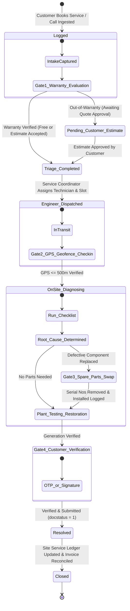

# STEP_11_ON_DEMAND_SOLAR_SERVICE_OM_SPECIFICATION.caveman.md

# Enterprise Lifecycle Step Specification: On-Demand Solar Service, Incident-Driven O&M & Warranty Lifecycle

**Document ID:** `STEP-11-ON-DEMAND-SOLAR-SERVICE-OM`  
**Lifecycle Flow:** Flow 1: Core Solar EPC Project Execution (Post-Project Service Stage 11)  
**Governing Architecture:** [`architect_docs/02_STEP_PLANNING_SPECIFICATION_BLUEPRINT.md`](../architect_docs/02_STEP_PLANNING_SPECIFICATION_BLUEPRINT.md)  
**Architecture Decision Record:** [`docs/decisions/ADR-011-ON-DEMAND-SOLAR-SERVICE-WARRANTY-OM-LIFECYCLE.md`](../docs/decisions/ADR-011-ON-DEMAND-SOLAR-SERVICE-WARRANTY-OM-LIFECYCLE.md)  
**PRD / FRS Traceability:** [`planning_ref_docs/01_PROJECT_FOUNDATION_MODEL.md`](../planning_ref_docs/01_PROJECT_FOUNDATION_MODEL.md) (`BC-11`, `Sec 3.11`), [`planning_ref_docs/05_BUSINESS_REQUIREMENTS_DOCUMENT.md`](../planning_ref_docs/05_BUSINESS_REQUIREMENTS_DOCUMENT.md) (`BR-011`), [`planning_ref_docs/06_FUNCTIONAL_REQUIREMENTS_SPECIFICATION.md`](../planning_ref_docs/06_FUNCTIONAL_REQUIREMENTS_SPECIFICATION.md) (`FR-011`), [`planning_ref_docs/07_SOFTWARE_REQUIREMENTS_SPECIFICATION.md`](../planning_ref_docs/07_SOFTWARE_REQUIREMENTS_SPECIFICATION.md) (`Sec 2.2`, `Sec 4.4`), [`planning_ref_docs/08_DATABASE_DESIGN_DOCUMENT.md`](../planning_ref_docs/08_DATABASE_DESIGN_DOCUMENT.md) (`Domain 9: OM`), [`planning_ref_docs/09_API_DESIGN_AND_INTEGRATIONS.md`](../planning_ref_docs/09_API_DESIGN_AND_INTEGRATIONS.md) (`API 10`), [`planning_ref_docs/10_UI_UX_SPECIFICATION.md`](../planning_ref_docs/10_UI_UX_SPECIFICATION.md) (`Screen 15`), [`planning_ref_docs/11_MODULE_FUNCTIONAL_DOCUMENTATION.md`](../planning_ref_docs/11_MODULE_FUNCTIONAL_DOCUMENTATION.md) (`MOD-11`), [`step_plans/STEP_10_LIAISONING_GRID_SYNC_SPECIFICATION.md`](./STEP_10_LIAISONING_GRID_SYNC_SPECIFICATION.md)  
**Target Module:** `solar_module` (Extend ERPNext `tabCustomer`, standalone submittable `tabSolar Service Request`, `tabMaintenance Visit`, child tables `tabSolar Service Spare Item`, `tabMaintenance Checklist Item`, `tabSolar Stage Delay Log`, master ledger `tabSolar Site Service History`)  
**Author:** Principal Enterprise Architect  
**Status:** Ready for Execution

---

## 1. Step Scope, Objectives & Context Traceability

### 1.1 Decoupled Lifecycle Positioning & The Post-Project Service Boundary

Stage 11 after-sales operational lifecycle for `solar_module`.

Per [`ADR-011`](../docs/decisions/ADR-011-ON-DEMAND-SOLAR-SERVICE-WARRANTY-OM-LIFECYCLE.md):

1. **Clean CapEx Project Termination:** Stage 10 terminates CapEx construction with net-meter energization, COD certificate, milestone revenue recognition.
2. **Independent, Decoupled OpEx Lifecycle:** Stage 11 not auto-spawned on project closeout. Operates independent of construction steps. Zero auto-tasks on `tabProject`.
3. **On-Demand Incident Activation:** Activates on plant fault, inverter tripping, degradation, or customer booking.
4. **Dual-Track Commercial Governance:**
   - **Track A (Within-Warranty / Free / RMA):** Equipment/workmanship active $\rightarrow$ ₹0.00 customer charge, OEM RMA claim processing.
   - **Track B (Out-of-Warranty / Chargeable):** Expired warranty, external damage $\rightarrow$ estimate, customer quote approval, payment, ERPNext Sales Invoice.

```
┌──────────────────────────────────────────────────────────────────────────────────────────────────┐
│                             STAGE 11 DECOUPLED SERVICE BOUNDARY                                  │
└──────────────────────────────────────────────────────────────────────────────────────────────────┘

 [Stage 10: COD Certified & Net Meter Energized] ──▶ (CapEx Project Cleanly Terminated & Closed)

 ══════════════════════════════ INDEPENDENT SERVICE LIFECYCLE ══════════════════════════════

 [Omnichannel Service Intake]
 • Customer Web Portal (/solar/service-booking) | WhatsApp Helpdesk | Phone Desk Call
 • Captures: Site Address, Fault Category, Inverter Error Code/Photo, Preferred Slot
         │
         ▼
 [tabSolar Service Request Created] (SSR-.YYYY.-.#####)
         │
         ▼
 [Gate 1: Automated Warranty Discrimination Engine]
 • Evaluates COD Date, Installed Serial Nos, Equipment Warranty Expiry, Fault Nature
         │
         ├──────────────────────────────────────────────┬───────────────────────────────────────┤
         ▼                                              ▼                                       │
 [Track A: Within-Warranty (Free / RMA)]        [Track B: Out-of-Warranty (Chargeable)]          │
 • Equipment / Workmanship Active               • Expired Warranty / External / Physical Damage │
 • Customer Fee: ₹0.00                          • Service Visit & Labor Rate Estimation         │
 • Flags for OEM Reverse Logistics (RMA)        • Quotation Shared & Customer Acceptance        │
 • Vendor Warranty Recovery Tracking            • Advance / Payment Gate Clearance              │
         │                                              │                                       │
         └──────────────────────┬───────────────────────┘                                       │
                                │                                                               │
                                ▼                                                               │
 [Triage & Dispatch: O&M Service Coordinator]                                                   │
 • Priority SLA: Emergency Blackout (4h/24h) | Inverter Warning (12h/48h) | Health Check (48h/5d)│
 • Schedules Visit & Assigns O&M Service Engineer                                               │
         │                                                                                      │
         ▼                                                                                      │
 [Gate 2: Field Technician Mobile GPS Geofence Gate]                                            │
 • Technician arrives on-site and triggers mobile check-in                                      │
 • Haversine geofence asserts distance to site ≤ 500 meters                                     │
 • Hard-blocks diagnostic entry until GPS lock is verified                                      │
         │                                                                                      │
         ▼                                                                                      │
 [Field Diagnostics, Health Checklist & Root Cause Analysis]                                    │
 • Electrical measurements: Voc, Isc, Earth Resistance, Inverter Error Code                     │
 • Photo evidence upload: Damaged component, meter reading, physical site conditions            │
         │                                                                                      │
         ▼                                                                                      │
 [Gate 3: Serialized Spare Parts Reconciliation Gate]                                           │
 • Defective Serial Number Removed (e.g. INV-GROWATT-2023-0941)                                 │
 • Replacement Serial Number Installed (e.g. INV-GROWATT-2026-1182)                             │
 • Direct link to ERPNext Stock Entry (Material Issue from Van/Store)                           │
 • If Out-of-Warranty: Generates ERPNext Sales Invoice for parts & labor                        │
         │                                                                                      │
         ▼                                                                                      │
 [Gate 4: Customer Closed-Loop Verification Gate]                                               │
 • Generates cryptographic 6-digit OTP sent to Customer mobile / WhatsApp                       │
 • Alternative: Digital signature capture on technician's glass screen                          │
 • Document submission (docstatus = 1) hard-blocked without OTP or Signature                    │
         │                                                                                      │
         ▼                                                                                      │
 [Immutable Service History Ledger Update & Plant Twin Sync]                                    │
 • Appends visit summary, replaced serials, and diagnostic log to tabSolar Site Service History │
 • Updates active serial mappings on the customer site master                                   │
 • Closes Solar Service Request & Maintenance Visit                                             │
```

---

### 1.2 Core Business Objectives & Strategic KPIs

| Strategic Objective             | Metric / Target               | Operational Mechanism                                                    |
| :------------------------------ | :---------------------------- | :----------------------------------------------------------------------- |
| **First-Time Fix Rate (FTFR)**  | $\ge 85\%$                    | Ingestion capture error codes + photos; technician brings correct parts. |
| **Emergency Triage Velocity**   | $\le 4\text{ Hours}$          | Auto-priority triage blackout; instant paging.                           |
| **Warranty Leakage Prevention** | $100\%$ zero unbilled repairs | Auto-discrimination block out-of-warranty without approval.              |
| **OEM Warranty Cost Recovery**  | $\ge 95\%$ recovery rate      | Defective serial logging into OEM RMA tracking.                          |
| **Field Visit Authenticity**    | $100\%$ geofenced visits      | GPS lock site $\le 500\text{m}$ before diagnostic unlock.                |
| **Asset Twin Integrity**        | $100\%$ serialized tracking   | Track removed vs installed serials, update site twin.                    |

---

### 1.3 Context Traceability Matrix

| Document Source              | Section / Identifier                                                                                                                                    | Requirement Summary & System Realization                                                                           |
| :--------------------------- | :------------------------------------------------------------------------------------------------------------------------------------------------------ | :----------------------------------------------------------------------------------------------------------------- |
| **Architect Blueprint**      | [`architect_docs/02_STEP_PLANNING_SPECIFICATION_BLUEPRINT.md`](../architect_docs/02_STEP_PLANNING_SPECIFICATION_BLUEPRINT.md)                           | Conforms 9-Section Blueprint.                                                                                      |
| **Architecture Decision**    | [`docs/decisions/ADR-011-ON-DEMAND-SOLAR-SERVICE-WARRANTY-OM-LIFECYCLE.md`](../docs/decisions/ADR-011-ON-DEMAND-SOLAR-SERVICE-WARRANTY-OM-LIFECYCLE.md) | Governs decoupled service boundary, dual-track warranty, GPS geofencing, site ledger.                              |
| **Project Foundation Model** | [`planning_ref_docs/01_PROJECT_FOUNDATION_MODEL.md`](../planning_ref_docs/01_PROJECT_FOUNDATION_MODEL.md) (`BC-11`, `Sec 3.11`)                         | Intake, dispatch, component replace, visit closure.                                                                |
| **Business Requirements**    | [`planning_ref_docs/05_BUSINESS_REQUIREMENTS_DOCUMENT.md`](../planning_ref_docs/05_BUSINESS_REQUIREMENTS_DOCUMENT.md) (`BR-011`)                        | Omnichannel booking, warranty vs chargeable segregation, service history.                                          |
| **Functional Requirements**  | [`planning_ref_docs/06_FUNCTIONAL_REQUIREMENTS_SPECIFICATION.md`](../planning_ref_docs/06_FUNCTIONAL_REQUIREMENTS_SPECIFICATION.md) (`FR-011`)          | Service portal, GPS check-in, spare reconciliation, OTP, invoice.                                                  |
| **Software Requirements**    | [`planning_ref_docs/07_SOFTWARE_REQUIREMENTS_SPECIFICATION.md`](../planning_ref_docs/07_SOFTWARE_REQUIREMENTS_SPECIFICATION.md) (`Sec 2.2`, `Sec 4.4`)  | SLA daemon, WhatsApp broker, Stock/Accounts bridge.                                                                |
| **Database Design**          | [`planning_ref_docs/08_DATABASE_DESIGN_DOCUMENT.md`](../planning_ref_docs/08_DATABASE_DESIGN_DOCUMENT.md) (`Domain 9: OM`)                              | Schemas `tabSolar Service Request`, `tabMaintenance Visit`, child tables.                                          |
| **API Architecture**         | [`planning_ref_docs/09_API_DESIGN_AND_INTEGRATIONS.md`](../planning_ref_docs/09_API_DESIGN_AND_INTEGRATIONS.md) (`API 10`)                              | Whitelisted RPC: `book_service_request`, `triage_and_dispatch`, `technician_checkin`, `submit_service_resolution`. |
| **UI/UX Specification**      | [`planning_ref_docs/10_UI_UX_SPECIFICATION.md`](../planning_ref_docs/10_UI_UX_SPECIFICATION.md) (`Screen 15`)                                           | Customer Widget, Dispatch Workbench, Mobile Field UI.                                                              |

---

### 1.4 Critical Operational Failures Eliminated

1. **Indefinite CapEx Project Linger:** Prevents projects remaining open for years; clean financial audit boundaries.
2. **Uncollected Out-of-Warranty Revenue:** Stops free repairs for customer-inflicted damages via upfront quotes.
3. **Unrecovered OEM Inverter & Module Costs:** Captures defective serial numbers for OEM RMA recovery.
4. **Phantom Field Service Visits:** Eliminates fake visits via Haversine GPS geofencing.
5. **Corrupted Plant Digital Twins:** Preserves asset provenance linking removals and installations.

---

## 2. Stakeholders, Enterprise Actors & HRMS Role Mapping

### 2.1 Enterprise Role Nomenclature (Zero "User" Suffix Rule)

| Professional Role Title             | Frappe System Role                 | Primary Operational Scope in Stage 11                                           |
| :---------------------------------- | :--------------------------------- | :------------------------------------------------------------------------------ |
| **Customer Care Representative**    | `Customer Care Representative`     | Omnichannel service intake, symptom clarification, customer communication.      |
| **O&M Service Coordinator**         | `O&M Service Coordinator`          | Triage, warranty verification, dispatch scheduling, engineer allocation.        |
| **O&M Service Engineer**            | `O&M Service Engineer`             | GPS check-in, electrical diagnostics, root cause, part replace, OTP collection. |
| **Commercial Officer**              | `Commercial Officer`               | Out-of-warranty quotes, payment verification, OEM RMA recovery.                 |
| **Admin (Project Supreme Command)** | `Admin`                            | SLA delay waivers, warranty dispute overrides, reallocations.                   |
| **Administrator / System Manager**  | `Administrator` / `System Manager` | Technical plumbing, API routing, portal auth, queues, DocTypes.                 |

---

### 2.2 Granular Permission Matrix

| DocType / Entity                    | Role Title                     | Read | Write | Create | Submit | Cancel | Amend |
| :---------------------------------- | :----------------------------- | :--: | :---: | :----: | :----: | :----: | :---: |
| **`tabSolar Service Request`**      | `Customer Care Representative` |  ✔   |   ✔   |   ✔    |   ✖    |   ✖    |   ✖   |
|                                     | `O&M Service Coordinator`      |  ✔   |   ✔   |   ✔    |   ✔    |   ✖    |   ✖   |
|                                     | `O&M Service Engineer`         |  ✔   |   ✖   |   ✖    |   ✖    |   ✖    |   ✖   |
|                                     | `Commercial Officer`           |  ✔   |   ✔   |   ✖    |   ✖    |   ✖    |   ✖   |
|                                     | `Admin`                        |  ✔   |   ✔   |   ✔    |   ✔    |   ✔    |   ✔   |
|                                     | `System Manager`               |  ✔   |   ✔   |   ✔    |   ✔    |   ✔    |   ✔   |
| **`tabMaintenance Visit`**          | `O&M Service Engineer`         |  ✔   |   ✔   |   ✔    |   ✔    |   ✖    |   ✖   |
|                                     | `O&M Service Coordinator`      |  ✔   |   ✔   |   ✖    |   ✔    |   ✖    |   ✖   |
|                                     | `Commercial Officer`           |  ✔   |   ✖   |   ✖    |   ✖    |   ✖    |   ✖   |
|                                     | `Admin`                        |  ✔   |   ✔   |   ✔    |   ✔    |   ✔    |   ✔   |
|                                     | `System Manager`               |  ✔   |   ✔   |   ✔    |   ✔    |   ✔    |   ✔   |
| **`tabSolar Site Service History`** | All O&M Roles & Sales          |  ✔   |   ✖   |   ✖    |   ✖    |   ✖    |   ✖   |
|                                     | `Admin` / `System Manager`     |  ✔   |   ✔   |   ✔    |   ✖    |   ✖    |   ✖   |

---

## 3. Relational Schema & 3NF Data Dictionary

### 3.1 Primary DocType: `tabSolar Service Request`

```sql
CREATE TABLE `tabSolar Service Request` (
    `name` VARCHAR(140) NOT NULL PRIMARY KEY,
    `creation` DATETIME(6),
    `modified` DATETIME(6),
    `modified_by` VARCHAR(140),
    `owner` VARCHAR(140),
    `docstatus` INT(1) NOT NULL DEFAULT 0,

    -- Customer & Site Information
    `customer` VARCHAR(140) NOT NULL,
    `customer_name` VARCHAR(140) NOT NULL,
    `contact_phone` VARCHAR(20) NOT NULL,
    `contact_email` VARCHAR(140),
    `site_address` TEXT NOT NULL,
    `project_reference` VARCHAR(140),
    `installed_capacity_kw` DECIMAL(10, 2) NOT NULL DEFAULT 0.00,
    `inverter_brand` VARCHAR(140),
    `inverter_serial_no` VARCHAR(140),
    `commissioning_date` DATE,
    `gps_latitude` DECIMAL(10, 7),
    `gps_longitude` DECIMAL(10, 7),

    -- Intake & Problem Details
    `intake_channel` ENUM('Customer Portal', 'WhatsApp Helpdesk', 'Phone Call', 'Internal Inspection') NOT NULL DEFAULT 'Customer Portal',
    `issue_category` ENUM('Total Blackout', 'Inverter Error Code', 'Low Generation', 'Physical Damage', 'Routine Cleaning / Health Check', 'Other') NOT NULL,
    `reported_fault_description` TEXT NOT NULL,
    `inverter_error_code` VARCHAR(50),
    `fault_photo_1` TEXT,
    `fault_photo_2` TEXT,
    `request_date` DATETIME(6) NOT NULL,
    `preferred_visit_date` DATE,
    `preferred_slot` ENUM('Morning (09:00 - 13:00)', 'Afternoon (13:00 - 17:00)', 'Anytime') DEFAULT 'Anytime',

    -- Warranty & Commercial Classification
    `warranty_status` ENUM('Under Warranty', 'Out of Warranty', 'Extended AMC') NOT NULL DEFAULT 'Under Warranty',
    `warranty_classification_reason` TEXT,
    `is_free_service` INT(1) NOT NULL DEFAULT 1,
    `estimated_service_charge` DECIMAL(12, 2) DEFAULT 0.00,
    `customer_estimate_accepted` INT(1) DEFAULT 0,
    `quotation_reference` VARCHAR(140),

    -- Triage & SLA Engine
    `service_priority` ENUM('Critical Emergency', 'High', 'Standard') NOT NULL DEFAULT 'Standard',
    `ticket_status` ENUM('Logged', 'Triage Completed', 'Engineer Dispatched', 'On-Site Diagnosing', 'Parts Pending', 'Resolved', 'Closed', 'Cancelled') NOT NULL DEFAULT 'Logged',
    `assigned_coordinator` VARCHAR(140),
    `assigned_engineer` VARCHAR(140),
    `response_sla_deadline` DATETIME(6),
    `resolution_sla_deadline` DATETIME(6),
    `response_sla_status` ENUM('Within SLA', 'Overdue', 'Breached') DEFAULT 'Within SLA',
    `resolution_sla_status` ENUM('Within SLA', 'Overdue', 'Breached') DEFAULT 'Within SLA',

    -- Closure Summary
    `maintenance_visit_reference` VARCHAR(140),
    `resolution_summary` TEXT,
    `resolved_on` DATETIME(6),
    `closed_by` VARCHAR(140),

    INDEX `idx_customer` (`customer`),
    INDEX `idx_project` (`project_reference`),
    INDEX `idx_ticket_status` (`ticket_status`),
    INDEX `idx_service_priority` (`service_priority`),
    INDEX `idx_warranty_status` (`warranty_status`),
    INDEX `idx_assigned_engineer` (`assigned_engineer`)
) ENGINE=InnoDB DEFAULT CHARSET=utf8mb4 COLLATE=utf8mb4_unicode_ci;
```

---

### 3.2 Primary Field Execution DocType: `tabMaintenance Visit`

```sql
CREATE TABLE `tabMaintenance Visit` (
    `name` VARCHAR(140) NOT NULL PRIMARY KEY,
    `creation` DATETIME(6),
    `modified` DATETIME(6),
    `modified_by` VARCHAR(140),
    `owner` VARCHAR(140),
    `docstatus` INT(1) NOT NULL DEFAULT 0,

    -- Linkages
    `service_request` VARCHAR(140) NOT NULL,
    `customer` VARCHAR(140) NOT NULL,
    `project_reference` VARCHAR(140),
    `assigned_engineer` VARCHAR(140) NOT NULL,
    `actual_visit_date` DATETIME(6) NOT NULL,

    -- Gate 2: Geofence Check-in
    `checkin_latitude` DECIMAL(10, 7) NOT NULL,
    `checkin_longitude` DECIMAL(10, 7) NOT NULL,
    `site_latitude` DECIMAL(10, 7) NOT NULL,
    `site_longitude` DECIMAL(10, 7) NOT NULL,
    `geofence_distance_meters` DECIMAL(10, 2) NOT NULL,
    `is_geofence_verified` INT(1) NOT NULL DEFAULT 0,
    `checkin_timestamp` DATETIME(6) NOT NULL,

    -- Diagnostics & Root Cause
    `initial_plant_status` ENUM('Non-functional (Blackout)', 'Partially Working', 'Working with Warning', 'Normal') NOT NULL,
    `root_cause_category` ENUM('Inverter Internal Fault', 'String Fuse Blown', 'Bypass Diode Failure', 'Cable Cut / Rodent Damage', 'Grid Surge Burnout', 'Soiling / Dust Accumulation', 'Connector Disconnected', 'Discom Grid Outage', 'Normal Wear and Tear') NOT NULL,
    `root_cause_details` TEXT NOT NULL,
    `corrective_action_taken` TEXT NOT NULL,
    `final_plant_status` ENUM('Fully Operational', 'Partially Operational', 'Shutdown / Awaiting Parts') NOT NULL,

    -- Spare Parts & Commercials
    `parts_replaced` INT(1) NOT NULL DEFAULT 0,
    `stock_entry_reference` VARCHAR(140),
    `sales_invoice_reference` VARCHAR(140),
    `total_parts_amount` DECIMAL(12, 2) DEFAULT 0.00,
    `labor_service_charge` DECIMAL(12, 2) DEFAULT 0.00,
    `grand_total` DECIMAL(12, 2) DEFAULT 0.00,

    -- Gate 4: Customer Verification
    `verification_method` ENUM('Customer OTP', 'Digital Signature on Glass') NOT NULL DEFAULT 'Customer OTP',
    `customer_otp` VARCHAR(6),
    `is_otp_verified` INT(1) DEFAULT 0,
    `customer_signature` TEXT,
    `signee_name` VARCHAR(140),
    `signee_relationship` VARCHAR(100) DEFAULT 'Owner',
    `customer_feedback_rating` ENUM('5 - Excellent', '4 - Good', '3 - Satisfactory', '2 - Poor', '1 - Unacceptable'),
    `customer_remarks` TEXT,

    -- Photos
    `diagnostic_photo_1` TEXT,
    `diagnostic_photo_2` TEXT,
    `completion_photo_1` TEXT,
    `completion_photo_2` TEXT,

    INDEX `idx_service_request` (`service_request`),
    INDEX `idx_customer` (`customer`),
    INDEX `idx_assigned_engineer` (`assigned_engineer`)
) ENGINE=InnoDB DEFAULT CHARSET=utf8mb4 COLLATE=utf8mb4_unicode_ci;
```

---

### 3.3 Child Table: `tabSolar Service Spare Item`

```sql
CREATE TABLE `tabSolar Service Spare Item` (
    `name` VARCHAR(140) NOT NULL PRIMARY KEY,
    `parent` VARCHAR(140) NOT NULL,
    `parenttype` VARCHAR(140) NOT NULL,
    `parentfield` VARCHAR(140) NOT NULL,
    `idx` INT(8) NOT NULL,

    `item_code` VARCHAR(140) NOT NULL,
    `item_name` VARCHAR(140) NOT NULL,
    `is_serialized` INT(1) NOT NULL DEFAULT 0,
    `serial_no_removed` VARCHAR(140),
    `serial_no_installed` VARCHAR(140),
    `qty` DECIMAL(10, 2) NOT NULL DEFAULT 1.00,
    `uom` VARCHAR(50) NOT NULL DEFAULT 'Nos',
    `is_warranty_covered` INT(1) NOT NULL DEFAULT 1,
    `unit_rate` DECIMAL(12, 2) NOT NULL DEFAULT 0.00,
    `amount` DECIMAL(12, 2) NOT NULL DEFAULT 0.00,
    `warehouse` VARCHAR(140),
    `rma_claim_eligible` INT(1) NOT NULL DEFAULT 0,

    INDEX `idx_parent` (`parent`),
    INDEX `idx_item_code` (`item_code`),
    INDEX `idx_serial_removed` (`serial_no_removed`),
    INDEX `idx_serial_installed` (`serial_no_installed`)
) ENGINE=InnoDB DEFAULT CHARSET=utf8mb4 COLLATE=utf8mb4_unicode_ci;
```

---

### 3.4 Child Table: `tabMaintenance Checklist Item`

```sql
CREATE TABLE `tabMaintenance Checklist Item` (
    `name` VARCHAR(140) NOT NULL PRIMARY KEY,
    `parent` VARCHAR(140) NOT NULL,
    `parenttype` VARCHAR(140) NOT NULL,
    `parentfield` VARCHAR(140) NOT NULL,
    `idx` INT(8) NOT NULL,

    `check_item` VARCHAR(255) NOT NULL,
    `standard_expected` VARCHAR(255),
    `measured_reading` VARCHAR(100),
    `status` ENUM('Pass', 'Fail', 'Corrected on Site', 'Not Applicable') NOT NULL DEFAULT 'Pass',
    `remarks` VARCHAR(255),

    INDEX `idx_parent` (`parent`)
) ENGINE=InnoDB DEFAULT CHARSET=utf8mb4 COLLATE=utf8mb4_unicode_ci;
```

---

### 3.5 Master Ledger: `tabSolar Site Service History`

```sql
CREATE TABLE `tabSolar Site Service History` (
    `name` VARCHAR(140) NOT NULL PRIMARY KEY,
    `creation` DATETIME(6),
    `customer` VARCHAR(140) NOT NULL,
    `project_reference` VARCHAR(140),
    `service_request` VARCHAR(140) NOT NULL,
    `maintenance_visit` VARCHAR(140) NOT NULL,
    `visit_date` DATETIME(6) NOT NULL,
    `assigned_engineer` VARCHAR(140) NOT NULL,
    `issue_category` VARCHAR(100) NOT NULL,
    `warranty_status` VARCHAR(50) NOT NULL,
    `root_cause` TEXT NOT NULL,
    `parts_replaced_summary` TEXT,
    `plant_restored_status` VARCHAR(50) NOT NULL,
    `customer_rating` VARCHAR(50),

    INDEX `idx_customer` (`customer`),
    INDEX `idx_project` (`project_reference`),
    INDEX `idx_service_request` (`service_request`),
    INDEX `idx_visit_date` (`visit_date`)
) ENGINE=InnoDB DEFAULT CHARSET=utf8mb4 COLLATE=utf8mb4_unicode_ci;
```

---

### 3.6 Child Table: `tabSolar Stage Delay Log`

```sql
CREATE TABLE `tabSolar Stage Delay Log` (
    `name` VARCHAR(140) NOT NULL PRIMARY KEY,
    `parent` VARCHAR(140) NOT NULL,
    `parenttype` VARCHAR(140) NOT NULL,
    `parentfield` VARCHAR(140) NOT NULL,
    `idx` INT(8) NOT NULL,

    `sla_type` ENUM('Response SLA', 'Resolution SLA') NOT NULL,
    `sla_deadline` DATETIME(6) NOT NULL,
    `breach_timestamp` DATETIME(6) NOT NULL,
    `delay_hours` DECIMAL(10, 2) NOT NULL DEFAULT 0.00,
    `delay_reason_code` ENUM('Customer Unavailable', 'Severe Weather / Rain', 'Spare Parts Out of Stock', 'DISCOM Grid Outage', 'Technician Vehicle Breakdown', 'Access Key Unavailable', 'Other') NOT NULL,
    `justification` TEXT NOT NULL,
    `logged_by` VARCHAR(140) NOT NULL,
    `authorized_by` VARCHAR(140),

    INDEX `idx_parent` (`parent`)
) ENGINE=InnoDB DEFAULT CHARSET=utf8mb4 COLLATE=utf8mb4_unicode_ci;
```

---

## 4. State Machine, Verification Gates & Service SLAs

### 4.1 End-to-End Service Lifecycle State Machine



---

### 4.2 The Four Hard Verification Gates

#### Gate 1: Warranty Eligibility Gate

- **Enforcement:** `Solar Service Request.validate()` + triage.
- **Rule:** Server-side check. If `commissioning_date + 365 days >= today` and equipment defect, default `warranty_status = "Under Warranty"` and `is_free_service = 1`. If past warranty or external damage (rodents, surge), set `warranty_status = "Out of Warranty"`, `is_free_service = 0`; block dispatch until `customer_estimate_accepted = 1`. Non-Admin override barred.

#### Gate 2: Field Check-In Geofence Gate

- **Enforcement:** `solar_module.api.om.technician_checkin` + `Maintenance Visit.validate()`.
- **Rule:** Technician cannot view/submit diagnostic checklist without device GPS matching site $\le 500\text{ meters}$ via Haversine:
  $$a = \sin^2\left(\frac{\Delta \phi}{2}\right) + \cos \phi_1 \cos \phi_2 \sin^2\left(\frac{\Delta \lambda}{2}\right)$$
  $$c = 2 \cdot \arctan2(\sqrt{a}, \sqrt{1-a})$$
  $$d = R \cdot c \quad (R = 6,371,000\text{ meters})$$
  $$\text{Gate Passed } \iff d \le 500.00\text{ meters}$$

#### Gate 3: Spare Parts Serial Reconciliation Gate

- **Enforcement:** `Maintenance Visit.on_submit()`.
- **Rule:** For child rows with `is_serialized = 1`, both `serial_no_removed` and `serial_no_installed` mandatory.
  1. `serial_no_removed` unlinked from site, moved to quarantine.
  2. `serial_no_installed` moved from van stock to site ledger.
  3. Violations raise `frappe.ValidationError`.

#### Gate 4: Customer Closed-Loop Gate

- **Enforcement:** `Maintenance Visit.on_submit()`.
- **Rule:** Submission (`docstatus = 1`) blocked unless:
  - `is_otp_verified = 1`, OR
  - `customer_signature` present and `signee_name` length $\ge 3$.

---

### 4.3 Tiered Service SLAs & Delay Enforcement

`solar_module.tasks.check_service_slas` runs every 15 minutes:

| Priority Class         | Response SLA      | Resolution SLA           | Escalation Pathway                                                          |
| :--------------------- | :---------------- | :----------------------- | :-------------------------------------------------------------------------- |
| **Critical Emergency** | $4\text{ Hours}$  | $24\text{ Hours}$        | T-1h alert to Coordinator $\rightarrow$ Breached: Alert O&M Head & `Admin`. |
| **High / Degraded**    | $12\text{ Hours}$ | $48\text{ Hours}$        | T-2h alert to Coordinator $\rightarrow$ Breached: Paged to Coordinator.     |
| **Standard / Routine** | $48\text{ Hours}$ | $5\text{ Business Days}$ | T-8h reminder $\rightarrow$ Breached: Daily digest alert.                   |

**Mandatory Delay Logging:** Breaching response/resolution shifts ticket to `Overdue`. Submitting resolution blocked unless row logged in `tabSolar Stage Delay Log`.

---

## 5. Controller Logic, Domain Services & Whitelisted APIs

### 5.1 Decoupled Domain Services

```python
# solar_module/services/om/intake_service.py
import frappe
from frappe.utils import now_datetime, add_to_date, getdate, nowdate
import math

class SolarServiceIntakeService:
    @staticmethod
    def evaluate_warranty(customer: str, issue_category: str, reported_date: str = None) -> dict:
        """Evaluates whether a reported issue is In-Warranty (Free) or Out-of-Warranty (Chargeable)."""
        check_date = getdate(reported_date or nowdate())

        # Fetch site / customer commissioning data
        site_info = frappe.db.get_value(
            "Customer",
            customer,
            ["custom_commissioning_date", "custom_warranty_expiry_date", "custom_amc_active"],
            as_dict=True
        ) or {}

        # Non-covered damage categories
        non_covered_categories = [
            "Physical Damage",
            "Routine Cleaning / Health Check"
        ]

        if issue_category in non_covered_categories:
            return {
                "warranty_status": "Out of Warranty",
                "is_free_service": 0,
                "reason": f"Issue category '{issue_category}' is excluded from standard warranty coverage."
            }

        if site_info.get("custom_amc_active"):
            return {
                "warranty_status": "Extended AMC",
                "is_free_service": 1,
                "reason": "Active Extended AMC Contract covers service visit."
            }

        warranty_expiry = site_info.get("custom_warranty_expiry_date")
        if warranty_expiry and getdate(warranty_expiry) >= check_date:
            return {
                "warranty_status": "Under Warranty",
                "is_free_service": 1,
                "reason": f"Under active installation warranty until {warranty_expiry}."
            }

        return {
            "warranty_status": "Out of Warranty",
            "is_free_service": 0,
            "reason": f"Warranty expired on {warranty_expiry or 'N/A'}. Service visit and parts are chargeable."
        }

    @staticmethod
    def calculate_sla_deadlines(priority: str) -> dict:
        """Computes response and resolution SLA deadlines based on priority."""
        now = now_datetime()
        if priority == "Critical Emergency":
            return {
                "response_sla": add_to_date(now, hours=4),
                "resolution_sla": add_to_date(now, hours=24)
            }
        elif priority == "High":
            return {
                "response_sla": add_to_date(now, hours=12),
                "resolution_sla": add_to_date(now, hours=48)
            }
        else: # Standard
            return {
                "response_sla": add_to_date(now, hours=48),
                "resolution_sla": add_to_date(now, days=5)
            }


class FieldDiagnosticsAndPartsService:
    @staticmethod
    def calculate_haversine_distance(lat1: float, lon1: float, lat2: float, lon2: float) -> float:
        """Returns distance between two GPS coordinates in meters using the Haversine formula."""
        R = 6371000.0  # Earth radius in meters
        phi1 = math.radians(lat1)
        phi2 = math.radians(lat2)
        delta_phi = math.radians(lat2 - lat1)
        delta_lambda = math.radians(lon2 - lon1)

        a = (math.sin(delta_phi / 2.0) ** 2 +
             math.cos(phi1) * math.cos(phi2) * math.sin(delta_lambda / 2.0) ** 2)
        c = 2.0 * math.atan2(math.sqrt(a), math.sqrt(1.0 - a))
        return round(R * c, 2)

    @staticmethod
    def reconcile_swapped_serials(visit_doc):
        """Processes serialized component swapping and updates ERPNext stock and asset ledger."""
        for item in visit_doc.get("spare_items", []):
            if item.is_serialized:
                if not item.serial_no_removed or not item.serial_no_installed:
                    frappe.throw(
                        frappe._(f"Row #{item.idx}: Both Removed Serial No and Installed Serial No are mandatory for serialized item {item.item_code}.")
                    )
                # Unlink old serial and flag quarantine
                frappe.db.set_value("Serial No", item.serial_no_removed, {
                    "status": "Under Inspection",
                    "warehouse": item.warehouse or "Quarantine - SEPC"
                })
                # Link new serial to site
                frappe.db.set_value("Serial No", item.serial_no_installed, {
                    "status": "Delivered",
                    "customer": visit_doc.customer
                })
```

---

### 5.2 Whitelisted REST/RPC APIs (`solar_module.api.om.*`)

```python
# solar_module/api/om.py
import frappe
from frappe import _
from frappe.utils import now_datetime, random_string
from solar_module.services.om.intake_service import SolarServiceIntakeService, FieldDiagnosticsAndPartsService

@frappe.whitelist(methods=["POST"])
def book_service_request(customer: str, issue_category: str, reported_fault_description: str,
                         contact_phone: str = None, preferred_visit_date: str = None,
                         fault_photo_1: str = None, fault_photo_2: str = None):
    """Customer or helpdesk API to book a service request."""
    # IDOR and access validation
    if frappe.session.user != "Administrator" and "Customer Care Representative" not in frappe.get_roles():
        customer_linked = frappe.db.get_value("Customer", {"user": frappe.session.user}, "name")
        if customer_linked and customer_linked != customer:
            frappe.throw(_("Unauthorized access to customer site records."), frappe.PermissionError)

    warranty_eval = SolarServiceIntakeService.evaluate_warranty(customer, issue_category)

    # Auto-assign priority based on category
    priority = "Critical Emergency" if issue_category == "Total Blackout" else ("High" if issue_category == "Inverter Error Code" else "Standard")
    sla_deadlines = SolarServiceIntakeService.calculate_sla_deadlines(priority)

    ssr = frappe.get_doc({
        "doctype": "Solar Service Request",
        "customer": customer,
        "customer_name": frappe.db.get_value("Customer", customer, "customer_name"),
        "contact_phone": contact_phone or frappe.db.get_value("Customer", customer, "custom_contact_phone"),
        "site_address": frappe.db.get_value("Customer", customer, "custom_site_address") or "Rooftop Site",
        "issue_category": issue_category,
        "reported_fault_description": reported_fault_description,
        "request_date": now_datetime(),
        "preferred_visit_date": preferred_visit_date,
        "fault_photo_1": fault_photo_1,
        "fault_photo_2": fault_photo_2,
        "warranty_status": warranty_eval["warranty_status"],
        "is_free_service": warranty_eval["is_free_service"],
        "warranty_classification_reason": warranty_eval["reason"],
        "service_priority": priority,
        "response_sla_deadline": sla_deadlines["response_sla"],
        "resolution_sla_deadline": sla_deadlines["resolution_sla"],
        "ticket_status": "Logged"
    })
    ssr.insert(ignore_permissions=True)
    return {"status": "success", "service_request": ssr.name, "warranty_status": ssr.warranty_status}


@frappe.whitelist(methods=["POST"])
def technician_checkin(visit_name: str, latitude: float, longitude: float):
    """Technician GPS check-in verifying Haversine distance <= 500m."""
    visit = frappe.get_doc("Maintenance Visit", visit_name)
    visit.check_permission("write")

    dist = FieldDiagnosticsAndPartsService.calculate_haversine_distance(
        float(latitude), float(longitude),
        float(visit.site_latitude), float(visit.site_longitude)
    )

    if dist > 500.00:
        frappe.throw(
            _(f"GPS Check-in Failed: You are {dist:.1f}m away from the site. Must be within 500m."),
            frappe.ValidationError
        )

    visit.checkin_latitude = latitude
    visit.checkin_longitude = longitude
    visit.geofence_distance_meters = dist
    visit.is_geofence_verified = 1
    visit.checkin_timestamp = now_datetime()
    visit.save()

    # Update Service Request state
    frappe.db.set_value("Solar Service Request", visit.service_request, "ticket_status", "On-Site Diagnosing")
    return {"status": "success", "distance_meters": dist, "is_verified": 1}


@frappe.whitelist(methods=["POST"])
def generate_customer_otp(visit_name: str):
    """Generates a cryptographic 6-digit OTP and dispatches it via SMS/WhatsApp."""
    visit = frappe.get_doc("Maintenance Visit", visit_name)
    visit.check_permission("write")

    otp = random_string(6, digits_only=True)
    frappe.cache().set_value(f"service_otp_{visit_name}", otp, expires_in_sec=1800) # 30 min

    phone = frappe.db.get_value("Customer", visit.customer, "custom_contact_phone")
    return {"status": "success", "message": f"OTP dispatched to {phone}"}


@frappe.whitelist(methods=["POST"])
def verify_customer_otp(visit_name: str, otp_entered: str):
    """Verifies customer OTP before allowing resolution submission."""
    cached_otp = frappe.cache().get_value(f"service_otp_{visit_name}")
    if not cached_otp or cached_otp != otp_entered.strip():
        frappe.throw(_("Invalid or expired OTP entered."), frappe.ValidationError)

    visit = frappe.get_doc("Maintenance Visit", visit_name)
    visit.is_otp_verified = 1
    visit.customer_otp = otp_entered.strip()
    visit.save()
    return {"status": "success", "verified": 1}


@frappe.whitelist(methods=["GET"])
def get_site_service_history(customer: str):
    """Retrieves full lifetime service ledger for an installed solar plant."""
    return frappe.get_all(
        "Solar Site Service History",
        filters={"customer": customer},
        fields=["name", "visit_date", "issue_category", "warranty_status", "root_cause", "parts_replaced_summary", "assigned_engineer", "customer_rating"],
        order_by="visit_date desc"
    )
```

---

## 6. Frontend UI/UX Blueprint (`/solar/service` & Controlled Desk)

### 6.1 Unified Frontend Landing Routing (`/solar/service`)

```
┌──────────────────────────────────────────────────────────────────────────────────────────────────┐
│                           /solar/service — O&M SERVICE DESK WORKBENCH                            │
├──────────────────────────────────────────────────────────────────────────────────────────────────┤
│  [+ Book Service Request]    [ Active Tickets: 14 ]    [ Overdue: 2 ]    [ In Warranty: 11 ]     │
├──────────────────────────────────────────────────────────────────────────────────────────────────┤
│ FILTERS: [All Categories ▼]  [Priority: Critical ▼]  [Engineer: All ▼]  [Search Site / Customer] │
├──────────────────────────────────────────────────────────────────────────────────────────────────┤
│ TICKET ID      CUSTOMER         CAPACITY   CATEGORY        PRIORITY   WARRANTY   STATUS   ACTION │
│ SSR-2026-00102 Ramesh Patel     10.5 kWp   Inverter Dead   Critical   In-Warr    On-Site  [View] │
│ SSR-2026-00098 Green Mills Ltd  50.0 kWp   Low Gen (-35%)  High       Out-Warr   Quote    [Quote]│
│ SSR-2026-00094 Apex Logistics   25.0 kWp   Cleaning Visit  Standard   AMC        Assigned [Assign│
└──────────────────────────────────────────────────────────────────────────────────────────────────┘
```

---

### 6.2 Field Technician Mobile Interface

Optimized for mobile touchscreens (`/solar/technician`):

1. **Card 1: Job Details & Navigation:** Site Address, Installed Inverter Model, Customer Phone, `[Google Maps Navigate]`.
2. **Card 2: Gate 2 GPS Check-In:** `[Verify Location (GPS)]` button; displays real-time accuracy and distance in meters; shows green badge when $\le 500\text{m}$.
3. **Card 3: Diagnostic Checklist:** Tap-to-toggle Pass/Fail for String Voc, Earth Resistance, and Inverter Error Code.
4. **Card 4: Gate 3 Spare Parts Swapping:** Barcode scanner button for `Defective Serial Removed` and `New Serial Installed`.
5. **Card 5: Gate 4 Customer Verification:** `[Send OTP to Customer]` and input box, or on-screen Signature Pad with stylus/touch capture.

---

### 6.3 Controlled Desk Deep Links

- Desk view: `/app/solar-service-request/<id>` (Full form view for O&M Service Coordinator).
- Desk view: `/app/maintenance-visit/<id>` (Detailed technical inspection report).

---

## 7. Cross-App Integration Touchpoints

1. **ERPNext Stock (`Stock Entry - Material Issue`):** Spare consumption generates `Stock Entry` (Material Issue) from `Technician Van Warehouse` or `Central Store`.
2. **ERPNext Accounts (`Sales Invoice`):** Out-of-warranty visit submission auto-creates `Sales Invoice` against `Customer` for labor and parts.
3. **Frappe HRMS (`Employee Checkin`):** GPS check-in logs remote field attendance to `Employee Checkin`.
4. **Omnichannel Communications (WhatsApp / SMS):** Automated dispatch alert with engineer ETA; automated OTP message for sign-off.

---

## 8. Automated Testing & QA Criteria

### 8.1 Zero Database Commit Test Suite

```python
# solar_module/tests/test_solar_service_om.py
import frappe
from frappe.tests.utils import FrappeTestCase
from frappe.utils import now_datetime, add_to_date
from solar_module.services.om.intake_service import SolarServiceIntakeService, FieldDiagnosticsAndPartsService
from solar_module.api.om import book_service_request, technician_checkin

class TestSolarServiceOM(FrappeTestCase):
    def setUp(self):
        # Create test customer with registered site coordinates
        self.customer = frappe.get_doc({
            "doctype": "Customer",
            "customer_name": "Test Solar Farm",
            "customer_group": "Commercial",
            "territory": "All Territories",
            "custom_commissioning_date": add_to_date(now_datetime(), days=-100),
            "custom_warranty_expiry_date": add_to_date(now_datetime(), days=265),
            "custom_site_latitude": 23.0225,
            "custom_site_longitude": 72.5714
        }).insert(ignore_permissions=True)

    def test_01_warranty_discrimination_active(self):
        """Track A: Verify within-warranty equipment fault is free of charge."""
        eval_result = SolarServiceIntakeService.evaluate_warranty(
            self.customer.name, "Inverter Error Code"
        )
        self.assertEqual(eval_result["warranty_status"], "Under Warranty")
        self.assertEqual(eval_result["is_free_service"], 1)

    def test_02_warranty_discrimination_physical_damage(self):
        """Track B: Physical damage must be classified Out of Warranty (Chargeable)."""
        eval_result = SolarServiceIntakeService.evaluate_warranty(
            self.customer.name, "Physical Damage"
        )
        self.assertEqual(eval_result["warranty_status"], "Out of Warranty")
        self.assertEqual(eval_result["is_free_service"], 0)

    def test_03_haversine_distance_calculation(self):
        """Gate 2: Assert Haversine formula calculates distance accurately."""
        # 23.0225, 72.5714 to 23.0230, 72.5714 (~55 meters)
        dist = FieldDiagnosticsAndPartsService.calculate_haversine_distance(
            23.0225, 72.5714, 23.0230, 72.5714
        )
        self.assertLess(dist, 100.0)
        self.assertGreater(dist, 40.0)

    def test_04_geofence_checkin_hard_block_over_500m(self):
        """Gate 2: Assert check-in fails if technician is > 500m away."""
        visit = frappe.get_doc({
            "doctype": "Maintenance Visit",
            "service_request": "DUMMY-REQ",
            "customer": self.customer.name,
            "assigned_engineer": "engineer@solar.com",
            "actual_visit_date": now_datetime(),
            "site_latitude": 23.0225,
            "site_longitude": 72.5714,
            "checkin_latitude": 23.0500, # Far away (>3000m)
            "checkin_longitude": 72.5714
        }).insert(ignore_permissions=True)

        with self.assertRaises(frappe.ValidationError):
            technician_checkin(visit.name, latitude=23.0500, longitude=72.5714)

    def test_05_serialized_parts_swapping_validation(self):
        """Gate 3: Assert serialized parts swap requires both removed and installed serials."""
        visit = frappe.get_doc({
            "doctype": "Maintenance Visit",
            "service_request": "DUMMY-REQ",
            "customer": self.customer.name,
            "assigned_engineer": "engineer@solar.com",
            "actual_visit_date": now_datetime(),
            "site_latitude": 23.0225,
            "site_longitude": 72.5714,
            "checkin_latitude": 23.0225,
            "checkin_longitude": 72.5714,
            "is_geofence_verified": 1,
            "initial_plant_status": "Non-functional (Blackout)",
            "root_cause_category": "Inverter Internal Fault",
            "root_cause_details": "IGBT burnout",
            "corrective_action_taken": "Replaced Inverter",
            "final_plant_status": "Fully Operational",
            "spare_items": [{
                "item_code": "SOLAR-INV-5KW",
                "item_name": "5kW Solar Inverter",
                "is_serialized": 1,
                "serial_no_removed": "OLD-INV-001",
                "serial_no_installed": "", # Missing!
                "qty": 1
            }]
        })
        with self.assertRaises(frappe.ValidationError):
            FieldDiagnosticsAndPartsService.reconcile_swapped_serials(visit)
```

---

## 9. Operational SOP & Runbook

### 9.1 Helpdesk Customer Service Intake SOP

1. **Intake Screening:**
   - Inquire whether blackout (Emergency) or degraded generation.
   - Request inverter error code reading or screen photo.
2. **Warranty Check:**
   - Verify COD date and installation records.
   - In-warranty $\rightarrow$ free diagnostic visit under warranty.
   - Out-of-warranty $\rightarrow$ notify ₹1,500 inspection fee; obtain acceptance.

---

### 9.2 Field Technician Diagnostics & Safety SOP (LOTO)

1. **Safety & PPE:** Class 0 (1000V) gloves, safety goggles, rubber boots.
2. **Lockout/Tagout (LOTO):** Switch off AC isolator first, then DC isolator. Tag breaker.
3. **Diagnostics:** Measure $V_{oc}$ ($\pm 5\%$), Megger insulation resistance ($\ge 1.0\text{ M}\Omega$), check error code.
4. **Parts & Sign-Off:** Scan removed barcode, scan installed barcode. Re-energize and verify $kW > 0$. Verify OTP before departure.

---

### 9.3 Out-of-Warranty Billing Runbook

1. Coordinator generates quotation for replacement spare parts and labor.
2. Link quotation to `Solar Service Request`.
3. Customer receives WhatsApp payment link.
4. Upon payment clearance, dispatch status unlocks.
5. On visit completion, `Maintenance Visit` posts final ERPNext `Sales Invoice`.

---

### 9.4 L3 DevOps Runbook

- **GPS Distance Mismatch Troubleshooting:** If site coordinates inaccurate, `Admin` updates `/app/customer/<id>` via Google Maps satellite pin-drop.
- **SLA Daemon Health Check:**
  ```bash
  bench execute solar_module.tasks.check_service_slas
  ```
- **Service Ledger Audit:**
  ```sql
  SELECT customer, visit_date, issue_category, root_cause FROM `tabSolar Site Service History` ORDER BY creation DESC LIMIT 10;
  ```
