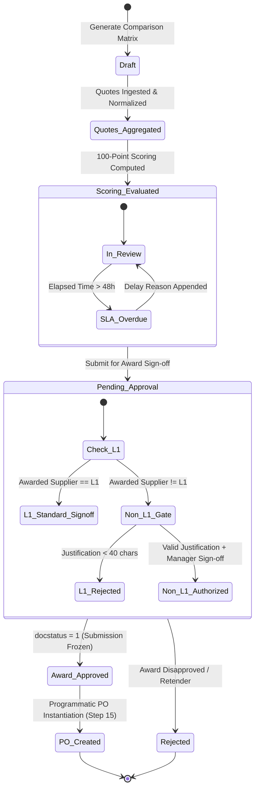

# STEP_14_QUOTATION_COMPARISON_MATRIX_SPECIFICATION.caveman.md

# Enterprise Lifecycle Step Specification: Supplier Quotation & Comparative Evaluation Matrix

**Document ID:** `STEP-14-QUOTATION-COMPARISON-MATRIX`  
**Lifecycle Flow:** Flow 2: SCM, Store, Purchase & Vendor Procurement Lifecycle (Step 03 of 08 / Global Step 14)  
**Governing Architecture:** [`architect_docs/02_STEP_PLANNING_SPECIFICATION_BLUEPRINT.md`](../architect_docs/02_STEP_PLANNING_SPECIFICATION_BLUEPRINT.md)  
**Architecture Decision Record:** [`docs/decisions/ADR-014-SUPPLIER-QUOTATION-COMPARATIVE-EVALUATION-MATRIX.md`](../docs/decisions/ADR-014-SUPPLIER-QUOTATION-COMPARATIVE-EVALUATION-MATRIX.md)  
**PRD / FRS Traceability:** [`planning_ref_docs/01_PROJECT_FOUNDATION_MODEL.md`](../planning_ref_docs/01_PROJECT_FOUNDATION_MODEL.md) (`BC-13`), [`planning_ref_docs/04_GAP_ANALYSIS_FIT_GAP.md`](../planning_ref_docs/04_GAP_ANALYSIS_FIT_GAP.md) (`Gap #06`), [`planning_ref_docs/05_BUSINESS_REQUIREMENTS_DOCUMENT.md`](../planning_ref_docs/05_BUSINESS_REQUIREMENTS_DOCUMENT.md) (`BR-013`), [`planning_ref_docs/06_FUNCTIONAL_REQUIREMENTS_SPECIFICATION.md`](../planning_ref_docs/06_FUNCTIONAL_REQUIREMENTS_SPECIFICATION.md) (`FR-013`), [`planning_ref_docs/08_DATABASE_DESIGN_DOCUMENT.md`](../planning_ref_docs/08_DATABASE_DESIGN_DOCUMENT.md) (`Domain 7: SCM`), [`planning_ref_docs/09_API_DESIGN_AND_INTEGRATIONS.md`](../planning_ref_docs/09_API_DESIGN_AND_INTEGRATIONS.md) (`API 11`), [`planning_ref_docs/10_UI_UX_SPECIFICATION.md`](../planning_ref_docs/10_UI_UX_SPECIFICATION.md) (`Screen 17`), [`planning_ref_docs/11_MODULE_FUNCTIONAL_DOCUMENTATION.md`](../planning_ref_docs/11_MODULE_FUNCTIONAL_DOCUMENTATION.md) (`MOD-13`), [`planning_ref_docs/12_GETMYERP_SOLAR_EPC_WHITEPAPER.md`](../planning_ref_docs/12_GETMYERP_SOLAR_EPC_WHITEPAPER.md) (Sec 3.2, 4.1)  
**Target Module:** `solar_module` / `manoj` (Extends ERPNext `tabSupplier Quotation`, introduces standalone submittable `tabQuotation Comparison Matrix`, child tables `tabQuotation Comparison Item`, `tabQuotation Comparison Supplier Summary`, and reuses `tabRemark-Delay Log`)  
**Author:** Principal Enterprise Architect  
**Status:** Ready for Implementation

---

## 1. Step Scope, Objectives & Context Traceability

### 1.1 Lifecycle Positioning & Context

Step 14 core commercial evaluation, landed cost normalization, procurement award gateway in Solar EPC Procurement Lifecycle (Flow 2). Ingests quotes from Step 13 ([`STEP_13_SUPPLIER_RFQ_SPECIFICATION.md`](./STEP_13_SUPPLIER_RFQ_SPECIFICATION.md)), normalizes commercial terms, executes multi-factor scoring, enforces Non-L1 governance gates, spawns contract in Step 15 ([`STEP_15_PURCHASE_ORDER_AUTHORIZATION_SPECIFICATION.md`](./STEP_15_PURCHASE_ORDER_AUTHORIZATION_SPECIFICATION.md)).

```
┌──────────────────────────────────────────────────────────────────────────────────────────────────┐
│                                FLOW 2: SCM PROCUREMENT PIPELINE                                  │
├──────────────────────────────────────────────────────────────────────────────────────────────────┤
│                                                                                                  │
│   [Step 12: Store Material Request] ──▶ Requisitions from Site Indents / Low-Stock Buffer        │
│                 │                                                                                │
│                 ▼                                                                                │
│   [Step 13: Supplier RFQ Dispatch]  ──▶ Multi-vendor solicitation (≥ 3 Suppliers or Justified)   │
│                 │                                                                                │
│                 ▼                                                                                │
│   ┌──────────────────────────────────────────────────────────────────────────────────────────┐   │
│   │               STEP 14: SUPPLIER QUOTATION & COMPARATIVE EVALUATION MATRIX                │   │
│   ├──────────────────────────────────────────────────────────────────────────────────────────┤   │
│   │ 1. Quotation Ingestion: Ingest via Tokenized Portal (/solar/rfq-portal/:token) or Desk   │   │
│   │ 2. Unsealing Verification Gate: Verify unsealing ceremony executed for sealed bids (>₹10L)│  │
│   │ 3. Landed Cost Normalization: Basic + P&F + Freight + Insurance + Tax - Net ITC          │   │
│   │ 4. 100-Point Scoring Engine: Cost (50%) + Lead Time (25%) + Rating (15%) + Terms (10%)  │   │
│   │ 5. Side-by-Side Evaluation Matrix: L1/L2/L3 Auto-Rank & Spec Deviation Highlighting      │   │
│   │ 6. Non-L1 Selection Gate: Mandatory justification (≥40 chars) & Purchase Manager sign-off│   │
│   │ 7. 48-Hour Turnaround SLA: Automated evaluation clock & Overdue delay audit tracking     │   │
│   └──────────────────────────────────────────────────────────────────────────────────────────┘   │
│                 │                                                                                │
│                 ▼                                                                                │
│   [Step 15: Purchase Order Placement] ──▶ Programmatic PO creation, locking rates & terms        │
│                                                                                                  │
└──────────────────────────────────────────────────────────────────────────────────────────────────┘
```

- **Predecessors:** Step 13 Supplier Request for Quotation (Dispatched RFQs and received vendor quotations).
- **Successors:** Step 15 Purchase Order Authorization & Placement (`tabPurchase Order`).

### 1.2 Core Business Objectives & Target KPIs

1. **100% Landed Cost Transparency:** Stop false L1 picks by normalizing raw Ex-Factory vs FOR-Site quotes (Basic + Freight + Insurance + P&F - ITC). Prevent 4-7% procurement leak.
2. **Sub-48-Hour Commercial Award Turnaround:** Enforce automated 48h evaluation SLA from deadline/unseal. Cut award cycle time 65%.
3. **Eradication of Maverick Sourcing:** Block non-L1 award without system-enforced justification ($\ge 40$ chars) and sign-off by `Purchase Manager` or `Admin`.
4. **Project Schedule & COD Protection:** Factor supplier lead time into scoring, ensuring equipment arrives for milestone deadlines, eliminating DISCOM LD penalties.
5. **Zero Data Re-Entry Latency:** 1-click PO creation from awarded lines, eliminating manual clerical re-entry.

### 1.3 Context Traceability Matrix

| Reference Document                 | Section / ID                                     | Requirement Traceability in Step 14                                                       |
| :--------------------------------- | :----------------------------------------------- | :---------------------------------------------------------------------------------------- |
| **Project Foundation Model**       | `BC-13` (RFQ & Quotation Matrix)                 | Multi-quote comparative evaluation analyzing landed rates, lead times, vendor ratings.    |
| **Business Requirements Document** | `BR-013` (Supplier Quotation SCM)                | Centralized comparative sheet ranking bidders across landed cost, lead time, vendor tier. |
| **Functional Requirements Spec**   | `FR-013` (Quotation Comparison Sheet)            | Side-by-side matrix evaluating $\ge 2-3$ quotes, non-L1 justification gate, PO pre-auth.  |
| **Gap Analysis & Fit-Gap**         | `Gap #06` (Quotation Comparison Sheet)           | Replaces manual spreadsheet buying with submittable ERP comparative matrix.               |
| **Database Design Document**       | `Domain 7: SCM` (`tabSupplier Quotation`)        | Data model for supplier line rates, logistics surcharges, warranty, comparison container. |
| **API Design & Integrations**      | `API 11` (`solar_module.api.procurement`)        | `compare_quotations`, `evaluate_and_score_quotations`, `award_purchase_order` APIs.       |
| **UI/UX Specification**            | `Screen 17` (Quotation Comparison Matrix)        | Side-by-side layout, dynamic best-rate badges, non-L1 exception dialog.                   |
| **Module SOP Suite**               | `MOD-13` (Supplier Quotation Comparative Matrix) | Standard operating procedure for quote evaluation, technical review, award sign-off.      |

### 1.4 Failure Modes Eliminated

- **False L1 Trap:** Picking supplier with lower basic rate ignoring high extra freight/insurance charges.
- **Subjective Buyer Favoritism:** Quietly awarding orders to favorite vendor without documenting why higher bid accepted.
- **Project Commissioning Stalls:** Buying modules with 6-week lead time to save 0.5%, causing site crews to idle and DISCOM LD penalties.
- **Sealed Bid Tampering:** Prematurely viewing competitive prices before tender deadline expiry.
- **Missing Audit Trails:** Using unversioned desk reports allowing post-award changes, failing audits.

---

## 2. Stakeholders, Enterprise Actors & HRMS Role Mapping

### 2.1 Enterprise User Roles Matrix

Zero "User" Suffix Rule enforced:

| Persona / Business Actor           | Frappe System Role   | HRMS Department        | HRMS Designation              | Operational Responsibilities                                                           |
| :--------------------------------- | :------------------- | :--------------------- | :---------------------------- | :------------------------------------------------------------------------------------- |
| **Procurement Line Executive**     | `Purchase Assistant` | Purchase & SCM         | `Purchase Executive`          | Verifies quotes, inputs logistics, runs landed cost engine, drafts matrix.             |
| **Head of Procurement**            | `Purchase Manager`   | Purchase & SCM         | `Purchase Manager`            | Reviews matrix, authorizes Non-L1 justification, signs off award, releases PO.         |
| **Site Technical Requisitioner**   | `Project Engineer`   | Engineering Operations | `Site Supervisor`             | Reviews technical deviations in supplier quotes against design specs.                  |
| **Warehouse Storekeeper**          | `Store Assistant`    | Store & Inventory      | `Store Assistant`             | Checks proposed lead times against safety stock depletion curves.                      |
| **Inventory & Logistics Head**     | `Store Manager`      | Store & Inventory      | `Warehouse Manager`           | Verifies delivery location feasibility (Central Store vs Direct-to-Site).              |
| **External Vendor Representative** | `Supplier`           | External Entity        | `Vendor Sales Representative` | Submits quote rates, freight, lead time via portal (`/solar/rfq-portal/:token`).       |
| **Solar EPC Director / Admin**     | `Admin`              | Executive Management   | `Managing Director`           | Project supreme command; manages SLA settings, notification settings, delay approvals. |
| **Framework Supreme / Developer**  | `System Manager`     | Information Technology | `DevOps Engineer / Architect` | Bench CLI, custom schema migrations, Redis worker sizing. Supreme over `Admin`.        |

### 2.2 Permission Hierarchy Matrix

| DocType / Action                         | Purchase Assistant |  Purchase Manager  | Project Engineer |  Store Manager  |      Admin\*      | External Supplier |
| :--------------------------------------- | :----------------: | :----------------: | :--------------: | :-------------: | :---------------: | :---------------: |
| **Supplier Quotation (Read)**            |     All Active     |     All Active     | Assigned Project | Requisition Ref |    All Records    |  Own Quote Only   |
| **Supplier Quotation (Create/Edit)**     |    Yes (Draft)     |        Yes         |        No        |       No        |    All Records    | Portal Form Only  |
| **Supplier Quotation (Submit)**          |        Yes         |        Yes         |        No        |       No        |        Yes        |        No         |
| **Quotation Comparison Matrix (Read)**   |     All Active     |     All Active     |  Project Linked  | Requisition Ref |    All Records    |     No Access     |
| **Quotation Comparison Matrix (Create)** |        Yes         |        Yes         |        No        |       No        |        Yes        |        No         |
| **Quotation Comparison Matrix (Submit)** |         No         | **Yes (Sign-off)** |        No        |       No        | **Yes (Supreme)** |        No         |
| **Non-L1 Selection Override Gate**       |         No         |   **Authorized**   |        No        |       No        |   **Permitted**   |        No         |
| **Award Purchase Order (Trigger)**       |         No         |      **Yes**       |        No        |       No        |      **Yes**      |        No         |
| **Remark-Delay Log (Write)**             |        Own         |        Own         |       Own        |       Own       |    Full Access    |     No Access     |
| **Solar SLA Settings (Write)**           |         No         |         No         |        No        |       No        |  **Yes (Only)**   |     No Access     |

---

## 3. Relational Schema & 3NF Data Dictionary

### 3.1 Core DocType Extensions: `tabSupplier Quotation`

| Fieldname                     | Label                     | Fieldtype    | Options / Target                             | Mandatory |    Index     | Description & Validation Rules                             |
| :---------------------------- | :------------------------ | :----------- | :------------------------------------------- | :-------: | :----------: | :--------------------------------------------------------- |
| `custom_rfq_reference`        | Originating RFQ           | `Link`       | `Request for Quotation`                      |    No     | **Index: 1** | Links upstream RFQ dispatch document.                      |
| `custom_project_reference`    | Project Reference         | `Link`       | `Project`                                    |    No     | **Index: 1** | Foreign key linking solar EPC project container.           |
| `custom_material_request_ref` | Material Request Ref      | `Link`       | `Material Request`                           |    No     | **Index: 1** | Links original requisition indent.                         |
| `custom_is_sealed`            | Is Sealed Bid?            | `Check`      | -                                            |    No     |      -       | Inherited from RFQ; if 1, rates masked until unsealing.    |
| `custom_portal_token`         | Portal Submission Token   | `Data`       | -                                            |    No     | **Index: 1** | 256-bit UUID token used for passwordless portal entry.     |
| `custom_packaging_forwarding` | Packaging & Forwarding    | `Currency`   | `Company:currency`                           |    No     |      -       | Total packaging, crating, and palletizing charges.         |
| `custom_freight_charges`      | Freight Charges           | `Currency`   | `Company:currency`                           |    No     |      -       | Total logistics/transport freight to destination.          |
| `custom_transit_insurance`    | Transit Insurance         | `Currency`   | `Company:currency`                           |    No     |      -       | Marine/road transit insurance coverage charge.             |
| `custom_unloading_charges`    | Site Unloading Charges    | `Currency`   | `Company:currency`                           |    No     |      -       | Heavy equipment crane/labor unloading charges at site.     |
| `custom_landed_cost_unit`     | Landed Cost per Unit      | `Currency`   | `Company:currency`                           |  **Yes**  |      -       | Algorithmic landed rate per unit including all surcharges. |
| `custom_net_effective_total`  | Net Effective Total       | `Currency`   | `Company:currency`                           |  **Yes**  |      -       | Net payable after netting out eligible GST ITC.            |
| `custom_promised_lead_days`   | Promised Lead Time (Days) | `Int`        | -                                            |  **Yes**  |      -       | Guaranteed dispatch/delivery days from PO date.            |
| `custom_warranty_months`      | Equipment Warranty (M)    | `Int`        | -                                            |  **Yes**  |      -       | Manufacturer warranty period in months (e.g. 120 or 300).  |
| `custom_datasheet_attached`   | Technical Datasheet       | `Attach`     | -                                            |    No     |      -       | Manufacturer specification datasheet PDF.                  |
| `custom_technical_compliant`  | Technical Compliance      | `Select`     | `Compliant\nDeviations Noted\nNon-Compliant` |  **Yes**  |      -       | Technical review status by Project Engineer.               |
| `custom_payment_terms_desc`   | Commercial Payment Terms  | `Small Text` | -                                            |    No     |      -       | e.g. "20% Advance, 80% Against Dispatch Inspection".       |

### 3.2 Standalone Governance DocType: `tabQuotation Comparison Matrix`

- **DocType Name:** `Quotation Comparison Matrix`
- **Naming Pattern:** `naming_series: QCM-.YYYY.-.#####`
- **Submittable:** `is_submittable = 1`

| Fieldname               | Label                    | Fieldtype    | Options / Target                                                     | Mandatory |    Index     | Description & Validation Rules                             |
| :---------------------- | :----------------------- | :----------- | :------------------------------------------------------------------- | :-------: | :----------: | :--------------------------------------------------------- |
| `naming_series`         | Series                   | `Select`     | `QCM-.YYYY.-.#####`                                                  |  **Yes**  |      -       | Primary autonaming rule.                                   |
| `rfq_reference`         | RFQ Reference            | `Link`       | `Request for Quotation`                                              |  **Yes**  | **Index: 1** | Target RFQ being evaluated.                                |
| `project_reference`     | Project Reference        | `Link`       | `Project`                                                            |    No     | **Index: 1** | Solar EPC project container.                               |
| `material_request_ref`  | Material Request Ref     | `Link`       | `Material Request`                                                   |    No     |      -       | Upstream requisition indent.                               |
| `evaluation_date`       | Evaluation Date          | `Date`       | -                                                                    |  **Yes**  |      -       | Date comparison matrix generated. Defaults to today.       |
| `evaluation_status`     | Status                   | `Select`     | `Draft\nUnder Review\nAward Approved\nRejected\nPO Created\nOverdue` |  **Yes**  | **Index: 1** | State machine attribute. Defaults to `Draft`.              |
| `target_delivery_date`  | Project Target Delivery  | `Date`       | -                                                                    |    No     |      -       | Site milestone required-by delivery date.                  |
| `sealed_bids_verified`  | Sealed Bids Verified     | `Check`      | -                                                                    |    No     |      -       | System flag confirming tender unsealing sign-off.          |
| `awarded_supplier`      | Awarded Supplier         | `Link`       | `Supplier`                                                           |    No     | **Index: 1** | Vendor selected for commercial purchase award.             |
| `awarded_quotation`     | Awarded Quotation        | `Link`       | `Supplier Quotation`                                                 |    No     |      -       | Winning quotation document reference.                      |
| `awarded_landed_amount` | Awarded Landed Amount    | `Currency`   | `Company:currency`                                                   |    No     |      -       | Total net landed commercial commitment.                    |
| `is_l1_selected`        | Is L1 Vendor Selected?   | `Check`      | -                                                                    |    No     |      -       | Evaluated as 1 if awarded supplier has lowest landed cost. |
| `non_l1_justification`  | Non-L1 Justification     | `Small Text` | -                                                                    |    No     |      -       | **Mandatory** (min 40 chars) if `is_l1_selected == 0`.     |
| `authorized_by`         | Award Authorized By      | `Link`       | `User`                                                               |    No     |      -       | Approver ID (Role: `Purchase Manager` or `Admin`).         |
| `authorization_date`    | Authorized On            | `Datetime`   | -                                                                    |    No     |      -       | Digital sign-off timestamp.                                |
| `purchase_order_ref`    | Generated Purchase Order | `Link`       | `Purchase Order`                                                     |    No     | **Index: 1** | Downstream PO instantiated upon award.                     |
| `sla_deadline`          | Evaluation SLA Deadline  | `Datetime`   | -                                                                    |  **Yes**  | **Index: 1** | Target completion datetime (`evaluation_date + 48h`).      |
| `sla_status`            | SLA Status               | `Select`     | `\nOn Time\nOverdue`                                                 |    No     |      -       | Managed by background SLA daemon.                          |
| `comparison_items`      | Comparison Line Items    | `Table`      | `Quotation Comparison Item`                                          |  **Yes**  |      -       | Side-by-side line-item comparison child table.             |
| `supplier_summaries`    | Supplier Summary Matrix  | `Table`      | `Quotation Comparison Supplier Summary`                              |  **Yes**  |      -       | High-level supplier ranking and scoring table.             |
| `delay_reason_table`    | Delay Audit Log          | `Table`      | `Remark-Delay Log`                                                   |    No     |      -       | Required if submitting while `sla_status == 'Overdue'`.    |

### 3.3 Child DocType: `tabQuotation Comparison Item`

| Fieldname              | Label                   | Fieldtype  | Options / Target                             | Mandatory | Description & Calculation Rules                                                                   |
| :--------------------- | :---------------------- | :--------- | :------------------------------------------- | :-------: | :------------------------------------------------------------------------------------------------ |
| `item_code`            | Item Code               | `Link`     | `Item`                                       |  **Yes**  | Component identifier (e.g. `PV-MOD-545W`).                                                        |
| `item_name`            | Item Name               | `Data`     | -                                            |    No     | Component description.                                                                            |
| `qty`                  | Required Quantity       | `Float`    | -                                            |  **Yes**  | Requisitioned quantity.                                                                           |
| `uom`                  | UOM                     | `Link`     | `UOM`                                        |  **Yes**  | Unit of Measure (Nos, Mtr, Set).                                                                  |
| `supplier`             | Supplier                | `Link`     | `Supplier`                                   |  **Yes**  | Bidding vendor.                                                                                   |
| `supplier_quotation`   | Supplier Quotation      | `Link`     | `Supplier Quotation`                         |  **Yes**  | Source quote document.                                                                            |
| `basic_rate`           | Basic Unit Rate         | `Currency` | `Company:currency`                           |  **Yes**  | Quoted base rate per unit before logistics & tax.                                                 |
| `packaging_forwarding` | Packaging & Forwarding  | `Currency` | `Company:currency`                           |    No     | Allocated P&F charges per unit.                                                                   |
| `freight_rate_unit`    | Freight per Unit        | `Currency` | `Company:currency`                           |    No     | Allocated freight per unit to target location.                                                    |
| `insurance_rate_unit`  | Insurance per Unit      | `Currency` | `Company:currency`                           |    No     | Transit insurance per unit.                                                                       |
| `unloading_rate_unit`  | Unloading per Unit      | `Currency` | `Company:currency`                           |    No     | Site labor/crane unloading charge per unit.                                                       |
| `tax_rate_unit`        | Non-Creditable Tax/Unit | `Currency` | `Company:currency`                           |    No     | Any non-refundable statutory tax or duty.                                                         |
| `landed_rate_unit`     | Landed Rate per Unit    | `Currency` | `Company:currency`                           |  **Yes**  | $\text{Basic} + \text{P\&F} + \text{Freight} + \text{Insurance} + \text{Unloading} + \text{Tax}$. |
| `total_landed_amount`  | Total Landed Amount     | `Currency` | `Company:currency`                           |  **Yes**  | $\text{Landed Rate per Unit} \times \text{Quantity}$.                                             |
| `promised_lead_days`   | Promised Lead Time      | `Int`      | -                                            |  **Yes**  | Days to deliver to target destination.                                                            |
| `technical_compliant`  | Spec Compliance         | `Select`   | `Compliant\nDeviations Noted\nNon-Compliant` |  **Yes**  | Technical engineering clearance.                                                                  |
| `item_rank`            | Line Rank               | `Select`   | `L1\nL2\nL3\nL4\nL5`                         |  **Yes**  | Item-level cost ranking.                                                                          |

### 3.4 Child DocType: `tabQuotation Comparison Supplier Summary`

| Fieldname                 | Label                  | Fieldtype    | Options / Target     | Mandatory | Description & Scoring Math                                                              |
| :------------------------ | :--------------------- | :----------- | :------------------- | :-------: | :-------------------------------------------------------------------------------------- |
| `supplier`                | Supplier               | `Link`       | `Supplier`           |  **Yes**  | Vendor identifier.                                                                      |
| `supplier_quotation`      | Supplier Quotation     | `Link`       | `Supplier Quotation` |  **Yes**  | Bidding document reference.                                                             |
| `total_basic_amount`      | Total Basic Amount     | `Currency`   | `Company:currency`   |  **Yes**  | Sum of raw basic item amounts.                                                          |
| `total_freight_logistics` | Total Logistics & P&F  | `Currency`   | `Company:currency`   |  **Yes**  | Total freight, insurance, and unloading charges.                                        |
| `total_tax_amount`        | Total Tax Amount       | `Currency`   | `Company:currency`   |  **Yes**  | Total statutory taxes (GST).                                                            |
| `total_landed_amount`     | Total Landed Cost      | `Currency`   | `Company:currency`   |  **Yes**  | Sum of total landed line amounts.                                                       |
| `max_lead_time_days`      | Max Lead Time (Days)   | `Int`        | -                    |  **Yes**  | Longest delivery lead time across quoted lines.                                         |
| `vendor_rating_score`     | Vendor Rating Score    | `Percent`    | -                    |    No     | Score pulled directly from Step 19 Scorecard ($0-100\%$).                               |
| `commercial_score`        | Commercial Score (50%) | `Float`      | -                    |  **Yes**  | Cost score: $(\text{Landed Cost}_{L1} / \text{Landed Cost}_{\text{vendor}}) \times 50$. |
| `lead_time_score`         | Lead Time Score (25%)  | `Float`      | -                    |  **Yes**  | Time score: Delivery feasibility relative to target.                                    |
| `rating_score`            | Rating Score (15%)     | `Float`      | -                    |  **Yes**  | Quality score: $\text{Vendor Rating Score} \times 0.15$.                                |
| `terms_score`             | Terms Score (10%)      | `Float`      | -                    |  **Yes**  | Credit terms and warranty duration score.                                               |
| `composite_score`         | Composite Score (100)  | `Float`      | -                    |  **Yes**  | $\text{Commercial} + \text{Lead Time} + \text{Rating} + \text{Terms}$.                  |
| `overall_rank`            | Overall Rank           | `Select`     | `L1\nL2\nL3\nL4\nL5` |  **Yes**  | Landed cost rank.                                                                       |
| `composite_rank`          | Composite Rank         | `Int`        | -                    |  **Yes**  | Overall multi-factor rank ($1 = \text{Highest Score}$).                                 |
| `is_recommended`          | System Recommended     | `Check`      | -                    |    No     | 1 if vendor holds highest composite evaluation score.                                   |
| `evaluator_notes`         | Evaluator Remarks      | `Small Text` | -                    |    No     | Commercial justification notes.                                                         |

---

## 4. State Machine, Verification Gates & SLA Engine

### 4.1 State Machine Lifecycle



### 4.2 Enforced Verification Gates

```
┌──────────────────────────────────────────────────────────────────────────────────────────────────┐
│                             STEP 14 ENFORCED VERIFICATION GATES                                  │
├───────┬───────────────────────────────┬──────────────────────────────────────────┬───────────────┤
│ Gate  │ Verification Check            │ Controller Validation Invariant          │ Failure Action│
├───────┼───────────────────────────────┼──────────────────────────────────────────┼───────────────┤
│ **1** │ Minimum Quotes Quota          │ `count(quotes) >= 2` (or Single Source)  │ Throw Error   │
│ **2** │ Sealed Bid Unmasking Check    │ If sealed: `custom_bids_unsealed == 1`   │ Block Action  │
│ **3** │ Quote Validity Gate           │ For all quotes: `today <= valid_till`    │ Alert / Throw │
│ **4** │ Non-L1 Selection Gate         │ If non-L1: Justification ≥ 40 chars + PM │ Block Submit  │
│ **5** │ Downstream PO Duplicate Gate  │ `len(purchase_order_ref) == 0`           │ Prevent Re-PO │
└───────┴───────────────────────────────┴──────────────────────────────────────────┴───────────────┘
```

1. **Gate 1: Minimum Quotes Quota:** Assert $\ge 2$ independent quotes unless RFQ flagged Single-Source.
2. **Gate 2: Sealed Bid Unmasking Check:** Assert unsealing signed off if `custom_sealed_bids == 1`.
3. **Gate 3: Quotation Validity Gate:** Assert quotes within `valid_till` date.
4. **Gate 4: Non-L1 Selection Governance Gate:** If non-L1 selected, assert justification $\ge 40$ chars and `Purchase Manager`/`Admin` role.
5. **Gate 5: Downstream PO Duplicate Prevention Gate:** Prevent duplicate POs for same lines.

### 4.3 Turnaround Time (TAT) SLA Engine & Delay Governance

- **SLA Duration:** 48 Hours from quote deadline or unsealing.
- **Daemon:** `solar_module.tasks.monitor_quotation_evaluation_sla` runs every 15 min.
- **Overdue Invariant:** Transition to `Overdue` blocks submission until delay justification recorded in `tabRemark-Delay Log`.

---

## 5. Controller Logic, Domain Services & Whitelisted APIs

### 5.1 Domain Architecture: SOLID Decoupled Services

```python
# File: solar_module/services/procurement/landed_cost_service.py
from decimal import Decimal, ROUND_HALF_UP

class LandedCostCalculationService:
    @staticmethod
    def calculate_item_landed_cost(
        basic_rate: float,
        qty: float,
        freight: float = 0.0,
        insurance: float = 0.0,
        packaging: float = 0.0,
        unloading: float = 0.0,
        non_creditable_tax: float = 0.0
    ) -> dict:
        q = Decimal(str(max(qty, 1.0)))
        b_rate = Decimal(str(basic_rate))
        f_unit = (Decimal(str(freight)) / q).quantize(Decimal("0.01"), rounding=ROUND_HALF_UP)
        i_unit = (Decimal(str(insurance)) / q).quantize(Decimal("0.01"), rounding=ROUND_HALF_UP)
        p_unit = (Decimal(str(packaging)) / q).quantize(Decimal("0.01"), rounding=ROUND_HALF_UP)
        u_unit = (Decimal(str(unloading)) / q).quantize(Decimal("0.01"), rounding=ROUND_HALF_UP)
        t_unit = (Decimal(str(non_creditable_tax)) / q).quantize(Decimal("0.01"), rounding=ROUND_HALF_UP)

        landed_unit = b_rate + f_unit + i_unit + p_unit + u_unit + t_unit
        total_landed = (landed_unit * q).quantize(Decimal("0.01"), rounding=ROUND_HALF_UP)

        return {
            "basic_rate": float(b_rate),
            "freight_unit": float(f_unit),
            "insurance_unit": float(i_unit),
            "packaging_unit": float(p_unit),
            "unloading_unit": float(u_unit),
            "tax_unit": float(t_unit),
            "landed_rate_unit": float(landed_unit),
            "total_landed_amount": float(total_landed)
        }
```

```python
# File: solar_module/services/procurement/weighted_scoring_service.py
from decimal import Decimal

class WeightedScoringEngineService:
    WEIGHT_COMMERCIAL = 50.0
    WEIGHT_LEAD_TIME = 25.0
    WEIGHT_VENDOR_RATING = 15.0
    WEIGHT_TERMS = 10.0

    @classmethod
    def compute_composite_score(
        cls,
        vendor_landed_cost: float,
        l1_landed_cost: float,
        vendor_lead_days: int,
        min_lead_days: int,
        target_max_lead_days: int,
        vendor_rating_score: float,
        payment_terms_rating: float
    ) -> dict:
        if vendor_landed_cost > 0:
            comm_score = (l1_landed_cost / vendor_landed_cost) * cls.WEIGHT_COMMERCIAL
        else:
            comm_score = 0.0
        comm_score = min(cls.WEIGHT_COMMERCIAL, max(0.0, comm_score))

        target_span = max(1, target_max_lead_days - min_lead_days)
        excess_days = max(0, vendor_lead_days - min_lead_days)
        time_ratio = 1.0 - (excess_days / target_span)
        lead_score = max(0.0, time_ratio * cls.WEIGHT_LEAD_TIME)

        v_rating = max(0.0, min(100.0, vendor_rating_score or 70.0))
        rating_score = (v_rating / 100.0) * cls.WEIGHT_VENDOR_RATING
        terms_score = max(0.0, min(cls.WEIGHT_TERMS, payment_terms_rating))
        composite = round(comm_score + lead_score + rating_score + terms_score, 2)

        return {
            "commercial_score": round(comm_score, 2),
            "lead_time_score": round(lead_score, 2),
            "rating_score": round(rating_score, 2),
            "terms_score": round(terms_score, 2),
            "composite_score": composite
        }
```

### 5.2 Whitelisted REST API Endpoints

```python
# File: solar_module/api/procurement.py
import frappe
from frappe import _
from solar_module.services.procurement.comparison_matrix_service import QuotationComparisonMatrixService
from solar_module.services.procurement.po_award_service import POAwardInstantiationService

@frappe.whitelist(methods=["POST"])
def generate_quotation_comparison(rfq_name: str) -> dict:
    if not rfq_name:
        frappe.throw(_("RFQ name is required"), frappe.ValidationError)
    rfq_doc = frappe.get_doc("Request for Quotation", rfq_name)
    rfq_doc.check_permission("read")
    if getattr(rfq_doc, "custom_sealed_bids", 0) and not getattr(rfq_doc, "custom_bids_unsealed", 0):
        frappe.throw(_("Cannot generate comparison: Bids for RFQ {0} are sealed.").format(rfq_name), frappe.PermissionError)
    matrix_name = QuotationComparisonMatrixService.create_from_rfq(rfq_doc)
    return {"status": "success", "comparison_matrix": matrix_name}

@frappe.whitelist(methods=["POST"])
def authorize_quotation_award(matrix_name: str, awarded_supplier: str, non_l1_justification: str = None) -> dict:
    doc = frappe.get_doc("Quotation Comparison Matrix", matrix_name)
    doc.check_permission("write")
    user_roles = frappe.get_roles()
    if "Purchase Manager" not in user_roles and "Admin" not in user_roles and "System Manager" not in user_roles:
        frappe.throw(_("Only Purchase Manager or Admin can authorize quotation awards"), frappe.PermissionError)
    updated_doc = QuotationComparisonMatrixService.apply_award_decision(
        matrix_doc=doc, awarded_supplier=awarded_supplier, justification=non_l1_justification, authorizer=frappe.session.user
    )
    return {"status": "success", "matrix": updated_doc.name, "evaluation_status": updated_doc.evaluation_status}

@frappe.whitelist(methods=["POST"])
def spawn_purchase_order_from_award(matrix_name: str) -> dict:
    doc = frappe.get_doc("Quotation Comparison Matrix", matrix_name)
    doc.check_permission("write")
    if doc.docstatus != 1:
        frappe.throw(_("Quotation Comparison Matrix must be submitted before spawning Purchase Order"), frappe.ValidationError)
    po_name = POAwardInstantiationService.instantiate_purchase_order(doc)
    return {"status": "success", "purchase_order": po_name}
```

---

## 6. Frontend UI/UX Specification (Desk & Vue 3 / Frappe UI)

### 6.1 Unified SPA Architecture (`/solar/procurement/comparison/:id`)

```
┌──────────────────────────────────────────────────────────────────────────────────────────────────┐
│  VUE 3 / FRAPPE UI SPA: /solar/procurement/comparison/QCM-2026-00042                             │
├──────────────────────────────────────────────────────────────────────────────────────────────────┤
│  ◀ Back to RFQs   |  RFQ: RFQ-2026-00108 (545W Monocrystalline PV Modules)   | Status: IN REVIEW │
├──────────────────────────────────────────────────────────────────────────────────────────────────┤
│  [KPI 1: 4 Active Bids]  [KPI 2: L1 Landed: ₹18.42/Wp]  [KPI 3: Fast Lead: 7 Days] [SLA: 26h Left]│
├──────────────────────────────────────────────────────────────────────────────────────────────────┤
│  SIDE-BY-SIDE SUPPLIER COMPARISON MATRIX                                                          │
│  ┌──────────────────────┬────────────────────────┬───────────────────────┬──────────────────────┐ │
│  │ Metric / Line Item   │ Adani Solar (L1)       │ Waaree Energies (L2)  │ Goldi Solar (L3)     │ │
│  ├──────────────────────┼────────────────────────┼───────────────────────┼──────────────────────┤ │
│  │ Basic Quoted Rate    │ ₹17.80 / Wp            │ ₹18.10 / Wp           │ ₹18.50 / Wp          │ │
│  │ Packaging & Forw.    │ ₹0.15 / Wp             │ Included              │ Included             │ │
│  │ Freight Charges      │ ₹0.65 / Wp (Ex-Works)  │ ₹0.40 / Wp            │ Included (FOR Site)  │ │
│  │ Transit Insurance    │ 0.15% (₹0.03/Wp)       │ Included              │ Included             │ │
│  │ Unloading at Site    │ Excluded (₹0.05/Wp)    │ Excluded (₹0.05/Wp)   │ Included             │ │
│  │ Total Landed Rate    │ ₹18.68 / Wp [L2 Landed]│ ₹18.55 / Wp [L1] 🏆   │ ₹18.50 / Wp [L1 Ex]  │ │
│  │ Promised Lead Time   │ 28 Days                │ 10 Days ⚡            │ 7 Days ⚡⚡          │ │
│  │ Step 19 Vendor Score │ 78% (Approved)         │ 94% (Tier 1 Strategic)│ 82% (Tier 1)         │ │
│  │ Warranty Period      │ 120 Months             │ 144 Months (12 Years) │ 120 Months           │ │
│  │ Composite Score      │ 81.4 / 100             │ 96.2 / 100 🥇         │ 91.8 / 100 🥈        │ │
│  │ Award Action         │ [ Select L2 ]          │ [ Award Winning 🥇 ]   │ [ Select L3 ]        │ │
│  └──────────────────────┴────────────────────────┴───────────────────────┴──────────────────────┘ │
├──────────────────────────────────────────────────────────────────────────────────────────────────┤
│  NON-L1 SELECTION MODAL (TRIGGERS IF ADANI SELECTED OVER WAAREE):                                 │
│  [!] Warning: You are selecting Adani Solar which has higher Landed Cost than L1.                 │
│  Reason Category: [ Delivery Lead Time Criticality / Site Requirement ▾ ]                        │
│  Mandatory Justification: "Site foundation complete. Requires dispatch within 48h to prevent..."  │
│  [ Sign & Authorize Award (Purchase Manager Only) ]                                               │
└──────────────────────────────────────────────────────────────────────────────────────────────────┘
```

---

## 7. Cross-App Integration Touchpoints

```
┌──────────────────────────────────────────────────────────────────────────────────────────────────┐
│                         CROSS-APP INTEGRATION ARCHITECTURE                                       │
├────────────────────────────────┬───────────────────────────────┬─────────────────────────────────┤
│ Target Application / Module    │ Entity / DocType              │ Data Flow & Protocol            │
├────────────────────────────────┼───────────────────────────────┼─────────────────────────────────┤
│ **ERPNext Buying Core**        │ `tabSupplier Quotation`       │ Input quotes, rates, freight    │
│ **ERPNext Buying Core**        │ `tabPurchase Order`           │ Spawned contract baseline       │
│ **ERPNext Stock Core**         │ `tabItem` / `tabMaterial Req` │ Specifications, BOM indents     │
│ **ERPNext SCM Governance**     │ `tabRequest for Quotation`    │ Upstream bidding tender link    │
│ **Solar Custom (`solar_module`)**│ `tabVendor Rating` (Step 19) │ Historical scorecard score sync │
│ **Solar SLA Daemon**           │ `solar_module.tasks` (Redis)  │ 48h SLA countdown & delay log   │
│ **Raven / WhatsApp Gateway**   │ Transactional Broker          │ Award & Regret notifications    │
└────────────────────────────────┴───────────────────────────────┴─────────────────────────────────┘
```

---

## 8. Automated Testing & QA Criteria

```python
# File: solar_module/tests/test_quotation_comparison_matrix.py
import unittest
import frappe
from frappe.tests.utils import FrappeTestCase
from solar_module.services.procurement.landed_cost_service import LandedCostCalculationService
from solar_module.services.procurement.weighted_scoring_service import WeightedScoringEngineService
from solar_module.services.procurement.comparison_matrix_service import QuotationComparisonMatrixService

class TestQuotationComparisonMatrix(FrappeTestCase):
    def test_landed_cost_normalization_ex_factory_vs_for_site(self):
        vendor_a = LandedCostCalculationService.calculate_item_landed_cost(
            basic_rate=100.0, qty=10.0, freight=100.0, insurance=20.0, packaging=0.0, unloading=10.0
        )
        self.assertEqual(vendor_a["landed_rate_unit"], 113.0)
        self.assertEqual(vendor_a["total_landed_amount"], 1130.0)

        vendor_b = LandedCostCalculationService.calculate_item_landed_cost(
            basic_rate=110.0, qty=10.0, freight=0.0, insurance=0.0, packaging=0.0, unloading=0.0
        )
        self.assertEqual(vendor_b["landed_rate_unit"], 110.0)
        self.assertEqual(vendor_b["total_landed_amount"], 1100.0)
        self.assertLess(vendor_b["total_landed_amount"], vendor_a["total_landed_amount"])

    def test_weighted_scoring_engine_calculation(self):
        scores = WeightedScoringEngineService.compute_composite_score(
            vendor_landed_cost=1000.0,
            l1_landed_cost=1000.0,
            vendor_lead_days=7,
            min_lead_days=7,
            target_max_lead_days=21,
            vendor_rating_score=90.0,
            payment_terms_rating=10.0
        )
        self.assertEqual(scores["commercial_score"], 50.0)
        self.assertEqual(scores["lead_time_score"], 25.0)
        self.assertEqual(scores["rating_score"], 13.5)
        self.assertEqual(scores["terms_score"], 10.0)
        self.assertEqual(scores["composite_score"], 98.5)

    def test_non_l1_selection_gate_rejection_without_justification(self):
        matrix = frappe.new_doc("Quotation Comparison Matrix")
        matrix.rfq_reference = "TEST-RFQ-001"
        matrix.is_l1_selected = 0
        matrix.non_l1_justification = "Short"
        self.assertRaises(frappe.ValidationError, matrix.on_submit)

    def test_sealed_bids_unsealing_check_gate(self):
        rfq = frappe.new_doc("Request for Quotation")
        rfq.custom_sealed_bids = 1
        rfq.custom_bids_unsealed = 0
        with self.assertRaises(frappe.PermissionError):
            QuotationComparisonMatrixService.validate_sealed_bids_unsealed(rfq)
```

---

## 9. Operational SOP, Error Resolution & Runbook

### 9.1 Operational SOP

```
┌──────────────────────────────────────────────────────────────────────────────────────────────────┐
│                             PROCUREMENT COMPARISON MATRIX SOP                                    │
├───────┬──────────────────────┬─────────────────────────┬─────────────────────────────────────────┤
│ Stage │ Actor                │ Action Step             │ Operational Procedure                   │
├───────┼──────────────────────┼─────────────────────────┼─────────────────────────────────────────┤
│ **1** │ `Purchase Assistant` │ Ingest & Validate Quotes│ Ingest vendor quotes via portal or enter│
│       │                      │                         │ basic rates, freight, and lead times.   │
│ **2** │ `Purchase Assistant` │ Generate Comparison     │ Click "Create Comparison Matrix" on RFQ.│
│       │                      │                         │ Run landed cost normalization engine.   │
│ **3** │ `Project Engineer`   │ Technical Clearance     │ Verify module/inverter datasheets and   │
│       │                      │                         │ sign off technical compliance column.   │
│ **4** │ `Purchase Assistant` │ Review Scoring & Rank   │ Review 100-pt scores. Formulate purchase│
│       │                      │                         │ award recommendation (L1 vs Non-L1).    │
│ **5** │ `Purchase Manager`   │ Authorize Award Sign-off│ If Non-L1: Enter detailed justification.│
│       │                      │                         │ Review margin impact & submit matrix.   │
│ **6** │ `Purchase Assistant` │ Release Purchase Order  │ Click "Spawn Purchase Order" to release │
│       │                      │                         │ formal contract baseline to supplier.   │
└───────┴──────────────────────┴─────────────────────────┴─────────────────────────────────────────┘
```

### 9.2 Error Codes & Resolution Runbook

| Error Code    | Trigger Condition                                               | Operator Resolution Procedure                                                                     |
| :------------ | :-------------------------------------------------------------- | :------------------------------------------------------------------------------------------------ |
| `ERR-QCM-001` | "Cannot generate comparison: Bids for RFQ are sealed"           | `Purchase Manager` must open RFQ and execute "Perform Bid Unsealing Ceremony".                    |
| `ERR-QCM-002` | "At least 2 valid supplier quotations are required"             | Solicit additional supplier quotes or provide approved Single-Source justification.               |
| `ERR-QCM-003` | "Non-L1 selection requires minimum 40 characters justification" | Provide detailed technical or commercial justification explaining why lowest price was bypassed.  |
| `ERR-QCM-004` | "Only Purchase Manager or Admin can authorize award"            | Route comparison matrix to `Purchase Manager` or `Admin` for formal digital sign-off.             |
| `ERR-QCM-005` | "Quotation has expired (valid_till date passed)"                | Contact vendor to extend quotation validity date and update `valid_till` in `Supplier Quotation`. |
