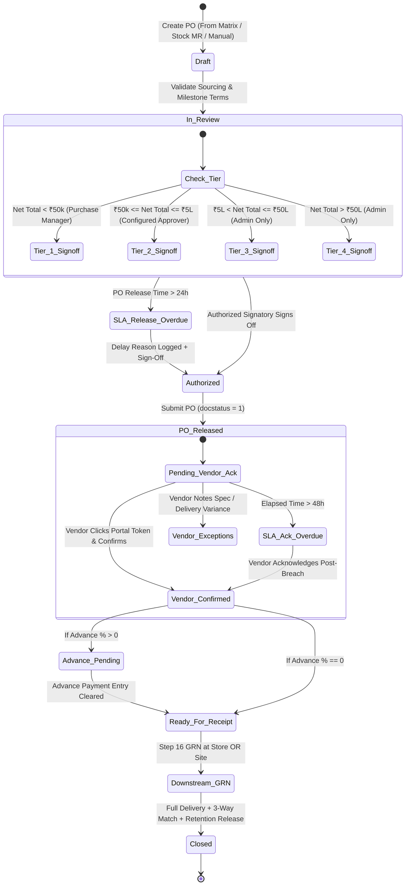

# STEP_15_PURCHASE_ORDER_AUTHORIZATION_SPECIFICATION.caveman.md

# Enterprise Lifecycle Step Specification: Purchase Order Authorization, Solar Milestone Terms & Multi-Location Delivery Routing

**Document ID:** `STEP-15-PURCHASE-ORDER-AUTHORIZATION`  
**Lifecycle Flow:** Flow 2: SCM, Store, Purchase & Vendor Procurement Lifecycle (Step 04 of 08 / Global Step 15)  
**Governing Architecture:** [`architect_docs/02_STEP_PLANNING_SPECIFICATION_BLUEPRINT.md`](../architect_docs/02_STEP_PLANNING_SPECIFICATION_BLUEPRINT.md)  
**Architecture Decision Record:** [`docs/decisions/ADR-015-PURCHASE-ORDER-AUTHORIZATION-MILESTONE-TERMS.md`](../docs/decisions/ADR-015-PURCHASE-ORDER-AUTHORIZATION-MILESTONE-TERMS.md)  
**PRD / FRS Traceability:** [`planning_ref_docs/01_PROJECT_FOUNDATION_MODEL.md`](../planning_ref_docs/01_PROJECT_FOUNDATION_MODEL.md) (`BC-13`, `BC-14`), [`planning_ref_docs/03_TO_BE_BUSINESS_PROCESS.md`](../planning_ref_docs/03_TO_BE_BUSINESS_PROCESS.md) (`Gate 9`), [`planning_ref_docs/04_GAP_ANALYSIS_FIT_GAP.md`](../planning_ref_docs/04_GAP_ANALYSIS_FIT_GAP.md) (`Gap #06`, `Gap #07`), [`planning_ref_docs/05_BUSINESS_REQUIREMENTS_DOCUMENT.md`](../planning_ref_docs/05_BUSINESS_REQUIREMENTS_DOCUMENT.md) (`BR-013`, `BR-014`, `BR-017`, `BR-018`), [`planning_ref_docs/06_FUNCTIONAL_REQUIREMENTS_SPECIFICATION.md`](../planning_ref_docs/06_FUNCTIONAL_REQUIREMENTS_SPECIFICATION.md) (`FR-014`), [`planning_ref_docs/08_DATABASE_DESIGN_DOCUMENT.md`](../planning_ref_docs/08_DATABASE_DESIGN_DOCUMENT.md) (`Domain 7: SCM`), [`planning_ref_docs/09_API_DESIGN_AND_INTEGRATIONS.md`](../planning_ref_docs/09_API_DESIGN_AND_INTEGRATIONS.md) (`API 11`), [`planning_ref_docs/10_UI_UX_SPECIFICATION.md`](../planning_ref_docs/10_UI_UX_SPECIFICATION.md) (`Screen 18`), [`planning_ref_docs/11_MODULE_FUNCTIONAL_DOCUMENTATION.md`](../planning_ref_docs/11_MODULE_FUNCTIONAL_DOCUMENTATION.md) (`MOD-14`), [`planning_ref_docs/12_GETMYERP_SOLAR_EPC_WHITEPAPER.md`](../planning_ref_docs/12_GETMYERP_SOLAR_EPC_WHITEPAPER.md) (Sec 2, 4.1)  
**Target Module:** `solar_module` / `manoj` (Extends ERPNext `tabPurchase Order`, child table `tabPurchase Order Item`, integrates `tabPayment Schedule`, `tabPayment Terms Template`, introduces `Solar SCM Settings`, and reuses `tabRemark-Delay Log`)  
**Author:** Principal Enterprise Architect  
**Status:** Ready for Implementation

---

## 1. Step Scope, Objectives & Context Traceability

### 1.1 Lifecycle Positioning & Context

Step 15 binding contract release gateway in Solar EPC Procurement Lifecycle (Flow 2). Ingests winning award + landed rates from Step 14 ([`STEP_14_QUOTATION_COMPARISON_MATRIX_SPECIFICATION.md`](./STEP_14_QUOTATION_COMPARISON_MATRIX_SPECIFICATION.md)), creates ERPNext `tabPurchase Order`, enforces 4-tier financial approval matrix, mandates solar milestone terms + retention schedules, sets delivery routing (Central Store vs Direct Site), preconditions Step 16 ([`STEP_16_PURCHASE_RECEIPT_GRN_SPECIFICATION.md`](./STEP_16_PURCHASE_RECEIPT_GRN_SPECIFICATION.md)) barcode serial scan.

```
┌──────────────────────────────────────────────────────────────────────────────────────────────────┐
│                                FLOW 2: SCM PROCUREMENT PIPELINE                                  │
├──────────────────────────────────────────────────────────────────────────────────────────────────┤
│                                                                                                  │
│   [Step 12: Store Material Request] ──▶ Requisitions from Site Indents / Low-Stock Buffer        │
│                 │                                                                                │
│                 ▼                                                                                │
│   [Step 13: Supplier RFQ Dispatch]  ──▶ Multi-vendor solicitation (≥ 3 Suppliers or Justified)   │
│                 │                                                                                │
│                 ▼                                                                                │
│   [Step 14: Quotation Comparison]   ──▶ Landed cost normalization, 100-pt scoring, Non-L1 gate   │
│                 │                                                                                │
│                 ▼                                                                                │
│   ┌──────────────────────────────────────────────────────────────────────────────────────────┐   │
│   │            STEP 15: PURCHASE ORDER AUTHORIZATION & SOLAR MILESTONE TERMS                 │   │
│   ├──────────────────────────────────────────────────────────────────────────────────────────┤   │
│   │ 1. Upstream Sourcing Link: Ingests awarded Comparison Matrix (or authorized stock indent)│   │
│   │ 2. Rate & Spec Lock: Prevents unit rate inflation and component specification tampering  │   │
│   │ 3. Multi-Tier Financial Authority: Enforces 4-tier delegation (Assistant ➔ Manager ➔ MD) │   │
│   │ 4. Solar Milestone Terms: Structures Advance, In-Transit/LR, Post-GRN, and Retention/PBG │   │
│   │ 5. Project Budget Flexibility: Configurable/Optional check; bypasses central replenishment│  │
│   │ 6. Multi-Location Routing: Central Store (Stores-SEPC) vs Direct Site (Site-<Project>)   │   │
│   │ 7. Serial Tracking Precondition: Flags critical solar assets (modules, inverters)        │   │
│   │ 8. 24h PO Release & 48h Vendor Acknowledgment SLA: Passwordless confirmation via token   │   │
│   └──────────────────────────────────────────────────────────────────────────────────────────┘   │
│                 │                                                                                │
│                 ▼                                                                                │
│   [Step 16: Multi-Location Barcode GRN] ──▶ 100% 2D barcode scan at Store OR Working Site        │
│                                                                                                  │
└──────────────────────────────────────────────────────────────────────────────────────────────────┘
```

- **Predecessors:** Step 14 Quotation Comparison Matrix; Step 12 Store Material Request (for central replenishment).
- **Successors:** Step 16 Multi-Location Barcode GRN (`tabPurchase Receipt`), Step 17 3-Way Match (`tabPurchase Invoice`), Step 18 Payment Desk (`tabPayment Entry`).

### 1.2 Multi-Mode Operational Architecture

1. **Project-Specific Procurement:** High-value capital items (modules, inverters, structures) for specific site (`custom_project_ref`).
2. **Consolidated Multi-Project Bulk Buying:** Bulk volume purchasing split across multiple pipelines. Project omitted at PO, assigned at receipt.
3. **Central Inventory Replenishment:** Warehouse safety stock (cables, MC4, hardware) initiated by Store Indent (`STEP_12`).
4. **General Operational Consumables & Services:** Tools, safety gear, subcontracting labor.

### 1.3 Core Business Objectives & Target KPIs

1. **Zero Unauthorized Capital Commitments:** 4-tier financial approval matrix blocks junior buyers from unapproved multi-million orders.
2. **100% Cash Flow & Milestone Protection:** Eliminate front-load payment risk via mandatory milestone terms (Advance, LR/Transit, Post-GRN, Retention/PBG).
3. **Zero Post-Award Rate Inflation:** Programmatically lock PO item rates to evaluated landed rates from Step 14.
4. **Optimized Freight Logistics (Direct-to-Site):** Direct delivery to site (`Site - <Project Code> - SEPC`), cutting intermediate warehouse handling and double freight (saving ₹40k–₹80k/project).
5. **Sub-24h PO Release & 48h Vendor Confirmation:** Automated SLA timers protect statutory DISCOM synchronization deadlines (Stage 10).

### 1.4 Context Traceability Matrix

| Reference Document                 | Section / ID                                     | Requirement Traceability in Step 15                                  |
| :--------------------------------- | :----------------------------------------------- | :------------------------------------------------------------------- |
| **Project Foundation Model**       | `BC-13`, `BC-14` (PO & GRN Governance)           | Commercial terms, delivery schedules, multi-location routing.        |
| **Business Requirements Document** | `BR-013`, `BR-014` (PO Release & Store/Site GRN) | Contract release, flexible store/site destinations, milestone terms. |
| **Functional Requirements Spec**   | `FR-014` (PO & Multi-Location GRN)               | Screen controls, financial authority matrix, warehouse designation.  |
| **Gap Analysis & Fit-Gap**         | `Gap #06`, `Gap #07` (PO Authorization & GRN)    | Financial approval gates, milestone terms, delivery routing.         |
| **Database Design Document**       | `Domain 7: SCM` (`tabPurchase Order`)            | Schema for PO attributes, payment milestone schedule, SLA log.       |
| **API Design & Integrations**      | `API 11` (`solar_module.api.procurement.*`)      | Endpoints for PO create, authorize sign-off, vendor portal ack.      |
| **UI/UX Specification**            | `Screen 18` (PO Authorization Hub)               | Desk form layout, tier banners, milestone schedule view.             |
| **Module SOP Suite**               | `MOD-14` (PO Placement & SCM Terms)              | SOP for drafting, approval routing, vendor dispatch.                 |
| **Executive Governance**           | `BR-017`, `BR-018` (SLA & Notifications)         | 24h release SLA, 48h vendor ack countdown, Redis daemon.             |

---

## 2. Stakeholders, Enterprise Actors & HRMS Role Mapping

### 2.1 Enterprise User Roles Matrix

Strict Zero "User" Suffix Rule applied:

| Persona / Business Actor           | Frappe System Role                     | HRMS Department        | HRMS Designation              | Operational Responsibilities                                                 |
| :--------------------------------- | :------------------------------------- | :--------------------- | :---------------------------- | :--------------------------------------------------------------------------- |
| **Procurement Line Executive**     | `Purchase Assistant`                   | Purchase & SCM         | `Purchase Executive`          | Converts matrix to PO draft, attaches delivery terms (cannot submit PO).     |
| **Head of Procurement**            | `Purchase Manager`                     | Purchase & SCM         | `Purchase Manager`            | Exclusive Tier 1 submit (< ₹50k), Tier 2 approver if configured, schedules.  |
| **Finance & Accounts Head**        | `Accounts Manager`                     | Finance & Accounts     | `Accounts Manager`            | Tier 2 approver if configured; validates cash-flow, executes disbursements.  |
| **Site Technical Requisitioner**   | `Site Supervisor` / `Project Engineer` | Engineering Operations | `Site Supervisor`             | Verifies site readiness, confirms target site warehouse for direct delivery. |
| **Warehouse Logistics Head**       | `Store Manager`                        | Store & Inventory      | `Warehouse Manager`           | Confirms central warehouse staging or approves direct-to-site routing.       |
| **External Vendor Representative** | `Supplier`                             | External Entity        | `Vendor Sales Representative` | Acknowledges PO dates, specs, terms via portal (`/solar/po-portal/:token`).  |
| **Solar EPC Director / Admin**     | `Admin`                                | Executive Management   | `Managing Director`           | Supreme command; exclusive Tier 3 & Tier 4 sign-off (> ₹5L), manages SCM.    |
| **Framework Supreme / Developer**  | `System Manager`                       | Information Technology | `DevOps Engineer / Architect` | Bench CLI, custom fixtures, Redis queues. Supreme over `Admin`.              |

### 2.2 Permission Hierarchy Matrix

| DocType / Action                   | Purchase Assistant |  Purchase Manager   |  Accounts Manager   | Store Manager |     Admin\*      | External Supplier |
| :--------------------------------- | :----------------: | :-----------------: | :-----------------: | :-----------: | :--------------: | :---------------: |
| **Purchase Order (Read)**          |     All Active     |     All Active      |     All Active      |  All Active   |   All Records    |  Own Orders Only  |
| **Purchase Order (Create/Edit)**   |    Yes (Draft)     |         Yes         |         No          |      No       |   All Records    |     No Access     |
| **Purchase Order (Tier 1 Submit)** |         No         |  **Yes (< ₹50k)**   |         No          |      No       |     **Yes**      |        No         |
| **Purchase Order (Tier 2 Submit)** |         No         | **Config Approver** | **Config Approver** |      No       |     **Yes**      |        No         |
| **Purchase Order (Tier 3 Submit)** |         No         |         No          |         No          |      No       | **Yes (> ₹5L)**  |        No         |
| **Purchase Order (Tier 4 Submit)** |         No         |         No          |         No          |      No       | **Yes (> ₹50L)** |        No         |
| **Payment Schedule (Edit)**        |     Yes (Pre)      |         Yes         |         Yes         |      No       |       Yes        |     No Access     |
| **Vendor Digital Ack (Portal)**    |         No         |         No          |         No          |      No       |        No        | **Portal Token**  |
| **Remark-Delay Log (Write)**       |        Own         |         Own         |         Own         |      Own      |   Full Access    |     No Access     |
| **Solar SCM Settings (Write)**     |         No         |         No          |         No          |      No       |  **Yes (Only)**  |     No Access     |

_\*Frappe `Administrator` and `System Manager` sit at system apex._

---

## 3. Relational Schema & 3NF Data Dictionary

### 3.1 Core DocType Extensions: `tabPurchase Order`

| Fieldname                             | Label                        | Fieldtype    | Options / Target                                                                                                                       | Mandatory |    Index     | Description & Validation Rules                                              |
| :------------------------------------ | :--------------------------- | :----------- | :------------------------------------------------------------------------------------------------------------------------------------- | :-------: | :----------: | :-------------------------------------------------------------------------- |
| `custom_comparison_matrix_ref`        | Quotation Comparison Matrix  | `Link`       | `Quotation Comparison Matrix`                                                                                                          |    No     | **Index: 1** | Links Step 14 award matrix. Mandatory if not central stock / single source. |
| `custom_awarded_quotation_ref`        | Awarded Supplier Quotation   | `Link`       | `Supplier Quotation`                                                                                                                   |    No     | **Index: 1** | Winning supplier quote reference.                                           |
| `custom_material_request_ref`         | Material Request Reference   | `Link`       | `Material Request`                                                                                                                     |    No     | **Index: 1** | Originating store/site indent.                                              |
| `custom_is_single_source`             | Is Single Source?            | `Check`      | -                                                                                                                                      |    No     |      -       | If 1, skips matrix link with attached justification.                        |
| `custom_po_classification`            | PO Classification            | `Select`     | `Project-Specific Solar Equipment\nMulti-Project Consolidated Bulk\nCentral Inventory Replenishment\nConsumables & Hardware\nServices` |  **Yes**  | **Index: 1** | Dictates if project budget check applies. Defaults to first.                |
| `custom_project_ref`                  | Solar Project Reference      | `Link`       | `Project`                                                                                                                              |    No     | **Index: 1** | Solar project reference. Mandatory if project-specific.                     |
| `custom_sales_order_ref`              | Sales Order Reference        | `Link`       | `Sales Order`                                                                                                                          |    No     | **Index: 1** | Commercial baseline anchor.                                                 |
| `custom_delivery_location_type`       | Delivery Destination Type    | `Select`     | `Central Store Warehouse\nDirect Site Warehouse`                                                                                       |  **Yes**  |      -       | Determines physical delivery destination for Step 16 GRN.                   |
| `custom_target_site_warehouse`        | Target Site Warehouse        | `Link`       | `Warehouse`                                                                                                                            |    No     |      -       | Site warehouse (`Site - <Code> - SEPC`) if Direct-to-Site.                  |
| `custom_authorization_tier`           | Financial Authorization Tier | `Select`     | `Tier 1: Up to ₹50,000\nTier 2: Up to ₹5,00,000\nTier 3: Up to ₹50,00,000\nTier 4: Above ₹50,00,000`                                   |  **Yes**  |      -       | Dynamic from Net Total; dictates required signatory role.                   |
| `custom_authorized_by`                | Sign-off Approver            | `Link`       | `User`                                                                                                                                 |    No     |      -       | Approver user ID who authorized PO.                                         |
| `custom_authorized_on`                | Sign-off Timestamp           | `Datetime`   | -                                                                                                                                      |    No     |      -       | Timestamp of managerial sign-off.                                           |
| `custom_authorization_remarks`        | Authorization Remarks        | `Small Text` | -                                                                                                                                      |    No     |      -       | Approver sign-off commentary.                                               |
| `custom_advance_pct`                  | Advance Payment (%)          | `Percent`    | -                                                                                                                                      |    No     |      -       | Advance percentage (e.g. 15.00%).                                           |
| `custom_advance_amount`               | Advance Amount Payable       | `Currency`   | `Company:currency`                                                                                                                     |    No     |      -       | $\text{Grand Total} \times (\text{custom\_advance\_pct} / 100)$.            |
| `custom_advance_cleared`              | Advance Payment Cleared?     | `Check`      | -                                                                                                                                      |    No     |      -       | 1 upon submission of Advance `Payment Entry`.                               |
| `custom_advance_payment_ref`          | Advance Payment Entry        | `Link`       | `Payment Entry`                                                                                                                        |    No     |      -       | Accounting disbursement link.                                               |
| `custom_retention_pct`                | Retention / Warranty (%)     | `Percent`    | -                                                                                                                                      |    No     |      -       | Security percentage (e.g. 5.00%).                                           |
| `custom_retention_due_event`          | Retention Release Trigger    | `Select`     | `On Grid Synchronization (COD)\nOn Final Acceptance Test (FAT)\nAgainst Performance Bank Guarantee (PBG)`                              |    No     |      -       | Event unlocking retention disbursement.                                     |
| `custom_liquidated_damages_clause`    | Enforce Liquidated Damages?  | `Check`      | -                                                                                                                                      |    No     |      -       | If 1, binds supplier to 0.5%/week delay penalty (max 5%).                   |
| `custom_portal_token`                 | Vendor Acknowledgment Token  | `Data`       | -                                                                                                                                      |    No     | **Index: 1** | Random 256-bit UUID token for vendor ack.                                   |
| `custom_vendor_acknowledgment_status` | Vendor Confirmation Status   | `Select`     | `Pending Acknowledgment\nAcknowledged & Confirmed\nExceptions Raised`                                                                  |  **Yes**  | **Index: 1** | External vendor confirmation status. Defaults to pending.                   |
| `custom_vendor_ack_date`              | Acknowledged On              | `Datetime`   | -                                                                                                                                      |    No     |      -       | Timestamp when vendor confirmed terms.                                      |
| `custom_sla_deadline`                 | PO Release / Vendor Ack SLA  | `Datetime`   | -                                                                                                                                      |  **Yes**  | **Index: 1** | Target datetime (`creation + 24h` release; `submit + 48h` ack).             |
| `custom_sla_status`                   | SLA Performance Status       | `Select`     | `\nOn Time\nOverdue`                                                                                                                   |    No     |      -       | Managed by background SLA daemon.                                           |
| `custom_delay_reason_table`           | Delay Audit Log              | `Table`      | `Remark-Delay Log`                                                                                                                     |    No     |      -       | Required if submitting or acknowledging while Overdue.                      |

### 3.2 Child DocType Extensions: `tabPurchase Order Item`

| Fieldname                         | Label                          | Fieldtype  | Options / Target            | Mandatory | Description & Integrity Rules                                          |
| :-------------------------------- | :----------------------------- | :--------- | :-------------------------- | :-------: | :--------------------------------------------------------------------- |
| `custom_comparison_item_ref`      | Comparison Item Reference      | `Link`     | `Quotation Comparison Item` |    No     | Evaluated item row from Step 14.                                       |
| `custom_technical_specs_frozen`   | Frozen Technical Specification | `Text`     | -                           |    No     | Wattage, technology, dimensions frozen at award.                       |
| `custom_landed_rate_awarded`      | Awarded Landed Unit Rate       | `Currency` | `Company:currency`          |    No     | Approved landed rate. Assert: `rate <= custom_landed_rate_awarded`.    |
| `custom_promised_delivery_date`   | Promised Delivery Date         | `Date`     | -                           |  **Yes**  | Guaranteed delivery date from quote.                                   |
| `custom_requires_barcode_serials` | Requires 2D Barcode Serials?   | `Check`    | -                           |    No     | 1 for modules/inverters; mandates SABB in Step 16 GRN.                 |
| `custom_target_warehouse`         | Target Delivery Warehouse      | `Link`     | `Warehouse`                 |  **Yes**  | Inherited from routing (`Stores - SEPC` or `Site - <Project> - SEPC`). |

### 3.3 Governance Single DocType: `tabSolar SCM Settings`

| Fieldname                         | Label                              | Fieldtype  |      Default       | Description & Operational Impact                                              |
| :-------------------------------- | :--------------------------------- | :--------- | :----------------: | :---------------------------------------------------------------------------- |
| `tier_1_limit`                    | Tier 1 Financial Limit (INR)       | `Currency` |       50000        | Threshold for Tier 1 (< ₹50,000, `Purchase Manager` only).                    |
| `tier_2_limit`                    | Tier 2 Financial Limit (INR)       | `Currency` |       500000       | Ceiling for Tier 2 (₹50k - ₹5L).                                              |
| `tier_2_approver_role`            | Tier 2 Active Approver Role        | `Select`   | `Purchase Manager` | Configurable single role: `Purchase Manager`, `Accounts Manager`, or `Admin`. |
| `tier_3_limit`                    | Tier 3 Financial Limit (INR)       | `Currency` |      5000000       | Ceiling for Tier 3 (> ₹5L to ₹50L, `Admin` only).                             |
| `enforce_project_bom_ceiling`     | Enforce Project BOM Ceiling Gate   | `Check`    |         0          | **Configurable Option:** 1 hard-blocks POs exceeding Proposal BOM.            |
| `bom_overage_tolerance_pct`       | Allowed BOM Overage Buffer (%)     | `Percent`  |        5.00        | Tolerance margin (%) permitted when ceiling is active.                        |
| `po_release_sla_hours`            | PO Release SLA Window (Hours)      | `Int`      |         24         | Turnaround SLA from Matrix submit to PO release.                              |
| `vendor_acknowledgment_sla_hours` | Vendor Acknowledgment Window (Hrs) | `Int`      |         48         | Turnaround SLA from PO release to vendor digital sign-off.                    |
| `enable_whatsapp_vendor_dispatch` | Auto-Dispatch PO Link via WhatsApp | `Check`    |         1          | Sends PDF + portal token to vendor mobile on submit.                          |

---

## 4. State Machine, Verification Gates & SLA Engine

### 4.1 State Machine Lifecycle



### 4.2 Verification Gates

- **Gate 1: Upstream Sourcing Link & Landed Rate Integrity:**
  - Capital solar POs require submitted `Quotation Comparison Matrix` (`docstatus = 1`, `evaluation_status = 'Award Approved'`) or single-source justification ($\ge 30$ chars).
  - Item unit rate cannot exceed awarded landed rate ($\text{rate} \le \text{custom\_landed\_rate\_awarded}$).
- **Gate 2: Multi-Tier Financial Authority Delegation:**
  - Net total $< \text{Tier 1}$ (< ₹50k): Exclusively `Purchase Manager` (frontline `Purchase Assistant` drafts only, cannot submit).
  - Net total $\le \text{Tier 2}$ (₹50k - ₹5L): Designated single role in `Solar SCM Settings.tier_2_approver_role` (`Purchase Manager`, `Accounts Manager`, or `Admin`).
  - Net total $\le \text{Tier 3}$ (> ₹5L - ₹50L): Exclusively **`Admin`** (Project Supreme Command).
  - Net total $> \text{Tier 3}$ (> ₹50L): Exclusively **`Admin`** (Project Supreme Command).
- **Gate 3: Solar Milestone Payment Schedule & Retention:**
  - Capital solar equipment requires $\ge 2$ milestone rows in `tabPayment Schedule`. Generic immediate terms prohibited.
  - Advance tranche matches `custom_advance_amount`. Retention tranche tied to COD/PBG.
- **Gate 4: Configurable Project Budget & Commercial BOM Check (Optional):**
  - Bypassed for central replenishment, consolidated multi-project, and non-project orders.
  - When project linked, governed by `enforce_project_bom_ceiling` in `Solar SCM Settings`:
    - _If 1:_ Asserts cumulative ordered qty $\le \text{Proposal BOM Qty} \times (1 + \text{Tolerance})$.
    - _If 0 (Default):_ Displays soft warning badge in Desk without blocking.
- **Gate 5: Multi-Location Delivery Routing & Barcode Serialization:**
  - Direct site routing requires active site warehouse (`Site - <Code> - SEPC`).
  - Serialized items automatically flagged with `custom_requires_barcode_serials = 1` for Step 16 SABB scanning.
- **Gate 6: Vendor Digital Confirmation:**
  - Submitting generates 256-bit token; vendor confirms delivery dates at `/solar/po-portal/:token`.

### 4.3 SLA Engine & Delay Audit

- **PO Release SLA (24h):** From Matrix approval to PO release. Monitored by `solar_module.tasks.monitor_po_release_sla`.
- **Vendor Ack SLA (48h):** From PO submission to vendor digital sign-off. Monitored by `solar_module.tasks.monitor_vendor_acknowledgment_sla`.
- **Delay Log Invariant:** Overdue transitions lock document progress until reason is appended to `tabRemark-Delay Log`.

---

## 5. Controller Logic, Domain Services & Whitelisted APIs

### 5.1 Decoupled Service Structure

```
PurchaseOrderController (hooks override)
 ├── PurchaseOrderValidationService (Sourcing, rates, optional BOM ceiling)
 ├── POAuthorizationMatrixService (Tier calculation & role assertion)
 ├── POMilestoneTermsService (Schedule structure, advance, retention)
 ├── POSLAService (24h/48h SLAs, delay logging assertion)
 └── PODispatchBridgeService (Portal token generation, Step 16 handoff)
```

### 5.2 Implementation: `PurchaseOrderValidationService`

```python
# solar_module/services/po_validation_service.py

import frappe
from frappe import _
from frappe.utils import flt, cint

class PurchaseOrderValidationService:
    @staticmethod
    def validate_upstream_sourcing(doc):
        if doc.custom_po_classification in [
            "Project-Specific Solar Equipment",
            "Multi-Project Consolidated Bulk",
        ]:
            if not doc.custom_comparison_matrix_ref and not doc.custom_is_single_source:
                frappe.throw(
                    _("A submitted Quotation Comparison Matrix is required for capital solar procurement. "
                      "If this is a justified single-source purchase, mark 'Is Single Source'."),
                    frappe.ValidationError,
                )

            if doc.custom_is_single_source:
                if not doc.custom_authorization_remarks or len(doc.custom_authorization_remarks.strip()) < 30:
                    frappe.throw(
                        _("Single-source procurement requires detailed justification remarks (minimum 30 characters)."),
                        frappe.ValidationError,
                    )
            elif doc.custom_comparison_matrix_ref:
                matrix_status, docstatus = frappe.db.get_value(
                    "Quotation Comparison Matrix",
                    doc.custom_comparison_matrix_ref,
                    ["evaluation_status", "docstatus"],
                )
                if docstatus != 1 or matrix_status != "Award Approved":
                    frappe.throw(
                        _("Linked Quotation Comparison Matrix {0} must be submitted and 'Award Approved'.").format(
                            doc.custom_comparison_matrix_ref
                        ),
                        frappe.ValidationError,
                    )

    @staticmethod
    def validate_rate_integrity(doc):
        for item in doc.items:
            if item.custom_landed_rate_awarded and flt(item.custom_landed_rate_awarded) > 0:
                if flt(item.rate) > flt(item.custom_landed_rate_awarded):
                    frappe.throw(
                        _("Row #{0}: Item {1} unit rate ({2}) exceeds the approved landed rate ({3}) "
                          "from Quotation Comparison Matrix. Rate inflation is prohibited.").format(
                            item.idx, item.item_code, item.rate, item.custom_landed_rate_awarded
                        ),
                        frappe.ValidationError,
                    )

    @staticmethod
    def validate_project_bom_headroom(doc):
        if not doc.custom_project_ref or doc.custom_po_classification in [
            "Central Inventory Replenishment",
            "Multi-Project Consolidated Bulk",
            "Consumables & Hardware",
        ]:
            return

        settings = frappe.get_cached_doc("Solar SCM Settings")
        if not cint(settings.enforce_project_bom_ceiling):
            return

        tolerance_pct = flt(settings.bom_overage_tolerance_pct, 5.0)

        for item in doc.items:
            proposal_bom_qty = frappe.db.get_value(
                "Quotation Item",
                {"parent": doc.custom_sales_order_ref or "", "item_code": item.item_code},
                "qty",
            )
            if not proposal_bom_qty:
                continue

            existing_ordered = frappe.db.sql(
                """
                SELECT SUM(poi.qty)
                FROM `tabPurchase Order Item` poi
                JOIN `tabPurchase Order` po ON poi.parent = po.name
                WHERE po.custom_project_ref = %s
                  AND poi.item_code = %s
                  AND po.docstatus = 1
                  AND po.name != %s
                """,
                (doc.custom_project_ref, item.item_code, doc.name or ""),
            )[0][0] or 0.0

            max_allowed = flt(proposal_bom_qty) * (1.0 + (tolerance_pct / 100.0))
            if (flt(existing_ordered) + flt(item.qty)) > max_allowed:
                frappe.throw(
                    _("Row #{0}: Total cumulative ordered quantity ({1}) for Item {2} exceeds "
                      "the approved Commercial Proposal BOM ceiling ({3}) plus {4}% tolerance.").format(
                        item.idx,
                        existing_ordered + item.qty,
                        item.item_code,
                        proposal_bom_qty,
                        tolerance_pct,
                    ),
                    frappe.ValidationError,
                )
```

### 5.3 Implementation: `POAuthorizationMatrixService`

```python
# solar_module/services/po_authorization_service.py

import frappe
from frappe import _
from frappe.utils import flt

class POAuthorizationMatrixService:
    @staticmethod
    def calculate_tier(net_total):
        settings = frappe.get_cached_doc("Solar SCM Settings")
        t1 = flt(settings.tier_1_limit, 50000.0)
        t2 = flt(settings.tier_2_limit, 500000.0)
        t3 = flt(settings.tier_3_limit, 5000000.0)

        amount = flt(net_total)
        if amount <= t1:
            return "Tier 1: Up to ₹50,000"
        elif amount <= t2:
            return "Tier 2: Up to ₹5,00,000"
        elif amount <= t3:
            return "Tier 3: Up to ₹50,00,000"
        else:
            return "Tier 4: Above ₹50,00,000"

    @staticmethod
    def assert_authorization_permissions(doc):
        user_roles = frappe.get_roles(frappe.session.user)
        tier = doc.custom_authorization_tier or POAuthorizationMatrixService.calculate_tier(doc.net_total)

        if "System Manager" in user_roles or "Administrator" in user_roles:
            return

        settings = frappe.get_cached_doc("Solar SCM Settings")

        if tier == "Tier 1: Up to ₹50,000":
            required = ["Purchase Manager", "Admin"]
        elif tier == "Tier 2: Up to ₹5,00,000":
            tier_2_role = settings.tier_2_approver_role or "Purchase Manager"
            required = [tier_2_role, "Admin"]
        elif tier == "Tier 3: Up to ₹50,00,000":
            required = ["Admin"]
        else:
            required = ["Admin"]

        if not any(role in user_roles for role in required):
            frappe.throw(
                _("You are not authorized to release this Purchase Order. Required role for {0}: {1}.").format(
                    tier, ", ".join(required)
                ),
                frappe.PermissionError,
            )
```

### 5.4 Whitelisted API Contracts

```python
# solar_module/api/procurement.py

import json
import uuid
import frappe
from frappe import _
from frappe.utils import now_datetime, add_to_date

@frappe.whitelist(methods=["POST"])
def create_purchase_order_from_award(comparison_matrix_name: str) -> dict:
    if not comparison_matrix_name:
        frappe.throw(_("Comparison Matrix name is required."), frappe.ValidationError)

    matrix = frappe.get_doc("Quotation Comparison Matrix", comparison_matrix_name)
    matrix.check_permission("read")

    if matrix.docstatus != 1 or matrix.evaluation_status != "Award Approved":
        frappe.throw(_("Matrix must be submitted and 'Award Approved'."), frappe.ValidationError)

    if matrix.purchase_order_ref:
        frappe.throw(_("Purchase Order {0} has already been created.").format(matrix.purchase_order_ref))

    po = frappe.new_doc("Purchase Order")
    po.supplier = matrix.awarded_supplier
    po.custom_comparison_matrix_ref = matrix.name
    po.custom_awarded_quotation_ref = matrix.awarded_quotation
    po.custom_project_ref = matrix.project_reference
    po.custom_material_request_ref = matrix.material_request_ref
    po.custom_po_classification = "Project-Specific Solar Equipment" if matrix.project_reference else "Central Inventory Replenishment"
    po.custom_delivery_location_type = "Direct Site Warehouse" if matrix.project_reference else "Central Store Warehouse"
    po.schedule_date = matrix.target_delivery_date

    for item in matrix.comparison_items:
        if item.supplier == matrix.awarded_supplier:
            po.append("items", {
                "item_code": item.item_code,
                "item_name": item.item_name,
                "qty": item.qty,
                "uom": item.uom,
                "rate": item.basic_rate,
                "schedule_date": add_to_date(now_datetime(), days=item.promised_lead_days),
                "custom_comparison_item_ref": item.name,
                "custom_landed_rate_awarded": item.landed_rate_unit,
                "custom_promised_delivery_date": add_to_date(now_datetime(), days=item.promised_lead_days),
                "custom_requires_barcode_serials": 1 if frappe.db.get_value("Item", item.item_code, "has_serial_no") else 0,
            })

    po.custom_sla_deadline = add_to_date(now_datetime(), hours=24)
    po.custom_sla_status = "On Time"
    po.insert()

    matrix.db_set("purchase_order_ref", po.name)
    matrix.db_set("evaluation_status", "PO Created")

    return {
        "status": "success",
        "purchase_order": po.name,
        "message": _("Purchase Order {0} drafted successfully.").format(po.name),
    }

@frappe.whitelist(methods=["POST"])
def acknowledge_vendor_purchase_order(token: str, acknowledgment_status: str, notes: str = None) -> dict:
    if not token:
        frappe.throw(_("Security token is required."), frappe.ValidationError)

    po_name = frappe.db.get_value("Purchase Order", {"custom_portal_token": token}, "name")
    if not po_name:
        frappe.throw(_("Invalid or expired authorization token."), frappe.PermissionError)

    po = frappe.get_doc("Purchase Order", po_name)
    if po.docstatus != 1:
        frappe.throw(_("Purchase Order is not in a submitted state."), frappe.ValidationError)

    po.custom_vendor_acknowledgment_status = acknowledgment_status
    po.custom_vendor_ack_date = now_datetime()
    if notes:
        po.add_comment("Comment", _("Vendor Acknowledgment Note: {0}").format(notes))
    po.save(ignore_permissions=True)

    return {
        "status": "success",
        "po_name": po.name,
        "acknowledgment_status": po.custom_vendor_acknowledgment_status,
        "message": _("Thank you. Purchase Order acknowledgment recorded successfully."),
    }
```

---

## 6. Frontend UI/UX Specification

### 6.1 Frappe Desk Form View (`Purchase Order`)

- **Header Badges:** `[Tier 1 / 2 / 3 / 4]` indicator; SLA indicator (`On Time` / `Overdue`); Vendor confirmation status.
- **Section Breaks:**
  1. _Sourcing & Project Classification:_ Matrix link, Single-source toggle, Project link, Classification.
  2. _Delivery Logistics & Routing:_ Delivery type (Central vs Site), Target warehouse, Required-by date.
  3. _Line Items:_ Quantities, Landed limits, Promised delivery dates, Serial required checkbox.
  4. _Solar Milestone Schedule:_ Advance %, Retention %, Tranche rows (Advance, LR, GRN, Retention).
  5. _Authorization Sign-off:_ Approver link, Sign-off timestamp, Remarks.

### 6.2 Vendor Confirmation Portal (`/solar/po-portal/:token`)

- Responsive mobile-friendly card showing PO details, milestone schedule, and delivery dates.
- One-click confirmation buttons: `[Confirm & Accept]` vs `[Raise Exceptions]`.

---

## 7. Cross-App Integration Touchpoints

- **ERPNext Buying & Accounts:** `tabPurchase Order` creates financial commitments. Primary button `[Create Advance Payment]` creates draft `tabPayment Entry`.
- **ERPNext Stock & Projects:** Sets warehouse routing. Direct site delivery sets accepted warehouse to `Site - <Project> - SEPC`.
- **Step 16 GRN Bridge:** Propagates `custom_requires_barcode_serials` to `Purchase Receipt Item` to force SABB 2D barcode scan.

---

## 8. Automated Testing & QA Criteria

### 8.1 Zero-Commit Integration Test Suite

Zero `frappe.db.commit()` calls; all tests inherit `FrappeTestCase` and rollback automatically.

```python
# solar_module/tests/test_step_15_purchase_order.py

import frappe
from frappe.tests.utils import FrappeTestCase
from frappe.utils import now_datetime, add_to_date, flt
from solar_module.services.po_validation_service import PurchaseOrderValidationService
from solar_module.services.po_authorization_service import POAuthorizationMatrixService

class TestStep15PurchaseOrder(FrappeTestCase):
    def setUp(self):
        super().setUp()
        self.supplier = "_Test Solar Supplier"
        self.item_code = "_Test Solar Module 545W"

    def test_gate_1_upstream_comparison_matrix_enforced(self):
        po = frappe.new_doc("Purchase Order")
        po.supplier = self.supplier
        po.custom_po_classification = "Project-Specific Solar Equipment"
        po.schedule_date = add_to_date(now_datetime(), days=7)
        po.append("items", {"item_code": self.item_code, "qty": 100, "rate": 18.50})
        self.assertRaises(frappe.ValidationError, po.insert)

    def test_gate_1_rate_inflation_prevention(self):
        po = frappe.new_doc("Purchase Order")
        po.supplier = self.supplier
        po.custom_po_classification = "Central Inventory Replenishment"
        po.schedule_date = add_to_date(now_datetime(), days=7)
        po.append("items", {
            "item_code": self.item_code,
            "qty": 50,
            "rate": 22.00,
            "custom_landed_rate_awarded": 19.50,
        })
        self.assertRaises(frappe.ValidationError, po.insert)

    def test_gate_2_financial_authority_tier_enforcement(self):
        po = frappe.new_doc("Purchase Order")
        po.supplier = self.supplier
        po.custom_po_classification = "Central Inventory Replenishment"
        po.schedule_date = add_to_date(now_datetime(), days=7)
        po.append("items", {"item_code": self.item_code, "qty": 3000, "rate": 2000.00})
        po.insert()

        frappe.set_user("purchase_assistant@example.com")
        self.assertRaises(frappe.PermissionError, po.submit)
        frappe.set_user("Administrator")

    def test_gate_4_central_replenishment_bypasses_project_bom_check(self):
        po = frappe.new_doc("Purchase Order")
        po.supplier = self.supplier
        po.custom_po_classification = "Central Inventory Replenishment"
        po.schedule_date = add_to_date(now_datetime(), days=7)
        po.append("items", {"item_code": self.item_code, "qty": 10000, "rate": 18.50})
        try:
            PurchaseOrderValidationService.validate_project_bom_headroom(po)
        except frappe.ValidationError:
            self.fail("validate_project_bom_headroom raised error for replenishment!")

    def test_gate_5_direct_site_warehouse_routing(self):
        po = frappe.new_doc("Purchase Order")
        po.supplier = self.supplier
        po.custom_po_classification = "Central Inventory Replenishment"
        po.custom_delivery_location_type = "Direct Site Warehouse"
        po.custom_target_site_warehouse = None
        po.schedule_date = add_to_date(now_datetime(), days=7)
        po.append("items", {"item_code": self.item_code, "qty": 10, "rate": 18.50})
        self.assertRaises(frappe.ValidationError, po.insert)
```

---

## 9. Operational SOP, Error Resolution & Runbook

### 9.1 End-User SOP

- **Purchase Assistant:** Open approved matrix, click `[Generate Purchase Order]`, verify items, select Central Store vs Direct Site warehouse, configure milestone schedule, route to Purchase Manager for release (Purchase Assistant drafts only, cannot submit).
- **Purchase Manager / Approvers:** Review linked matrix, verify advance %, sign off remarks, click `[Authorize & Submit PO]`.

### 9.2 Operator Error Resolution Table

| Error Message Displayed                                                | Root Cause                                                     | Operator Resolution                                                                       |
| :--------------------------------------------------------------------- | :------------------------------------------------------------- | :---------------------------------------------------------------------------------------- |
| `A submitted Quotation Comparison Matrix is required...`               | PO drafted for capital solar equipment without matrix link.    | Link approved matrix or mark `Is Single Source` with $\ge 30$ char remark.                |
| `Unit rate exceeds approved landed rate...`                            | Basic price entered higher than awarded landed rate.           | Reduce unit rate to match or remain below approved landed rate.                           |
| `You are not authorized to release this Purchase Order...`             | Current user lacks required financial delegation role.         | Assign document to `Purchase Manager` (T1), Configured Approver (T2), or `Admin` (T3/T4). |
| `Generic payment terms are prohibited...`                              | Single immediate payment term entered for capital solar goods. | Select structured milestone terms template.                                               |
| `Cumulative ordered quantity exceeds approved Proposal BOM ceiling...` | Project-linked PO exceeds proposal quantity + tolerance.       | Reduce quantity or adjust tolerance in `Solar SCM Settings`.                              |
| `Direct Site Warehouse routing requires a valid site warehouse...`     | Direct site selected but site warehouse empty.                 | Select active site warehouse (`Site - <Code> - SEPC`).                                    |
| `SLA Status is Overdue. Delay justification required...`               | 24h release or 48h vendor ack SLA breached.                    | Enter reason and remarks in `Delay Audit Log` before saving.                              |

### 9.3 L3 DevOps Runbook

```bash
# Check notification queue
bench --site <site_name> execute frappe.db.get_value --args "['Email Queue', {'reference_name': 'PUR-ORD-2026-00084'}, ['name', 'status', 'error']]"

# Run background SLA daemon manually
bench --site <site_name> execute solar_module.tasks.monitor_po_release_sla

# Check active database transactions
bench mariadb -e "SHOW FULL PROCESSLIST;"
```
