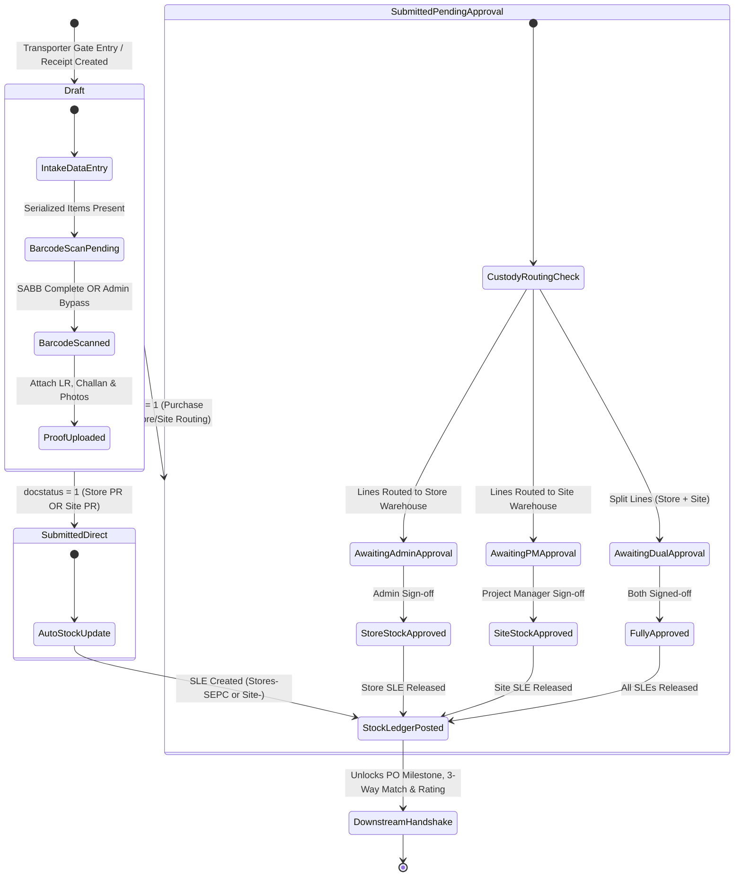
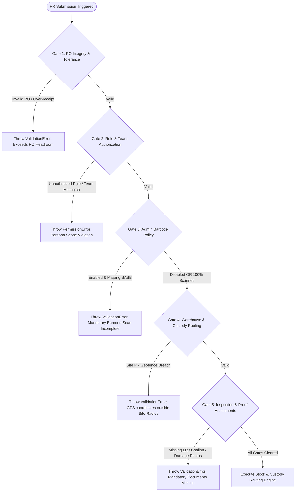

# STEP_16_PURCHASE_RECEIPT_GRN_SPECIFICATION.caveman.md

# Enterprise Lifecycle Step Specification: Multi-Location Barcode Purchase Receipt (GRN) & Tri-Party Custody Approval Architecture

**Document ID:** `STEP-16-PURCHASE-RECEIPT-GRN`  
**Lifecycle Flow:** Flow 2: SCM, Store, Purchase & Vendor Procurement Lifecycle (Step 05 of 08 / Global Step 16)  
**Governing Architecture:** [`architect_docs/02_STEP_PLANNING_SPECIFICATION_BLUEPRINT.md`](../architect_docs/02_STEP_PLANNING_SPECIFICATION_BLUEPRINT.md)  
**Architecture Decision Record:** [`docs/decisions/ADR-016-MULTI-LOCATION-PURCHASE-RECEIPT-BARCODE-GRN.md`](../docs/decisions/ADR-016-MULTI-LOCATION-PURCHASE-RECEIPT-BARCODE-GRN.md)  
**PRD / FRS Traceability:** [`planning_ref_docs/01_PROJECT_FOUNDATION_MODEL.md`](../planning_ref_docs/01_PROJECT_FOUNDATION_MODEL.md) (`BC-13`, `BC-14`), [`planning_ref_docs/03_TO_BE_BUSINESS_PROCESS.md`](../planning_ref_docs/03_TO_BE_BUSINESS_PROCESS.md) (`Step 05`, `Gate 9`), [`planning_ref_docs/04_GAP_ANALYSIS_FIT_GAP.md`](../planning_ref_docs/04_GAP_ANALYSIS_FIT_GAP.md) (`Gap #07`), [`planning_ref_docs/05_BUSINESS_REQUIREMENTS_DOCUMENT.md`](../planning_ref_docs/05_BUSINESS_REQUIREMENTS_DOCUMENT.md) (`BR-011`, `BR-014`, `BR-016`, `BR-017`, `BR-018`), [`planning_ref_docs/06_FUNCTIONAL_REQUIREMENTS_SPECIFICATION.md`](../planning_ref_docs/06_FUNCTIONAL_REQUIREMENTS_SPECIFICATION.md) (`FR-014`, `FR-015`, `FR-016`), [`planning_ref_docs/08_DATABASE_DESIGN_DOCUMENT.md`](../planning_ref_docs/08_DATABASE_DESIGN_DOCUMENT.md) (`Domain 7: SCM`), [`planning_ref_docs/09_API_DESIGN_AND_INTEGRATIONS.md`](../planning_ref_docs/09_API_DESIGN_AND_INTEGRATIONS.md) (`API 11`), [`planning_ref_docs/10_UI_UX_SPECIFICATION.md`](../planning_ref_docs/10_UI_UX_SPECIFICATION.md) (`Screen 18`), [`planning_ref_docs/11_MODULE_FUNCTIONAL_DOCUMENTATION.md`](../planning_ref_docs/11_MODULE_FUNCTIONAL_DOCUMENTATION.md) (`MOD-14`, `MOD-15`), [`planning_ref_docs/12_GETMYERP_SOLAR_EPC_WHITEPAPER.md`](../planning_ref_docs/12_GETMYERP_SOLAR_EPC_WHITEPAPER.md) (Sec 2, 4.1)  
**Target Module:** `solar_module` / `manoj` (Extends ERPNext `tabPurchase Receipt`, child table `tabPurchase Receipt Item`, integrates `tabSerial and Batch Bundle`, `tabSerial No`, `tabStock Ledger Entry`, introduces `tabSolar SCM Settings`, reuses `tabRemark-Delay Log`)  
**Author:** Principal Enterprise Architect  
**Status:** Ready for Implementation

---

## 1. Step Scope, Objectives & Context Traceability

### 1.1 Lifecycle Positioning & Context

Step 16 physical receiving, serialized asset ingestion, inventory custody gateway in Solar EPC Procurement Lifecycle (Flow 2). Downstream of Step 15 ([`STEP_15_PURCHASE_ORDER_AUTHORIZATION_SPECIFICATION.md`](./STEP_15_PURCHASE_ORDER_AUTHORIZATION_SPECIFICATION.md)). Verifies shipments vs vendor challan + transporter LR. Enforces Admin-controlled 2D barcode scan (SABB) for modules/inverters. Implements differential stock updates across 3 personas: Store Team, Site Team, Purchase Team.

```
┌──────────────────────────────────────────────────────────────────────────────────────────────────┐
│                                FLOW 2: SCM PROCUREMENT PIPELINE                                  │
├──────────────────────────────────────────────────────────────────────────────────────────────────┤
│                                                                                                  │
│   [Step 12: Store Material Request] ──▶ Requisitions from Site Indents / Low-Stock Buffer        │
│                 │                                                                                │
│                 ▼                                                                                │
│   [Step 13: Supplier RFQ Dispatch]  ──▶ Multi-vendor solicitation (≥ 3 Suppliers or Justified)   │
│                 │                                                                                │
│                 ▼                                                                                │
│   [Step 14: Quotation Comparison]   ──▶ Landed cost normalization, 100-pt scoring, Non-L1 gate   │
│                 │                                                                                │
│                 ▼                                                                                │
│   [Step 15: Purchase Order Placement] ─▶ 4-Tier authorization, milestone terms, delivery routing │
│                 │                                                                                │
│                 ▼                                                                                │
│   ┌──────────────────────────────────────────────────────────────────────────────────────────┐   │
│   │             STEP 16: MULTI-LOCATION BARCODE PURCHASE RECEIPT (GRN)                       │   │
│   ├──────────────────────────────────────────────────────────────────────────────────────────┤   │
│   │ 1. Tri-Party Persona Intake: Store Team, Site Team, or Purchase Team Receiving           │   │
│   │ 2. Admin-Controllable Barcode Policy: Enable/Disable toggle in Solar SCM Settings        │   │
│   │ 3. Store PR: Defaults to Stores-SEPC (changeable), automatic Stock Ledger update         │   │
│   │ 4. Site PR: Direct receipt at Site-<Project>, automatic Site Stock Ledger update         │   │
│   │ 5. Purchase PR: Flexible line routing (Store vs Site). Requires Admin approval for Store │   │
│   │    stock update, and Project Manager approval for Site stock entry verification          │   │
│   │ 6. 100% 2D Barcode Serialization: Frappe v15 SABB engine for modules and inverters      │   │
│   │ 7. Quality Inspection Split: Accepted vs Rejection warehouse routing with photo proof    │   │
│   │ 8. Downstream Automated Triggers: Step 17 (3-Way Match), Step 18 (Milestone Tranche),    │   │
│   │    Step 19 (Vendor Scorecard), Flow 1 Stage 08/09/11 (DPR & Asset Register)             │   │
│   └──────────────────────────────────────────────────────────────────────────────────────────┘   │
│                 │                                                                                │
│                 ├────────────────────────────────┬───────────────────────────────┐               │
│                 ▼                                ▼                               ▼               │
│   [Step 17: 3-Way Match PI]        [Step 18: Payment Workbench]     [Step 19: Vendor Rating]     │
│   PO vs GRN vs PI validation       Milestone tranche disbursement   OTD & Quality Scorecard      │
│                                                                                                  │
└──────────────────────────────────────────────────────────────────────────────────────────────────┘
```

- **Predecessors:** Step 15 Purchase Order Authorization (`tabPurchase Order`).
- **Successors:** Step 17 3-Way Match (`tabPurchase Invoice`), Step 18 Payment Workbench (`tabPayment Entry`), Step 19 Vendor Rating (`tabVendor Rating`), Flow 1 Stage 08 (Zone DPR) & Stage 11 (Asset Register).

### 1.2 Core Business Objectives & Target KPIs

1. **Zero Unrecorded Site Deliveries:** Site supervisors record direct site receipts on mobile with GPS geotag; eliminate 2-3 week delay.
2. **Cut Secondary Freight & Demurrage:** Direct delivery of mounting structures and modules to site saves ₹50k-₹100k/project.
3. **100% Serialized Warranty Protection:** Frappe v15 SABB barcode scanning for modules/inverters protects 25y OEM warranties.
4. **Resilient Field Continuity:** Admin toggle enables/disables mandatory barcode scanning when weather or damaged labels block scan.
5. **Absolute Custody Governance:** Purchase PR requires Admin approval for Store lines, Project Manager approval for Site lines.
6. **Sub-24h Turnaround SLA:** Automatic countdown from vehicle gate entry to GRN submission.

### 1.3 Context Traceability Matrix

| Reference Document                 | Section / ID                                     | Requirement Traceability in Step 16                                                                                   |
| :--------------------------------- | :----------------------------------------------- | :-------------------------------------------------------------------------------------------------------------------- |
| **Project Foundation Model**       | `BC-13`, `BC-14` (PO & GRN Governance)           | Goods receipt note execution, flexible receiving at Store or Site, barcode serial ingestion, vendor rating triggers.  |
| **Business Requirements Document** | `BR-014` (Flexible Store / Site GRN)             | Store, Site, or Purchase personnel receipt; barcode serial capture; multi-location routing; enables 3-way matching.   |
| **Functional Requirements Spec**   | `FR-014` (Purchase Order & Multi-Location GRN)   | Screen controls, mobile barcode scanner, accepted/rejected quantities, photo attachments, delivery challan capture.   |
| **Gap Analysis & Fit-Gap**         | `Gap #07` (Flexible Multi-Location GRN)          | Eliminates warehouse receiving bottlenecks by decentralizing GRN with strict custody controls.                        |
| **Database Design Document**       | `Domain 7: SCM` (`tabPurchase Receipt`)          | Relational schema for receiving team, location type, SABB bundles, GPS coordinates, inspection splits, and SLA logs.  |
| **API Design & Integrations**      | `API 11` (`solar_module.api.procurement.*`)      | Whitelisted endpoints for GRN creation, barcode parsing, Admin stock approval, and PM site verification.              |
| **UI/UX Specification**            | `Screen 18` (Multi-Location Barcode GRN Scanner) | Store dock gun scanner, Site mobile PWA camera scanner, Purchase field desk, Admin stock approval workbench.          |
| **Module SOP Suite**               | `MOD-14`, `MOD-15` (GRN & Inspection SOP)        | Operational procedures for dock intake, site offloading, defect rejection, and custody handover approvals.            |
| **Executive Governance**           | `BR-017`, `BR-018` (SLA Engine & Notifications)  | 24h receiving turnaround SLA, Redis daemon monitoring, automatic WhatsApp/Raven notifications to Accounts & Purchase. |

---

## 2. Stakeholders, Enterprise Actors & HRMS Role Mapping

### 2.1 Enterprise User Roles Matrix

Zero "User" Suffix rule strictly enforced:

| Persona / Business Actor          | Frappe System Role                     | HRMS Department        | HRMS Designation              | Operational Responsibilities in Step 16                                                                                                                             |
| :-------------------------------- | :------------------------------------- | :--------------------- | :---------------------------- | :------------------------------------------------------------------------------------------------------------------------------------------------------------------ |
| **Warehouse Inward Executive**    | `Store Assistant`                      | Store & Inventory      | `Store Executive`             | Inspects central warehouse deliveries, scans 2D barcodes, enters accepted/rejected counts, uploads delivery challans, submits Store PR.                             |
| **Warehouse Logistics Head**      | `Store Manager`                        | Store & Inventory      | `Warehouse Manager`           | Supervises central dock operations, selects alternative store warehouses if applicable, authorizes damage quarantine transfers.                                     |
| **Site Technical Inward Lead**    | `Project Engineer` / `Site Supervisor` | Engineering Operations | `Field Engineer / Supervisor` | Receives direct-to-site equipment, captures GPS lock, uploads transporter LR/Challan, verifies physical condition, inspects flash/EL certificates, submits Site PR. |
| **Solar Project Manager**         | `Project Manager`                      | Engineering Operations | `Senior Project Manager`      | Reviews and authorizes Site Warehouse Entry Requests raised by Purchase PRs, physically verifying equipment arrival on site; inherits site inward powers.           |
| **Procurement Line Executive**    | `Purchase Assistant`                   | Purchase & SCM         | `Purchase Executive`          | Executes factory-gate pre-dispatch receipts or emergency purchases; routes items to Store or Site; raises custody approval requests.                                |
| **Head of Procurement**           | `Purchase Manager`                     | Purchase & SCM         | `Purchase Manager`            | Oversees direct purchase receipts, monitors supplier delivery schedules, reviews rejection logs with vendors.                                                       |
| **Finance Department Lead**       | `Accounts Manager`                     | Finance & Accounts     | `Finance Head / Controller`   | Ingests approved GRN into Step 17 3-way invoice matching; prepares Step 18 milestone payment release.                                                               |
| **Solar EPC Director / Admin**    | `Admin`                                | Executive Management   | `Managing Director`           | Project supreme command; manages `Solar SCM Settings` barcode toggle, authorizes Purchase-to-Store Stock Updates, reviews delay logs.                               |
| **Framework Supreme / Developer** | `System Manager`                       | Information Technology | `DevOps Engineer / Architect` | Bench CLI administration, custom field fixtures, background Redis queue sizing, and Developer Mode plumbing. Supreme over `Admin`.                                  |

### 2.2 Permission Hierarchy Matrix

| DocType / Action                              | Store Assistant | Store Manager | Project Engineer | Project Manager | Purchase Assistant | Purchase Manager |    Admin\*    |
| :-------------------------------------------- | :-------------: | :-----------: | :--------------: | :-------------: | :----------------: | :--------------: | :-----------: |
| **Purchase Receipt (Store PR Create/Submit)** |  ✔ (Stores Wh)  |  ✔ (All Wh)   |        ✖         |        ✖        |         ✖          |        ✖         |  ✔ (Supreme)  |
| **Purchase Receipt (Site PR Create/Submit)**  |        ✖        |       ✖       | ✔ (Linked Site)  |  ✔ (All Sites)  |         ✖          |        ✖         |  ✔ (Supreme)  |
| **Purchase Receipt (Purchase PR Create)**     |        ✖        |       ✖       |        ✖         |        ✖        |     ✔ (Draft)      |    ✔ (Submit)    |  ✔ (Supreme)  |
| **Approve Purchase-to-Store Stock Update**    |        ✖        |       ✖       |        ✖         |        ✖        |         ✖          |        ✖         | ✔ (Exclusive) |
| **Approve Purchase-to-Site Warehouse Entry**  |        ✖        |       ✖       |        ✖         | ✔ (Site Scope)  |         ✖          |        ✖         |  ✔ (Supreme)  |
| **Toggle Mandatory Barcode Policy**           |        ✖        |       ✖       |        ✖         |        ✖        |         ✖          |        ✖         | ✔ (Exclusive) |
| **Authorize Rejection Split & Quarantine**    |        ✖        |       ✔       |        ✖         |        ✔        |         ✖          |        ✔         |  ✔ (Supreme)  |
| **Manage Delay Logs (`tabRemark-Delay Log`)** |   Write Delay   |  Write Delay  |   Write Delay    |   Write Delay   |    Write Delay     |   Write Delay    | Approve & Log |

---

## 3. Relational Schema & 3NF Data Dictionary

### 3.1 Singleton Configuration Schema: `tabSolar SCM Settings`

```json
{
  "doctype": "DocType",
  "name": "Solar SCM Settings",
  "issingle": 1,
  "module": "Solar SCM",
  "fields": [
    {
      "fieldname": "procurement_governance_section",
      "fieldtype": "Section Break",
      "label": "Procurement & Receiving Governance"
    },
    {
      "fieldname": "enable_mandatory_barcode_pr",
      "fieldtype": "Check",
      "label": "Enforce Mandatory 2D Barcode Scan on Purchase Receipt (GRN)",
      "default": 1,
      "description": "Admin Toggle: When checked, PR submission is strictly blocked unless serialized items (modules, inverters) possess 100% verified SABB serials. When unchecked, barcode scanning is optional."
    },
    {
      "fieldname": "allow_purchase_team_direct_pr",
      "fieldtype": "Check",
      "label": "Allow Purchase Team to Create Purchase Receipts",
      "default": 1,
      "description": "Enables Purchase Assistant / Manager to record factory-gate receipts or emergency field inwards."
    },
    {
      "fieldname": "default_central_store_warehouse",
      "fieldtype": "Link",
      "options": "Warehouse",
      "label": "Default Central Store Warehouse",
      "default": "Stores - SEPC"
    },
    {
      "fieldname": "default_quarantine_warehouse",
      "fieldtype": "Link",
      "options": "Warehouse",
      "label": "Default Damage Quarantine Warehouse",
      "default": "Quarantine / Rejection - SEPC"
    },
    {
      "fieldname": "site_receipt_geofence_meters",
      "fieldtype": "Int",
      "label": "Site Receipt Geofence Radius (Meters)",
      "default": 500,
      "description": "Maximum allowable distance between captured mobile GPS coordinates and official Project Site coordinates."
    },
    {
      "fieldname": "grn_turnaround_sla_hours",
      "fieldtype": "Int",
      "label": "Default GRN Turnaround SLA (Hours)",
      "default": 24,
      "description": "Turnaround time from vehicle arrival to final GRN submission."
    }
  ]
}
```

### 3.2 Extended Core Entity: `tabPurchase Receipt`

| Field Name                           | Field Type | Options / Relation                                                                 |  Mandatory  | Description / Architectural Role                                                                                 |
| :----------------------------------- | :--------- | :--------------------------------------------------------------------------------- | :---------: | :--------------------------------------------------------------------------------------------------------------- |
| `custom_received_by_team`            | `Select`   | `Store Team\nSite Team\nPurchase Team`                                             |   **Yes**   | Declares receiving persona, triggering tailored validation pipelines and stock update logic.                     |
| `custom_received_by_user`            | `Link`     | `User`                                                                             |   **Yes**   | Captures specific user executing the receipt.                                                                    |
| `custom_receiver_role`               | `Data`     | -                                                                                  |     No      | Automatically populated with active user role (`Store Assistant`, `Project Engineer`, `Purchase Assistant`).     |
| `custom_receipt_location_type`       | `Select`   | `Central Store Warehouse\nDirect Project Site Warehouse\nThird-Party Staging Yard` |   **Yes**   | Logistical destination category.                                                                                 |
| `custom_default_store_warehouse`     | `Link`     | `Warehouse`                                                                        |     No      | Defaults to `Stores - SEPC`, editable by `Store Manager` if alternate store warehouse is accepting stock.        |
| `custom_project_ref`                 | `Link`     | `Project`                                                                          | Conditional | Mandatory if `custom_receipt_location_type = 'Direct Project Site Warehouse'` or if items routed to site.        |
| `custom_sales_order_ref`             | `Link`     | `Sales Order`                                                                      |     No      | Inherited from linked Purchase Order for end-to-end commercial traceability.                                     |
| `custom_transporter_name`            | `Data`     | -                                                                                  |   **Yes**   | Logistics carrier / freight provider name.                                                                       |
| `custom_lr_number`                   | `Data`     | -                                                                                  |   **Yes**   | Transporter Lorry Receipt (LR) / Consignment Bilty Number.                                                       |
| `custom_lr_date`                     | `Date`     | -                                                                                  |   **Yes**   | Date on transporter bilty.                                                                                       |
| `custom_vehicle_no`                  | `Data`     | -                                                                                  |   **Yes**   | Transport vehicle registration number (e.g. `GJ01AB1234`).                                                       |
| `custom_driver_phone`                | `Data`     | -                                                                                  |     No      | 10-digit mobile contact of delivery driver.                                                                      |
| `custom_delivery_challan_no`         | `Data`     | -                                                                                  |   **Yes**   | Supplier Delivery Challan / Invoice reference number.                                                            |
| `custom_delivery_challan_date`       | `Date`     | -                                                                                  |   **Yes**   | Date on supplier challan.                                                                                        |
| `custom_delivery_challan_file`       | `Attach`   | -                                                                                  |   **Yes**   | Scanned / photographed copy of signed supplier delivery challan.                                                 |
| `custom_transporter_lr_file`         | `Attach`   | -                                                                                  |   **Yes**   | Scanned copy of transporter consignment note (LR).                                                               |
| `custom_gps_latitude`                | `Float`    | -                                                                                  | Conditional | Mandatory for Site PR: captured device latitude at offloading point.                                             |
| `custom_gps_longitude`               | `Float`    | -                                                                                  | Conditional | Mandatory for Site PR: captured device longitude at offloading point.                                            |
| `custom_gps_accuracy_m`              | `Float`    | -                                                                                  |     No      | GPS horizontal accuracy radius in meters.                                                                        |
| `custom_barcode_scan_enforced`       | `Check`    | -                                                                                  |     No      | Value of `enable_mandatory_barcode_pr` at time of submission (audit freeze).                                     |
| `custom_barcode_scan_bypassed`       | `Check`    | -                                                                                  |     No      | Flagged if barcode scan was bypassed via Admin toggle or authorized override.                                    |
| `custom_has_store_bound_items`       | `Check`    | -                                                                                  |     No      | Computed: 1 if any line items routed to a Store Warehouse.                                                       |
| `custom_has_site_bound_items`        | `Check`    | -                                                                                  |     No      | Computed: 1 if any line items routed to a Project Site Warehouse.                                                |
| `custom_store_stock_approval_status` | `Select`   | `Not Applicable\nPending Admin Approval\nApproved by Admin\nRejected by Admin`     |   **Yes**   | Custody gate for Purchase PR items routed to Store: requires Admin sign-off before posting Store SLE.            |
| `custom_store_stock_approved_by`     | `Link`     | `User`                                                                             |     No      | Populated with `Admin` user upon approval.                                                                       |
| `custom_store_stock_approved_on`     | `Datetime` | -                                                                                  |     No      | Timestamp of Admin store stock approval.                                                                         |
| `custom_site_stock_approval_status`  | `Select`   | `Not Applicable\nPending Site Approval\nApproved by Site\nRejected by Site`        |   **Yes**   | Custody gate for Purchase PR items routed to Site: requires Project Manager sign-off verifying physical arrival. |
| `custom_site_stock_approved_by`      | `Link`     | `User`                                                                             |     No      | Populated with `Project Manager` user upon approval.                                                             |
| `custom_site_stock_approved_on`      | `Datetime` | -                                                                                  |     No      | Timestamp of Project Manager site arrival sign-off.                                                              |
| `custom_inspection_status`           | `Select`   | `Passed 100%\nPartially Accepted with Rejections\nCompletely Rejected`             |   **Yes**   | Aggregate quality inspection outcome.                                                                            |
| `custom_total_accepted_qty`          | `Float`    | -                                                                                  |   **Yes**   | Sum of accepted quantities across all line items.                                                                |
| `custom_total_rejected_qty`          | `Float`    | -                                                                                  |   **Yes**   | Sum of rejected / damaged quantities across all line items.                                                      |
| `custom_rejection_warehouse`         | `Link`     | `Warehouse`                                                                        | Conditional | Mandatory if `custom_total_rejected_qty > 0`. Defaults to `Quarantine / Rejection - SEPC`.                       |
| `custom_sla_deadline`                | `Datetime` | -                                                                                  |   **Yes**   | 24 hours from initial gate-entry / document creation timestamp.                                                  |
| `custom_sla_status`                  | `Select`   | `Within SLA\nGrace Period\nBreached / Overdue`                                     |   **Yes**   | Evaluated continuously by Redis SLA worker daemon.                                                               |
| `custom_delay_reason_table`          | `Table`    | `Remark-Delay Log`                                                                 |     No      | Mandates structured justification entries if document transitions to `Breached / Overdue`.                       |

### 3.3 Extended Child Table: `tabPurchase Receipt Item`

| Field Name                        | Field Type   | Options / Relation                                                                                 | Description / Architectural Role                                                                 |
| :-------------------------------- | :----------- | :------------------------------------------------------------------------------------------------- | :----------------------------------------------------------------------------------------------- |
| `custom_destination_type`         | `Select`     | `Central Store Warehouse\nProject Site Warehouse`                                                  | Specifies line destination (essential for Purchase PR).                                          |
| `custom_requires_barcode_serials` | `Check`      | -                                                                                                  | Inherited from Item Master / PO: indicates solar asset requires unique 2D serial capture (SABB). |
| `custom_serial_scan_status`       | `Select`     | `Not Applicable\nPending Scan\nScan Completed\nBypassed by Admin`                                  | Live scanning progress state for this line.                                                      |
| `custom_scanned_serial_count`     | `Int`        | -                                                                                                  | Count of serials registered in linked SABB bundle. Must equal `received_qty` if enforced.        |
| `custom_rejection_reason_code`    | `Select`     | `Transit Damaged\nCracked Glass / Cell Defect\nSpec Mismatch\nMissing Hardware\nPackaging Rupture` | Mandatory if `rejected_qty > 0`.                                                                 |
| `custom_rejection_notes`          | `Small Text` | -                                                                                                  | Technical failure description for supplier warranty debit claim.                                 |
| `custom_damage_photo_1`           | `Attach`     | -                                                                                                  | Mandatory photograph 1 showing defect / physical packaging rupture.                              |
| `custom_damage_photo_2`           | `Attach`     | -                                                                                                  | Mandatory photograph 2 showing item nameplate / serial sticker / defect macro view.              |

### 3.4 Database Indexing Plan

```sql
CREATE INDEX idx_pr_po_docstatus ON `tabPurchase Receipt` (purchase_order, docstatus);
CREATE INDEX idx_pr_project_location ON `tabPurchase Receipt` (custom_project_ref, custom_receipt_location_type);
CREATE INDEX idx_pr_sla_sweep ON `tabPurchase Receipt` (docstatus, custom_sla_status, custom_sla_deadline);
CREATE INDEX idx_pr_store_approval ON `tabPurchase Receipt` (docstatus, custom_store_stock_approval_status);
CREATE INDEX idx_pr_site_approval ON `tabPurchase Receipt` (docstatus, custom_site_stock_approval_status);
CREATE INDEX idx_serial_no_item_status ON `tabSerial No` (item_code, status);
```

---

## 4. State Machine, Verification Gates & SLA Engine

### 4.1 State Machine



### 4.2 The 5 Enforced Verification Gates



1. **Gate 1: Upstream PO Integrity & Over-Receipt Tolerance Gate:** Validates PO submission; 0% tolerance on serialized items; $\le 3\%$ on bulk consumables.
2. **Gate 2: Tri-Party Persona & Role Authorization Gate:** Verifies Store Assistant/Manager (Store PR), Project Engineer/Supervisor (Site PR), Purchase Assistant/Manager (Purchase PR). Zero "User" suffix rule.
3. **Gate 3: Admin-Controllable Barcode Policy Gate:** Evaluates `Solar SCM Settings.enable_mandatory_barcode_pr`. If 1: enforces 100% SABB scan. If 0: sets `custom_barcode_scan_bypassed = 1` and permits submission.
4. **Gate 4: Multi-Location Warehouse & Custody Routing Gate:** Store PR posts to store warehouse; Site PR validates 500m GPS geofence and posts to site; Purchase PR splits lines and holds unapproved SLEs.
5. **Gate 5: Physical Inspection & Delivery Proof Gate:** Mandates attached LR and Challan. If rejections occur, mandates defect code, quarantine warehouse, and $\ge 2$ damage photos.

### 4.3 Turnaround SLA Engine (24h TAT)

- Clock starts on document creation.
- Daemon `solar_module.tasks.recompute_grn_slas` sweeps every 15m.
- Overdue transitions require justification in `tabRemark-Delay Log` to permit submission.

---

## 5. Controller Logic, Domain Services & Whitelisted APIs

### 5.1 Decoupled Service Structure

```
solar_module/
└── services/
    └── procurement/
        ├── pr_validation_service.py        # 5 Enforced Verification Gates
        ├── pr_custody_routing_service.py   # Multi-location stock posting & approvals
        ├── pr_serial_barcode_service.py    # SABB creation & Admin toggle evaluation
        ├── pr_sla_service.py               # 24h TAT countdown & delay logging
        └── pr_downstream_bridge_service.py # Step 17/18/19 & Stage 08/11 triggers
```

### 5.2 Pure Domain Service: `PurchaseReceiptValidationService`

```python
# solar_module/services/procurement/pr_validation_service.py

import math
import frappe
from frappe import _
from frappe.utils import flt, getdate, now_datetime

class PurchaseReceiptValidationService:
    """Evaluates the 5 Canonical Verification Gates for Purchase Receipt (GRN)."""

    @classmethod
    def validate_purchase_receipt(cls, doc):
        scm_settings = frappe.get_cached_doc("Solar SCM Settings")
        cls.validate_gate_1_po_integrity(doc)
        cls.validate_gate_2_actor_authorization(doc)
        cls.validate_gate_3_barcode_policy(doc, scm_settings)
        cls.validate_gate_4_warehouse_custody(doc, scm_settings)
        cls.validate_gate_5_proof_and_inspection(doc)

    @classmethod
    def validate_gate_1_po_integrity(cls, doc):
        for item in doc.items:
            if not item.purchase_order:
                frappe.throw(
                    _("Row #{0}: Purchase Order link is mandatory for all solar receipts.").format(item.idx),
                    frappe.ValidationError
                )
            po_item = frappe.db.get_value(
                "Purchase Order Item", item.purchase_order_item, ["qty", "received_qty"], as_dict=True
            )
            if not po_item:
                continue
            remaining_qty = flt(po_item.qty) - flt(po_item.received_qty)
            if item.custom_requires_barcode_serials:
                if flt(item.qty) > remaining_qty:
                    frappe.throw(
                        _("Row #{0} ({1}): Over-receipt strictly forbidden for serialized assets. "
                          "Remaining: {2}, Received: {3}").format(item.idx, item.item_code, remaining_qty, item.qty),
                        frappe.ValidationError
                    )
            else:
                max_allowable = remaining_qty * 1.03
                if flt(item.qty) > max_allowable:
                    frappe.throw(
                        _("Row #{0} ({1}): Over-receipt exceeds 3% tolerance. Max: {2}").format(
                            item.idx, item.item_code, max_allowable
                        ),
                        frappe.ValidationError
                    )

    @classmethod
    def validate_gate_2_actor_authorization(cls, doc):
        valid_teams = ["Store Team", "Site Team", "Purchase Team"]
        if doc.custom_received_by_team not in valid_teams:
            frappe.throw(_("Invalid receiving team: {0}").format(doc.custom_received_by_team), frappe.ValidationError)

        user_roles = frappe.get_roles(frappe.session.user)
        if doc.custom_received_by_team == "Store Team":
            if not any(r in user_roles for r in ["Store Assistant", "Store Manager", "Admin", "System Manager"]):
                frappe.throw(_("Only Store Assistant or Store Manager can submit Store PRs."), frappe.PermissionError)
        elif doc.custom_received_by_team == "Site Team":
            if not any(r in user_roles for r in ["Project Engineer", "Site Supervisor", "Admin", "System Manager"]):
                frappe.throw(_("Only Project Engineer or Site Supervisor can submit Site PRs."), frappe.PermissionError)
        elif doc.custom_received_by_team == "Purchase Team":
            if not any(r in user_roles for r in ["Purchase Assistant", "Purchase Manager", "Admin", "System Manager"]):
                frappe.throw(_("Only Purchase Assistant or Purchase Manager can submit Purchase PRs."), frappe.PermissionError)

    @classmethod
    def validate_gate_3_barcode_policy(cls, doc, scm_settings):
        is_barcode_mandatory = scm_settings.enable_mandatory_barcode_pr
        doc.custom_barcode_scan_enforced = is_barcode_mandatory

        if not is_barcode_mandatory:
            doc.custom_barcode_scan_bypassed = 1
            for item in doc.items:
                item.custom_serial_scan_status = "Bypassed by Admin"
            return

        for item in doc.items:
            if item.custom_requires_barcode_serials:
                if flt(item.qty) > 0 and not item.serial_and_batch_bundle:
                    frappe.throw(
                        _("Row #{0} ({1}): 2D Barcode Serial scanning is mandatory under active Solar SCM Settings.").format(
                            item.idx, item.item_code
                        ),
                        frappe.ValidationError
                    )
                if item.serial_and_batch_bundle:
                    bundle_count = frappe.db.get_value(
                        "Serial and Batch Bundle", item.serial_and_batch_bundle, "total_qty"
                    )
                    if flt(bundle_count) != flt(item.qty):
                        frappe.throw(
                            _("Row #{0}: Scanned serial count ({1}) != accepted quantity ({2}).").format(
                                item.idx, bundle_count, item.qty
                            ),
                            frappe.ValidationError
                        )
                item.custom_serial_scan_status = "Scan Completed"

    @classmethod
    def validate_gate_4_warehouse_custody(cls, doc, scm_settings):
        if doc.custom_received_by_team == "Site Team":
            if not doc.custom_project_ref:
                frappe.throw(_("Project reference is mandatory for Site PR."), frappe.ValidationError)
            if not doc.custom_gps_latitude or not doc.custom_gps_longitude:
                frappe.throw(_("GPS coordinates required for mobile Site Goods Receipts."), frappe.ValidationError)

            project_coords = frappe.db.get_value(
                "Project", doc.custom_project_ref, ["custom_latitude", "custom_longitude"], as_dict=True
            )
            if project_coords and project_coords.custom_latitude and project_coords.custom_longitude:
                dist_meters = cls._haversine_distance(
                    flt(doc.custom_gps_latitude), flt(doc.custom_gps_longitude),
                    flt(project_coords.custom_latitude), flt(project_coords.custom_longitude)
                )
                allowed_radius = scm_settings.site_receipt_geofence_meters or 500
                if dist_meters > allowed_radius:
                    frappe.throw(
                        _("Site PR GPS breach: Distance is {0:.1f}m (Max allowed: {1}m).").format(
                            dist_meters, allowed_radius
                        ),
                        frappe.ValidationError
                    )

    @classmethod
    def validate_gate_5_proof_and_inspection(cls, doc):
        if not doc.custom_delivery_challan_file:
            frappe.throw(_("Mandatory supplier Delivery Challan file missing."), frappe.ValidationError)
        if not doc.custom_transporter_lr_file:
            frappe.throw(_("Mandatory Transporter LR file missing."), frappe.ValidationError)

        has_rejections = any(flt(item.rejected_qty) > 0 for item in doc.items)
        if has_rejections:
            if not doc.custom_rejection_warehouse:
                doc.custom_rejection_warehouse = frappe.get_cached_value(
                    "Solar SCM Settings", None, "default_quarantine_warehouse"
                ) or "Quarantine / Rejection - SEPC"
            for item in doc.items:
                if flt(item.rejected_qty) > 0:
                    if not item.custom_rejection_reason_code:
                        frappe.throw(_("Row #{0}: Rejection Reason Code mandatory.").format(item.idx), frappe.ValidationError)
                    if not item.custom_damage_photo_1:
                        frappe.throw(_("Row #{0}: Damage photos mandatory for rejected items.").format(item.idx), frappe.ValidationError)

    @staticmethod
    def _haversine_distance(lat1, lon1, lat2, lon2):
        R = 6371000.0
        phi1 = math.radians(lat1)
        phi2 = math.radians(lat2)
        delta_phi = math.radians(lat2 - lat1)
        delta_lambda = math.radians(lon2 - lon1)
        a = math.sin(delta_phi / 2.0) ** 2 + math.cos(phi1) * math.cos(phi2) * math.sin(delta_lambda / 2.0) ** 2
        return R * 2.0 * math.atan2(math.sqrt(a), math.sqrt(1.0 - a))
```

### 5.3 Pure Domain Service: `GRNStockUpdateOrchestrationService`

```python
# solar_module/services/procurement/pr_custody_routing_service.py

import frappe
from frappe import _

class GRNStockUpdateOrchestrationService:
    """Manages persona-specific stock posting, custody routing, and approval requests."""

    @classmethod
    def process_on_submit(cls, doc):
        if doc.custom_received_by_team == "Store Team":
            doc.custom_store_stock_approval_status = "Approved by Admin"
            frappe.msgprint(_("Store PR submitted: Stock updated in {0}.").format(doc.set_warehouse))

        elif doc.custom_received_by_team == "Site Team":
            doc.custom_site_stock_approval_status = "Approved by Site"
            frappe.msgprint(_("Site PR submitted: Stock updated in Project Site Warehouse."))

        elif doc.custom_received_by_team == "Purchase Team":
            cls._orchestrate_purchase_team_pr(doc)

    @classmethod
    def _orchestrate_purchase_team_pr(cls, doc):
        has_store_items = False
        has_site_items = False

        for item in doc.items:
            dest = item.custom_destination_type or "Central Store Warehouse"
            if dest == "Central Store Warehouse":
                has_store_items = True
            elif dest == "Project Site Warehouse":
                has_site_items = True

        doc.custom_has_store_bound_items = 1 if has_store_items else 0
        doc.custom_has_site_bound_items = 1 if has_site_items else 0

        if has_store_items:
            doc.custom_store_stock_approval_status = "Pending Admin Approval"
        if has_site_items:
            doc.custom_site_stock_approval_status = "Pending Site Approval"

        frappe.msgprint(_("Purchase PR recorded. Approval requests dispatched to Admin / Project Manager."))

    @classmethod
    def approve_store_stock_update(cls, pr_name, user_remarks=None):
        if "Admin" not in frappe.get_roles(frappe.session.user) and "System Manager" not in frappe.get_roles(frappe.session.user):
            frappe.throw(_("Only Admin or System Manager can authorize Store Stock Updates."), frappe.PermissionError)

        doc = frappe.get_doc("Purchase Receipt", pr_name)
        if doc.custom_store_stock_approval_status != "Pending Admin Approval":
            frappe.throw(_("Purchase Receipt {0} not awaiting Store Stock Approval.").format(pr_name))

        doc.custom_store_stock_approval_status = "Approved by Admin"
        doc.custom_store_stock_approved_by = frappe.session.user
        doc.custom_store_stock_approved_on = frappe.utils.now_datetime()
        doc.save(ignore_permissions=True)
        frappe.msgprint(_("Admin Approval Confirmed: Stock Ledger updated for Store items."))

    @classmethod
    def approve_site_stock_update(cls, pr_name, user_remarks=None):
        user_roles = frappe.get_roles(frappe.session.user)
        if not any(r in user_roles for r in ["Project Manager", "Admin", "System Manager"]):
            frappe.throw(_("Only Project Manager or Admin can verify Site Inward."), frappe.PermissionError)

        doc = frappe.get_doc("Purchase Receipt", pr_name)
        if doc.custom_site_stock_approval_status != "Pending Site Approval":
            frappe.throw(_("Purchase Receipt {0} not awaiting Site Entry Approval.").format(pr_name))

        doc.custom_site_stock_approval_status = "Approved by Site"
        doc.custom_site_stock_approved_by = frappe.session.user
        doc.custom_site_stock_approved_on = frappe.utils.now_datetime()
        doc.save(ignore_permissions=True)
        frappe.msgprint(_("Project Manager Approval Confirmed: Stock Ledger updated for Site items."))
```

### 5.4 Whitelisted API Contracts (`solar_module.api.procurement.*`)

```python
# solar_module/api/procurement.py

import frappe
from solar_module.services.procurement.pr_custody_routing_service import GRNStockUpdateOrchestrationService

@frappe.whitelist(methods=["POST"])
def approve_store_stock_update(pr_name, remarks=None):
    return GRNStockUpdateOrchestrationService.approve_store_stock_update(pr_name, remarks)

@frappe.whitelist(methods=["POST"])
def approve_site_stock_update(pr_name, remarks=None):
    return GRNStockUpdateOrchestrationService.approve_site_stock_update(pr_name, remarks)

@frappe.whitelist(methods=["POST"])
def toggle_barcode_policy(enable):
    if "Admin" not in frappe.get_roles(frappe.session.user) and "System Manager" not in frappe.get_roles(frappe.session.user):
        frappe.throw(frappe._("Only Admin can toggle Barcode Policy."), frappe.PermissionError)
    settings = frappe.get_doc("Solar SCM Settings")
    settings.enable_mandatory_barcode_pr = 1 if int(enable) == 1 else 0
    settings.save()
    frappe.db.commit()
    return {"status": "success", "enable_mandatory_barcode_pr": settings.enable_mandatory_barcode_pr}
```

---

## 6. Frontend UI/UX Specification

### 6.1 Role Desks in `/solar` SPA

1. **Central Store Desk (`/solar/store/grn-scanner`):** USB/Bluetooth gun scanner support, audio pass/fail beeps, warehouse selector defaulting to `Stores - SEPC`.
2. **Site Mobile PWA (`/solar/site/material-inward`):** Mobile camera scanner (`html5-qrcode`), GPS lock meter with geofence distance badge, LR and challan photo capture.
3. **Purchase Field Desk (`/solar/purchase/direct-receipt`):** Line destination switches (`Central Store` vs `Project Site`). Explicit banner: _Requires Admin approval for Store lines, Project Manager approval for Site lines._
4. **Admin Approval Workbench (`/solar/admin/pending-stock-updates`):** Side-by-side inspection viewer of LR, Challan, and damage photos; one-click `[Approve Stock Update]`.

---

## 7. Cross-App Integration Touchpoints

- **Step 17 (Purchase Invoice 3-Way Match):** Validates invoice rates against PO and billed quantities against GRN accepted quantities.
- **Step 18 (Vendor Payment Workbench):** GRN submission releases the "Post-GRN Inspection" tranche in `tabPayment Schedule`.
- **Step 19 (Vendor Rating Scorecard):** Triggers `VendorRatingService` to calculate OTD and Quality Rejection %.
- **Flow 1 Stage 08 (Zone DPR):** Site PR updates available site stock for installation consumption.
- **Flow 1 Stage 11 (Asset Register):** Scanned module/inverter serials registered in `tabSolar Asset Register`.

---

## 8. Automated Testing & QA Criteria

Zero-commit test rule enforced (`frappe.db.commit()` prohibited).

```python
# solar_module/tests/test_purchase_receipt_grn.py

import frappe
from frappe.tests.utils import FrappeTestCase
from solar_module.services.procurement.pr_custody_routing_service import GRNStockUpdateOrchestrationService

class TestPurchaseReceiptGRN(FrappeTestCase):

    def setUp(self):
        super().setUp()
        self.scm_settings = frappe.get_doc("Solar SCM Settings")
        self.scm_settings.enable_mandatory_barcode_pr = 1
        self.scm_settings.save()

    def test_store_pr_automatic_stock_update(self):
        pr = self._create_dummy_pr(team="Store Team", location="Central Store Warehouse")
        pr.submit()
        self.assertEqual(pr.custom_store_stock_approval_status, "Approved by Admin")
        self.assertEqual(pr.docstatus, 1)

    def test_site_pr_direct_stock_update_with_gps(self):
        pr = self._create_dummy_pr(team="Site Team", location="Direct Project Site Warehouse")
        pr.custom_gps_latitude = 23.0225
        pr.custom_gps_longitude = 72.5714
        pr.submit()
        self.assertEqual(pr.custom_site_stock_approval_status, "Approved by Site")
        self.assertEqual(pr.docstatus, 1)

    def test_purchase_pr_routes_store_items_for_admin_approval(self):
        pr = self._create_dummy_pr(team="Purchase Team", location="Central Store Warehouse")
        pr.items[0].custom_destination_type = "Central Store Warehouse"
        pr.submit()
        self.assertEqual(pr.custom_store_stock_approval_status, "Pending Admin Approval")

        frappe.set_user("Administrator")
        GRNStockUpdateOrchestrationService.approve_store_stock_update(pr.name, remarks="Approved by Admin")
        pr.reload()
        self.assertEqual(pr.custom_store_stock_approval_status, "Approved by Admin")

    def test_purchase_pr_routes_site_items_for_pm_approval(self):
        pr = self._create_dummy_pr(team="Purchase Team", location="Direct Project Site Warehouse")
        pr.items[0].custom_destination_type = "Project Site Warehouse"
        pr.submit()
        self.assertEqual(pr.custom_site_stock_approval_status, "Pending Site Approval")

        frappe.set_user("Administrator")
        GRNStockUpdateOrchestrationService.approve_site_stock_update(pr.name, remarks="Verified at site")
        pr.reload()
        self.assertEqual(pr.custom_site_stock_approval_status, "Approved by Site")

    def test_admin_barcode_toggle_bypass(self):
        self.scm_settings.enable_mandatory_barcode_pr = 0
        self.scm_settings.save()
        pr = self._create_dummy_pr(team="Store Team", location="Central Store Warehouse", include_sabb=False)
        pr.submit()
        self.assertEqual(pr.custom_barcode_scan_bypassed, 1)
        self.assertEqual(pr.docstatus, 1)

    def _create_dummy_pr(self, team, location, include_sabb=True):
        pass
```

---

## 9. Operational SOP & Runbook

### 9.1 Summary SOP

1. **Store PR:** Dock arrival ➔ `/solar/store/grn-scanner` ➔ Scan barcodes ➔ Submit ➔ Instant stock update to `Stores - SEPC`.
2. **Site PR:** Trailer arrival ➔ `/solar/site/material-inward` ➔ GPS lock ➔ Attach LR & Challan photos ➔ Submit ➔ Instant stock update to `Site - <Project> - SEPC` (No Admin store approval needed).
3. **Purchase PR:** Inward goods ➔ Choose line destination (`Store` vs `Site`) ➔ Submit. Admin approves Store lines; Project Manager approves Site lines before stock posts.

### 9.2 Error Resolution

- `ValidationError: 2D Barcode Serial scanning mandatory`: Scan SABB bundles or ask Admin to disable toggle in `Solar SCM Settings`.
- `ValidationError: Site PR GPS breach`: Mobile user outside 500m radius; verify GPS or adjust `site_receipt_geofence_meters`.
- `PermissionError: Only Admin can authorize Store Stock Updates`: Non-admin attempted to sign off Purchase PR store lines.
