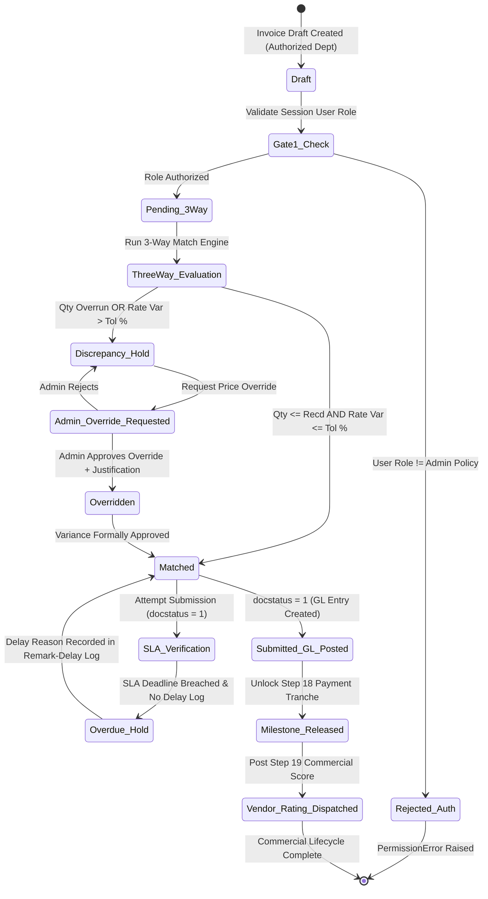

# STEP_17_PURCHASE_INVOICE_3WAY_MATCH_SPECIFICATION.caveman.md

# Enterprise Lifecycle Step Specification: Purchase Invoice 3-Way Match Verification & Admin-Governed Departmental Entry Authorization Architecture

**Document ID:** `STEP-17-PURCHASE-INVOICE-3WAY-MATCH`  
**Lifecycle Flow:** Flow 2: SCM, Store, Purchase & Vendor Procurement Lifecycle (Step 06 of 08 / Global Step 17)  
**Governing Architecture:** [`architect_docs/02_STEP_PLANNING_SPECIFICATION_BLUEPRINT.md`](../architect_docs/02_STEP_PLANNING_SPECIFICATION_BLUEPRINT.md)  
**Architecture Decision Record:** [`docs/decisions/ADR-017-PURCHASE-INVOICE-3WAY-MATCH-ADMIN-ENTRY-GOVERNANCE.md`](../docs/decisions/ADR-017-PURCHASE-INVOICE-3WAY-MATCH-ADMIN-ENTRY-GOVERNANCE.md)  
**PRD / FRS Traceability:** [`planning_ref_docs/01_PROJECT_FOUNDATION_MODEL.md`](../planning_ref_docs/01_PROJECT_FOUNDATION_MODEL.md) (`BC-13`, `BC-14`), [`planning_ref_docs/03_TO_BE_BUSINESS_PROCESS.md`](../planning_ref_docs/03_TO_BE_BUSINESS_PROCESS.md) (`Step 06`, `Gate 9`), [`planning_ref_docs/04_GAP_ANALYSIS_FIT_GAP.md`](../planning_ref_docs/04_GAP_ANALYSIS_FIT_GAP.md) (`Gap #07`, `Gap #08`), [`planning_ref_docs/05_BUSINESS_REQUIREMENTS_DOCUMENT.md`](../planning_ref_docs/05_BUSINESS_REQUIREMENTS_DOCUMENT.md) (`BR-015`, `BR-017`, `BR-018`), [`planning_ref_docs/06_FUNCTIONAL_REQUIREMENTS_SPECIFICATION.md`](../planning_ref_docs/06_FUNCTIONAL_REQUIREMENTS_SPECIFICATION.md) (`FR-015`, `FR-016`), [`planning_ref_docs/08_DATABASE_DESIGN_DOCUMENT.md`](../planning_ref_docs/08_DATABASE_DESIGN_DOCUMENT.md) (`Domain 4: FIN`, `Domain 7: SCM`), [`planning_ref_docs/09_API_DESIGN_AND_INTEGRATIONS.md`](../planning_ref_docs/09_API_DESIGN_AND_INTEGRATIONS.md) (`API 12`), [`planning_ref_docs/10_UI_UX_SPECIFICATION.md`](../planning_ref_docs/10_UI_UX_SPECIFICATION.md) (`Screen 19`), [`planning_ref_docs/11_MODULE_FUNCTIONAL_DOCUMENTATION.md`](../planning_ref_docs/11_MODULE_FUNCTIONAL_DOCUMENTATION.md) (`MOD-16`), [`planning_ref_docs/12_GETMYERP_SOLAR_EPC_WHITEPAPER.md`](../planning_ref_docs/12_GETMYERP_SOLAR_EPC_WHITEPAPER.md) (Sec 3.2, 4.3)  
**Target Module:** `solar_module` / `manoj` (Extends ERPNext `tabPurchase Invoice`, child table `tabPurchase Invoice Item`, `tabSolar SCM Settings`, introduces `tabSolar SCM Policy Log`, integrates `tabRemark-Delay Log`)  
**Author:** Principal Enterprise Architect  
**Status:** Ready for Implementation

---

## 1. Step Scope, Objectives & Context Traceability

### 1.1 Lifecycle Positioning & Context

Step 17 commercial recognition, statutory tax reconciliation, GL liability gateway in Solar EPC Procurement Lifecycle (Flow 2). Downstream of Step 15 ([`STEP_15_PURCHASE_ORDER_AUTHORIZATION_SPECIFICATION.md`](./STEP_15_PURCHASE_ORDER_AUTHORIZATION_SPECIFICATION.md)) and Step 16 ([`STEP_16_PURCHASE_RECEIPT_GRN_SPECIFICATION.md`](./STEP_16_PURCHASE_RECEIPT_GRN_SPECIFICATION.md)). Ingests vendor tax invoices, subjects them to 3-way matching (PO rate vs GRN accepted qty vs PI), posts accounts payable GL entries. Implements Admin Supreme Departmental Entry Governance (`Solar SCM Settings.authorized_pi_entry_department`: Accounts vs Store vs Purchase).

```
┌──────────────────────────────────────────────────────────────────────────────────────────────────┐
│                                FLOW 2: SCM PROCUREMENT PIPELINE                                  │
├──────────────────────────────────────────────────────────────────────────────────────────────────┤
│                                                                                                  │
│   [Step 12: Store Material Request] ──▶ Requisitions from Site Indents / Low-Stock Buffer        │
│                 │                                                                                │
│                 ▼                                                                                │
│   [Step 13: Supplier RFQ Dispatch]  ──▶ Multi-vendor solicitation (≥ 3 Suppliers or Justified)   │
│                 │                                                                                │
│                 ▼                                                                                │
│   [Step 14: Quotation Comparison]   ──▶ Landed cost normalization, 100-pt scoring, Non-L1 gate   │
│                 │                                                                                │
│                 ▼                                                                                │
│   [Step 15: Purchase Order Placement] ─▶ 4-Tier authorization, milestone terms, delivery routing │
│                 │                                                                                │
│                 ▼                                                                                │
│   [Step 16: Multi-Location GRN]     ──▶ Store / Site / Purchase receipt, barcode SABB ingestion  │
│                 │                                                                                │
│                 ▼                                                                                │
│   ┌──────────────────────────────────────────────────────────────────────────────────────────┐   │
│   │             STEP 17: PURCHASE INVOICE 3-WAY MATCH & ADMIN ENTRY GOVERNANCE               │   │
│   ├──────────────────────────────────────────────────────────────────────────────────────────┤   │
│   │ 1. Admin-Governed Entry Control: Policy in Solar SCM Settings (Accounts / Store / Purch) │   │
│   │ 2. Gate 1: Strict Departmental Role Authorization Check on before_insert & validate      │   │
│   │ 3. Gate 2: Quantity Clearance (Billed Qty ≤ GRN Accepted Qty; Quarantined goods blocked) │   │
│   │ 4. Gate 3: Unit Rate Variance Check (Tolerance ≤ 0.0%; Admin override required if over)  │   │
│   │ 5. Gate 4: Duplicate Invoice Prevention (Unique index on supplier + bill_no + fiscal_yr) │   │
│   │ 6. Gate 5: Statutory Tax & TDS Compliance (70:30 Solar GST check & Sec 194Q/206C(1H))   │   │
│   │ 7. Turnaround SLA: 24h TAT monitored by Redis daemon; breach locks require delay log     │   │
│   │ 8. Downstream Automated Unlocks: Step 18 (Payment Workbench) & Step 19 (Vendor Rating)   │   │
│   └──────────────────────────────────────────────────────────────────────────────────────────┘   │
│                 │                                                                                │
│                 ├────────────────────────────────┬───────────────────────────────┐               │
│                 ▼                                ▼                               ▼               │
│   [Step 18: Payment Workbench]     [Step 19: Vendor Rating]        [General Ledger (GL)]         │
│   Releases invoice milestone       Feeds Price Adherence score     Credits Creditors - SEPC,     │
│   tranche for payment batching     (15% weighting in scorecard)    Debits Stock Received / Exp   │
│                                                                                                  │
└──────────────────────────────────────────────────────────────────────────────────────────────────┘
```

- **Predecessors:** Step 15 Purchase Order Authorization (`tabPurchase Order`), Step 16 Multi-Location Barcode Purchase Receipt (`tabPurchase Receipt`).
- **Successors:** Step 18 Joint Vendor Payment Tracking Workbench (`tabPayment Entry`), Step 19 Vendor Performance Rating (`tabVendor Rating`), General Ledger (Accounts Payable & GSTR-2B ITC).

### 1.2 Core Business Objectives & Target KPIs

1. **Zero Duplicate Invoicing:** Enforce single authorized entry department + unique index on `(supplier, bill_no, fiscal_year)`.
2. **100% 3-Way Match Audit Compliance:** Billed qty $\le$ GRN accepted qty; billed rate strictly matches PO rate within tolerance.
3. **Admin Operational Control:** Admin dynamically configures entry role (`Accounts`, `Store`, `Purchase`) via `Solar SCM Settings` without code change.
4. **Statutory Tax Alignment:** Enforce 70:30 Goods/Services valuation on composite solar contracts + Section 194Q TDS / 206C(1H) TCS tags.
5. **Sub-24h Invoice Turnaround SLA:** Automatic countdown from bill receipt to GL posting; breaches lock submission until delay log signed.
6. **Closed-Loop SCM Data Feed:** Automatically unlocks milestone payment tranches (Step 18) and updates vendor price adherence score (Step 19).

### 1.3 Context Traceability Matrix

| Reference Document                 | Section / ID                                      | Requirement Traceability in Step 17                                                                                   |
| :--------------------------------- | :------------------------------------------------ | :-------------------------------------------------------------------------------------------------------------------- |
| **Project Foundation Model**       | `BC-13`, `BC-14` (PO, GRN & Invoicing Governance) | Invoicing controls, 3-way matching validation, Admin entry authorization, milestone disbursement triggers.            |
| **Business Requirements Document** | `BR-015` (Joint Vendor Payment Tracking)          | 3-way match validation between PO, GRN, and PI; release of verified liabilities to joint payment workbench.           |
| **Functional Requirements Spec**   | `FR-015` (Purchase Invoicing 3-Way Match)         | Screen controls, 3-way match discrepancy viewer, price variance tolerance, Admin override workflows.                  |
| **Gap Analysis & Fit-Gap**         | `Gap #07`, `Gap #08` (Invoice & SCM Governance)   | Resolves rigid role silos and eliminates paper invoice loss at remote sites via Admin-configurable entry governance.  |
| **Database Design Document**       | `Domain 4: FIN` & `Domain 7: SCM`                 | Relational schema for `tabPurchase Invoice`, `tabSolar SCM Settings`, `tabSolar SCM Policy Log`, and SLA delay logs.  |
| **API Design & Integrations**      | `API 12` (`solar_module.api.procurement.*`)       | Whitelisted endpoints for 3-way match evaluation, Admin entry policy configuration, and price override authorization. |
| **UI/UX Specification**            | `Screen 19` (Purchase Invoice 3-Way Match Desk)   | Vue 3 / Frappe UI SPA invoice entry drawer, side-by-side PO vs GRN vs PI diff visualizer, Admin policy widget.        |
| **Module SOP Suite**               | `MOD-16` (Purchase Invoicing & 3-Way Match SOP)   | Standard operational procedures for invoice intake, discrepancy resolution, and Admin policy shifts.                  |
| **Executive Governance**           | `BR-017`, `BR-018` (SLA Engine & Notifications)   | 24h invoice turnaround SLA, Redis daemon monitoring, real-time alerts to Accounts, Purchase, and Admin.               |

---

## 2. Stakeholders, Enterprise Actors & HRMS Role Mapping

### 2.1 Enterprise User Roles Matrix

Zero "User" Suffix rule strictly enforced:

| Persona / Business Actor          | Frappe System Role   | HRMS Department        | HRMS Designation          | Operational Responsibilities in Step 17                                                                                                  |
| :-------------------------------- | :------------------- | :--------------------- | :------------------------ | :--------------------------------------------------------------------------------------------------------------------------------------- |
| **Finance Billing Executive**     | `Accounts Assistant` | Finance & Accounts     | `Accounts Assistant`      | Enters, verifies, and submits Purchase Invoices when `Accounts` is authorized department; validates GST/TDS and 3-way match.             |
| **Finance & Accounts Head**       | `Accounts Officer`   | Finance & Accounts     | `Chief Financial Officer` | Supervises invoice verification, reviews price variance holds, submits invoices, prepares Step 18 payment disbursements.                 |
| **Warehouse Inward Executive**    | `Store Assistant`    | Store & Inventory      | `Store Executive`         | Enters Purchase Invoices from physical transporter challans at warehouse dock when `Store` is authorized by Admin policy.                |
| **Warehouse Logistics Head**      | `Store Manager`      | Store & Inventory      | `Warehouse Manager`       | Reviews Store-entered invoice drafts, verifies delivery challan attachments, submits Store-entered invoices.                             |
| **Procurement Line Executive**    | `Purchase Assistant` | Purchase & SCM         | `Purchase Executive`      | Enters Purchase Invoices directly from factory-gate vendor tax bills when `Purchase` is authorized by Admin policy.                      |
| **Head of Procurement**           | `Purchase Manager`   | Purchase & SCM         | `Procurement Head`        | Manages vendor rate queries, requests Admin price variance overrides when supplier invoices legitimately deviate from contracted PO.     |
| **Solar Project Manager**         | `Project Manager`    | Engineering Operations | `Senior Project Manager`  | Consulted on site-delivered goods verification and approves site-level variations during discrepancy reviews.                            |
| **Solar EPC Director / Admin**    | `Admin`              | Executive Management   | `Managing Director`       | Project supreme command; manages `Solar SCM Settings.authorized_pi_entry_department`, grants price overrides, reviews SLA delay logs.    |
| **Framework Supreme / Developer** | `System Manager`     | Information Technology | `DevOps Architect`        | Bench CLI administration, custom field fixtures, background Redis queue sizing, Developer Mode schema maintenance. Supreme over `Admin`. |

### 2.2 Permission Hierarchy Matrix

| Action / Document                               | Accounts Assistant | Accounts Officer | Store Assistant | Store Manager | Purchase Assistant | Purchase Manager |   Admin\*   | System Manager |
| :---------------------------------------------- | :----------------: | :--------------: | :-------------: | :-----------: | :----------------: | :--------------: | :---------: | :------------: |
| **Configure PI Entry Department Policy**        |         ✖          |        ✖         |        ✖        |       ✖       |         ✖          |        ✖         | ✔ (Supreme) | ✔ (Technical)  |
| **Create / Edit PI (When Policy = 'Accounts')** |         ✔          |        ✔         |        ✖        |       ✖       |         ✖          |        ✖         | ✔ (Supreme) | ✔ (Technical)  |
| **Create / Edit PI (When Policy = 'Store')**    |         ✖          |        ✖         |        ✔        |       ✔       |         ✖          |        ✖         | ✔ (Supreme) | ✔ (Technical)  |
| **Create / Edit PI (When Policy = 'Purchase')** |         ✖          |        ✖         |        ✖        |       ✖       |         ✔          |        ✔         | ✔ (Supreme) | ✔ (Technical)  |
| **Submit PI (docstatus = 1) [Authorized Dept]** |         ✔          |        ✔         |        ✖        |       ✔       |         ✖          |        ✔         | ✔ (Supreme) | ✔ (Technical)  |
| **Request Admin Price Variance Override**       |         ✔          |        ✔         |        ✖        |       ✖       |         ✔          |        ✔         |      -      |       -        |
| **Authorize Price Variance Override**           |         ✖          |        ✖         |        ✖        |       ✖       |         ✖          |        ✖         | ✔ (Supreme) | ✔ (Technical)  |
| **View 3-Way Match Verification Logs**          |         ✔          |        ✔         |        ✔        |       ✔       |         ✔          |        ✔         | ✔ (Supreme) | ✔ (Technical)  |
| **Override SLA Timeout & Sign Delay Log**       |         ✖          |        ✔         |        ✖        |       ✔       |         ✖          |        ✔         | ✔ (Supreme) | ✔ (Technical)  |

---

## 3. Relational Schema & 3NF Data Dictionary

### 3.1 Singleton Configuration Schema Updates: `tabSolar SCM Settings`

```json
{
  "doctype": "DocType",
  "name": "Solar SCM Settings",
  "issingle": 1,
  "module": "Solar SCM",
  "fields": [
    {
      "fieldname": "pi_governance_section",
      "fieldtype": "Section Break",
      "label": "Purchase Invoice & 3-Way Match Governance"
    },
    {
      "fieldname": "authorized_pi_entry_department",
      "fieldtype": "Select",
      "label": "Authorized PI Entry Department",
      "options": "Accounts\nStore\nPurchase",
      "default": "Accounts",
      "reqd": 1,
      "description": "Admin-controlled policy designating single department authorized to create and enter Purchase Invoices."
    },
    {
      "fieldname": "pi_3way_match_enforced",
      "fieldtype": "Check",
      "label": "Enforce Strict 3-Way Matching",
      "default": 1
    },
    {
      "fieldname": "pi_rate_variance_tolerance_percent",
      "fieldtype": "Percent",
      "label": "Rate Variance Tolerance (%)",
      "default": "0.00",
      "precision": "2"
    },
    {
      "fieldname": "pi_turnaround_sla_hours",
      "fieldtype": "Int",
      "label": "Invoice Turnaround SLA (Hours)",
      "default": 24
    },
    {
      "fieldname": "pi_require_tds_verification",
      "fieldtype": "Check",
      "label": "Enforce Statutory TDS (Sec 194Q) Verification",
      "default": 1
    },
    {
      "fieldname": "pi_require_gst_match",
      "fieldtype": "Check",
      "label": "Enforce Solar 70:30 GST Validation",
      "default": 1
    }
  ]
}
```

### 3.2 Audit Log DocType: `tabSolar SCM Policy Log`

```json
{
  "doctype": "DocType",
  "name": "Solar SCM Policy Log",
  "istable": 1,
  "module": "Solar SCM",
  "fields": [
    {
      "fieldname": "changed_on",
      "fieldtype": "Datetime",
      "label": "Changed On",
      "reqd": 1
    },
    {
      "fieldname": "changed_by",
      "fieldtype": "Link",
      "options": "User",
      "label": "Changed By",
      "reqd": 1
    },
    {
      "fieldname": "previous_department",
      "fieldtype": "Data",
      "label": "Previous Department"
    },
    {
      "fieldname": "new_department",
      "fieldtype": "Data",
      "label": "New Department",
      "reqd": 1
    },
    {
      "fieldname": "justification",
      "fieldtype": "Small Text",
      "label": "Administrative Justification",
      "reqd": 1
    }
  ]
}
```

### 3.3 Core DocType Extensions: `tabPurchase Invoice`

| Fieldname                      | Label                          | Fieldtype       | Options / Target                                      | Mandatory | Index | Description & Operational Logic                                                                                |
| :----------------------------- | :----------------------------- | :-------------- | :---------------------------------------------------- | :-------: | :---: | :------------------------------------------------------------------------------------------------------------- |
| `custom_pi_governance_section` | Solar EPC Invoicing Governance | `Section Break` | -                                                     |     -     |   -   | Section break grouping 3-way match and administrative controls.                                                |
| `custom_pi_entry_department`   | Entry Department               | `Select`        | `Accounts\nStore\nPurchase`                           |    Yes    | Index | Department under which invoice was initiated; must match active Admin policy at creation.                      |
| `custom_po_reference`          | Primary Purchase Order         | `Link`          | `Purchase Order`                                      |    Yes    | Index | Contractual anchor for rate and term verification.                                                             |
| `custom_grn_reference`         | Primary Purchase Receipt (GRN) | `Link`          | `Purchase Receipt`                                    |    Yes    | Index | Physical receipt anchor for accepted quantity verification.                                                    |
| `custom_3way_match_status`     | 3-Way Match Status             | `Select`        | `Pending\nPassed\nDiscrepancy Hold\nAdmin Overridden` |    Yes    | Index | State machine status reflecting reconciliation. Default: `Pending`.                                            |
| `custom_rate_variance_amount`  | Total Rate Variance (₹)        | `Currency`      | `Company:currency`                                    |    No     |   -   | Cumulative monetary variance between PI rates and PO rates. Precision: 2.                                      |
| `custom_rate_variance_percent` | Rate Variance (%)              | `Percent`       | -                                                     |    No     |   -   | Percentage rate deviation: $(\Delta_{\text{rate}} / \text{PO Total}) \times 100$.                              |
| `custom_admin_price_override`  | Admin Price Override Approved  | `Check`         | -                                                     |    No     | Index | Set to 1 exclusively by `Admin` when price variance exceeds policy tolerance.                                  |
| `custom_override_by`           | Price Override Approved By     | `Link`          | `User`                                                |    No     |   -   | User reference of authorizing `Admin`.                                                                         |
| `custom_override_reason`       | Price Override Justification   | `Small Text`    | -                                                     |    No     |   -   | Mandatory commercial explanation for accepting price deviations.                                               |
| `custom_sla_status`            | SLA Status                     | `Select`        | `Within SLA\nBreached / Overdue\nSLA Closed`          |    Yes    | Index | Real-time SLA tracking status. Default: `Within SLA`.                                                          |
| `custom_sla_deadline`          | SLA Deadline                   | `Datetime`      | -                                                     |    No     | Index | Strict completion timestamp (`creation` + `Solar SCM Settings.pi_turnaround_sla_hours`).                       |
| `custom_sla_breach_hours`      | SLA Overdue Duration (Hours)   | `Float`         | -                                                     |    No     |   -   | Calculated delay duration once deadline is breached.                                                           |
| `custom_delay_reason_table`    | Delay Reason & Audit Log       | `Table`         | `Remark-Delay Log`                                    |    No     |   -   | Mandatory justification child table required before submission if `custom_sla_status == 'Breached / Overdue'`. |

### 3.4 Core Child Table Extensions: `tabPurchase Invoice Item`

| Fieldname                  | Label              | Fieldtype  | Options / Target                           | Mandatory | Index | Description & Operational Logic                                                              |
| :------------------------- | :----------------- | :--------- | :----------------------------------------- | :-------: | :---: | :------------------------------------------------------------------------------------------- |
| `custom_po_item_ref`       | PO Item Reference  | `Data`     | -                                          |    Yes    | Index | Links to `tabPurchase Order Item.name` for unit rate reconciliation.                         |
| `custom_grn_item_ref`      | GRN Item Reference | `Data`     | -                                          |    Yes    | Index | Links to `tabPurchase Receipt Item.name` for accepted physical quantity reconciliation.      |
| `custom_po_contract_rate`  | Contracted PO Rate | `Currency` | `parent:currency`                          |    Yes    |   -   | Original rate locked in Step 15 PO.                                                          |
| `custom_grn_accepted_qty`  | GRN Accepted Qty   | `Float`    | -                                          |    Yes    |   -   | Verified non-quarantined physical quantity received in Step 16 GRN.                          |
| `custom_qty_variance`      | Quantity Variance  | `Float`    | -                                          |    No     |   -   | $\text{Billed Qty} - \text{GRN Accepted Qty}$. Must be $\le 0$.                              |
| `custom_rate_variance`     | Rate Variance (₹)  | `Currency` | `parent:currency`                          |    No     |   -   | $\text{Billed Rate} - \text{Contracted PO Rate}$.                                            |
| `custom_rate_variance_pct` | Rate Variance (%)  | `Percent`  | -                                          |    No     |   -   | $((\text{Billed Rate} - \text{Contracted PO Rate}) / \text{Contracted PO Rate}) \times 100$. |
| `custom_item_3way_status`  | Line 3-Way Status  | `Select`   | `Matched\nQuantity Overrun\nRate Mismatch` |    Yes    |   -   | Status indicator per individual line item.                                                   |

---

## 4. State Machine, Verification Gates & SLA Engine

### 4.1 Lifecycle State Machine



### 4.2 Five Immutable Server-Side Verification Gates

1. **Gate 1: Admin Departmental Entry Authorization Gate**
   - Fetches active policy from `Solar SCM Settings.authorized_pi_entry_department`.
   - Validates user role: Accounts requires `Accounts Assistant`/`Accounts Officer`; Store requires `Store Assistant`/`Store Manager`; Purchase requires `Purchase Assistant`/`Purchase Manager`.
   - Admin and System Manager hold universal override capability. Rejects unauthorized attempts with `frappe.PermissionError`.
2. **Gate 2: Physical Receipt & Accepted Quantity Gate**
   - Asserts: $\text{Billed Qty} \le \text{Accepted Qty}$ in linked `Purchase Receipt Item`.
   - Rejects billing against quarantined/rejected units in `Quarantine / Rejection - SEPC`.
   - Cumulative billed qty cannot exceed GRN accepted qty.
3. **Gate 3: Unit Rate & Price Variance Tolerance Gate**
   - Computes $\Delta_{\text{rate}} = \frac{\text{Billed Rate} - \text{PO Rate}}{\text{PO Rate}} \times 100$.
   - If $\Delta_{\text{rate}} > \text{Solar SCM Settings.pi_rate_variance_tolerance_percent}$:
     - Requires `custom_admin_price_override == 1` signed by `Admin`.
     - Otherwise transitions to `Discrepancy Hold` and throws `frappe.ValidationError` blocking submission.
4. **Gate 4: Supplier Invoice Deduplication & Date Alignment Gate**
   - Asserts uniqueness on composite key `(supplier, bill_no, fiscal_year)`.
   - Asserts `bill_date <= posting_date` and `bill_date >= po.transaction_date`.
5. **Gate 5: Statutory GST (70:30 Split) & TDS Compliance Gate**
   - Validates statutory 70:30 Goods vs Services tax split on solar EPC composite contracts.
   - Enforces Section 194Q TDS / Section 206C(1H) TCS deduction tags.

### 4.3 Turnaround SLA Engine (24-Hour TAT)

- **Clock Inception:** Triggered upon document draft inception (`creation` timestamp) or linked GRN submission.
- **Target SLA Duration:** 24 operational hours (configurable via `Solar SCM Settings.pi_turnaround_sla_hours`).
- **Redis Worker Daemon:** `solar_module.tasks.recompute_pi_slas` executes every 15 minutes.
- **Delay Audit Log:** Breaches set `custom_sla_status = 'Breached / Overdue'`. Submission locked until delay justification appended to `custom_delay_reason_table` (`tabRemark-Delay Log`).

---

## 5. Controller Logic, Domain Services & Whitelisted APIs

### 5.1 Decoupled Domain Service Architecture

```python
# File: solar_module/services/purchase_invoice_validation_service.py

import frappe
from frappe import _
from frappe.utils import flt, now_datetime, time_diff_in_hours

class PurchaseInvoiceValidationService:
    """Evaluates 5 Canonical Verification Gates for Purchase Invoice 3-Way Matching."""

    @classmethod
    def validate_purchase_invoice(cls, doc):
        scm_settings = frappe.get_cached_doc("Solar SCM Settings")
        cls.validate_gate_1_admin_entry_authorization(doc, scm_settings)
        cls.validate_gate_2_grn_quantity_clearance(doc)
        cls.validate_gate_3_price_variance_tolerance(doc, scm_settings)
        cls.validate_gate_4_duplicate_bill_check(doc)
        cls.validate_gate_5_statutory_tax_compliance(doc, scm_settings)
        cls.validate_sla_compliance(doc)

    @classmethod
    def validate_gate_1_admin_entry_authorization(cls, doc, settings):
        session_user = frappe.session.user
        roles = set(frappe.get_roles(session_user))

        if "System Manager" in roles or "Admin" in roles:
            return

        authorized_dept = settings.authorized_pi_entry_department or "Accounts"
        dept_role_map = {
            "Accounts": {"Accounts Assistant", "Accounts Officer"},
            "Store": {"Store Assistant", "Store Manager"},
            "Purchase": {"Purchase Assistant", "Purchase Manager"}
        }

        allowed_roles = dept_role_map.get(authorized_dept, set())
        if not roles.intersection(allowed_roles):
            frappe.throw(
                _("Purchase Invoice entry is currently restricted to '{0}' department by Admin policy. "
                  "Active roles {1} do not grant entry permissions.").format(authorized_dept, list(allowed_roles)),
                frappe.PermissionError
            )

        if not doc.custom_pi_entry_department:
            doc.custom_pi_entry_department = authorized_dept
        elif doc.custom_pi_entry_department != authorized_dept:
            frappe.throw(
                _("Invoice initiated under '{0}', but active Admin policy mandates '{1}'.").format(
                    doc.custom_pi_entry_department, authorized_dept
                ),
                frappe.ValidationError
            )

    @classmethod
    def validate_gate_2_grn_quantity_clearance(cls, doc):
        for item in doc.items:
            if not item.custom_grn_item_ref:
                frappe.throw(
                    _("Row #{0} ({1}): Missing link to Purchase Receipt Item. 3-Way Matching requires verified GRN line.").format(
                        item.idx, item.item_code
                    ),
                    frappe.ValidationError
                )

            grn_item = frappe.qb.DocType("Purchase Receipt Item")
            res = (
                frappe.qb.from_(grn_item)
                .select(grn_item.qty, grn_item.rejected_qty, grn_item.docstatus)
                .where(grn_item.name == item.custom_grn_item_ref)
            ).run(as_dict=True)

            if not res or res[0].docstatus != 1:
                frappe.throw(
                    _("Row #{0}: Linked Purchase Receipt line {1} is not submitted or does not exist.").format(
                        item.idx, item.custom_grn_item_ref
                    ),
                    frappe.ValidationError
                )

            accepted_qty = flt(res[0].qty)
            item.custom_grn_accepted_qty = accepted_qty
            item.custom_qty_variance = flt(item.qty) - accepted_qty

            if flt(item.qty) > accepted_qty:
                frappe.throw(
                    _("Row #{0} ({1}): Billed qty ({2}) exceeds GRN accepted qty ({3}). Billing quarantined goods prohibited.").format(
                        item.idx, item.item_code, item.qty, accepted_qty
                    ),
                    frappe.ValidationError
                )

    @classmethod
    def validate_gate_3_price_variance_tolerance(cls, doc, settings):
        tolerance_pct = flt(settings.pi_rate_variance_tolerance_percent)
        total_variance_amt = 0.0
        has_variance_breach = False

        for item in doc.items:
            po_rate = flt(item.custom_po_contract_rate)
            billed_rate = flt(item.rate)

            rate_diff = billed_rate - po_rate
            rate_var_pct = (rate_diff / po_rate * 100.0) if po_rate > 0 else 0.0

            item.custom_rate_variance = rate_diff
            item.custom_rate_variance_pct = rate_var_pct
            total_variance_amt += (rate_diff * flt(item.qty))

            if rate_var_pct > tolerance_pct:
                item.custom_item_3way_status = "Rate Mismatch"
                has_variance_breach = True
            else:
                item.custom_item_3way_status = "Matched"

        doc.custom_rate_variance_amount = total_variance_amt
        po_total = sum(flt(i.custom_po_contract_rate) * flt(i.qty) for i in doc.items)
        doc.custom_rate_variance_percent = (total_variance_amt / po_total * 100.0) if po_total > 0 else 0.0

        if has_variance_breach:
            if doc.custom_admin_price_override and doc.custom_override_by:
                doc.custom_3way_match_status = "Admin Overridden"
            else:
                doc.custom_3way_match_status = "Discrepancy Hold"
                if doc.docstatus == 1:
                    frappe.throw(
                        _("Price variance ({0:.2f}%) exceeds policy tolerance ({1:.2f}%). Invoice cannot be submitted without Admin Price Override.").format(
                            doc.custom_rate_variance_percent, tolerance_pct
                        ),
                        frappe.ValidationError
                    )
        else:
            doc.custom_3way_match_status = "Passed"

    @classmethod
    def validate_gate_4_duplicate_bill_check(cls, doc):
        if not doc.bill_no:
            frappe.throw(_("Supplier Tax Invoice Number (Bill No) is mandatory."), frappe.ValidationError)

        pi = frappe.qb.DocType("Purchase Invoice")
        query = (
            frappe.qb.from_(pi)
            .select(pi.name)
            .where(
                (pi.supplier == doc.supplier) &
                (pi.bill_no == doc.bill_no) &
                (pi.name != doc.name) &
                (pi.docstatus < 2)
            )
        )
        existing = query.run(as_dict=True)
        if existing:
            frappe.throw(
                _("Duplicate Invoice Detected: Supplier '{0}' invoice '{1}' already recorded in {2}.").format(
                    doc.supplier, doc.bill_no, existing[0].name
                ),
                frappe.DuplicateEntryError
            )

    @classmethod
    def validate_gate_5_statutory_tax_compliance(cls, doc, settings):
        if settings.pi_require_gst_match:
            for item in doc.items:
                if not item.gst_hsn_code:
                    frappe.throw(_("Row #{0}: HSN / SAC code is mandatory for GST compliance.").format(item.idx), frappe.ValidationError)

    @classmethod
    def validate_sla_compliance(cls, doc):
        if doc.docstatus == 1 and doc.custom_sla_status == "Breached / Overdue":
            if not doc.custom_delay_reason_table:
                frappe.throw(
                    _("Invoice Turnaround SLA breached. Submission blocked until delay justification is appended to Delay Log."),
                    frappe.ValidationError
                )
```

### 5.2 Whitelisted RPC & REST APIs

```python
# File: solar_module/api/procurement/purchase_invoice.py

import frappe
from frappe import _
from frappe.utils import now_datetime

@frappe.whitelist(methods=["POST"])
def set_pi_entry_department(department, justification):
    roles = set(frappe.get_roles(frappe.session.user))
    if "Admin" not in roles and "System Manager" not in roles:
        frappe.throw(_("Only Admin or System Manager can configure PI Entry Department Policy."), frappe.PermissionError)

    if department not in ["Accounts", "Store", "Purchase"]:
        frappe.throw(_("Invalid department. Must be Accounts, Store, or Purchase."), frappe.ValidationError)

    if not justification or len(justification.strip()) < 10:
        frappe.throw(_("Administrative justification (min 10 characters) mandatory."), frappe.ValidationError)

    settings = frappe.get_doc("Solar SCM Settings")
    old_dept = settings.authorized_pi_entry_department

    settings.authorized_pi_entry_department = department
    settings.append("policy_log_table", {
        "changed_on": now_datetime(),
        "changed_by": frappe.session.user,
        "previous_department": old_dept,
        "new_department": department,
        "justification": justification.strip()
    })
    settings.save()

    return {"status": "success", "previous_department": old_dept, "new_department": department}

@frappe.whitelist(methods=["GET"])
def get_pi_entry_policy():
    settings = frappe.get_cached_doc("Solar SCM Settings")
    dept = settings.authorized_pi_entry_department or "Accounts"
    roles = set(frappe.get_roles(frappe.session.user))

    dept_role_map = {
        "Accounts": {"Accounts Assistant", "Accounts Officer"},
        "Store": {"Store Assistant", "Store Manager"},
        "Purchase": {"Purchase Assistant", "Purchase Manager"}
    }

    is_authorized = bool(
        "System Manager" in roles or
        "Admin" in roles or
        roles.intersection(dept_role_map.get(dept, set()))
    )

    return {
        "authorized_department": dept,
        "user_is_authorized": is_authorized,
        "rate_variance_tolerance_percent": settings.pi_rate_variance_tolerance_percent,
        "turnaround_sla_hours": settings.pi_turnaround_sla_hours
    }

@frappe.whitelist(methods=["POST"])
def authorize_price_override(invoice_name, justification):
    roles = set(frappe.get_roles(frappe.session.user))
    if "Admin" not in roles and "System Manager" not in roles:
        frappe.throw(_("Only Admin can authorize Price Variance Overrides."), frappe.PermissionError)

    doc = frappe.get_doc("Purchase Invoice", invoice_name)
    if doc.docstatus != 0:
        frappe.throw(_("Price overrides can only be applied to draft invoices."), frappe.ValidationError)

    doc.custom_admin_price_override = 1
    doc.custom_override_by = frappe.session.user
    doc.custom_override_reason = justification
    doc.custom_3way_match_status = "Admin Overridden"
    doc.save()

    return {"status": "success", "message": _("Price override authorized for invoice {0}.").format(invoice_name)}
```

---

## 6. Frontend UI/UX Specification

### 6.1 Layout Architecture: Vue 3 / Frappe UI SPA (`/solar`)

```
┌──────────────────────────────────────────────────────────────────────────────────────────────────┐
│  /solar/procurement/invoices — PURCHASE INVOICE 3-WAY MATCH DESK                                │
├──────────────────────────────────────────────────────────────────────────────────────────────────┤
│                                                                                                  │
│  [ACTIVE POLICY BADGE]: Entry Authorized: [ ACCOUNTS ]  |  SLA: 24h  |  Tol: 0.0%  [Change (Admin)]│
│                                                                                                  │
│  ┌─────────────────────────┬─────────────────────────┬─────────────────────────┬──────────────┐  │
│  │ Invoices Pending Match  │ Discrepancy / Hold      │ Approved & Submitted    │ SLA Overdue  │  │
│  │          14             │            3            │           128           │      1       │  │
│  └─────────────────────────┴─────────────────────────┴─────────────────────────┴──────────────┘  │
│                                                                                                  │
│  [ + New Purchase Invoice ]  (Dynamically enabled ONLY if user matches active department policy) │
│                                                                                                  │
│  Invoice Details: PI-2026-0042 (Supplier: Adani Solar Power Ltd | Bill: AD-99412 | PO-2026-0089) │
│                                                                                                  │
│  ┌────────────────────────────────────────────────────────────────────────────────────────────┐  │
│  │                        3-WAY MATCH VISUAL RECONCILIATION MATRIX                           │  │
│  ├─────────────┬─────────────┬─────────────┬─────────────┬─────────────┬────────────┬─────────────┤  │
│  │ Item Code   │ Description │ PO Rate (₹) │ PI Rate (₹) │ GRN Rec Qty │ Billed Qty │ Match Status│  │
│  ├─────────────┼─────────────┼─────────────┼─────────────┼─────────────┼────────────┼─────────────┤  │
│  │ PV-MOD-545W │ Mono-PERC   │   14,200.00 │   14,200.00 │    600 Nos  │    600 Nos │  ✔ MATCHED  │  │
│  │ STR-INV-50K │ 50kW String │  185,000.00 │  192,000.00 │      4 Nos  │      4 Nos │  ✖ +3.78%   │  │
│  │ DC-CAB-4SQM │ Solar Cable │       42.50 │       42.50 │  2,000 Mtr  │  2,100 Mtr │  ✖ OVERRUN  │  │
│  └─────────────┴─────────────┴─────────────┴─────────────┴─────────────┴────────────┴─────────────┘  │
│                                                                                                  │
│  [Status Alert]: Discrepancy Hold — Rate variance (+3.78%) on String Inverter exceeds 0.0% tol.  │
│  Actions: [ Request Admin Price Override ]   [ View Linked GRN (STEP_16) ]   [ Contact Vendor ]  │
│                                                                                                  │
└──────────────────────────────────────────────────────────────────────────────────────────────────┘
```

### 6.2 Controlled Desk Action Button Governance (`purchase_receipt.js`)

```javascript
frappe.ui.form.on("Purchase Receipt", {
  refresh: function (frm) {
    if (frm.doc.docstatus === 1) {
      frappe.call({
        method:
          "solar_module.api.procurement.purchase_invoice.get_pi_entry_policy",
        callback: function (r) {
          if (r.message) {
            const policy = r.message;
            if (!policy.user_is_authorized) {
              frm.page.set_inner_btn_group_as_primary(__("Create"));
              frm.remove_custom_button(__("Purchase Invoice"), __("Create"));
              frm.page.add_inner_button(
                __("Purchase Invoice (Restricted)"),
                function () {
                  frappe.msgprint({
                    title: __("Entry Policy Restriction"),
                    indicator: "orange",
                    message: __(
                      "Purchase Invoice entry is currently assigned to <b>{0}</b> department by Admin policy.",
                      [policy.authorized_department],
                    ),
                  });
                },
                __("Create"),
              );
            }
          }
        },
      });
    }
  },
});
```

---

## 7. Cross-App Integration Touchpoints

```
┌──────────────────────────────────────────────────────────────────────────────────────────────────┐
│                               CROSS-APP INTEGRATION TOUCHPOINTS                                  │
├──────────────────────────────────────────────────────────────────────────────────────────────────┤
│                                                                                                  │
│   ┌──────────────────────────────┐                ┌──────────────────────────────────────────┐   │
│   │    STEP 15: PURCHASE ORDER   │                │        STEP 16: PURCHASE RECEIPT         │   │
│   │  - Contracted unit rate      │                │  - Accepted physical quantities (SABB)   │   │
│   │  - Payment schedule terms    │                │  - Rejection quarantine warehouse check  │   │
│   └──────────────┬───────────────┘                └────────────────────┬─────────────────────┘   │
│                  │                                                     │                         │
│                  └───────────────────────┬─────────────────────────────┘                         │
│                                          ▼                                                       │
│                        ┌───────────────────────────────────┐                                     │
│                        │     STEP 17: PURCHASE INVOICE     │                                     │
│                        └─────────────────┬─────────────────┘                                     │
│                                          │                                                       │
│         ┌────────────────────────────────┼─────────────────────────────────┐                     │
│         ▼                                ▼                                 ▼                     │
│  ┌───────────────┐              ┌──────────────────┐              ┌──────────────────┐           │
│  │ STEP 18:      │              │ STEP 19:         │              │ ERPNEXT CORE     │           │
│  │ PAYMENT DESK  │              │ VENDOR RATING    │              │ ACCOUNTS (GL)    │           │
│  │ Releases      │              │ Evaluates Price  │              │ Credits          │           │
│  │ Post-GRN /    │              │ Adherence score  │              │ Creditors - SEPC │           │
│  │ Invoice       │              │ (15% weighting)  │              │ Debits Stock     │           │
│  │ milestone     │              │ in scorecard     │              │ Received account │           │
│  └───────────────┘              └──────────────────┘              └──────────────────┘           │
│                                                                                                  │
└──────────────────────────────────────────────────────────────────────────────────────────────────┘
```

1. **ERPNext Core Accounts (GL):** Credit `Creditors - SEPC`, Debit `Stock Received But Not Billed`, Debit `Input Tax Credit`.
2. **Step 15 Purchase Order:** Updates `per_billed` % on PO; unlocks milestone payment tranche.
3. **Step 16 Purchase Receipt (GRN):** Updates `per_billed` % on GRN line items.
4. **Step 18 Joint Vendor Payment Workbench:** Schedules disbursement per PO credit terms.
5. **Step 19 Vendor Performance Rating:** Scores supplier price adherence ($15\%$ weighting).

---

## 8. Automated Testing & QA Criteria

### 8.1 Automated Test Suite (`TestPurchaseInvoice3WayMatch`)

Inherits from `FrappeTestCase`; zero `frappe.db.commit()` calls:

```python
# File: solar_module/tests/test_purchase_invoice_3way_match.py

import frappe
from frappe.tests.utils import FrappeTestCase

class TestPurchaseInvoice3WayMatch(FrappeTestCase):
    """Integration test suite for Step 17 Purchase Invoice 3-Way Matching."""

    def setUp(self):
        super().setUp()
        self.scm_settings = frappe.get_doc("Solar SCM Settings")
        self.scm_settings.authorized_pi_entry_department = "Accounts"
        self.scm_settings.pi_rate_variance_tolerance_percent = 0.0
        self.scm_settings.save()

    def test_gate1_unauthorized_department_entry_rejected(self):
        """Test Case 1: Store Assistant cannot create PI when Admin policy is set to Accounts."""
        frappe.set_user("store_assistant@sadbhav.com")
        pi = frappe.new_doc("Purchase Invoice")
        pi.supplier = "Adani Solar Power Ltd"
        self.assertRaises(frappe.PermissionError, pi.insert)

    def test_gate1_authorized_department_entry_success(self):
        """Test Case 2: Accounts Assistant creates PI when policy is set to Accounts."""
        frappe.set_user("accounts_assistant@sadbhav.com")
        pi = self._create_test_purchase_invoice(qty=10, rate=1000)
        self.assertEqual(pi.custom_pi_entry_department, "Accounts")

    def test_gate2_quantity_overrun_rejected(self):
        """Test Case 3: Billed quantity exceeding GRN accepted quantity is rejected."""
        frappe.set_user("accounts_assistant@sadbhav.com")
        pi = self._create_test_purchase_invoice(qty=12, rate=1000)
        self.assertRaises(frappe.ValidationError, pi.submit)

    def test_gate3_rate_variance_triggers_discrepancy_hold(self):
        """Test Case 4: Rate exceeding PO rate without Admin override blocks submission."""
        frappe.set_user("accounts_assistant@sadbhav.com")
        pi = self._create_test_purchase_invoice(qty=10, rate=1050)
        pi.save()
        self.assertEqual(pi.custom_3way_match_status, "Discrepancy Hold")
        self.assertRaises(frappe.ValidationError, pi.submit)

    def test_gate3_admin_price_override_permits_submission(self):
        """Test Case 5: Admin price override permits submission of rate discrepancy."""
        frappe.set_user("accounts_assistant@sadbhav.com")
        pi = self._create_test_purchase_invoice(qty=10, rate=1050)
        pi.save()

        frappe.set_user("admin@sadbhav.com")
        from solar_module.api.procurement.purchase_invoice import authorize_price_override
        authorize_price_override(pi.name, "Approved due to unquoted transit insurance charge")

        pi.reload()
        self.assertEqual(pi.custom_3way_match_status, "Admin Overridden")
        pi.submit()
        self.assertEqual(pi.docstatus, 1)

    def test_gate4_duplicate_invoice_blocked(self):
        """Test Case 6: Duplicate supplier invoice number raises DuplicateEntryError."""
        frappe.set_user("accounts_assistant@sadbhav.com")
        pi1 = self._create_test_purchase_invoice(qty=10, rate=1000, bill_no="BILL-999")
        pi1.submit()

        pi2 = self._create_test_purchase_invoice(qty=5, rate=1000, bill_no="BILL-999")
        self.assertRaises(frappe.DuplicateEntryError, pi2.save)

    def _create_test_purchase_invoice(self, qty, rate, bill_no="BILL-1001"):
        ...
```

---

## 9. Operational SOP, Error Resolution & Runbook

### 9.1 Standard Operating Procedure (SOP) by Department

- **Policy = `Accounts`:** Supplier sends GST invoice; Accounts Assistant opens `/solar/procurement/invoices`, selects PO and GRN, runs 3-way match, verifies tax breakdown, and submits.
- **Policy = `Store`:** Physical challan arrives at dock; Store Assistant verifies goods against GRN, creates PI draft on tablet, attaches photo of paper bill, submits draft.
- **Policy = `Purchase`:** Factory tax invoice issued upon shipment; Purchase Assistant books invoice to clear LC/advance milestone.

### 9.2 Administrative Policy Shift SOP (`Admin` Only)

1. Open `/app/solar-scm-settings`.
2. Select **Authorized PI Entry Department** (`Accounts`, `Store`, or `Purchase`).
3. Enter mandatory **Administrative Justification** (min 10 chars).
4. Save settings. System broadcasts notification and logs entry in `tabSolar SCM Policy Log`.

### 9.3 L3 DevOps Error Resolution Runbook

| Error Code / Symptom                                                    | Root Cause                                           | Immediate Diagnostic Command                                                                        | Remediation Action                                                        |
| :---------------------------------------------------------------------- | :--------------------------------------------------- | :-------------------------------------------------------------------------------------------------- | :------------------------------------------------------------------------ |
| `PermissionError: Purchase Invoice entry is currently restricted to...` | User attempted PI entry outside active Admin policy. | `bench --site [sitename] execute solar_module.api.procurement.purchase_invoice.get_pi_entry_policy` | Route invoice to authorized department, or request Admin update policy.   |
| `ValidationError: Billed quantity exceeds GRN accepted quantity`        | Billed qty exceeds accepted physical receipt.        | Compare `tabPurchase Receipt Item.qty` vs `tabPurchase Invoice Item.qty`.                           | Amend billed qty to match accepted qty; dispute excess with vendor.       |
| `ValidationError: Price variance exceeds policy tolerance`              | Invoiced unit rate deviates from approved PO rate.   | Check `custom_po_contract_rate` vs `rate` in `tabPurchase Invoice Item`.                            | If legitimate deviation, request Admin Price Override; otherwise dispute. |
| `DuplicateEntryError: Duplicate Invoice Detected`                       | Vendor bill number already exists for supplier.      | `SELECT name FROM tabPurchase Invoice WHERE supplier=%s AND bill_no=%s`                             | Prevent duplicate payment.                                                |
