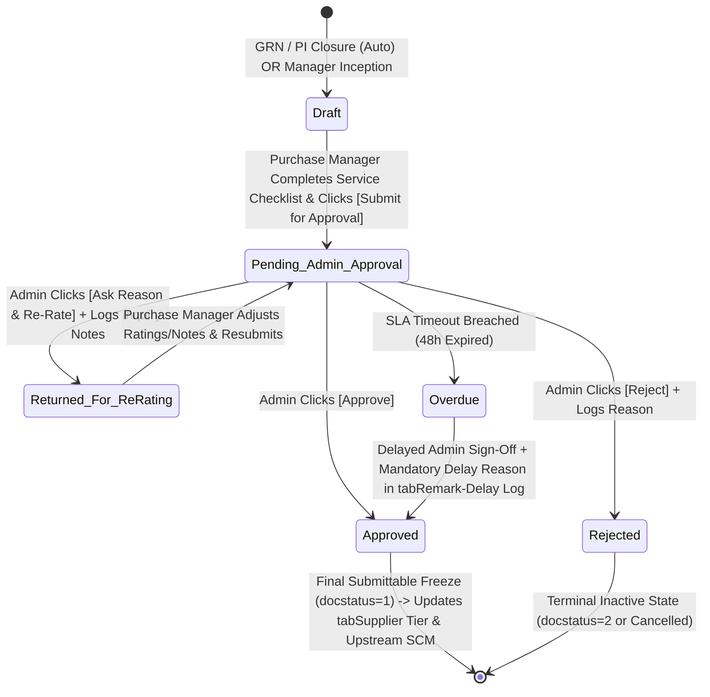

# STEP_19_VENDOR_RATING_SCORECARD_SPECIFICATION.caveman.md

# Enterprise Lifecycle Step Specification: Vendor Performance Rating Scorecard, 4-Factor Balanced Evaluation Engine & Two-Tier Admin Supreme Approval Architecture

**Document ID:** `STEP-19-VENDOR-RATING-SCORECARD`  
**Lifecycle Flow:** Flow 2: SCM, Store, Purchase & Vendor Procurement Lifecycle (Step 08 of 08 / Global Step 19)  
**Governing Architecture:** [`architect_docs/02_STEP_PLANNING_SPECIFICATION_BLUEPRINT.md`](../architect_docs/02_STEP_PLANNING_SPECIFICATION_BLUEPRINT.md)  
**Architecture Decision Record:** [`docs/decisions/ADR-019-VENDOR-PERFORMANCE-RATING-SCORECARD.md`](../docs/decisions/ADR-019-VENDOR-PERFORMANCE-RATING-SCORECARD.md)  
**PRD / FRS Traceability:** [`planning_ref_docs/01_PROJECT_FOUNDATION_MODEL.md`](../planning_ref_docs/01_PROJECT_FOUNDATION_MODEL.md) (`BC-15`), [`planning_ref_docs/03_TO_BE_BUSINESS_PROCESS.md`](../planning_ref_docs/03_TO_BE_BUSINESS_PROCESS.md) (`Step 08`), [`planning_ref_docs/04_GAP_ANALYSIS_FIT_GAP.md`](../planning_ref_docs/04_GAP_ANALYSIS_FIT_GAP.md) (`Gap #09`), [`planning_ref_docs/05_BUSINESS_REQUIREMENTS_DOCUMENT.md`](../planning_ref_docs/05_BUSINESS_REQUIREMENTS_DOCUMENT.md) (`BR-016`, `BR-017`, `BR-018`), [`planning_ref_docs/06_FUNCTIONAL_REQUIREMENTS_SPECIFICATION.md`](../planning_ref_docs/06_FUNCTIONAL_REQUIREMENTS_SPECIFICATION.md) (`FR-016`), [`planning_ref_docs/08_DATABASE_DESIGN_DOCUMENT.md`](../planning_ref_docs/08_DATABASE_DESIGN_DOCUMENT.md) (`Domain 5: SCM`), [`planning_ref_docs/09_API_DESIGN_AND_INTEGRATIONS.md`](../planning_ref_docs/09_API_DESIGN_AND_INTEGRATIONS.md) (`API 13`), [`planning_ref_docs/10_UI_UX_SPECIFICATION.md`](../planning_ref_docs/10_UI_UX_SPECIFICATION.md) (`Screen 20`), [`planning_ref_docs/11_MODULE_FUNCTIONAL_DOCUMENTATION.md`](../planning_ref_docs/11_MODULE_FUNCTIONAL_DOCUMENTATION.md) (`MOD-16`), [`planning_ref_docs/12_GETMYERP_SOLAR_EPC_WHITEPAPER.md`](../planning_ref_docs/12_GETMYERP_SOLAR_EPC_WHITEPAPER.md) (Sec 4.4)  
**Target Module:** `solar_module` / `manoj` (Introduces standalone submittable DocType `tabVendor Performance Rating`, child table `tabVendor Rating Item Breakdown`, child table `tabVendor Rating Service Checklist`, extends `tabSupplier`, extends `tabSolar SCM Settings`, integrates `tabRemark-Delay Log`)  
**Author:** Principal Enterprise Architect  
**Status:** Ready for Implementation

---

## 1. Step Scope, Objectives & Context Traceability

### 1.1 Lifecycle Positioning & Context

Step 19 final governance step in Flow 2 SCM pipeline. Ingests operational execution records across procurement, goods receipt, invoicing, settlement. Computes empirical balanced scorecard.

Two-tier collaborative governance model:

1. Tier 1 (Purchase Manager): Fills scorecard, reviews automated OTD/Quality/Price, completes qualitative service checklist, clicks `[Submit for Admin Approval]`.
2. Tier 2 (Admin Supreme Gateway): Real-time alert to `Admin`. Admin executes one of three actions:
   - `Approve`: Freezes scorecard (`docstatus=1`), updates `tabSupplier` tier and rolling score.
   - `Reject`: Closes evaluation with mandatory rejection reason. Zero supplier status impact.
   - `Ask for Reason & Re-Rate`: Records inquiry notes, reverts state to `Returned for Re-Rating`, alerts Purchase Manager to revise and resubmit.

```
┌──────────────────────────────────────────────────────────────────────────────────────────────────┐
│                                FLOW 2: SCM PROCUREMENT PIPELINE                                  │
├──────────────────────────────────────────────────────────────────────────────────────────────────┤
│                                                                                                  │
│   [Step 12: Store Material Request] ──▶ Requisitions from Site Indents / Low-Stock Buffer        │
│                 │                                                                                │
│                 ▼                                                                                │
│   [Step 13: Supplier RFQ Dispatch]  ◀── Closed-Loop Feedback: Auto-Shortlists Tier 1 / Blocks     │
│                 │                       Blacklisted Suppliers                                    │
│                 ▼                                                                                │
│   [Step 14: Quotation Comparison]   ◀── Closed-Loop Feedback: Ingests Vendor Rating Score        │
│                 │                       as a 15% Weighted Landed Cost Parameter                  │
│                 ▼                                                                                │
│   [Step 15: Purchase Order Release] ──▶ Contractual Schedule Date, Rates & Milestone Terms       │
│                 │                                                                                │
│                 ▼                                                                                │
│   [Step 16: Multi-Location GRN]     ──▶ Actual Delivery Timestamp, Accepted/Rejected Qty, MTCs   │
│                 │                                                                                │
│                 ▼                                                                                │
│   [Step 17: Purchase Invoice Match] ──▶ Billed Rates, Unit Rate Variances, Statutory Tax Check   │
│                 │                                                                                │
│                 ▼                                                                                │
│   [Step 18: Payment Workbench]      ──▶ Settlement Timeliness, Credit Compliance, Dispute Status │
│                 │                                                                                │
│                 ▼                                                                                │
│   ┌──────────────────────────────────────────────────────────────────────────────────────────┐   │
│   │        STEP 19: TWO-TIER VENDOR RATING & ADMIN SUPREME APPROVAL ARCHITECTURE             │   │
│   ├──────────────────────────────────────────────────────────────────────────────────────────┤   │
│   │ 1. Phase 1 (PM Desk): Purchase Manager reviews OTD, Quality, Price + scores Service      │   │
│   │ 2. PM Action: Clicks [Submit for Admin Approval] (Status: Pending Admin Approval)        │   │
│   │ 3. Automated Notification: System dispatches real-time Desk, Email & WhatsApp to Admin   │   │
│   │ 4. Phase 2 (Admin Gateway): Admin reviews scorecard & executes one of 3 actions:         │   │
│   │    - Action 1: [Approve] -> Freezes scorecard (docstatus=1), updates tabSupplier tier   │   │
│   │    - Action 2: [Reject] -> Rejects evaluation with mandatory reason (Zero SCM change)    │   │
│   │    - Action 3: [Ask Reason & Re-Rate] -> Enters inquiry notes, returns to PM for revision│   │
│   │ 5. Verification Gate 1: Complete Transactional Linkage & Immutability                    │   │
│   │ 6. Verification Gate 2: Mandatory Purchase Manager Service Review (All 4 criteria)       │   │
│   │ 7. Verification Gate 3: Admin Supreme Decision Enforcement (Non-Admins hard-blocked)     │   │
│   │ 8. Dynamic Tier Reclassification: Tier 1 (≥85%), Tier 2 (70-84%), Tier 3 (50-69%), Black │   │
│   │ 9. 48-Hour TAT SLA Engine: Overdue locks require justification in tabRemark-Delay Log    │   │
│   └──────────────────────────────────────────────────────────────────────────────────────────┘   │
│                 │                                                                                │
│                 ├────────────────────────────────┬───────────────────────────────┐               │
│                 ▼                                ▼                               ▼               │
│   [tabSupplier Master Update]      [Closed-Loop SCM Routing]       [Supplier Scorecard PDF]      │
│   Updates rolling average score    Directly governs Step 13 RFQs   Dispatches performance        │
│   and enterprise tier status       and Step 14 Comparison Matrix   audit report to vendor        │
│                                                                                                  │
└──────────────────────────────────────────────────────────────────────────────────────────────────┘
```

- Predecessors: Step 15 PO, Step 16 GRN, Step 17 PI, Step 18 Payment Desk.
- Successors: Step 13 RFQ shortlists, Step 14 Comparison Matrix, `tabSupplier` tier.

### 1.2 Core Business Objectives & Target KPIs

1. Two-tier executive oversight: Admin approval required before supplier tier updates.
2. Collaborative re-rating: Admin inquiry dialog allows revisions without cancelling document.
3. 100% data-driven supplier selection: zero buyer favoritism.
4. < 0.2% site rejection rate: punitive critical defect multiplier ($P_{critical} = 25$ pts).
5. > 95% on-time delivery adherence: progressive penalty curve stops lead-time creep.
6. Zero PO allocation to delinquent/blacklisted vendors: hard DB block in Step 13 & Step 15.

---

## 2. Stakeholders, Enterprise Actors & HRMS Role Mapping

Zero "User" Suffix Rule + Supreme Authority Standard enforced.

### 2.1 Enterprise User Roles Matrix

| Persona / Business Actor    | Enterprise Role Standard                     | Frappe Role                          | HRMS Designation                   | Access Level                      | Primary Responsibility in Step 19                                                                                               |
| :-------------------------- | :------------------------------------------- | :----------------------------------- | :--------------------------------- | :-------------------------------- | :------------------------------------------------------------------------------------------------------------------------------ |
| **Purchase Manager**        | **`Purchase Manager`**                       | `Purchase Manager`                   | `Head of Procurement` / `SCM Lead` | Read / Write / Amend              | Fills scorecard, reviews automated metrics, evaluates service dimensions, submits for Admin approval. Re-evaluates if returned. |
| **Technical Quality Lead**  | **`Store Manager`** / **`Project Engineer`** | `Store Manager` / `Project Engineer` | `Warehouse / Field Technical Lead` | Read / Write (Quality logs)       | Audits GRN inspection, enters flash test/EL logs, logs defect classifications.                                                  |
| **Procurement Line**        | **`Purchase Assistant`**                     | `Purchase Assistant`                 | `Purchase Executive`               | Read Only                         | Monitors vendor scores, attaches communication logs, drafts records.                                                            |
| **Store Leadership**        | **`Store Manager`**                          | `Store Manager`                      | `Central Warehouse Head`           | Read Only                         | Supplies GRN inspection data, breakage logs, serial scans.                                                                      |
| **Finance Department Lead** | **`Accounts Manager`**                       | `Accounts Manager`                   | `Finance Head / Controller`        | Read Only                         | Supplies 3-way match variance, debit notes, settlement turnaround.                                                              |
| **Project Supreme Command** | **`Admin`**                                  | `Admin`                              | `Director of Operations`           | Full Master & Operational Command | Supreme approval authority. Receives submission notifications. Executes `Approve`, `Reject`, or `Ask for Reason & Re-Rate`.     |
| **Developer Supreme**       | **`System Manager`**                         | `System Manager`                     | `DevOps Lead` / `CTO`              | Framework Apex & Codebase Realm   | Source code, schema JSONs, database migrations, Redis queues. No operational business sign-offs.                                |

### 2.2 Permission Hierarchy Matrix

| DocType / Entity                 | Role                                 | Read |        Write         | Create |        Submit        | Cancel | Amend | Export |
| :------------------------------- | :----------------------------------- | :--: | :------------------: | :----: | :------------------: | :----: | :---: | :----: |
| `tabVendor Performance Rating`   | `Purchase Manager`                   |  ✔   |          ✔           |   ✔    |  ✖ (Sends to Admin)  |   ✖    |   ✔   |   ✔    |
| `tabVendor Performance Rating`   | `Store Manager` / `Project Engineer` |  ✔   |   ✔ (Quality logs)   |   ✖    |          ✖           |   ✖    |   ✖   |   ✔    |
| `tabVendor Performance Rating`   | `Purchase Assistant`                 |  ✔   |          ✖           |   ✖    |          ✖           |   ✖    |   ✖   |   ✖    |
| `tabVendor Performance Rating`   | `Admin`                              |  ✔   |          ✔           |   ✔    | ✔ (Supreme Sign-off) |   ✔    |   ✔   |   ✔    |
| `tabVendor Performance Rating`   | `System Manager`                     |  ✔   |          ✔           |   ✔    |          ✔           |   ✔    |   ✔   |   ✔    |
| `tabSupplier` (Rating Fields)    | `Purchase Manager`                   |  ✔   |  ✖ (Read-only view)  |   ✖    |          ✖           |   ✖    |   ✖   |   ✔    |
| `tabSupplier` (Tier & Blacklist) | `Admin`                              |  ✔   | ✔ (Supreme Sign-off) |   ✖    |          ✖           |   ✖    |   ✖   |   ✔    |
| `tabSolar SCM Settings`          | `Admin`                              |  ✔   |          ✔           |   ✔    |          ✖           |   ✖    |   ✖   |   ✔    |

---

## 3. Relational Schema & 3NF Data Dictionary

### 3.1 Standalone Custom DocType: `tabVendor Performance Rating`

- Autoname: `format:VPR-.YYYY.-.#####.`
- Submittable: `is_submittable = 1`
- Table: `tabVendor Performance Rating`

| Fieldname                  | Label                          | Fieldtype    | Options / Target                                                                                             | Mandatory | Index | Description                                                                |
| :------------------------- | :----------------------------- | :----------- | :----------------------------------------------------------------------------------------------------------- | :-------: | :---: | :------------------------------------------------------------------------- |
| `naming_series`            | Naming Series                  | `Select`     | `VPR-.YYYY.-.#####.`                                                                                         |    Yes    |   -   | Autoname sequence.                                                         |
| `supplier`                 | Supplier                       | `Link`       | `Supplier`                                                                                                   |    Yes    |   1   | Target vendor foreign key.                                                 |
| `supplier_name`            | Supplier Name                  | `Data`       | `supplier.supplier_name`                                                                                     |    No     |   -   | Vendor display name.                                                       |
| `evaluation_scope`         | Evaluation Scope               | `Select`     | `Transaction-Level\nPeriodic Consolidated`                                                                   |    Yes    |   1   | Per-GRN vs quarterly roll-up.                                              |
| `evaluation_period`        | Evaluation Period              | `Select`     | `Q1 (Apr-Jun)\nQ2 (Jul-Sep)\nQ3 (Oct-Dec)\nQ4 (Jan-Mar)\nAnnual\nAd-Hoc`                                     |    No     |   -   | Active if periodic.                                                        |
| `fiscal_year`              | Fiscal Year                    | `Link`       | `Fiscal Year`                                                                                                |    Yes    |   1   | Financial accounting year.                                                 |
| `purchase_order`           | Purchase Order                 | `Link`       | `Purchase Order`                                                                                             |    No     |   1   | PO reference.                                                              |
| `purchase_receipt`         | Purchase Receipt               | `Link`       | `Purchase Receipt`                                                                                           |    No     |   1   | GRN reference.                                                             |
| `purchase_invoice`         | Purchase Invoice               | `Link`       | `Purchase Invoice`                                                                                           |    No     |   1   | PI reference.                                                              |
| `item_category`            | Item Category                  | `Link`       | `Item Group`                                                                                                 |    Yes    |   1   | Equipment group (Modules, Inverters, etc.).                                |
| `otd_score`                | On-Time Delivery Score         | `Percent`    | -                                                                                                            |    Yes    |   -   | Calculated OTD score (0.0%–100.0%).                                        |
| `quality_score`            | Quality & Rejection Score      | `Percent`    | -                                                                                                            |    Yes    |   -   | Calculated quality score (0.0%–100.0%).                                    |
| `price_score`              | Price Adherence Score          | `Percent`    | -                                                                                                            |    Yes    |   -   | Calculated price consistency score.                                        |
| `service_score`            | Service Responsiveness Score   | `Percent`    | -                                                                                                            |    Yes    |   -   | Purchase Manager qualitative total.                                        |
| `total_weighted_score`     | Overall Weighted Score         | `Percent`    | -                                                                                                            |    Yes    |   1   | Balanced rating ($0.0\%-100.0\%$).                                         |
| `vendor_tier`              | Evaluated Vendor Tier          | `Select`     | `Tier 1 Preferred\nTier 2 Approved\nTier 3 Probationary\nDisqualified / Blacklisted`                         |    Yes    |   1   | Tier derived from score.                                                   |
| `previous_vendor_tier`     | Previous Vendor Tier           | `Select`     | `Tier 1 Preferred\nTier 2 Approved\nTier 3 Probationary\nDisqualified / Blacklisted`                         |    No     |   -   | Baseline tier.                                                             |
| `tier_movement`            | Tier Movement                  | `Select`     | `Upgraded\nMaintained\nDowngraded\nBlacklisted`                                                              |    Yes    |   -   | Trajectory classification.                                                 |
| `evaluator_employee`       | Evaluator (Purchase Manager)   | `Link`       | `Employee`                                                                                                   |    Yes    |   1   | Attributed HRMS Employee.                                                  |
| `quality_auditor_employee` | Technical Quality Reviewer     | `Link`       | `Employee`                                                                                                   |    No     |   -   | Attributed Technical Quality Reviewer (Store Manager or Project Engineer). |
| `evaluation_date`          | Evaluation Date                | `Date`       | -                                                                                                            |    Yes    |   -   | Scorecard execution date.                                                  |
| `sla_due_date`             | SLA Sign-Off Deadline          | `Datetime`   | -                                                                                                            |    Yes    |   1   | 48h sign-off deadline.                                                     |
| `stage_status`             | Lifecycle State                | `Select`     | `Draft\nPending Quality Review\nPending Admin Approval\nReturned for Re-Rating\nApproved\nRejected\nOverdue` |    Yes    |   1   | State machine state.                                                       |
| `manager_remarks`          | Purchase Manager Commentary    | `Small Text` | -                                                                                                            |    Yes    |   -   | Mandatory qualitative review ($\ge 20$ chars).                             |
| `admin_decision`           | Admin Decision                 | `Select`     | `Pending\nApproved\nRejected\nReturned for Re-Rating`                                                        |    Yes    |   1   | Outcome of Admin executive review.                                         |
| `admin_decision_by`        | Admin Decision By              | `Link`       | `User`                                                                                                       |    No     |   -   | Cryptographic user link to Admin who decided.                              |
| `admin_decision_date`      | Admin Decision Timestamp       | `Datetime`   | -                                                                                                            |    No     |   -   | Exact timestamp of Admin action.                                           |
| `admin_feedback_notes`     | Admin Feedback & Inquiry Notes | `Small Text` | -                                                                                                            |    No     |   -   | Mandatory notes when rejecting or returning for re-rate.                   |
| `re_rating_count`          | Re-Rating Iteration Count      | `Int`        | -                                                                                                            |    No     |   -   | Counter tracking revision cycles.                                          |
| `critical_defect_flag`     | Critical Defect Reported       | `Check`      | -                                                                                                            |    No     |   -   | 25-pt penalty trigger.                                                     |
| `blacklist_recommended`    | Recommend Blacklisting         | `Check`      | -                                                                                                            |    No     |   1   | Manager recommendation flag.                                               |
| `items_breakdown`          | Item Breakdown                 | `Table`      | `Vendor Rating Item Breakdown`                                                                               |    No     |   -   | Child table item delivery metrics.                                         |
| `service_checklist`        | Service Checklist              | `Table`      | `Vendor Rating Service Checklist`                                                                            |    Yes    |   -   | Child table service evaluation criteria.                                   |
| `amended_from`             | Amended From                   | `Link`       | `Vendor Performance Rating`                                                                                  |    No     |   -   | Standard Frappe amendment.                                                 |

---

## 4. State Machine, Verification Gates & SLA Engine

### 4.1 Lifecycle State Machine



### 4.2 Three Immutable Server-Side Verification Gates

- **Gate 1: Transaction Linkage Gate:** Asserts document links to submitted, non-cancelled PO/GRN/PI.
- **Gate 2: Purchase Manager Evaluation Completeness Gate:** Enforces all 4 service checklist rows have `awarded_score` and `evaluator_notes`. Enforces `manager_remarks` $\ge 20$ chars before allowing transition to `Pending Admin Approval`.
- **Gate 3: Admin Supreme Decision Gate:** Strictly restricts executing `admin_approve_vendor_rating`, `admin_reject_vendor_rating`, or `admin_return_for_rerating` to users holding the **`Admin`** role or **`System Manager`**. Raises `frappe.PermissionError` for non-Admins.

---

## 5. Controller Logic, Domain Services & Whitelisted APIs

```python
# solar_module/api/vendor_rating.py

import json
import frappe
from frappe import _
from frappe.utils import flt, now_datetime
from solar_module.services.vendor_rating_service import (
    VendorRatingCalculationService,
    VendorTierGovernanceService
)
from solar_module.services.vendor_rating_notification_service import VendorRatingNotificationService

@frappe.whitelist(methods=["POST"])
def submit_for_admin_approval(scorecard_name: str, service_payload: str, manager_remarks: str) -> dict:
    """Purchase Manager finalizes qualitative review and submits scorecard for Admin Approval."""
    if not scorecard_name:
        frappe.throw(_("Scorecard identifier is required."), frappe.ValidationError)

    doc = frappe.get_doc("Vendor Performance Rating", scorecard_name)
    doc.check_permission("write")

    if doc.docstatus != 0:
        frappe.throw(_("Only Draft or Returned scorecards can be submitted for approval."), frappe.ValidationError)

    if not manager_remarks or len(manager_remarks.strip()) < 20:
        frappe.throw(_("Purchase Manager qualitative commentary must be at least 20 characters."), frappe.ValidationError)

    doc.manager_remarks = manager_remarks.strip()

    if service_payload:
        service_data = json.loads(service_payload)
        total_service = 0.0
        for row in doc.service_checklist:
            if row.criterion_name in service_data:
                award = flt(service_data[row.criterion_name].get("awarded_score"))
                notes = service_data[row.criterion_name].get("notes", "")
                if award < 0.0 or award > flt(row.max_score):
                    frappe.throw(_("Score for {0} must be between 0 and {1}.").format(row.criterion_name, row.max_score))
                row.awarded_score = award
                row.evaluator_notes = notes
                total_service += award
        doc.service_score = min(100.0, total_service)

    eval_res = VendorRatingCalculationService.compute_overall_score(
        doc.otd_score, doc.quality_score, doc.price_score, doc.service_score
    )
    doc.total_weighted_score = eval_res["total_weighted_score"]
    doc.vendor_tier = eval_res["vendor_tier"]

    doc.stage_status = "Pending Admin Approval"
    doc.admin_decision = "Pending"
    doc.save()

    # Dispatch notification to Admin
    VendorRatingNotificationService.notify_admin_for_approval(doc)

    return {
        "status": "success",
        "scorecard_name": doc.name,
        "message": _("Scorecard submitted for Admin Approval."),
        "calculated_score": doc.total_weighted_score,
        "vendor_tier": doc.vendor_tier
    }


@frappe.whitelist(methods=["POST"])
def admin_approve_vendor_rating(scorecard_name: str, admin_remarks: str = "") -> dict:
    """Admin Supreme Action 1: Approves and submits the scorecard, updating supplier tier."""
    if "Admin" not in frappe.get_roles() and "System Manager" not in frappe.get_roles():
        frappe.throw(_("Only users with Admin role can approve Vendor Performance Ratings."), frappe.PermissionError)

    doc = frappe.get_doc("Vendor Performance Rating", scorecard_name)
    if doc.stage_status != "Pending Admin Approval" and doc.docstatus != 0:
        frappe.throw(_("Only scorecards pending Admin approval can be approved."), frappe.ValidationError)

    doc.admin_decision = "Approved"
    doc.admin_decision_by = frappe.session.user
    doc.admin_decision_date = now_datetime()
    doc.stage_status = "Approved"
    if admin_remarks:
        doc.admin_feedback_notes = admin_remarks.strip()

    doc.submit()

    # Synchronize supplier master
    VendorTierGovernanceService.update_supplier_rolling_performance(doc.supplier)
    VendorRatingNotificationService.notify_purchase_manager_decision(doc, "Approved")

    return {
        "status": "success",
        "scorecard_name": doc.name,
        "message": _("Scorecard approved and supplier tier updated to {0}.").format(doc.vendor_tier)
    }


@frappe.whitelist(methods=["POST"])
def admin_reject_vendor_rating(scorecard_name: str, rejection_reason: str) -> dict:
    """Admin Supreme Action 2: Rejects the scorecard with mandatory reason."""
    if "Admin" not in frappe.get_roles() and "System Manager" not in frappe.get_roles():
        frappe.throw(_("Only users with Admin role can reject Vendor Performance Ratings."), frappe.PermissionError)

    if not rejection_reason or len(rejection_reason.strip()) < 15:
        frappe.throw(_("A valid rejection reason of at least 15 characters is mandatory."), frappe.ValidationError)

    doc = frappe.get_doc("Vendor Performance Rating", scorecard_name)
    doc.admin_decision = "Rejected"
    doc.admin_decision_by = frappe.session.user
    doc.admin_decision_date = now_datetime()
    doc.admin_feedback_notes = rejection_reason.strip()
    doc.stage_status = "Rejected"
    doc.save()

    VendorRatingNotificationService.notify_purchase_manager_decision(doc, "Rejected")

    return {"status": "success", "message": _("Scorecard rejected. Supplier tier remains unchanged.")}


@frappe.whitelist(methods=["POST"])
def admin_return_for_rerating(scorecard_name: str, revision_reason: str) -> dict:
    """Admin Supreme Action 3: Returns scorecard to Purchase Manager for revision & re-rating."""
    if "Admin" not in frappe.get_roles() and "System Manager" not in frappe.get_roles():
        frappe.throw(_("Only users with Admin role can return scorecards for re-rating."), frappe.PermissionError)

    if not revision_reason or len(revision_reason.strip()) < 15:
        frappe.throw(_("Inquiry notes of at least 15 characters are mandatory when requesting re-rating."), frappe.ValidationError)

    doc = frappe.get_doc("Vendor Performance Rating", scorecard_name)
    doc.admin_decision = "Returned for Re-Rating"
    doc.admin_decision_by = frappe.session.user
    doc.admin_decision_date = now_datetime()
    doc.admin_feedback_notes = revision_reason.strip()
    doc.stage_status = "Returned for Re-Rating"
    doc.re_rating_count = (doc.re_rating_count or 0) + 1
    doc.save()

    VendorRatingNotificationService.notify_purchase_manager_decision(doc, "Returned for Re-Rating")

    return {
        "status": "success",
        "message": _("Scorecard returned to Purchase Manager for re-rating. Iteration #{0}.").format(doc.re_rating_count)
    }
```

---

## 6. Frontend UI/UX Specification

### 6.1 Controlled Desk Action Button Governance (`vendor_performance_rating.js`)

- **When `stage_status === 'Draft' || 'Returned for Re-Rating'` and user is `Purchase Manager`:**
  Button: `[Submit for Admin Approval]`
- **When `stage_status === 'Returned for Re-Rating'`:**
  Shows amber banner: _Admin Inquiry & Revision Request (Iteration #{re_rating_count}): {admin_feedback_notes}_
- **When `stage_status === 'Pending Admin Approval'` and user is `Admin`:**
  Action Button Group:
  1. `[Approve Scorecard]` (Green)
  2. `[Ask for Reason & Re-Rate]` (Amber — prompts dialog for inquiry notes)
  3. `[Reject Scorecard]` (Red — prompts dialog for rejection justification)

---

## 7. Cross-App Integration Touchpoints

- **ERPNext Core Buying & Stock:** `Purchase Receipt` `on_submit` generates scorecard draft. `Purchase Invoice` `on_submit` updates price adherence.
- **Step 13 (Supplier RFQ):** Auto-suggests `Tier 1 Preferred` vendors. Hard-blocks `Disqualified / Blacklisted` vendors via server-side validation.
- **Step 14 (Quotation Comparison Matrix):** Ingests `tabSupplier.custom_vendor_rating_score` as 15% weight in multi-vendor landed cost evaluation.
- **Step 18 (Joint Payment Workbench):** Prioritizes Tier 1 suppliers in payment batches; flags Tier 3 or quality disputes with warning banners.
- **Supplier Portal:** Dispatches formal PDF audit report to supplier upon Admin approval.

---

## 8. Automated Testing & QA Criteria

Class: `solar_module.tests.test_step_19_vendor_rating_scorecard.TestVendorPerformanceRating`  
Zero DB commits rule enforced.

Test Scenarios:

1. `test_purchase_manager_submit_for_approval`: Verifies PM fills service checklist and transitions state to `Pending Admin Approval`.
2. `test_admin_return_for_rerating`: Verifies Admin inputs inquiry notes, increments `re_rating_count`, and reverts state to `Returned for Re-Rating`.
3. `test_admin_approval_and_tier_update`: Verifies Admin approves scorecard, commits submission (`docstatus = 1`), and updates `tabSupplier.custom_vendor_tier`.
4. `test_non_admin_blocked_from_approval`: Verifies non-Admin users raise `frappe.PermissionError` on approval attempt.

---

## 9. Operational SOP & Runbook

- **Purchase Manager SOP:** Inspect draft scorecard -> evaluate service dimensions -> click `[Submit for Admin Approval]` -> If returned by Admin, review feedback notes in amber alert, investigate with site/supplier, revise scores, and resubmit.
- **Admin SOP:** Receive notification -> open scorecard -> review ratings & PM remarks -> click `[Approve Scorecard]` to finalize, `[Ask for Reason & Re-Rate]` to send back with inquiry notes, or `[Reject Scorecard]` to cancel.
